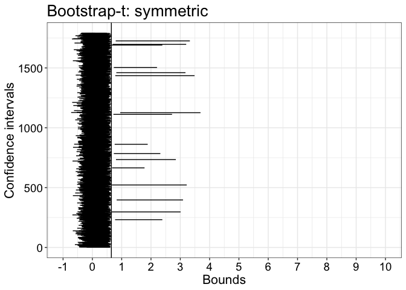
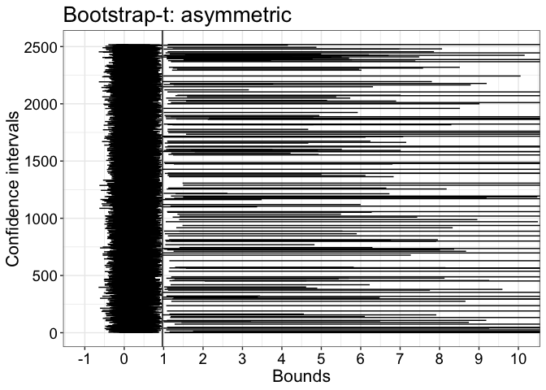

One-sample bootstrap-t confidence intervals: coverage, width, shift
================
Guillaume A. Rousselet
2019-07-25

# Dependencies

``` r
library(tibble)
library(ggplot2)
library(cowplot)
source("./functions/theme_gar.txt")
source("./functions/fun.txt")
library(beepr)
```

``` r
sessionInfo()
```

    ## R version 3.5.2 (2018-12-20)
    ## Platform: x86_64-apple-darwin15.6.0 (64-bit)
    ## Running under: macOS Mojave 10.14.4
    ## 
    ## Matrix products: default
    ## BLAS: /Library/Frameworks/R.framework/Versions/3.5/Resources/lib/libRblas.0.dylib
    ## LAPACK: /Library/Frameworks/R.framework/Versions/3.5/Resources/lib/libRlapack.dylib
    ## 
    ## locale:
    ## [1] en_GB.UTF-8/en_GB.UTF-8/en_GB.UTF-8/C/en_GB.UTF-8/en_GB.UTF-8
    ## 
    ## attached base packages:
    ## [1] stats     graphics  grDevices utils     datasets  methods   base     
    ## 
    ## other attached packages:
    ## [1] beepr_1.3     cowplot_0.9.4 ggplot2_3.1.1 tibble_2.1.1 
    ## 
    ## loaded via a namespace (and not attached):
    ##  [1] Rcpp_1.0.1       knitr_1.23       magrittr_1.5     tidyselect_0.2.5
    ##  [5] munsell_0.5.0    colorspace_1.4-1 R6_2.4.0         rlang_0.3.4     
    ##  [9] stringr_1.4.0    plyr_1.8.4       dplyr_0.8.0.1    tools_3.5.2     
    ## [13] grid_3.5.2       gtable_0.3.0     xfun_0.8         audio_0.1-5.1   
    ## [17] withr_2.1.2      htmltools_0.3.6  yaml_2.2.0       lazyeval_0.2.2  
    ## [21] digest_0.6.18    assertthat_0.2.1 crayon_1.3.4     purrr_0.3.2     
    ## [25] glue_1.3.1       evaluate_0.13    rmarkdown_1.13   stringi_1.4.3   
    ## [29] compiler_3.5.2   pillar_1.3.1     scales_1.0.0     pkgconfig_2.0.2

These simulations are based on code from a previous
[post](https://garstats.wordpress.com/2019/07/11/ttestcov/) on the
coverage of confidence intervals.

# Declare custom functions

Modified from Rand Wilcox’s original functions, which are available
[here](http://dornsife.usc.edu/labs/rwilcox/software/).

## Modify `trimci` to return confidence interval only

``` r
#  Compute a 1-alpha confidence interval for the trimmed mean
#  The default amount of trimming is tr=.2
trimci <- function(x, tr=.2, alpha=.05){
  se <- sqrt(winvar(x,tr))/((1-2*tr)*sqrt(length(x)))
  trimci <- vector(mode="numeric",length=2)
  df <- length(x)-2*floor(tr*length(x))-1
  trimci[1] <- mean(x,tr)-qt(1-alpha/2,df)*se
  trimci[2] <- mean(x,tr)+qt(1-alpha/2,df)*se
  trimci
}
```

## Modify `trimcibt` to return confidence interval only

Return both symmetric and asymmetric confidence intervals

``` r
#  The default amount of trimming is tr=0.2
cibt <- function (x, tr=0.2, alpha=.05, nboot=599){
  # test <- (mean(x,tr)-nullval)/trimse(x,tr)
  data <- matrix(sample(x,size=length(x)*nboot,replace=TRUE),nrow=nboot)
  data <- data-mean(x,tr)
  top <- apply(data,1,mean,tr)
  bot <- apply(data,1,trimse,tr)
  tval <- top/bot
  icrit <- round((1-alpha)*nboot)
  ibot <- round(alpha*nboot/2)
  itop <- nboot-ibot #altered code very slightly to correspond to recent versions of my books.
  # yields an equal-tailed (asymmetric) confidence interval
  tval <- sort(tval)
  ci.asym <- c(0, 0)
    ci.asym[1] <- mean(x,tr)-tval[itop]*trimse(x,tr)
    ci.asym[2] <- mean(x,tr)-tval[ibot]*trimse(x,tr)
  # symmetric two-sided method
    tval <- abs(tval)
    tval <- sort(tval)
    ci.sym <- c(0, 0)
    ci.sym[1] <- mean(x,tr)-tval[icrit]*trimse(x,tr)
    ci.sym[2] <- mean(x,tr)+tval[icrit]*trimse(x,tr)
    # p.value<-(sum(abs(test)<=abs(tval)))/nboot
  list(ci.asym = ci.asym, ci.sym = ci.sym)
}
```

# Test with normal distribution (g=h=0)

We sample with replacement from a normal population. Each sample has
size n=30. Confidence intervals are computed for the mean using the
standard parametric method, the percentile bootstrap and the bootstrap-t
technique.

``` r
set.seed(666) # reproducible results
nsim <- 20000 # simulation iterations
nsamp <- 30 # sample size
pop <- ghdist(1000000, g=0, h=0) # define population
pop.m <- mean(pop) # population mean
tr <- 0 # no trimming, use the mean
nboot <- 599 # number of bootstrap samples

# declare matrices of results
ci.cov <- matrix(0, nrow = nsim, ncol = 4)
ci.all <- array(0, dim = c(nsim, 4, 2))
ci.wid <- matrix(0, nrow = nsim, ncol = 4)
ci.dis <- matrix(NA, nrow = nsim, ncol = 4)

for(S in 1:nsim){ # simulation loop
  if(S %% 5000 == 0){
    beep(2)
    print(paste0("g=0 sim ",S," / ",nsim,"..."))
    }
  samp <- sample(pop, nsamp, replace = TRUE) # random sample from population
  # T-test ===================================
  ci <- t.test(samp, mu = pop.m)$conf.int # standard t-test equation
  ci.all[S,1,] <- ci
  ci.cov[S,1] <- cover(ci, pop.m) # CI includes population value?
  ci.wid[S,1] <- ci[2] - ci[1]
  if(ci.cov[S,1] == 0){ # direction of discrepancy?
    if(pop.m > ci[2]){
      ci.dis[S,1] <- -1 # left shift
    }
    if(pop.m < ci[1]){
      ci.dis[S,1] <- 1 # right shift
    }
  }
  # Percentile bootstrap =======================
   ci <- quantile(apply(matrix(sample(samp, n*nboot, replace=TRUE), nrow=nboot), 1, mean, trim = tr), probs = c(0.025, 0.975), type = 6)
  ci.all[S,2,] <- ci
  ci.cov[S,2] <- cover(ci, pop.m) # CI includes population value?
  ci.wid[S,2] <- ci[2] - ci[1]
  if(ci.cov[S,2] == 0){ # direction of discrepancy?
    if(pop.m > ci[2]){
      ci.dis[S,2] <- -1 # left shift
    }
    if(pop.m < ci[1]){
      ci.dis[S,2] <- 1 # right shift
    }
  }
  # Bootstrap-t technique =======================
  out <- cibt(samp, nboot = nboot, tr = tr)
  ## Asymmetric CI
    ci <- out$ci.asym
  ci.all[S,3,] <- ci
  ci.cov[S,3] <- cover(ci, pop.m) # CI includes population value?
  ci.wid[S,3] <- ci[2] - ci[1]
  if(ci.cov[S,3] == 0){ # direction of discrepancy?
    if(pop.m > ci[2]){
      ci.dis[S,3] <- -1 # left shift
    }
    if(pop.m < ci[1]){
      ci.dis[S,3] <- 1 # right shift
    }
  }
  ## Symmetric CI
  ci <- out$ci.sym
  ci.all[S,4,] <- ci
  ci.cov[S,4] <- cover(ci, pop.m) # CI includes population value?
  ci.wid[S,4] <- ci[2] - ci[1]
  if(ci.cov[S,4] == 0){ # direction of discrepancy?
    if(pop.m > ci[2]){
      ci.dis[S,4] <- -1 # left shift
    }
    if(pop.m < ci[1]){
      ci.dis[S,4] <- 1 # right shift
    }
  }
}

# save simulation results to load in next chunk
save(ci.cov, ci.wid, ci.dis, ci.all, pop.m,
     file = "./data/cov_test_g0h0.RData")
beep(8)
```

## Check averages across simulations

The coverage is close to nominal (95%) for every method.

``` r
load(file = "./data/cov_test_g0h0.RData")
# CI coverage
round(apply(ci.cov, 2, mean), digits = 3) 
```

    ## [1] 0.949 0.935 0.948 0.950

Intervals have similar sizes for all methods. Percentile bootstrap
intervals tended to be the shortest.

``` r
# CI width
round(apply(ci.wid, 2, median), digits = 3) 
```

    ## [1] 0.739 0.700 0.742 0.740

For CIs that did not include the population, the distribution is fairly
balanced between the left and the right of the population.

``` r
# CI average shift: 
# ~0 = balanced
# negative = left shift
# positive = right shift
round(apply(ci.dis, 2, mean, na.rm = TRUE), digits = 3)
```

    ## [1] -0.013  0.015  0.010 -0.008

``` r
# apply(ci.dis==-1, 2, sum, na.rm = TRUE) 
# apply(ci.dis==1, 2, sum, na.rm = TRUE)
```

## Illustrate CI that did not include the population

### Standard CI

``` r
pop <- pop.m
cond <- 1
ci <- ci.all[ci.cov[,cond]==0, cond,]
df <- tibble(x1 = ci[,1],
             x2 = ci[,2],
             y = seq(1,length(x1)))

p <- ggplot(df, aes(x = x1, xend = x2, y = y, yend = y)) + theme_gar +
  geom_segment() +
  geom_vline(xintercept = pop) +
labs(x = "Bounds", y = "Confidence intervals") +
  coord_cartesian(xlim = c(-1.5, 1.5),
                  ylim = c(1, length(df$x1)), expand = TRUE) +
  scale_x_continuous(breaks = seq(-2, 2, 0.5)) +
  ggtitle("Standard CI")
p
```

<!-- -->

``` r
pA <- p
```

Out of 20,000 simulated experiments, about 1,000 CI (roughly 5%) did not
include the population value. About the same number of CIs were shifted
to the left and to the right of the population value. The same result
was observed for the other methods.

``` r
apply(ci.dis==-1, 2, sum, na.rm = TRUE)
```

    ## [1] 517 643 519 509

``` r
apply(ci.dis==1, 2, sum, na.rm = TRUE)
```

    ## [1] 504 662 529 501

### Percentile bootstrap

``` r
cond <- 2 
ci <- ci.all[ci.cov[,cond]==0, cond,]
df <- tibble(x1 = ci[,1],
             x2 = ci[,2],
             y = seq(1,length(x1)))

p <- ggplot(df, aes(x = x1, xend = x2, y = y, yend = y)) + theme_gar +
  geom_segment() +
  geom_vline(xintercept = pop) +
labs(x = "Bounds", y = "Confidence intervals") +
  coord_cartesian(xlim = c(-1.5, 1.5),
                  ylim = c(1, length(df$x1)), expand = TRUE) +
  scale_x_continuous(breaks = seq(-2, 2, 0.5)) +
  ggtitle("Percentile bootstrap") 
p
```

<!-- -->

``` r
pB <- p
```

### Bootstrap-t: asymmetric

``` r
cond <- 3
ci <- ci.all[ci.cov[,cond]==0, cond,]
df <- tibble(x1 = ci[,1],
             x2 = ci[,2],
             y = seq(1,length(x1)))

p <- ggplot(df, aes(x = x1, xend = x2, y = y, yend = y)) + theme_gar +
  geom_segment() +
  geom_vline(xintercept = pop) +
labs(x = "Bounds", y = "Confidence intervals") +
  coord_cartesian(xlim = c(-1.5, 1.5),
                  ylim = c(1, length(df$x1)), expand = TRUE) +
  scale_x_continuous(breaks = seq(-2, 2, 0.5)) +
  ggtitle("Bootstrap-t: asymmetric") 
p
```

<!-- -->

``` r
pC <- p
```

### Bootstrap-t: symmetric

``` r
cond <- 4 
ci <- ci.all[ci.cov[,cond]==0, cond,]
df <- tibble(x1 = ci[,1],
             x2 = ci[,2],
             y = seq(1,length(x1)))

p <- ggplot(df, aes(x = x1, xend = x2, y = y, yend = y)) + theme_gar +
  geom_segment() +
  geom_vline(xintercept = pop) +
labs(x = "Bounds", y = "Confidence intervals") +
  coord_cartesian(xlim = c(-1.5, 1.5),
                  ylim = c(1, length(df$x1)), expand = TRUE) +
  scale_x_continuous(breaks = seq(-2, 2, 0.5)) +
  ggtitle("Bootstrap-t: symmetric") 
p
```

<!-- -->

``` r
pD <- p
```

## Summary figure

``` r
cowplot::plot_grid(pA, pB, pC, pD,
                   labels = c("A", "B", "C", "D"), 
                   nrow = 2)

# save figure
ggsave(filename=('./figures/figure_g0h0_ci.png'),width=15,height=10)
```

# Test with g=1 & h=0 distribution

What happens for a skewed population?

``` r
set.seed(666) # reproducible results
nsim <- 20000 # simulation iterations
nsamp <- 30 # sample size
pop <- ghdist(1000000, g=1, h=0) # define population
pop.m <- mean(pop) # population mean
tr <- 0 # no trimming, use the mean
nboot <- 599 # number of bootstrap samples

# declare matrices of results
ci.cov <- matrix(0, nrow = nsim, ncol = 4)
ci.all <- array(0, dim = c(nsim, 4, 2))
ci.wid <- matrix(0, nrow = nsim, ncol = 4)
ci.dis <- matrix(NA, nrow = nsim, ncol = 4)

for(S in 1:nsim){ # simulation loop
  if(S %% 5000 == 0){
    beep(2)
    print(paste0("g=1 sim ",S," / ",nsim,"..."))
    }
  samp <- sample(pop, nsamp, replace = TRUE) # random sample from population
  # T-test ===================================
  ci <- t.test(samp, mu = pop.m)$conf.int # standard t-test equation
  ci.all[S,1,] <- ci
  ci.cov[S,1] <- cover(ci, pop.m) # CI includes population value?
  ci.wid[S,1] <- ci[2] - ci[1]
  if(ci.cov[S,1] == 0){ # direction of discrepancy?
    if(pop.m > ci[2]){
      ci.dis[S,1] <- -1 # left shift
    }
    if(pop.m < ci[1]){
      ci.dis[S,1] <- 1 # right shift
    }
  }
  # Percentile bootstrap =======================
   ci <- quantile(apply(matrix(sample(samp, n*nboot, replace=TRUE), nrow=nboot), 1, mean, trim = tr), probs = c(0.025, 0.975), type = 6)
  ci.all[S,2,] <- ci
  ci.cov[S,2] <- cover(ci, pop.m) # CI includes population value?
  ci.wid[S,2] <- ci[2] - ci[1]
  if(ci.cov[S,2] == 0){ # direction of discrepancy?
    if(pop.m > ci[2]){
      ci.dis[S,2] <- -1 # left shift
    }
    if(pop.m < ci[1]){
      ci.dis[S,2] <- 1 # right shift
    }
  }
  # Bootstrap-t technique =======================
  out <- cibt(samp, nboot = nboot, tr = tr)
  ## Asymmetric CI
    ci <- out$ci.asym
  ci.all[S,3,] <- ci
  ci.cov[S,3] <- cover(ci, pop.m) # CI includes population value?
  ci.wid[S,3] <- ci[2] - ci[1]
  if(ci.cov[S,3] == 0){ # direction of discrepancy?
    if(pop.m > ci[2]){
      ci.dis[S,3] <- -1 # left shift
    }
    if(pop.m < ci[1]){
      ci.dis[S,3] <- 1 # right shift
    }
  }
  ## Symmetric CI
    ci <- out$ci.sym
  ci.all[S,4,] <- ci
  ci.cov[S,4] <- cover(ci, pop.m) # CI includes population value?
  ci.wid[S,4] <- ci[2] - ci[1]
  if(ci.cov[S,4] == 0){ # direction of discrepancy?
    if(pop.m > ci[2]){
      ci.dis[S,4] <- -1 # left shift
    }
    if(pop.m < ci[1]){
      ci.dis[S,4] <- 1 # right shift
    }
  }
}

# save simulation results to load in next chunk
save(ci.cov, ci.wid, ci.dis, ci.all, pop.m,
     file = "./data/cov_test_g1h0.RData")
beep(8)
```

## Check averages across simulations

``` r
load(file = "./data/cov_test_g1h0.RData")
# CI coverage
round(apply(ci.cov, 2, mean), digits = 3) 
```

    ## [1] 0.883 0.880 0.923 0.910

``` r
# CI width
round(apply(ci.wid, 2, median), digits = 3)  
```

    ## [1] 1.256 1.184 1.495 1.544

``` r
# CI average shift: 
# ~0 = balanced
# negative = left shift
# positive = right shift
round(apply(ci.dis, 2, mean, na.rm = TRUE), digits = 3)  
```

    ## [1] -0.968 -0.846 -0.588 -0.982

``` r
# Frequency of left shifts
apply(ci.dis==-1, 2, sum, na.rm = TRUE) 
```

    ## [1] 2306 2212 1224 1775

``` r
# Frequency of right shifts
apply(ci.dis==1, 2, sum, na.rm = TRUE)
```

    ## [1]  38 184 318  16

Coverage is lower than expected for all methods. Coverage is about 88%
for the standard and percentile bootstrap CIs, 92.3% for the asymmetric
bootstrap-t CIs, and 91% for the symmetric bootstrap-t CIs.

CIs are larger for the bootstrap-t CIs relative to the standard and
percentile bootstrap CIs, as we observed in notebook `ptb`.

CIs that did not include the population value tended to be shifted to
the left of the population value, and more so for the standard CIs and
the bootstrap-t symmetric CIs.

## Illustrate CIs that did not include the population

### Standard CI

``` r
pop <- pop.m
cond <- 1
ci <- ci.all[ci.cov[,cond]==0, cond,]
df <- tibble(x1 = ci[,1],
             x2 = ci[,2],
             y = seq(1,length(x1)))

p <- ggplot(df, aes(x = x1, xend = x2, y = y, yend = y)) + theme_gar +
  geom_segment() +
  geom_vline(xintercept = pop) +
labs(x = "Bounds", y = "Confidence intervals") +
  coord_cartesian(xlim = c(-1, 10),
                  ylim = c(1, length(df$x1)), expand = TRUE) +
  scale_x_continuous(breaks = seq(-2, 10, 1)) +
  ggtitle("Standard CI")
p
```

<!-- -->

``` r
pA <- p
```

The figure illustrates the strong imbalance between left and right CI
shifts.

``` r
apply(ci.dis==-1, 2, sum, na.rm = TRUE)
```

    ## [1] 2306 2212 1224 1775

``` r
apply(ci.dis==1, 2, sum, na.rm = TRUE)
```

    ## [1]  38 184 318  16

### Percentile bootstrap

``` r
cond <- 2 
ci <- ci.all[ci.cov[,cond]==0, cond,]
df <- tibble(x1 = ci[,1],
             x2 = ci[,2],
             y = seq(1,length(x1)))

p <- ggplot(df, aes(x = x1, xend = x2, y = y, yend = y)) + theme_gar +
  geom_segment() +
  geom_vline(xintercept = pop) +
labs(x = "Bounds", y = "Confidence intervals") +
  coord_cartesian(xlim = c(-1, 10),
                  ylim = c(1, length(df$x1)), expand = TRUE) +
  scale_x_continuous(breaks = seq(-2, 10, 1)) +
  ggtitle("Percentile bootstrap") 
p
```

<!-- -->

``` r
pB <- p
```

### Bootstrap-t: asymmetric

``` r
cond <- 3
ci <- ci.all[ci.cov[,cond]==0, cond,]
df <- tibble(x1 = ci[,1],
             x2 = ci[,2],
             y = seq(1,length(x1)))

p <- ggplot(df, aes(x = x1, xend = x2, y = y, yend = y)) + theme_gar +
  geom_segment() +
  geom_vline(xintercept = pop) +
labs(x = "Bounds", y = "Confidence intervals") +
  coord_cartesian(xlim = c(-1, 10),
                  ylim = c(1, length(df$x1)), expand = TRUE) +
  scale_x_continuous(breaks = seq(-2, 10, 1)) +
  ggtitle("Bootstrap-t: asymmetric") 
p
```

<!-- -->

``` r
pC <- p
```

### Bootstrap-t: symmetric

``` r
cond <- 4 
ci <- ci.all[ci.cov[,cond]==0, cond,]
df <- tibble(x1 = ci[,1],
             x2 = ci[,2],
             y = seq(1,length(x1)))

p <- ggplot(df, aes(x = x1, xend = x2, y = y, yend = y)) + theme_gar +
  geom_segment() +
  geom_vline(xintercept = pop) +
labs(x = "Bounds", y = "Confidence intervals") +
  coord_cartesian(xlim = c(-1, 10),
                  ylim = c(1, length(df$x1)), expand = TRUE) +
  scale_x_continuous(breaks = seq(-2, 10, 1)) +
  ggtitle("Bootstrap-t: symmetric") 
p
```

<!-- -->

``` r
pD <- p
```

## Summary figure

``` r
cowplot::plot_grid(pA, pB, pC, pD,
                   labels = c("A", "B", "C", "D"), 
                   nrow = 2)

# save figure
ggsave(filename=('./figures/figure_g1h0_ci.png'),width=15,height=10)
```

# Test with g=1 & h=0.2 distribution

What happens if we sample from a skewed distribution (`g=1`) in which
outliers are likely(`h=0.2`)?

``` r
set.seed(666) # reproducible results
nsim <- 20000 # simulation iterations
nsamp <- 30 # sample size
pop <- ghdist(1000000, g=1, h=0.2) # define population
pop.m <- mean(pop) # population mean
tr <- 0 # no trimming, use the mean
nboot <- 599 # number of bootstrap samples

# declare matrices of results
ci.cov <- matrix(0, nrow = nsim, ncol = 4)
ci.all <- array(0, dim = c(nsim, 4, 2))
ci.wid <- matrix(0, nrow = nsim, ncol = 4)
ci.dis <- matrix(NA, nrow = nsim, ncol = 4)

for(S in 1:nsim){ # simulation loop
  if(S %% 5000 == 0){
    beep(2)
    print(paste0("g=1 sim ",S," / ",nsim,"..."))
    }
  samp <- sample(pop, nsamp, replace = TRUE) # random sample from population
  # T-test ===================================
  ci <- t.test(samp, mu = pop.m)$conf.int # standard t-test equation
  ci.all[S,1,] <- ci
  ci.cov[S,1] <- cover(ci, pop.m) # CI includes population value?
  ci.wid[S,1] <- ci[2] - ci[1]
  if(ci.cov[S,1] == 0){ # direction of discrepancy?
    if(pop.m > ci[2]){
      ci.dis[S,1] <- -1 # left shift
    }
    if(pop.m < ci[1]){
      ci.dis[S,1] <- 1 # right shift
    }
  }
  # Percentile bootstrap =======================
   ci <- quantile(apply(matrix(sample(samp, n*nboot, replace=TRUE), nrow=nboot), 1, mean, trim = tr), probs = c(0.025, 0.975), type = 6)
  ci.all[S,2,] <- ci
  ci.cov[S,2] <- cover(ci, pop.m) # CI includes population value?
  ci.wid[S,2] <- ci[2] - ci[1]
  if(ci.cov[S,2] == 0){ # direction of discrepancy?
    if(pop.m > ci[2]){
      ci.dis[S,2] <- -1 # left shift
    }
    if(pop.m < ci[1]){
      ci.dis[S,2] <- 1 # right shift
    }
  }
  # Bootstrap-t technique =======================
  out <- cibt(samp, nboot = nboot, tr = tr)
  ## Asymmetric CI
    ci <- out$ci.asym
  ci.all[S,3,] <- ci
  ci.cov[S,3] <- cover(ci, pop.m) # CI includes population value?
  ci.wid[S,3] <- ci[2] - ci[1]
  if(ci.cov[S,3] == 0){ # direction of discrepancy?
    if(pop.m > ci[2]){
      ci.dis[S,3] <- -1 # left shift
    }
    if(pop.m < ci[1]){
      ci.dis[S,3] <- 1 # right shift
    }
  }
  ## Symmetric CI
    ci <- out$ci.sym
  ci.all[S,4,] <- ci
  ci.cov[S,4] <- cover(ci, pop.m) # CI includes population value?
  ci.wid[S,4] <- ci[2] - ci[1]
  if(ci.cov[S,4] == 0){ # direction of discrepancy?
    if(pop.m > ci[2]){
      ci.dis[S,4] <- -1 # left shift
    }
    if(pop.m < ci[1]){
      ci.dis[S,4] <- 1 # right shift
    }
  }
}

# save simulation results to load in next chunk
save(ci.cov, ci.wid, ci.dis, ci.all, pop.m,
     file = "./data/cov_test_g1h02.RData")
beep(8)
```

## Check averages across simulations

``` r
load(file = "./data/cov_test_g1h02.RData")
# CI coverage
round(apply(ci.cov, 2, mean), digits = 3) 
```

    ## [1] 0.801 0.804 0.874 0.844

``` r
# CI width
round(apply(ci.wid, 2, median), digits = 3)  
```

    ## [1] 1.741 1.635 2.233 2.384

``` r
# CI average shift: 
# ~0 = balanced
# negative = left shift
# positive = right shift
round(apply(ci.dis, 2, mean, na.rm = TRUE), digits = 3)  
```

    ## [1] -0.997 -0.957 -0.867 -0.999

``` r
# Frequency of left shifts
apply(ci.dis==-1, 2, sum, na.rm = TRUE) 
```

    ## [1] 3980 3838 2351 3118

``` r
# Frequency of right shifts
apply(ci.dis==1, 2, sum, na.rm = TRUE)
```

    ## [1]   5  84 167   1

The results are similar to those observed for `h=0`, only exacerbated.

## Illustrate CI that did not include the population

### Standard CI

``` r
pop <- pop.m
cond <- 1
ci <- ci.all[ci.cov[,cond]==0, cond,]
df <- tibble(x1 = ci[,1],
             x2 = ci[,2],
             y = seq(1,length(x1)))

p <- ggplot(df, aes(x = x1, xend = x2, y = y, yend = y)) + theme_gar +
  geom_segment() +
  geom_vline(xintercept = pop) +
labs(x = "Bounds", y = "Confidence intervals") +
  coord_cartesian(xlim = c(-1, 10),
                  ylim = c(1, length(df$x1)), expand = TRUE) +
  scale_x_continuous(breaks = seq(-2, 10, 1)) +
  ggtitle("Standard CI")
p
```

<!-- -->

``` r
pA <- p
```

The figure illustrates the strong imbalance between left and right CI
shifts.

``` r
apply(ci.dis==-1, 2, sum, na.rm = TRUE)
```

    ## [1] 3980 3838 2351 3118

``` r
apply(ci.dis==1, 2, sum, na.rm = TRUE)
```

    ## [1]   5  84 167   1

### Percentile bootstrap

``` r
cond <- 2 
ci <- ci.all[ci.cov[,cond]==0, cond,]
df <- tibble(x1 = ci[,1],
             x2 = ci[,2],
             y = seq(1,length(x1)))

p <- ggplot(df, aes(x = x1, xend = x2, y = y, yend = y)) + theme_gar +
  geom_segment() +
  geom_vline(xintercept = pop) +
labs(x = "Bounds", y = "Confidence intervals") +
  coord_cartesian(xlim = c(-1, 10),
                  ylim = c(1, length(df$x1)), expand = TRUE) +
  scale_x_continuous(breaks = seq(-2, 10, 1)) +
  ggtitle("Percentile bootstrap") 
p
```

<!-- -->

``` r
pB <- p
```

### Bootstrap-t: asymmetric

``` r
cond <- 3
ci <- ci.all[ci.cov[,cond]==0, cond,]
df <- tibble(x1 = ci[,1],
             x2 = ci[,2],
             y = seq(1,length(x1)))

p <- ggplot(df, aes(x = x1, xend = x2, y = y, yend = y)) + theme_gar +
  geom_segment() +
  geom_vline(xintercept = pop) +
labs(x = "Bounds", y = "Confidence intervals") +
  coord_cartesian(xlim = c(-1, 10),
                  ylim = c(1, length(df$x1)), expand = TRUE) +
  scale_x_continuous(breaks = seq(-2, 10, 1)) +
  ggtitle("Bootstrap-t: asymmetric") 
p
```

<!-- -->

``` r
pC <- p
```

### Bootstrap-t: symmetric

``` r
cond <- 4 
ci <- ci.all[ci.cov[,cond]==0, cond,]
df <- tibble(x1 = ci[,1],
             x2 = ci[,2],
             y = seq(1,length(x1)))

p <- ggplot(df, aes(x = x1, xend = x2, y = y, yend = y)) + theme_gar +
  geom_segment() +
  geom_vline(xintercept = pop) +
labs(x = "Bounds", y = "Confidence intervals") +
  coord_cartesian(xlim = c(-1, 10),
                  ylim = c(1, length(df$x1)), expand = TRUE) +
  scale_x_continuous(breaks = seq(-2, 10, 1)) +
  ggtitle("Bootstrap-t: symmetric") 
p
```

<!-- -->

``` r
pD <- p
```

## Summary figure

``` r
cowplot::plot_grid(pA, pB, pC, pD,
                   labels = c("A", "B", "C", "D"), 
                   nrow = 2)

# save figure
ggsave(filename=('./figures/figure_g1h02_ci.png'),width=15,height=10)
```
