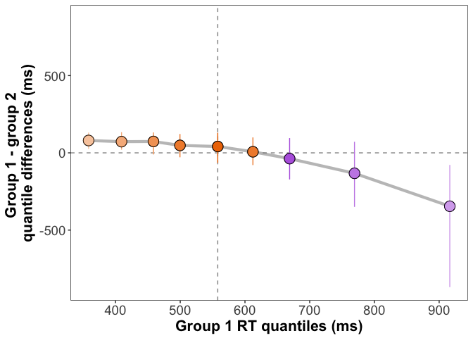
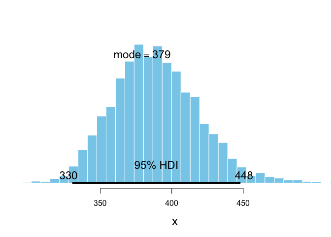

Bayesian shift function
================
Guillaume A. Rousselet
2018-04-06

-   [Dependencies](#dependencies)
-   [Functions](#functions)
-   [Make data](#make-data)
    -   [Illustrate data](#illustrate-data)
    -   [OLS fit](#ols-fit)
    -   [Shift function](#shift-function)
-   [Strategy 1: Bayesian bootstrap](#strategy-1-bayesian-bootstrap)
    -   [Plot results](#plot-results)
-   [Strategy 2: Bayesian quantile regression](#strategy-2-bayesian-quantile-regression)
    -   [Bayesian model using quantile regression](#bayesian-model-using-quantile-regression)
    -   [Check chains](#check-chains)
    -   [Posterior samples: posterior predictive checks](#posterior-samples-posterior-predictive-checks)
    -   [Full shift function using asym\_laplace](#full-shift-function-using-asym_laplace)
    -   [Plot results](#plot-results-1)
-   [Strategy 3: Bayesian model with exGaussians](#strategy-3-bayesian-model-with-exgaussians)
    -   [Get matrix yrep of draws from the posterior distributions](#get-matrix-yrep-of-draws-from-the-posterior-distributions)
    -   [Medians per group](#medians-per-group)
    -   [Full shift function using posterior distributions from exGaussian fits](#full-shift-function-using-posterior-distributions-from-exgaussian-fits)
    -   [Plot results](#plot-results-2)

Dependencies
============

``` r
library(brms)
```

    ## Loading required package: Rcpp

    ## Loading required package: ggplot2

    ## Loading 'brms' package (version 2.1.0). Useful instructions
    ## can be found by typing help('brms'). A more detailed introduction
    ## to the package is available through vignette('brms_overview').
    ## Run theme_set(theme_default()) to use the default bayesplot theme.

``` r
library(tibble)
library(HDInterval)
library(bayesplot)
```

    ## This is bayesplot version 1.4.0

    ## - Plotting theme set to bayesplot::theme_default()

    ## - Online documentation at mc-stan.org/bayesplot

``` r
library(BEST)
library(bayesboot) 
```

    ## 
    ## Attaching package: 'bayesboot'

    ## The following object is masked from 'package:BEST':
    ## 
    ##     plotPost

``` r
library(viridis)
```

    ## Loading required package: viridisLite

``` r
# install.packages("devtools")
# devtools::install_github("GRousselet/rogme")
library(rogme)
```

Functions
=========

``` r
getmode <- function(x){
  mcmcDensity = density(x)
  res = mcmcDensity$x[which.max(mcmcDensity$y)]
  res
}

hd.diff <- function(df, q=0.5){
  res <- rogme::hd(df$g1, q=q) - rogme::hd(df$g2, q=q)
  res
}
```

Make data
=========

``` r
set.seed(21)
n <- 100
gp1 <- rexgaussian(n, mu = 400, sigma = 100, beta = 200)
gp2 <- rexgaussian(n, mu = 250, sigma = 100, beta = 350)

df <- tibble(GP = factor(c(rep(1, length(gp1)),rep(2, length(gp2)))),
             RT = c(gp1, gp2))
summary(gp1)
```

    ##    Min. 1st Qu.  Median    Mean 3rd Qu.    Max. 
    ##   201.4   437.7   567.3   596.0   700.6  1261.2

``` r
summary(gp2)
```

    ##    Min. 1st Qu.  Median    Mean 3rd Qu.    Max. 
    ##   126.4   361.6   512.7   660.6   757.8  2556.7

``` r
round(quantile(gp1, probs = seq(.1,.9,.1)))
```

    ## 10% 20% 30% 40% 50% 60% 70% 80% 90% 
    ## 373 410 465 498 567 609 664 761 917

``` r
round(quantile(gp2, probs = seq(.1,.9,.1)))
```

    ##  10%  20%  30%  40%  50%  60%  70%  80%  90% 
    ##  283  341  378  457  513  600  697  850 1112

Illustrate data
---------------

``` r
p <- ggplot(df, aes(RT)) + theme_classic() +
  geom_density(aes(colour = GP), size = 2) +
  # geom_abline(intercept=0, slope=0, colour="black") +
  scale_color_viridis(discrete = TRUE) +
  coord_cartesian(xlim = c(0, 2500)) +
  # scale_x_continuous(breaks=nvec) + 
  # scale_y_continuous(limits=c(0,22), breaks=seq(0,22,5)) +
  theme(plot.title = element_text(size=22),
        axis.title.x = element_text(size = 18),
        axis.text.x = element_text(size = 14, colour="black"),
        axis.text.y = element_text(size = 16, colour="black"),
        axis.title.y = element_text(size = 18),
        legend.key.width = unit(1.5,"cm"),
        legend.position = c(0.5,0.85),
        legend.direction = "vertical",
        legend.text=element_text(size=16),
        legend.title=element_text(size=18),
        panel.background = element_rect(fill = 'grey', colour = 'black')) +
  labs(x = "Reaction times in ms", y = "Density") +
  # guides(colour = guide_legend(override.aes = list(size=3))) + # make thicker legend lines
  ggtitle("Two exGaussian distributions") 
p
```


``` r
# save figure
ggsave(filename='figure_data.pdf',width=7,height=5) #path=pathname
```

``` r
t.test(gp1, gp2)
```

    ## 
    ##  Welch Two Sample t-test
    ## 
    ## data:  gp1 and gp2
    ## t = -1.2624, df = 141.53, p-value = 0.2089
    ## alternative hypothesis: true difference in means is not equal to 0
    ## 95 percent confidence interval:
    ##  -165.82507   36.57674
    ## sample estimates:
    ## mean of x mean of y 
    ##  595.9778  660.6019

OLS fit
-------

``` r
olsmod <- lm(RT ~ GP, data = df)
summary(olsmod)
```

    ## 
    ## Call:
    ## lm(formula = RT ~ GP, data = df)
    ## 
    ## Residuals:
    ##     Min      1Q  Median      3Q     Max 
    ## -534.19 -219.13  -83.03  104.61 1896.12 
    ## 
    ## Coefficients:
    ##             Estimate Std. Error t value Pr(>|t|)    
    ## (Intercept)   595.98      36.20  16.464   <2e-16 ***
    ## GP2            64.62      51.19   1.262    0.208    
    ## ---
    ## Signif. codes:  0 '***' 0.001 '**' 0.01 '*' 0.05 '.' 0.1 ' ' 1
    ## 
    ## Residual standard error: 362 on 198 degrees of freedom
    ## Multiple R-squared:  0.007984,   Adjusted R-squared:  0.002974 
    ## F-statistic: 1.594 on 1 and 198 DF,  p-value: 0.2083

Shift function
--------------

``` r
df <- rogme::mkt2(gp1, gp2)
# compute shift function
sf <- rogme::shifthd_pbci(data = df, formula = obs ~ gr, nboot = 200)[,4:8]

# plot shift function
psf <- plot_sf(sf, plot_theme = 2)
```

    ## Scale for 'alpha' is already present. Adding another scale for 'alpha',
    ## which will replace the existing scale.

``` r
# change axis labels
psf <- psf +
  labs(x = "Group 1 RT quantiles (ms)",
       y = "Group 1 - group 2 \nquantile differences (ms)")

# add labels for deciles 1 & 9
psf <- add_sf_lab(psf, sf, y_lab_nudge = 100)
psf
```


``` r
# save figure
ggsave(filename='figure_sf.pdf',width=7,height=5) #path=pathname
```

Strategy 1: Bayesian bootstrap
==============================

A great explanation of the Bayesian bootstrap is provided in these two blog posts by Rasmus Bååth:

<http://www.sumsar.net/blog/2015/04/the-non-parametric-bootstrap-as-a-bayesian-model/> <http://www.sumsar.net/blog/2015/07/easy-bayesian-bootstrap-in-r/>

There is also a movie! <http://www.sumsar.net/blog/2016/07/bayesian-bootstrap-the-movie/>

``` r
df <- tibble(g1 = gp1, g2 = gp2)
qseq <- seq(0.1, 0.9, 0.1)
bbres <- tibble(Group1 = vector(mode = "numeric", length = 9),
                Group2 = vector(mode = "numeric", length = 9),
                difference = vector(mode = "numeric", length = 9),
                ci_lower = vector(mode = "numeric", length = 9),
                ci_upper = vector(mode = "numeric", length = 9))
for(S in 1:9){
  # Harrell-Davis quantile estimate for group 1
  bbres$Group1[S] <- rogme::hd(gp1, q=qseq[S])
  # Harrell-Davis quantile estimate for group 2
  bbres$Group2[S] <- rogme::hd(gp2, q=qseq[S])
  # difference
  bbres$difference[S] <- bbres$Group1[S] - bbres$Group2[S]
  
res <- bayesboot::bayesboot(data = df, 
                            statistic = hd.diff,
                            R = 1000,
                            R2 = 1000,
                            use.weights = FALSE,
                            q = qseq[S])
tmp <- hdi(res)
bbres$ci_lower[S] <- tmp[1]
bbres$ci_upper[S] <- tmp[2]
}
```

To check bayesboot posterior distributions:

``` r
plot(res)
```


``` r
summary(res)
```

    ## Bayesian bootstrap
    ## 
    ## Number of posterior draws: 1000 
    ## 
    ## Summary of the posterior (with 95% Highest Density Intervals):
    ##  statistic     mean       sd   hdi.low  hdi.high
    ##         V1 -333.926 216.8413 -869.0587 -78.27945
    ## 
    ## Quantiles:
    ##  statistic   q2.5%      q25%   median      q75%    q97.5%
    ##         V1 -869.14 -447.1633 -245.612 -182.8834 -78.91154
    ## 
    ## Call:
    ##  bayesboot::bayesboot(data = df, statistic = hd.diff, R = 1000,      R2 = 1000, use.weights = FALSE, q = qseq[S])

Plot results
------------

``` r
# plot shift function
psf <- plot_sf(bbres, plot_theme = 2)
```

    ## Scale for 'alpha' is already present. Adding another scale for 'alpha',
    ## which will replace the existing scale.

``` r
# change axis labels
psf <- psf +
  labs(x = "Group 1 RT quantiles (ms)",
       y = "Group 1 - group 2 \nquantile differences (ms)")

# # add labels for deciles 1 & 9
# psf <- add_sf_lab(psf, sf, y_lab_nudge = 100)
psf
```

    ## Don't know how to automatically pick scale for object of type tbl_df/tbl/data.frame. Defaulting to continuous.



``` r
# save figure
ggsave(filename='figure_bbsf.pdf',width=7,height=5) #path=pathname
```

    ## Don't know how to automatically pick scale for object of type tbl_df/tbl/data.frame. Defaulting to continuous.

Strategy 2: Bayesian quantile regression
========================================

Bayesian model using quantile regression
----------------------------------------

``` r
df <- tibble(GP = factor(c(rep(1, length(gp1)),rep(2, length(gp2)))),
             RT = c(gp1, gp2))

fit.qr <- brm(bf(RT ~ GP, sigma ~ GP, quantile = 0.5),
                  family = asym_laplace,
                  data = df, cores=4)
```

    ## Compiling the C++ model

    ## Start sampling

``` r
get_prior(bf(IQ ~ Group, sigma ~ Group, quantile = 0.5),
                  family = asym_laplace,
                  data = df)
```

``` r
fit.qr
```

    ##  Family: asym_laplace 
    ##   Links: mu = identity; sigma = log; quantile = identity 
    ## Formula: RT ~ GP 
    ##          sigma ~ GP
    ##          quantile = 0.5
    ##    Data: df (Number of observations: 200) 
    ## Samples: 4 chains, each with iter = 2000; warmup = 1000; thin = 1; 
    ##          total post-warmup samples = 4000
    ##     ICs: LOO = NA; WAIC = NA; R2 = NA
    ##  
    ## Population-Level Effects: 
    ##                 Estimate Est.Error l-95% CI u-95% CI Eff.Sample Rhat
    ## Intercept         558.25     25.20   509.07   605.57       4000 1.00
    ## sigma_Intercept     4.45      0.10     4.26     4.64       4000 1.00
    ## GP2               -42.16     44.02  -125.56    46.36       3274 1.00
    ## sigma_GP2           0.58      0.14     0.31     0.86       4000 1.00
    ## 
    ## Samples were drawn using sampling(NUTS). For each parameter, Eff.Sample 
    ## is a crude measure of effective sample size, and Rhat is the potential 
    ## scale reduction factor on split chains (at convergence, Rhat = 1).

``` r
fit.qr.25 <- brm(bf(RT ~ GP, sigma ~ GP, quantile = 0.25),
                  family = asym_laplace,
                  data = df, cores=4)
```

``` r
fit.qr.25
```

Check chains
------------

Get chains

``` r
posterior <- as.array(fit.qr)
dimnames(posterior)
```

    ## $iterations
    ## NULL
    ## 
    ## $chains
    ## [1] "chain:1" "chain:2" "chain:3" "chain:4"
    ## 
    ## $parameters
    ## [1] "b_Intercept"       "b_sigma_Intercept" "b_GP2"            
    ## [4] "b_sigma_GP2"       "lp__"

``` r
mcmc_dens_overlay(posterior, pars = c("b_Intercept", "b_GP2", "b_sigma_Intercept", "b_sigma_GP2"))
```


``` r
# color_scheme_set("mix-blue-red")
color_scheme_set("viridis")
mcmc_trace(posterior, pars = c("b_Intercept", "b_GP2", "b_sigma_Intercept", "b_sigma_GP2"),
           facet_args = list(ncol = 1, strip.position = "left"))
```


``` r
color_scheme_set("red")
mcmc_intervals(posterior, pars = c("b_Intercept", "b_GP2"))
```

``` r
mcmc_intervals(posterior, pars = c("b_sigma_Intercept", "b_sigma_GP2"))
```

``` r
# using BEST package
x0 <- as.data.frame(fit.qr, pars = "b_Intercept")[,1]
x1 <- as.data.frame(fit.qr, pars = "b_GP2")[,1]
BEST::plotPost(x0, showMode = TRUE)
```

``` r
BEST::plotPost(x0+x1, showMode = TRUE)
```

``` r
round(getmode(x0))
round(hdi(x0))
round(getmode(x0+x1))
round(hdi(x0+x1))
```

Posterior samples: posterior predictive checks
----------------------------------------------

Graphical posterior predictive checks <https://cran.r-project.org/web/packages/bayesplot/vignettes/graphical-ppcs.html>

``` r
p <- brms::pp_check(fit.qr, type = "dens_overlay", nsamples = 100)
p + theme_minimal() +
  coord_cartesian(xlim = c(0, 2500))
```


``` r
# brms::pp_check(fit.qr, type = "error_hist")
# brms::pp_check(fit.qr, type = "scatter_avg")
# brms::pp_check(fit.qr, type = "stat_2d")
# # brms::pp_check(fit1, type = "rootogram")
# brms::pp_check(fit.qr, type = "loo_pit")
```

Full shift function using asym\_laplace
---------------------------------------

``` r
qseq <- seq(.1, .9, .1) # quantile sequence
CM <- 0.95 # credible mass
nQ <- length(qseq)
bqrsf <- tibble(Group1 = vector(mode = "numeric", length = 9),
                Group2 = vector(mode = "numeric", length = 9),
                difference = vector(mode = "numeric", length = 9),
                ci_lower = vector(mode = "numeric", length = 9),
                ci_upper = vector(mode = "numeric", length = 9))

for(Q in 1:nQ){
  
  fit <- brm(bf(RT ~ GP, sigma ~ GP, quantile = qseq[Q]),
    family = asym_laplace,
    data = df, cores=4)
  # extract chains
  x0 <- as.data.frame(fit, pars = "b_Intercept")[,1]
  x1 <- as.data.frame(fit, pars = "b_GP2")[,1]
  
  # get median + HDI
  bqrsf$Group1[Q] <- median(x0) # condition 1 - to get mode instead: getmode(x0)
  bqrsf$Group2[Q] <- median(x0+x1) # condition 2
  
  # we could also get HDI for each group estimation
  # hdi(x0, credMass = CM) 
  # hdi(x0+x1, credMass = CM)
  
  bqrsf$difference[Q] <- median(-x1) # difference
  tmp <- hdi(-x1, credMass = CM)
  bqrsf$ci_lower[Q] <- tmp[1]
  bqrsf$ci_upper[Q] <- tmp[2]
}
save(bqrsf, file = "bqrsf.RData")
```

Plot results
------------

``` r
load("bqrsf.RData")
# plot shift function
psf <- plot_sf(bqrsf, plot_theme = 2)
```

    ## Scale for 'alpha' is already present. Adding another scale for 'alpha',
    ## which will replace the existing scale.

``` r
# change axis labels
psf <- psf +
  labs(x = "Group 1 RT quantiles (ms)",
       y = "Group 1 - group 2 \nquantile differences (ms)")

# # add labels for deciles 1 & 9
# psf <- add_sf_lab(psf, sf, y_lab_nudge = 100)
psf
```

    ## Don't know how to automatically pick scale for object of type tbl_df/tbl/data.frame. Defaulting to continuous.


``` r
# save figure
ggsave(filename='figure_bqrsf.pdf',width=7,height=5) #path=pathname
```

    ## Don't know how to automatically pick scale for object of type tbl_df/tbl/data.frame. Defaulting to continuous.

Strategy 3: Bayesian model with exGaussians
===========================================

``` r
get_prior(RT ~ GP,
          family = exgaussian,
          data = df)
```

``` r
fit.exg <- brm(bf(RT ~ GP, 
                  sigma ~ GP,
                  beta ~ GP),
                  family = exgaussian(link = "identity", 
                                      link_sigma = "log", 
                                      link_beta = "log"),
                  data = df, 
                  warmup = 1000, 
                  iter = 2000, 
                  chains = 4,
                  control = list(adapt_delta = 0.999))
save(fit.exg, file="fit.exg.RData")
```

``` r
load("fit.exg.RData")
fit.exg
```

    ## Warning: There were 2 divergent transitions after warmup. Increasing adapt_delta above 0.999 may help.
    ## See http://mc-stan.org/misc/warnings.html#divergent-transitions-after-warmup

    ##  Family: exgaussian 
    ##   Links: mu = identity; sigma = log; beta = log 
    ## Formula: RT ~ GP 
    ##          sigma ~ GP
    ##          beta ~ GP
    ##    Data: df (Number of observations: 200) 
    ## Samples: 4 chains, each with iter = 2000; warmup = 1000; thin = 1; 
    ##          total post-warmup samples = 4000
    ##     ICs: LOO = NA; WAIC = NA; R2 = NA
    ##  
    ## Population-Level Effects: 
    ##                 Estimate Est.Error l-95% CI u-95% CI Eff.Sample Rhat
    ## Intercept         389.90     32.31   336.10   459.17        644 1.01
    ## sigma_Intercept     4.59      0.25     4.09     5.06        859 1.01
    ## beta_Intercept      5.31      0.20     4.92     5.63        535 1.01
    ## GP2              -148.20     40.31  -230.52   -74.04        872 1.00
    ## sigma_GP2          -0.37      0.38    -1.11     0.37       1219 1.00
    ## beta_GP2            0.72      0.23     0.33     1.18        722 1.01
    ## 
    ## Samples were drawn using sampling(NUTS). For each parameter, Eff.Sample 
    ## is a crude measure of effective sample size, and Rhat is the potential 
    ## scale reduction factor on split chains (at convergence, Rhat = 1).

``` r
posterior <- as.array(fit.exg)
mcmc_dens_overlay(posterior, pars = c("b_Intercept", "b_sigma_Intercept", "b_beta_Intercept",
                                      "b_GP2", "b_sigma_GP2", "b_beta_GP2"))
```


``` r
x <- as.data.frame(fit.exg, pars = "b_Intercept")[,1]
BEST::plotPost(x, showMode = TRUE)
```



``` r
x <- as.data.frame(fit.exg, pars = "b_Intercept")[,1]
x1 <- as.data.frame(fit.exg, pars = "b_GP2")[,1]
BEST::plotPost(x+x1, showMode = TRUE)
```


``` r
x <- as.data.frame(fit.exg, pars = "b_sigma_Intercept")[,1]
BEST::plotPost(exp(x), showMode = TRUE)
```


``` r
x <- as.data.frame(fit.exg, pars = "b_beta_Intercept")[,1]
BEST::plotPost(exp(x), showMode = TRUE)
```


Get matrix yrep of draws from the posterior distributions
---------------------------------------------------------

``` r
# yrep <- posterior_predict(fit.exg, draws = 500) 
yrep <- predict(fit.exg, nsamples = 500, summary = FALSE) 
y <- df$RT
```

### Check predictions

``` r
# color_scheme_set("brightblue")
color_scheme_set("darkgray")
ppc_dens_overlay(y[1:100], yrep[1:200, 1:100])
```


``` r
ppc_dens_overlay(y[101:200], yrep[1:200, 101:200])
```


Medians per group
-----------------

``` r
ppc_stat_grouped(y, yrep, stat = "median", binwidth = 1, group = df$GP)
```


Full shift function using posterior distributions from exGaussian fits
----------------------------------------------------------------------

Get matrix yrep of draws from the posterior predictive distribution

``` r
yrep <- predict(fit.exg, nsamples = 2000, summary = FALSE) 
# ppc_dens_overlay(y[1:100], yrep[1:200, 1:100])
yrep0 <- yrep[,(1:n)]
yrep1 <- yrep[,(n+1):(n*2)]
qseq <- seq(.1, .9, .1) # quantile sequence
CM <- 0.95 # credible mass
nQ <- length(qseq)

bexgsf <- tibble(Group1 = vector(mode = "numeric", length = 9),
                Group2 = vector(mode = "numeric", length = 9),
                difference = vector(mode = "numeric", length = 9),
                ci_lower = vector(mode = "numeric", length = 9),
                ci_upper = vector(mode = "numeric", length = 9))

for(Q in 1:nQ){
  # compute quantiles using R default formula
  # x0 <- apply(yrep0, 1, quantile, probs = qseq[Q])
  # x1 <- apply(yrep1, 1, quantile, probs = qseq[Q])
  
  # compute quantiles using Harrell-Davis estimator
  x0 <- apply(yrep0, 1, rogme::hd, q = qseq[Q])
  x1 <- apply(yrep1, 1, rogme::hd, q = qseq[Q])
  
  # get median + HDI
  bexgsf$Group1[Q] <- median(x0) # condition 1 - to get mode instead: getmode(x0)
  bexgsf$Group2[Q] <- median(x1) # condition 2
  
  # we could also get HDI for each group estimation
  # hdi(x0, credMass = CM) 
  # hdi(x0+x1, credMass = CM)
  
  bexgsf$difference[Q] <- bexgsf$Group1[Q] - bexgsf$Group2[Q] # difference
  tmp <- hdi(x0-x1, credMass = CM)
  bexgsf$ci_lower[Q] <- tmp[1]
  bexgsf$ci_upper[Q] <- tmp[2]
}

save(bexgsf, file = "bexgsf.RData")
```

``` r
# Check quantile distributions
BEST::plotPost(x0, showMode = TRUE)
mean(x0)
median(x0)

BEST::plotPost(x1, showMode = TRUE)
```

Plot results
------------

``` r
load("bqrsf.RData")
# plot shift function
psf <- plot_sf(bexgsf, plot_theme = 2)
```

    ## Scale for 'alpha' is already present. Adding another scale for 'alpha',
    ## which will replace the existing scale.

``` r
# change axis labels
psf <- psf +
  labs(x = "Group 1 RT quantiles (ms)",
       y = "Group 1 - group 2 \nquantile differences (ms)")

# # add labels for deciles 1 & 9
# psf <- add_sf_lab(psf, sf, y_lab_nudge = 100)
psf
```

    ## Don't know how to automatically pick scale for object of type tbl_df/tbl/data.frame. Defaulting to continuous.


``` r
# save figure
ggsave(filename='figure_bexgsf.pdf',width=7,height=5) #path=pathname
```

    ## Don't know how to automatically pick scale for object of type tbl_df/tbl/data.frame. Defaulting to continuous.
