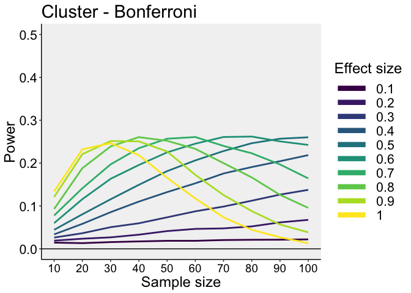
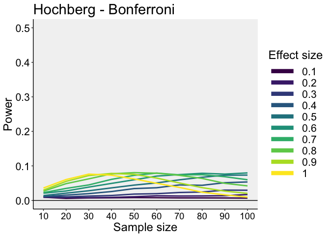

Cluster correction for multiple dependent comparisons: simulations
================
Guillaume A. Rousselet
2018-09-11

-   [Dependencies](#dependencies)
-   [Simulation with 5 dependent groups](#simulation-with-5-dependent-groups)
    -   [False positives](#false-positives)
    -   [True positives](#true-positives)
    -   [Power comparison](#power-comparison)
-   [Simulation with 7 conditions](#simulation-with-7-conditions)
    -   [False positives](#false-positives-1)
    -   [True positives](#true-positives-1)
    -   [Power comparison](#power-comparison-1)
-   [Simulation with 7 independent groups](#simulation-with-7-independent-groups)
    -   [False positives](#false-positives-2)
    -   [Load results](#load-results-4)
    -   [Plot results](#plot-results-2)
    -   [True positives](#true-positives-2)
    -   [Power comparison](#power-comparison-2)

Dependencies
============

``` r
rm(list=ls())
library(MASS)
library(tibble)
library(tidyr)
library(dplyr)
library(ggplot2)
library(cowplot)
source("./code/functions.txt")
library(beepr)
```

``` r
sessionInfo()
```

    ## R version 3.4.4 (2018-03-15)
    ## Platform: x86_64-apple-darwin15.6.0 (64-bit)
    ## Running under: OS X El Capitan 10.11.6
    ## 
    ## Matrix products: default
    ## BLAS: /Library/Frameworks/R.framework/Versions/3.4/Resources/lib/libRblas.0.dylib
    ## LAPACK: /Library/Frameworks/R.framework/Versions/3.4/Resources/lib/libRlapack.dylib
    ## 
    ## locale:
    ## [1] en_GB.UTF-8/en_GB.UTF-8/en_GB.UTF-8/C/en_GB.UTF-8/en_GB.UTF-8
    ## 
    ## attached base packages:
    ## [1] stats     graphics  grDevices utils     datasets  methods   base     
    ## 
    ## other attached packages:
    ## [1] beepr_1.3     cowplot_0.9.2 ggplot2_3.0.0 dplyr_0.7.6   tidyr_0.8.0  
    ## [6] tibble_1.4.2  MASS_7.3-49  
    ## 
    ## loaded via a namespace (and not attached):
    ##  [1] Rcpp_0.12.17     knitr_1.20       bindr_0.1.1      magrittr_1.5    
    ##  [5] munsell_0.4.3    tidyselect_0.2.4 colorspace_1.3-2 R6_2.2.2        
    ##  [9] rlang_0.2.1      plyr_1.8.4       stringr_1.2.0    tools_3.4.4     
    ## [13] grid_3.4.4       gtable_0.2.0     audio_0.1-5.1    withr_2.1.2     
    ## [17] htmltools_0.3.6  lazyeval_0.2.1   yaml_2.1.16      rprojroot_1.3-1 
    ## [21] digest_0.6.15    assertthat_0.2.0 bindrcpp_0.2.2   purrr_0.2.5     
    ## [25] glue_1.2.0       evaluate_0.10.1  rmarkdown_1.9    stringi_1.1.6   
    ## [29] compiler_3.4.4   pillar_1.2.1     scales_0.5.0     backports_1.1.2 
    ## [33] pkgconfig_2.0.1

Simulation with 5 dependent groups
==================================

For instance, same participants are tested in different ineffective conditions (false positives) or in effective conditions with graded impact (true positives). Graded impact could be due to for instance differences in: - concentration of a pharmaceutical treatment; - stimulus intensity (luminance, contrast, TMS...); - duration of a prime or mask.

False positives
---------------

``` r
## Parameters
Ng <- 5 # n groups
ES <- c(0, 0, 0, 0, 0) # effect size
rho = 0.75 # correlation between repeated measures
# ES <- c(0, 0.5, 1, 0.5, 0) # true effects
sigma <- 1 # population standard deviation
# variance-covariance matrix
Sigma <- diag(nrow = Ng)
Sigma[Sigma == 0] <- rho

nsim <- 10000 # number of simulation iterations
nseq <- seq(10, 100, 10) # sequence of sample sizes
Np <- max(nseq) # n participants per group

## Run simulation
fp.res <- list()
fp.res$nocorrection <- matrix(data = 0, nrow = nsim, ncol = length(nseq))  
fp.res$cluster <- matrix(data = 0, nrow = nsim, ncol = length(nseq))  
fp.res$bonferroni <- matrix(data = 0, nrow = nsim, ncol = length(nseq))  
fp.res$hochberg <- matrix(data = 0, nrow = nsim, ncol = length(nseq))  

set.seed(1)

for(sim in 1:nsim){
  
  if(sim %% 1000 ==0){
    print(paste0("Simulation ",sim," out of ",nsim,"..."))
  }
  
  # generate full sample size once
  all.data <- mvrnorm(Np, ES, Sigma)
  
  for(n in 1:length(nseq)){
    data <- all.data[1:nseq[n],]  
    
    tvals <- ctval(data)
    pvals <- cpval(tvals, df=Np-1)
    
    # ================================
    # At least one positive test? FWER
    # ================================
    
    # No correction ========================== 
    fp.res$nocorrection[sim,n] <- sum(pvals < 0.05) > 0
    
    # Bonferroni correction ==========================
    fp.res$bonferroni[sim,n] <- sum(p.adjust(pvals, method = "bonferroni") < 0.05) > 0
    
    # Hochberg correction ========================== 
    fp.res$hochberg[sim,n] <- sum(p.adjust(pvals, method = "hochberg") < 0.05) > 0
    
    # Cluster correction ==========================
    
    # Make bootstrap tables
    boot.tables <- bootfun(data)
    
    # original clusters
    cmap <- cluster.make(pvals<0.05)
    
    # bootstrap cluster sums
    boot.cmap <- t(apply(boot.tables$pvals<0.05, 1, cluster.make))
    boot.max.sums <- vector(mode = "numeric", length = nrow(boot.cmap))
    for(B in 1:nrow(boot.tables$pvals)){
      boot.max.sums[B] <- max(cluster.sum(values = boot.tables$tvals[B,]^2, cmap = boot.cmap[B,]))
    }
    
    # cluster sum threshold
    alpha <- 0.05
    tmp <- sort(boot.max.sums)
    boot.th <- tmp[round((1-alpha)*length(tmp))]
    
    # cluster significance
    fp.res$cluster[sim,n] <- sum(cluster.test(values = tvals^2, cmap = cmap, boot.th)) > 0 
    
  } # sample size
  
} # simulation iteration

save(
  fp.res,
  nsim,
  nseq,
  file=('./data/sim_fp.RData'))

beep(8)
```

### Load results

``` r
load('./data/sim_fp.RData')
fwer.nc <- apply(fp.res$nocorrection, 2, mean)
fwer.bo <- apply(fp.res$bonferroni, 2, mean)
fwer.ho <- apply(fp.res$hochberg, 2, mean)
fwer.cl <- apply(fp.res$cluster, 2, mean)
```

### Plot results

``` r
# fig.width = 10, fig.height = 6
df <- tibble(`FWER`=c(as.vector(fwer.nc),
                      as.vector(fwer.bo),
                      as.vector(fwer.ho),
                      as.vector(fwer.cl)),
             `Size`=rep(nseq,4),
             `Method`=rep(c("No correction",
                            "Bonferroni",
                            "Hochberg",
                            "Cluster"),each=length(nseq)))

df$Method <- as.character(df$Method)
df$Method <- factor(df$Method, levels=unique(df$Method))

# make plot
p <- ggplot(df) + theme_classic() +
  # Bradley's (1978) satisfactory range
   geom_ribbon(aes(x=Size), ymin = 0.025, ymax = 0.075, fill = "grey85") + 
  # colour = "grey30", size = 0.5
  # 0.05 reference line
  geom_abline(intercept = 0.05, slope = 0, colour="black") + 
  geom_line(data=df, aes(x=Size, y=FWER, colour = Method), size = 1) + 
  scale_colour_viridis_d(option = "C", end = 0.9) +
  scale_x_continuous(breaks=nseq) + 
  scale_y_continuous(breaks=c(0,0.05,0.1,0.2,0.3)) +
  coord_cartesian(ylim=c(0,0.3)) +
  theme(plot.title = element_text(size=22),
        axis.title.x = element_text(size = 18),
        axis.text.x = element_text(size = 14, colour="black"),
        axis.text.y = element_text(size = 16, colour="black"),
        axis.title.y = element_text(size = 18),
        legend.key.width = unit(1.5,"cm"),
        legend.position = "right",
        # legend.position = c(0.55,0.85),
        # legend.direction = "horizontal",
        legend.text=element_text(size=16),
        legend.title=element_text(size=18),
        panel.background = element_rect(fill = 'grey95', colour = 'grey95')) +
  labs(x = "Sample size", y = "Familywise error rate") +
  guides(colour = guide_legend(override.aes = list(size=3))) # make thicker legend lines

p
```


``` r
p.fwer <- p
# save figure
ggsave(filename='./figures/figure_fwer.png',width=8,height=6)
```

True positives
--------------

``` r
## Parameters
Ng <- 5 # n groups
ES <- c(0, 0, 0, 0, 0) # effect size
ESw <- 2 # effect size weight
ESseq <- seq(0.1, 1, 0.1) # sequence of effect sizes
rho = 0.75 # correlation between repeated measures
sigma <- 1 # population standard deviation
# variance-covariance matrix
Sigma <- diag(nrow = Ng)
Sigma[Sigma == 0] <- rho

alpha <- 0.05
pmask <- c(NA, 1, 1, 1, NA) # where to expect positive tests

nsim <- 200 # number of simulation iterations
nseq <- seq(10, 100, 10) # sequence of sample sizes
Np <- max(nseq) # n participants per group

## Run simulation
tp.res <- list()
tp.res$nocorrection <- array(data = 0, dim = c(nsim, length(nseq), length(ESseq)))  
tp.res$cluster <- array(data = 0, dim = c(nsim, length(nseq), length(ESseq)))  
tp.res$bonferroni <- array(data = 0, dim = c(nsim, length(nseq), length(ESseq)))  
tp.res$hochberg <- array(data = 0, dim = c(nsim, length(nseq), length(ESseq)))    

set.seed(1)

for(sim in 1:nsim){
  
  if(sim %% 100 ==0){
    print(paste0("Simulation ",sim," out of ",nsim,"..."))
  }
  
  for(es in 1:length(ESseq)){
    
    # generate full sample size once
    cES <- ES # current effect size
    cES[3] <- ESseq[es] # max effect size in the middle
    cES[c(2,4)] <- ESseq[es] / ESw # divided by 2 at positions 2 and 4
    
    all.data <- mvrnorm(Np, cES, Sigma)
    
    for(n in 1:length(nseq)){
      data <- all.data[1:nseq[n],]  
      
      tvals <- ctval(data)
      pvals <- cpval(tvals, df=Np-1)
      
      # ==================================
      # Positive tests: at least one / all
      # ==================================
      
      # No correction ========================== 
      tp.res$nocorrection[sim,n,es] <- sum(pvals*pmask < 0.05, na.rm = TRUE)
      
      # Bonferroni correction ==========================
      tp.res$bonferroni[sim,n,es] <- sum(p.adjust(pvals, method = "bonferroni")*pmask < 0.05, na.rm = TRUE) 
      
      # Hochberg correction ========================== 
      tp.res$hochberg[sim,n,es] <- sum(p.adjust(pvals, method = "hochberg")*pmask < 0.05, na.rm = TRUE)
      
      # Cluster correction ==========================

      # Make bootstrap tables
      boot.tables <- bootfun(data)

      # bootstrap cluster sums
      boot.cmap <- t(apply(boot.tables$pvals<0.05, 1, cluster.make))
      boot.max.sums <- vector(mode = "numeric", length = nrow(boot.cmap))
      for(B in 1:nrow(boot.tables$pvals)){
        boot.max.sums[B] <- max(cluster.sum(values = boot.tables$tvals[B,]^2, cmap = boot.cmap[B,]))
      }

      # cluster sum threshold
      tmp <- sort(boot.max.sums)
      boot.th <- tmp[round((1-alpha)*length(tmp))]

      # original clusters
      cmap <- cluster.make(pvals<0.05)
      
      # cluster significance
      tp.res$cluster[sim,n,es] <- sum(cluster.test(values = tvals^2, cmap = cmap, boot.th)*pmask, na.rm = TRUE) 
      
    } # sample size
    
  } # effect size
  
} # simulation iteration

save(
  tp.res,
  nsim,
  nseq,
  ESseq,
  file=('./data/sim_tp.RData'))

beep(8)
```

### Load results

``` r
load('./data/sim_tp.RData')
# ALL
power.nc <- apply(tp.res$nocorrection == 3, c(2,3), mean)
power.bo <- apply(tp.res$bonferroni == 3, c(2,3), mean)
power.ho <- apply(tp.res$hochberg == 3, c(2,3), mean)
power.cl <- apply(tp.res$cluster == 3, c(2,3), mean)

# ANY
# power.nc <- apply(tp.res$nocorrection > 0, c(2,3), mean)
# power.bo <- apply(tp.res$bonferroni > 0, c(2,3), mean)
# power.ho <- apply(tp.res$hochberg > 0, c(2,3), mean)
# power.cl <- apply(tp.res$cluster > 0, c(2,3), mean)
```

### Plot results: effect size 1 only

``` r
# fig.width = 10, fig.height = 6
df <- tibble(`FWER`=c(as.vector(power.nc[,10]),
                      as.vector(power.bo[,10]),
                      as.vector(power.ho[,10]),
                      as.vector(power.cl[,10])),
             `Size`=rep(nseq,4),
             `Method`=rep(c("No correction",
                            "Bonferroni",
                            "Hochberg",
                            "Cluster"),each=length(nseq)))

df$Method <- as.character(df$Method)
df$Method <- factor(df$Method, levels=unique(df$Method))

# make plot
p <- ggplot(df) + theme_classic() +
  geom_abline(intercept = 0, slope = 0, colour="black") + 
  geom_abline(intercept = 1, slope = 0, colour="black") + 
  geom_line(data=df, aes(x=Size, y=FWER, colour = Method), size = 1) + 
  scale_colour_viridis_d(option = "C", end = 0.9) +
  scale_x_continuous(breaks=nseq) + 
  # scale_y_continuous(breaks=c(0,0.05,0.1,0.2,0.3)) +
  coord_cartesian(ylim=c(0,1)) +
  theme(plot.title = element_text(size=22),
        axis.title.x = element_text(size = 18),
        axis.text.x = element_text(size = 14, colour="black"),
        axis.text.y = element_text(size = 16, colour="black"),
        axis.title.y = element_text(size = 18),
        legend.key.width = unit(1.5,"cm"),
        legend.position = "right",
        # legend.position = c(0.55,0.85),
        # legend.direction = "horizontal",
        legend.text=element_text(size=16),
        legend.title=element_text(size=18),
        panel.background = element_rect(fill = 'grey95', colour = 'grey95')) +
  labs(x = "Sample size", y = "Power") +
  guides(colour = guide_legend(override.aes = list(size=3))) # make thicker legend lines

p
```


``` r
p.power <- p
# save figure
ggsave(filename='./figures/figure_power_all.png',width=8,height=6)
```

Power comparison
----------------

For a desired long run power value, we can use interpolation to find out the matching sample size.

To achieve at least 80% power, the minimum sample size is: 39 observations for the cluster test; 50 observations for Hochberg; 57 observations for Bonferroni.

``` r
cowplot::plot_grid(p.fwer + theme(legend.position = c(0.65, 0.85)), 
                   p.power + theme(legend.position = "none"), 
                   labels=c("A", "B"), 
                   ncol = 2, 
                   nrow = 1,
                   rel_heights = c(1, 1), 
                   label_size = 20, 
                   hjust = -0.8, 
                   scale=.95,
                   align = "v")
# save figure
ggsave(filename='./figures/figure_5_summary.pdf',width=10,height=6) 
```

### Plot results: no correction

``` r
# fig.width = 10, fig.height = 6
df <- tibble(`Power`=as.vector(power.nc),
             `Size`=rep(nseq,length(ESseq)),
             `ES`=rep(ESseq,each=length(nseq)))

df$ES <- as.character(df$ES)
df$ES <- factor(df$ES, levels=unique(df$ES))

# make plot
p <- ggplot(df) + theme_classic() +
  geom_line(data=df, aes(x=Size, y=Power, colour = ES), size = 1) + 
  geom_abline(intercept=0, slope=0, colour="black") +
  scale_colour_viridis_d(end = 1) +
  scale_x_continuous(breaks=nseq) + 
  # scale_y_continuous(breaks=seq(0,50,10))) +
  coord_cartesian(ylim=c(0,1)) +
  theme(plot.title = element_text(size=22),
        axis.title.x = element_text(size = 18),
        axis.text.x = element_text(size = 14, colour="black"),
        axis.text.y = element_text(size = 16, colour="black"),
        axis.title.y = element_text(size = 18),
        legend.key.width = unit(1.5,"cm"),
        legend.position = "right",
        # legend.position = c(0.55,0.85),
        # legend.direction = "horizontal",
        legend.text=element_text(size=16),
        legend.title=element_text(size=18),
        panel.background = element_rect(fill = 'grey95', colour = 'grey95')) +
  labs(x = "Sample size", y = "Power") +
  guides(colour = guide_legend(override.aes = list(size=3),
                               title = "Effect size")) + # make thicker legend lines
  ggtitle("No correction")

p
```


``` r
p.no <- p
# save figure
ggsave(filename='./figures/figure_power_nocorrection.png',width=8,height=6)
```

### Plot results: Bonferroni

``` r
# fig.width = 10, fig.height = 6
df <- tibble(`Power`=as.vector(power.bo),
             `Size`=rep(nseq,length(ESseq)),
             `ES`=rep(ESseq,each=length(nseq)))

df$ES <- as.character(df$ES)
df$ES <- factor(df$ES, levels=unique(df$ES))

# make plot
p <- ggplot(df) + theme_classic() +
  geom_line(data=df, aes(x=Size, y=Power, colour = ES), size = 1) + 
  geom_abline(intercept=0, slope=0, colour="black") +
  scale_colour_viridis_d(end = 1) +
  scale_x_continuous(breaks=nseq) + 
  # scale_y_continuous(breaks=seq(0,50,10))) +
  coord_cartesian(ylim=c(0,1)) +
  theme(plot.title = element_text(size=22),
        axis.title.x = element_text(size = 18),
        axis.text.x = element_text(size = 14, colour="black"),
        axis.text.y = element_text(size = 16, colour="black"),
        axis.title.y = element_text(size = 18),
        legend.key.width = unit(1.5,"cm"),
        legend.position = "right",
        # legend.position = c(0.55,0.85),
        # legend.direction = "horizontal",
        legend.text=element_text(size=16),
        legend.title=element_text(size=18),
        panel.background = element_rect(fill = 'grey95', colour = 'grey95')) +
  labs(x = "Sample size", y = "Power") +
  guides(colour = guide_legend(override.aes = list(size=3),
                               title = "Effect size")) + # make thicker legend lines
  ggtitle("Bonferroni")

p
```


``` r
p.bo <- p
# save figure
ggsave(filename='./figures/figure_power_bonferroni.png',width=8,height=6)
```

### Plot results: Hochberg

``` r
# fig.width = 10, fig.height = 6
df <- tibble(`Power`=as.vector(power.ho),
             `Size`=rep(nseq,length(ESseq)),
             `ES`=rep(ESseq,each=length(nseq)))

df$ES <- as.character(df$ES)
df$ES <- factor(df$ES, levels=unique(df$ES))

# make plot
p <- ggplot(df) + theme_classic() +
  geom_line(data=df, aes(x=Size, y=Power, colour = ES), size = 1) + 
  geom_abline(intercept=0, slope=0, colour="black") +
  scale_colour_viridis_d(end = 1) +
  scale_x_continuous(breaks=nseq) + 
  # scale_y_continuous(breaks=seq(0,50,10))) +
  coord_cartesian(ylim=c(0,1)) +
  theme(plot.title = element_text(size=22),
        axis.title.x = element_text(size = 18),
        axis.text.x = element_text(size = 14, colour="black"),
        axis.text.y = element_text(size = 16, colour="black"),
        axis.title.y = element_text(size = 18),
        legend.key.width = unit(1.5,"cm"),
        legend.position = "right",
        # legend.position = c(0.55,0.85),
        # legend.direction = "horizontal",
        legend.text=element_text(size=16),
        legend.title=element_text(size=18),
        panel.background = element_rect(fill = 'grey95', colour = 'grey95')) +
  labs(x = "Sample size", y = "Power") +
  guides(colour = guide_legend(override.aes = list(size=3),
                               title = "Effect size")) + # make thicker legend lines
  ggtitle("Hochberg")

p
```


``` r
p.ho <- p
# save figure
ggsave(filename='./figures/figure_power_hochberg.png',width=8,height=6)
```

### Plot results: Cluster

``` r
# fig.width = 10, fig.height = 6
df <- tibble(`Power`=as.vector(power.cl),
             `Size`=rep(nseq,length(ESseq)),
             `ES`=rep(ESseq,each=length(nseq)))

df$ES <- as.character(df$ES)
df$ES <- factor(df$ES, levels=unique(df$ES))

# make plot
p <- ggplot(df) + theme_classic() +
  geom_line(data=df, aes(x=Size, y=Power, colour = ES), size = 1) + 
  geom_abline(intercept=0, slope=0, colour="black") +
  scale_colour_viridis_d(end = 1) +
  scale_x_continuous(breaks=nseq) + 
  # scale_y_continuous(breaks=seq(0,50,10))) +
  coord_cartesian(ylim=c(0,1)) +
  theme(plot.title = element_text(size=22),
        axis.title.x = element_text(size = 18),
        axis.text.x = element_text(size = 14, colour="black"),
        axis.text.y = element_text(size = 16, colour="black"),
        axis.title.y = element_text(size = 18),
        legend.key.width = unit(1.5,"cm"),
        legend.position = "right",
        # legend.position = c(0.55,0.85),
        # legend.direction = "horizontal",
        legend.text=element_text(size=16),
        legend.title=element_text(size=18),
        panel.background = element_rect(fill = 'grey95', colour = 'grey95')) +
  labs(x = "Sample size", y = "Power") +
  guides(colour = guide_legend(override.aes = list(size=3),
                               title = "Effect size")) + # make thicker legend lines
  ggtitle("Cluster")

p
```


``` r
p.cl <- p

# save figure
ggsave(filename='./figures/figure_power_cluster.png',width=8,height=6)
```

### Plot results: Cluster - Bonferroni

``` r
# fig.width = 10, fig.height = 6
df <- tibble(`Power`=as.vector(power.cl - power.bo),
             `Size`=rep(nseq,length(ESseq)),
             `ES`=rep(ESseq,each=length(nseq)))

df$ES <- as.character(df$ES)
df$ES <- factor(df$ES, levels=unique(df$ES))

# make plot
p <- ggplot(df) + theme_classic() +
  geom_line(data=df, aes(x=Size, y=Power, colour = ES), size = 1) + 
  geom_abline(intercept=0, slope=0, colour="black") +
  scale_colour_viridis_d(end = 1) +
  scale_x_continuous(breaks=nseq) + 
  # scale_y_continuous(breaks=seq(0,50,10))) +
  coord_cartesian(ylim=c(0,0.5)) +
  theme(plot.title = element_text(size=22),
        axis.title.x = element_text(size = 18),
        axis.text.x = element_text(size = 14, colour="black"),
        axis.text.y = element_text(size = 16, colour="black"),
        axis.title.y = element_text(size = 18),
        legend.key.width = unit(1.5,"cm"),
        legend.position = "right",
        # legend.position = c(0.55,0.85),
        # legend.direction = "horizontal",
        legend.text=element_text(size=16),
        legend.title=element_text(size=18),
        panel.background = element_rect(fill = 'grey95', colour = 'grey95')) +
  labs(x = "Sample size", y = "Power") +
  guides(colour = guide_legend(override.aes = list(size=3),
                               title = "Effect size")) + # make thicker legend lines
  ggtitle("Cluster - Bonferroni")

p
```



``` r
p.cb <- p

# save figure
ggsave(filename='./figures/figure_power_cluster-bonferroni.png',width=8,height=6)
```

### Plot results: Cluster - Hochberg

``` r
# fig.width = 10, fig.height = 6
df <- tibble(`Power`=as.vector(power.cl - power.ho),
             `Size`=rep(nseq,length(ESseq)),
             `ES`=rep(ESseq,each=length(nseq)))

df$ES <- as.character(df$ES)
df$ES <- factor(df$ES, levels=unique(df$ES))

# make plot
p <- ggplot(df) + theme_classic() +
  geom_line(data=df, aes(x=Size, y=Power, colour = ES), size = 1) + 
  geom_abline(intercept=0, slope=0, colour="black") +
  scale_colour_viridis_d(end = 1) +
  scale_x_continuous(breaks=nseq) + 
  # scale_y_continuous(breaks=seq(0,50,10))) +
  coord_cartesian(ylim=c(0,0.5)) +
  theme(plot.title = element_text(size=22),
        axis.title.x = element_text(size = 18),
        axis.text.x = element_text(size = 14, colour="black"),
        axis.text.y = element_text(size = 16, colour="black"),
        axis.title.y = element_text(size = 18),
        legend.key.width = unit(1.5,"cm"),
        legend.position = "right",
        # legend.position = c(0.55,0.85),
        # legend.direction = "horizontal",
        legend.text=element_text(size=16),
        legend.title=element_text(size=18),
        panel.background = element_rect(fill = 'grey95', colour = 'grey95')) +
  labs(x = "Sample size", y = "Power") +
  guides(colour = guide_legend(override.aes = list(size=3),
                               title = "Effect size")) + # make thicker legend lines
  ggtitle("Cluster - Hochberg")

p
```


``` r
p.ch <- p

# save figure
ggsave(filename='./figures/figure_power_cluster-hochberg.png',width=8,height=6)
```

### Plot results: Cluster - no correction

``` r
# fig.width = 10, fig.height = 6
df <- tibble(`Power`=as.vector(power.nc - power.cl),
             `Size`=rep(nseq,length(ESseq)),
             `ES`=rep(ESseq,each=length(nseq)))

df$ES <- as.character(df$ES)
df$ES <- factor(df$ES, levels=unique(df$ES))

# make plot
p <- ggplot(df) + theme_classic() +
  geom_line(data=df, aes(x=Size, y=Power, colour = ES), size = 1) + 
  geom_abline(intercept=0, slope=0, colour="black") +
  scale_colour_viridis_d(end = 1) +
  scale_x_continuous(breaks=nseq) + 
  # scale_y_continuous(breaks=seq(0,50,10))) +
  coord_cartesian(ylim=c(0,0.5)) +
  theme(plot.title = element_text(size=22),
        axis.title.x = element_text(size = 18),
        axis.text.x = element_text(size = 14, colour="black"),
        axis.text.y = element_text(size = 16, colour="black"),
        axis.title.y = element_text(size = 18),
        legend.key.width = unit(1.5,"cm"),
        # legend.position = "right",
        legend.position = c(0.2,0.55),
        # legend.direction = "horizontal",
        legend.text=element_text(size=16),
        legend.title=element_text(size=18),
        panel.background = element_rect(fill = 'grey95', colour = 'grey95')) +
  labs(x = "Sample size", y = "Power") +
  guides(colour = guide_legend(override.aes = list(size=3),
                               title = "Effect size")) + # make thicker legend lines
  ggtitle("No correction - cluster")

p
```


``` r
p.nc <- p

# save figure
ggsave(filename='./figures/figure_power_nocorrection-cluster.png',width=8,height=6)
```

### Plot results: Hochberg - Bonferroni

``` r
# fig.width = 10, fig.height = 6
df <- tibble(`Power`=as.vector(power.ho - power.bo),
             `Size`=rep(nseq,length(ESseq)),
             `ES`=rep(ESseq,each=length(nseq)))

df$ES <- as.character(df$ES)
df$ES <- factor(df$ES, levels=unique(df$ES))

# make plot
p <- ggplot(df) + theme_classic() +
  geom_line(data=df, aes(x=Size, y=Power, colour = ES), size = 1) + 
  geom_abline(intercept=0, slope=0, colour="black") +
  scale_colour_viridis_d(end = 1) +
  scale_x_continuous(breaks=nseq) + 
  # scale_y_continuous(breaks=seq(0,50,10))) +
  coord_cartesian(ylim=c(0,0.5)) +
  theme(plot.title = element_text(size=22),
        axis.title.x = element_text(size = 18),
        axis.text.x = element_text(size = 14, colour="black"),
        axis.text.y = element_text(size = 16, colour="black"),
        axis.title.y = element_text(size = 18),
        legend.key.width = unit(1.5,"cm"),
        legend.position = "right",
        # legend.position = c(0.55,0.85),
        # legend.direction = "horizontal",
        legend.text=element_text(size=16),
        legend.title=element_text(size=18),
        panel.background = element_rect(fill = 'grey95', colour = 'grey95')) +
  labs(x = "Sample size", y = "Power") +
  guides(colour = guide_legend(override.aes = list(size=3),
                               title = "Effect size")) + # make thicker legend lines
  ggtitle("Hochberg - Bonferroni")

p
```



``` r
p.hb <- p

# save figure
ggsave(filename='./figures/figure_power_hochberg-bonferroni.png',width=8,height=6)
```

#### Combine panels of power results

TODO : - remove legends, keep one only in less crowded panel - add difference plots

``` r
cowplot::plot_grid(p.no + theme(legend.position = "none"), 
                   p.bo + theme(legend.position = "none"), 
                   p.ho + theme(legend.position = "none"), 
                   p.cl + theme(legend.position = "none"),
                   p.nc,
                   p.cb + theme(legend.position = "none"),
                   p.ch + theme(legend.position = "none"),
                   p.hb + theme(legend.position = "none"),
                   labels=c("A", "B", "C", "D", "E", "F", "G", "H"), 
                   ncol = 4, 
                   nrow = 2,
                   rel_heights = c(1, 1, 1, 1), 
                   label_size = 20, 
                   hjust = -0.8, 
                   scale=.95,
                   align = "v")
# save figure
ggsave(filename='./figures/figure_power_summary.pdf',width=20,height=12) 
```

Simulation with 7 conditions
============================

False positives
---------------

``` r
## Parameters
Ng <- 7 # n groups
ES <- c(0, 0, 0, 0, 0, 0, 0) # effect size
rho = 0.75 # correlation between repeated measures
# ES <- c(0, 0.5, 1, 0.5, 0) # true effects
sigma <- 1 # population standard deviation
# variance-covariance matrix
Sigma <- diag(nrow = Ng)
Sigma[Sigma == 0] <- rho

nsim <- 10000 # number of simulation iterations
nseq <- seq(10, 100, 10) # sequence of sample sizes
Np <- max(nseq) # n participants per group

## Run simulation
fp.res <- list()
fp.res$nocorrection <- matrix(data = 0, nrow = nsim, ncol = length(nseq))  
fp.res$cluster <- matrix(data = 0, nrow = nsim, ncol = length(nseq))  
fp.res$bonferroni <- matrix(data = 0, nrow = nsim, ncol = length(nseq))  
fp.res$hochberg <- matrix(data = 0, nrow = nsim, ncol = length(nseq))  

set.seed(1)

for(sim in 1:nsim){
  
  if(sim %% 500 ==0){
    print(paste0("Simulation ",sim," out of ",nsim,"..."))
  }
  
  # generate full sample size once
  all.data <- mvrnorm(Np, ES, Sigma)
  
  for(n in 1:length(nseq)){
    data <- all.data[1:nseq[n],]  
    
    tvals <- ctval(data)
    pvals <- cpval(tvals, df=Np-1)
    
    # ================================
    # At least one positive test? FWER
    # ================================
    
    # No correction ========================== 
    fp.res$nocorrection[sim,n] <- sum(pvals < 0.05) > 0
    
    # Bonferroni correction ==========================
    fp.res$bonferroni[sim,n] <- sum(p.adjust(pvals, method = "bonferroni") < 0.05) > 0
    
    # Hochberg correction ========================== 
    fp.res$hochberg[sim,n] <- sum(p.adjust(pvals, method = "hochberg") < 0.05) > 0
    
    # Cluster correction ==========================
    
    # Make bootstrap tables
    boot.tables <- bootfun(data)
    
    # original clusters
    cmap <- cluster.make(pvals<0.05)
    
    # bootstrap cluster sums
    boot.cmap <- t(apply(boot.tables$pvals<0.05, 1, cluster.make))
    boot.max.sums <- vector(mode = "numeric", length = nrow(boot.cmap))
    for(B in 1:nrow(boot.tables$pvals)){
      boot.max.sums[B] <- max(cluster.sum(values = boot.tables$tvals[B,]^2, cmap = boot.cmap[B,]))
    }
    
    # cluster sum threshold
    alpha <- 0.05
    tmp <- sort(boot.max.sums)
    boot.th <- tmp[round((1-alpha)*length(tmp))]
    
    # cluster significance
    fp.res$cluster[sim,n] <- sum(cluster.test(values = tvals^2, cmap = cmap, boot.th)) > 0 
    
  } # sample size
  
} # simulation iteration

save(
  fp.res,
  nsim,
  nseq,
  file=('./data/sim_fp7.RData'))
```

### Load results

``` r
load('./data/sim_fp7.RData')
fwer.nc <- apply(fp.res$nocorrection, 2, mean)
fwer.bo <- apply(fp.res$bonferroni, 2, mean)
fwer.ho <- apply(fp.res$hochberg, 2, mean)
fwer.cl <- apply(fp.res$cluster, 2, mean)
```

### Plot results

``` r
# fig.width = 10, fig.height = 6
df <- tibble(`FWER`=c(as.vector(fwer.nc),
                      as.vector(fwer.bo),
                      as.vector(fwer.ho),
                      as.vector(fwer.cl)),
             `Size`=rep(nseq,4),
             `Method`=rep(c("No correction",
                            "Bonferroni",
                            "Hochberg",
                            "Cluster"),each=length(nseq)))

df$Method <- as.character(df$Method)
df$Method <- factor(df$Method, levels=unique(df$Method))

# make plot
p <- ggplot(df) + theme_classic() +
  # Bradley's (1978) satisfactory range
   geom_ribbon(aes(x=Size), ymin = 0.025, ymax = 0.075, fill = "grey85") + 
  # colour = "grey30", size = 0.5
  # 0.05 reference line
  geom_abline(intercept = 0.05, slope = 0, colour="black") + 
  geom_line(data=df, aes(x=Size, y=FWER, colour = Method), size = 1) + 
  scale_colour_viridis_d(option = "C", end = 0.9) +
  scale_x_continuous(breaks=nseq) + 
  scale_y_continuous(breaks=c(0,0.05,0.1,0.2,0.3)) +
  coord_cartesian(ylim=c(0,0.3)) +
  theme(plot.title = element_text(size=22),
        axis.title.x = element_text(size = 18),
        axis.text.x = element_text(size = 14, colour="black"),
        axis.text.y = element_text(size = 16, colour="black"),
        axis.title.y = element_text(size = 18),
        legend.key.width = unit(1.5,"cm"),
        legend.position = "right",
        # legend.position = c(0.55,0.85),
        # legend.direction = "horizontal",
        legend.text=element_text(size=16),
        legend.title=element_text(size=18),
        panel.background = element_rect(fill = 'grey95', colour = 'grey95')) +
  labs(x = "Sample size", y = "Familywise error rate") +
  guides(colour = guide_legend(override.aes = list(size=3))) # make thicker legend lines

p
```


``` r
p.fwer <- p
# save figure
ggsave(filename='./figures/figure_7_fwer.png',width=8,height=6)
```

True positives
--------------

``` r
## Parameters
Ng <- 7 # n groups
ES <- c(0, 0, 0, 0, 0, 0, 0) # effect size
ESw <- 2 # effect size weight
ESseq <- seq(0.1, 1, 0.1) # sequence of effect sizes
rho = 0.75 # correlation between repeated measures
sigma <- 1 # population standard deviation
# variance-covariance matrix
Sigma <- diag(nrow = Ng)
Sigma[Sigma == 0] <- rho

alpha <- 0.05
pmask <- c(NA, NA, 1, 1, 1, NA, NA) # where to expect positive tests

nsim <- 10000 # number of simulation iterations
nseq <- seq(10, 100, 10) # sequence of sample sizes
Np <- max(nseq) # n participants per group

## Run simulation
tp.res <- list()
tp.res$nocorrection <- array(data = 0, dim = c(nsim, length(nseq), length(ESseq)))  
tp.res$cluster <- array(data = 0, dim = c(nsim, length(nseq), length(ESseq)))  
tp.res$bonferroni <- array(data = 0, dim = c(nsim, length(nseq), length(ESseq)))  
tp.res$hochberg <- array(data = 0, dim = c(nsim, length(nseq), length(ESseq)))    

set.seed(1)

for(sim in 1:nsim){
  
  if(sim %% 500 ==0){
    print(paste0("Simulation ",sim," out of ",nsim,"..."))
  }
  
  for(es in 1:length(ESseq)){
    
    # generate full sample size once
    cES <- ES # current effect size
    cES[4] <- ESseq[es] # max effect size in the middle
    cES[c(3,5)] <- ESseq[es] / ESw # divided by 2 at positions 2 and 4
    
    all.data <- mvrnorm(Np, cES, Sigma)
    
    for(n in 1:length(nseq)){
      data <- all.data[1:nseq[n],]  
      
      tvals <- ctval(data)
      pvals <- cpval(tvals, df=Np-1)
      
      # ==================================
      # Positive tests: at least one / all
      # ==================================
      
      # No correction ========================== 
      tp.res$nocorrection[sim,n,es] <- sum(pvals*pmask < 0.05, na.rm = TRUE)
      
      # Bonferroni correction ==========================
      tp.res$bonferroni[sim,n,es] <- sum(p.adjust(pvals, method = "bonferroni")*pmask < 0.05, na.rm = TRUE) 
      
      # Hochberg correction ========================== 
      tp.res$hochberg[sim,n,es] <- sum(p.adjust(pvals, method = "hochberg")*pmask < 0.05, na.rm = TRUE)
      
      # Cluster correction ==========================

      # Make bootstrap tables
      boot.tables <- bootfun(data)

      # bootstrap cluster sums
      boot.cmap <- t(apply(boot.tables$pvals<0.05, 1, cluster.make))
      boot.max.sums <- vector(mode = "numeric", length = nrow(boot.cmap))
      for(B in 1:nrow(boot.tables$pvals)){
        boot.max.sums[B] <- max(cluster.sum(values = boot.tables$tvals[B,]^2, cmap = boot.cmap[B,]))
      }

      # cluster sum threshold
      tmp <- sort(boot.max.sums)
      boot.th <- tmp[round((1-alpha)*length(tmp))]

      # original clusters
      cmap <- cluster.make(pvals<0.05)
      
      # cluster significance
      tp.res$cluster[sim,n,es] <- sum(cluster.test(values = tvals^2, cmap = cmap, boot.th)*pmask, na.rm = TRUE) 
      
    } # sample size
    
  } # effect size
  
} # simulation iteration

save(
  tp.res,
  nsim,
  nseq,
  ESseq,
  file=('./data/sim_tp7.RData'))

beep(8)
```

### Load results

``` r
load('./data/sim_tp7.RData')
# ALL
power.nc <- apply(tp.res$nocorrection == 3, c(2,3), mean)
power.bo <- apply(tp.res$bonferroni == 3, c(2,3), mean)
power.ho <- apply(tp.res$hochberg == 3, c(2,3), mean)
power.cl <- apply(tp.res$cluster == 3, c(2,3), mean)

# ANY
# power.nc <- apply(tp.res$nocorrection > 0, c(2,3), mean)
# power.bo <- apply(tp.res$bonferroni > 0, c(2,3), mean)
# power.ho <- apply(tp.res$hochberg > 0, c(2,3), mean)
# power.cl <- apply(tp.res$cluster > 0, c(2,3), mean)
```

### Plot results: effect size 1 only

``` r
# fig.width = 10, fig.height = 6
df <- tibble(`FWER`=c(as.vector(power.nc[,10]),
                      as.vector(power.bo[,10]),
                      as.vector(power.ho[,10]),
                      as.vector(power.cl[,10])),
             `Size`=rep(nseq,4),
             `Method`=rep(c("No correction",
                            "Bonferroni",
                            "Hochberg",
                            "Cluster"),each=length(nseq)))

df$Method <- as.character(df$Method)
df$Method <- factor(df$Method, levels=unique(df$Method))

# make plot
p <- ggplot(df) + theme_classic() +
  geom_abline(intercept = 0, slope = 0, colour="black") + 
  geom_abline(intercept = 1, slope = 0, colour="black") + 
  geom_line(data=df, aes(x=Size, y=FWER, colour = Method), size = 1) + 
  scale_colour_viridis_d(option = "C", end = 0.9) +
  scale_x_continuous(breaks=nseq) + 
  # scale_y_continuous(breaks=c(0,0.05,0.1,0.2,0.3)) +
  coord_cartesian(ylim=c(0,1)) +
  theme(plot.title = element_text(size=22),
        axis.title.x = element_text(size = 18),
        axis.text.x = element_text(size = 14, colour="black"),
        axis.text.y = element_text(size = 16, colour="black"),
        axis.title.y = element_text(size = 18),
        legend.key.width = unit(1.5,"cm"),
        legend.position = "right",
        # legend.position = c(0.55,0.85),
        # legend.direction = "horizontal",
        legend.text=element_text(size=16),
        legend.title=element_text(size=18),
        panel.background = element_rect(fill = 'grey95', colour = 'grey95')) +
  labs(x = "Sample size", y = "Power") +
  guides(colour = guide_legend(override.aes = list(size=3))) # make thicker legend lines

p
```


``` r
p.power <- p
# save figure
ggsave(filename='./figures/figure_power_7_all.png',width=8,height=6)
```

Power comparison
----------------

For a desired long run power value, we can use interpolation to find out the matching sample size.

To achieve at least 80% power, the minimum sample size is: 39 observations for the cluster test; 56 observations for Hochberg; 59 observations for Bonferroni.

``` r
cowplot::plot_grid(p.fwer + theme(legend.position = c(0.65, 0.85)), 
                   p.power + theme(legend.position = "none"), 
                   labels=c("A", "B"), 
                   ncol = 2, 
                   nrow = 1,
                   rel_heights = c(1, 1), 
                   label_size = 20, 
                   hjust = -0.8, 
                   scale=.95,
                   align = "v")
# save figure
ggsave(filename='./figures/figure_7_summary.pdf',width=10,height=6) 
```

### Plot results: no correction

``` r
# fig.width = 10, fig.height = 6
df <- tibble(`Power`=as.vector(power.nc),
             `Size`=rep(nseq,length(ESseq)),
             `ES`=rep(ESseq,each=length(nseq)))

df$ES <- as.character(df$ES)
df$ES <- factor(df$ES, levels=unique(df$ES))

# make plot
p <- ggplot(df) + theme_classic() +
  geom_line(data=df, aes(x=Size, y=Power, colour = ES), size = 1) + 
  geom_abline(intercept=0, slope=0, colour="black") +
  scale_colour_viridis_d(end = 1) +
  scale_x_continuous(breaks=nseq) + 
  # scale_y_continuous(breaks=seq(0,50,10))) +
  coord_cartesian(ylim=c(0,1)) +
  theme(plot.title = element_text(size=22),
        axis.title.x = element_text(size = 18),
        axis.text.x = element_text(size = 14, colour="black"),
        axis.text.y = element_text(size = 16, colour="black"),
        axis.title.y = element_text(size = 18),
        legend.key.width = unit(1.5,"cm"),
        legend.position = "right",
        # legend.position = c(0.55,0.85),
        # legend.direction = "horizontal",
        legend.text=element_text(size=16),
        legend.title=element_text(size=18),
        panel.background = element_rect(fill = 'grey95', colour = 'grey95')) +
  labs(x = "Sample size", y = "Power") +
  guides(colour = guide_legend(override.aes = list(size=3),
                               title = "Effect size")) + # make thicker legend lines
  ggtitle("No correction")

p
```


``` r
p.no <- p
# save figure
ggsave(filename='./figures/figure_power_7_nocorrection.png',width=8,height=6)
```

### Plot results: Bonferroni

``` r
# fig.width = 10, fig.height = 6
df <- tibble(`Power`=as.vector(power.bo),
             `Size`=rep(nseq,length(ESseq)),
             `ES`=rep(ESseq,each=length(nseq)))

df$ES <- as.character(df$ES)
df$ES <- factor(df$ES, levels=unique(df$ES))

# make plot
p <- ggplot(df) + theme_classic() +
  geom_line(data=df, aes(x=Size, y=Power, colour = ES), size = 1) + 
  geom_abline(intercept=0, slope=0, colour="black") +
  scale_colour_viridis_d(end = 1) +
  scale_x_continuous(breaks=nseq) + 
  # scale_y_continuous(breaks=seq(0,50,10))) +
  coord_cartesian(ylim=c(0,1)) +
  theme(plot.title = element_text(size=22),
        axis.title.x = element_text(size = 18),
        axis.text.x = element_text(size = 14, colour="black"),
        axis.text.y = element_text(size = 16, colour="black"),
        axis.title.y = element_text(size = 18),
        legend.key.width = unit(1.5,"cm"),
        legend.position = "right",
        # legend.position = c(0.55,0.85),
        # legend.direction = "horizontal",
        legend.text=element_text(size=16),
        legend.title=element_text(size=18),
        panel.background = element_rect(fill = 'grey95', colour = 'grey95')) +
  labs(x = "Sample size", y = "Power") +
  guides(colour = guide_legend(override.aes = list(size=3),
                               title = "Effect size")) + # make thicker legend lines
  ggtitle("Bonferroni")

p
```


``` r
p.bo <- p
# save figure
ggsave(filename='./figures/figure_power_7_bonferroni.png',width=8,height=6)
```

### Plot results: Hochberg

``` r
# fig.width = 10, fig.height = 6
df <- tibble(`Power`=as.vector(power.ho),
             `Size`=rep(nseq,length(ESseq)),
             `ES`=rep(ESseq,each=length(nseq)))

df$ES <- as.character(df$ES)
df$ES <- factor(df$ES, levels=unique(df$ES))

# make plot
p <- ggplot(df) + theme_classic() +
  geom_line(data=df, aes(x=Size, y=Power, colour = ES), size = 1) + 
  geom_abline(intercept=0, slope=0, colour="black") +
  scale_colour_viridis_d(end = 1) +
  scale_x_continuous(breaks=nseq) + 
  # scale_y_continuous(breaks=seq(0,50,10))) +
  coord_cartesian(ylim=c(0,1)) +
  theme(plot.title = element_text(size=22),
        axis.title.x = element_text(size = 18),
        axis.text.x = element_text(size = 14, colour="black"),
        axis.text.y = element_text(size = 16, colour="black"),
        axis.title.y = element_text(size = 18),
        legend.key.width = unit(1.5,"cm"),
        legend.position = "right",
        # legend.position = c(0.55,0.85),
        # legend.direction = "horizontal",
        legend.text=element_text(size=16),
        legend.title=element_text(size=18),
        panel.background = element_rect(fill = 'grey95', colour = 'grey95')) +
  labs(x = "Sample size", y = "Power") +
  guides(colour = guide_legend(override.aes = list(size=3),
                               title = "Effect size")) + # make thicker legend lines
  ggtitle("Hochberg")

p
```


``` r
p.ho <- p
# save figure
ggsave(filename='./figures/figure_power_7_hochberg.png',width=8,height=6)
```

### Plot results: Cluster

``` r
# fig.width = 10, fig.height = 6
df <- tibble(`Power`=as.vector(power.cl),
             `Size`=rep(nseq,length(ESseq)),
             `ES`=rep(ESseq,each=length(nseq)))

df$ES <- as.character(df$ES)
df$ES <- factor(df$ES, levels=unique(df$ES))

# make plot
p <- ggplot(df) + theme_classic() +
  geom_line(data=df, aes(x=Size, y=Power, colour = ES), size = 1) + 
  geom_abline(intercept=0, slope=0, colour="black") +
  scale_colour_viridis_d(end = 1) +
  scale_x_continuous(breaks=nseq) + 
  # scale_y_continuous(breaks=seq(0,50,10))) +
  coord_cartesian(ylim=c(0,1)) +
  theme(plot.title = element_text(size=22),
        axis.title.x = element_text(size = 18),
        axis.text.x = element_text(size = 14, colour="black"),
        axis.text.y = element_text(size = 16, colour="black"),
        axis.title.y = element_text(size = 18),
        legend.key.width = unit(1.5,"cm"),
        legend.position = "right",
        # legend.position = c(0.55,0.85),
        # legend.direction = "horizontal",
        legend.text=element_text(size=16),
        legend.title=element_text(size=18),
        panel.background = element_rect(fill = 'grey95', colour = 'grey95')) +
  labs(x = "Sample size", y = "Power") +
  guides(colour = guide_legend(override.aes = list(size=3),
                               title = "Effect size")) + # make thicker legend lines
  ggtitle("Cluster")

p
```


``` r
p.cl <- p

# save figure
ggsave(filename='./figures/figure_power_7_cluster.png',width=8,height=6)
```

### Plot results: Cluster - Bonferroni

``` r
# fig.width = 10, fig.height = 6
df <- tibble(`Power`=as.vector(power.cl - power.bo),
             `Size`=rep(nseq,length(ESseq)),
             `ES`=rep(ESseq,each=length(nseq)))

df$ES <- as.character(df$ES)
df$ES <- factor(df$ES, levels=unique(df$ES))

# make plot
p <- ggplot(df) + theme_classic() +
  geom_line(data=df, aes(x=Size, y=Power, colour = ES), size = 1) + 
  geom_abline(intercept=0, slope=0, colour="black") +
  scale_colour_viridis_d(end = 1) +
  scale_x_continuous(breaks=nseq) + 
  # scale_y_continuous(breaks=seq(0,50,10))) +
  coord_cartesian(ylim=c(0,0.5)) +
  theme(plot.title = element_text(size=22),
        axis.title.x = element_text(size = 18),
        axis.text.x = element_text(size = 14, colour="black"),
        axis.text.y = element_text(size = 16, colour="black"),
        axis.title.y = element_text(size = 18),
        legend.key.width = unit(1.5,"cm"),
        legend.position = "right",
        # legend.position = c(0.55,0.85),
        # legend.direction = "horizontal",
        legend.text=element_text(size=16),
        legend.title=element_text(size=18),
        panel.background = element_rect(fill = 'grey95', colour = 'grey95')) +
  labs(x = "Sample size", y = "Power") +
  guides(colour = guide_legend(override.aes = list(size=3),
                               title = "Effect size")) + # make thicker legend lines
  ggtitle("Cluster - Bonferroni")

p
```


``` r
# save figure
ggsave(filename='./figures/figure_power_7_cluster-bonferroni.png',width=8,height=6)
```

### Plot results: Cluster - Hochberg

``` r
# fig.width = 10, fig.height = 6
df <- tibble(`Power`=as.vector(power.cl - power.ho),
             `Size`=rep(nseq,length(ESseq)),
             `ES`=rep(ESseq,each=length(nseq)))

df$ES <- as.character(df$ES)
df$ES <- factor(df$ES, levels=unique(df$ES))

# make plot
p <- ggplot(df) + theme_classic() +
  geom_line(data=df, aes(x=Size, y=Power, colour = ES), size = 1) + 
  geom_abline(intercept=0, slope=0, colour="black") +
  scale_colour_viridis_d(end = 1) +
  scale_x_continuous(breaks=nseq) + 
  # scale_y_continuous(breaks=seq(0,50,10))) +
  coord_cartesian(ylim=c(0,0.5)) +
  theme(plot.title = element_text(size=22),
        axis.title.x = element_text(size = 18),
        axis.text.x = element_text(size = 14, colour="black"),
        axis.text.y = element_text(size = 16, colour="black"),
        axis.title.y = element_text(size = 18),
        legend.key.width = unit(1.5,"cm"),
        legend.position = "right",
        # legend.position = c(0.55,0.85),
        # legend.direction = "horizontal",
        legend.text=element_text(size=16),
        legend.title=element_text(size=18),
        panel.background = element_rect(fill = 'grey95', colour = 'grey95')) +
  labs(x = "Sample size", y = "Power") +
  guides(colour = guide_legend(override.aes = list(size=3),
                               title = "Effect size")) + # make thicker legend lines
  ggtitle("Cluster - Hochberg")

p
```


``` r
# save figure
ggsave(filename='./figures/figure_power_7_cluster-hochberg.png',width=8,height=6)
```

### Plot results: Cluster - no correction

``` r
# fig.width = 10, fig.height = 6
df <- tibble(`Power`=as.vector(power.cl - power.nc),
             `Size`=rep(nseq,length(ESseq)),
             `ES`=rep(ESseq,each=length(nseq)))

df$ES <- as.character(df$ES)
df$ES <- factor(df$ES, levels=unique(df$ES))

# make plot
p <- ggplot(df) + theme_classic() +
  geom_line(data=df, aes(x=Size, y=Power, colour = ES), size = 1) + 
  geom_abline(intercept=0, slope=0, colour="black") +
  scale_colour_viridis_d(end = 1) +
  scale_x_continuous(breaks=nseq) + 
  # scale_y_continuous(breaks=seq(0,50,10))) +
  coord_cartesian(ylim=c(0,0.5)) +
  theme(plot.title = element_text(size=22),
        axis.title.x = element_text(size = 18),
        axis.text.x = element_text(size = 14, colour="black"),
        axis.text.y = element_text(size = 16, colour="black"),
        axis.title.y = element_text(size = 18),
        legend.key.width = unit(1.5,"cm"),
        legend.position = "right",
        # legend.position = c(0.55,0.85),
        # legend.direction = "horizontal",
        legend.text=element_text(size=16),
        legend.title=element_text(size=18),
        panel.background = element_rect(fill = 'grey95', colour = 'grey95')) +
  labs(x = "Sample size", y = "Power") +
  guides(colour = guide_legend(override.aes = list(size=3),
                               title = "Effect size")) + # make thicker legend lines
  ggtitle("Cluster - no correction")

p
```


``` r
# save figure
ggsave(filename='./figures/figure_power_7_cluster-nocorrection.png',width=8,height=6)
```

Simulation with 7 independent groups
====================================

For example, 7 groups of rats exposed to a placebo (false positives) or to an effective molecule with different concentrations (true positives).

False positives
---------------

``` r
## Parameters
Ng <- 7 # n groups
ES <- c(0, 0, 0, 0, 0, 0, 0) # effect size
sigma <- 1 # population standard deviation

nsim <- 10000 # number of simulation iterations
nseq <- seq(10, 100, 10) # sequence of sample sizes
Np <- max(nseq) # n participants per group

## Run simulation
fp.res <- list()
fp.res$nocorrection <- matrix(data = 0, nrow = nsim, ncol = length(nseq))  
fp.res$cluster <- matrix(data = 0, nrow = nsim, ncol = length(nseq))  
fp.res$bonferroni <- matrix(data = 0, nrow = nsim, ncol = length(nseq))  
fp.res$hochberg <- matrix(data = 0, nrow = nsim, ncol = length(nseq))  

set.seed(123456)

for(sim in 1:nsim){
  
  if(sim %% 500 ==0){
    print(paste0("Simulation ",sim," out of ",nsim,"..."))
  }
  
  # generate full sample size once
  all.data <- matrix(rnorm(Np*Ng, ES, sigma), nrow = Np)
  
  for(n in 1:length(nseq)){
    data <- all.data[1:nseq[n],]  
    
    tvals <- ctval(data)
    pvals <- cpval(tvals, df=Np-1)
    
    # ================================
    # At least one positive test? FWER
    # ================================
    
    # No correction ========================== 
    fp.res$nocorrection[sim,n] <- sum(pvals < 0.05) > 0
    
    # Bonferroni correction ==========================
    fp.res$bonferroni[sim,n] <- sum(p.adjust(pvals, method = "bonferroni") < 0.05) > 0
    
    # Hochberg correction ========================== 
    fp.res$hochberg[sim,n] <- sum(p.adjust(pvals, method = "hochberg") < 0.05) > 0
    
    # Cluster correction ==========================
    
    # Make bootstrap tables
    boot.tables <- bootfun_ind(data)
    
    # original clusters
    cmap <- cluster.make(pvals<0.05)
    
    # bootstrap cluster sums
    boot.cmap <- t(apply(boot.tables$pvals<0.05, 1, cluster.make))
    boot.max.sums <- vector(mode = "numeric", length = nrow(boot.cmap))
    for(B in 1:nrow(boot.tables$pvals)){
      boot.max.sums[B] <- max(cluster.sum(values = boot.tables$tvals[B,]^2, cmap = boot.cmap[B,]))
    }
    
    # cluster sum threshold
    alpha <- 0.05
    tmp <- sort(boot.max.sums)
    boot.th <- tmp[round((1-alpha)*length(tmp))]
    
    # cluster significance
    fp.res$cluster[sim,n] <- sum(cluster.test(values = tvals^2, cmap = cmap, boot.th)) > 0 
    
  } # sample size
  
} # simulation iteration

save(
  fp.res,
  nsim,
  nseq,
  file=('./data/sim_fp7ind.RData'))

beep(8)
```

Load results
------------

``` r
load('./data/sim_fp7ind.RData')
fwer.nc <- apply(fp.res$nocorrection, 2, mean)
fwer.bo <- apply(fp.res$bonferroni, 2, mean)
fwer.ho <- apply(fp.res$hochberg, 2, mean)
fwer.cl <- apply(fp.res$cluster, 2, mean)
```

Plot results
------------

``` r
# fig.width = 10, fig.height = 6
df <- tibble(`FWER`=c(as.vector(fwer.nc),
                      as.vector(fwer.bo),
                      as.vector(fwer.ho),
                      as.vector(fwer.cl)),
             `Size`=rep(nseq,4),
             `Method`=rep(c("No correction",
                            "Bonferroni",
                            "Hochberg",
                            "Cluster"),each=length(nseq)))

df$Method <- as.character(df$Method)
df$Method <- factor(df$Method, levels=unique(df$Method))

# make plot
p <- ggplot(df) + theme_classic() +
  # Bradley's (1978) satisfactory range
   geom_ribbon(aes(x=Size), ymin = 0.025, ymax = 0.075, fill = "grey85") + 
  # colour = "grey30", size = 0.5
  # 0.05 reference line
  geom_abline(intercept = 0.05, slope = 0, colour="black") + 
  geom_line(data=df, aes(x=Size, y=FWER, colour = Method), size = 1) + 
  scale_colour_viridis_d(option = "C", end = 0.9) +
  scale_x_continuous(breaks=nseq) + 
  scale_y_continuous(breaks=c(0,0.05,0.1,0.2,0.3,0.4,0.5)) +
  # coord_cartesian(ylim=c(0,0.3)) +
  theme(plot.title = element_text(size=22),
        axis.title.x = element_text(size = 18),
        axis.text.x = element_text(size = 14, colour="black"),
        axis.text.y = element_text(size = 16, colour="black"),
        axis.title.y = element_text(size = 18),
        legend.key.width = unit(1.5,"cm"),
        legend.position = "right",
        # legend.position = c(0.55,0.85),
        # legend.direction = "horizontal",
        legend.text=element_text(size=16),
        legend.title=element_text(size=18),
        panel.background = element_rect(fill = 'grey95', colour = 'grey95')) +
  labs(x = "Sample size", y = "Familywise error rate") +
  guides(colour = guide_legend(override.aes = list(size=3))) # make thicker legend lines

p
```


``` r
p.fwer <- p
# save figure
ggsave(filename='./figures/figure_7ind_fwer.png',width=8,height=6)
```

True positives
--------------

Simulation with linear pattern: no effect in position 1, then linear increase from 0 to a maximum effect size at position 7. For instance for effect size 1: `ES <- c(0, 0, 0.2, 0.4, 0.6, 0.8, 1.0)`

``` r
## Parameters
Ng <- 7 # n groups
ES <- c(0, 0, 0, 0, 0, 0, 0) # effect size
ESseq <- seq(0.5, 2, 0.5) # sequence of effect sizes
rho = 0 # correlation between repeated measures
sigma <- 1 # population standard deviation
# variance-covariance matrix
Sigma <- diag(nrow = Ng)
Sigma[Sigma == 0] <- rho

alpha <- 0.05
pmask <- c(NA, NA, 1, 1, 1, 1, 1) # where to expect positive tests

nsim <- 10000 # number of simulation iterations
nseq <- seq(10, 100, 10) # sequence of sample sizes
Np <- max(nseq) # n participants per group

## Run simulation
tp.res <- list()
tp.res$nocorrection <- array(data = 0, dim = c(nsim, length(nseq), length(ESseq)))  
tp.res$cluster <- array(data = 0, dim = c(nsim, length(nseq), length(ESseq)))  
tp.res$bonferroni <- array(data = 0, dim = c(nsim, length(nseq), length(ESseq)))  
tp.res$hochberg <- array(data = 0, dim = c(nsim, length(nseq), length(ESseq)))    

set.seed(123456)

for(sim in 1:nsim){
  
  if(sim %% 500 ==0){
    print(paste0("Simulation ",sim," out of ",nsim,"..."))
  }
  
  for(es in 1:length(ESseq)){
    
    # generate full sample size once
    cES <- ES # current effect size
    cES[2:7] <- seq(0,ESseq[es], length.out = 6) # sequence of effect sizes
    
    all.data <- mvrnorm(Np, cES, Sigma)
    
    for(n in 1:length(nseq)){
      data <- all.data[1:nseq[n],]  
      
      tvals <- ctval(data)
      pvals <- cpval(tvals, df=Np-1)
      
      # ==================================
      # Positive tests: at least one / all
      # ==================================
      
      # No correction ========================== 
      tp.res$nocorrection[sim,n,es] <- sum(pvals*pmask < 0.05, na.rm = TRUE)
      
      # Bonferroni correction ==========================
      tp.res$bonferroni[sim,n,es] <- sum(p.adjust(pvals, method = "bonferroni")*pmask < 0.05, na.rm = TRUE) 
      
      # Hochberg correction ========================== 
      tp.res$hochberg[sim,n,es] <- sum(p.adjust(pvals, method = "hochberg")*pmask < 0.05, na.rm = TRUE)
      
      # Cluster correction ==========================

      # Make bootstrap tables
      boot.tables <- bootfun_ind(data)

      # bootstrap cluster sums
      boot.cmap <- t(apply(boot.tables$pvals<0.05, 1, cluster.make))
      boot.max.sums <- vector(mode = "numeric", length = nrow(boot.cmap))
      for(B in 1:nrow(boot.tables$pvals)){
        boot.max.sums[B] <- max(cluster.sum(values = boot.tables$tvals[B,]^2, cmap = boot.cmap[B,]))
      }

      # cluster sum threshold
      tmp <- sort(boot.max.sums)
      boot.th <- tmp[round((1-alpha)*length(tmp))]

      # original clusters
      cmap <- cluster.make(pvals<0.05)
      
      # cluster significance
      tp.res$cluster[sim,n,es] <- sum(cluster.test(values = tvals^2, cmap = cmap, boot.th)*pmask, na.rm = TRUE) 
      
    } # sample size
    
  } # effect size
  
} # simulation iteration

save(
  tp.res,
  nsim,
  nseq,
  ESseq,
  file=('./data/sim_tp7ind.RData'))

beep(8)
```

### Load results

``` r
load('./data/sim_tp7ind.RData')
# ALL
power.nc <- apply(tp.res$nocorrection == 5, c(2,3), mean)
power.bo <- apply(tp.res$bonferroni == 5, c(2,3), mean)
power.ho <- apply(tp.res$hochberg == 5, c(2,3), mean)
power.cl <- apply(tp.res$cluster == 5, c(2,3), mean)

# ANY
# power.nc <- apply(tp.res$nocorrection > 0, c(2,3), mean)
# power.bo <- apply(tp.res$bonferroni > 0, c(2,3), mean)
# power.ho <- apply(tp.res$hochberg > 0, c(2,3), mean)
# power.cl <- apply(tp.res$cluster > 0, c(2,3), mean)
```

### Plot results: effect size 2 only

``` r
# fig.width = 10, fig.height = 6
df <- tibble(`FWER`=c(as.vector(power.nc[,4]),
                      as.vector(power.bo[,4]),
                      as.vector(power.ho[,4]),
                      as.vector(power.cl[,4])),
             `Size`=rep(nseq,4),
             `Method`=rep(c("No correction",
                            "Bonferroni",
                            "Hochberg",
                            "Cluster"),each=length(nseq)))

df$Method <- as.character(df$Method)
df$Method <- factor(df$Method, levels=unique(df$Method))

# make plot
p <- ggplot(df) + theme_classic() +
  geom_abline(intercept = 0, slope = 0, colour="black") + 
  geom_abline(intercept = 1, slope = 0, colour="black") + 
  geom_line(data=df, aes(x=Size, y=FWER, colour = Method), size = 1) + 
  scale_colour_viridis_d(option = "C", end = 0.9) +
  scale_x_continuous(breaks=nseq) + 
  # scale_y_continuous(breaks=c(0,0.05,0.1,0.2,0.3)) +
  coord_cartesian(ylim=c(0,1)) +
  theme(plot.title = element_text(size=22),
        axis.title.x = element_text(size = 18),
        axis.text.x = element_text(size = 14, colour="black"),
        axis.text.y = element_text(size = 16, colour="black"),
        axis.title.y = element_text(size = 18),
        legend.key.width = unit(1.5,"cm"),
        legend.position = "right",
        # legend.position = c(0.55,0.85),
        # legend.direction = "horizontal",
        legend.text=element_text(size=16),
        legend.title=element_text(size=18),
        panel.background = element_rect(fill = 'grey95', colour = 'grey95')) +
  labs(x = "Sample size", y = "Power") +
  guides(colour = guide_legend(override.aes = list(size=3))) # make thicker legend lines

p
```


``` r
p.power <- p
# save figure
ggsave(filename='./figures/figure_power_7ind_all.png',width=8,height=6)
```

Power comparison
----------------

For a desired long run power value, we can use interpolation to find out the matching sample size.

To achieve at least 80% power, the minimum sample size is: 50 observations for the cluster test; 67 observations for Hochberg; 81 observations for Bonferroni.

``` r
cowplot::plot_grid(p.fwer + theme(legend.position = "none"), 
                   p.power + theme(legend.position = c(0.7, 0.25)), 
                   labels=c("A", "B"), 
                   ncol = 2, 
                   nrow = 1,
                   rel_heights = c(1, 1), 
                   label_size = 20, 
                   hjust = -0.8, 
                   scale=.95,
                   align = "v")
# save figure
ggsave(filename='./figures/figure_7ind_summary.pdf',width=10,height=6) 
```

### Plot results: no correction

``` r
# fig.width = 10, fig.height = 6
df <- tibble(`Power`=as.vector(power.nc),
             `Size`=rep(nseq,length(ESseq)),
             `ES`=rep(ESseq,each=length(nseq)))

df$ES <- as.character(df$ES)
df$ES <- factor(df$ES, levels=unique(df$ES))

# make plot
p <- ggplot(df) + theme_classic() +
  geom_line(data=df, aes(x=Size, y=Power, colour = ES), size = 1) + 
  geom_abline(intercept=0, slope=0, colour="black") +
  scale_colour_viridis_d(end = 1) +
  scale_x_continuous(breaks=nseq) + 
  # scale_y_continuous(breaks=seq(0,50,10))) +
  coord_cartesian(ylim=c(0,1)) +
  theme(plot.title = element_text(size=22),
        axis.title.x = element_text(size = 18),
        axis.text.x = element_text(size = 14, colour="black"),
        axis.text.y = element_text(size = 16, colour="black"),
        axis.title.y = element_text(size = 18),
        legend.key.width = unit(1.5,"cm"),
        legend.position = "right",
        # legend.position = c(0.55,0.85),
        # legend.direction = "horizontal",
        legend.text=element_text(size=16),
        legend.title=element_text(size=18),
        panel.background = element_rect(fill = 'grey95', colour = 'grey95')) +
  labs(x = "Sample size", y = "Power") +
  guides(colour = guide_legend(override.aes = list(size=3),
                               title = "Effect size")) + # make thicker legend lines
  ggtitle("No correction")

p
```


``` r
p.no <- p
# save figure
ggsave(filename='./figures/figure_power_7ind_nocorrection.png',width=8,height=6)
```

### Plot results: Bonferroni

``` r
# fig.width = 10, fig.height = 6
df <- tibble(`Power`=as.vector(power.bo),
             `Size`=rep(nseq,length(ESseq)),
             `ES`=rep(ESseq,each=length(nseq)))

df$ES <- as.character(df$ES)
df$ES <- factor(df$ES, levels=unique(df$ES))

# make plot
p <- ggplot(df) + theme_classic() +
  geom_line(data=df, aes(x=Size, y=Power, colour = ES), size = 1) + 
  geom_abline(intercept=0, slope=0, colour="black") +
  scale_colour_viridis_d(end = 1) +
  scale_x_continuous(breaks=nseq) + 
  # scale_y_continuous(breaks=seq(0,50,10))) +
  coord_cartesian(ylim=c(0,1)) +
  theme(plot.title = element_text(size=22),
        axis.title.x = element_text(size = 18),
        axis.text.x = element_text(size = 14, colour="black"),
        axis.text.y = element_text(size = 16, colour="black"),
        axis.title.y = element_text(size = 18),
        legend.key.width = unit(1.5,"cm"),
        legend.position = "right",
        # legend.position = c(0.55,0.85),
        # legend.direction = "horizontal",
        legend.text=element_text(size=16),
        legend.title=element_text(size=18),
        panel.background = element_rect(fill = 'grey95', colour = 'grey95')) +
  labs(x = "Sample size", y = "Power") +
  guides(colour = guide_legend(override.aes = list(size=3),
                               title = "Effect size")) + # make thicker legend lines
  ggtitle("Bonferroni")

p
```


``` r
p.bo <- p
# save figure
ggsave(filename='./figures/figure_power_7ind_bonferroni.png',width=8,height=6)
```

### Plot results: Hochberg

``` r
# fig.width = 10, fig.height = 6
df <- tibble(`Power`=as.vector(power.ho),
             `Size`=rep(nseq,length(ESseq)),
             `ES`=rep(ESseq,each=length(nseq)))

df$ES <- as.character(df$ES)
df$ES <- factor(df$ES, levels=unique(df$ES))

# make plot
p <- ggplot(df) + theme_classic() +
  geom_line(data=df, aes(x=Size, y=Power, colour = ES), size = 1) + 
  geom_abline(intercept=0, slope=0, colour="black") +
  scale_colour_viridis_d(end = 1) +
  scale_x_continuous(breaks=nseq) + 
  # scale_y_continuous(breaks=seq(0,50,10))) +
  coord_cartesian(ylim=c(0,1)) +
  theme(plot.title = element_text(size=22),
        axis.title.x = element_text(size = 18),
        axis.text.x = element_text(size = 14, colour="black"),
        axis.text.y = element_text(size = 16, colour="black"),
        axis.title.y = element_text(size = 18),
        legend.key.width = unit(1.5,"cm"),
        legend.position = "right",
        # legend.position = c(0.55,0.85),
        # legend.direction = "horizontal",
        legend.text=element_text(size=16),
        legend.title=element_text(size=18),
        panel.background = element_rect(fill = 'grey95', colour = 'grey95')) +
  labs(x = "Sample size", y = "Power") +
  guides(colour = guide_legend(override.aes = list(size=3),
                               title = "Effect size")) + # make thicker legend lines
  ggtitle("Hochberg")

p
```


``` r
p.ho <- p
# save figure
ggsave(filename='./figures/figure_power_7ind_hochberg.png',width=8,height=6)
```

### Plot results: Cluster

``` r
# fig.width = 10, fig.height = 6
df <- tibble(`Power`=as.vector(power.cl),
             `Size`=rep(nseq,length(ESseq)),
             `ES`=rep(ESseq,each=length(nseq)))

df$ES <- as.character(df$ES)
df$ES <- factor(df$ES, levels=unique(df$ES))

# make plot
p <- ggplot(df) + theme_classic() +
  geom_line(data=df, aes(x=Size, y=Power, colour = ES), size = 1) + 
  geom_abline(intercept=0, slope=0, colour="black") +
  scale_colour_viridis_d(end = 1) +
  scale_x_continuous(breaks=nseq) + 
  # scale_y_continuous(breaks=seq(0,50,10))) +
  coord_cartesian(ylim=c(0,1)) +
  theme(plot.title = element_text(size=22),
        axis.title.x = element_text(size = 18),
        axis.text.x = element_text(size = 14, colour="black"),
        axis.text.y = element_text(size = 16, colour="black"),
        axis.title.y = element_text(size = 18),
        legend.key.width = unit(1.5,"cm"),
        legend.position = "right",
        # legend.position = c(0.55,0.85),
        # legend.direction = "horizontal",
        legend.text=element_text(size=16),
        legend.title=element_text(size=18),
        panel.background = element_rect(fill = 'grey95', colour = 'grey95')) +
  labs(x = "Sample size", y = "Power") +
  guides(colour = guide_legend(override.aes = list(size=3),
                               title = "Effect size")) + # make thicker legend lines
  ggtitle("Cluster")

p
```


``` r
p.cl <- p

# save figure
ggsave(filename='./figures/figure_power_7ind_cluster.png',width=8,height=6)
```

### Plot results: Cluster - Bonferroni

``` r
# fig.width = 10, fig.height = 6
df <- tibble(`Power`=as.vector(power.cl - power.bo),
             `Size`=rep(nseq,length(ESseq)),
             `ES`=rep(ESseq,each=length(nseq)))

df$ES <- as.character(df$ES)
df$ES <- factor(df$ES, levels=unique(df$ES))

# make plot
p <- ggplot(df) + theme_classic() +
  geom_line(data=df, aes(x=Size, y=Power, colour = ES), size = 1) + 
  geom_abline(intercept=0, slope=0, colour="black") +
  scale_colour_viridis_d(end = 1) +
  scale_x_continuous(breaks=nseq) + 
  # scale_y_continuous(breaks=seq(0,50,10))) +
  coord_cartesian(ylim=c(0,0.5)) +
  theme(plot.title = element_text(size=22),
        axis.title.x = element_text(size = 18),
        axis.text.x = element_text(size = 14, colour="black"),
        axis.text.y = element_text(size = 16, colour="black"),
        axis.title.y = element_text(size = 18),
        legend.key.width = unit(1.5,"cm"),
        legend.position = "right",
        # legend.position = c(0.55,0.85),
        # legend.direction = "horizontal",
        legend.text=element_text(size=16),
        legend.title=element_text(size=18),
        panel.background = element_rect(fill = 'grey95', colour = 'grey95')) +
  labs(x = "Sample size", y = "Power") +
  guides(colour = guide_legend(override.aes = list(size=3),
                               title = "Effect size")) + # make thicker legend lines
  ggtitle("Cluster - Bonferroni")

p
```


``` r
# save figure
ggsave(filename='./figures/figure_power_7ind_cluster-bonferroni.png',width=8,height=6)
```

### Plot results: Cluster - Hochberg

``` r
# fig.width = 10, fig.height = 6
df <- tibble(`Power`=as.vector(power.cl - power.ho),
             `Size`=rep(nseq,length(ESseq)),
             `ES`=rep(ESseq,each=length(nseq)))

df$ES <- as.character(df$ES)
df$ES <- factor(df$ES, levels=unique(df$ES))

# make plot
p <- ggplot(df) + theme_classic() +
  geom_line(data=df, aes(x=Size, y=Power, colour = ES), size = 1) + 
  geom_abline(intercept=0, slope=0, colour="black") +
  scale_colour_viridis_d(end = 1) +
  scale_x_continuous(breaks=nseq) + 
  # scale_y_continuous(breaks=seq(0,50,10))) +
  coord_cartesian(ylim=c(0,0.5)) +
  theme(plot.title = element_text(size=22),
        axis.title.x = element_text(size = 18),
        axis.text.x = element_text(size = 14, colour="black"),
        axis.text.y = element_text(size = 16, colour="black"),
        axis.title.y = element_text(size = 18),
        legend.key.width = unit(1.5,"cm"),
        legend.position = "right",
        # legend.position = c(0.55,0.85),
        # legend.direction = "horizontal",
        legend.text=element_text(size=16),
        legend.title=element_text(size=18),
        panel.background = element_rect(fill = 'grey95', colour = 'grey95')) +
  labs(x = "Sample size", y = "Power") +
  guides(colour = guide_legend(override.aes = list(size=3),
                               title = "Effect size")) + # make thicker legend lines
  ggtitle("Cluster - Hochberg")

p
```


``` r
# save figure
ggsave(filename='./figures/figure_power_7ind_cluster-hochberg.png',width=8,height=6)
```

### Plot results: Cluster - no correction

``` r
# fig.width = 10, fig.height = 6
df <- tibble(`Power`=as.vector(power.cl - power.nc),
             `Size`=rep(nseq,length(ESseq)),
             `ES`=rep(ESseq,each=length(nseq)))

df$ES <- as.character(df$ES)
df$ES <- factor(df$ES, levels=unique(df$ES))

# make plot
p <- ggplot(df) + theme_classic() +
  geom_line(data=df, aes(x=Size, y=Power, colour = ES), size = 1) + 
  geom_abline(intercept=0, slope=0, colour="black") +
  scale_colour_viridis_d(end = 1) +
  scale_x_continuous(breaks=nseq) + 
  # scale_y_continuous(breaks=seq(0,50,10))) +
  coord_cartesian(ylim=c(0,0.5)) +
  theme(plot.title = element_text(size=22),
        axis.title.x = element_text(size = 18),
        axis.text.x = element_text(size = 14, colour="black"),
        axis.text.y = element_text(size = 16, colour="black"),
        axis.title.y = element_text(size = 18),
        legend.key.width = unit(1.5,"cm"),
        legend.position = "right",
        # legend.position = c(0.55,0.85),
        # legend.direction = "horizontal",
        legend.text=element_text(size=16),
        legend.title=element_text(size=18),
        panel.background = element_rect(fill = 'grey95', colour = 'grey95')) +
  labs(x = "Sample size", y = "Power") +
  guides(colour = guide_legend(override.aes = list(size=3),
                               title = "Effect size")) + # make thicker legend lines
  ggtitle("Cluster - no correction")

p
```


``` r
# save figure
ggsave(filename='./figures/figure_power_7ind_cluster-nocorrection.png',width=8,height=6)
```

### Plot results: Hochberg - Bonferroni

``` r
# fig.width = 10, fig.height = 6
df <- tibble(`Power`=as.vector(power.ho - power.bo),
             `Size`=rep(nseq,length(ESseq)),
             `ES`=rep(ESseq,each=length(nseq)))

df$ES <- as.character(df$ES)
df$ES <- factor(df$ES, levels=unique(df$ES))

# make plot
p <- ggplot(df) + theme_classic() +
  geom_line(data=df, aes(x=Size, y=Power, colour = ES), size = 1) + 
  geom_abline(intercept=0, slope=0, colour="black") +
  scale_colour_viridis_d(end = 1) +
  scale_x_continuous(breaks=nseq) + 
  # scale_y_continuous(breaks=seq(0,50,10))) +
  coord_cartesian(ylim=c(0,0.5)) +
  theme(plot.title = element_text(size=22),
        axis.title.x = element_text(size = 18),
        axis.text.x = element_text(size = 14, colour="black"),
        axis.text.y = element_text(size = 16, colour="black"),
        axis.title.y = element_text(size = 18),
        legend.key.width = unit(1.5,"cm"),
        legend.position = "right",
        # legend.position = c(0.55,0.85),
        # legend.direction = "horizontal",
        legend.text=element_text(size=16),
        legend.title=element_text(size=18),
        panel.background = element_rect(fill = 'grey95', colour = 'grey95')) +
  labs(x = "Sample size", y = "Power") +
  guides(colour = guide_legend(override.aes = list(size=3),
                               title = "Effect size")) + # make thicker legend lines
  ggtitle("Hochberg - Bonferroni")

p
```


``` r
# save figure
ggsave(filename='./figures/figure_power_7ind_hochberg-bonferroni.png',width=8,height=6)
```
