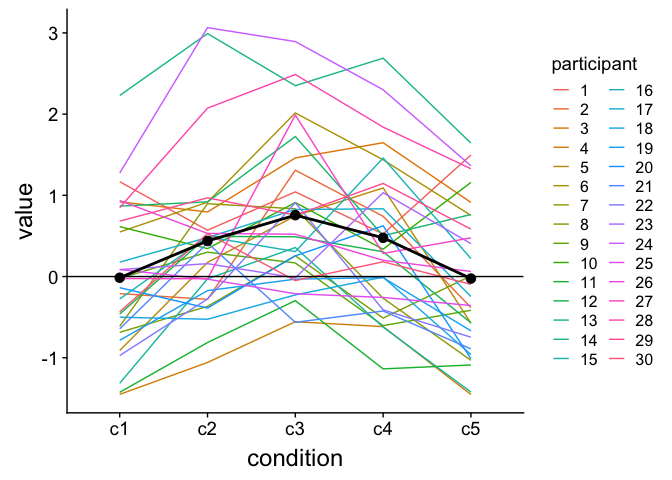
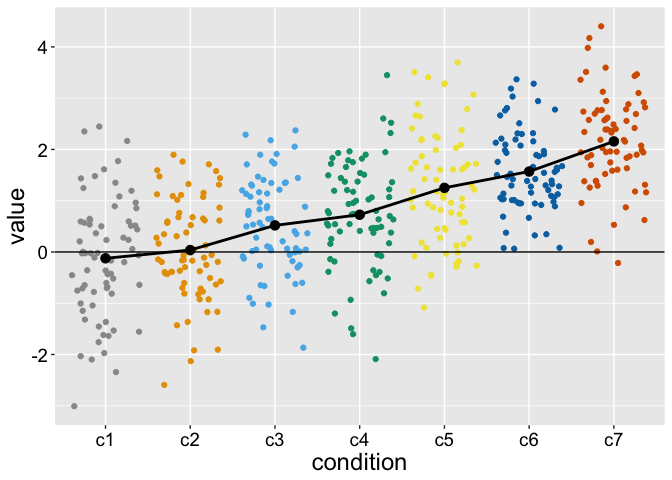

Cluster correction for multiple dependent comparisons: implementation
================
Guillaume A. Rousselet
2018-09-06

-   [Dependencies](#dependencies)
-   [Data: 5 independent groups](#data-5-independent-groups)
-   [Data: 5 dependent groups](#data-5-dependent-groups)
    -   [Make data frames](#make-data-frames)
    -   [Illustrate results](#illustrate-results)
    -   [Make t and p functions](#make-t-and-p-functions)
-   [Cluster correction](#cluster-correction)
    -   [Bootstrap function](#bootstrap-function)
    -   [Make bootstrap tables](#make-bootstrap-tables)
    -   [Make cluster functions](#make-cluster-functions)
    -   [Cluster test](#cluster-test)
-   [Data: 7 independent groups with linear pattern](#data-7-independent-groups-with-linear-pattern)
    -   [Create data and make data frames](#create-data-and-make-data-frames)
    -   [Illustrate results](#illustrate-results-1)

Dependencies
============

``` r
rm(list=ls())
library(MASS)
library(tibble)
library(tidyr)
library(dplyr)
library(ggplot2)
library(cowplot)
```

``` r
sessionInfo()
```

    ## R version 3.4.4 (2018-03-15)
    ## Platform: x86_64-apple-darwin15.6.0 (64-bit)
    ## Running under: OS X El Capitan 10.11.6
    ## 
    ## Matrix products: default
    ## BLAS: /Library/Frameworks/R.framework/Versions/3.4/Resources/lib/libRblas.0.dylib
    ## LAPACK: /Library/Frameworks/R.framework/Versions/3.4/Resources/lib/libRlapack.dylib
    ## 
    ## locale:
    ## [1] en_GB.UTF-8/en_GB.UTF-8/en_GB.UTF-8/C/en_GB.UTF-8/en_GB.UTF-8
    ## 
    ## attached base packages:
    ## [1] stats     graphics  grDevices utils     datasets  methods   base     
    ## 
    ## other attached packages:
    ## [1] cowplot_0.9.2 ggplot2_3.0.0 dplyr_0.7.6   tidyr_0.8.0   tibble_1.4.2 
    ## [6] MASS_7.3-49  
    ## 
    ## loaded via a namespace (and not attached):
    ##  [1] Rcpp_0.12.17     knitr_1.20       bindr_0.1.1      magrittr_1.5    
    ##  [5] munsell_0.4.3    tidyselect_0.2.4 colorspace_1.3-2 R6_2.2.2        
    ##  [9] rlang_0.2.1      plyr_1.8.4       stringr_1.2.0    tools_3.4.4     
    ## [13] grid_3.4.4       gtable_0.2.0     withr_2.1.2      htmltools_0.3.6 
    ## [17] lazyeval_0.2.1   yaml_2.1.16      rprojroot_1.3-1  digest_0.6.15   
    ## [21] assertthat_0.2.0 bindrcpp_0.2.2   purrr_0.2.5      glue_1.2.0      
    ## [25] evaluate_0.10.1  rmarkdown_1.9    stringi_1.1.6    compiler_3.4.4  
    ## [29] pillar_1.2.1     scales_0.5.0     backports_1.1.2  pkgconfig_2.0.1

Data: 5 independent groups
==========================

``` r
# set.seed(1)
# Ng <- 5 # n groups
# Np <- 30 # n participants per group
# ES <- c(0, 1, 2, 1, 0) # true effects
# data <- matrix(rnorm(Ng * Np), nrow = Np, ncol = Ng)
# data <- data + matrix(rep(ES,Np),nrow = Np, byrow = TRUE)
```

Data: 5 dependent groups
========================

``` r
# https://cognitivedatascientist.com/2015/12/14/power-simulation-in-r-the-repeated-measures-anova-5/
  
set.seed(1)
Ng <- 5 # n groups
Np <- 30 # n participants per group
rho = 0.75 # correlation between repeated measures
ES <- c(0, 0.5, 1, 0.5, 0) # true effects
sigma <- 1 # population standard deviation

# variance-covariance matrix
Sigma <- diag(nrow = Ng)
Sigma[Sigma == 0] <- rho

data <- mvrnorm(Np, ES, Sigma)
```

Make data frames
----------------

``` r
df <- as.tibble(data)
colnames(df) <- c("c1", "c2", "c3", "c4", "c5")
df <- gather(df, condition, value)
df$participant <- factor(rep(seq(1, Np), Ng))
df$condition <- factor(df$condition)

# data frame of means
tmp <- as_tibble(data)
colnames(tmp) <- c("c1", "c2", "c3", "c4", "c5")
# apply(data, 2, mean) # Mean per group
df.mean <- tidyr::gather(dplyr::summarise_all(tmp, funs(mean)),condition, value)
df.mean$condition <- as.factor(df.mean$condition)
```

Illustrate results
------------------

``` r
ggplot(df, aes(x=condition, y=value)) +
  geom_line(aes(group=participant, colour=participant)) +
  geom_line(data = df.mean, aes(group = 1), size = 1) +
  geom_point(data = df.mean, aes(group = 1), size = 3) +
  geom_abline(slope = 0, intercept = 0) + 
  theme(axis.title = element_text(size = 18),
        axis.text = element_text(size = 14, colour="black"))
```



``` r
# save figure
ggsave(filename='./figures/figure_5group_example.png',width=8,height=6)
```

Make t and p functions
----------------------

``` r
# functions work columwise
ctval <- function(x, nullval=0){
tval <- (apply(x, 2, mean)-nullval) / ( sqrt(apply(x, 2, var))/sqrt(nrow(x)) )
tval
}

cpval <- function(tval, df){
pval <- 2*(1-pt(abs(tval),df))
pval
}
```

T-tests per group

``` r
# tests <- apply(data, 2, t.test)
# pvals <- sapply(tests, function(x){x$p.value})
# pvals
# tvals <- sapply(tests, function(x){x$statistic})
# tvals
tvals <- ctval(data)
pvals <- cpval(tvals, df=Np-1)
```

Number of positive tests

``` r
sum(pvals < 0.05)
```

    ## [1] 3

Bonferonni correction

``` r
sum(p.adjust(pvals, method = "bonferroni") < 0.05)
```

    ## [1] 2

Hochberg correction

``` r
sum(p.adjust(pvals, method = "hochberg") < 0.05)
```

    ## [1] 3

Cluster correction
==================

Bootstrap function
------------------

``` r
bootfun <- function(data, nboot = 599){
  Np <- nrow(data)
  Ng <- ncol(data)
  # centre data so null hypothesis is true
  cdata <- data - matrix(rep(apply(data, 2, mean), Np), nrow = Np, byrow = TRUE)
  # dependent data, so sample participants with replacement
  bootsamples <- sample(Np, size = Np*nboot, replace = TRUE)
  boot.tvals <- matrix(data = 0, nrow = nboot, ncol = Ng)
  boot.pvals <- matrix(data = 0, nrow = nboot, ncol = Ng)
  
  for(G in 1:Ng){
    bootdata <- matrix(cdata[bootsamples,G], nrow = Np)
    # for each bootstrap:
    boot.tvals[,G] <- ctval(bootdata)
    boot.pvals[,G] <- cpval(boot.tvals[,G], df = Np-1)
  }
  list(tvals = boot.tvals, pvals = boot.pvals)
}
```

Make bootstrap tables
---------------------

``` r
boot.tables <- bootfun(data)
```

Make cluster functions
----------------------

### Test

``` r
# x <- c(1,0,0,0,1,1,1,0,0,1,1)
x <- sample(c(0,1), 20, replace = TRUE, prob = c(0.25, 0.75))
y <- rle(x)
cmap <- vector(mode = "numeric", length = 0)
nC <- length(y$values) # number of clusters
indx <- 0 # cluster counter

for(CL in 1:nC){
  if(y$values[CL] == 0){
    val <- 0
  } else {
    indx <- indx + 1
    val <- indx
  }
  cmap <- c(cmap, rep(val, y$lengths[CL]))
}
```

### cluster.make function

``` r
cluster.make <- function(x){
  y <- rle(x)
  cmap <- vector(mode = "numeric", length = 0)
  nC <- length(y$values) # number of clusters
  indx <- 0 # cluster counter
  for(CL in 1:nC){
    if(y$values[CL] == 0){
      val <- 0
    } else {
      indx <- indx + 1
      val <- indx
    }
    cmap <- c(cmap, rep(val, y$lengths[CL]))
  }
  cmap
}
```

### cluster.sum function

Save sum for each cluster

``` r
cluster.sum <- function(values, cmap){
  csum <- vector(mode = "numeric", length = max(cmap))
  if(max(cmap)>0){
    for(CL in 1:max(cmap)){
      csum[CL] <- sum(values[cmap==CL])
    }
  } else {
    csum <- 0
  }
  csum
}
```

check function

``` r
cluster.sum(values = x, cmap = cmap)
```

    ## [1] 6 3 5 1

Cluster test
------------

Make function

``` r
cluster.test <- function(values, cmap, boot.th){
    csig <- vector(mode = "logical", length = length(cmap))
  if(max(cmap)>0){
    for(CL in 1:max(cmap)){
      csig[cmap==CL] <- sum(values[cmap==CL]) > boot.th
    }
  } else {
    csig <- FALSE
  }
  csig
}
```

Check code

``` r
# original cluster sum
cmap <- cluster.make(pvals<0.05)
# ori.csum <- cluster.sum(values = tvals^2, cmap = cmap)

# bootstrap cluster sums
boot.tables <- bootfun(data)
boot.cmap <- t(apply(boot.tables$pvals<0.05, 1, cluster.make))
# boot.sums <- apply(boot.tables$tvals^2, 1, cluster.sum, cmap = boot.cmap)
boot.max.sums <- vector(mode = "numeric", length = nrow(boot.cmap))
for(B in 1:nrow(boot.tables$pvals)){
   boot.max.sums[B] <- max(cluster.sum(values = boot.tables$tvals[B,]^2, cmap = boot.cmap[B,]))
}

# cluster sum threshold
alpha <- 0.05
tmp <- sort(boot.max.sums)
boot.th <- tmp[round((1-alpha)*length(tmp))]

# cluster significance
cluster.test(values = tvals^2, cmap = cmap, boot.th)
```

    ## [1] FALSE  TRUE  TRUE  TRUE FALSE

Data: 7 independent groups with linear pattern
==============================================

Create data and make data frames
--------------------------------

``` r
set.seed(1)
Ng <- 7 # n groups
Np <- 70 # observations per group
ES <- c(0, seq(0,2, length.out = 6)) # effect size
# ESseq <- seq(0.5, 2, 0.5) # sequence of effect sizes
rho = 0 # correlation between measures
sigma <- 1 # population standard deviation
# variance-covariance matrix
Sigma <- diag(nrow = Ng)
Sigma[Sigma == 0] <- rho

data <- mvrnorm(Np, ES, Sigma)

df <- as.tibble(data)
colnames(df) <- c("c1", "c2", "c3", "c4", "c5", "c6", "c7")
df <- gather(df, condition, value)
df$condition <- factor(df$condition)

# data frame of means
tmp <- as_tibble(data)
colnames(tmp) <- c("c1", "c2", "c3", "c4", "c5", "c6", "c7")
# apply(data, 2, mean) # Mean per group
df.mean <- tidyr::gather(dplyr::summarise_all(tmp, funs(mean)),condition, value)
df.mean$condition <- as.factor(df.mean$condition)
```

Illustrate results
------------------

``` r
cbPalette <- c("#999999", "#E69F00", "#56B4E9", "#009E73", "#F0E442", "#0072B2", "#D55E00", "#CC79A7")

ggplot(df, aes(x=condition, y=value, colour=condition)) + theme_grey() + 
  geom_jitter() +
  scale_colour_manual(values=cbPalette) +
  geom_line(data = df.mean, aes(group = 1), colour = "black", size = 1) +
  geom_point(data = df.mean, colour = "black", size = 3) +
  geom_abline(slope = 0, intercept = 0) + 
  theme(axis.title = element_text(size = 18),
        axis.text = element_text(size = 14, colour="black"),
        legend.position="none")
```



``` r
  #       legend.text = element_text(size=12, face="bold"),
  #       legend.title = element_text(size=14, face="bold")) +
  # guides(colour = guide_legend(override.aes = list(size = 5)))

# save figure
ggsave(filename='./figures/figure_7ind_group_example.png',width=8,height=6)
```
