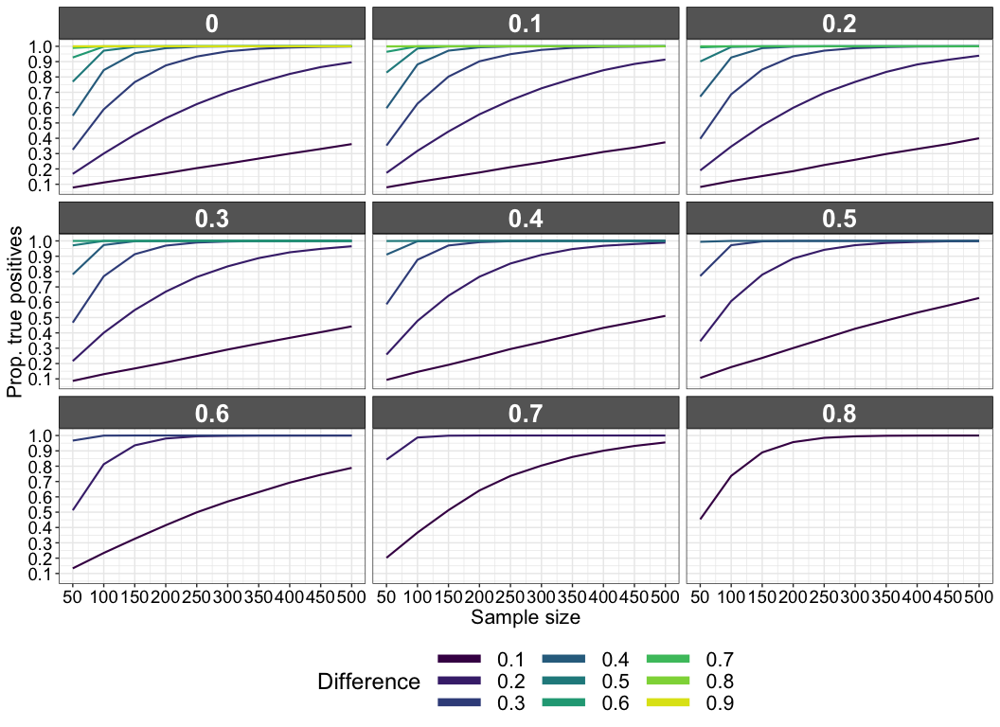

Comparison of independent correlations: power in the normal case for Pearson's correlation
================
Guillaume A. Rousselet
2019-07-23

We look at confidence interval coverage for the difference between Pearsons' correlations using Fisher's *r-to-z* transform. Simulations with 10,000 iterations. Sampling is from a normal bivariate distribution (*g* = *h* = 0). We vary the sampling size *n*, *rho1* and the difference between *rho1* and *rho2*. The goal is to illustrate the very large numbers of trials required to detect differences between independent correlation coefficients.

Dependencies
============

``` r
library(ggplot2)
library(tibble)
library(beepr)
source("./functions/theme_gar.txt")
## g & h multivariate distributions
source("./functions/ghmult.txt")
## bootstrap + core corr functions
source("./functions/corfun.txt")
```

Simulation
==========

Group 1 has values of *rho1* = 0 to 0.8, in steps of 0.1. Group 2 has values of *rho2* = *rho1* + *es*, where *es* varies from 0.1 to 0.9 for *rho1* = 0, from 0.1 to 0.7 for *rho1* = 0.2, and so on. For *rho1* = 0.8, only *es* = 0.1 is tested

``` r
rhoseq <- seq(0, 0.8, 0.1)
nr <- length(rhoseq)
nseq <- seq(50, 500, 50)
nn <- length(nseq)
full.esseq <- seq(0.1, 0.9, 0.1) # full sequence of effect sizes
nmax <- max(nseq)
nsim <- 10000
g <- 0
h <- 0
alpha <- .05

# coverage
pears.power <- array(0, dim = c(nr, nn, 9))
# 9 = max number of effect sizes for rho1 = 0

for(R in 1:nr){
  beep(2)
  set.seed(21) # set seed inside R loop to allow direct comparisons
  # (numbers are the same except for the correlation)
  rho <- rhoseq[R]
  print(paste("sim diff 0.1, g=0, h=0, rho =",rho))
  cmat1 <- matrix(c(1,rho,rho,1),2,2)
  
  nes <- (0.9 - rho) / 0.1
  esseq <- full.esseq[1:nes] # current sequence of effect sizes
  
  for(ES in 1:nes){
    
    es <- esseq[ES] # current effect size
    cmat2 <- matrix(c(1,rho+es,rho+es,1),2,2)
    
    for(S in 1:nsim){
      # if(S %% 500 == 0){print(paste0("normal sim ",S," / ",nsim,"..."))}
      # generate max n sample
      out1 <- ghmul(nmax, g=g, h=h, p=2, cmat=cmat1)  
      out2 <- ghmul(nmax, g=g, h=h, p=2, cmat=cmat2) 
      
      for(N in 1:length(nseq)){
        # subsample from max n sample
        x1 <- out1[1:nseq[N],1]
        y1 <- out1[1:nseq[N],2]
        x2 <- out2[1:nseq[N],1]
        y2 <- out2[1:nseq[N],2]
        
        r1 <- cor(x1, y1)
        r2 <- cor(x2, y2)
        n1 <- length(x1)
        n2 <- length(x2)
        
        if(fisher.cor.test(r1, r2, n1, n2) <= alpha){
          pears.power[R, N, ES] <- pears.power[R, N, ES] + 1
        }
      }
    }
  }
}

pears.power <- pears.power / nsim

beep(8)

save(pears.power, rhoseq, nseq, nsim, full.esseq,
     file = "./data/g0h0_vrho_vdiff_covtest.RData")
```

Illustrate results
==================

``` r
load("./data/g0h0_vrho_vdiff_covtest.RData")
nn <- length(nseq)
nr <- length(rhoseq)
pears.power[pears.power == 0] <- NA
df <- tibble(power = as.vector(pears.power),
             rho = rep(rhoseq, nn*9),
             n = rep(rep(nseq, each = nr), 9),
             es = factor(rep(full.esseq, each = nr * nn))
             )

ggplot(df, aes(x = n, y = power, colour = es)) + theme_gar +
  geom_line(size = 0.75) + 
  scale_colour_viridis_d(end = 0.95) +
  guides(colour = guide_legend(override.aes = list(size = 3),
                               title="Difference",
                               nrow = 3)) +
  theme(legend.position = "bottom") +
  scale_y_continuous(breaks = seq(0, 1, 0.1)) +
  scale_x_continuous(breaks = nseq) +
  labs(x = "Sample size",
       y = "Prop. true positives") +
  facet_wrap(facets = vars(rho), nrow = 3)
```


