Comparison of independent correlations: confidence interval coverage
================
Guillaume A. Rousselet
2019-07-12

We look at confidence interval coverage for the difference between
Pearsons’ correlations using Zou’s method (2007) and the percentile
bootstrap (Wilcox, 2009). We do the same for the comparison of
Spearmans’ correlations using the percentile bootstrap. Simulations
with 4,000 iterations. Sampling is from *g & h* distributions.

We consider 4 cases:

  - g = h = 0, difference = 0.1, vary rho
  - g = 1, h = 0, difference = 0.1, vary rho
  - rho = 0.3, difference = 0.2, vary g, h = 0
  - rho = 0.3, difference = 0.2, vary g, h = 0.2

# Dependencies

``` r
library(ggplot2)
library(tibble)
library(beepr)
source("./functions/theme_gar.txt")
## g & h multivariate distributions
source("./functions/ghmult.txt")
## bootstrap + core corr functions
source("./functions/corfun.txt")
## meta-function for simulations
source("./functions/twocor.all.txt")
## plot functions
source("./functions/make_figures.txt")
```

# g = h = 0, difference = 0.1, vary rho

Group 1 has values of rho1 = 0 to 0.8, in steps of 0.1. Group 2 has
values of rho2 = rho1 + 0.1.

``` r
rhoseq <- seq(0, 0.8, 0.1)
nseq <- seq(50, 500, 50)
nmax <- max(nseq)
nr <- length(rhoseq)
nsim <- 4000
es <- 0.1 # effect size
g <- 0
h <- 0
alpha <- .05
nboot <- 599

# coverage
cov.spear <- array(0, dim = c(nsim, nr, length(nseq)))
cov.pears.boot <- array(0, dim = c(nsim, nr, length(nseq)))
cov.pears.zou <- array(0, dim = c(nsim, nr, length(nseq)))
# direction of discrepancy
dis.spear <- array(NA, dim = c(nsim, nr, length(nseq)))
dis.pears.boot <- array(NA, dim = c(nsim, nr, length(nseq)))
dis.pears.zou <- array(NA, dim = c(nsim, nr, length(nseq)))
# ci width
wid.spear <- array(0, dim = c(nsim, nr, length(nseq)))
wid.pears.boot <- array(0, dim = c(nsim, nr, length(nseq)))
wid.pears.zou <- array(0, dim = c(nsim, nr, length(nseq)))

for(R in 1:nr){
  beep(2)
  set.seed(21) # set seed inside R loop to allow direct comparisons
  # (numbers are the same except for the correlation)
  rho <- rhoseq[R]
  print(paste("sim diff 0.1, g=0, h=0, rho =",rho))
  cmat1 <- matrix(c(1,rho,rho,1),2,2)
  cmat2 <- matrix(c(1,rho+es,rho+es,1),2,2)
  for(S in 1:nsim){
    if(S %% 500 == 0){print(paste0("sim ",S," / ",nsim,"..."))}
    # generate max n sample
    out1 <- ghmul(nmax, g=g, h=h, p=2, cmat=cmat1)  
    out2 <- ghmul(nmax, g=g, h=h, p=2, cmat=cmat2) 
    for(N in 1:length(nseq)){
      # subsample from max n sample
      x1 <- out1[1:nseq[N],1]
      y1 <- out1[1:nseq[N],2]
      x2 <- out2[1:nseq[N],1]
      y2 <- out2[1:nseq[N],2]

      # BOOTSTRAP SAMPLES -------------
      data1 <- matrix(sample(length(y1),size=length(y1)*nboot,replace=TRUE),nrow=nboot)
      data2 <- matrix(sample(length(y2),size=length(y2)*nboot,replace=TRUE),nrow=nboot)
      
      # PEARSON ---------------
      bvec1 <- apply(data1,1,pearsboot,x1,y1) # A 1 by nboot matrix.
      bvec2 <- apply(data2,1,pearsboot,x2,y2) # A 1 by nboot matrix.
      bvec <- bvec1 - bvec2
      ilow<-15
      ihi<-584
      if(length(y1)+length(y2) < 250){
        ilow<-14
        ihi<-585
      }
      if(length(y1)+length(y2) < 180){
        ilow<-11
        ihi<-588
      }
      if(length(y1)+length(y2) < 80){
        ilow<-8
        ihi<-592
      }
      if(length(y1)+length(y2) < 40){
        ilow<-7
        ihi<-593
      }
      bsort <- sort(bvec)
      ci <- c(bsort[ilow],bsort[ihi])
      if(-es >= ci[1] && -es <= ci[2]){
        cov.pears.boot[S, R, N] <- 1
      }
      if(cov.pears.boot[S, R, N] == 0){ # direction of discrepancy
        if(-es > ci[2]){
        dis.pears.boot[S, R, N] <- -1 # left shift
        }
        if(-es < ci[1]){
        dis.pears.boot[S, R, N] <- 1 # right shift
        }
      }
      wid.pears.boot[S, R, N] <- ci[2] - ci[1] # ci width
      
      # ZOU 2007 --------------
      r1 <- cor(x1, y1)
      r2 <- cor(x2, y2)
      n1 <- length(x1)
      n2 <- length(x2)
      ci <- r.ind.ci(r1, r2, n1, n2)
      if(-es >= ci[1] && -es <= ci[2]){
        cov.pears.zou[S, R, N] <- 1
      }
      if(cov.pears.zou[S, R, N] == 0){ # direction of discrepancy
        if(-es > ci[2]){
        dis.pears.zou[S, R, N] <- -1 # left shift
        }
        if(-es < ci[1]){
        dis.pears.zou[S, R, N] <- 1 # right shift
        }
      }
      wid.pears.zou[S, R, N] <- ci[2] - ci[1] # ci width
      
      # SPEARMAN --------------
      bvec1 <- apply(data1,1,spearboot,x1,y1) # A 1 by nboot matrix.
      bvec2 <- apply(data2,1,spearboot,x2,y2) # A 1 by nboot matrix.
      bvec <- bvec1 - bvec2
      bsort <- sort(bvec)
      ilow <- round((alpha/2) * nboot)
      ihi <- nboot - ilow
      ilow <- ilow+1
      ci <- c(bsort[ilow],bsort[ihi])
      if(-es >= ci[1] && -es <= ci[2]){
        cov.spear[S, R, N] <- 1
      }
      if(cov.spear[S, R, N] == 0){ # direction of discrepancy
        if(-es > ci[2]){
        dis.spear[S, R, N] <- -1 # left shift
        }
        if(-es < ci[1]){
        dis.spear[S, R, N] <- 1 # right shift
        }
      }
      wid.spear[S, R, N] <- ci[2] - ci[1] # ci width
    }
  }
}

beep(8)

save(cov.spear, cov.pears.boot, cov.pears.zou,
     dis.spear, dis.pears.boot, dis.pears.zou,
     wid.spear, wid.pears.boot, wid.pears.zou,
     rhoseq, nseq, nsim, es, g, h,
     file = "./data/diff01_g0h0_varyrho_covtest.RData")
```

## Results: coverage

For normal bivariate distributions, coverage is at the nominal level for
all methods, sample sizes and population correlations.

### Pearson + Zou

``` r
load("./data/diff01_g0h0_varyrho_covtest.RData")
pres <- apply(cov.pears.zou, c(2,3), mean)
df <- mdf(pres, nseq, rhoseq)
p <- plot.res.cov(df) + ggtitle("Pearson + Zou") + 
      theme(legend.position = c(0.15, 0.4))
p
```

<!-- -->

``` r
pA <- p
```

### Pearson + bootstrap

``` r
pres <- apply(cov.pears.boot, c(2,3), mean)
df <- mdf(pres, nseq, rhoseq)
p <- plot.res.cov(df) + ggtitle("Pearson + bootstrap") + 
      theme(legend.position = "none")
p
```

<!-- -->

``` r
pB <- p
```

### Spearman + bootstrap

``` r
pres <- apply(cov.spear, c(2,3), mean)
df <- mdf(pres, nseq, rhoseq)
p <- plot.res.cov(df) + ggtitle("Spearman + bootstrap") +
      theme(legend.position = "none")
p
```

<!-- -->

``` r
pC <- p
```

### Summary figure

``` r
cowplot::plot_grid(pA, pB, pC,
                   labels = c("A", "B", "C"), 
                   nrow = 3)

# save figure
ggsave(filename=('./figures/figure_g0h0_varyrho_cov.pdf'),width=8,height=13)
```

## Results: width

The width of the CIs increases with rho.

### Pearson + Zou

``` r
pres <- apply(wid.pears.zou, c(2,3), median)
df <- mdf(pres, nseq, rhoseq)
p <- plot.res.wid(df) + ggtitle("Pearson + Zou") + 
      theme(legend.position = "none")
p
```

<!-- -->

``` r
pA <- p
```

### Pearson + bootstrap

``` r
pres <- apply(wid.pears.boot, c(2,3), median)
df <- mdf(pres, nseq, rhoseq)
p <- plot.res.wid(df) + ggtitle("Pearson + bootstrap") + 
      theme(legend.position = "none")
p
```

<!-- -->

``` r
pB <- p
```

### Spearman + bootstrap

``` r
pres <- apply(wid.spear, c(2,3), median)
df <- mdf(pres, nseq, rhoseq)
p <- plot.res.wid(df) + ggtitle("Spearman + bootstrap") + 
      theme(legend.position = "none")
p
```

<!-- -->

``` r
pC <- p
```

### Summary figure

``` r
cowplot::plot_grid(pA, pB, pC,
                   labels = c("A", "B", "C"), 
                   nrow = 3)

# save figure
ggsave(filename=('./figures/figure_g0h0_varyrho_wid.pdf'),width=8,height=13)
```

## Results: direction of discrepancy

When CIs do not include population value, are they located to the left
or the right of the population? Negative values indicate a preponderance
of left shifts, positive values a preponderance of right shifts. A value
of 1 = 100% right shifts, -1 = 100% left shift.

### Pearson + Zou

``` r
pres <- apply(dis.pears.zou, c(2,3), mean, na.rm = TRUE)
df <- mdf(pres, nseq, rhoseq)
p <- plot.res.dis(df) + ggtitle("Pearson + Zou") + 
      theme(legend.position = "none")
p
```

<!-- -->

``` r
pA <- p
```

### Pearson + bootstrap

``` r
pres <- apply(dis.pears.boot, c(2,3), mean, na.rm = TRUE)
df <- mdf(pres, nseq, rhoseq)
p <- plot.res.dis(df) + ggtitle("Pearson + bootstrap") + 
      theme(legend.position = "none")
p
```

<!-- -->

``` r
pB <- p
```

### Spearman + bootstrap

``` r
pres <- apply(dis.spear, c(2,3), mean, na.rm = TRUE)
df <- mdf(pres, nseq, rhoseq)
p <- plot.res.dis(df) + ggtitle("Spearman + bootstrap") + 
      theme(legend.position = "none")
p
```

<!-- -->

``` r
pC <- p
```

Preponderance of left shifted CIs.

### Summary figure

``` r
cowplot::plot_grid(pA, pB, pC,
                   labels = c("A", "B", "C"), 
                   nrow = 3)

# save figure
ggsave(filename=('./figures/figure_g0h0_varyrho_dis.pdf'),width=8,height=13)
```

# g = 1, h = 0, vary rho

``` r
rhoseq <- seq(0, 0.8, 0.1)
nseq <- seq(50, 500, 50)
nmax <- max(nseq)
nr <- length(rhoseq)
nsim <- 4000
es <- 0.1 # effect size
g <- 1
h <- 0
alpha <- .05
nboot <- 599

# coverage
cov.spear <- array(0, dim = c(nsim, nr, length(nseq)))
cov.pears.boot <- array(0, dim = c(nsim, nr, length(nseq)))
cov.pears.zou <- array(0, dim = c(nsim, nr, length(nseq)))
# direction of discrepancy
dis.spear <- array(NA, dim = c(nsim, nr, length(nseq)))
dis.pears.boot <- array(NA, dim = c(nsim, nr, length(nseq)))
dis.pears.zou <- array(NA, dim = c(nsim, nr, length(nseq)))
# ci width
wid.spear <- array(0, dim = c(nsim, nr, length(nseq)))
wid.pears.boot <- array(0, dim = c(nsim, nr, length(nseq)))
wid.pears.zou <- array(0, dim = c(nsim, nr, length(nseq)))

for(R in 1:nr){
  beep(2)
  set.seed(21) # set seed inside R loop to allow direct comparisons
  # (numbers are the same except for the correlation)
  rho <- rhoseq[R]
  print(paste("sim diff 0.1, g=0, h=0, rho =",rho))
  cmat1 <- matrix(c(1,rho,rho,1),2,2)
  cmat2 <- matrix(c(1,rho+es,rho+es,1),2,2)
  for(S in 1:nsim){
    if(S %% 500 == 0){print(paste0("sim ",S," / ",nsim,"..."))}
    # generate max n sample
    out1 <- ghmul(nmax, g=g, h=h, p=2, cmat=cmat1)  
    out2 <- ghmul(nmax, g=g, h=h, p=2, cmat=cmat2) 
    for(N in 1:length(nseq)){
      # subsample from max n sample
      x1 <- out1[1:nseq[N],1]
      y1 <- out1[1:nseq[N],2]
      x2 <- out2[1:nseq[N],1]
      y2 <- out2[1:nseq[N],2]

      # BOOTSTRAP SAMPLES -------------
      data1 <- matrix(sample(length(y1),size=length(y1)*nboot,replace=TRUE),nrow=nboot)
      data2 <- matrix(sample(length(y2),size=length(y2)*nboot,replace=TRUE),nrow=nboot)
      
      # PEARSON ---------------
      bvec1 <- apply(data1,1,pearsboot,x1,y1) # A 1 by nboot matrix.
      bvec2 <- apply(data2,1,pearsboot,x2,y2) # A 1 by nboot matrix.
      bvec <- bvec1 - bvec2
      ilow<-15
      ihi<-584
      if(length(y1)+length(y2) < 250){
        ilow<-14
        ihi<-585
      }
      if(length(y1)+length(y2) < 180){
        ilow<-11
        ihi<-588
      }
      if(length(y1)+length(y2) < 80){
        ilow<-8
        ihi<-592
      }
      if(length(y1)+length(y2) < 40){
        ilow<-7
        ihi<-593
      }
      bsort <- sort(bvec)
      ci <- c(bsort[ilow],bsort[ihi])
      if(-es >= ci[1] && -es <= ci[2]){
        cov.pears.boot[S, R, N] <- 1
      }
      if(cov.pears.boot[S, R, N] == 0){ # direction of discrepancy
        if(-es > ci[2]){
        dis.pears.boot[S, R, N] <- -1 # left shift
        }
        if(-es < ci[1]){
        dis.pears.boot[S, R, N] <- 1 # right shift
        }
      }
      wid.pears.boot[S, R, N] <- ci[2] - ci[1] # ci width
      
      # ZOU 2007 --------------
      r1 <- cor(x1, y1)
      r2 <- cor(x2, y2)
      n1 <- length(x1)
      n2 <- length(x2)
      ci <- r.ind.ci(r1, r2, n1, n2)
      if(-es >= ci[1] && -es <= ci[2]){
        cov.pears.zou[S, R, N] <- 1
      }
      if(cov.pears.zou[S, R, N] == 0){ # direction of discrepancy
        if(-es > ci[2]){
        dis.pears.zou[S, R, N] <- -1 # left shift
        }
        if(-es < ci[1]){
        dis.pears.zou[S, R, N] <- 1 # right shift
        }
      }
      wid.pears.zou[S, R, N] <- ci[2] - ci[1] # ci width
      
      # SPEARMAN --------------
      bvec1 <- apply(data1,1,spearboot,x1,y1) # A 1 by nboot matrix.
      bvec2 <- apply(data2,1,spearboot,x2,y2) # A 1 by nboot matrix.
      bvec <- bvec1 - bvec2
      bsort <- sort(bvec)
      ilow <- round((alpha/2) * nboot)
      ihi <- nboot - ilow
      ilow <- ilow+1
      ci <- c(bsort[ilow],bsort[ihi])
      if(-es >= ci[1] && -es <= ci[2]){
        cov.spear[S, R, N] <- 1
      }
      if(cov.spear[S, R, N] == 0){ # direction of discrepancy
        if(-es > ci[2]){
        dis.spear[S, R, N] <- -1 # left shift
        }
        if(-es < ci[1]){
        dis.spear[S, R, N] <- 1 # right shift
        }
      }
      wid.spear[S, R, N] <- ci[2] - ci[1] # ci width
    }
  }
}

beep(8)

save(cov.spear, cov.pears.boot, cov.pears.zou,
     dis.spear, dis.pears.boot, dis.pears.zou,
     wid.spear, wid.pears.boot, wid.pears.zou,
     rhoseq, nseq, nsim, es, g, h,
     file = "./data/diff01_g1h0_varyrho_covtest.RData")
```

## Results: coverage

What happens when sample from a skewed distribution? The coverage is
lower than expected (95%) for Zou’s method and the discrepancy worsens
with rho1 and with sample size. The percentile bootstrap does a much
better job. Spearman’s combined with the percentile bootstrap is spot
on.

### Pearson + Zou

``` r
load("./data/diff01_g1h0_varyrho_covtest.RData")
pres <- apply(cov.pears.zou, c(2,3), mean)
df <- mdf(pres, nseq, rhoseq)
p <- plot.res.cov(df, ylim = c(0.45, 1)) + ggtitle("Pearson + Zou") + 
      theme(legend.position = "none")
p
```

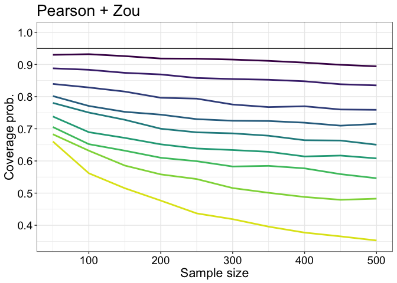<!-- -->

``` r
pA <- p
```

### Pearson + bootstrap

``` r
pres <- apply(cov.pears.boot, c(2,3), mean)
df <- mdf(pres, nseq, rhoseq)
p <- plot.res.cov(df, ylim = c(0.45, 1)) + ggtitle("Pearson + bootstrap") + 
      theme(legend.position = c(0.15, 0.4))
p
```

<!-- -->

``` r
pB <- p
```

### Spearman + bootstrap

``` r
pres <- apply(cov.spear, c(2,3), mean)
df <- mdf(pres, nseq, rhoseq)
p <- plot.res.cov(df, ylim = c(0.45, 1)) + ggtitle("Spearman + bootstrap") + 
      theme(legend.position = "none")
p
```

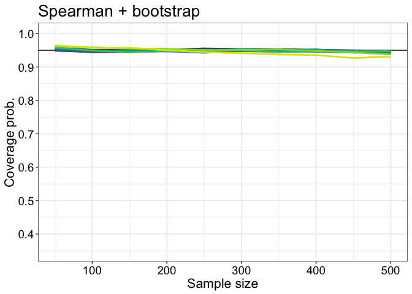<!-- -->

``` r
pC <- p
```

### Summary figure

``` r
cowplot::plot_grid(pA, pB, pC,
                   labels = c("A", "B", "C"), 
                   nrow = 3)

# save figure
ggsave(filename=('./figures/figure_g1h0_varyrho_cov.pdf'),width=8,height=13)
```

## Results: width

### Pearson + Zou

``` r
pres <- apply(wid.pears.zou, c(2,3), median)
df <- mdf(pres, nseq, rhoseq)
p <- plot.res.wid(df) + ggtitle("Pearson + Zou") + 
      theme(legend.position = "none")
p
```

<!-- -->

``` r
pA <- p
```

### Pearson + bootstrap

``` r
pres <- apply(wid.pears.boot, c(2,3), median)
df <- mdf(pres, nseq, rhoseq)
p <- plot.res.wid(df) + ggtitle("Pearson + bootstrap") + 
      theme(legend.position = "none")
p
```

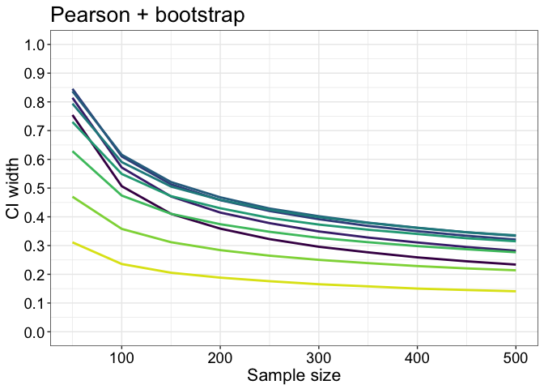<!-- -->

``` r
pB <- p
```

It seems Pearson + bootstrap performs better than Zou by producing
larger CIs. Also notice the non-linearity in the relationship between
width and rho. Not sure what’s going on there.

### Spearman + bootstrap

``` r
pres <- apply(wid.spear, c(2,3), median)
df <- mdf(pres, nseq, rhoseq)
p <- plot.res.wid(df) + ggtitle("Spearman + bootstrap") + 
      theme(legend.position = "none")
p
```

<!-- -->

``` r
pC <- p
```

### Summary figure

``` r
cowplot::plot_grid(pA, pB, pC,
                   labels = c("A", "B", "C"), 
                   nrow = 3)

# save figure
ggsave(filename=('./figures/figure_g1h0_varyrho_wid.pdf'),width=8,height=13)
```

## Results: direction of discrepancy

### Pearson + Zou

``` r
pres <- apply(dis.pears.zou, c(2,3), mean, na.rm = TRUE)
df <- mdf(pres, nseq, rhoseq)
p <- plot.res.dis(df) + ggtitle("Pearson + Zou") + 
      theme(legend.position = "none")
p
```

<!-- -->

``` r
pA <- p
```

### Pearson + bootstrap

``` r
pres <- apply(dis.pears.boot, c(2,3), mean, na.rm = TRUE)
df <- mdf(pres, nseq, rhoseq)
p <- plot.res.dis(df) + ggtitle("Pearson + bootstrap") + 
      theme(legend.position = "none")
p
```

<!-- -->

``` r
pB <- p
```

### Spearman + bootstrap

``` r
pres <- apply(dis.spear, c(2,3), mean, na.rm = TRUE)
df <- mdf(pres, nseq, rhoseq)
p <- plot.res.dis(df) + ggtitle("Spearman + bootstrap") + 
      theme(legend.position = "none")
p
```

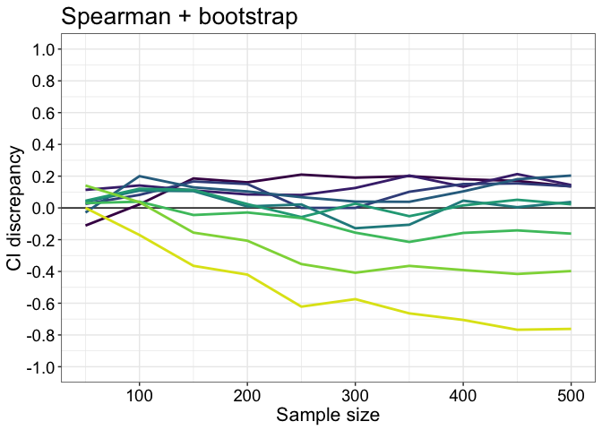<!-- -->

``` r
pC <- p
```

### Summary figure

``` r
cowplot::plot_grid(pA, pB, pC,
                   labels = c("A", "B", "C"), 
                   nrow = 3)

# save figure
ggsave(filename=('./figures/figure_g1h0_varyrho_dis.pdf'),width=8,height=13)
```

## Illustrate CI that did not include the population

### Simulation for subset of conditions

  - n = 200
  - rho = 0/0.8
  - es = 0.1

<!-- end list -->

``` r
rhoseq <- c(0, 0.8)
n <- 200
nr <- length(rhoseq)
nsim <- 4000
es <- 0.1 # effect size
g <- 1
h <- 0
alpha <- .05
nboot <- 599

# coverage
cov.spear <- array(0, dim = c(nsim, nr))
cov.pears.boot <- array(0, dim = c(nsim, nr))
cov.pears.zou <- array(0, dim = c(nsim, nr))

# ci
ci.spear <- array(0, dim = c(nsim, nr, 2))
ci.pears.boot <- array(0, dim = c(nsim, nr, 2))
ci.pears.zou <- array(0, dim = c(nsim, nr, 2))

for(R in 1:nr){
  beep(2)
  set.seed(21) # set seed inside R loop to allow direct comparisons
  # (numbers are the same except for the correlation)
  rho <- rhoseq[R]
  print(paste("sim diff 0.1, g=0, h=0, rho =",rho))
  cmat1 <- matrix(c(1,rho,rho,1),2,2)
  cmat2 <- matrix(c(1,rho+es,rho+es,1),2,2)
  for(S in 1:nsim){
    if(S %% 500 == 0){print(paste0("sim ",S," / ",nsim,"..."))}
    # generate max n sample
    out1 <- ghmul(n, g=g, h=h, p=2, cmat=cmat1)  
    out2 <- ghmul(n, g=g, h=h, p=2, cmat=cmat2) 
    x1 <- out1[,1]
    y1 <- out1[,2]
    x2 <- out2[,1]
    y2 <- out2[,2]
    
    # BOOTSTRAP SAMPLES -------------
    data1 <- matrix(sample(length(y1),size=length(y1)*nboot,replace=TRUE),nrow=nboot)
    data2 <- matrix(sample(length(y2),size=length(y2)*nboot,replace=TRUE),nrow=nboot)
    
    # PEARSON ---------------
    bvec1 <- apply(data1,1,pearsboot,x1,y1) # A 1 by nboot matrix.
    bvec2 <- apply(data2,1,pearsboot,x2,y2) # A 1 by nboot matrix.
    bvec <- bvec1 - bvec2
    ilow<-15
    ihi<-584
    if(length(y1)+length(y2) < 250){
      ilow<-14
      ihi<-585
    }
    if(length(y1)+length(y2) < 180){
      ilow<-11
      ihi<-588
    }
    if(length(y1)+length(y2) < 80){
      ilow<-8
      ihi<-592
    }
    if(length(y1)+length(y2) < 40){
      ilow<-7
      ihi<-593
    }
    bsort <- sort(bvec)
    ci <- c(bsort[ilow],bsort[ihi])
    ci.pears.boot[S, R, ] <- ci
    if(-es >= ci[1] && -es <= ci[2]){
      cov.pears.boot[S, R] <- 1
    }
    
    # ZOU 2007 --------------
    r1 <- cor(x1, y1)
    r2 <- cor(x2, y2)
    n1 <- length(x1)
    n2 <- length(x2)
    ci <- r.ind.ci(r1, r2, n1, n2)
    ci.pears.zou[S, R, ] <- ci
    if(-es >= ci[1] && -es <= ci[2]){
      cov.pears.zou[S, R] <- 1
    }
    
    # SPEARMAN --------------
    bvec1 <- apply(data1,1,spearboot,x1,y1) # A 1 by nboot matrix.
    bvec2 <- apply(data2,1,spearboot,x2,y2) # A 1 by nboot matrix.
    bvec <- bvec1 - bvec2
    bsort <- sort(bvec)
    ilow <- round((alpha/2) * nboot)
    ihi <- nboot - ilow
    ilow <- ilow+1
    ci <- c(bsort[ilow],bsort[ihi])
    ci.spear[S, R, ] <- ci
    if(-es >= ci[1] && -es <= ci[2]){
      cov.spear[S, R] <- 1
    }
  }
}

beep(8)

save(cov.spear, cov.pears.boot, cov.pears.zou,
     ci.spear, ci.pears.boot, ci.pears.zou,
     rhoseq, n, nsim, es, g, h,
     file = "./data/diff01_g1h0_varyrho_ci.RData")
```

### Results for rho = 0

#### Pearson + Zou

``` r
load(file = "./data/diff01_g1h0_varyrho_ci.RData")

pop <- -es
cond <- 1 # rho = 0
ci <- ci.pears.zou[cov.pears.zou[,cond]==0, cond,]
df <- tibble(x1 = ci[,1],
             x2 = ci[,2],
             y = seq(1,length(x1)))

p <- ggplot(df, aes(x = x1, xend = x2, y = y, yend = y)) + theme_gar +
  geom_segment() +
  geom_vline(xintercept = pop) +
  labs(x = "Bounds", y = "Confidence intervals") +
  coord_cartesian(xlim = c(-0.8, 0.8)) +
  scale_x_continuous(breaks = seq(-1, 1, 0.2)) +
  ggtitle("Pearson + Zou")
p
```

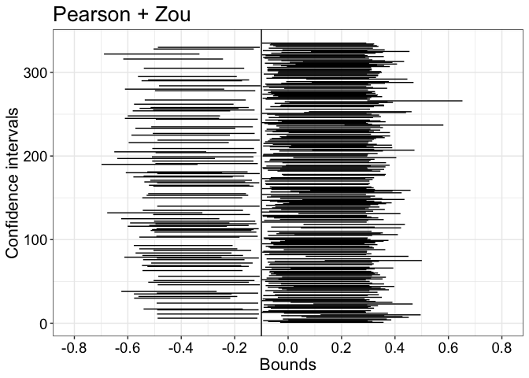<!-- -->

``` r
pA <- p
```

#### Pearson + bootstrap

``` r
ci <- ci.pears.boot[cov.pears.boot[,cond]==0, cond,]
df <- tibble(x1 = ci[,1],
             x2 = ci[,2],
             y = seq(1,length(x1)))

p <- ggplot(df, aes(x = x1, xend = x2, y = y, yend = y)) + theme_gar +
  geom_segment() +
  geom_vline(xintercept = pop) +
  labs(x = "Bounds", y = "Confidence intervals") +
  coord_cartesian(xlim = c(-0.8, 0.8)) +
  scale_x_continuous(breaks = seq(-1, 1, 0.2)) +
  ggtitle("Pearson + bootstrap") 
p
```

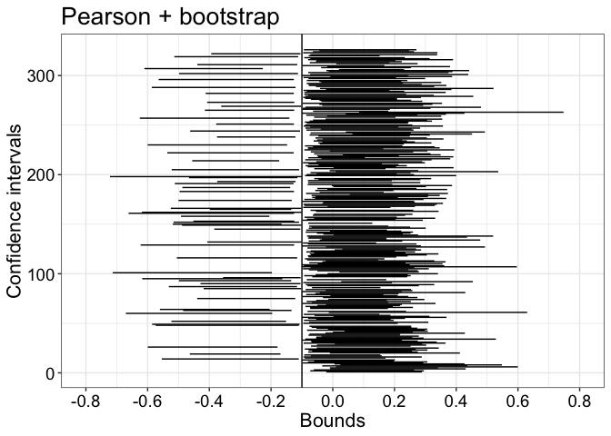<!-- -->

``` r
pB <- p
```

#### Spearman + bootstrap

``` r
ci <- ci.spear[cov.spear[,cond]==0, cond,]
df <- tibble(x1 = ci[,1],
             x2 = ci[,2],
             y = seq(1,length(x1)))

p <- ggplot(df, aes(x = x1, xend = x2, y = y, yend = y)) + theme_gar +
  geom_segment() +
  geom_vline(xintercept = pop) +
  labs(x = "Bounds", y = "Confidence intervals") +
  coord_cartesian(xlim = c(-0.8, 0.8)) +
  scale_x_continuous(breaks = seq(-1, 1, 0.2)) +
  ggtitle("Spearman + bootstrap")
p
```

<!-- -->

``` r
pC <- p
```

## Summary figure

``` r
cowplot::plot_grid(pA, pB, pC,
                   labels = c("A", "B", "C"), 
                   nrow = 3)

# save figure
ggsave(filename=('./figures/figure_g1h0_rho0_ci.pdf'),width=8,height=13)
```

### Results for rho = 0.8

#### Pearson + Zou

``` r
cond <- 2 # rho = 0.8
ci <- ci.pears.zou[cov.pears.zou[,cond]==0, cond,]
df <- tibble(x1 = ci[,1],
             x2 = ci[,2],
             y = seq(1,length(x1)))

p <- ggplot(df, aes(x = x1, xend = x2, y = y, yend = y)) + theme_gar +
  geom_segment() +
  geom_vline(xintercept = pop) +
  labs(x = "Bounds", y = "Confidence intervals") +
  coord_cartesian(xlim = c(-0.8, 0.8)) +
  scale_x_continuous(breaks = seq(-1, 1, 0.2)) +
  ggtitle("Pearson + Zou")
p
```

<!-- -->

``` r
pA <- p
```

#### Pearson + bootstrap

``` r
ci <- ci.pears.boot[cov.pears.boot[,cond]==0, cond,]
df <- tibble(x1 = ci[,1],
             x2 = ci[,2],
             y = seq(1,length(x1)))

p <- ggplot(df, aes(x = x1, xend = x2, y = y, yend = y)) + theme_gar +
  geom_segment() +
  geom_vline(xintercept = pop) +
  labs(x = "Bounds", y = "Confidence intervals") +
  coord_cartesian(xlim = c(-0.8, 0.8)) +
  scale_x_continuous(breaks = seq(-1, 1, 0.2)) +
  ggtitle("Pearson + bootstrap") 
p
```

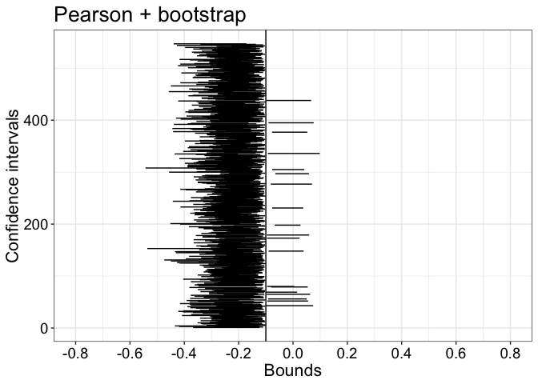<!-- -->

``` r
pB <- p
```

#### Spearman + bootstrap

``` r
ci <- ci.spear[cov.spear[,cond]==0, cond,]
df <- tibble(x1 = ci[,1],
             x2 = ci[,2],
             y = seq(1,length(x1)))

p <- ggplot(df, aes(x = x1, xend = x2, y = y, yend = y)) + theme_gar +
  geom_segment() +
  geom_vline(xintercept = pop) +
  labs(x = "Bounds", y = "Confidence intervals") +
  coord_cartesian(xlim = c(-0.8, 0.8)) +
  scale_x_continuous(breaks = seq(-1, 1, 0.2)) +
  ggtitle("Spearman + bootstrap")
p
```

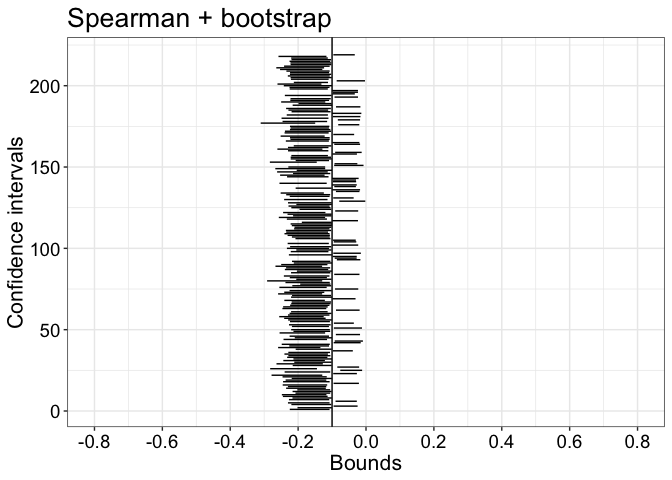<!-- -->

``` r
pC <- p
```

## Summary figure

``` r
cowplot::plot_grid(pA, pB, pC,
                   labels = c("A", "B", "C"), 
                   nrow = 3)

# save figure
ggsave(filename=('./figures/figure_g1h0_rho08_ci.pdf'),width=8,height=13)
```

# rho = 0.3, difference = 0.2, vary g, h = 0

``` r
gseq <- seq(0, 1, 0.1)
ng <- length(gseq)
nseq <- seq(50, 500, 50)
nmax <- max(nseq)
nsim <- 4000
rho = 0.3
es <- 0.2 # effect size
h <- 0
cmat1 <- matrix(c(1,rho,rho,1),2,2)
cmat2 <- matrix(c(1,rho+es,rho+es,1),2,2)
alpha <- .05
nboot <- 599

# coverage
cov.spear <- array(0, dim = c(nsim, ng, length(nseq)))
cov.pears.boot <- array(0, dim = c(nsim, ng, length(nseq)))
cov.pears.zou <- array(0, dim = c(nsim, ng, length(nseq)))
# direction of discrepancy
dis.spear <- array(NA, dim = c(nsim, ng, length(nseq)))
dis.pears.boot <- array(NA, dim = c(nsim, ng, length(nseq)))
dis.pears.zou <- array(NA, dim = c(nsim, ng, length(nseq)))
# ci width
wid.spear <- array(0, dim = c(nsim, ng, length(nseq)))
wid.pears.boot <- array(0, dim = c(nsim, ng, length(nseq)))
wid.pears.zou <- array(0, dim = c(nsim, ng, length(nseq)))

for(G in 1:ng){
  beep(2)
  set.seed(21) # set seed inside R loop to allow direct comparisons
  # (numbers are the same except for the correlation)
  g <- gseq[G]
  print(paste("sim diff 0.1, g=0, h=0, rho =",rho))
  for(S in 1:nsim){
    if(S %% 500 == 0){print(paste0("sim ",S," / ",nsim,"..."))}
    # generate max n sample
    out1 <- ghmul(nmax, g=g, h=h, p=2, cmat=cmat1)  
    out2 <- ghmul(nmax, g=g, h=h, p=2, cmat=cmat2) 
    for(N in 1:length(nseq)){
      # subsample from max n sample
      x1 <- out1[1:nseq[N],1]
      y1 <- out1[1:nseq[N],2]
      x2 <- out2[1:nseq[N],1]
      y2 <- out2[1:nseq[N],2]

      # BOOTSTRAP SAMPLES -------------
      data1 <- matrix(sample(length(y1),size=length(y1)*nboot,replace=TRUE),nrow=nboot)
      data2 <- matrix(sample(length(y2),size=length(y2)*nboot,replace=TRUE),nrow=nboot)
      
      # PEARSON ---------------
      bvec1 <- apply(data1,1,pearsboot,x1,y1) # A 1 by nboot matrix.
      bvec2 <- apply(data2,1,pearsboot,x2,y2) # A 1 by nboot matrix.
      bvec <- bvec1 - bvec2
      ilow<-15
      ihi<-584
      if(length(y1)+length(y2) < 250){
        ilow<-14
        ihi<-585
      }
      if(length(y1)+length(y2) < 180){
        ilow<-11
        ihi<-588
      }
      if(length(y1)+length(y2) < 80){
        ilow<-8
        ihi<-592
      }
      if(length(y1)+length(y2) < 40){
        ilow<-7
        ihi<-593
      }
      bsort <- sort(bvec)
      ci <- c(bsort[ilow],bsort[ihi])
      if(-es >= ci[1] && -es <= ci[2]){
        cov.pears.boot[S, G, N] <- 1
      }
      if(cov.pears.boot[S, G, N] == 0){ # direction of discrepancy
        if(-es > ci[2]){
        dis.pears.boot[S, G, N] <- -1 # left shift
        }
        if(-es < ci[1]){
        dis.pears.boot[S, G, N] <- 1 # right shift
        }
      }
      wid.pears.boot[S, G, N] <- ci[2] - ci[1] # ci width
      
      # ZOU 2007 --------------
      r1 <- cor(x1, y1)
      r2 <- cor(x2, y2)
      n1 <- length(x1)
      n2 <- length(x2)
      ci <- r.ind.ci(r1, r2, n1, n2)
      if(-es >= ci[1] && -es <= ci[2]){
        cov.pears.zou[S, G, N] <- 1
      }
      if(cov.pears.zou[S, G, N] == 0){ # direction of discrepancy
        if(-es > ci[2]){
        dis.pears.zou[S, G, N] <- -1 # left shift
        }
        if(-es < ci[1]){
        dis.pears.zou[S, G, N] <- 1 # right shift
        }
      }
      wid.pears.zou[S, G, N] <- ci[2] - ci[1] # ci width
      
      # SPEARMAN --------------
      bvec1 <- apply(data1,1,spearboot,x1,y1) # A 1 by nboot matrix.
      bvec2 <- apply(data2,1,spearboot,x2,y2) # A 1 by nboot matrix.
      bvec <- bvec1 - bvec2
      bsort <- sort(bvec)
      ilow <- round((alpha/2) * nboot)
      ihi <- nboot - ilow
      ilow <- ilow+1
      ci <- c(bsort[ilow],bsort[ihi])
      if(-es >= ci[1] && -es <= ci[2]){
        cov.spear[S, G, N] <- 1
      }
      if(cov.spear[S, G, N] == 0){ # direction of discrepancy
        if(-es > ci[2]){
        dis.spear[S, G, N] <- -1 # left shift
        }
        if(-es < ci[1]){
        dis.spear[S, G, N] <- 1 # right shift
        }
      }
      wid.spear[S, G, N] <- ci[2] - ci[1] # ci width
    }
  }
}

beep(8)

save(cov.spear, cov.pears.boot, cov.pears.zou,
     dis.spear, dis.pears.boot, dis.pears.zou,
     wid.spear, wid.pears.boot, wid.pears.zou,
     gseq, nseq, nsim, es, g, h,
     file = "./data/rho03_diff02_h0_vg_covtest.RData")
```

## Results: coverage

### Pearson + Zou

``` r
load("./data/rho03_diff02_h0_vg_covtest.RData")
pres <- apply(cov.pears.zou, c(2,3), mean)
df <- mdf.g(pres, nseq, gseq)
p <- plot.res.cov.g(df, ylim = c(0.45, 1)) + ggtitle("Pearson + Zou") +
      theme(legend.position = "none")
p
```

<!-- -->

``` r
pA <- p
```

### Pearson + bootstrap

``` r
pres <- apply(cov.pears.boot, c(2,3), mean)
df <- mdf.g(pres, nseq, gseq)
p <- plot.res.cov.g(df, ylim = c(0.45, 1)) + ggtitle("Pearson + bootstrap") + 
      theme(legend.position = c(0.2, 0.4)) +
       guides(colour=guide_legend(ncol=2, override.aes = list(size = 3)))
p
```

<!-- -->

``` r
pB <- p
```

### Spearman + bootstrap

``` r
pres <- apply(cov.spear, c(2,3), mean)
df <- mdf.g(pres, nseq, gseq)
p <- plot.res.cov.g(df, ylim = c(0.45, 1)) + ggtitle("Spearman + bootstrap") +
      theme(legend.position = "none")
p
```

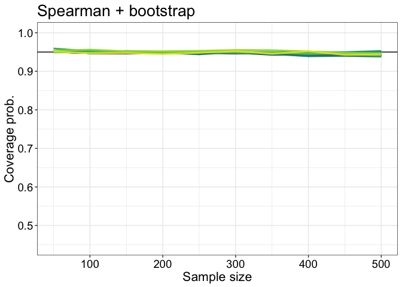<!-- -->

``` r
pC <- p
```

## Summary figure

``` r
cowplot::plot_grid(pA, pB, pC,
                   labels = c("A", "B", "C"), 
                   nrow = 3)

# save figure
ggsave(filename=('./figures/figure_rho03_diff02_h0_vg_cov.pdf'),width=8,height=13)
```

## Results: width

### Pearson + Zou

``` r
pres <- apply(wid.pears.zou, c(2,3), median)
df <- mdf.g(pres, nseq, gseq)
p <- plot.res.wid.g(df) + ggtitle("Pearson + Zou") +
      theme(legend.position = "none")
p
```

<!-- -->

``` r
pA <- p
```

### Pearson + bootstrap

``` r
pres <- apply(wid.pears.boot, c(2,3), median)
df <- mdf.g(pres, nseq, gseq)
p <- plot.res.wid.g(df) + ggtitle("Pearson + bootstrap") +
      theme(legend.position = "none")
p
```

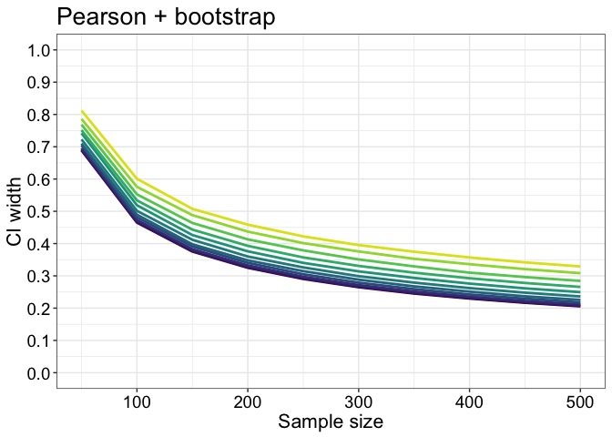<!-- -->

``` r
pB <- p
```

Again, the better coverage of Pearson + bootstrap seems to be achieved
by producing wider CIs.

### Spearman + bootstrap

``` r
pres <- apply(wid.spear, c(2,3), median)
df <- mdf.g(pres, nseq, gseq)
p <- plot.res.wid.g(df) + ggtitle("Spearman + bootstrap") +
      theme(legend.position = "none")
p
```

<!-- -->

``` r
pC <- p
```

## Summary figure

``` r
cowplot::plot_grid(pA, pB, pC,
                   labels = c("A", "B", "C"), 
                   nrow = 3)

# save figure
ggsave(filename=('./figures/figure_rho03_diff02_h0_vg_wid.pdf'),width=8,height=13)
```

## Results: direction of discrepancy

### Pearson + Zou

``` r
pres <- apply(dis.pears.zou, c(2,3), mean, na.rm = TRUE)
df <- mdf.g(pres, nseq, gseq)
p <- plot.res.dis.g(df) + ggtitle("Pearson + Zou") +
      theme(legend.position = "none")
p
```

<!-- -->

``` r
pA <- p
```

With increasing `g`, CIs not including the population tends to be
shifted to the right, thus under-estimating the difference.

### Pearson + bootstrap

``` r
pres <- apply(dis.pears.boot, c(2,3), mean, na.rm = TRUE)
df <- mdf.g(pres, nseq, gseq)
p <- plot.res.dis.g(df) + ggtitle("Pearson + bootstrap") +
      theme(legend.position = "none")
p
```

<!-- -->

``` r
pB <- p
```

### Spearman + bootstrap

``` r
pres <- apply(dis.spear, c(2,3), mean, na.rm = TRUE)
df <- mdf.g(pres, nseq, gseq)
p <- plot.res.dis.g(df) + ggtitle("Spearman + bootstrap") +
      theme(legend.position = "none")
p
```

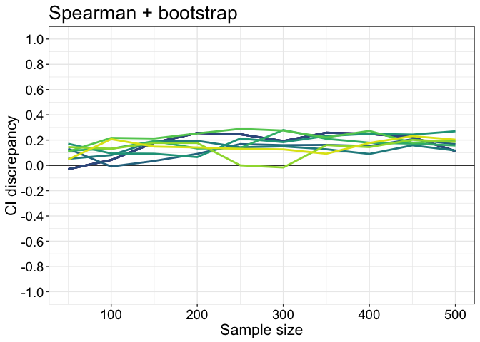<!-- -->

``` r
pC <- p
```

## Summary figure

``` r
cowplot::plot_grid(pA, pB, pC,
                   labels = c("A", "B", "C"), 
                   nrow = 3)

# save figure
ggsave(filename=('./figures/figure_rho03_diff02_h0_vg_dis.pdf'),width=8,height=13)
```

# rho = 0.3, difference = 0.2, vary g, h = 0.2

``` r
gseq <- seq(0, 1, 0.1)
ng <- length(gseq)
nseq <- seq(50, 500, 50)
nmax <- max(nseq)
nsim <- 4000
rho = 0.3
es <- 0.2 # effect size
h <- 0.2
cmat1 <- matrix(c(1,rho,rho,1),2,2)
cmat2 <- matrix(c(1,rho+es,rho+es,1),2,2)
alpha <- .05
nboot <- 599

# coverage
cov.spear <- array(0, dim = c(nsim, ng, length(nseq)))
cov.pears.boot <- array(0, dim = c(nsim, ng, length(nseq)))
cov.pears.zou <- array(0, dim = c(nsim, ng, length(nseq)))
# direction of discrepancy
dis.spear <- array(NA, dim = c(nsim, ng, length(nseq)))
dis.pears.boot <- array(NA, dim = c(nsim, ng, length(nseq)))
dis.pears.zou <- array(NA, dim = c(nsim, ng, length(nseq)))
# ci width
wid.spear <- array(0, dim = c(nsim, ng, length(nseq)))
wid.pears.boot <- array(0, dim = c(nsim, ng, length(nseq)))
wid.pears.zou <- array(0, dim = c(nsim, ng, length(nseq)))

for(G in 1:ng){
  beep(2)
  set.seed(21) # set seed inside R loop to allow direct comparisons
  # (numbers are the same except for the correlation)
  g <- gseq[G]
  print(paste0("sim diff 0.2, rho=0.3, h=0.2, g=",g))
  for(S in 1:nsim){
    if(S %% 500 == 0){print(paste0("sim ",S," / ",nsim,"..."))}
    # generate max n sample
    out1 <- ghmul(nmax, g=g, h=h, p=2, cmat=cmat1)  
    out2 <- ghmul(nmax, g=g, h=h, p=2, cmat=cmat2) 
    for(N in 1:length(nseq)){
      # subsample from max n sample
      x1 <- out1[1:nseq[N],1]
      y1 <- out1[1:nseq[N],2]
      x2 <- out2[1:nseq[N],1]
      y2 <- out2[1:nseq[N],2]

      # BOOTSTRAP SAMPLES -------------
      data1 <- matrix(sample(length(y1),size=length(y1)*nboot,replace=TRUE),nrow=nboot)
      data2 <- matrix(sample(length(y2),size=length(y2)*nboot,replace=TRUE),nrow=nboot)
      
      # PEARSON ---------------
      bvec1 <- apply(data1,1,pearsboot,x1,y1) # A 1 by nboot matrix.
      bvec2 <- apply(data2,1,pearsboot,x2,y2) # A 1 by nboot matrix.
      bvec <- bvec1 - bvec2
      ilow<-15
      ihi<-584
      if(length(y1)+length(y2) < 250){
        ilow<-14
        ihi<-585
      }
      if(length(y1)+length(y2) < 180){
        ilow<-11
        ihi<-588
      }
      if(length(y1)+length(y2) < 80){
        ilow<-8
        ihi<-592
      }
      if(length(y1)+length(y2) < 40){
        ilow<-7
        ihi<-593
      }
      bsort <- sort(bvec)
      ci <- c(bsort[ilow],bsort[ihi])
      if(-es >= ci[1] && -es <= ci[2]){
        cov.pears.boot[S, G, N] <- 1
      }
      if(cov.pears.boot[S, G, N] == 0){ # direction of discrepancy
        if(-es > ci[2]){
        dis.pears.boot[S, G, N] <- -1 # left shift
        }
        if(-es < ci[1]){
        dis.pears.boot[S, G, N] <- 1 # right shift
        }
      }
      wid.pears.boot[S, G, N] <- ci[2] - ci[1] # ci width
      
      # ZOU 2007 --------------
      r1 <- cor(x1, y1)
      r2 <- cor(x2, y2)
      n1 <- length(x1)
      n2 <- length(x2)
      ci <- r.ind.ci(r1, r2, n1, n2)
      if(-es >= ci[1] && -es <= ci[2]){
        cov.pears.zou[S, G, N] <- 1
      }
      if(cov.pears.zou[S, G, N] == 0){ # direction of discrepancy
        if(-es > ci[2]){
        dis.pears.zou[S, G, N] <- -1 # left shift
        }
        if(-es < ci[1]){
        dis.pears.zou[S, G, N] <- 1 # right shift
        }
      }
      wid.pears.zou[S, G, N] <- ci[2] - ci[1] # ci width
      
      # SPEARMAN --------------
      bvec1 <- apply(data1,1,spearboot,x1,y1) # A 1 by nboot matrix.
      bvec2 <- apply(data2,1,spearboot,x2,y2) # A 1 by nboot matrix.
      bvec <- bvec1 - bvec2
      bsort <- sort(bvec)
      ilow <- round((alpha/2) * nboot)
      ihi <- nboot - ilow
      ilow <- ilow+1
      ci <- c(bsort[ilow],bsort[ihi])
      if(-es >= ci[1] && -es <= ci[2]){
        cov.spear[S, G, N] <- 1
      }
      if(cov.spear[S, G, N] == 0){ # direction of discrepancy
        if(-es > ci[2]){
        dis.spear[S, G, N] <- -1 # left shift
        }
        if(-es < ci[1]){
        dis.spear[S, G, N] <- 1 # right shift
        }
      }
      wid.spear[S, G, N] <- ci[2] - ci[1] # ci width
    }
  }
}

beep(8)

save(cov.spear, cov.pears.boot, cov.pears.zou,
     dis.spear, dis.pears.boot, dis.pears.zou,
     wid.spear, wid.pears.boot, wid.pears.zou,
     gseq, nseq, nsim, es, g, h,
     file = "./data/rho03_diff02_h02_vg_covtest.RData")
```

## Results: coverage

### Pearson + Zou

``` r
load("./data/rho03_diff02_h02_vg_covtest.RData")
pres <- apply(cov.pears.zou, c(2,3), mean)
df <- mdf.g(pres, nseq, gseq)
p <- plot.res.cov.g(df, ylim = c(0.45, 1)) + ggtitle("Pearson + Zou") +
      theme(legend.position = "none")
p
```

<!-- -->

``` r
pA <- p
```

### Pearson + bootstrap

``` r
pres <- apply(cov.pears.boot, c(2,3), mean)
df <- mdf.g(pres, nseq, gseq)
p <- plot.res.cov.g(df, ylim = c(0.45, 1)) + ggtitle("Pearson + bootstrap") +
      theme(legend.position = "none")
p
```

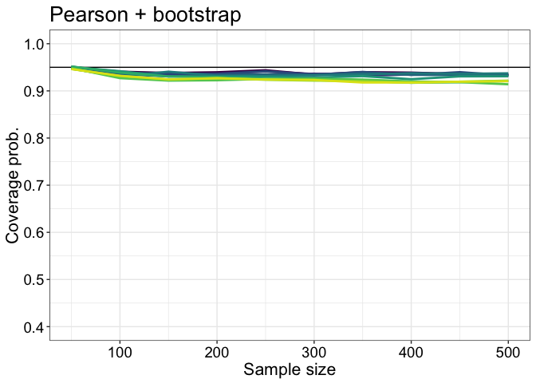<!-- -->

``` r
pB <- p
```

### Spearman + bootstrap

``` r
pres <- apply(cov.spear, c(2,3), mean)
df <- mdf.g(pres, nseq, gseq)
p <- plot.res.cov.g(df, ylim = c(0.45, 1)) + ggtitle("Spearman + bootstrap") +
      theme(legend.position = c(0.2, 0.5)) +
        guides(colour=guide_legend(ncol=2, override.aes = list(size = 3)))
p
```

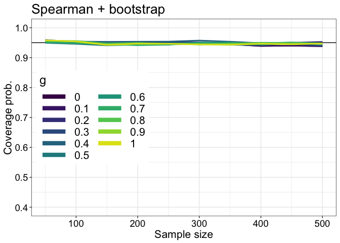<!-- -->

``` r
pC <- p
```

## Summary figure

``` r
cowplot::plot_grid(pA, pB, pC,
                   labels = c("A", "B", "C"), 
                   nrow = 3)

# save figure
ggsave(filename=('./figures/figure_rho03_diff02_h02_vg_cov.pdf'),width=8,height=13)
```

## Results: width

### Pearson + Zou

``` r
pres <- apply(wid.pears.zou, c(2,3), median)
df <- mdf.g(pres, nseq, gseq)
p <- plot.res.wid.g(df) + ggtitle("Pearson + Zou") +
      theme(legend.position = "none")
p
```

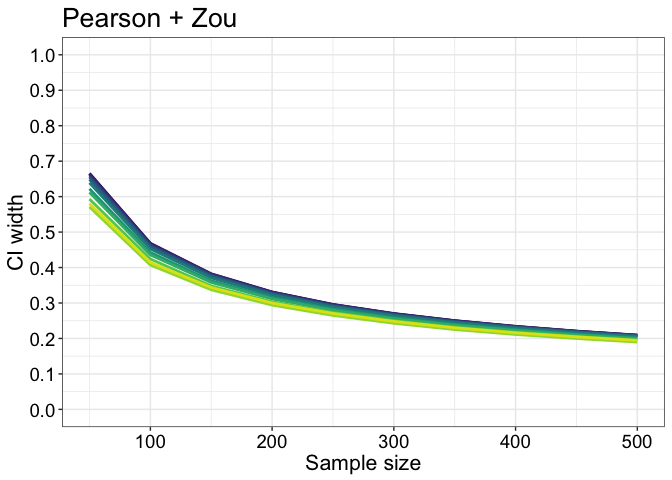<!-- -->

``` r
pA <- p
```

### Pearson + bootstrap

``` r
pres <- apply(wid.pears.boot, c(2,3), median)
df <- mdf.g(pres, nseq, gseq)
p <- plot.res.wid.g(df) + ggtitle("Pearson + bootstrap") +
      theme(legend.position = "none")
p
```

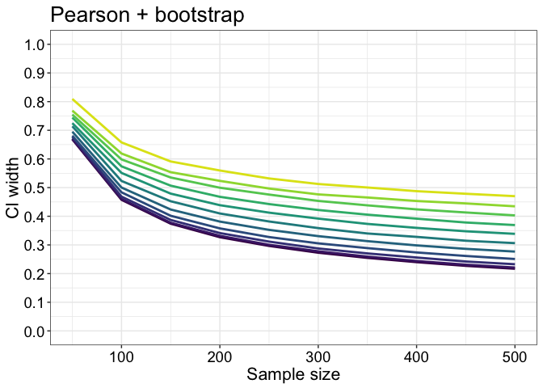<!-- -->

``` r
pB <- p
```

### Spearman + bootstrap

``` r
pres <- apply(wid.spear, c(2,3), median)
df <- mdf.g(pres, nseq, gseq)
p <- plot.res.wid.g(df) + ggtitle("Spearman + bootstrap") +
      theme(legend.position = "none")
p
```

<!-- -->

``` r
pC <- p
```

## Summary figure

``` r
cowplot::plot_grid(pA, pB, pC,
                   labels = c("A", "B", "C"), 
                   nrow = 3)

# save figure
ggsave(filename=('./figures/figure_rho03_diff02_h02_vg_wid.pdf'),width=8,height=13)
```

## Results: direction of discrepancy

### Pearson + Zou

``` r
pres <- apply(dis.pears.zou, c(2,3), mean, na.rm = TRUE)
df <- mdf.g(pres, nseq, gseq)
p <- plot.res.dis.g(df) + ggtitle("Pearson + Zou") +
      theme(legend.position = "none")
p
```

<!-- -->

``` r
pA <- p
```

### Pearson + bootstrap

``` r
pres <- apply(dis.pears.boot, c(2,3), mean, na.rm = TRUE)
df <- mdf.g(pres, nseq, gseq)
p <- plot.res.dis.g(df) + ggtitle("Pearson + bootstrap") +
      theme(legend.position = "none")
p
```

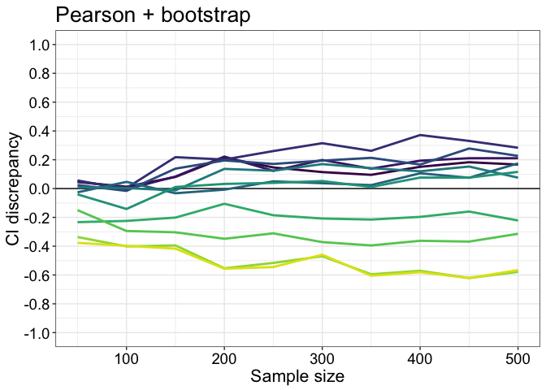<!-- -->

``` r
pB <- p
```

### Spearman + bootstrap

``` r
pres <- apply(dis.spear, c(2,3), mean, na.rm = TRUE)
df <- mdf.g(pres, nseq, gseq)
p <- plot.res.dis.g(df) + ggtitle("Spearman + bootstrap") +
      theme(legend.position = "none")
p
```

<!-- -->

``` r
pC <- p
```

## Summary figure

``` r
cowplot::plot_grid(pA, pB, pC,
                   labels = c("A", "B", "C"), 
                   nrow = 3)

# save figure
ggsave(filename=('./figures/figure_rho03_diff02_h02_vg_dis.pdf'),width=8,height=13)
```

# References

## Comparison of correlation coefficients

Zou, Guang Yong. **Toward Using Confidence Intervals to Compare
Correlations.** Psychological Methods 12, no. 4 (2007): 399–413.
<https://doi.org/10.1037/1082-989X.12.4.399>.

Wilcox, Rand R. **Comparing Pearson Correlations: Dealing with
Heteroscedasticity and Nonnormality.** Communications in Statistics -
Simulation and Computation 38, no. 10 (1 November 2009): 2220–34.
<https://doi.org/10.1080/03610910903289151>.

Baguley, Thom. **Comparing correlations: independent and dependent
(overlapping or non-overlapping)**
<https://seriousstats.wordpress.com/2012/02/05/comparing-correlations/>

Diedenhofen, Birk, and Jochen Musch. **Cocor: A Comprehensive Solution
for the Statistical Comparison of Correlations.** PLoS ONE 10, no. 4 (2
April 2015). <https://doi.org/10.1371/journal.pone.0121945>.

## *g & h* distributions

Hoaglin, David C. ‘Summarizing Shape Numerically: The g-and-h
Distributions’. In Exploring Data Tables, Trends, and Shapes, 461–513.
John Wiley & Sons, Ltd, 1985.
<https://doi.org/10.1002/9781118150702.ch11>.

Yan, Yuan, and Marc G. Genton. ‘The Tukey G-and-h Distribution’.
Significance 16, no. 3 (2019): 12–13.
<https://doi.org/10.1111/j.1740-9713.2019.01273.x>.
