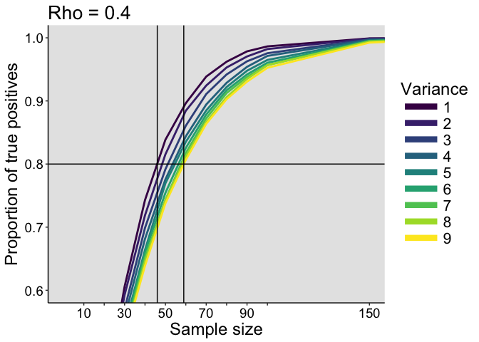

Correlation estimation: power
================
Guillaume A. Rousselet
2018-06-29

-   [Dependencies](#dependencies)
-   [Examples of homoscedastic distributions](#examples-of-homoscedastic-distributions)
-   [Power as a function of sample size and rho: homoscedastic case](#power-as-a-function-of-sample-size-and-rho-homoscedastic-case)
    -   [Parameters](#parameters)
    -   [Simulation](#simulation)
    -   [Plot results](#plot-results)
    -   [Plot results with arrows](#plot-results-with-arrows)
-   [Problems with Pearson's correlation](#problems-with-pearsons-correlation)
    -   [Wilcox's heteroscedasticity example](#wilcoxs-heteroscedasticity-example)
    -   [Plot results](#plot-results-1)
-   [Examples of heteroscedastic distributions](#examples-of-heteroscedastic-distributions)
-   [Power as a function of sample size: heteroscedastic case](#power-as-a-function-of-sample-size-heteroscedastic-case)
    -   [Example with rho = 0 & max var = 3](#example-with-rho-0-max-var-3)
    -   [Test heteroscedastic data generation](#test-heteroscedastic-data-generation)
    -   [Simulation with rho = 0](#simulation-with-rho-0)
    -   [Simulation with rho = 0.4](#simulation-with-rho-0.4)
-   [References](#references)

Dependencies
============

``` r
library(ggplot2)
library(tibble)
library(viridis)
```

    ## Loading required package: viridisLite

``` r
source("./functions/pcorb.txt")
```

Examples of homoscedastic distributions
=======================================

We look at examples of n=1000 bivariate distributions from populations with known correlations, with rho increasing from 0.1 to 0.9 in steps of 0.1. For each rho, we draw a random sample and plot *Y* as a function of *X*. The variances of the two correlated variables are independent - there is homoscedasticity. Later we will look at an heteroscedasticity case: the variance of *Y* will vary as a function of *X*.

``` r
set.seed(21)
n <- 1000
rho.seq <- seq(0.1, 0.9, 0.1)
Nrho <- length(rho.seq)
sd.x <- rep(1, n)
sd.y <- rep(1, n) # homoscedastic sd
mu.x <- rep(0, n)
mu.y <- rep(0, n)

res.x <- matrix(data = 0, nrow = n, ncol = Nrho) 
res.y <- matrix(data = 0, nrow = n, ncol = Nrho) 

# Generate data
  for(iter.rho in 1:Nrho){
      rho <- rho.seq[iter.rho]
      x <- sort(rnorm(n, mu.x, sd.x))
      y <- rnorm(n, mu.y + (sd.y/sd.x) * rho * (x - mu.x), sqrt((1 - rho^2)*sd.y^2))
      res.x[, iter.rho] <- x
      res.y[, iter.rho] <- y
  }

# make data frame
df <- tibble(`x` = as.vector(res.x),
             `y` = as.vector(res.y),
             `rho` = rep(rho.seq, each = n))

df$rho <- as.character(df$rho)
df$rho <- factor(df$rho, levels=unique(df$rho))

# ggplot figure
ggplot(df, aes(x = x, y = y)) + theme_classic() +
  geom_hline(yintercept = 0) +
  geom_vline(xintercept = 0) +
  geom_point(alpha = 0.1) +
  geom_smooth(method='lm',formula=y~x) +
  theme(axis.title = element_text(size = 15, colour = "black"),
        axis.text = element_text(size = 13, colour = "black"),
        strip.text = element_text(size = 15, face = "bold")) +
  scale_x_continuous(limits = c(-4, 4),
                     breaks = seq(-4, 4, 1)) +
  labs(x = expression(italic("X")), y = expression(italic("Y"))) +
  facet_wrap(~rho)
```


``` r
# save figure
ggsave(filename = './figures/demo_homo_dist.png', width = 9, height = 7)
```

Power as a function of sample size and rho: homoscedastic case
==============================================================

For the same distributions illustrated in the previous figure, we compute the proportion of positive Pearson's correlation tests for different sample sizes. This gives us power curves. We also include rho = 0 to determine the proportion of false positives.

Parameters
----------

``` r
nseq <- c(seq(10, 100, 10), 150, 200, 300) # sample sizes
Nn <- length(nseq)
p <- 2
mu <- 0
mu <- rep(mu, p)
nsim <- 50000
rho.seq <- seq(0, 0.9, 0.1) # rho=0 for false positives
Nrho <- length(rho.seq)
```

Simulation
----------

``` r
set.seed(21)

res.power <- matrix(data = 0, nrow = Nrho, ncol = Nn) # count p<=0.05

for(iter.n in 1:Nn){
  
  print(paste0("Sample size = ", nseq[iter.n]))
  n <- nseq[iter.n]
  
  sd.x <- rep(1, n)
  sd.y <- rep(1, n)
  mu.x <- rep(0, n)
  mu.y <- rep(0, n)
  
  for(iter.rho in 1:Nrho){
    
    rho <- rho.seq[iter.rho]
    # sigma <- diag(p)
    # sigma[sigma==0] <- rho.seq[iter.rho]
    
    for(iter in 1:nsim){
      
      # using mvrnorm =======================================
      # data <- MASS::mvrnorm(n = n, mu = mu, Sigma = sigma)
      # out <- cor.test(data[,1],data[,2], method = "pearson")
      
      # using Y conditional on X ======================
      # https://www.r-bloggers.com/simulating-from-the-bivariate-normal-distribution-in-r/
      x <- rnorm(n, mu.x, sd.x)
      y <- rnorm(n, mu.y + (sd.y/sd.x) * rho * (x - mu.x), sqrt((1 - rho^2)*sd.y^2))
      out <- cor.test(x,y, method = "pearson")
      if(out$p.value <= 0.05){
      res.power[iter.rho,iter.n] <- res.power[iter.rho,iter.n] + 1
      }
    }
  }
}
res.power <- res.power / nsim
save(res.power,
     file = "./data/corr_power.RData")
```

Plot results
------------

Power increases with sample size and with rho. When rho = 0, the proportion of positive tests is the proportion of false positives. These should be around 0.05 for a test with alpha = 0.05. This is the case here, as Pearson's correlation is well behaved for bivariate normal data.

``` r
# get data
load("./data/corr_power.RData")
xlabels <- c("10","","30","","50","","70","","90","","150","200","300") 

# make data frame
df <- tibble(`Power`=as.vector(res.power),
             `Size`=rep(nseq,each=Nrho),
             `Rho`=rep(rho.seq,Nn))

df$Rho <- as.character(df$Rho)
df$Rho <- factor(df$Rho, levels=unique(df$Rho))

# make plot
p <- ggplot(df, aes(Size, Power)) + theme_classic() +
          geom_line(aes(colour = Rho), size = 1)  + 
          geom_hline(yintercept = 0.05) +
          scale_color_viridis(discrete = TRUE) + 
          theme(axis.title.x = element_text(size = 18),
                axis.text = element_text(size = 14, colour = "black"),
                axis.title.y = element_text(size = 18),
                legend.key.width = unit(1.5,"cm"),
                legend.text = element_text(size = 16),
                legend.title = element_text(size = 18),
                legend.position = "right",
                plot.title = element_text(size = 20, colour = "black"),
                panel.background = element_rect(fill="grey90")) +
   scale_x_continuous(breaks = nseq, labels = xlabels) +
          scale_y_continuous(limits = c(0, 1), 
                             breaks = c(0, 0.05, seq(0.1, 1, 0.1))) +
  labs(x = "Sample size", y = "Proportion of positive tests") +
  # ggtitle("Power in the homoscedastic case") +
  guides(colour = guide_legend(override.aes = list(size=3), # make thicker legend lines
        title="Rho")) # change legend title
p
```


``` r
# save figure
ggsave(filename='./figures/figure_power_homo.png',width=9,height=5)
```

Plot results with arrows
------------------------

For a given expected population correlation and a desired long run power value, we can use interpolation to find out the matching sample size.

To achieve at least 80% power given an expected population rho of 0.4, the minimum sample size is 46 observations.

To achieve at least 90% power given an expected population rho of 0.3, the minimum sample size is 118 observations.

Alternatively, for a given sample size and a desired power, we can determine the minimum effect size we can hope to detect. For instance, given n = 40 and a desired power of at least 90%, the minimum effect size we can detect is 0.49.

``` r
# get data
load("./data/corr_power.RData")
xlabels <- c("10","","30","","50","","70","","90","","150","200","300") 

# make data frame
df <- tibble(`Power`=as.vector(res.power),
             `Size`=rep(nseq,each=Nrho),
             `Rho`=rep(rho.seq,Nn))

df$Rho <- as.character(df$Rho)
df$Rho <- factor(df$Rho, levels=unique(df$Rho))

# minimum n for power = 0.8 and rho = 0.4
tmp.pos <- approx(y=nseq,x=res.power[5,],xout=0.8)$y
df.seg1 <- tibble(x=0, xend=tmp.pos,
                  y=0.8, yend=0.8)
df.seg2 <- tibble(x=tmp.pos, xend=tmp.pos,
                  y=0.8, yend=0)

# minimum n for power = 0.9 and rho = 0.3
tmp.pos <- approx(y=nseq,x=res.power[4,],xout=0.9)$y
df.seg3 <- tibble(x=0, xend=tmp.pos,
                  y=0.9, yend=0.9)
df.seg4 <- tibble(x=tmp.pos, xend=tmp.pos,
                  y=0.9, yend=0)

# make plot
p <- ggplot(df, aes(Size, Power)) + theme_classic() +
          geom_segment(data = df.seg1, aes(x=x, y=y, xend=xend, yend=yend)) +
          geom_segment(data = df.seg2, aes(x=x, y=y, xend=xend, yend=yend), 
                       arrow = arrow(length = unit(0.2, "cm"))) +
          geom_segment(data = df.seg3, aes(x=x, y=y, xend=xend, yend=yend)) +
          geom_segment(data = df.seg4, aes(x=x, y=y, xend=xend, yend=yend), 
               arrow = arrow(length = unit(0.2, "cm"))) +
          geom_line(aes(colour = Rho), size = 1)  + 
          geom_hline(yintercept = 0.05) +
          scale_color_viridis(discrete = TRUE) + 
          theme(axis.title.x = element_text(size = 18),
                axis.text = element_text(size = 14, colour = "black"),
                axis.title.y = element_text(size = 18),
                legend.key.width = unit(1.5,"cm"),
                legend.text = element_text(size = 16),
                legend.title = element_text(size = 18),
                legend.position = "right",
                plot.title = element_text(size = 20, colour = "black"),
                panel.background = element_rect(fill="grey90")) +
   scale_x_continuous(breaks = nseq, labels = xlabels) +
          scale_y_continuous(limits = c(0, 1), 
                             breaks = c(0, 0.05, seq(0.1, 1, 0.1))) +
  labs(x = "Sample size", y = "Proportion of positive tests") +
  # ggtitle("Power in the homoscedastic case") +
  guides(colour = guide_legend(override.aes = list(size=3), # make thicker legend lines
        title="Rho")) # change legend title
p
```


``` r
# save figure
ggsave(filename='./figures/figure_power_homo_arrows.png',width=9,height=5)
```

Problems with Pearson's correlation
===================================

Wilcox (2012 p. 444-445) describes 6 aspects of data that affect Pearson’s r:

-   outliers
-   the magnitude of the slope around which points are clustered
-   curvature
-   the magnitude of the residuals
-   restriction of range
-   heteroscedasticity

The effect of outliers on Pearson's and Spearman's correlations is described in detail in Pernet et al. (2012) and Rousselet et al. (2012).

Wilcox's heteroscedasticity example
-----------------------------------

If we correlate variable *X* with variable *Y*, heteroscedasticity means that the variance of *Y* depends on *X*. Wilcox considers this example: “*X* and *Y* have normal distributions with both means equal to zero. \[...\] *X* and *Y* have variance 1 unless |*X*|&gt;0.5, in which case *Y* has standard deviation |*X*|.”

Here is an example of such data:

``` r
set.seed(21)
n <- 1000
rho <- 0
sd.x <- rep(1, n)
h <- 3
mu.x <- rep(0, n)
mu.y <- rep(0, n)

# using conditional distribution ======================
# https://www.r-bloggers.com/simulating-from-the-bivariate-normal-distribution-in-r/
x <- rnorm(n, mu.x, sd.x)
sd.y <- rep(1, n)
sd.y[abs(x)>0.5] <- abs(x[abs(x)>0.5]) 
y <- rnorm(n, mu.y + (sd.y/sd.x) * rho * (x - mu.x), sqrt((1 - rho^2)*sd.y^2))

plot(x,y, main = paste0("Correlation = ",round(cor(x,y), digits = 2)))
abline(lsfit(x,y)) 
```


### ggplot version

``` r
# make data frame
df <- tibble(`x` = x,
             `y` = y)

# ggplot figure
ggplot(df, aes(x = x, y = y)) + theme_classic() +
  geom_hline(yintercept = 0) +
  geom_vline(xintercept = 0) +
  geom_point(alpha = 0.3) +
  geom_smooth(method='lm',formula=y~x) +
  theme(axis.title = element_text(size = 15, colour = "black"),
        axis.text = element_text(size = 13, colour = "black"),
        strip.text = element_text(size = 15, face = "bold")) +
  scale_x_continuous(limits = c(-4, 4),
                     breaks = seq(-4, 4, 1)) +
  labs(x = expression(italic("X")), y = expression(italic("Y")))
```


``` r
# save figure
ggsave(filename = './figures/demo_wilcox_dist.png', width = 9, height = 7)
```

### False positives

#### Simulation

``` r
set.seed(44444)

nseq <- c(seq(10, 100, 10), 150, 200, 300) # sample sizes
Nn <- length(nseq)
nsim <- 50000
rho <- 0

res.power <- matrix(data = 0, nrow = 2, ncol = Nn) # count p<=0.05

for(iter.n in 1:Nn){
  
  n <- nseq[iter.n]
  print(paste0("Sample size = ", n))
  sd.x <- rep(1, n)
  mu.x <- rep(0, n)
  mu.y <- rep(0, n)
  
  for(iter in 1:nsim){
    # using Y conditional on X ======================
    # https://www.r-bloggers.com/simulating-from-the-bivariate-normal-distribution-in-r/
    x <- rnorm(n, mu.x, sd.x)
    sd.y <- rep(1, n)
    # homoscedastic results
    y <- rnorm(n, mu.y + (sd.y/sd.x) * rho * (x - mu.x), sqrt((1 - rho^2)*sd.y^2))
    out <- cor.test(x, y, method = "pearson")
    if(out$p.value <= 0.05){
      res.power[1,iter.n] <- res.power[1,iter.n] + 1
    }
    # heteroscedastic results
    sd.y[abs(x)>0.5] <- abs(x[abs(x)>0.5]) 
    y <- rnorm(n, mu.y + (sd.y/sd.x) * rho * (x - mu.x), sqrt((1 - rho^2)*sd.y^2))
    out <- cor.test(x, y, method = "pearson")
    if(out$p.value <= 0.05){
      res.power[2,iter.n] <- res.power[2,iter.n] + 1
    }
  }
}
res.power <- res.power / nsim
save(res.power,
     file = "./data/corr_power_hetero_wilcox.RData")
```

Plot results
------------

In the homoscedastic case, as expected for a test with alpha = 0.05, the proportion of false positives is very close to 0.05 at every sample size. In the heteroscedastic case, instead of 5%, the number of false positives is between 12% and 19%. The number of false positives actually increases with sample size! That’s because the standard *T* statistics associated with Pearson’s correlation assumes homoscedasticity, so the formula is incorrect when there is heteroscedasticity.

``` r
# get data
load("./data/corr_power_hetero_wilcox.RData")
xlabels <- c("10","","30","","50","","70","","90","","150","200","300") 

# make data frame
df <- tibble(`Power`=as.vector(res.power),
             `Size`=rep(nseq,each=2),
             `Var`=rep(c("Homoscedastic", "Heteroscedastic"),Nn))

df$Var <- as.character(df$Var)
df$Var <- factor(df$Var, levels=unique(df$Var))

# make plot
p <- ggplot(df, aes(Size, Power)) + theme_classic() +
          geom_line(aes(colour = Var), size = 1)  + 
          geom_hline(yintercept = 0.05) +
          scale_colour_manual(values = c("dodgerblue4", "orange1")) + 
          theme(axis.title.x = element_text(size = 18),
                axis.text = element_text(size = 14, colour = "black"),
                axis.title.y = element_text(size = 18),
                legend.key.width = unit(1.5,"cm"),
                legend.text = element_text(size = 16),
                legend.title = element_text(size = 18),
                legend.position = "right",
                plot.title = element_text(size = 20, colour = "black"),
                panel.background = element_rect(fill="grey90")) +
   scale_x_continuous(breaks = nseq, labels = xlabels) +
          scale_y_continuous(limits = c(0, 0.5), 
                             breaks = c(0, 0.05, seq(0.1, 1, 0.1))) +
  labs(x = "Sample size", y = "False positives") +
  ggtitle("Rho = 0") +
  guides(colour = guide_legend(override.aes = list(size=3), # make thicker legend lines
        title="Variance")) # change legend title
p
```


``` r
# save figure
ggsave(filename='./figures/figure_power_hetero_wilcox.png',width=9,height=5) 
```

Examples of heteroscedastic distributions
=========================================

Let's consider another heteroscedastic situation, in which the variance of *Y* increases linearly with *X*. This could correspond for instance to situations in which cognitive performance or income are correlated with age - we might expect the variance amongst participants to increase with age.

We keep rho constant at 0.4 and increase the maximum variance from 1 (homoscedastic case) to 9. That is, the variance of *Y* linear increases from 1 to the maximum variance as a function of *X*.

``` r
set.seed(21)
n <- 1000
var.seq <- seq(1, 9, 1)
Nvar <- length(var.seq)
sd.x <- rep(1, n)
mu.x <- rep(0, n)
mu.y <- rep(0, n)
rho <- 0.4
res.x <- matrix(data = 0, nrow = n, ncol = Nvar) 
res.y <- matrix(data = 0, nrow = n, ncol = Nvar) 

# Generate data
for(iter.var in 1:Nvar){
  
  x <- sort(rnorm(n, mu.x, sd.x))
  sd.y <- seq(1, var.seq[iter.var], length.out = n) # conditional sd
  y <- rnorm(n, mu.y + (sd.y/sd.x) * rho * (x - mu.x), sqrt((1 - rho^2)*sd.y^2))
  
  res.x[, iter.var] <- x
  res.y[, iter.var] <- y
}

# make data frame
df <- tibble(`x` = as.vector(res.x),
             `y` = as.vector(res.y),
             `var` = rep(var.seq, each = n))

df$var <- as.character(df$var)
df$var <- factor(df$var, levels=unique(df$var))

# ggplot figure
ggplot(df, aes(x = x, y = y)) + theme_classic() +
  geom_hline(yintercept = 0) +
  geom_vline(xintercept = 0) +
  geom_point(alpha = 0.1) +
  geom_smooth(method='lm',formula=y~x) +
  theme(axis.title = element_text(size = 15, colour = "black"),
        axis.text = element_text(size = 13, colour = "black"),
        strip.text = element_text(size = 15, face = "bold")) +
  scale_x_continuous(limits = c(-4, 4),
                     breaks = seq(-3, 3, 1)) +
  facet_wrap(~var)
```


``` r
# save figure
ggsave(filename = './figures/demo_hetero_dist.png', width = 9, height = 7)
```

``` r
# Correlation for each var level
library("tidyverse")
```

    ## ── Attaching packages ─────────────────────────────────────────────────────────────── tidyverse 1.2.1 ──

    ## ✔ tidyr   0.8.0     ✔ dplyr   0.7.4
    ## ✔ readr   1.1.1     ✔ stringr 1.2.0
    ## ✔ purrr   0.2.4     ✔ forcats 0.3.0

    ## ── Conflicts ────────────────────────────────────────────────────────────────── tidyverse_conflicts() ──
    ## ✖ dplyr::filter() masks stats::filter()
    ## ✖ dplyr::lag()    masks stats::lag()

``` r
summarize(group_by(df, var), cor(x,y))
```

    ## # A tibble: 9 x 2
    ##   var   `cor(x, y)`
    ##   <fct>       <dbl>
    ## 1 1           0.397
    ## 2 2           0.407
    ## 3 3           0.405
    ## 4 4           0.400
    ## 5 5           0.368
    ## 6 6           0.435
    ## 7 7           0.365
    ## 8 8           0.384
    ## 9 9           0.335

Power as a function of sample size: heteroscedastic case
========================================================

Example with rho = 0 & max var = 3
----------------------------------

``` r
set.seed(21)
n <- 1000
rho <- 0
sd.x <- rep(1, n)
h <- 3
sd.y <- seq(1, h, length.out = n) # sequence of sd from 1 to h, conditional on x
mu.x <- rep(0, n)
mu.y <- rep(0, n)

# using conditional distribution ======================
# https://www.r-bloggers.com/simulating-from-the-bivariate-normal-distribution-in-r/
x <- sort(rnorm(n, mu.x, sd.x))
y <- rnorm(n, mu.y + (sd.y/sd.x) * rho * (x - mu.x), sqrt((1 - rho^2)*sd.y^2))

plot(x,y, main = paste0("Correlation = ",round(cor(x,y), digits = 2)))
abline(lsfit(x,y)) 
```


Test heteroscedastic data generation
------------------------------------

Estimation is slightly biased (mean and median) for max sd.y = 2, and the sampling distributions seem to be negatively skewed. This should lead to lower power than in the homoscedastic case. For max sd.y = 5 the skewness seeems to increase and the bias increases.

``` r
set.seed(7)

res.cor <- vector(mode = "numeric", length = nsim) 
rho <- 0.3
n <- 50
h <- 2
sd.x <- rep(1, n)
sd.y <- seq(1, h, length.out = n) # sequence of sd from 1 to h, conditional on x
mu.x <- rep(0, n)
mu.y <- rep(0, n)
  
for(iter in 1:nsim){
  # using conditional distribution ======================
  # https://www.r-bloggers.com/simulating-from-the-bivariate-normal-distribution-in-r/
  x <- sort(rnorm(n, mu.x, sd.x))
  y <- rnorm(n, mu.y + (sd.y/sd.x) * rho * (x - mu.x), sqrt((1 - rho^2)*sd.y^2))
  res.cor[iter] <- cor(x, y, method = "pearson")
}
hist(res.cor, main = paste0("Median corr = ", round(median(res.cor),digits = 3),"; mean corr = ", round(mean(res.cor),digits = 3))) 
```

``` r
set.seed(7)

res.cor <- vector(mode = "numeric", length = nsim) 
rho <- 0.3
n <- 50
h <- 5
sd.x <- rep(1, n)
sd.y <- seq(1, h, length.out = n) # sequence of sd from 1 to h, conditional on x
mu.x <- rep(0, n)
mu.y <- rep(0, n)
  
for(iter in 1:nsim){
  # using conditional distribution ======================
  # https://www.r-bloggers.com/simulating-from-the-bivariate-normal-distribution-in-r/
  x <- sort(rnorm(n, mu.x, sd.x))
  y <- rnorm(n, mu.y + (sd.y/sd.x) * rho * (x - mu.x), sqrt((1 - rho^2)*sd.y^2))
  res.cor[iter] <- cor(x, y, method = "pearson")
}
hist(res.cor, main = paste0("Median corr = ", round(median(res.cor),digits = 3),"; mean corr = ", round(mean(res.cor),digits = 3))) 
```

Simulation with rho = 0
-----------------------

### Parameters

``` r
nseq <- c(seq(10, 100, 10), 150, 200, 300) # sample sizes
Nn <- length(nseq)
nsim <- 50000
var.seq <- seq(1, 9, 1) # 1 = homoscedastic; >1 = heteroscedastic 
Nvar <- length(var.seq)
rho <- 0
```

### Simulation

``` r
set.seed(778899)

res.power <- matrix(data = 0, nrow = Nvar, ncol = Nn) # count p<=0.05

for(iter.n in 1:Nn){
  
  n <- nseq[iter.n]
  print(paste0("Sample size = ", n))
  sd.x <- rep(1, n)
  mu.x <- rep(0, n)
  mu.y <- rep(0, n)
  
  for(iter.var in 1:Nvar){
    
    # sequence of sd from 1 to var.seq[iter.var], conditional on x
    sd.y <- seq(1, var.seq[iter.var], length.out = n) 
    
    for(iter in 1:nsim){
      # using conditional distribution ======================
      # https://www.r-bloggers.com/simulating-from-the-bivariate-normal-distribution-in-r/
      x <- sort(rnorm(n, mu.x, sd.x))
      y <- rnorm(n, mu.y + (sd.y/sd.x) * rho * (x - mu.x), sqrt((1 - rho^2)*sd.y^2))
      out <- cor.test(x, y, method = "pearson")
      if(out$p.value <= 0.05){
      res.power[iter.var,iter.n] <- res.power[iter.var,iter.n] + 1
      }
    }
  }
}
res.power <- res.power / nsim
save(res.power,
     file = "./data/corr_power_hetero_rho0.RData")
```

### Plot results

``` r
# get data
load("./data/corr_power_hetero_rho0.RData")
xlabels <- c("10","","30","","50","","70","","90","","150","200","300") 

# make data frame
df <- tibble(`Power`=as.vector(res.power),
             `Size`=rep(nseq,each=Nvar),
             `var`=rep(var.seq,Nn))

df$var <- as.character(df$var)
df$var <- factor(df$var, levels=unique(df$var))

# make plot
p <- ggplot(df, aes(Size, Power)) + theme_classic() +
          geom_line(aes(colour = var), size = 1)  + 
          geom_hline(yintercept = 0.05) +
          scale_color_viridis(discrete = TRUE) + 
          theme(axis.title.x = element_text(size = 18),
                axis.text = element_text(size = 14, colour = "black"),
                axis.title.y = element_text(size = 18),
                legend.key.width = unit(1.5,"cm"),
                legend.text = element_text(size = 16),
                legend.title = element_text(size = 18),
                legend.position = "right",
                plot.title = element_text(size = 20, colour = "black"),
                panel.background = element_rect(fill="grey90")) +
   scale_x_continuous(breaks = nseq, labels = xlabels) +
          scale_y_continuous(limits = c(0, 0.1), 
                             breaks = seq(0, 0.1, 0.01)) +
  labs(x = "Sample size", y = "Proportion of false positives") +
  ggtitle("Rho = 0") +
  guides(colour = guide_legend(override.aes = list(size=3), # make thicker legend lines
        title="Variance")) # change legend title
p
```


``` r
# save figure
ggsave(filename='./figures/figure_power_hetero_rho0.png',width=9,height=5) 
```

Simulation with rho = 0.4
-------------------------

### Parameters

``` r
nseq <- c(seq(10, 100, 10), 150, 200, 300) # sample sizes
Nn <- length(nseq)
nsim <- 50000
var.seq <- seq(1, 9, 1) # 1 = homoscedastic; >1 = heteroscedastic 
Nvar <- length(var.seq)
rho <- 0.4
```

### Simulation

``` r
set.seed(778899)

res.power <- matrix(data = 0, nrow = Nvar, ncol = Nn) # count p<=0.05

for(iter.n in 1:Nn){
  
  n <- nseq[iter.n]
  print(paste0("Sample size = ", n))
  sd.x <- rep(1, n)
  mu.x <- rep(0, n)
  mu.y <- rep(0, n)
  
  for(iter.var in 1:Nvar){
    
    # sequence of sd from 1 to var.seq[iter.var], conditional on x
    sd.y <- seq(1, var.seq[iter.var], length.out = n) 
    
    for(iter in 1:nsim){
      # using conditional distribution ======================
      # https://www.r-bloggers.com/simulating-from-the-bivariate-normal-distribution-in-r/
      x <- sort(rnorm(n, mu.x, sd.x))
      y <- rnorm(n, mu.y + (sd.y/sd.x) * rho * (x - mu.x), sqrt((1 - rho^2)*sd.y^2))
      out <- cor.test(x, y, method = "pearson")
      if(out$p.value <= 0.05){
      res.power[iter.var,iter.n] <- res.power[iter.var,iter.n] + 1
      }
    }
  }
}
res.power <- res.power / nsim
save(res.power,
     file = "./data/corr_power_hetero_rho04.RData")
```

### Plot results

Power progressively decreases with increasing heteroscedasticity. Put another way, with larger heteroscedasticity, larger sample sizes are needed to achieve the same power.

``` r
# get data
load("./data/corr_power_hetero_rho04.RData")
xlabels <- c("10","","30","","50","","70","","90","","150","200","300") 

# make data frame
df <- tibble(`Power`=as.vector(res.power),
             `Size`=rep(nseq,each=Nvar),
             `var`=rep(var.seq,Nn))

df$var <- as.character(df$var)
df$var <- factor(df$var, levels=unique(df$var))

# make plot
p <- ggplot(df, aes(Size, Power)) + theme_classic() +
          geom_line(aes(colour = var), size = 1)  + 
          geom_hline(yintercept = 0.05) +
          scale_color_viridis(discrete = TRUE) + 
          theme(axis.title.x = element_text(size = 18),
                axis.text = element_text(size = 14, colour = "black"),
                axis.title.y = element_text(size = 18),
                legend.key.width = unit(1.5,"cm"),
                legend.text = element_text(size = 16),
                legend.title = element_text(size = 18),
                legend.position = "right",
                plot.title = element_text(size = 20, colour = "black"),
                panel.background = element_rect(fill="grey90")) +
   scale_x_continuous(breaks = nseq, labels = xlabels) +
          scale_y_continuous(limits = c(0, 1), 
                             breaks = c(0, 0.05, seq(0.1, 1, 0.1))) +
  labs(x = "Sample size", y = "Proportion of true positives") +
  ggtitle("Rho = 0.4") +
  guides(colour = guide_legend(override.aes = list(size=3), # make thicker legend lines
        title="Variance")) # change legend title
p
```


``` r
# save figure
ggsave(filename='./figures/figure_power_hetero_rho04.png',width=9,height=5) 
```

### Plot results: zoom in

``` r
# get data
load("./data/corr_power_hetero_rho04.RData")
xlabels <- c("10","","30","","50","","70","","90","","150","200","300") 

# make data frame
df <- tibble(`Power`=as.vector(res.power),
             `Size`=rep(nseq,each=Nvar),
             `var`=rep(var.seq,Nn))

df$var <- as.character(df$var)
df$var <- factor(df$var, levels=unique(df$var))

# make plot
p <- ggplot(df, aes(Size, Power)) + theme_classic() +
          geom_line(aes(colour = var), size = 1)  + 
          geom_hline(yintercept = 0.05) +
          geom_hline(yintercept = 0.8) +
          geom_vline(xintercept = c(46, 59)) +
          scale_color_viridis(discrete = TRUE) + 
          theme(axis.title.x = element_text(size = 18),
                axis.text = element_text(size = 14, colour = "black"),
                axis.title.y = element_text(size = 18),
                legend.key.width = unit(1.5,"cm"),
                legend.text = element_text(size = 16),
                legend.title = element_text(size = 18),
                legend.position = "right",
                plot.title = element_text(size = 20, colour = "black"),
                panel.background = element_rect(fill="grey90")) +
   scale_x_continuous(breaks = nseq, labels = xlabels) +
          scale_y_continuous(limits = c(0, 1), 
                             breaks = c(0, 0.05, seq(0.1, 1, 0.1))) +
  labs(x = "Sample size", y = "Proportion of true positives") +
  ggtitle("Rho = 0.4") +
  guides(colour = guide_legend(override.aes = list(size=3), # make thicker legend lines
        title="Variance")) + # change legend title 
  coord_cartesian(xlim = c(0, 150), ylim = c(0.6, 1), expand = TRUE)

p
```



``` r
# save figure
ggsave(filename='./figures/figure_power_hetero_rho04_zoom.png',width=9,height=5) 
```

References
==========

Pernet, C.R., Wilcox, R. & Rousselet, G.A. (2012) Robust correlation analyses: false positive and power validation using a new open source matlab toolbox. Front Psychol, 3, 606.

Rousselet, G.A. & Pernet, C.R. (2012) Improving standards in brain-behavior correlation analyses. Frontiers in human neuroscience, 6, 119.

Wilcox, R.R. (2012) Introduction to robust estimation and hypothesis testing. Academic Press, San Diego, CA.
