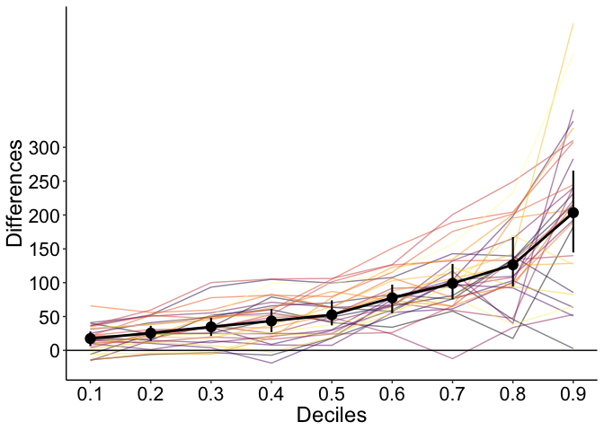

Hierarchical shift function: demo
================
Guillaume A. Rousselet
2019-02-25

-   [Dependencies](#dependencies)
-   [Example 1: same number of trials in each group, uniform shift](#example-1-same-number-of-trials-in-each-group-uniform-shift)
    -   [KDE](#kde)
    -   [Shift function](#shift-function)
    -   [Make data for np participants](#make-data-for-np-participants)
    -   [Quantiles and trimmed means](#quantiles-and-trimmed-means)
    -   [Plot deciles + group summaries](#plot-deciles-group-summaries)
    -   [Standard confidence interval](#standard-confidence-interval)
    -   [Plot results](#plot-results)
    -   [P values](#p-values)
    -   [Bootstrap confidence intervals](#bootstrap-confidence-intervals)
    -   [Bootstrap cluster correction for multiple comparisons](#bootstrap-cluster-correction-for-multiple-comparisons)
-   [Example 2: same number of trials in each group, early difference](#example-2-same-number-of-trials-in-each-group-early-difference)
    -   [KDE](#kde-1)
    -   [Shift function](#shift-function-1)
    -   [Make data for np participants](#make-data-for-np-participants-1)
    -   [Quantiles and trimmed means](#quantiles-and-trimmed-means-1)
    -   [Standard confidence interval](#standard-confidence-interval-1)
    -   [Plot results](#plot-results-1)
    -   [P values](#p-values-1)
    -   [Bootstrap confidence intervals](#bootstrap-confidence-intervals-1)
-   [Example 3: same number of trials in each group, difference in spread](#example-3-same-number-of-trials-in-each-group-difference-in-spread)
    -   [KDE](#kde-2)
    -   [Shift function](#shift-function-2)
    -   [Make data for np participants](#make-data-for-np-participants-2)
    -   [Quantiles and trimmed means](#quantiles-and-trimmed-means-2)
    -   [Standard confidence interval](#standard-confidence-interval-2)
    -   [Plot results](#plot-results-2)
    -   [P values](#p-values-2)
    -   [Bootstrap confidence intervals](#bootstrap-confidence-intervals-2)
-   [Example 4: same number of trials in each group, vary Tau component](#example-4-same-number-of-trials-in-each-group-vary-tau-component)
    -   [KDE](#kde-3)
    -   [Shift function](#shift-function-3)
    -   [Make data for np participants](#make-data-for-np-participants-3)
    -   [Quantiles and trimmed means](#quantiles-and-trimmed-means-3)
    -   [Standard confidence interval](#standard-confidence-interval-3)
    -   [Plot results](#plot-results-3)
    -   [P values](#p-values-3)
    -   [Bootstrap confidence intervals](#bootstrap-confidence-intervals-3)

Dependencies
============

``` r
# install.packages("devtools")
# devtools::install_github("GRousselet/rogme")
library(rogme)
library(tidyverse)
library(cowplot)
library(tidybayes)
library(retimes)
source("./functions.txt")
```

``` r
sessionInfo()
```

    ## R version 3.5.2 (2018-12-20)
    ## Platform: x86_64-apple-darwin15.6.0 (64-bit)
    ## Running under: macOS Mojave 10.14.3
    ## 
    ## Matrix products: default
    ## BLAS: /Library/Frameworks/R.framework/Versions/3.5/Resources/lib/libRblas.0.dylib
    ## LAPACK: /Library/Frameworks/R.framework/Versions/3.5/Resources/lib/libRlapack.dylib
    ## 
    ## locale:
    ## [1] en_GB.UTF-8/en_GB.UTF-8/en_GB.UTF-8/C/en_GB.UTF-8/en_GB.UTF-8
    ## 
    ## attached base packages:
    ## [1] stats     graphics  grDevices utils     datasets  methods   base     
    ## 
    ## other attached packages:
    ##  [1] retimes_0.1-2   tidybayes_1.0.3 cowplot_0.9.4   forcats_0.3.0  
    ##  [5] stringr_1.4.0   dplyr_0.7.8     purrr_0.3.0     readr_1.3.1    
    ##  [9] tidyr_0.8.2     tibble_2.0.1    tidyverse_1.2.1 rogme_0.2.0    
    ## [13] ggplot2_3.1.0  
    ## 
    ## loaded via a namespace (and not attached):
    ##  [1] ggstance_0.3.1            tidyselect_0.2.5         
    ##  [3] xfun_0.4                  haven_2.0.0              
    ##  [5] lattice_0.20-38           colorspace_1.4-0         
    ##  [7] generics_0.0.2            htmltools_0.3.6          
    ##  [9] yaml_2.2.0                rlang_0.3.1              
    ## [11] pillar_1.3.1              glue_1.3.0               
    ## [13] withr_2.1.2               modelr_0.1.3             
    ## [15] readxl_1.2.0              bindrcpp_0.2.2           
    ## [17] bindr_0.1.1               plyr_1.8.4               
    ## [19] munsell_0.5.0             gtable_0.2.0             
    ## [21] cellranger_1.1.0          rvest_0.3.2              
    ## [23] coda_0.19-2               evaluate_0.13            
    ## [25] knitr_1.21                broom_0.5.1              
    ## [27] Rcpp_1.0.0                arrayhelpers_1.0-20160527
    ## [29] scales_1.0.0              backports_1.1.3          
    ## [31] jsonlite_1.6              svUnit_0.7-12            
    ## [33] hms_0.4.2                 digest_0.6.18            
    ## [35] stringi_1.2.4             grid_3.5.2               
    ## [37] cli_1.0.1                 tools_3.5.2              
    ## [39] magrittr_1.5              lazyeval_0.2.1           
    ## [41] crayon_1.3.4              pkgconfig_2.0.2          
    ## [43] MASS_7.3-51.1             xml2_1.2.0               
    ## [45] ggridges_0.5.1            lubridate_1.7.4          
    ## [47] assertthat_0.2.0          rmarkdown_1.11           
    ## [49] httr_1.4.0                rstudioapi_0.9.0         
    ## [51] R6_2.3.0                  nlme_3.1-137             
    ## [53] compiler_3.5.2

We consider different situations in a hierarchical setting: varying numbers of trials are sampled from an ex-Gaussian distribution in 2 conditions, in varying numbers of participants. These simulations assume no between-participant variability. A more realistic situation is considered in [Rousselet & Wilcox (2019)](https://psyarxiv.com/3y54r/). There are a variety of approaches available to quantify distribution differences. In Rousselet & Wilcox (2019), we conclude that no method dominates: different methods better handle different situations. Crucially, neither the mean nor the median are sufficient or even necessary to compare distributions. Better tools are available; in particular, considering multiple quantiles of the distributions allow us to get a deeper understanding of how distributions differ.

Consider 4 types of differences between exGaussian distributions:
- uniform shift;
- early;
- spread;
- right tail only (tau component).

Example 1: same number of trials in each group, uniform shift
=============================================================

First, we consider a uniform shift. In condition 1, the ex-Gaussian parameters were mu = 500, sigma = 50 and tau = 200. Parameters in condition 2 were the same, but each sample was shifted by 50.

Illustrate data from one participant, 1000 trials per condition.

KDE
---

``` r
nt <- 1000
# ex Gaussian parameters
mu <- 500
sigma <- 50
tau <- 200
ES <- 50

set.seed(21)
g1 <- rexgauss(nt, mu = mu, sigma = sigma, tau = tau) 
g2 <- rexgauss(nt, mu = mu, sigma = sigma, tau = tau) + ES
df <- mkt2(g1, g2, group_labels = c("Condition1", "Condition2"))

p <- ggplot(df, aes(x = obs)) + theme_classic() + 
  stat_density(aes(colour = gr), geom="line",position="identity", size=1) +
  scale_colour_viridis_d(end = 0.8) +
  coord_cartesian(xlim = c(0, 2500)) +
  theme(axis.title.x = element_text(size = 18),
        axis.text.x = element_text(size = 16, colour="black"),
        axis.text.y = element_text(size = 16, colour="black"),
        axis.title.y = element_text(size = 18),
        legend.key.width = unit(1.5,"cm"),
        legend.position = c(0.55,0.75),
        legend.direction = "vertical",
        legend.text=element_text(size=16),
        legend.title=element_text(size=18),
        title = element_text(size=20)) +
  labs(x = "Reaction times", y = "Density", colour = "Conditions") +
  ggtitle("Uniform shift")
p
```


``` r
# p.uni.dist <- p
```

Shift function
--------------

To better understand how the distributions differ, let's look at a shift function, in which the difference between the deciles of the two conditions are plotted as a function of the deciles in condition 1 - see details in [Rousselet et al. (2017)](https://www.biorxiv.org/content/10.1101/121079v2). The decile differences are all negative, showing stochastic dominance of condition 2 over condition 1. The function is not flat because of random sampling and limited sample size.

``` r
out <- shifthd_pbci(df, nboot = 200, adj_ci = FALSE)
p <- plot_sf(out, plot_theme = 1)[[1]] + 
     theme(axis.text = element_text(size = 16, colour="black"))
p
```


``` r
# p.uni.sf <- p
```

Make data for np participants
-----------------------------

``` r
set.seed(747)

nt <- 100 # trials
np <- 30 # participants
# ex Gaussian parameters
mu <- 500
sigma <- 50
tau <- 200
ES <- 50

# generate data: matrix participants x trials
data1 <- matrix(rexgauss(nt*np, mu = mu, sigma = sigma, tau = tau), nrow = np)
data2 <- matrix(rexgauss(nt*np, mu = mu, sigma = sigma, tau = tau), nrow = np) + ES

# analysis parameters
qseq <- seq(0.1,0.9,0.1) # quantiles
alpha <- 0.05
nboot <- 1000 # bootstrap
tr <- 0.2 # group trimmed mean for each quantile
nq <- length(qseq)
icrit <- round((1-alpha)*nboot) # 95th quantile
ilo <- round((alpha/2)*nboot)
iup <- nboot - ilo
ilo <- ilo + 1
```

Ideally, such data would be analysed using a multi-level model, including for instance ex-Gaussian fits, random slopes and intercepts for participants, item analyses... This can be done using the [lme4](https://github.com/lme4/lme4) or [brms](https://github.com/paul-buerkner/brms) R packages. However, in my experience, in neuro and psych articles, the common approach is to collapse the variability across trials into a single number per participant and condition to be able to perform a paired t-test: typically, the mean is computed across trials for each condition and participant, then the means are subtracted, and the distribution of mean differences is entered into a one-sample t-test. Obviously, this strategy throws away a huge amount of information!

Depending on how conditions differ, looking at other aspects of the data than the mean can be more informative. For instance, in Rousselet & Wilcox (2019), we consider group comparisons of individual medians. Considering that the median is the second quartile, looking at the other quartiles can be of theoretical interest to investigate effects in early or later parts of distributions. This could be done in several ways, for instance by making inferences on the first quartile (Q1) or the third quartile (Q3). If the goal is to detect differences anywhere in the distributions, a more systematic approach consists in quantifying differences at multiple quantiles. Here we consider the case of the deciles, but other quantiles could be used. First, for each participant and each condition, the sample deciles are computed over trials. Second, for each participant, condition 2 deciles are subtracted from condition 1 deciles - we’re dealing with a within-subject (repeated-measure) design. Third, for each decile, the distribution of differences is subjected to a one-sample test. Fourth, a correction for multiple comparisons is applied across the 9 one-sample tests. We call this procedure a **hierarchical shift function**. There are many options available to implement this procedure and the example used here is not the definitive answer: the goal is simply to demonstrate that a relatively simple procedure can be much more powerful and informative than standard approaches.

In creating a hierarchical shift function we need to make three choices: a quantile estimator, a statistical test to assess quantile differences across participants, and a correction for multiple comparisons technique. The deciles were estimated using type 8 from the base R `quantile()` function (see justification in Rousselet & Wilcox, 2019). The group comparisons were performed using a one-sample t-test on 20% trimmed means, which performs well in many situations. The correction for multiple comparisons employed Hochberg’s strategy (Hochberg, 1988), which guarantees that the probability of at least one false positive will not exceed the nominal level as long as the nominal level is not exceeded for each quantile.

In Rousselet & Wilcox (2019), we consider power curves for the hierarchical shift function (HSF) and contrast them to other approaches: by design, HSF is sensitive to more types of differences than any standard approach using the mean or a single quantile. Another advantage of HSF is that the location of the distribution difference can be interrogated, which is impossible if inferences are limited to a single quantile.

Quantiles and trimmed means
---------------------------

``` r
# matrix of differences: rows = participants, columns = deciles
qdiff <- t(apply(data1, 1, quantile, probs = qseq, type = 8, names = FALSE) - 
                    apply(data2, 1, quantile, probs = qseq, type = 8, names = FALSE))
# Group trimmed means
gptm <- apply(qdiff, 2, mean, trim = tr)
```

Plot deciles + group summaries
------------------------------

``` r
df <- tibble(difference = as.vector(qdiff),
             quantile = rep(qseq, each = np),
             participants = factor(rep(seq(1:np), nq)))

df.md <- tibble(difference = gptm,
                quantile = qseq)

p <- ggplot(df, aes(x = quantile, 
                    y = difference, 
                    colour = participants)) + 
  theme_classic() +
  geom_line(alpha = 0.5) +
  geom_abline(slope = 0, intercept = 0) +
  geom_line(data = df.md, colour = "black", size = 1) +
  geom_point(data = df.md, colour = "black") +
  scale_colour_viridis_d(option = "B") +
  scale_x_continuous(breaks = qseq) +
  scale_y_continuous(breaks = seq(-200,100,50)) +
  theme(legend.position = "none",
        plot.title = element_text(size=22),
        axis.title.x = element_text(size = 18),
        axis.text = element_text(size = 16, colour = "black"),
        axis.title.y = element_text(size = 18)) + 
  labs(x = "Deciles", y = "Difference")
p
```


Standard confidence interval
----------------------------

``` r
yuen_ci <- apply(qdiff, 2, trimci, tr = tr) # 2 x 9
```

Plot results
------------

``` r
df <- tibble(difference = as.vector(qdiff),
             quantile = rep(qseq, each = np),
             participants = factor(rep(seq(1:np), nq)))

df.md <- tibble(difference = gptm,
                quantile = qseq,
                ymin = yuen_ci[1,],
                ymax = yuen_ci[2,])

p <- ggplot(df, aes(x = quantile, 
                    y = difference, 
                    colour = participants)) + 
  theme_classic() +
  geom_line(alpha = 0.5) +
  geom_abline(slope = 0, intercept = 0) +
  geom_line(data = df.md, colour = "black", size = 1) +
  geom_pointrange(data = df.md, aes(ymin = ymin, ymax = ymax), 
                  colour = "black", size = 0.5) +
  scale_colour_viridis_d(option = "B") +
  scale_x_continuous(breaks = qseq) +
  scale_y_continuous(breaks = seq(-200,100,50)) +
  theme(legend.position = "none",
        plot.title = element_text(size=22),
        axis.title.x = element_text(size = 18),
        axis.text = element_text(size = 16, colour = "black"),
        axis.title.y = element_text(size = 18)) + 
  labs(x = "Deciles", y = "Differences")
p
```


P values
--------

``` r
yuen_pval <- apply(qdiff, 2, trimpval, tr = tr, null.value=0)
yuen_pval
```

    ## [1] 4.627365e-11 6.080292e-11 3.737277e-11 6.334578e-07 5.635363e-10
    ## [6] 1.646131e-08 3.683236e-10 1.389007e-06 2.415958e-03

### Adjusted p values

``` r
p.adjust(yuen_pval, method = "hochberg")
```

    ## [1] 3.701892e-10 4.256204e-10 3.363549e-10 1.900373e-06 2.817682e-09
    ## [6] 6.584525e-08 2.209942e-09 2.778014e-06 2.415958e-03

### Binary output

``` r
print(yuen_pval < alpha)
```

    ## [1] TRUE TRUE TRUE TRUE TRUE TRUE TRUE TRUE TRUE

Bootstrap confidence intervals
------------------------------

Use the percentile bootstrap to compute confidence intervals.

Hierarchical situation: nt trials at level 2, two conditions compared using shift function (deciles), np participants at level 1. For each decile of the shift function, we perform a one-sample test on the 20% trimmed mean. The deciles are dependent, so we resample participants, then trials (hierarchical sampling).

``` r
set.seed(8899)

boot_data1 <- array(data = 0, dim = c(np, nt))
boot_data2 <- array(data = 0, dim = c(np, nt))
boot_qdiff <- array(data = 0, dim = c(nboot, nq, np))

for(B in 1:nboot){
  
  # bootstrap participants
  boot_id <- sample(np, np, replace = TRUE)
  
  for(CP in 1:np){ # bootstrap trials
    boot_data1[CP,] <- sample(data1[boot_id[CP],], nt, replace = TRUE)
    boot_data2[CP,] <- sample(data2[boot_id[CP],], nt, replace = TRUE)
  }
  
  boot_qdiff[B,,] <- apply(boot_data1, 1, quantile, probs = qseq, type = 8, names = FALSE) - 
      apply(boot_data2, 1, quantile, probs = qseq, type = 8, names = FALSE)

}

boot_tm <- apply(boot_qdiff, c(1,2), mean, trim = tr)
sort_boot_tm <- apply(boot_tm, 2, sort)
boot_ci <- matrix(data = 0, nrow = 2, ncol = nq)
boot_ci[1,] <- sort_boot_tm[ilo,]
boot_ci[2,] <- sort_boot_tm[iup,]

boot_hdi <- apply(boot_tm, 2, HDInterval::hdi, credMass = 1-alpha)
```

### Plot deciles + group summaries + confidence intervals

``` r
int_to_plot <- boot_ci 
# int_to_plot <- boot_hdi

df <- tibble(difference = as.vector(qdiff),
             quantile = rep(qseq, each = np),
             participants = factor(rep(seq(1:np), nq)))

df.md <- tibble(difference = gptm,
                quantile = qseq,
                ymin = int_to_plot[1,],
                ymax = int_to_plot[2,])

p <- ggplot(df, aes(x = quantile, 
                    y = difference, 
                    colour = participants)) + 
  theme_classic() +
  geom_line(alpha = 0.5) +
  geom_abline(slope = 0, intercept = 0) +
  geom_line(data = df.md, colour = "black", size = 1) +
  # geom_point(data = df.md, colour = "black", size = 2) +
  geom_pointrange(data = df.md, aes(ymin = ymin, ymax = ymax), 
                  colour = "black", size = 0.75) +
  scale_colour_viridis_d(option = "B") +
  scale_x_continuous(breaks = qseq) +
  # scale_y_continuous(breaks = seq(-500,700,250)) +
  # coord_cartesian(ylim = c(-500, 700)) +
  theme(legend.position = "none",
        plot.title = element_text(size=22),
        axis.title.x = element_text(size = 18),
        axis.text = element_text(size = 16, colour = "black"),
        axis.title.y = element_text(size = 18)) + 
  labs(x = "Deciles", y = "Differences")
  # coord_flip()
  # ggtitle("Non-Word - Word decile differences")
p
```


``` r
p.id <- p
```

### Plot bootstrap densities

Distributions of bootstrap estimates can be considered cheap [Bayesian posterior distributions](http://www.sumsar.net/blog/2015/04/the-non-parametric-bootstrap-as-a-bayesian-model/). They also contain useful information not captured by simply reporting confidence intervals. Here we plot them using `geom_halfeyeh()` from [tidybayes](https://github.com/mjskay/tidybayes).

``` r
# point_interval options:
# https://mjskay.github.io/tidybayes/reference/point_interval.html

df <- tibble(boot_samp = as.vector(boot_tm),
  quantile = rep(qseq, each = nboot))
p <- ggplot(df, aes(x = boot_samp, y = quantile)) +
  theme_classic() +
  geom_halfeyeh(fill = "orange", 
    point_interval = mode_hdi,
    .width = c(0.5, 0.9)) +
  geom_vline(xintercept = 0) +
  scale_y_continuous(breaks = qseq) +
  theme(plot.title = element_text(size=22),
    axis.title.x = element_text(size = 18),
    axis.text = element_text(size = 16, colour = "black"),
    axis.title.y = element_text(size = 18)) + 
  xlab("Bootstrap differences") +
  ylab("Deciles") +
  # coord_cartesian(xlim = c(-1, 0.1)) +
  coord_flip()
p
```


``` r
p.dens <- p
```

Bootstrap cluster correction for multiple comparisons
-----------------------------------------------------

Null hypothesis created for each participant by pooling all original trials = the two distributions are identical. Trials are sampled with replacement from pool of trials to create 2 distributions under the null.

``` r
set.seed(8899)

tvals <- apply(qdiff, 2, trimtval, tr = tr, null.value = 0) 
pvals <- apply(qdiff, 2, trimpval, tr = tr, null.value = 0) 

# make null data
null_data_all <- cbind(data1, data2)

boot_data1 <- array(data = 0, dim = c(np, nt))
boot_data2 <- array(data = 0, dim = c(np, nt))
boot.max.sums <- vector(mode = "numeric", length = nboot)

for(B in 1:nboot){
  
  # bootstrap participants
  boot_id <- sample(np, np, replace = TRUE)
  
  for(CP in 1:np){ # bootstrap trials
    boot_data1[CP,] <- sample(null_data_all[boot_id[CP],], nt, replace = TRUE)
    boot_data2[CP,] <- sample(null_data_all[boot_id[CP],], nt, replace = TRUE)
  }
  
  boot_qdiff <- t(apply(boot_data1, 1, quantile, probs = qseq, type = 8, names = FALSE) - 
      apply(boot_data2, 1, quantile, probs = qseq, type = 8, names = FALSE))
  
  boot_tvals <- apply(boot_qdiff, 2, trimtval, tr = tr, null.value = 0) 
  boot_pvals <- apply(boot_qdiff, 2, trimpval, tr = tr, null.value = 0) 
  boot_cmap <- cluster.make(boot_pvals < alpha) # form clusters based on p values
  # save max cluster sum
  boot.max.sums[B] <- max(cluster.sum(values = boot_tvals^2, cmap = boot_cmap)) 
}

# cluster sum threshold
tmp <- sort(boot.max.sums)
boot.th <- tmp[icrit]

# original clusters
cmap <- cluster.make(pvals < 0.05)

# cluster significance
ccmc.sig <- cluster.test(values = tvals^2, cmap = cmap, boot.th)
ccmc.sig
```

    ## [1] TRUE TRUE TRUE TRUE TRUE TRUE TRUE TRUE TRUE

Example 2: same number of trials in each group, early difference
================================================================

KDE
---

``` r
nt <- 1000
# ex Gaussian parameters
mu <- 500
sigma <- 50
tau <- 200
ES <- 1.5

set.seed(777)
g1 <- rexgauss(nt, mu = mu, sigma = sigma, tau = tau)
md.g1 <- median(g1)
q3.g1 <- quantile(g1, probs = 0.75)
g1 <- (g1 - q3.g1) * ES + q3.g1 # spread around the 3rd quartile
g2 <- rexgauss(nt, mu = mu, sigma = sigma, tau = tau)
df <- mkt2(g1, g2, group_labels = c("Condition1", "Condition2"))

p <- ggplot(df, aes(x = obs)) + theme_classic() + 
  stat_density(aes(colour = gr), geom="line",position="identity", size=1) +
  scale_colour_viridis_d(end = 0.8) +
  coord_cartesian(xlim = c(0, 2500)) +
  theme(axis.title.x = element_text(size = 18),
        axis.text.x = element_text(size = 16, colour="black"),
        axis.text.y = element_text(size = 16, colour="black"),
        axis.title.y = element_text(size = 18),
        legend.key.width = unit(1.5,"cm"),
        legend.position = c(0.55,0.75),
        legend.direction = "vertical",
        legend.text=element_text(size=16),
        legend.title=element_text(size=18),
        title = element_text(size=20)) +
  labs(x = "Reaction times", y = "Density", colour = "Groups") +
  ggtitle("Early difference")
p
```


``` r
# p.early.dist <- p
```

Shift function
--------------

``` r
out <- shifthd_pbci(df, nboot = 200, adj_ci = FALSE)
p <- plot_sf(out, plot_theme = 1)[[1]] + 
     theme(axis.text = element_text(size = 16, colour="black"))
p
```


``` r
# p.early.sf <- p
```

Make data for np participants
-----------------------------

``` r
set.seed(747)

nt <- 100 # trials
np <- 30 # participants
# ex Gaussian parameters
mu <- 500
sigma <- 50
tau <- 200
ES <- 1.5

# generate data: matrix participants x trials
data1 <- matrix(rexgauss(nt*np, mu = mu, sigma = sigma, tau = tau), nrow = nt)
md1 <- apply(data1, 2, quantile, probs = 0.75)
data1 <- (data1 - matrix(rep(md1,each=nt),nrow = nt)) * ES + matrix(rep(md1,each=nt),nrow = nt)
data1 <- t(data1)
data2 <- matrix(rexgauss(nt*np, mu = mu, sigma = sigma, tau = tau), nrow = np)

# analysis parameters
qseq <- seq(0.1,0.9,0.1) # quantiles
alpha <- 0.05
nboot <- 1000 # bootstrap
tr <- 0.2 # group trimmed mean for each quantile
nq <- length(qseq)
icrit <- round((1-alpha)*nboot) # 95th quantile
ilo <- round((alpha/2)*nboot)
iup <- nboot - ilo
ilo <- ilo + 1
```

Quantiles and trimmed means
---------------------------

``` r
# matrix of differences: rows = participants, columns = deciles
qdiff <- t(apply(data1, 1, quantile, probs = qseq, type = 8, names = FALSE) - 
                    apply(data2, 1, quantile, probs = qseq, type = 8, names = FALSE))
# Group trimmed means
gptm <- apply(qdiff, 2, mean, trim = tr)
```

Standard confidence interval
----------------------------

``` r
yuen_ci <- apply(qdiff, 2, trimci, tr = tr) # 2 x 9
```

Plot results
------------

``` r
df <- tibble(difference = as.vector(qdiff),
             quantile = rep(qseq, each = np),
             participants = factor(rep(seq(1:np), nq)))

df.md <- tibble(difference = gptm,
                quantile = qseq,
                ymin = yuen_ci[1,],
                ymax = yuen_ci[2,])

p <- ggplot(df, aes(x = quantile, 
                    y = difference, 
                    colour = participants)) + 
  theme_classic() +
  geom_line(alpha = 0.5) +
  geom_abline(slope = 0, intercept = 0) +
  geom_line(data = df.md, colour = "black", size = 1) +
  geom_pointrange(data = df.md, aes(ymin = ymin, ymax = ymax), 
                  colour = "black", size = 0.5) +
  scale_colour_viridis_d(option = "B") +
  scale_x_continuous(breaks = qseq) +
  scale_y_continuous(breaks = seq(-200,300,50)) +
  theme(legend.position = "none",
        plot.title = element_text(size=22),
        axis.title.x = element_text(size = 18),
        axis.text = element_text(size = 16, colour = "black"),
        axis.title.y = element_text(size = 18)) + 
  labs(x = "Deciles", y = "Differences")
p
```


P values
--------

``` r
yuen_pval <- apply(qdiff, 2, trimpval, tr = tr, null.value=0)
yuen_pval
```

    ## [1] 0.000000e+00 0.000000e+00 5.773160e-15 1.019185e-13 2.523315e-12
    ## [6] 4.056022e-07 2.865670e-04 8.465636e-01 4.132642e-03

### Adjusted p values

``` r
p.adjust(yuen_pval, method = "hochberg")
```

    ## [1] 0.000000e+00 0.000000e+00 4.041212e-14 6.115108e-13 1.261657e-11
    ## [6] 1.622409e-06 8.597010e-04 8.465636e-01 8.265284e-03

### Binary output

``` r
print(yuen_pval < alpha)
```

    ## [1]  TRUE  TRUE  TRUE  TRUE  TRUE  TRUE  TRUE FALSE  TRUE

Bootstrap confidence intervals
------------------------------

``` r
set.seed(8899)

boot_data1 <- array(data = 0, dim = c(np, nt))
boot_data2 <- array(data = 0, dim = c(np, nt))
boot_qdiff <- array(data = 0, dim = c(nboot, nq, np))

for(B in 1:nboot){
  
  # bootstrap participants
  boot_id <- sample(np, np, replace = TRUE)
  
  for(CP in 1:np){ # bootstrap trials
    boot_data1[CP,] <- sample(data1[boot_id[CP],], nt, replace = TRUE)
    boot_data2[CP,] <- sample(data2[boot_id[CP],], nt, replace = TRUE)
  }
  
  boot_qdiff[B,,] <- apply(boot_data1, 1, quantile, probs = qseq, type = 8, names = FALSE) - 
      apply(boot_data2, 1, quantile, probs = qseq, type = 8, names = FALSE)

}

boot_tm <- apply(boot_qdiff, c(1,2), mean, trim = tr)
sort_boot_tm <- apply(boot_tm, 2, sort)
boot_ci <- matrix(data = 0, nrow = 2, ncol = nq)
boot_ci[1,] <- sort_boot_tm[ilo,]
boot_ci[2,] <- sort_boot_tm[iup,]

boot_hdi <- apply(boot_tm, 2, HDInterval::hdi, credMass = 1-alpha)
```

### Plot deciles + group summaries + confidence intervals

``` r
int_to_plot <- boot_ci 
# int_to_plot <- boot_hdi

df <- tibble(difference = as.vector(qdiff),
             quantile = rep(qseq, each = np),
             participants = factor(rep(seq(1:np), nq)))

df.md <- tibble(difference = gptm,
                quantile = qseq,
                ymin = int_to_plot[1,],
                ymax = int_to_plot[2,])

p <- ggplot(df, aes(x = quantile, 
                    y = difference, 
                    colour = participants)) + 
  theme_classic() +
  geom_line(alpha = 0.5) +
  geom_abline(slope = 0, intercept = 0) +
  geom_line(data = df.md, colour = "black", size = 1) +
  # geom_point(data = df.md, colour = "black", size = 2) +
  geom_pointrange(data = df.md, aes(ymin = ymin, ymax = ymax), 
                  colour = "black", size = 0.75) +
  scale_colour_viridis_d(option = "B") +
  scale_x_continuous(breaks = qseq) +
  scale_y_continuous(breaks = seq(-200,300,50)) +
  theme(legend.position = "none",
        plot.title = element_text(size=22),
        axis.title.x = element_text(size = 18),
        axis.text = element_text(size = 16, colour = "black"),
        axis.title.y = element_text(size = 18)) + 
  labs(x = "Deciles", y = "Differences")
  # coord_flip()
  # ggtitle("Non-Word - Word decile differences")
p
```


``` r
# p.id <- p
```

### Plot bootstrap densities

``` r
# point_interval options:
# https://mjskay.github.io/tidybayes/reference/point_interval.html

df <- tibble(boot_samp = as.vector(boot_tm),
  quantile = rep(qseq, each = nboot))
p <- ggplot(df, aes(x = boot_samp, y = quantile)) +
  theme_classic() +
  geom_halfeyeh(fill = "orange", 
    point_interval = mode_hdi,
    .width = c(0.5, 0.9)) +
  geom_vline(xintercept = 0) +
  scale_y_continuous(breaks = qseq) +
  scale_x_continuous(breaks = seq(-200,300,50)) +
  theme(plot.title = element_text(size=22),
    axis.title.x = element_text(size = 18),
    axis.text = element_text(size = 16, colour = "black"),
    axis.title.y = element_text(size = 18)) + 
  xlab("Bootstrap differences") +
  ylab("Deciles") +
  coord_flip()
p
```


``` r
# p.dens <- p
```

Example 3: same number of trials in each group, difference in spread
====================================================================

KDE
---

``` r
nt <- 1000
# ex Gaussian parameters
mu <- 500
sigma <- 50
tau <- 200
ES <- 1.5

set.seed(777)
g1 <- rexgauss(nt, mu = mu, sigma = sigma, tau = tau)
md.g1 <- median(g1)
g1 <- (g1 - md.g1) * ES + md.g1 # spread around the median
g2 <- rexgauss(nt, mu = mu, sigma = sigma, tau = tau)
df <- mkt2(g1, g2, group_labels = c("Condition1", "Condition2"))

p <- ggplot(df, aes(x = obs)) + theme_classic() + 
  stat_density(aes(colour = gr), geom="line",position="identity", size=1) +
  scale_colour_viridis_d(end = 0.8) +
  coord_cartesian(xlim = c(0, 2500)) +
  theme(axis.title.x = element_text(size = 18),
        axis.text.x = element_text(size = 16, colour="black"),
        axis.text.y = element_text(size = 16, colour="black"),
        axis.title.y = element_text(size = 18),
        legend.key.width = unit(1.5,"cm"),
        legend.position = c(0.55,0.75),
        legend.direction = "vertical",
        legend.text=element_text(size=16),
        legend.title=element_text(size=18),
        title = element_text(size=20)) +
  labs(x = "Reaction times", y = "Density", colour = "Groups") + 
  ggtitle("Spread difference")
p
```


``` r
p.spr.dist <- p
```

Shift function
--------------

``` r
out <- shifthd_pbci(df, nboot = 200, adj_ci = FALSE)
p <- plot_sf(out, plot_theme = 1)[[1]] + 
     theme(axis.text = element_text(size = 16, colour="black"))
p
```


``` r
p.spr.sf <- p
```

Make data for np participants
-----------------------------

``` r
set.seed(747)

nt <- 100 # trials
np <- 30 # participants
# ex Gaussian parameters
mu <- 500
sigma <- 50
tau <- 200
ES <- 1.5

# generate data: matrix participants x trials
data1 <- matrix(rexgauss(nt*np, mu = mu, sigma = sigma, tau = tau), nrow = nt)
md1 <- apply(data1, 2, median)
data1 <- (data1 - matrix(rep(md1,each=nt),nrow = nt)) * ES + matrix(rep(md1,each=nt),nrow = nt)
data1 <- t(data1)
data2 <- matrix(rexgauss(nt*np, mu = mu, sigma = sigma, tau = tau), nrow = np)

# analysis parameters
qseq <- seq(0.1,0.9,0.1) # quantiles
alpha <- 0.05
nboot <- 1000 # bootstrap
tr <- 0.2 # group trimmed mean for each quantile
nq <- length(qseq)
icrit <- round((1-alpha)*nboot) # 95th quantile
ilo <- round((alpha/2)*nboot)
iup <- nboot - ilo
ilo <- ilo + 1
```

Quantiles and trimmed means
---------------------------

``` r
# matrix of differences: rows = participants, columns = deciles
qdiff <- t(apply(data1, 1, quantile, probs = qseq, type = 8, names = FALSE) - 
                    apply(data2, 1, quantile, probs = qseq, type = 8, names = FALSE))
# Group trimmed means
gptm <- apply(qdiff, 2, mean, trim = tr)
```

Standard confidence interval
----------------------------

``` r
yuen_ci <- apply(qdiff, 2, trimci, tr = tr) # 2 x 9
```

Plot results
------------

``` r
df <- tibble(difference = as.vector(qdiff),
             quantile = rep(qseq, each = np),
             participants = factor(rep(seq(1:np), nq)))

df.md <- tibble(difference = gptm,
                quantile = qseq,
                ymin = yuen_ci[1,],
                ymax = yuen_ci[2,])

p <- ggplot(df, aes(x = quantile, 
                    y = difference, 
                    colour = participants)) + 
  theme_classic() +
  geom_line(alpha = 0.5) +
  geom_abline(slope = 0, intercept = 0) +
  geom_line(data = df.md, colour = "black", size = 1) +
  geom_pointrange(data = df.md, aes(ymin = ymin, ymax = ymax), 
                  colour = "black", size = 0.5) +
  scale_colour_viridis_d(option = "B") +
  scale_x_continuous(breaks = qseq) +
  scale_y_continuous(breaks = seq(-200,400,50)) +
  theme(legend.position = "none",
        plot.title = element_text(size=22),
        axis.title.x = element_text(size = 18),
        axis.text = element_text(size = 16, colour = "black"),
        axis.title.y = element_text(size = 18)) + 
  labs(x = "Deciles", y = "Differences")
p
```


P values
--------

``` r
yuen_pval <- apply(qdiff, 2, trimpval, tr = tr, null.value=0) 
yuen_pval
```

    ## [1] 1.092459e-13 1.193579e-11 1.713832e-08 1.531584e-04 9.649563e-02
    ## [6] 1.740061e-01 3.043982e-03 1.271744e-05 1.757168e-05

### Adjusted p values

``` r
p.adjust(yuen_pval, method = "hochberg")
```

    ## [1] 9.832135e-13 9.548629e-11 1.199682e-07 6.126335e-04 1.740061e-01
    ## [6] 1.740061e-01 9.131946e-03 7.630463e-05 8.785839e-05

### Binary output

``` r
print(yuen_pval < alpha)
```

    ## [1]  TRUE  TRUE  TRUE  TRUE FALSE FALSE  TRUE  TRUE  TRUE

Bootstrap confidence intervals
------------------------------

``` r
set.seed(8899)

boot_data1 <- array(data = 0, dim = c(np, nt))
boot_data2 <- array(data = 0, dim = c(np, nt))
boot_qdiff <- array(data = 0, dim = c(nboot, nq, np))

for(B in 1:nboot){
  
  # bootstrap participants
  boot_id <- sample(np, np, replace = TRUE)
  
  for(CP in 1:np){ # bootstrap trials
    boot_data1[CP,] <- sample(data1[boot_id[CP],], nt, replace = TRUE)
    boot_data2[CP,] <- sample(data2[boot_id[CP],], nt, replace = TRUE)
  }
  
  boot_qdiff[B,,] <- apply(boot_data1, 1, quantile, probs = qseq, type = 8, names = FALSE) - 
      apply(boot_data2, 1, quantile, probs = qseq, type = 8, names = FALSE)

}

boot_tm <- apply(boot_qdiff, c(1,2), mean, trim = tr)
sort_boot_tm <- apply(boot_tm, 2, sort)
boot_ci <- matrix(data = 0, nrow = 2, ncol = nq)
boot_ci[1,] <- sort_boot_tm[ilo,]
boot_ci[2,] <- sort_boot_tm[iup,]

boot_hdi <- apply(boot_tm, 2, HDInterval::hdi, credMass = 1-alpha)
```

### Plot deciles + group summaries + confidence intervals

``` r
int_to_plot <- boot_ci 
# int_to_plot <- boot_hdi

df <- tibble(difference = as.vector(qdiff),
             quantile = rep(qseq, each = np),
             participants = factor(rep(seq(1:np), nq)))

df.md <- tibble(difference = gptm,
                quantile = qseq,
                ymin = int_to_plot[1,],
                ymax = int_to_plot[2,])

p <- ggplot(df, aes(x = quantile, 
                    y = difference, 
                    colour = participants)) + 
  theme_classic() +
  geom_line(alpha = 0.5) +
  geom_abline(slope = 0, intercept = 0) +
  geom_line(data = df.md, colour = "black", size = 1) +
  # geom_point(data = df.md, colour = "black", size = 2) +
  geom_pointrange(data = df.md, aes(ymin = ymin, ymax = ymax), 
                  colour = "black", size = 0.75) +
  scale_colour_viridis_d(option = "B") +
  scale_x_continuous(breaks = qseq) +
  scale_y_continuous(breaks = seq(-200,300,50)) +
  theme(legend.position = "none",
        plot.title = element_text(size=22),
        axis.title.x = element_text(size = 18),
        axis.text = element_text(size = 16, colour = "black"),
        axis.title.y = element_text(size = 18)) + 
  labs(x = "Deciles", y = "Differences")
  # coord_flip()
  # ggtitle("Non-Word - Word decile differences")
p
```


``` r
# p.id <- p
```

### Plot bootstrap densities

``` r
# point_interval options:
# https://mjskay.github.io/tidybayes/reference/point_interval.html

df <- tibble(boot_samp = as.vector(boot_tm),
  quantile = rep(qseq, each = nboot))
p <- ggplot(df, aes(x = boot_samp, y = quantile)) +
  theme_classic() +
  geom_halfeyeh(fill = "orange", 
    point_interval = mode_hdi,
    .width = c(0.5, 0.9)) +
  geom_vline(xintercept = 0) +
  scale_y_continuous(breaks = qseq) +
  scale_x_continuous(breaks = seq(-200,300,50)) +
  theme(plot.title = element_text(size=22),
    axis.title.x = element_text(size = 18),
    axis.text = element_text(size = 16, colour = "black"),
    axis.title.y = element_text(size = 18)) + 
  xlab("Bootstrap differences") +
  ylab("Deciles") +
  coord_flip()
p
```


``` r
# p.dens <- p
```

Example 4: same number of trials in each group, vary Tau component
==================================================================

KDE
---

``` r
nt <- 1000
# ex Gaussian parameters
mu <- 500
sigma <- 50
tau <- 200
ES <- 100

set.seed(777)
g1 <- rexgauss(nt, mu = mu, sigma = sigma, tau = tau + ES)
g2 <- rexgauss(nt, mu = mu, sigma = sigma, tau = tau)
df <- mkt2(g1, g2, group_labels = c("Condition1", "Condition2"))

p <- ggplot(df, aes(x = obs)) + theme_classic() + 
  stat_density(aes(colour = gr), geom="line",position="identity", size=1) +
  scale_colour_viridis_d(end = 0.8) +
  coord_cartesian(xlim = c(0, 2500)) +
  theme(axis.title.x = element_text(size = 18),
        axis.text.x = element_text(size = 16, colour="black"),
        axis.text.y = element_text(size = 16, colour="black"),
        axis.title.y = element_text(size = 18),
        legend.key.width = unit(1.5,"cm"),
        legend.position = c(0.55,0.75),
        legend.direction = "vertical",
        legend.text=element_text(size=16),
        legend.title=element_text(size=18),
        title = element_text(size=20)) +
  labs(x = "Reaction times", y = "Density", colour = "Groups") + 
  ggtitle("Late difference")
p
```


``` r
p.tau.dist <- p
```

Shift function
--------------

``` r
out <- shifthd_pbci(df, nboot = 200, adj_ci = FALSE)
p <- plot_sf(out, plot_theme = 1)[[1]] + 
     theme(axis.text = element_text(size = 16, colour="black"))
p
```


``` r
p.tau.sf <- p
```

Make data for np participants
-----------------------------

``` r
set.seed(747)

nt <- 100 # trials
np <- 30 # participants
# ex Gaussian parameters
mu <- 500
sigma <- 50
tau <- 200
ES <- 100

# generate data: matrix participants x trials
data1 <- matrix(rexgauss(nt*np, mu = mu, sigma = sigma, tau = tau + ES), nrow = np)
data2 <- matrix(rexgauss(nt*np, mu = mu, sigma = sigma, tau = tau), nrow = np)

# analysis parameters
qseq <- seq(0.1,0.9,0.1) # quantiles
alpha <- 0.05
nboot <- 1000 # bootstrap
tr <- 0.2 # group trimmed mean for each quantile
nq <- length(qseq)
icrit <- round((1-alpha)*nboot) # 95th quantile
ilo <- round((alpha/2)*nboot)
iup <- nboot - ilo
ilo <- ilo + 1
```

Quantiles and trimmed means
---------------------------

``` r
# matrix of differences: rows = participants, columns = deciles
qdiff <- t(apply(data1, 1, quantile, probs = qseq, type = 8, names = FALSE) - 
                    apply(data2, 1, quantile, probs = qseq, type = 8, names = FALSE))
# Group trimmed means
gptm <- apply(qdiff, 2, mean, trim = tr)
```

Standard confidence interval
----------------------------

``` r
yuen_ci <- apply(qdiff, 2, trimci, tr = tr) # 2 x 9
```

Plot results
------------

``` r
df <- tibble(difference = as.vector(qdiff),
             quantile = rep(qseq, each = np),
             participants = factor(rep(seq(1:np), nq)))

df.md <- tibble(difference = gptm,
                quantile = qseq,
                ymin = yuen_ci[1,],
                ymax = yuen_ci[2,])

p <- ggplot(df, aes(x = quantile, 
                    y = difference, 
                    colour = participants)) + 
  theme_classic() +
  geom_line(alpha = 0.5) +
  geom_abline(slope = 0, intercept = 0) +
  geom_line(data = df.md, colour = "black", size = 1) +
  geom_pointrange(data = df.md, aes(ymin = ymin, ymax = ymax), 
                  colour = "black", size = 0.5) +
  scale_colour_viridis_d(option = "B") +
  scale_x_continuous(breaks = qseq) +
  scale_y_continuous(breaks = seq(-200,300,50)) +
  theme(legend.position = "none",
        plot.title = element_text(size=22),
        axis.title.x = element_text(size = 18),
        axis.text = element_text(size = 16, colour = "black"),
        axis.title.y = element_text(size = 18)) + 
  labs(x = "Deciles", y = "Differences")
p
```


P values
--------

``` r
yuen_pval <- apply(qdiff, 2, trimpval, tr = tr, null.value=0) 
yuen_pval
```

    ## [1] 1.753913e-04 1.103033e-06 9.436352e-07 4.510717e-06 3.298945e-07
    ## [6] 5.764929e-10 7.050422e-10 1.288087e-08 3.544176e-07

### Adjusted p values

``` r
p.adjust(yuen_pval, method = "hochberg")
```

    ## [1] 1.753913e-04 3.309099e-06 3.309099e-06 9.021435e-06 1.772088e-06
    ## [6] 5.188436e-09 5.640338e-09 9.016610e-08 1.772088e-06

### Binary output

``` r
print(yuen_pval < alpha)
```

    ## [1] TRUE TRUE TRUE TRUE TRUE TRUE TRUE TRUE TRUE

Bootstrap confidence intervals
------------------------------

``` r
set.seed(8899)

boot_data1 <- array(data = 0, dim = c(np, nt))
boot_data2 <- array(data = 0, dim = c(np, nt))
boot_qdiff <- array(data = 0, dim = c(nboot, nq, np))

for(B in 1:nboot){
  
  # bootstrap participants
  boot_id <- sample(np, np, replace = TRUE)
  
  for(CP in 1:np){ # bootstrap trials
    boot_data1[CP,] <- sample(data1[boot_id[CP],], nt, replace = TRUE)
    boot_data2[CP,] <- sample(data2[boot_id[CP],], nt, replace = TRUE)
  }
  
  boot_qdiff[B,,] <- apply(boot_data1, 1, quantile, probs = qseq, type = 8, names = FALSE) - 
      apply(boot_data2, 1, quantile, probs = qseq, type = 8, names = FALSE)

}

boot_tm <- apply(boot_qdiff, c(1,2), mean, trim = tr)
sort_boot_tm <- apply(boot_tm, 2, sort)
boot_ci <- matrix(data = 0, nrow = 2, ncol = nq)
boot_ci[1,] <- sort_boot_tm[ilo,]
boot_ci[2,] <- sort_boot_tm[iup,]

boot_hdi <- apply(boot_tm, 2, HDInterval::hdi, credMass = 1-alpha)
```

### Plot deciles + group summaries + confidence intervals

``` r
int_to_plot <- boot_ci 
# int_to_plot <- boot_hdi

df <- tibble(difference = as.vector(qdiff),
             quantile = rep(qseq, each = np),
             participants = factor(rep(seq(1:np), nq)))

df.md <- tibble(difference = gptm,
                quantile = qseq,
                ymin = int_to_plot[1,],
                ymax = int_to_plot[2,])

p <- ggplot(df, aes(x = quantile, 
                    y = difference, 
                    colour = participants)) + 
  theme_classic() +
  geom_line(alpha = 0.5) +
  geom_abline(slope = 0, intercept = 0) +
  geom_line(data = df.md, colour = "black", size = 1) +
  # geom_point(data = df.md, colour = "black", size = 2) +
  geom_pointrange(data = df.md, aes(ymin = ymin, ymax = ymax), 
                  colour = "black", size = 0.75) +
  scale_colour_viridis_d(option = "B") +
  scale_x_continuous(breaks = qseq) +
  scale_y_continuous(breaks = seq(-200,300,50)) +
  theme(legend.position = "none",
        plot.title = element_text(size=22),
        axis.title.x = element_text(size = 18),
        axis.text = element_text(size = 16, colour = "black"),
        axis.title.y = element_text(size = 18)) + 
  labs(x = "Deciles", y = "Differences")
  # coord_flip()
  # ggtitle("Non-Word - Word decile differences")
p
```



``` r
# p.id <- p
```

### Plot bootstrap densities

``` r
# point_interval options:
# https://mjskay.github.io/tidybayes/reference/point_interval.html

df <- tibble(boot_samp = as.vector(boot_tm),
  quantile = rep(qseq, each = nboot))
p <- ggplot(df, aes(x = boot_samp, y = quantile)) +
  theme_classic() +
  geom_halfeyeh(fill = "orange", 
    point_interval = mode_hdi,
    .width = c(0.5, 0.9)) +
  geom_vline(xintercept = 0) +
  scale_y_continuous(breaks = qseq) +
  scale_x_continuous(breaks = seq(-200,300,50)) +
  theme(plot.title = element_text(size=22),
    axis.title.x = element_text(size = 18),
    axis.text = element_text(size = 16, colour = "black"),
    axis.title.y = element_text(size = 18)) + 
  xlab("Bootstrap differences") +
  ylab("Deciles") +
  coord_flip()
p
```


``` r
# p.dens <- p
```
