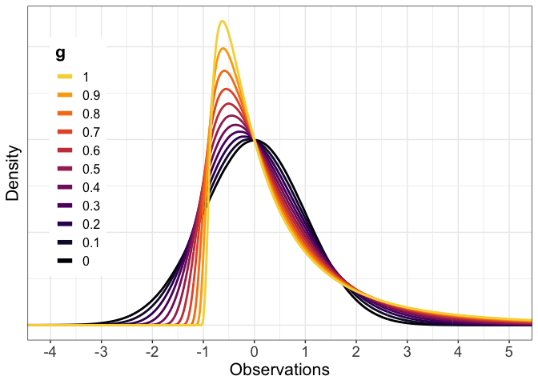
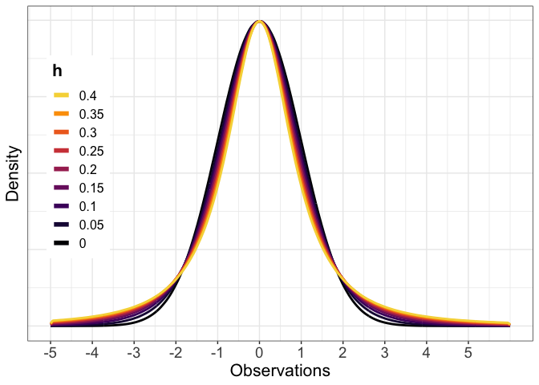
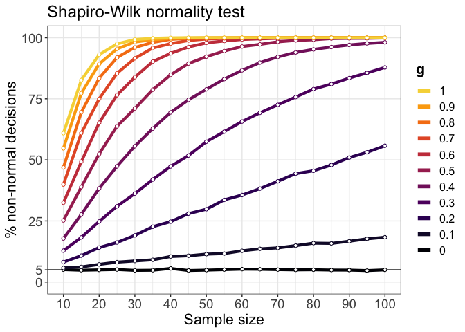
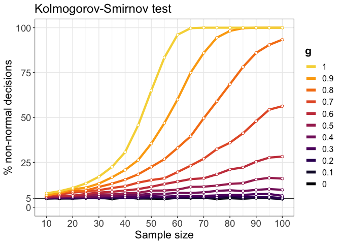
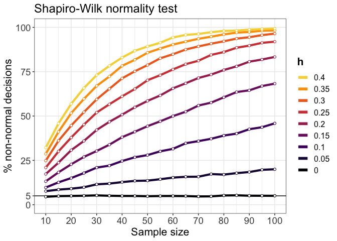
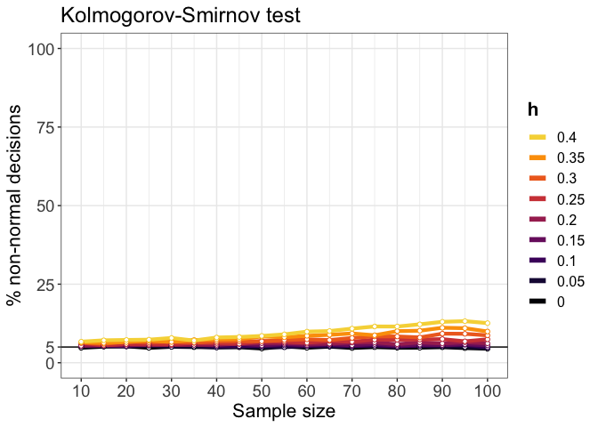

Normality tests: false positives and power curves
================
Guillaume A. Rousselet
2022-09-30

-   <a href="#dependencies" id="toc-dependencies">Dependencies</a>
-   <a href="#g--h-distributions" id="toc-g--h-distributions">g &amp; h
    distributions</a>
    -   <a href="#vary-g" id="toc-vary-g">Vary g</a>
    -   <a href="#vary-h" id="toc-vary-h">Vary h</a>
-   <a href="#normality-tests-dependence-on-sample-size-and-skewness"
    id="toc-normality-tests-dependence-on-sample-size-and-skewness">Normality
    tests: dependence on sample size and skewness</a>
    -   <a href="#results-non-normality-detection"
        id="toc-results-non-normality-detection">Results: non-normality
        detection</a>
-   <a href="#normality-tests-dependence-on-sample-size-and-tail-thickness"
    id="toc-normality-tests-dependence-on-sample-size-and-tail-thickness">Normality
    tests: dependence on sample size and tail thickness</a>
    -   <a href="#results-non-normality-detection-1"
        id="toc-results-non-normality-detection-1">Results: non-normality
        detection</a>
-   <a href="#references" id="toc-references">References</a>

# Dependencies

``` r
library(tibble)
library(ggplot2)
library(KernSmooth)
```

    ## KernSmooth 2.23 loaded
    ## Copyright M. P. Wand 1997-2009

``` r
library(car)
```

    ## Loading required package: carData

``` r
library(beepr)
```

# g & h distributions

`ghdist` generates n observations from a g-and-h distribution ([Yan &
Genton, 2019](https://doi.org/10.1111/j.1740-9713.2019.01273.x)). The
`g` parameter affects the symmetry (skewness) of the distribution. The
`h` parameter affects the thickness of the tails and how peaky the
distribution is.

g=0, h=0 -\> normal distribution  
g=1, h=0 -\> shifted lognormal distribution

``` r
# Code from Rand Wilcox
# https://dornsife.usc.edu/labs/rwilcox/software/
ghdist <- function(n,g=0,h=0){ 
  x <- rnorm(n)
  if (g>0){
    ghdist <- (exp(g*x)-1)*exp(h*x^2/2)/g 
  }
  if(g==0){
    ghdist<-x*exp(h*x^2/2)
  }
  ghdist 
}
```

## Vary g

### Generate pdfs (probability density functions)

There are methods to generate pdfs using parametric approaches, but
there is no simple implementation for g-and-h distributions, no
straighforward equivalent to `dnorm` or `dlnorm`. The R package `gk`
offers generalised g-and-h and g-and-k distributions, but these
distributions do not contain the original Tukey g-and-h distributions as
a special case. The package `tukeyGH` offers what we want, but produces
weird wavy distortions near the ends of the distributions. So here to
illustrate the pdfs, I simply create large samples, estimate their
densities, and plot them.

The next code chunk is slow to run because of the large sample size
required to estimate smooth pdfs without edge distortions. Results have
been saved and can be loaded in the following chunk.

``` r
gvec <- seq(0, 1, 0.1)
ng <- length(gvec)
xrange <- c(-5, 6) # range.x
x <- seq(xrange[1], xrange[2], 0.01)
nx <- length(x) # gridsize
ghpdf <- array(NA, dim = c(nx, ng))  
nsamp <- 100000000
for(G in 1:ng){
  ghsamp <- ghdist(nsamp, g=gvec[G], h=0)
  out <- KernSmooth::bkde(x = ghsamp, kernel = "box", bandwidth = 0.05,
                          truncate = TRUE, range.x = xrange, gridsize = nx)
  ghpdf[,G] <- out$y
}
save(ghpdf, gvec, x, ng, nx,
     file = "./data/ghpdf_vg.RData")
```

### Illustrate distributions

``` r
load("./data/ghpdf_vg.RData")
df <- tibble(density = as.vector(ghpdf),
             x = rep(x, ng),
             g = factor(rep(gvec, each = nx)))

ggplot(df, aes(x = x, y = density, colour = g)) + theme_bw() +
  geom_line(size = 1) +
  scale_colour_viridis_d(end = 0.9, option = "B") +
  scale_x_continuous(breaks = seq(-4, 5, 1)) +
  coord_cartesian(xlim = c(-4, 5)) +
  labs(x = "Observations",
       y = "Density") +
  theme(axis.title = element_text(size = 16),
        axis.text.x = element_text(size = 14),
        axis.text.y = element_blank(),
        axis.ticks.y = element_blank(),
        legend.position = c(.1, .55),
        legend.title = element_text(size = 16, face = "bold"),
        legend.text = element_text(size = 12)) +
  guides(colour = guide_legend(reverse=TRUE, override.aes = list(size = 2)))
```

<!-- -->

``` r
# ggsave('./figures/ghdist_vg.png', width = 20, height = 12, units = "cm")
```

## Vary h

### Generate pdfs

The next code chunk is slow to run because of the large sample size
required to estimate smooth pdfs without edge distortions. Results have
been saved and can be loaded in the following chunk.

``` r
hvec <- seq(0, 0.4, 0.05)
nh <- length(hvec)
xrange <- c(-5, 6) # range.x
x <- seq(xrange[1], xrange[2], 0.01)
nx <- length(x) # gridsize
ghpdf <- array(NA, dim = c(nx, nh))  
nsamp <- 100000000
for(H in 1:nh){
  ghsamp <- ghdist(nsamp, g=0, h=hvec[H])
  out <- KernSmooth::bkde(x = ghsamp, kernel = "box", bandwidth = 0.05,
                          truncate = TRUE, range.x = xrange, gridsize = nx)
  ghpdf[,H] <- out$y
}
save(ghpdf, hvec, x, nh, nx,
     file = "./data/ghpdf_vh.RData")
```

### Illustrate distributions

``` r
load("./data/ghpdf_vh.RData")

df <- tibble(density = as.vector(ghpdf),
             x = rep(x, nh),
             h = factor(rep(hvec, each = nx)))

ggplot(df, aes(x = x, y = density, colour = h)) + theme_bw() +
  geom_line(size = 1) +
  scale_colour_viridis_d(end = 0.9, option = "B") +
  scale_x_continuous(breaks = seq(-5, 5, 1)) +
  labs(x = "Observations",
       y = "Density") +
  theme(axis.title = element_text(size = 16),
        axis.text.x = element_text(size = 14),
        axis.text.y = element_blank(),
        axis.ticks.y = element_blank(),
        legend.position = c(.1, .55),
        legend.title = element_text(size = 16, face = "bold"),
        legend.text = element_text(size = 12)) +
  guides(colour = guide_legend(reverse=TRUE, override.aes = list(size = 2)))
```

<!-- -->

``` r
# ggsave('./figures/ghdist_vh.png', width = 20, height = 12, units = "cm")
```

# Normality tests: dependence on sample size and skewness

Vary g to assess dependence on skewness. We apply the [Shapiro-Wilk
test](https://en.wikipedia.org/wiki/Shapiro–Wilk_test) and the
[Kolmogorov-Smirnov
test](https://en.wikipedia.org/wiki/Kolmogorov–Smirnov_test).

``` r
set.seed(44)
nsim <- 10000
nmax <- 100
nvec <- seq(10,nmax,5)
nn <- length(nvec)  
gvec <- seq(0,1,0.1) 
ng <- length(gvec)
h <- 0
aat <- 0.05 # arbitrary alpha threshold
# Define arrays of results
normtest.sw <- array(NA, dim = c(nsim, nn, ng)) # Shapiro-Wilk
normtest.ks <- array(NA, dim = c(nsim, nn, ng)) # Kolmogorov-Smirnov
for(iter in 1:nsim){
  if(iter == 1){ # iteration message to print in the console
    print(paste("iteration",iter,"/",nsim))
    beep(2)
  }
  if(iter %% 1000 == 0){
    print(paste("iteration",iter,"/",nsim))
    beep(2)
  }
  for(N in 1:nn){
    for(G in 1:ng){
      # generate random data from g & h distribution
      x <- ghdist(nvec[N], g=gvec[G], h=h)
      # normality tests
      normtest.sw[iter,N,G] <- shapiro.test(x)$p.value < aat
      normtest.ks[iter,N,G] <- ks.test(x, "pnorm", mean=0, sd=1)$p.value < aat
    }
  }
}
beep(8)
save(nvec, nn, gvec, ng, normtest.sw, normtest.ks, file = "./data/res_normtest_vg.RData")
```

## Results: non-normality detection

### Shapiro-Wilk test

``` r
load("./data/res_normtest_vg.RData")

df <- tibble(non_norm = as.vector(apply(normtest.sw, c(2,3), mean)),
             sampsize = rep(nvec, ng),
             g = factor(rep(gvec, each = nn)))

ggplot(data=df, aes(x=sampsize, y=non_norm*100, colour=g)) + theme_bw() +
  geom_abline(slope = 0, intercept = 0.05*100) +
  geom_line(size=1.5) +
  geom_point(fill="white", shape=21, show.legend = FALSE) +
  scale_colour_viridis_d(option = "B", end = 0.9) + 
  coord_cartesian(ylim=c(0, 100)) +
  scale_x_continuous(breaks = nvec[c(TRUE, FALSE)]) +
  scale_y_continuous(breaks = c(0, 5, seq(25,100,25))) +
  labs(x = "Sample size",
       y = "% non-normal decisions") +
  theme(axis.title = element_text(size = 16),
        axis.text = element_text(size = 14),
        plot.title = element_text(size = 18),
        panel.grid.minor.y = element_blank(),
        legend.title = element_text(size = 16, face = "bold"),
        legend.text = element_text(size = 12)) +
  guides(colour = guide_legend(reverse=TRUE,override.aes = list(size = 2))) +
  ggtitle('Shapiro-Wilk normality test')
```

<!-- -->

``` r
# ggsave('./figures/simres_sw_vg.png', width = 20, height = 12, units = "cm")
```

The Shapiro-Wilk test has low power unless the departure from normality
is pronounced, or sample sizes are large. With small departures from
normality (say g=0.1, g=0.2), achieving high power won’t be possible
with typical sample sizes in psychology and neuroscience.

Another point to consider: with increasing sample sizes, even a very
small departure from normality is guaranteed to be detected. This is a
problem if such small departure is of no practical consequence.

### Kolmogorov-Smirnov test

``` r
df <- tibble(non_norm = as.vector(apply(normtest.ks, c(2,3), mean)),
             sampsize = rep(nvec, ng),
             g = factor(rep(gvec, each = nn)))

ggplot(data=df, aes(x=sampsize, y=non_norm*100, colour=g)) + theme_bw() +
  geom_abline(slope = 0, intercept = 0.05*100) +
  geom_line(size=1.5) +
  geom_point(fill="white", shape=21, show.legend = FALSE) +
  scale_colour_viridis_d(option = "B", end = 0.9) + 
  coord_cartesian(ylim=c(0, 100)) +
  scale_x_continuous(breaks = nvec[c(TRUE, FALSE)]) +
  scale_y_continuous(breaks = c(0, 5, seq(25,100,25))) +
  labs(x = "Sample size",
       y = "% non-normal decisions") +
  theme(axis.title = element_text(size = 16),
        axis.text = element_text(size = 14),
        plot.title = element_text(size = 18),
        panel.grid.minor.y = element_blank(),
        legend.title = element_text(size = 16, face = "bold"),
        legend.text = element_text(size = 12)) +
  guides(colour = guide_legend(reverse=TRUE,override.aes = list(size = 2))) +
  ggtitle('Kolmogorov-Smirnov test')
```

<!-- -->

``` r
# ggsave('./figures/simres_ks_vg.png', width = 20, height = 12, units = "cm")
```

With the KS test, power is dramatically lower than with the SW test. I
didn’t know that before running the simulation, but that behaviour has
been documented by Yap & Sim (2011) for instance. Essentially, given the
sample sizes and the departure from normality required for a positive
result, simply plotting the data should clearly identify the problem!

# Normality tests: dependence on sample size and tail thickness

Vary h to assess dependence on tail thickness. We apply the
[Shapiro-Wilk test](https://en.wikipedia.org/wiki/Shapiro–Wilk_test) and
the [Kolmogorov-Smirnov
test](https://en.wikipedia.org/wiki/Kolmogorov–Smirnov_test).

``` r
set.seed(44)
nsim <- 10000
nmax <- 100
nvec <- seq(10,nmax,5)
nn <- length(nvec)  
hvec <- seq(0,0.4,0.05) 
nh <- length(hvec)
g <- 0
aat <- 0.05 # arbitrary alpha threshold
npop <- 1000000
# Define arrays of results
normtest.sw <- array(NA, dim = c(nsim, nn, nh)) # Shapiro-Wilk
normtest.ks <- array(NA, dim = c(nsim, nn, nh)) # Kolmogorov-Smirnov
for(iter in 1:nsim){
  if(iter == 1){ # iteration message to print in the console
    print(paste("iteration",iter,"/",nsim))
    beep(2)
  }
  if(iter %% 1000 == 0){
    print(paste("iteration",iter,"/",nsim))
    beep(2)
  }
  for(N in 1:nn){
    for(H in 1:nh){
      # generate random data from g & h distribution
      x <- ghdist(nvec[N], g=g, h=hvec[H])
      # normality tests
      normtest.sw[iter,N,H] <- shapiro.test(x)$p.value < aat
      normtest.ks[iter,N,H] <- ks.test(x, "pnorm", mean=0, sd=1)$p.value < aat
    }
  }
}
beep(8)
save(nvec, nn, hvec, nh, normtest.sw, normtest.ks, file = "./data/res_normtest_vh.RData")
```

## Results: non-normality detection

### Shapiro-Wilk test

``` r
load("./data/res_normtest_vh.RData")

df <- tibble(non_norm = as.vector(apply(normtest.sw, c(2,3), mean)),
             sampsize = rep(nvec, nh),
             h = factor(rep(hvec, each = nn)))

ggplot(data=df, aes(x=sampsize, y=non_norm*100, colour=h)) + theme_bw() +
  geom_abline(slope = 0, intercept = 0.05*100) +
  geom_line(size=1.5) +
  geom_point(fill="white", shape=21, show.legend = FALSE) +
  scale_colour_viridis_d(option = "B", end = 0.9) + 
  coord_cartesian(ylim=c(0, 100)) +
  scale_x_continuous(breaks = nvec[c(TRUE, FALSE)]) +
  scale_y_continuous(breaks = c(0, 5, seq(25,100,25))) +
  labs(x = "Sample size",
       y = "% non-normal decisions") +
  theme(axis.title = element_text(size = 16),
        axis.text = element_text(size = 14),
        plot.title = element_text(size = 18),
        panel.grid.minor.y = element_blank(),
        legend.title = element_text(size = 16, face = "bold"),
        legend.text = element_text(size = 12)) +
  guides(colour = guide_legend(reverse=TRUE,override.aes = list(size = 2))) +
  ggtitle('Shapiro-Wilk normality test')
```

<!-- -->

``` r
# ggsave('./figures/simres_sw_vh.png', width = 20, height = 12, units = "cm")
```

Similar profile of results to the one obtained in the previous
simulation in which we varied `g`.

### Kolmogorov-Smirnov test

``` r
df <- tibble(non_norm = as.vector(apply(normtest.ks, c(2,3), mean)),
             sampsize = rep(nvec, nh),
             h = factor(rep(hvec, each = nn)))

ggplot(data=df, aes(x=sampsize, y=non_norm*100, colour=h)) + theme_bw() +
  geom_abline(slope = 0, intercept = 0.05*100) +
  geom_line(size=1.5) +
  geom_point(fill="white", shape=21, show.legend = FALSE) +
  scale_colour_viridis_d(option = "B", end = 0.9) + 
  coord_cartesian(ylim=c(0, 100)) +
  scale_x_continuous(breaks = nvec[c(TRUE, FALSE)]) +
  scale_y_continuous(breaks = c(0, 5, seq(25,100,25))) +
  labs(x = "Sample size",
       y = "% non-normal decisions") +
  theme(axis.title = element_text(size = 16),
        axis.text = element_text(size = 14),
        plot.title = element_text(size = 18),
        panel.grid.minor.y = element_blank(),
        legend.title = element_text(size = 16, face = "bold"),
        legend.text = element_text(size = 12)) +
  guides(colour = guide_legend(reverse=TRUE,override.aes = list(size = 2))) +
  ggtitle('Kolmogorov-Smirnov test')
```

<!-- -->

``` r
# ggsave('./figures/simres_ks_vh.png', width = 20, height = 12, units = "cm")
```

Extremely poor performance of the KS test. Avoid!

# References

Normality Test in R
<http://www.sthda.com/english/wiki/normality-test-in-r>

B. W. Yap & C. H. Sim (2011) Comparisons of various types of normality
tests, Journal of Statistical Computation and Simulation, 81:12,
2141-2155, DOI: 10.1080/00949655.2010.520163
<https://doi.org/10.1080/00949655.2010.520163>

Yan, Y. and Genton, M.G. (2019), The Tukey g-and-h distribution.
Significance, 16: 12-13.
<https://doi.org/10.1111/j.1740-9713.2019.01273.x>

Kolmogorov-Smirnov test
<a href="https://en.wikipedia.org/wiki/Kolmogorov–Smirnov_test"
class="uri">https://en.wikipedia.org/wiki/Kolmogorov–Smirnov_test</a>

Shapiro-Wilk test
<a href="https://en.wikipedia.org/wiki/Shapiro–Wilk_test"
class="uri">https://en.wikipedia.org/wiki/Shapiro–Wilk_test</a>
