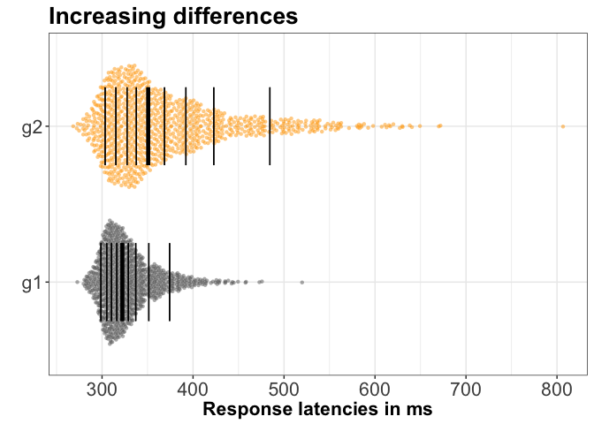
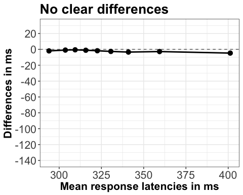

Illustration of continuous distributions using quantiles
================
Guillaume A. Rousselet
2018-09-04

-   [Dependencies](#dependencies)
-   [Create data](#create-data)
-   [Scatterplots](#scatterplots)
    -   [No clear differences](#no-clear-differences)
    -   [Increasing differences](#increasing-differences)
    -   [Complete shift](#complete-shift)
    -   [Early differences](#early-differences)
    -   [Summary figure](#summary-figure)
-   [KDE](#kde)
    -   [No clear differences](#no-clear-differences-1)
    -   [Increasing differences](#increasing-differences-1)
    -   [Complete shift](#complete-shift-1)
    -   [Early differences](#early-differences-1)
    -   [Summary figure](#summary-figure-1)
-   [Scatterplots + quantiles](#scatterplots-quantiles)
    -   [No clear differences](#no-clear-differences-2)
    -   [Increasing differences](#increasing-differences-2)
    -   [Complete shift](#complete-shift-2)
    -   [Early differences](#early-differences-2)
    -   [Summary figure](#summary-figure-2)
-   [Quantile plots](#quantile-plots)
    -   [No clear differences](#no-clear-differences-3)
    -   [Increasing differences](#increasing-differences-3)
    -   [Complete shift](#complete-shift-3)
    -   [Early differences](#early-differences-3)
    -   [Summary figure](#summary-figure-3)
-   [Vincentiles](#vincentiles)
    -   [Split data in equi-populated bins](#split-data-in-equi-populated-bins)
    -   [No clear differences](#no-clear-differences-4)
    -   [Increasing differences](#increasing-differences-4)
    -   [Complete shift](#complete-shift-4)
    -   [Early differences](#early-differences-4)
    -   [Summary figure](#summary-figure-4)
-   [Delta plots](#delta-plots)
    -   [No clear differences](#no-clear-differences-5)
    -   [Increasing differences](#increasing-differences-5)
    -   [Complete shift](#complete-shift-5)
    -   [Early differences](#early-differences-5)
    -   [Summary figure](#summary-figure-5)
-   [Shift functions](#shift-functions)
    -   [No clear differences](#no-clear-differences-6)
    -   [Increasing differences](#increasing-differences-6)
    -   [Complete shift](#complete-shift-6)
    -   [Early differences](#early-differences-6)
    -   [Summary figure](#summary-figure-6)
-   [References](#references)

Dependencies
============

``` r
rm(list=ls())
library("OneR")
library("rogme")
# library("Hmisc")
library("retimes")
library("ggbeeswarm")
library("cowplot")
```

``` r
sessionInfo()
```

    ## R version 3.4.4 (2018-03-15)
    ## Platform: x86_64-apple-darwin15.6.0 (64-bit)
    ## Running under: OS X El Capitan 10.11.6
    ## 
    ## Matrix products: default
    ## BLAS: /Library/Frameworks/R.framework/Versions/3.4/Resources/lib/libRblas.0.dylib
    ## LAPACK: /Library/Frameworks/R.framework/Versions/3.4/Resources/lib/libRlapack.dylib
    ## 
    ## locale:
    ## [1] en_GB.UTF-8/en_GB.UTF-8/en_GB.UTF-8/C/en_GB.UTF-8/en_GB.UTF-8
    ## 
    ## attached base packages:
    ## [1] stats     graphics  grDevices utils     datasets  methods   base     
    ## 
    ## other attached packages:
    ## [1] cowplot_0.9.2    ggbeeswarm_0.6.0 retimes_0.1-2    rogme_0.2.0     
    ## [5] ggplot2_3.0.0    OneR_2.2        
    ## 
    ## loaded via a namespace (and not attached):
    ##  [1] Rcpp_0.12.17     pillar_1.2.1     compiler_3.4.4   plyr_1.8.4      
    ##  [5] vipor_0.4.5      bindr_0.1.1      tools_3.4.4      digest_0.6.15   
    ##  [9] evaluate_0.10.1  tibble_1.4.2     gtable_0.2.0     pkgconfig_2.0.1 
    ## [13] rlang_0.2.1      yaml_2.1.16      beeswarm_0.2.3   bindrcpp_0.2.2  
    ## [17] withr_2.1.2      dplyr_0.7.6      stringr_1.2.0    knitr_1.20      
    ## [21] rprojroot_1.3-1  grid_3.4.4       tidyselect_0.2.4 glue_1.2.0      
    ## [25] R6_2.2.2         rmarkdown_1.9    purrr_0.2.5      magrittr_1.5    
    ## [29] backports_1.1.2  scales_0.5.0     htmltools_0.3.6  assertthat_0.2.0
    ## [33] colorspace_1.3-2 stringi_1.1.6    lazyeval_0.2.1   munsell_0.4.3

Create data
===========

We create data with four patterns of differences:

-   no clear differences;
-   uniform shift;
-   late differences;
-   early differences.

Same example we used in Rousselet et al. (2017).

``` r
nobs <- 1000 # number of observations per group

# ---------------------------------------------------
# Panel A:
# no clear differences
# ---------------------------------------------------

set.seed(3)
g1 <- rexgauss(nobs, mu=300, sigma=10, tau=30)
g2 <- rexgauss(nobs, mu=300, sigma=10, tau=30)

# make tibble
dfA <- mkt2(g1,g2)

# ---------------------------------------------------
# Panel B:
# Weak early differences, then increasing differences
# ---------------------------------------------------

nobs <- 1000 # number of observations per group

set.seed(3)
g1 <- rexgauss(nobs, mu=300, sigma=10, tau=30)
g2 <- rexgauss(nobs, mu=300, sigma=17, tau=70)

# make tibble
dfB <- mkt2(g1,g2)

# ------------------------------------------------
# Panel C:
# Complete shift
# ------------------------------------------------

set.seed(3)
g1<-rexgauss(nobs, mu=300, sigma=10, tau=50)
g2<-rexgauss(nobs, mu=300, sigma=10, tau=50) + 50

# make tibble
dfC <- mkt2(g1,g2)

# ------------------------------------------------
# Panel D:
# Early differences, then decreasing differences
# ------------------------------------------------

set.seed(1)
g1<-rexgauss(nobs, mu=400, sigma=20, tau=50)
g2<-rexgauss(nobs, mu=370, sigma=20, tau=70)

# make tibble
dfD <- mkt2(g1,g2)
```

Scatterplots
============

Now some `ggplot2` magic.

No clear differences
--------------------

``` r
p <- ggplot(dfA, aes(x = gr, y = obs, fill = gr, colour = gr, shape = gr)) + 
  geom_jitter(shape = 21, colour = "black", 
              size = 1.25, width = 0.3, alpha = 0.3) +
  scale_fill_manual(values=c("grey40", "orange1")) +
  theme_bw() + 
  theme(legend.position = "none") + 
  theme(axis.title.x = element_text(size = 16, face = "bold"), 
        axis.text.x = element_text(size = 16),
        axis.text.y = element_text(size = 16)) + 
  scale_y_continuous(breaks=seq(200,800,100)) +
  scale_x_discrete(labels = c("g1", "g2")) + #expand = c(0.02, 0.02)
  labs(title = "No clear differences", x = "", y = "Response latencies in ms") +
  theme(plot.title = element_text(face = "bold", size = 20)) + 
  coord_flip(ylim=c(250, 700))
psA <- p
psA
```


Increasing differences
----------------------

``` r
p <- ggplot(dfB, aes(x = gr, y = obs, fill = gr, colour = gr, shape = gr)) + 
  geom_jitter(shape = 21, colour = "black", 
              size = 1.25, width = 0.3, alpha = 0.3) +
  scale_fill_manual(values=c("grey40", "orange1")) +
  theme_bw() + 
  theme(legend.position = "none") + 
  theme(axis.title.x = element_text(size = 16, face = "bold"), 
        axis.text.x = element_text(size = 16),
        axis.text.y = element_text(size = 16)) + 
  scale_y_continuous(breaks=seq(200,800,100)) +
  scale_x_discrete(labels = c("g1", "g2")) + #expand = c(0.02, 0.02)
  labs(title = "Increasing differences", x = "", y = "Response latencies in ms") +
  theme(plot.title = element_text(face = "bold", size = 20)) + 
  coord_flip(ylim=c(250, 700))
psB <- p
psB
```


Complete shift
--------------

``` r
p <- ggplot(dfC, aes(x = gr, y = obs, fill = gr, colour = gr, shape = gr)) + 
  geom_jitter(shape = 21, colour = "black", 
              size = 1.25, width = 0.3, alpha = 0.3) +
  scale_fill_manual(values=c("grey40", "orange1")) +
  theme_bw() + 
  theme(legend.position = "none") + 
  theme(axis.title.x = element_text(size = 16, face = "bold"), 
        axis.text.x = element_text(size = 16),
        axis.text.y = element_text(size = 16)) + 
  scale_y_continuous(breaks=seq(200,800,100)) +
  coord_cartesian(ylim=c(250, 700)) +
  scale_x_discrete(labels = c("g1", "g2")) + #expand = c(0.02, 0.02)
  labs(title = "Complete shift", x = "", y = "Response latencies in ms") +
  theme(plot.title = element_text(face = "bold", size = 20)) + 
  coord_flip(ylim=c(250, 700))
```

    ## Coordinate system already present. Adding new coordinate system, which will replace the existing one.

``` r
psC <- p
psC
```


Early differences
-----------------

``` r
p <- ggplot(dfD, aes(x = gr, y = obs, fill = gr, colour = gr, shape = gr)) + 
  geom_jitter(shape = 21, colour = "black", 
              size = 1.25, width = 0.3, alpha = 0.3) +
  scale_fill_manual(values=c("grey40", "orange1")) +
  theme_bw() + 
  theme(legend.position = "none") + 
  theme(axis.title.x = element_text(size = 16, face = "bold"), 
        axis.text.x = element_text(size = 16),
        axis.text.y = element_text(size = 16)) + 
  scale_y_continuous(breaks=seq(200,800,100)) +
  scale_x_discrete(labels = c("g1", "g2")) + #expand = c(0.02, 0.02)
  labs(title = "Early differences", x = "", y = "Response latencies in ms") +
  theme(plot.title = element_text(face = "bold", size = 20)) + 
  coord_flip(ylim=c(250, 700))
psD <- p
psD
```


Summary figure
--------------

``` r
cowplot::plot_grid(psA, psB, psC, psD,
                   labels=c("", "", "", ""), 
                   ncol = 4, 
                   nrow = 1,
                   rel_heights = c(1, 1, 1, 1), 
                   label_size = 20, 
                   hjust = -0.8, 
                   scale=.95,
                   align = "v")
# save figure
ggsave(filename='./figures/figure_scatter.png',width=20,height=4) 
```

KDE
===

No clear differences
--------------------

``` r
p <- ggplot(dfA, aes(obs, group = gr, fill = gr)) + theme_bw() + 
  geom_density(colour = "black", size = 0.75, alpha = 0.5) +
  scale_fill_manual(values=c("grey40", "orange1")) +
  theme(axis.title = element_text(size = 16, face = "bold", colour = "black"), 
        axis.text = element_text(size = 16, colour = "black"),
        plot.title = element_text(face = "bold", size = 20),
        legend.position = "none") +
  coord_cartesian(xlim=c(250, 700)) +
  scale_x_continuous(breaks=seq(200,800,100)) +
  labs(title = "No clear differences", y = "Density", x = "Response latencies in ms")
pdA <- p
pdA
```


Increasing differences
----------------------

``` r
p <- ggplot(dfB, aes(obs, group = gr, fill = gr)) + theme_bw() + 
  geom_density(colour = "black", size = 0.75, alpha = 0.5) +
  scale_fill_manual(values=c("grey40", "orange1")) +
  theme(axis.title = element_text(size = 16, face = "bold", colour = "black"), 
        axis.text = element_text(size = 16, colour = "black"),
        plot.title = element_text(face = "bold", size = 20),
        legend.position = "none") +
    coord_cartesian(xlim=c(250, 700)) +
  scale_x_continuous(breaks=seq(200,800,100)) +
  labs(title = "Increasing differences", y = "Density", x = "Response latencies in ms")
pdB <- p
pdB
```


Complete shift
--------------

``` r
p <- ggplot(dfC, aes(obs, group = gr, fill = gr)) + theme_bw() + 
  geom_density(colour = "black", size = 0.75, alpha = 0.5) +
  scale_fill_manual(values=c("grey40", "orange1")) +
  theme(axis.title = element_text(size = 16, face = "bold", colour = "black"), 
        axis.text = element_text(size = 16, colour = "black"),
        plot.title = element_text(face = "bold", size = 20),
        legend.position = "none") +
    coord_cartesian(xlim=c(250, 700)) +
  scale_x_continuous(breaks=seq(200,800,100)) +
  labs(title = "Complete shift", y = "Density", x = "Response latencies in ms")
pdC <- p
pdC
```


Early differences
-----------------

``` r
p <- ggplot(dfD, aes(obs, group = gr, fill = gr)) + theme_bw() + 
  geom_density(colour = "black", size = 0.75, alpha = 0.5) +
  scale_fill_manual(values=c("grey40", "orange1")) +
  theme(axis.title = element_text(size = 16, face = "bold", colour = "black"), 
        axis.text = element_text(size = 16, colour = "black"),
        plot.title = element_text(face = "bold", size = 20),
        legend.position = "none") +
    coord_cartesian(xlim=c(250, 700)) +
  scale_x_continuous(breaks=seq(200,800,100)) +
  labs(title = "Early differences", y = "Density", x = "Response latencies in ms")
pdD <- p
pdD
```


Summary figure
--------------

``` r
cowplot::plot_grid(pdA, pdB, pdC, pdD,
                   labels=c("", "", "", ""), 
                   ncol = 4, 
                   nrow = 1,
                   rel_heights = c(1, 1, 1, 1), 
                   label_size = 20, 
                   hjust = -0.8, 
                   scale=.95,
                   align = "v")
# save figure
ggsave(filename='./figures/figure_kde.png',width=20,height=4) 
```

Scatterplots + quantiles
========================

Here we create scatterplots shaped by local density using the `geom_quasirandom` function from the `ggbeeswarm` package.

No clear differences
--------------------

``` r
# 1D scatterplots + superimposed deciles
p <- ggplot(dfA, aes(x = gr, y = obs, fill = gr, colour = gr, shape = gr)) + 
  ggbeeswarm::geom_quasirandom(shape = 16, size = 1.25, width = 0.4, alpha = 0.5) +
  scale_colour_manual(values=c("grey40", "orange1")) +
  theme_bw() + 
  theme(legend.position = "none") + 
  theme(axis.title.x = element_text(size = 16, face = "bold"), 
        axis.text.x = element_text(size = 16),
        axis.text.y = element_text(size = 16)) + 
  scale_y_continuous(breaks=seq(200,800,100)) +
  scale_x_discrete(labels = c("g1", "g2")) + #expand = c(0.02, 0.02)
  labs(title = "No clear differences", x = "", y = "Response latencies in ms") +
  theme(plot.title = element_text(face = "bold", size = 20)) + 
  coord_flip(ylim=c(250, 700))
p <- plot_hd_bars(p,
                  col = "black",
                  q_size = 0.5,
                  md_size = 1.5,
                  alpha = 1)
psqA <- p + coord_flip() # flip axes
```

    ## Coordinate system already present. Adding new coordinate system, which will replace the existing one.

``` r
psqA
```


Increasing differences
----------------------

``` r
# 1D scatterplots + superimposed deciles
p <- ggplot(dfB, aes(x = gr, y = obs, fill = gr, colour = gr, shape = gr)) + 
  ggbeeswarm::geom_quasirandom(shape = 16, size = 1.25, width = 0.4, alpha = 0.5) +
  scale_colour_manual(values=c("grey40", "orange1")) +
  theme_bw() + 
  theme(legend.position = "none") + 
  theme(axis.title.x = element_text(size = 16, face = "bold"), 
        axis.text.x = element_text(size = 16),
        axis.text.y = element_text(size = 16)) + 
  scale_y_continuous(breaks=seq(200,800,100)) +
  scale_x_discrete(labels = c("g1", "g2")) + #expand = c(0.02, 0.02)
  labs(title = "Increasing differences", x = "", y = "Response latencies in ms") +
  theme(plot.title = element_text(face = "bold", size = 20)) + 
  coord_flip(ylim=c(250, 700))
p <- plot_hd_bars(p,
                  col = "black",
                  q_size = 0.5,
                  md_size = 1.5,
                  alpha = 1)
psqB <- p + coord_flip() # flip axes
```

    ## Coordinate system already present. Adding new coordinate system, which will replace the existing one.

``` r
psqB
```



Complete shift
--------------

``` r
# 1D scatterplots + superimposed deciles
p <- ggplot(dfC, aes(x = gr, y = obs, fill = gr, colour = gr, shape = gr)) + 
  ggbeeswarm::geom_quasirandom(shape = 16, size = 1.25, width = 0.4, alpha = 0.5) +
  scale_colour_manual(values=c("grey40", "orange1")) +
  theme_bw() + 
  theme(legend.position = "none") + 
  theme(axis.title.x = element_text(size = 16, face = "bold"), 
        axis.text.x = element_text(size = 16),
        axis.text.y = element_text(size = 16)) + 
  scale_y_continuous(breaks=seq(200,800,100)) +
  scale_x_discrete(labels = c("g1", "g2")) + #expand = c(0.02, 0.02)
  labs(title = "Complete shift", x = "", y = "Response latencies in ms") +
  theme(plot.title = element_text(face = "bold", size = 20)) + 
  coord_flip(ylim=c(250, 700))
p <- plot_hd_bars(p,
                  col = "black",
                  q_size = 0.5,
                  md_size = 1.5,
                  alpha = 1)
psqC <- p + coord_flip() # flip axes
```

    ## Coordinate system already present. Adding new coordinate system, which will replace the existing one.

``` r
psqC
```


Early differences
-----------------

``` r
# 1D scatterplots + superimposed deciles
p <- ggplot(dfD, aes(x = gr, y = obs, fill = gr, colour = gr, shape = gr)) + 
  ggbeeswarm::geom_quasirandom(shape = 16, size = 1.25, width = 0.4, alpha = 0.5) +
  scale_colour_manual(values=c("grey40", "orange1")) +
  theme_bw() + 
  theme(legend.position = "none") + 
  theme(axis.title.x = element_text(size = 16, face = "bold"), 
        axis.text.x = element_text(size = 16),
        axis.text.y = element_text(size = 16)) + 
  scale_y_continuous(breaks=seq(200,800,100)) +
  scale_x_discrete(labels = c("g1", "g2")) + #expand = c(0.02, 0.02)
  labs(title = "Early differences", x = "", y = "Response latencies in ms") +
  theme(plot.title = element_text(face = "bold", size = 20)) + 
  coord_flip(ylim=c(250, 700))
p <- plot_hd_bars(p,
                  col = "black",
                  q_size = 0.5,
                  md_size = 1.5,
                  alpha = 1)
psqD <- p + coord_flip() # flip axes
```

    ## Coordinate system already present. Adding new coordinate system, which will replace the existing one.

``` r
psqD
```


Summary figure
--------------

``` r
cowplot::plot_grid(psqA, psqB, psqC, psqD,
                   labels=c("", "", "", ""), 
                   ncol = 4, 
                   nrow = 1,
                   rel_heights = c(1, 1, 1, 1), 
                   label_size = 20, 
                   hjust = -0.8, 
                   scale=.95,
                   align = "v")
# save figure
ggsave(filename='./figures/figure_scat_quant.png',width=20,height=5) 
```

Quantile plots
==============

Two ways to compute Harrell-Davis estimates of the quantiles, using Frank Harrell's `Hmisc` package, or the `rogme` package (Rousselet et al. 2017).

``` r
require("Hmisc")
```

    ## Loading required package: Hmisc

    ## Loading required package: lattice

    ## Loading required package: survival

    ## Loading required package: Formula

    ## 
    ## Attaching package: 'Hmisc'

    ## The following objects are masked from 'package:base':
    ## 
    ##     format.pval, units

``` r
x <- rnorm(100)
qseq <- seq(0.1,0.9,0.1)
Hmisc::hdquantile(x, probs = qseq)
```

    ##         0.1         0.2         0.3         0.4         0.5         0.6 
    ## -1.32840651 -0.96239344 -0.72252625 -0.52840499 -0.31498368  0.05909647 
    ##         0.7         0.8         0.9 
    ##  0.41724728  0.74691036  1.20915928

``` r
rogme::hdseq(x, qseq = qseq)
```

    ## [1] -1.32840651 -0.96239344 -0.72252625 -0.52840499 -0.31498368  0.05909647
    ## [7]  0.41724728  0.74691036  1.20915928

No clear differences
--------------------

``` r
out <- tapply(dfA$obs, list(dfA$gr), hdseq)

# panel 1: quantiles
dfq <- mkt2(out$Group1, out$Group2)
dfq$q <- factor(rep(qseq,2))

p1 <- ggplot(dfq, aes(x = q, y = obs, colour = gr, group = gr)) + 
  geom_line(size = 1) +
  geom_point(size = 3) +
  scale_colour_manual(values=c("grey40", "orange1")) +
  theme_bw() + 
  theme(legend.position = "none") + 
  theme(axis.title = element_text(size = 16, face = "bold"), 
        axis.text = element_text(size = 16),
        plot.title = element_text(face = "bold", size = 20)) +
  scale_y_continuous(breaks=seq(300,600,100)) +
    coord_cartesian(ylim = c(250, 600)) +
  labs(title = "No clear differences", x = "Quantiles", y = "Response latencies in ms")

# panel 2: quantile differences
dfq <- mkt1(out$Group1 - out$Group2)
dfq$q <- factor(qseq)

p2 <- ggplot(dfq, aes(x = q, y = obs, colour = gr, group = gr)) + 
  geom_abline(intercept = 0, slope = 0) +
  geom_line(size = 1, colour = "black") +
  geom_point(size = 3, colour = "black") +
  theme_bw() + 
  theme(legend.position = "none") + 
  theme(axis.title = element_text(size = 16, face = "bold"), 
        axis.text = element_text(size = 16),
        plot.title = element_text(face = "bold", size = 20)) +
  scale_y_continuous(breaks=seq(-140,40,20)) +
    coord_cartesian(ylim = c(-130, 30)) +
  labs(x = "Quantiles", y = "Group differences")

pqpA <- cowplot::plot_grid(p1, p2,
                   labels=c("", ""), 
                   ncol = 1, 
                   nrow = 2,
                   rel_heights = c(1, 1), 
                   label_size = 20, 
                   hjust = -0.8, 
                   scale=.95,
                   align = "v")
pqpA
```


Increasing differences
----------------------

``` r
out <- tapply(dfB$obs, list(dfB$gr), hdseq)

# panel 1: quantiles
dfq <- mkt2(out$Group1, out$Group2)
dfq$q <- factor(rep(qseq,2))

p1 <- ggplot(dfq, aes(x = q, y = obs, colour = gr, group = gr)) + 
  geom_line(size = 1) +
  geom_point(size = 3) +
  scale_colour_manual(values=c("grey40", "orange1")) +
  theme_bw() + 
  theme(legend.position = "none") + 
  theme(axis.title = element_text(size = 16, face = "bold"), 
        axis.text = element_text(size = 16),
        plot.title = element_text(face = "bold", size = 20)) +
  scale_y_continuous(breaks=seq(300,600,100)) +
    coord_cartesian(ylim = c(250, 600)) +
  labs(title = "Increasing differences", x = "Quantiles", y = "Response latencies in ms")

# panel 2: quantile differences
dfq <- mkt1(out$Group1 - out$Group2)
dfq$q <- factor(qseq)

p2 <- ggplot(dfq, aes(x = q, y = obs, colour = gr, group = gr)) + 
  geom_abline(intercept = 0, slope = 0) +
  geom_line(size = 1, colour = "black") +
  geom_point(size = 3, colour = "black") +
  theme_bw() + 
  theme(legend.position = "none") + 
  theme(axis.title = element_text(size = 16, face = "bold"), 
        axis.text = element_text(size = 16),
        plot.title = element_text(face = "bold", size = 20)) +
scale_y_continuous(breaks=seq(-140,40,20)) +
    coord_cartesian(ylim = c(-130, 30)) +
  labs(x = "Quantiles", y = "Group differences")

pqpB <- cowplot::plot_grid(p1, p2,
                   labels=c("", ""), 
                   ncol = 1, 
                   nrow = 2,
                   rel_heights = c(1, 1), 
                   label_size = 20, 
                   hjust = -0.8, 
                   scale=.95,
                   align = "v")
pqpB
```


Complete shift
--------------

``` r
out <- tapply(dfC$obs, list(dfC$gr), hdseq)

# panel 1: quantiles
dfq <- mkt2(out$Group1, out$Group2)
dfq$q <- factor(rep(qseq,2))

p1 <- ggplot(dfq, aes(x = q, y = obs, colour = gr, group = gr)) + 
  geom_line(size = 1) +
  geom_point(size = 3) +
  scale_colour_manual(values=c("grey40", "orange1")) +
  theme_bw() + 
  theme(legend.position = "none") + 
  theme(axis.title = element_text(size = 16, face = "bold"), 
        axis.text = element_text(size = 16),
        plot.title = element_text(face = "bold", size = 20)) +
  scale_y_continuous(breaks=seq(300,600,100)) +
    coord_cartesian(ylim = c(250, 600)) +
  labs(title = "Complete shift", x = "Quantiles", y = "Response latencies in ms")

# panel 2: quantile differences
dfq <- mkt1(out$Group1 - out$Group2)
dfq$q <- factor(qseq)

p2 <- ggplot(dfq, aes(x = q, y = obs, colour = gr, group = gr)) + 
  geom_abline(intercept = 0, slope = 0) +
  geom_line(size = 1, colour = "black") +
  geom_point(size = 3, colour = "black") +
  theme_bw() + 
  theme(legend.position = "none") + 
  theme(axis.title = element_text(size = 16, face = "bold"), 
        axis.text = element_text(size = 16),
        plot.title = element_text(face = "bold", size = 20)) +
scale_y_continuous(breaks=seq(-140,40,20)) +
    coord_cartesian(ylim = c(-130, 30)) +
  labs(x = "Quantiles", y = "Group differences")

pqpC <- cowplot::plot_grid(p1, p2,
                   labels=c("", ""), 
                   ncol = 1, 
                   nrow = 2,
                   rel_heights = c(1, 1), 
                   label_size = 20, 
                   hjust = -0.8, 
                   scale=.95,
                   align = "v")
pqpC
```


Early differences
-----------------

``` r
out <- tapply(dfD$obs, list(dfD$gr), hdseq)

# panel 1: quantiles
dfq <- mkt2(out$Group1, out$Group2)
dfq$q <- factor(rep(qseq,2))

p1 <- ggplot(dfq, aes(x = q, y = obs, colour = gr, group = gr)) + 
  geom_line(size = 1) +
  geom_point(size = 3) +
  scale_colour_manual(values=c("grey40", "orange1")) +
  theme_bw() + 
  theme(legend.position = "none") + 
  theme(axis.title = element_text(size = 16, face = "bold"), 
        axis.text = element_text(size = 16),
        plot.title = element_text(face = "bold", size = 20)) +
  scale_y_continuous(breaks=seq(300,600,100)) +
    coord_cartesian(ylim = c(250, 600)) +
  labs(title = "Early differences", x = "Quantiles", y = "Response latencies in ms")

# panel 2: quantile differences
dfq <- mkt1(out$Group1 - out$Group2)
dfq$q <- factor(qseq)

p2 <- ggplot(dfq, aes(x = q, y = obs, colour = gr, group = gr)) + 
  geom_abline(intercept = 0, slope = 0) +
  geom_line(size = 1, colour = "black") +
  geom_point(size = 3, colour = "black") +
  theme_bw() + 
  theme(legend.position = "none") + 
  theme(axis.title = element_text(size = 16, face = "bold"), 
        axis.text = element_text(size = 16),
        plot.title = element_text(face = "bold", size = 20)) +
scale_y_continuous(breaks=seq(-140,40,20)) +
    coord_cartesian(ylim = c(-130, 30)) +
  labs(x = "Quantiles", y = "Group differences")

pqpD <- cowplot::plot_grid(p1, p2,
                   labels=c("", ""), 
                   ncol = 1, 
                   nrow = 2,
                   rel_heights = c(1, 1), 
                   label_size = 20, 
                   hjust = -0.8, 
                   scale=.95,
                   align = "v")
pqpD
```


Summary figure
--------------

``` r
cowplot::plot_grid(pqpA, pqpB, pqpC, pqpD,
                   labels=c("", "", "", ""), 
                   ncol = 4, 
                   nrow = 1,
                   rel_heights = c(1, 1, 1, 1), 
                   label_size = 20, 
                   hjust = -0.8, 
                   scale=.95,
                   align = "v")
# save figure
ggsave(filename='./figures/figure_qplot.png',width=20,height=8) 
```

Vincentiles
===========

Vincentiles are computed by sorting the data and splitting them in equi-populated bins (there is the same number of observations in each bin). Then the mean is computed for each bin (Balota et al. 2008; Jiang et al. 2004).

Split data in equi-populated bins
---------------------------------

``` r
data <- rnorm(21)
out <- bin(data, nbins = 3, method = "content")
# table(out)
# split(data, out)
sapply(split(data, out), "mean")
```

No clear differences
--------------------

``` r
df <- dfA
out <- tapply(df$obs, list(df$gr), bin, nbins = 9, method = "content")
out1 <- sapply(split(df$obs[df$gr=="Group1"], out$Group1), "mean")
out2 <- sapply(split(df$obs[df$gr=="Group2"], out$Group2), "mean")

dfq <- mkt2(out1, out2)
dfq$q <- factor(rep(qseq*10,2))

p <- ggplot(dfq, aes(x = q, y = obs, colour = gr, group = gr)) + 
  geom_line(size = 1) +
  geom_point(size = 3) +
  scale_colour_manual(values=c("grey40", "orange1")) +
  theme_bw() + 
  theme(legend.position = "none") + 
  theme(axis.title = element_text(size = 16, face = "bold"), 
        axis.text = element_text(size = 16),
        plot.title = element_text(face = "bold", size = 20)) +
  scale_y_continuous(breaks=seq(300,600,100)) +
    coord_cartesian(ylim = c(250, 600)) +
  labs(title = "No clear differences", x = "Vincentiles", y = "Response latencies in ms")

p
```


``` r
pvA <- p
```

Increasing differences
----------------------

``` r
df <- dfB
out <- tapply(df$obs, list(df$gr), bin, nbins = 9, method = "content")
out1 <- sapply(split(df$obs[df$gr=="Group1"], out$Group1), "mean")
out2 <- sapply(split(df$obs[df$gr=="Group2"], out$Group2), "mean")

dfq <- mkt2(out1, out2)
dfq$q <- factor(rep(qseq*10,2))

p <- ggplot(dfq, aes(x = q, y = obs, colour = gr, group = gr)) + 
  geom_line(size = 1) +
  geom_point(size = 3) +
  scale_colour_manual(values=c("grey40", "orange1")) +
  theme_bw() + 
  theme(legend.position = "none") + 
  theme(axis.title = element_text(size = 16, face = "bold"), 
        axis.text = element_text(size = 16),
        plot.title = element_text(face = "bold", size = 20)) +
  scale_y_continuous(breaks=seq(300,600,100)) +
    coord_cartesian(ylim = c(250, 600)) +
  labs(title = "Increasing differences", x = "Vincentiles", y = "Response latencies in ms")

p
```


``` r
pvB <- p
```

Complete shift
--------------

``` r
df <- dfC
out <- tapply(df$obs, list(df$gr), bin, nbins = 9, method = "content")
out1 <- sapply(split(df$obs[df$gr=="Group1"], out$Group1), "mean")
out2 <- sapply(split(df$obs[df$gr=="Group2"], out$Group2), "mean")

dfq <- mkt2(out1, out2)
dfq$q <- factor(rep(qseq*10,2))

p <- ggplot(dfq, aes(x = q, y = obs, colour = gr, group = gr)) + 
  geom_line(size = 1) +
  geom_point(size = 3) +
  scale_colour_manual(values=c("grey40", "orange1")) +
  theme_bw() + 
  theme(legend.position = "none") + 
  theme(axis.title = element_text(size = 16, face = "bold"), 
        axis.text = element_text(size = 16),
        plot.title = element_text(face = "bold", size = 20)) +
  scale_y_continuous(breaks=seq(300,600,100)) +
    coord_cartesian(ylim = c(250, 600)) +
  labs(title = "Complete shift", x = "Vincentiles", y = "Response latencies in ms")

p
```


``` r
pvC <- p
```

Early differences
-----------------

``` r
df <- dfD
out <- tapply(df$obs, list(df$gr), bin, nbins = 9, method = "content")
out1 <- sapply(split(df$obs[df$gr=="Group1"], out$Group1), "mean")
out2 <- sapply(split(df$obs[df$gr=="Group2"], out$Group2), "mean")

dfq <- mkt2(out1, out2)
dfq$q <- factor(rep(qseq*10,2))

p <- ggplot(dfq, aes(x = q, y = obs, colour = gr, group = gr)) + 
  geom_line(size = 1) +
  geom_point(size = 3) +
  scale_colour_manual(values=c("grey40", "orange1")) +
  theme_bw() + 
  theme(legend.position = "none") + 
  theme(axis.title = element_text(size = 16, face = "bold"), 
        axis.text = element_text(size = 16),
        plot.title = element_text(face = "bold", size = 20)) +
  scale_y_continuous(breaks=seq(300,600,100)) +
    coord_cartesian(ylim = c(250, 600)) +
  labs(title = "Early differences", x = "Vincentiles", y = "Response latencies in ms")

p
```


``` r
pvD <- p
```

Summary figure
--------------

``` r
cowplot::plot_grid(pvA, pvB, pvC, pvD,
                   labels=c("", "", "", ""), 
                   ncol = 4, 
                   nrow = 1,
                   rel_heights = c(1, 1, 1, 1), 
                   label_size = 20, 
                   hjust = -0.8, 
                   scale=.95,
                   align = "v")
# save figure
ggsave(filename='./figures/figure_vinc.png',width=20,height=5) 
```

Group quantile and Vincentile plots can be created by averaging quantiles and Vincentiles across participants (Balota & Yap, 2011; Ratcliff, 1979). This will be the topic of another post.

Delta plots
===========

Delta plots show the difference between conditions, bin by bin (for each Vincentile) along the y-axis, as a function of the mean across conditions for each bin along the x-axis (De Jong et al., 1994).

No clear differences
--------------------

``` r
df <- dfA
out <- tapply(df$obs, list(df$gr), bin, nbins = 9, method = "content")
out1 <- sapply(split(df$obs[df$gr=="Group1"], out$Group1), "mean")
out2 <- sapply(split(df$obs[df$gr=="Group2"], out$Group2), "mean")
xmean <- rowMeans(cbind(out1,out2))

dfq <- mkt1(out1 - out2)
dfq$q <- xmean

p <- ggplot(dfq, aes(x = q, y = obs)) + 
  geom_abline(intercept = 0, slope = 0, "colour"="grey40", linetype="dashed") +
  geom_line(size = 1) +
  geom_point(size = 3) +
  # scale_colour_manual(values=c("grey40", "orange1")) +
  theme_bw() + 
  theme(legend.position = "none") + 
  theme(axis.title = element_text(size = 16, face = "bold"), 
        axis.text = element_text(size = 16),
        plot.title = element_text(face = "bold", size = 20)) +
scale_y_continuous(breaks=seq(-140,40,20)) +
    coord_cartesian(ylim = c(-140, 30)) +
  labs(title = "No clear differences", x = "Mean response latencies in ms", y = "Differences in ms")

p
```



``` r
pdpA <- p
```

Increasing differences
----------------------

``` r
df <- dfB
out <- tapply(df$obs, list(df$gr), bin, nbins = 9, method = "content")
out1 <- sapply(split(df$obs[df$gr=="Group1"], out$Group1), "mean")
out2 <- sapply(split(df$obs[df$gr=="Group2"], out$Group2), "mean")
xmean <- rowMeans(cbind(out1,out2))

dfq <- mkt1(out1 - out2)
dfq$q <- xmean

p <- ggplot(dfq, aes(x = q, y = obs)) + 
  geom_abline(intercept = 0, slope = 0, "colour"="grey40", linetype="dashed") +
  geom_line(size = 1) +
  geom_point(size = 3) +
  # scale_colour_manual(values=c("grey40", "orange1")) +
  theme_bw() + 
  theme(legend.position = "none") + 
  theme(axis.title = element_text(size = 16, face = "bold"), 
        axis.text = element_text(size = 16),
        plot.title = element_text(face = "bold", size = 20)) +
scale_y_continuous(breaks=seq(-140,40,20)) +
    coord_cartesian(ylim = c(-140, 30)) +
  labs(title = "Increasing differences", x = "Mean response latencies in ms", y = "Differences in ms")

p
```


``` r
pdpB <- p
```

Complete shift
--------------

``` r
df <- dfC
out <- tapply(df$obs, list(df$gr), bin, nbins = 9, method = "content")
out1 <- sapply(split(df$obs[df$gr=="Group1"], out$Group1), "mean")
out2 <- sapply(split(df$obs[df$gr=="Group2"], out$Group2), "mean")
xmean <- rowMeans(cbind(out1,out2))

dfq <- mkt1(out1 - out2)
dfq$q <- xmean

p <- ggplot(dfq, aes(x = q, y = obs)) + 
  geom_abline(intercept = 0, slope = 0, "colour"="grey40", linetype="dashed") +
  geom_line(size = 1) +
  geom_point(size = 3) +
  # scale_colour_manual(values=c("grey40", "orange1")) +
  theme_bw() + 
  theme(legend.position = "none") + 
  theme(axis.title = element_text(size = 16, face = "bold"), 
        axis.text = element_text(size = 16),
        plot.title = element_text(face = "bold", size = 20)) +
scale_y_continuous(breaks=seq(-140,40,20)) +
    coord_cartesian(ylim = c(-140, 30)) +
  labs(title = "Complete shift", x = "Mean response latencies in ms", y = "Differences in ms")

p
```


``` r
pdpC <- p
```

Early differences
-----------------

``` r
df <- dfD
out <- tapply(df$obs, list(df$gr), bin, nbins = 9, method = "content")
out1 <- sapply(split(df$obs[df$gr=="Group1"], out$Group1), "mean")
out2 <- sapply(split(df$obs[df$gr=="Group2"], out$Group2), "mean")
xmean <- rowMeans(cbind(out1,out2))

dfq <- mkt1(out1 - out2)
dfq$q <- xmean

p <- ggplot(dfq, aes(x = q, y = obs)) + 
  geom_abline(intercept = 0, slope = 0, "colour"="grey40", linetype="dashed") +
  geom_line(size = 1) +
  geom_point(size = 3) +
  # scale_colour_manual(values=c("grey40", "orange1")) +
  theme_bw() + 
  theme(legend.position = "none") + 
  theme(axis.title = element_text(size = 16, face = "bold"), 
        axis.text = element_text(size = 16),
        plot.title = element_text(face = "bold", size = 20)) +
scale_y_continuous(breaks=seq(-140,40,20)) +
    coord_cartesian(ylim = c(-140, 30)) +
  labs(title = "Early differences", x = "Mean response latencies in ms", y = "Differences in ms")

p
```


``` r
pdpD <- p
```

Negative delta plots (nDP) have received particular attention (Ellinghaus & Miller, 2018; Schwarz & Miller, 2012).

Summary figure
--------------

``` r
cowplot::plot_grid(pdpA, pdpB, pdpC, pdpD,
                   labels=c("", "", "", ""), 
                   ncol = 4, 
                   nrow = 1,
                   rel_heights = c(1, 1, 1, 1), 
                   label_size = 20, 
                   hjust = -0.8, 
                   scale=.95,
                   align = "v")
# save figure
ggsave(filename='./figures/figure_delta.png',width=20,height=5) 
```

Shift functions
===============

No clear differences
--------------------

``` r
Nb <- 200
set.seed(4)
sf <- shifthd_pbci(data = dfA, formula = obs ~ gr, q=seq(.1,.9,.1), nboot = Nb)

# plot shift function
psf_deciles <- plot_sf(sf, plot_theme = 2, symb_size = 3)[[1]] +
  scale_y_continuous(breaks = seq(-140, 40, 20)) +
  coord_cartesian(ylim = c(-130, 30)) +
  theme(axis.title = element_text(size = 16, face = "bold"), 
        axis.text = element_text(size = 16),
        plot.title = element_text(face = "bold", size = 20)) +
  labs(title = "No clear differences") 
```

    ## Warning: Using alpha for a discrete variable is not advised.

    ## Warning: Using alpha for a discrete variable is not advised.

    ## Scale for 'alpha' is already present. Adding another scale for 'alpha',
    ## which will replace the existing scale.

    ## Scale for 'y' is already present. Adding another scale for 'y', which
    ## will replace the existing scale.

``` r
psf_deciles
```


``` r
psfA <- psf_deciles
```

Increasing differences
----------------------

``` r
Nb <- 200
set.seed(4)
sf <- shifthd_pbci(data = dfB, formula = obs ~ gr, q=seq(.1,.9,.1), nboot = Nb)

# plot shift function
psf_deciles <- plot_sf(sf, plot_theme = 2, symb_size = 3)[[1]] +
  scale_y_continuous(breaks = seq(-140, 40, 20)) +
  coord_cartesian(ylim = c(-130, 30)) +
  theme(axis.title = element_text(size = 16, face = "bold"), 
        axis.text = element_text(size = 16),
        plot.title = element_text(face = "bold", size = 20)) +
  labs(title = "Increasing differences") 
```

    ## Warning: Using alpha for a discrete variable is not advised.

    ## Warning: Using alpha for a discrete variable is not advised.

    ## Scale for 'alpha' is already present. Adding another scale for 'alpha',
    ## which will replace the existing scale.

    ## Scale for 'y' is already present. Adding another scale for 'y', which
    ## will replace the existing scale.

``` r
psf_deciles
```


``` r
psfB <- psf_deciles
```

Complete shift
--------------

``` r
Nb <- 200
set.seed(4)
sf <- shifthd_pbci(data = dfC, formula = obs ~ gr, q=seq(.1,.9,.1), nboot = Nb)

# plot shift function
psf_deciles <- plot_sf(sf, plot_theme = 2, symb_size = 3)[[1]] +
  scale_y_continuous(breaks = seq(-140, 40, 20)) +
  coord_cartesian(ylim = c(-130, 30)) +
  theme(axis.title = element_text(size = 16, face = "bold"), 
        axis.text = element_text(size = 16),
        plot.title = element_text(face = "bold", size = 20)) +
  labs(title = "Complete shift") 
```

    ## Warning: Using alpha for a discrete variable is not advised.

    ## Warning: Using alpha for a discrete variable is not advised.

    ## Scale for 'alpha' is already present. Adding another scale for 'alpha',
    ## which will replace the existing scale.

    ## Scale for 'y' is already present. Adding another scale for 'y', which
    ## will replace the existing scale.

``` r
psf_deciles
```


``` r
psfC <- psf_deciles
```

Early differences
-----------------

``` r
Nb <- 200
set.seed(4)
sf <- shifthd_pbci(data = dfD, formula = obs ~ gr, q=seq(.1,.9,.1), nboot = Nb)

# plot shift function
psf_deciles <- plot_sf(sf, plot_theme = 2, symb_size = 3)[[1]] +
  scale_y_continuous(breaks = seq(-140, 40, 20)) +
  coord_cartesian(ylim = c(-130, 30)) +
  theme(axis.title = element_text(size = 16, face = "bold"), 
        axis.text = element_text(size = 16),
        plot.title = element_text(face = "bold", size = 20)) +
  labs(title = "Early differences") 
```

    ## Warning: Using alpha for a discrete variable is not advised.

    ## Warning: Using alpha for a discrete variable is not advised.

    ## Scale for 'alpha' is already present. Adding another scale for 'alpha',
    ## which will replace the existing scale.

    ## Scale for 'y' is already present. Adding another scale for 'y', which
    ## will replace the existing scale.

``` r
psf_deciles
```


``` r
psfD <- psf_deciles
```

Summary figure
--------------

``` r
cowplot::plot_grid(psfA, psfB, psfC, psfD,
                   labels=c("", "", "", ""), 
                   ncol = 4, 
                   nrow = 1,
                   rel_heights = c(1, 1, 1, 1), 
                   label_size = 20, 
                   hjust = -0.8, 
                   scale=.95,
                   align = "v")
# save figure
ggsave(filename='./figures/figure_shift.png',width=20,height=5) 
```

References
==========

Balota, D.A. & Yap, M.J. (2011) Moving Beyond the Mean in Studies of Mental Chronometry: The Power of Response Time Distributional Analyses. Curr Dir Psychol Sci, 20, 160-166.

Balota, D.A., Yap, M.J., Cortese, M.J. & Watson, J.M. (2008) Beyond mean response latency: Response time distributional analyses of semantic priming. J Mem Lang, 59, 495-523.

Clarke, E. & Sherrill-Mix, S. (2016) ggbeeswarm: Categorical Scatter (Violin Point) Plots.

De Jong, R., Liang, C.C. & Lauber, E. (1994) Conditional and Unconditional Automaticity - a Dual-Process Model of Effects of Spatial Stimulus - Response Correspondence. J Exp Psychol Human, 20, 731-750.

Ellinghaus, R. & Miller, J. (2018) Delta plots with negative-going slopes as a potential marker of decreasing response activation in masked semantic priming. Psychol Res, 82, 590-599.

Jiang, Y., Rouder, J.N. & Speckman, P.L. (2004) A note on the sampling properties of the Vincentizing (quantile averaging) procedure. J Math Psychol, 48, 186-195.

Ratcliff, R. (1979) Group Reaction-Time Distributions and an Analysis of Distribution Statistics. Psychol Bull, 86, 446-461.

Rousselet, G.A., Pernet, C.R. & Wilcox, R.R. (2017) Beyond differences in means: robust graphical methods to compare two groups in neuroscience. The European journal of neuroscience, 46, 1738-1748.

Schwarz, W. & Miller, J. (2012) Response time models of delta plots with negative-going slopes. Psychon B Rev, 19, 555-574.
