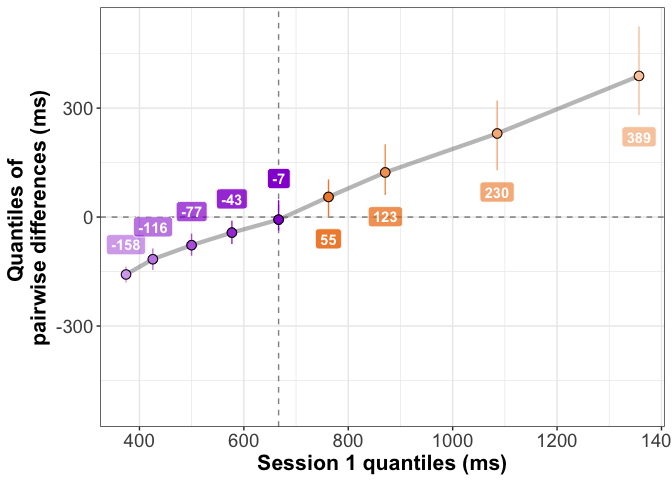

Test-retest reliability assessment using the shift function
================
Guillaume A. Rousselet
2018-04-30

-   [Dependencies](#dependencies)
-   [Regression to the mean](#regression-to-the-mean)
    -   [Generate data](#generate-data)
    -   [Kernel density estimates](#kernel-density-estimates)
    -   [Scatterplot](#scatterplot)
    -   [Scatterplot + regression line](#scatterplot-regression-line)
-   [Shift function for marginals](#shift-function-for-marginals)
-   [Shift function for pairwise differences](#shift-function-for-pairwise-differences)
-   [Example from the lab: ERP onsets](#example-from-the-lab-erp-onsets)
    -   [Get data](#get-data)
    -   [Kernel density estimates](#kernel-density-estimates-1)
    -   [Scatterplot 1](#scatterplot-1)
    -   [Scatterplot 1 + regression line](#scatterplot-1-regression-line)
    -   [Scatterplot 2](#scatterplot-2)
    -   [Scatterplot 2 + regression line](#scatterplot-2-regression-line)
    -   [Shift function for marginals](#shift-function-for-marginals-1)
    -   [Shift function for pairwise differences](#shift-function-for-pairwise-differences-1)
-   [Nambour skin cancer prevention trial](#nambour-skin-cancer-prevention-trial)
    -   [Load data](#load-data)
    -   [Illustrate results](#illustrate-results)
    -   [Scatterplot](#scatterplot-3)
    -   [Scatterplot2: merge groups](#scatterplot2-merge-groups)
    -   [Scatterplot3: session 2 / session 1](#scatterplot3-session-2-session-1)
    -   [Shift function for marginals](#shift-function-for-marginals-2)
    -   [Kernel density estimates](#kernel-density-estimates-2)
    -   [Shift function for pairwise differences](#shift-function-for-pairwise-differences-2)

Dependencies
============

``` r
library(tibble)
library(viridis)
```

    ## Loading required package: viridisLite

``` r
library(brms)
```

    ## Loading required package: Rcpp

    ## Loading required package: ggplot2

    ## Loading 'brms' package (version 2.1.0). Useful instructions
    ## can be found by typing help('brms'). A more detailed introduction
    ## to the package is available through vignette('brms_overview').
    ## Run theme_set(theme_default()) to use the default bayesplot theme.

``` r
library(dplyr)
```

    ## 
    ## Attaching package: 'dplyr'

    ## The following objects are masked from 'package:stats':
    ## 
    ##     filter, lag

    ## The following objects are masked from 'package:base':
    ## 
    ##     intersect, setdiff, setequal, union

``` r
# install.packages("devtools")
# devtools::install_github("GRousselet/rogme")
library(rogme)
```

Regression to the mean
======================

Generate data
-------------

``` r
set.seed(21)
n <- 100
gp1 <- sort(rexgaussian(n, mu = 380, sigma = 120, beta = 400))
# gp2 <- gp1 / 1.5 # constant change
gp2 <- c(gp1[1:45] * seq(1.5, 1, length.out = 45),
         gp1[46:55],
         gp1[56:100] / seq(1, 1.5, length.out = 45)) # larger changes at the extreme
gp2 <- gp2 + rnorm(n)*50 # add noise

df <- tibble(Session = factor(c(rep(1, length(gp1)),rep(2, length(gp2)))),
             RT = c(gp1, gp2))
summary(gp1)
```

    ##    Min. 1st Qu.  Median    Mean 3rd Qu.    Max. 
    ##   151.1   462.7   669.9   766.2   952.7  1995.5

``` r
summary(gp2)
```

    ##    Min. 1st Qu.  Median    Mean 3rd Qu.    Max. 
    ##   222.9   560.6   676.7   706.0   810.5  1343.6

``` r
round(quantile(gp1, probs = seq(.1,.9,.1)), digits = 1)
```

    ##    10%    20%    30%    40%    50%    60%    70%    80%    90% 
    ##  380.1  425.5  496.5  573.0  669.9  769.1  854.5 1075.1 1303.7

``` r
round(quantile(gp2, probs = seq(.1,.9,.1)), digits = 1)
```

    ##   10%   20%   30%   40%   50%   60%   70%   80%   90% 
    ## 512.4 553.2 584.9 614.1 676.7 711.4 761.9 868.7 944.6

Kernel density estimates
------------------------

``` r
p <- ggplot(df, aes(RT)) + theme_classic() +
  geom_density(aes(colour = Session), size = 2) +
  # geom_abline(intercept=0, slope=0, colour="black") +
  scale_color_viridis(discrete = TRUE) +
  coord_cartesian(xlim = c(0, 2500)) +
  # scale_x_continuous(breaks=nvec) + 
  # scale_y_continuous(limits=c(0,22), breaks=seq(0,22,5)) +
  theme(plot.title = element_text(size=22),
        axis.title.x = element_text(size = 18),
        axis.text.x = element_text(size = 14, colour="black"),
        axis.text.y = element_text(size = 16, colour="black"),
        axis.title.y = element_text(size = 18),
        legend.key.width = unit(1.5,"cm"),
        legend.position = c(0.5,0.85),
        legend.direction = "vertical",
        legend.text=element_text(size=16),
        legend.title=element_text(size=18),
        panel.background = element_rect(fill = 'grey', colour = 'black')) +
  labs(x = "Reaction times in ms", y = "Density") +
  # guides(colour = guide_legend(override.aes = list(size=3))) + # make thicker legend lines
  ggtitle("Test-retest") 
p
```


``` r
# save figure
ggsave(filename='figure_kde.png',width=7,height=5) 
```

Scatterplot
-----------

``` r
df <- tibble(Session1 = gp1,
             Session2 = gp2,
             Participant = factor(seq(1,n)))

p <- ggplot(df, aes(x=Session1, y=Session2)) + 
  geom_abline(intercept = 0) +
  geom_point(size = 3, stroke = 1, aes(colour = Participant)) +
  scale_color_viridis(discrete = TRUE) +
  theme_bw() +
  theme(plot.title = element_text(size=22),
        axis.title.x = element_text(size = 18),
        axis.text.x = element_text(size = 14, colour="black"),
        axis.text.y = element_text(size = 16, colour="black"),
        axis.title.y = element_text(size = 18),
        legend.position = "none") +
  labs(title="Paired observations") +
  coord_fixed(xlim = c(0, 2000), ylim = c(0, 2000))
p
```


``` r
# save figure
ggsave(filename='figure_scatter.png',width=7,height=5) #path=pathname
```

Scatterplot + regression line
-----------------------------

``` r
p + geom_smooth(method='lm')
```


``` r
# save figure
ggsave(filename='figure_scatter_regline.png',width=7,height=5) #path=pathname
```

Shift function for marginals
============================

``` r
df <- rogme::mkt2(gp1, gp2)
# compute shift function
sf <- rogme::shiftdhd_pbci(data = df, formula = obs ~ gr, nboot = 200)[,3:7]

# plot shift function
psf <- plot_sf(sf, plot_theme = 2, symb_size = 3)
```

    ## Scale for 'alpha' is already present. Adding another scale for 'alpha',
    ## which will replace the existing scale.

``` r
# change axis labels
psf <- psf +
  labs(x = "Session 1 quantiles (ms)",
       y = "Session 1 - Session 2 \nquantile differences (ms)")

# add labels for deciles 1 & 9
psf <- add_sf_lab(psf, round(sf), y_lab_nudge = 60)
psf
```


``` r
# save figure
ggsave(filename='figure_sf_dhd.png',width=7,height=5) #path=pathname
```

Shift function for pairwise differences
=======================================

Define shift function

``` r
shiftpdhd_pbci <- function(x = x, y = y, q = seq(0.1, 0.9, 0.1), nboot = 1000, alpha = 0.05){
    diff <- x - y # pairwise differences
    output <- matrix(0, nrow = length(q), ncol = 9) # define output matrix
    low <- round((alpha/2) * nboot) + 1 # low CI bound
    up <- nboot - low # high CI bound
    n <- length(x) # sample size
    for (i in 1:length(q)) { # quantile loop
        output[i, 1] = q[i] 
        output[i, 2] = n
        output[i, 3] = hd(x, q = q[i]) # condition 1 quantile
        output[i, 4] = hd(y, q = q[i]) # condition 2 quantile
        output[i, 5] = hd(diff, q = q[i]) # difference quantile
        bootsample <- matrix(sample(n, size = n * nboot, replace = TRUE), 
            nrow = nboot) # bootstrap samples
        diffmat <- matrix(diff[bootsample], nrow = nboot, ncol = n) # matrix of bootstrap differences
        bvec <- apply(diffmat, 1, hd, q = q[i]) # quantiles of bootstrap differences
        bvec <- sort(bvec) # sort in ascending order
        temp <- sum(bvec < 0)/nboot + sum(bvec == 0)/(2 * nboot) # p value
        output[i, 6] = bvec[low] # low CI bound
        output[i, 7] = bvec[up] # high CI bound
        output[i, 9] = 2 * (min(temp, 1 - temp)) # generalised p value
    }
    temp = order(output[, 9], decreasing = TRUE)
    zvec = alpha/c(1:length(q))
    output[temp, 8] = zvec
    out <- data.frame(output)
    names(out) <- c("q", "n", "c1", "c2", "difference", 
        "ci_lower", "ci_upper", "p_crit", "p_value")
    dplyr::mutate(out, sig = p_value <= p_crit)
    out
}
```

Plot shift function

``` r
# compute shift function
sf2 <- shiftpdhd_pbci(x = gp1, y = gp2, nboot = 200)[,3:7]

# plot shift function
psf <- plot_sf(sf2, plot_theme = 2, symb_size = 3)
```

    ## Scale for 'alpha' is already present. Adding another scale for 'alpha',
    ## which will replace the existing scale.

``` r
# change axis labels
psf <- psf +
  labs(x = "Session 1 quantiles (ms)",
       y = "Quantiles of \npairwise differences (ms)")

# add labels for deciles 1 & 9
psf <- add_sf_lab(psf, round(sf2), y_lab_nudge = 60)
psf
```



``` r
# save figure
ggsave(filename='figure_sf_pdhd.png',width=7,height=5) #path=pathname
```

Example from the lab: ERP onsets
================================

Get data
--------

``` r
# ses1 contains ERP onsets from 120 participants
# we only use participants tested twice
x <- read.table("./data/onset.txt") 
twoses <- scan("./data/onset_twoses.txt")
gp1 <- x[twoses==1,3]
# ses2 contains onsets from 74 participants who also provided ses1 onsets
x <- read.table("./data/onset2.txt")
gp2 <- x[,3]

df <- tibble(Session = factor(c(rep(1, length(gp1)),rep(2, length(gp2)))),
             RT = c(gp1, gp2))
summary(gp1)
```

    ##    Min. 1st Qu.  Median    Mean 3rd Qu.    Max. 
    ##   56.00   76.00   83.00   91.38  105.50  196.00

``` r
summary(gp2)
```

    ##    Min. 1st Qu.  Median    Mean 3rd Qu.    Max. 
    ##      36      74      86      88     100     136

``` r
round(quantile(gp1, probs = seq(.1,.9,.1)), digits = 1)
```

    ##   10%   20%   30%   40%   50%   60%   70%   80%   90% 
    ##  67.2  74.0  78.0  80.0  83.0  92.0 102.2 108.0 118.8

``` r
round(quantile(gp2, probs = seq(.1,.9,.1)), digits = 1)
```

    ##   10%   20%   30%   40%   50%   60%   70%   80%   90% 
    ##  68.0  72.0  76.0  80.0  86.0  91.6  98.2 108.0 113.4

``` r
round(quantile(gp1-gp2, probs = seq(.1,.9,.1)), digits = 1)
```

    ##   10%   20%   30%   40%   50%   60%   70%   80%   90% 
    ## -15.4  -6.8  -4.0  -2.0   2.0   4.0   8.0  12.8  24.0

Kernel density estimates
------------------------

``` r
p <- ggplot(df, aes(RT)) + theme_classic() +
  geom_density(aes(colour = Session), size = 2) +
  # geom_abline(intercept=0, slope=0, colour="black") +
  scale_color_viridis(discrete = TRUE) +
  coord_cartesian(xlim = c(0, 200)) +
  # scale_x_continuous(breaks=nvec) + 
  # scale_y_continuous(limits=c(0,22), breaks=seq(0,22,5)) +
  theme(plot.title = element_text(size=22),
        axis.title.x = element_text(size = 18),
        axis.text.x = element_text(size = 14, colour="black"),
        axis.text.y = element_text(size = 16, colour="black"),
        axis.title.y = element_text(size = 18),
        legend.key.width = unit(1.5,"cm"),
        legend.position = c(0.75,0.85),
        legend.direction = "vertical",
        legend.text=element_text(size=16),
        legend.title=element_text(size=18),
        panel.background = element_rect(fill = 'grey', colour = 'black')) +
  labs(x = "ERP onsets in ms", y = "Density") +
  # guides(colour = guide_legend(override.aes = list(size=3))) + # make thicker legend lines
  ggtitle("ERP onsets test-retest") 
p
```


``` r
# save figure
ggsave(filename='figure_ERP_kde.png',width=7,height=5) 
```

Scatterplot 1
-------------

``` r
df <- tibble(Session1 = gp1,
             Session2 = gp2,
             Participant = factor(seq(1,length(gp1))))

p <- ggplot(df, aes(x=Session1, y=Session2)) + 
  geom_abline(intercept = 0) +
  geom_point(size = 3, stroke = 1, aes(colour = Participant)) +
  scale_color_viridis(discrete = TRUE) +
  theme_bw() +
  theme(plot.title = element_text(size=22),
        axis.title.x = element_text(size = 18),
        axis.text.x = element_text(size = 14, colour="black"),
        axis.text.y = element_text(size = 16, colour="black"),
        axis.title.y = element_text(size = 18),
        legend.position = "none") +
  labs(title="Paired ERP onsets") +
  coord_fixed(xlim = c(0, 200), ylim = c(0, 200))
p
```


``` r
# save figure
ggsave(filename='figure_ERP_scatter1.png',width=7,height=5) #path=pathname
```

Scatterplot 1 + regression line
-------------------------------

``` r
df <- tibble(Session1 = gp1,
             Session2 = gp2,
             Participant = factor(seq(1,length(gp1))))

p <- ggplot(df, aes(x=Session1, y=Session2)) + 
  geom_abline(intercept = 0) +
  geom_point(size = 3, stroke = 1, aes(colour = Participant)) +
  scale_color_viridis(discrete = TRUE) +
  theme_bw() +
  theme(plot.title = element_text(size=22),
        axis.title.x = element_text(size = 18),
        axis.text.x = element_text(size = 14, colour="black"),
        axis.text.y = element_text(size = 16, colour="black"),
        axis.title.y = element_text(size = 18),
        legend.position = "none") +
  labs(title="Paired ERP onsets") +
  coord_fixed(xlim = c(40, 200), ylim = c(40, 200)) +
  geom_smooth(method = "loess")
p
```


``` r
# save figure
ggsave(filename='figure_ERP_scatter1_regline.png',width=7,height=5) #path=pathname
```

Scatterplot 2
-------------

``` r
df <- tibble(Session1 = gp1,
             Session2 = gp2,
             Difference = gp1 - gp2,
             Participant = factor(seq(1,length(gp1))))

p <- ggplot(df, aes(x=Session1, y=Difference)) + 
  geom_abline(intercept = 0, slope = 0) +
  geom_point(size = 3, stroke = 1, aes(colour = Participant)) +
  scale_color_viridis(discrete = TRUE) +
  theme_bw() +
  theme(plot.title = element_text(size=22),
        axis.title.x = element_text(size = 18),
        axis.text.x = element_text(size = 14, colour="black"),
        axis.text.y = element_text(size = 16, colour="black"),
        axis.title.y = element_text(size = 18),
        legend.position = "none") +
  labs(title="Paired ERP onsets", 
       x = "Session 1",
       y = "Difference = \nSession 1 - session 2") +
  coord_cartesian(xlim = c(40, 200), ylim = c(-100, 100))
p
```


``` r
# save figure
ggsave(filename='figure_ERP_scatter2.png',width=7,height=5) #path=pathname
```

Scatterplot 2 + regression line
-------------------------------

``` r
df <- tibble(Session1 = gp1,
             Session2 = gp2,
             Difference = gp1 - gp2,
             Participant = factor(seq(1,length(gp1))))

p <- ggplot(df, aes(x=Session1, y=Difference)) + 
  geom_abline(intercept = 0, slope = 0) +
  geom_point(size = 3, stroke = 1, aes(colour = Participant)) +
  scale_color_viridis(discrete = TRUE) +
  theme_bw() +
  theme(plot.title = element_text(size=22),
        axis.title.x = element_text(size = 18),
        axis.text.x = element_text(size = 14, colour="black"),
        axis.text.y = element_text(size = 16, colour="black"),
        axis.title.y = element_text(size = 18),
        legend.position = "none") +
  labs(title="Paired ERP onsets", 
       x = "Session 1",
       y = "Difference = \nSession 1 - session 2") +
  coord_cartesian(xlim = c(40, 200), ylim = c(-100, 100)) +
  geom_smooth(method='loess')
p
```


``` r
# save figure
ggsave(filename='figure_ERP_scatter2_regline.png',width=7,height=5) #path=pathname
```

Shift function for marginals
----------------------------

``` r
df <- rogme::mkt2(gp1, gp2)
# compute shift function
sf <- rogme::shiftdhd_pbci(data = df, formula = obs ~ gr, nboot = 1000)[,3:7]

# plot shift function
psf <- plot_sf(sf, plot_theme = 2, symb_size = 3)
```

    ## Scale for 'alpha' is already present. Adding another scale for 'alpha',
    ## which will replace the existing scale.

``` r
# change axis labels
psf <- psf +
  labs(x = "Session 1 onset quantiles (ms)",
       y = "Session 1 - Session 2 onset \nquantile differences (ms)") +
      scale_x_continuous(breaks=c(seq(70,120,10)))

# add labels for deciles 1 & 9
psf <- add_sf_lab(psf, round(sf, digits = 1), y_lab_nudge = 1)
psf
```


``` r
# save figure
ggsave(filename='figure_ERP_sf_dhd.png',width=7,height=5) #path=pathname
```

Shift function for pairwise differences
---------------------------------------

``` r
# compute shift function
sf2 <- shiftpdhd_pbci(x = gp1, y = gp2, nboot = 1000)[,3:7]

# plot shift function
psf <- plot_sf(sf2, plot_theme = 2, symb_size = 3)
```

    ## Scale for 'alpha' is already present. Adding another scale for 'alpha',
    ## which will replace the existing scale.

``` r
# change axis labels
psf <- psf +
  labs(x = "Session 1 quantiles (ms)",
       y = "Quantiles of \npairwise differences (ms)") +
    scale_x_continuous(breaks=c(seq(70,120,10)))

# add labels for deciles 1 & 9
psf <- add_sf_lab(psf, round(sf2), y_lab_nudge = 4)
psf
```


``` r
# save figure
ggsave(filename='figure_ERP_sf_pdhd.png',width=7,height=5) #path=pathname
```

Nambour skin cancer prevention trial
====================================

Load data
---------

Data from <http://hisdu.sph.uq.edu.au/lsu/adrian/rtmcode.htm>

``` r
nambour <- scan("./data/nambour.txt")
nambour <- matrix(nambour, nrow = length(nambour)/3, ncol = 3, byrow = TRUE)
# column 1: betacarotene measurement at baseline
# column 2: betacarotene measurement at follow-up
# column 3: group membership - placebo = 0, treatment = 1
# log transformation of betacarotene measurements
nambour[,1] <- log(nambour[,1])
nambour[,2] <- log(nambour[,2])
```

Illustrate results
------------------

Original figure from <https://academic.oup.com/ije/article/34/1/215/638499>

 "Scatter-plot of n = 96 paired and log-transformed betacarotene measurements showing change (log(follow-up) minus log(baseline)) against log(baseline) from the Nambour Skin Cancer Prevention Trial. The solid line represents perfect agreement (no change) and the dotted lines are fitted regression lines for the treatment and placebo groups"

Scatterplot
-----------

``` r
df <- tibble(Session1 = nambour[,1],
             Session2 = nambour[,2],
             Difference = nambour[,2] - nambour[,1],
             Group = factor(nambour[,3]))

p <- ggplot(df, aes(x=Session1, y=Difference, colour = Group)) + 
  geom_abline(intercept = 0, slope = 0) +
  geom_point(size = 3, stroke = 1) +
  # scale_color_viridis(discrete = TRUE) +
  theme_bw() +
  theme(plot.title = element_text(size=22),
        axis.title.x = element_text(size = 18),
        axis.text.x = element_text(size = 14, colour="black"),
        axis.text.y = element_text(size = 16, colour="black"),
        axis.title.y = element_text(size = 18),
        legend.position = "none") +
  labs(title="Nambour skin cancer prevention trial", 
       x = "Session 1",
       y = "Difference = \nSession 1 - session 2") +
  coord_cartesian(xlim = c(-4, 1), ylim = c(-4, 4)) +
  geom_smooth(method='loess')
p
```


``` r
# save figure
ggsave(filename='figure_nambour_scatter.png',width=7,height=5) #path=pathname
```

The original figure cannot be reproduced because the group membership has been mixed up in the shared dataset: "\* Note!: treatment codes are scrambled from those in paper and will not give the same results;"

So let's merge the two groups and plot the data following our shift function convention, in which the difference is session 1 - session 2.

Scatterplot2: merge groups
--------------------------

``` r
df <- tibble(Session1 = nambour[,1],
             Session2 = nambour[,2],
             Difference = nambour[,1] - nambour[,2],
             Group = factor(nambour[,3]))

p <- ggplot(df, aes(x=Session1, y=Difference)) + 
  geom_abline(intercept = 0, slope = 0) +
  geom_point(size = 3, stroke = 1) +
  # scale_color_viridis(discrete = TRUE) +
  theme_bw() +
  theme(plot.title = element_text(size=22),
        axis.title.x = element_text(size = 18),
        axis.text.x = element_text(size = 14, colour="black"),
        axis.text.y = element_text(size = 16, colour="black"),
        axis.title.y = element_text(size = 18),
        legend.position = "none") +
  labs(title="Nambour skin cancer prevention trial", 
       x = "Session 1",
       y = "Difference = \nSession 1 - session 2") +
  coord_cartesian(xlim = c(-4, 1), ylim = c(-4, 4)) +
  geom_smooth(method='loess')
p
```


``` r
# save figure
ggsave(filename='figure_nambour_scatter2.png',width=7,height=5) #path=pathname
```

Regression to the mean is suggested by the large number of negative differences and the negative slope of the loess regression: participants with low results in session 1 tended to have higher results in session 2. This pattern can also be revealed by plotting session 2 as a function of session 1.

Scatterplot3: session 2 / session 1
-----------------------------------

``` r
df <- tibble(Session1 = nambour[,1],
             Session2 = nambour[,2],
             Difference = nambour[,1] - nambour[,2],
             Group = factor(nambour[,3]))

p <- ggplot(df, aes(x=Session1, y=Session2)) + 
  geom_abline(intercept = 0, slope = 1) +
  geom_point(size = 3, stroke = 1) +
  # scale_color_viridis(discrete = TRUE) +
  theme_bw() +
  theme(plot.title = element_text(size=22),
        axis.title.x = element_text(size = 18),
        axis.text.x = element_text(size = 14, colour="black"),
        axis.text.y = element_text(size = 16, colour="black"),
        axis.title.y = element_text(size = 18),
        legend.position = "none") +
  labs(title="Nambour skin cancer prevention trial", 
       x = "Session 1",
       y = "Session 2") +
  coord_cartesian(xlim = c(-4, 3), ylim = c(-4, 3)) +
  geom_smooth(method='loess')
p
```


``` r
# save figure
ggsave(filename='figure_nambour_scatter3.png',width=7,height=5) #path=pathname
```

Shift function for marginals
----------------------------

``` r
df <- rogme::mkt2(nambour[,1], nambour[,2])
# compute shift function
sf <- rogme::shiftdhd_pbci(data = df, formula = obs ~ gr, nboot = 1000)[,3:7]

# plot shift function
psf <- plot_sf(sf, plot_theme = 2, symb_size = 3)
```

    ## Scale for 'alpha' is already present. Adding another scale for 'alpha',
    ## which will replace the existing scale.

``` r
# change axis labels
psf <- psf +
  labs(x = "Session 1 betacarotene quantiles (log units)",
       y = "Session 1 - Session 2 betacarotene \nquantile differences (log units)")

# add labels for deciles 1 & 9
psf <- add_sf_lab(psf, round(sf, digits = 1), y_lab_nudge = 0.15)
psf
```


``` r
# save figure
ggsave(filename='figure_nambour_sf_dhd.png',width=7,height=5) #path=pathname
```

Let's check the surprising results using the quantile function. The quantile estimates differ because the shift function uses the Harrell-Davis estimator, but the values are similar and the pattern matches the results from the shift function on marginals and the shift function on pairwise differences.

``` r
q1 <- quantile(nambour[,1], probs = seq(.1,.9,.1))
q2 <- quantile(nambour[,2], probs = seq(.1,.9,.1))
round(q1, digits = 1)
```

    ##  10%  20%  30%  40%  50%  60%  70%  80%  90% 
    ## -1.8 -1.5 -1.1 -0.8 -0.7 -0.5 -0.2  0.0  0.2

``` r
round(q1-q2, digits = 1)
```

    ##  10%  20%  30%  40%  50%  60%  70%  80%  90% 
    ##  0.0 -0.3 -0.2 -0.1 -0.3 -0.4 -0.6 -0.7 -1.0

``` r
round(quantile(nambour[,1]-nambour[,2], probs = seq(.1,.9,.1)), digits = 1)
```

    ##  10%  20%  30%  40%  50%  60%  70%  80%  90% 
    ## -2.0 -1.4 -1.0 -0.6 -0.2  0.0  0.2  0.3  0.6

Kernel density estimates
------------------------

``` r
df <- tibble(Session = factor(c(rep(1, length(nambour[,1])),rep(2, length(nambour[,2])))),
             RT = c(nambour[,1], nambour[,2]))

p <- ggplot(df, aes(RT)) + theme_classic() +
  geom_density(aes(colour = Session), size = 2) +
  # geom_abline(intercept=0, slope=0, colour="black") +
  scale_color_viridis(discrete = TRUE) +
  # coord_cartesian(xlim = c(0, 200)) +
  # scale_x_continuous(breaks=nvec) + 
  scale_x_continuous(limits=c(-4,3), breaks=seq(-4,3,1)) +
  theme(plot.title = element_text(size=22),
        axis.title.x = element_text(size = 18),
        axis.text.x = element_text(size = 14, colour="black"),
        axis.text.y = element_text(size = 16, colour="black"),
        axis.title.y = element_text(size = 18),
        legend.key.width = unit(1.5,"cm"),
        legend.position = c(0.75,0.85),
        legend.direction = "vertical",
        legend.text=element_text(size=16),
        legend.title=element_text(size=18),
        panel.background = element_rect(fill = 'grey', colour = 'black')) +
  labs(x = "Betacarotene (log units)", y = "Density") +
  # guides(colour = guide_legend(override.aes = list(size=3))) + # make thicker legend lines
  ggtitle("Nambour skin cancer prevention trial") 
p
```


``` r
# save figure
ggsave(filename='figure_nambour_kde.png',width=7,height=5) 
```

Shift function for pairwise differences
---------------------------------------

``` r
# compute shift function
sf2 <- shiftpdhd_pbci(x = nambour[,1], y = nambour[,2], nboot = 1000)[,3:7]

# plot shift function
psf <- plot_sf(sf2, plot_theme = 2, symb_size = 3)
```

    ## Scale for 'alpha' is already present. Adding another scale for 'alpha',
    ## which will replace the existing scale.

``` r
# change axis labels
psf <- psf +
  labs(x = "Session 1 betacarotene (log units)",
       y = "Quantiles of \npairwise differences (log units)")

# add labels for deciles 1 & 9
psf <- add_sf_lab(psf, round(sf2, digits = 2), y_lab_nudge = 0.15)
psf
```


``` r
# save figure
ggsave(filename='figure_nambour_sf_pdhd.png',width=7,height=5) #path=pathname
```
