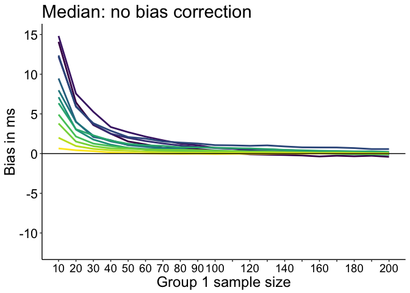
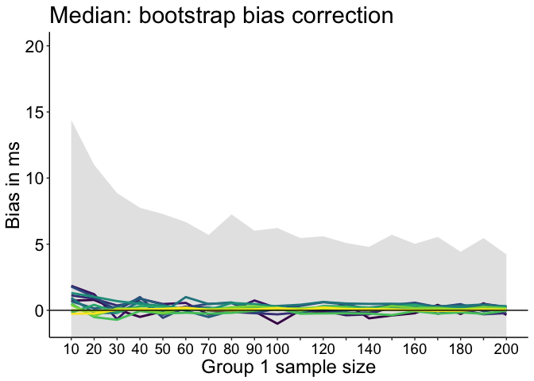

Median bias: comparison of 2 independent groups
================
Guillaume A. Rousselet
February 5, 2018

-   [Define ex-Gaussian parameters](#define-ex-gaussian-parameters)
-   [Estimate population parameters from large samples](#estimate-population-parameters-from-large-samples)
-   [Same size, same skewness](#same-size-same-skewness)
-   [Different sizes, same skewness](#different-sizes-same-skewness)
-   [Full simulation](#full-simulation)
    -   [Mean bias simulation](#mean-bias-simulation)
-   [Mean results](#mean-results)
-   [Median results: no bias correction](#median-results-no-bias-correction)
-   [Median results: subsample bias correction](#median-results-subsample-bias-correction)
-   [Median results: bootstrap bias correction](#median-results-bootstrap-bias-correction)

The sample median is biased when sampling from skewed distributions. The bias increases with decreasing sample size. According to Miller (1988), because of this bias, group comparison can be affected if the two groups differ in skewness or sample size, or both. As a result, real differences can be lowered or increased, and non-existent differences suggested. In Miller's own words:

"An important practical consequence of the bias in median reaction time is that sample medians must not be used to compare reaction times across experimental conditions when there are unequal numbers of trials in the conditions."

Here we assess this problem using a simulation in which we draw samples of same or different sizes from populations with the same skewness or different skewnesses. Contrary to Miller's conclusion, we find that the main contributor to difference bias is a skewness difference between experimental conditions. If the skewness is the same between conditions, there is no bias, even with large differences in sample size.

``` r
# dependencies
library(ggplot2)
library(tibble)
library(tidyr)
library(cowplot)
library(retimes)
library(viridis)
source("./functions/Rallfun-v34.txt")
source("./functions/HDIofMCMC.txt")
```

Define ex-Gaussian parameters
=============================

Save matrix with 3 parameters:
- mean of the normal distribution
- standard deviation of the normal distribution
- mean of the exponential distribution

``` r
miller.param <- matrix(0, ncol=3, nrow=12)
miller.param[1,] <- c(300, 20, 300)
miller.param[2,] <- c(300, 50, 300)
miller.param[3,] <- c(350, 20, 250)
miller.param[4,] <- c(350, 50, 250)
miller.param[5,] <- c(400, 20, 200)
miller.param[6,] <- c(400, 50, 200)
miller.param[7,] <- c(450, 20, 150)
miller.param[8,] <- c(450, 50, 150)
miller.param[9,] <- c(500, 20, 100)
miller.param[10,] <- c(500, 50, 100)
miller.param[11,] <- c(550, 20, 50)
miller.param[12,] <- c(550, 50, 50)
```

Estimate population parameters from large samples
=================================================

``` r
set.seed(4)
pop.m <- vector(mode="numeric", length=12)
pop.md <- vector(mode="numeric", length=12)
n <- 1000000
nP <- length(miller.param[,1])
for(P in 1:nP){
  mu <- miller.param[P,1]
  sigma <- miller.param[P,2]
  tau <- miller.param[P,3]
  pop <- rexgauss(n, mu = mu, sigma = sigma, tau = tau)
  pop.m[P] <- mean(pop)
  pop.md[P] <- sort(pop)[round(length(pop)*0.5)] # median(pop)
}
round(pop.m)
```

    ##  [1] 600 600 600 600 600 600 600 600 600 600 600 600

``` r
round(pop.md)
```

    ##  [1] 509 512 524 528 540 544 555 562 572 579 588 594

``` r
round(pop.m - pop.md) # measure of skewness
```

    ##  [1] 92 88 76 72 60 55 45 38 29 21 12  6

Same size, same skewness
========================

Consider the case without bias, by drawing samples of the same size from one skewed population.
Here we use the most skewed distribution from Miller (1988).

``` r
set.seed(21)
n <- 100
nsim <- 10000
sim.md <- double(nsim)
P <- 1 # most skewed distribution
sim.md <- apply(matrix(rexgauss(n*nsim, mu = miller.param[P,1], 
                         sigma = miller.param[P,2], 
                         tau = miller.param[P,3]), nrow=nsim), 1, median) - 
          apply(matrix(rexgauss(n*nsim, mu = miller.param[P,1], 
                         sigma = miller.param[P,2], 
                         tau = miller.param[P,3]), nrow=nsim), 1, median)
hist(sim.md, 50)
abline(v=0, col=1)
abline(v=mean(sim.md), col=2)
```


Bias is -0.0071.

Different sizes, same skewness
==============================

With samples of different sizes.

``` r
set.seed(21)
n1 <- 100
n2 <- 50
nsim <- 10000
sim.md <- double(nsim)
P <- 1 # most skewed distribution
sim.md <- apply(matrix(rexgauss(n1*nsim, mu = miller.param[P,1], 
                         sigma = miller.param[P,2], 
                         tau = miller.param[P,3]), nrow=nsim), 1, median) - 
          apply(matrix(rexgauss(n2*nsim, mu = miller.param[P,1], 
                         sigma = miller.param[P,2], 
                         tau = miller.param[P,3]), nrow=nsim), 1, median)
hist(sim.md, 50)
abline(v=0, col=1)
abline(v=mean(sim.md), col=2)
```


Bias is a bit larger than in the previous example but still very near zero: -1.9984.

Full simulation
===============

Next, we draw samples of different sizes from distributions with the same skewness or different skewnesses. We use the same 12 distributions used by Miller (1988).

Group 2 has size 200 and is sampled from the distribution with the least skewness.

Group 1 has size 10 to 200, in increments of 10, and is sampled from the 12 distributions.

Bias correction is performed in 2 ways:
- using bootstrap bias correction
- using subsamples, following Miller's suggestion.

Miller (1988) suggested:

"Although it is computationally quite tedious, there is a way to use medians to reduce the effects of outliers without introducing a bias dependent on sample size. One uses the regular median from Condition F and compares it with a special "average median" (Am) from Condition M. To compute Am, one would take from Condition M all the possible subsamples of Size f where f is the number of trials in Condition F. For each subsample one computes the subsample median. Then, Am is the average, across all possible subsamples, of the subsample medians. This procedure does not introduce bias, because all medians are computed on the basis of the same sample (subsample) size."

Instead, to correct the bias due to differences in sample sizes, we compute K random subsamples. Using all possible subsamples would take far too long. For instance, if one group has 5 observations and the other group has 20 observations, there are 15504 (`choose(20,5)`) subsamples to consider. Slightly larger sample sizes would force us to consider millions of subsamples.

``` r
nmax <- 200
nvec <- seq(10,nmax,10)
nsim <- 10000 # simulation samples
nboot <- 200 # bootstrap bias correction
nK <- 1000 # number of median subsamples

# declare matrices
diff.md <- matrix(NA, nrow=nP, ncol=length(nvec)) # median
diff.md.bc_gp <- matrix(NA, nrow=nP, ncol=length(nvec)) # bias correction for each group
diff.md.bc_sub <- matrix(NA, nrow=nP, ncol=length(nvec)) # bc using subsamples
bc.md_diff <- vector(mode="numeric", length=nsim)
bc.md_gp <- vector(mode="numeric", length=nsim)
submed <- vector(mode="numeric", length=nK)
bc.g2 <- vector(mode="numeric", length=nsim)

set.seed(21)

# reference group: always the same size and sampled from the distribution with the least skewness
mc.g2 <- matrix(rexgauss(nmax*nsim, mu = miller.param[12,1], 
                         sigma = miller.param[12,2], 
                         tau = miller.param[12,3]), nrow=nsim) - pop.md[12] # median = 0
md.mc.g2 <- apply(mc.g2, 1, median)

# Bootstrap bias correction
mbootg2 <- double(0, length = nsim)
    for(iter in 1:nsim){
        mbootg2[iter] <- mean(apply(matrix(sample(mc.g2[iter,], nmax*nboot, replace = TRUE), nrow=nboot), 1, median))
    }

for(iter.n in 1:length(nvec)){
  print(paste0("sample size: ",nvec[iter.n],"..."))
  
  # Bias correction using the average of subsample medians
  for(iter in 1:nsim){
    for(K in 1:nK){ # compute median from nboot subsamples
      submed[K] <- median(sample(mc.g2[iter,], nvec[iter.n], replace = FALSE))
    }
    bc.g2[iter] <- mean(submed) # average median
  }
  
  for(P in 1:nP){
    print(paste0("parameters: ",P," out of ",nP,"..."))
    mu <- miller.param[P,1]
    sigma <- miller.param[P,2]
    tau <- miller.param[P,3]
    
    mc.g1 <- matrix(rexgauss(nvec[iter.n]*nsim, mu = mu, sigma = sigma, tau = tau), nrow=nsim) - pop.md[P]
    
    # compute estimates ---------------
    md.mc.g1 <- apply(mc.g1, 1, median)
    # no bias correction
    diff.md[P,iter.n] <- mean(md.mc.g1 - md.mc.g2) # mean of nsim median RT differences
    # group 2 corrected for size bias
    diff.md.bc_sub[P,iter.n] <- mean(md.mc.g1 - bc.g2)
    
    # compute bias corrected estimates using nboot bootstrap samples
    for(iter in 1:nsim){
        bootg1 <- apply(matrix(sample(mc.g1[iter,], nvec[iter.n]*nboot, replace = TRUE), nrow=nboot), 1, median)
       # bootg2 <- apply(matrix(sample(mc.g2[iter,], nmax*nboot, replace = TRUE), nrow=nboot), 1, median)
      # bias correct each group
      bc.md_gp[iter] <- (2*median(mc.g1[iter,]) - mean(bootg1)) -
                        (2*median(mc.g2[iter,]) - mbootg2[iter]) # mean(bootg2)
    }
    diff.md.bc_gp[P,iter.n] <- mean(bc.md_gp)
  }
}
save(
  diff.md,
  diff.md.bc_gp,
  diff.md.bc_sub,
  nvec,
  nsim,
  nboot,
  nmax,
  nK,
  file="./data/bias_diff_size.RData"
)
```

Mean bias simulation
--------------------

Add simulation for mean differences. Compute HDI to plot as comparison in the median figures.

``` r
nmax <- 200
nvec <- seq(10,nmax,10)
nsim <- 10000 # simulation samples
nboot <- 200 # bootstrap bias correction
nK <- 1000 # number of median subsamples

# declare matrices
diff.m <- array(0, dim=c(nP, length(nvec))) # mean
hdi.m <- array(0, dim=c(nP, length(nvec), 2)) # HDI

set.seed(21)

# reference group: always the same size and sampled from the distribution with the least skewness
# all the distributions have the same mean = 600, so no need to centre them, as we did for the median
mc.g2 <- matrix(rexgauss(nmax*nsim, mu = miller.param[12,1], 
                         sigma = miller.param[12,2], 
                         tau = miller.param[12,3]), nrow=nsim)
m.mc.g2 <- apply(mc.g2, 1, mean)

for(iter.n in 1:length(nvec)){
  print(paste0("sample size: ",nvec[iter.n],"..."))
  
  for(P in 1:nP){
    # print(paste0("parameters: ",P," out of ",nP,"..."))
    mu <- miller.param[P,1]
    sigma <- miller.param[P,2]
    tau <- miller.param[P,3]
    mc.g1 <- matrix(rexgauss(nvec[iter.n]*nsim, mu = mu, sigma = sigma, tau = tau), nrow=nsim)
    # compute estimates ---------------
    m.mc.g1 <- apply(mc.g1, 1, mean)
    diff.m[P,iter.n] <- mean(m.mc.g1 - m.mc.g2) # mean of nsim mean RT differences
    hdi.m[P,iter.n,] <- HDIofMCMC(m.mc.g1 - m.mc.g2, credMass=0.50)
  }
}
save(
  diff.m,
  hdi.m,
  nvec,
  nsim,
  nboot,
  nmax,
  nK,
  file="./data/bias_diff_size_m.RData"
)
```

Mean results
============

``` r
load("./data/bias_diff_size_m.RData")
df <- tibble(`Bias`=as.vector(diff.m),
             `Size`=rep(nvec,each=nP),
             `Skewness`=rep(round(pop.m - pop.md),length(nvec)))

df.hdi <- tibble(Size = nvec,
                 ymin = hdi.m[12,,1],
                 ymax = hdi.m[12,,2]) # P=12=least skewness

df$Skewness <- as.character(df$Skewness)
df$Skewness <- factor(df$Skewness, levels=unique(df$Skewness))

# make plot
p <- ggplot(df.hdi) + theme_classic() +
  geom_ribbon(aes(x=Size, ymin=ymin, ymax=ymax), fill="grey90") +
  geom_line(data=df, aes(x=Size, y=Bias, colour = Skewness), size = 1) + 
  geom_abline(intercept=0, slope=0, colour="black") +
  scale_color_viridis(discrete = TRUE) +
  scale_x_continuous(breaks=nvec, 
                     labels=c(as.character(seq(10,100,10)),
                              "","120","","140","","160","","180","","200")) + 
  scale_y_continuous(breaks=seq(0,20,5)) +
  coord_cartesian(ylim=c(-1,20)) +
  theme(plot.title = element_text(size=22),
        axis.title.x = element_text(size = 18),
        axis.text.x = element_text(size = 14, colour="black"),
        axis.text.y = element_text(size = 16, colour="black"),
        axis.title.y = element_text(size = 18),
        legend.key.width = unit(1.5,"cm"),
        legend.position = c(0.55,0.85),
        legend.direction = "horizontal",
        legend.text=element_text(size=16),
        legend.title=element_text(size=18)) +
  labs(x = "Group 1 sample size", y = "Bias in ms") +
  guides(colour = guide_legend(override.aes = list(size=3))) + # make thicker legend lines
  ggtitle("Mean") 
p
```


``` r
p.m <- p
# save figure
ggsave(filename=paste0('figure_bias_diff_m.pdf'),width=7,height=5) #path=pathname
```

The shaded area shows the upper part of the mean bias 50% HDI, when group 1 and group 2 have the same, least, skewness. This interval shows the location of the bulk of the 10^{4} simulations. The same area is shown in the next figures.

Median results: no bias correction
==================================

As in the previous figure, the shaded area shows the upper part of the mean bias 50% HDI, when group 1 and group 2 have the same skewness.

``` r
load("./data/bias_diff_size.RData")
df <- tibble(Bias = as.vector(diff.md),
             Size = rep(nvec,each=nP),
             Skewness = rep(round(pop.m - pop.md),length(nvec)))
df.hdi <- tibble(Size = nvec,
                 ymin = hdi.m[12,,1],
                 ymax = hdi.m[12,,2]) # P=12=least skewness

df$Skewness <- as.character(df$Skewness)
df$Skewness <- factor(df$Skewness, levels=unique(df$Skewness))

# make plot
p <- ggplot(df.hdi) + theme_classic() +
  geom_ribbon(aes(x=Size, ymin=ymin, ymax=ymax), fill="grey90") +
  geom_line(data=df, aes(x=Size, y=Bias, colour = Skewness), size = 1) + 
  geom_abline(intercept=0, slope=0, colour="black") +
  scale_color_viridis(discrete = TRUE) +
  scale_x_continuous(breaks=nvec, 
                     labels=c(as.character(seq(10,100,10)),
                              "","120","","140","","160","","180","","200")) + 
  scale_y_continuous(breaks=seq(0,20,5)) +
  coord_cartesian(ylim=c(-1,20)) +
  theme(plot.title = element_text(size=22),
        axis.title.x = element_text(size = 18),
        axis.text.x = element_text(size = 14, colour="black"),
        axis.text.y = element_text(size = 16, colour="black"),
        axis.title.y = element_text(size = 18),
        legend.key.width = unit(1.5,"cm"),
        legend.position = "none",#c(0.55,0.85),
        legend.direction = "horizontal",
        legend.text=element_text(size=16),
        legend.title=element_text(size=18)) +
  labs(x = "Group 1 sample size", y = "Bias in ms") +
  guides(colour = guide_legend(override.aes = list(size=3))) + # make thicker legend lines
  ggtitle("Median: no bias correction") 
p
```



``` r
p.nobc <- p
# save figure
ggsave(filename=paste0('figure_bias_diff_md.pdf'),width=7,height=5) #path=pathname
```

Bias increases with skewness and sample size difference. If the two groups have the same skewness (skewness 6), there is almost no bias even when group 2 has 200 observations and group 1 only has 10.

Median results: subsample bias correction
=========================================

If unequal sample sizes, attempt to correct bias by using the mean of K loops with n=min(n1,n2). Although this is not what Miller (1988) suggested, the K loop shortcut should reduce bias to some extent.

``` r
df <- tibble(`Bias`=as.vector(diff.md.bc_sub),
             `Size`=rep(nvec,each=nP),
             `Skewness`=rep(round(pop.m - pop.md),length(nvec)))
df.hdi <- tibble(Size = nvec,
                 ymin = hdi.m[12,,1],
                 ymax = hdi.m[12,,2]) # P=12=least skewness

df$Skewness <- as.character(df$Skewness)
df$Skewness <- factor(df$Skewness, levels=unique(df$Skewness))

# make plot
p <- ggplot(df.hdi) + theme_classic() +
  geom_ribbon(aes(x=Size, ymin=ymin, ymax=ymax), fill="grey90") +
  geom_line(data=df, aes(x=Size, y=Bias, colour = Skewness), size = 1) + 
  geom_abline(intercept=0, slope=0, colour="black") +
  scale_color_viridis(discrete = TRUE) +
  scale_x_continuous(breaks=nvec, 
                     labels=c(as.character(seq(10,100,10)),
                              "","120","","140","","160","","180","","200")) + 
  scale_y_continuous(breaks=seq(0,20,5)) +
  coord_cartesian(ylim=c(-1,20)) +
  theme(plot.title = element_text(size=22),
        axis.title.x = element_text(size = 18),
        axis.text.x = element_text(size = 14, colour="black"),
        axis.text.y = element_text(size = 16, colour="black"),
        axis.title.y = element_text(size = 18),
        legend.key.width = unit(1.5,"cm"),
        legend.position = "none",#c(0.55,0.85),
        legend.direction = "horizontal",
        legend.text=element_text(size=16),
        legend.title=element_text(size=18)) +
   labs(x = "Group 1 sample size", y = "Bias in ms") +
  guides(colour = guide_legend(override.aes = list(size=3))) + # make thicker legend lines
  ggtitle("Median: subsample bias correction") 
p
```


``` r
p.bc_sub <- p
# save figure
ggsave(filename=paste0('figure_bias_diff_md_sub.pdf'),width=7,height=5) #path=pathname
```

The K loop approach has virtually no effect on bias. The reason is simple: the main cause of the bias is not the difference in sample size, it is the difference in skewness. This skewness difference can be handled by the bootstrap.

Median results: bootstrap bias correction
=========================================

Correct bias in each group using the bootstrap.

``` r
df <- tibble(`Bias`=as.vector(diff.md.bc_gp),
             `Size`=rep(nvec,each=nP),
             `Skewness`=rep(round(pop.m - pop.md),length(nvec)))
df.hdi <- tibble(Size = nvec,
                 ymin = hdi.m[12,,1],
                 ymax = hdi.m[12,,2]) # P=12=least skewness

df$Skewness <- as.character(df$Skewness)
df$Skewness <- factor(df$Skewness, levels=unique(df$Skewness))

# make plot
p <- ggplot(df.hdi) + theme_classic() +
  geom_ribbon(aes(x=Size, ymin=ymin, ymax=ymax), fill="grey90") +
  geom_line(data=df, aes(x=Size, y=Bias, colour = Skewness), size = 1) + 
  geom_abline(intercept=0, slope=0, colour="black") +
  scale_color_viridis(discrete = TRUE) +
  scale_x_continuous(breaks=nvec, 
                     labels=c(as.character(seq(10,100,10)),
                              "","120","","140","","160","","180","","200")) + 
  scale_y_continuous(breaks=seq(0,20,5)) +
  coord_cartesian(ylim=c(-1,20)) +
  theme(plot.title = element_text(size=22),
        axis.title.x = element_text(size = 18),
        axis.text.x = element_text(size = 14, colour="black"),
        axis.text.y = element_text(size = 16, colour="black"),
        axis.title.y = element_text(size = 18),
        legend.key.width = unit(1.5,"cm"),
        legend.position = "none",#c(0.55,0.85),
        legend.direction = "horizontal",
        legend.text=element_text(size=16),
        legend.title=element_text(size=18)) +
   labs(x = "Group 1 sample size", y = "Bias in ms") +
  guides(colour = guide_legend(override.aes = list(size=3))) + # make thicker legend lines
  ggtitle("Median: bootstrap bias correction") 
p
```



``` r
p.bc_gp <- p
# save figure
ggsave(filename=paste0('figure_bias_diff_md_bbc.pdf'),width=7,height=5) #path=pathname
```

Bias correction works very well. Still a bit larger than the mean's bias for n = 10 in some conditions. For instance, for the most skewed distribution and n = 10, the mean's bias is -0.51, whereas the median's bias after bias correction is 0.73. None of them are exactly zero and the absolute values are very similar. At most, for n = 10 the median's maximum bias across distributions is 1.85 ms, whereas the mean's is 0.7 ms.

``` r
# combine panels into one figure
cowplot::plot_grid(p.m, p.nobc, 
                   p.bc_sub, p.bc_gp,
                          labels = c("A", "B", "C", "D"),
                          ncol = 2,
                          nrow = 2,
                          # rel_widths = c(1, 1, 1), 
                          label_size = 20, 
                          hjust = -0.5, 
                          scale=.95,
                          align = "h")
# save figure
ggsave(filename=paste0('figure_bias_diff_summary.pdf'),width=14,height=10) #path=pathname
```
