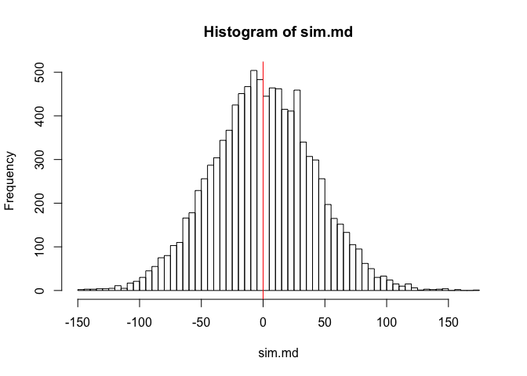
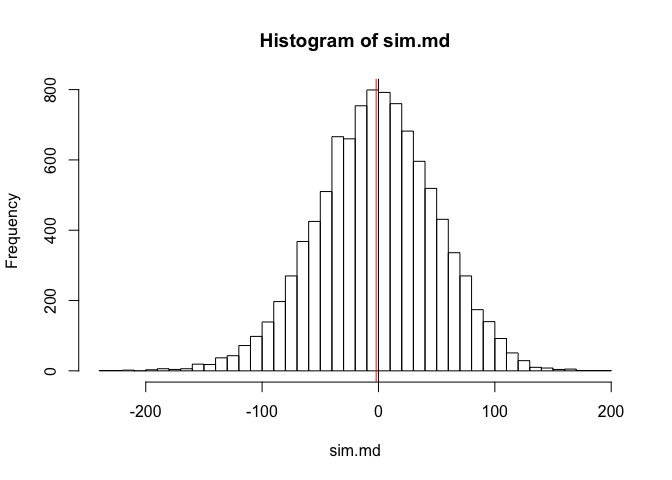
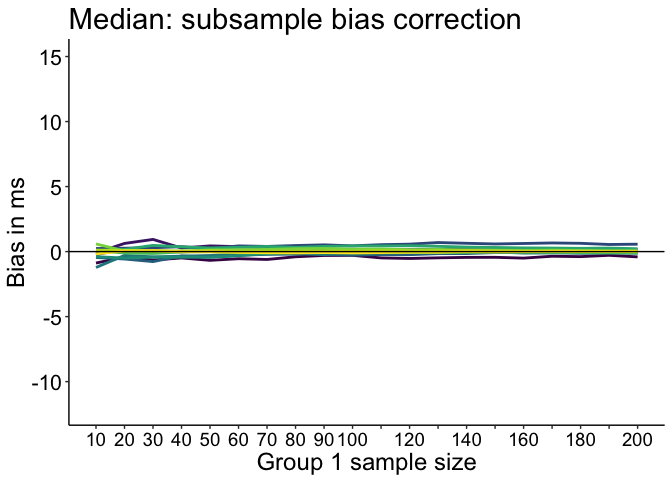

Median bias: comparison of 2 independent groups
================
Guillaume A. Rousselet and Rand R. Wilcox
2019-02-19

-   [Define ex-Gaussian parameters](#define-ex-gaussian-parameters)
-   [Same size](#same-size)
-   [Different sizes](#different-sizes)
-   [Full simulation](#full-simulation)
    -   [Make plot function](#make-plot-function)
    -   [Mean results](#mean-results)
-   [Median results: no bias correction](#median-results-no-bias-correction)
-   [Median results: subsample bias correction](#median-results-subsample-bias-correction)
-   [Median results: bootstrap bias correction](#median-results-bootstrap-bias-correction)
-   [Mean results: median bias](#mean-results-median-bias)
-   [Median results: median bias](#median-results-median-bias)

The sample median is (mean) biased when sampling from skewed distributions. The bias increases with decreasing sample size. According to Miller (1988), because of this bias, group comparison can be affected if the two groups differ in skewness or sample size, or both. As a result, real differences can be lowered or increased, and non-existent differences suggested. In Miller's own words:

"An important practical consequence of the bias in median reaction time is that sample medians must not be used to compare reaction times across experimental conditions when there are unequal numbers of trials in the conditions."

Here we assess this problem using a simulation in which we draw samples of same or different sizes from populations that vary in skewness.

``` r
# dependencies
library(ggplot2)
library(tibble)
library(tidyr)
library(cowplot)
library(retimes)
library(HDInterval)
library(beepr)
source("./functions/akerd.txt")
```

``` r
sessionInfo()
```

    ## R version 3.5.2 (2018-12-20)
    ## Platform: x86_64-apple-darwin15.6.0 (64-bit)
    ## Running under: macOS Mojave 10.14.3
    ## 
    ## Matrix products: default
    ## BLAS: /Library/Frameworks/R.framework/Versions/3.5/Resources/lib/libRblas.0.dylib
    ## LAPACK: /Library/Frameworks/R.framework/Versions/3.5/Resources/lib/libRlapack.dylib
    ## 
    ## locale:
    ## [1] en_GB.UTF-8/en_GB.UTF-8/en_GB.UTF-8/C/en_GB.UTF-8/en_GB.UTF-8
    ## 
    ## attached base packages:
    ## [1] stats     graphics  grDevices utils     datasets  methods   base     
    ## 
    ## other attached packages:
    ## [1] beepr_1.3        HDInterval_0.2.0 retimes_0.1-2    cowplot_0.9.4   
    ## [5] tidyr_0.8.2      tibble_2.0.1     ggplot2_3.1.0   
    ## 
    ## loaded via a namespace (and not attached):
    ##  [1] Rcpp_1.0.0       pillar_1.3.1     compiler_3.5.2   plyr_1.8.4      
    ##  [5] bindr_0.1.1      tools_3.5.2      digest_0.6.18    evaluate_0.12   
    ##  [9] gtable_0.2.0     pkgconfig_2.0.2  rlang_0.3.1      yaml_2.2.0      
    ## [13] xfun_0.4         bindrcpp_0.2.2   withr_2.1.2      dplyr_0.7.8     
    ## [17] stringr_1.3.1    knitr_1.21       grid_3.5.2       tidyselect_0.2.5
    ## [21] glue_1.3.0       R6_2.3.0         rmarkdown_1.11   purrr_0.3.0     
    ## [25] magrittr_1.5     scales_1.0.0     htmltools_0.3.6  assertthat_0.2.0
    ## [29] colorspace_1.4-0 stringi_1.2.4    lazyeval_0.2.1   munsell_0.5.0   
    ## [33] crayon_1.3.4     audio_0.1-5.1

Define ex-Gaussian parameters
=============================

``` r
load('./data/miller_exg_param.RData')
```

Same size
=========

Consider the case without bias, by drawing samples of the same size from one skewed population. Here we use the most skewed distribution from Miller (1988).

``` r
set.seed(21)
n <- 100
nsim <- 10000
sim.md <- double(nsim)
P <- 1 # most skewed distribution
sim.md <- apply(matrix(rexgauss(n*nsim, mu = miller.param[P,1], 
                         sigma = miller.param[P,2], 
                         tau = miller.param[P,3]), nrow=nsim), 1, median) - 
          apply(matrix(rexgauss(n*nsim, mu = miller.param[P,1], 
                         sigma = miller.param[P,2], 
                         tau = miller.param[P,3]), nrow=nsim), 1, median)
hist(sim.md, 50)
abline(v=0, col=1)
abline(v=mean(sim.md), col=2)
```



Bias is -0.0071.

Different sizes
===============

With samples of different sizes.

``` r
set.seed(21)
n1 <- 100
n2 <- 50
nsim <- 10000
sim.md <- double(nsim)
P <- 1 # most skewed distribution
sim.md <- apply(matrix(rexgauss(n1*nsim, mu = miller.param[P,1], 
                         sigma = miller.param[P,2], 
                         tau = miller.param[P,3]), nrow=nsim), 1, median) - 
          apply(matrix(rexgauss(n2*nsim, mu = miller.param[P,1], 
                         sigma = miller.param[P,2], 
                         tau = miller.param[P,3]), nrow=nsim), 1, median)
hist(sim.md, 50)
abline(v=0, col=1)
abline(v=mean(sim.md), col=2)
```



Bias is a bit larger than in the previous example but still very near zero: -1.9984.

Full simulation
===============

Next, we draw samples of different sizes from distributions with varying skewness. We use the same 12 distributions used by Miller (1988).

Group 2 has size 200, whereas group 1 has size 10 to 200, in increments of 10.

Bias correction is performed in 2 ways:
- using bootstrap bias correction
- using subsamples, following Miller's suggestion.

Miller (1988) suggested:

"Although it is computationally quite tedious, there is a way to use medians to reduce the effects of outliers without introducing a bias dependent on sample size. One uses the regular median from Condition F and compares it with a special "average median" (Am) from Condition M. To compute Am, one would take from Condition M all the possible subsamples of Size f where f is the number of trials in Condition F. For each subsample one computes the subsample median. Then, Am is the average, across all possible subsamples, of the subsample medians. This procedure does not introduce bias, because all medians are computed on the basis of the same sample (subsample) size."

Using all possible subsamples would take far too long. For instance, if one group has 5 observations and the other group has 20 observations, there are 15504 (`choose(20,5)`) subsamples to consider. Slightly larger sample sizes would force us to consider millions of subsamples. So instead of using all possible subsamples, to correct the bias due to differences in sample sizes, we compute K random subsamples.

``` r
nmax <- 200
nvec <- seq(10,nmax,10)
nsim <- 10000 # simulation samples
nboot <- 200 # bootstrap bias correction
nK <- 1000 # number of median subsamples

# declare matrices
diff.m.m_bias <- matrix(NA, nrow=nP, ncol=length(nvec)) # mean
diff.md.m_bias <- matrix(NA, nrow=nP, ncol=length(nvec)) # median
diff.m.md_bias <- matrix(NA, nrow=nP, ncol=length(nvec)) # mean
diff.md.md_bias <- matrix(NA, nrow=nP, ncol=length(nvec)) # median
diff.md.bc_gp <- matrix(NA, nrow=nP, ncol=length(nvec)) # bias correction for each group
diff.md.bc_sub <- matrix(NA, nrow=nP, ncol=length(nvec)) # bc using subsamples
bc.md_diff <- vector(mode="numeric", length=nsim)
bc.md_gp <- vector(mode="numeric", length=nsim)
submed <- vector(mode="numeric", length=nK)
bc.g2 <- vector(mode="numeric", length=nsim)

hdi.m <- array(0, dim=c(nP, length(nvec), 2)) # HDI
hdi.md <- array(0, dim=c(nP, length(nvec), 2)) # HDI
hdi.md.bc_gp <- array(0, dim=c(nP, length(nvec), 2)) # HDI
hdi.md.bc_sub <- array(0, dim=c(nP, length(nvec), 2)) # HDI

set.seed(21)

for(P in 1:nP){
  print(paste0("parameters: ",P," out of ",nP,"..."))
  beep(2)
  mu <- miller.param[P,1]
  sigma <- miller.param[P,2]
  tau <- miller.param[P,3]
  
  # reference group: always the same size
  mc.g2 <- matrix(rexgauss(nmax*nsim, mu = mu, sigma = sigma, tau = tau), nrow=nsim) 
  m.mc.g2 <- apply(mc.g2, 1, mean)
  md.mc.g2 <- apply(mc.g2, 1, median)
  
  # compute bias using nboot bootstrap samples
  bootg2 <- vector(mode = "numeric", length = nsim)
  for(iter in 1:nsim){
    bootg2[iter] <- mean(apply(matrix(sample(mc.g2[iter,], nmax*nboot, replace = TRUE), nrow=nboot), 1, median))
  }
  
  all.g1 <- matrix(rexgauss(nmax*nsim, mu = mu, sigma = sigma, tau = tau), nrow=nsim)
  
  for(iter.n in 1:length(nvec)){
    print(paste0("sample size: ",nvec[iter.n],"..."))
    
    # Bias correction using the average of subsample medians
    for(iter in 1:nsim){
      for(K in 1:nK){ # compute median from nboot subsamples
        submed[K] <- median(sample(mc.g2[iter,], nvec[iter.n], replace = FALSE))
      }
      bc.g2[iter] <- mean(submed) # average median
    }  
    
    mc.g1 <- all.g1[,1:nvec[iter.n]]
    
    # compute estimates ---------------
    m.mc.g1 <- apply(mc.g1, 1, mean)
    md.mc.g1 <- apply(mc.g1, 1, median)
    
    # no bias correction
    diff.md.m_bias[P,iter.n] <- mean(md.mc.g1 - md.mc.g2) # mean bias
    diff.m.m_bias[P,iter.n] <- mean(m.mc.g1 - m.mc.g2) 
    diff.md.md_bias[P,iter.n] <- median(md.mc.g1 - md.mc.g2) # median bias
    diff.m.md_bias[P,iter.n] <- median(m.mc.g1 - m.mc.g2)
    hdi.m[P,iter.n,] <- hdi(m.mc.g1 - m.mc.g2, credMass=0.50)
    hdi.md[P,iter.n,] <- hdi(md.mc.g1 - md.mc.g2, credMass=0.50)
    # group 2 corrected for size bias
    diff.md.bc_sub[P,iter.n] <- mean(md.mc.g1 - bc.g2)
    hdi.md.bc_sub[P,iter.n,] <- hdi(md.mc.g1 - bc.g2, credMass=0.50)
    
    # compute bias corrected estimates using nboot bootstrap samples
    for(iter in 1:nsim){
      bootg1 <- apply(matrix(sample(mc.g1[iter,], nvec[iter.n]*nboot, replace = TRUE), nrow=nboot), 1, median)
      # bias correct each group
      bc.md_gp[iter] <- (2*median(mc.g1[iter,]) - mean(bootg1)) -
        (2*median(mc.g2[iter,]) - bootg2[iter])
    }
    diff.md.bc_gp[P,iter.n] <- mean(bc.md_gp)
    hdi.md.bc_gp[P,iter.n,] <- hdi(bc.md_gp, credMass=0.50)
  }
}
save(
  diff.m.m_bias,
  diff.md.m_bias,
  diff.m.md_bias,
  diff.md.md_bias,
  diff.md.bc_gp,
  diff.md.bc_sub,
  hdi.m,
  hdi.md,
  hdi.md.bc_sub,
  hdi.md.bc_gp,
  nvec,
  nsim,
  nboot,
  nmax,
  nK,
  file="./data/bias_diff_size.RData"
)
beep(sound = 8, expr = NULL)
```

Make plot function
------------------

``` r
plot_bias_diff <- function(data, nvec, nP, pop.m, pop.md){
  df <- tibble(`Bias`=as.vector(data),
             `Size`=rep(nvec,each=nP),
             `Skewness`=rep(round(pop.m - pop.md),length(nvec)))

df$Skewness <- as.character(df$Skewness)
df$Skewness <- factor(df$Skewness, levels=unique(df$Skewness))

p <- ggplot(df) + theme_classic() +
  geom_line(aes(x=Size, y=Bias, colour = Skewness), size = 1) + 
  geom_abline(intercept=0, slope=0, colour="black") +
  scale_colour_viridis_d() +
  scale_x_continuous(breaks=nvec, 
                     labels=c(as.character(seq(10,100,10)),
                              "","120","","140","","160","","180","","200")) + 
  scale_y_continuous(breaks=seq(-20,20,5)) +
  coord_cartesian(ylim=c(-12,15)) +
  theme(plot.title = element_text(size=22),
        axis.title.x = element_text(size = 18),
        axis.text.x = element_text(size = 14, colour="black"),
        axis.text.y = element_text(size = 16, colour="black"),
        axis.title.y = element_text(size = 18),
        legend.position = "none") +
   labs(x = "Group 1 sample size", y = "Bias in ms") +
  guides(colour = guide_legend(override.aes = list(size=3))) # make thicker legend lines
p
}
```

Mean results
------------

``` r
load("./data/bias_diff_size.RData")

# make plot
p <- plot_bias_diff(diff.m.m_bias, nvec, nP, pop.m, pop.md) + 
      ggtitle("Mean") +
      theme(legend.key.width = unit(1.5,"cm"),
            legend.position = c(0.55,0.85),
            legend.direction = "horizontal",
            legend.text=element_text(size=16),
            legend.title=element_text(size=18))
p
```


``` r
p.m <- p
# save figure
# ggsave(filename='./figures/figure_bias_diff_m.png',width=7,height=5) 
```

Median results: no bias correction
==================================

As in the previous figure, the shaded area shows the upper part of the mean bias 50% HDI, when group 1 and group 2 have the same skewness.

``` r
# make plot
p <- plot_bias_diff(diff.md.m_bias, nvec, nP, pop.m, pop.md) + 
      ggtitle("Median: no bias correction") 
p
```


``` r
p.nobc <- p
# save figure
# ggsave(filename='./figures/figure_bias_diff_md.png',width=7,height=5)
```

Bias increases with skewness and sample size difference. If the two groups have the same skewness (skewness 6), there is almost no bias even when group 2 has 200 observations and group 1 only has 10.

Median results: subsample bias correction
=========================================

If unequal sample sizes, attempt to correct bias by using the mean of K loops with n=min(n1,n2). Although this is not what Miller (1988) suggested, the K loop shortcut should reduce bias to some extent.

``` r
# make plot
p <- plot_bias_diff(diff.md.bc_sub, nvec, nP, pop.m, pop.md) + 
  ggtitle("Median: subsample bias correction") 
p
```



``` r
p.bc_sub <- p
# save figure
# ggsave(filename='./figures/figure_bias_diff_md_sub.png',width=7,height=5)
```

The K loop approach works very well!

Here is the correction for the different sample sizes (the same correction is applied to all skewness levels because it is computed once for the group with the largest sample size):

``` r
round(diff.md.m_bias[1,] - diff.md.bc_sub[1,], digits = 2)
```

    ##  [1] 14.96  6.86  4.24  2.99  2.20  1.71  1.33  1.06  0.85  0.68  0.55
    ## [12]  0.43  0.34  0.27  0.20  0.14  0.09  0.05  0.01  0.00

Median results: bootstrap bias correction
=========================================

Correct bias in each group using the bootstrap.

``` r
p <- plot_bias_diff(diff.md.bc_gp, nvec, nP, pop.m, pop.md) + 
  ggtitle("Median: bootstrap bias correction") 
p
```


``` r
p.bc_gp <- p
# save figure
# ggsave(filename='./figures/figure_bias_diff_md_bbc.png',width=7,height=5)
```

The bootstrap bias correction works very well! Values for the median are very similar to that for the mean. None of them are exactly zero and the absolute values are very similar. At most, for n = 10 the median's maximum bias across distributions is 1.79 ms, whereas the mean's is 0.88 ms.

Mean results: median bias
=========================

``` r
p <- plot_bias_diff(diff.m.md_bias, nvec, nP, pop.m, pop.md) + 
  ggtitle("Mean: median bias") 
p
```


``` r
p.m.md_bias <- p
```

The sampling distribution of the mean differences in median bias.

Median results: median bias
===========================

``` r
p <- plot_bias_diff(diff.md.md_bias, nvec, nP, pop.m, pop.md) + 
  ggtitle("Median: median bias") 
p
```


``` r
p.md.md_bias <- p
```

The sampling distribution of the median differences in not median bias: bias values are very close to zero, except for n = 10.

``` r
# combine panels into one figure
cowplot::plot_grid(p.m, p.nobc, 
                   p.bc_sub, p.bc_gp,
                   p.m.md_bias, p.md.md_bias,
                          labels = c("A", "B", "C", "D", "E", "F"),
                          ncol = 2,
                          nrow = 3,
                          # rel_widths = c(1, 1, 1), 
                          label_size = 20, 
                          hjust = -0.5, 
                          scale=.95,
                          align = "h")
# save figure
ggsave(filename='./figures/figure_bias_diff_summary.pdf',width=14,height=15)
```
