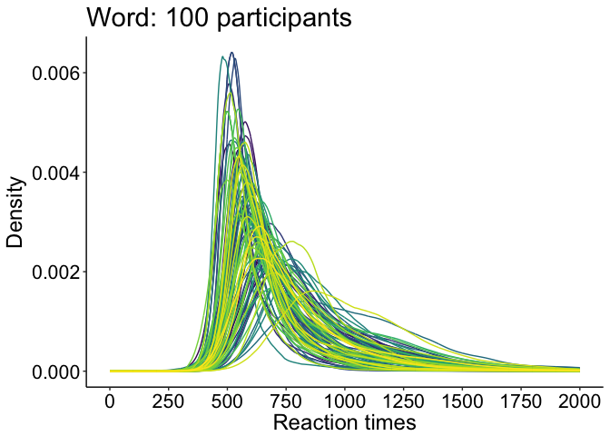
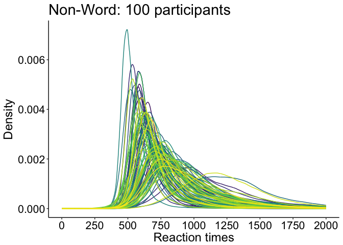
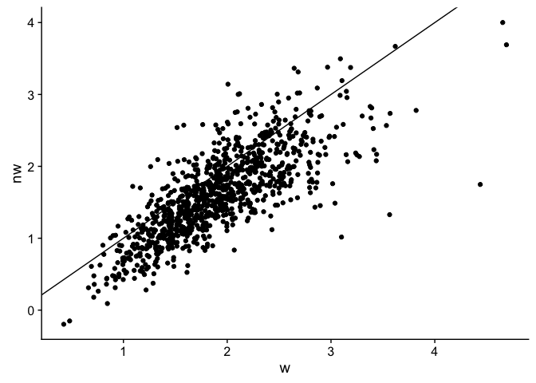
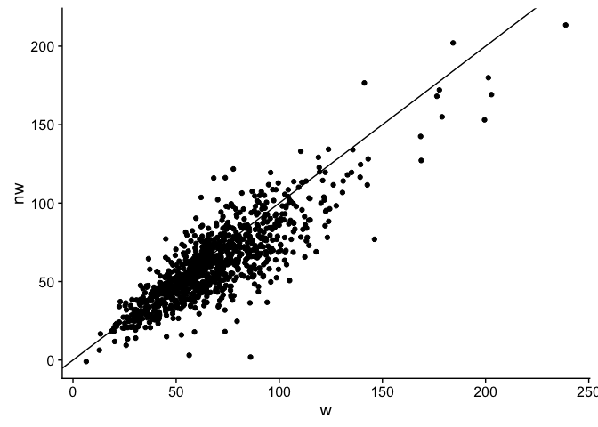
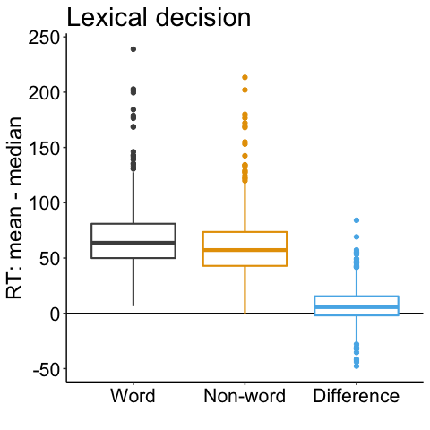
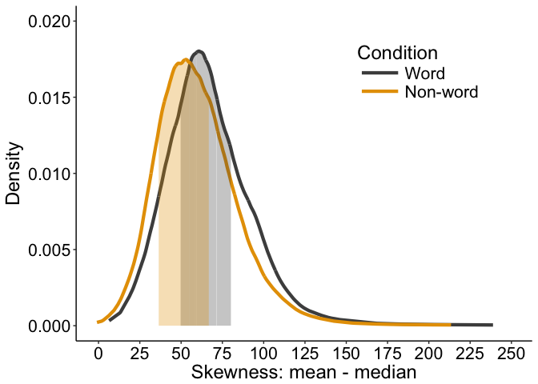
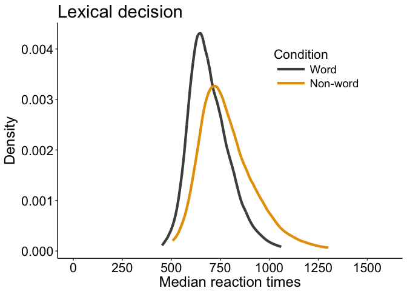
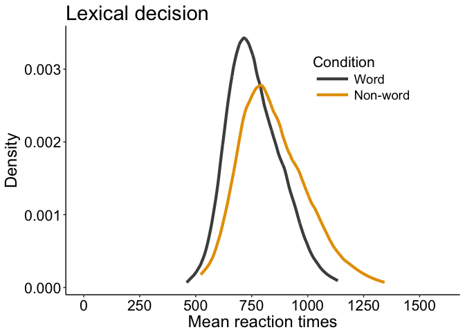
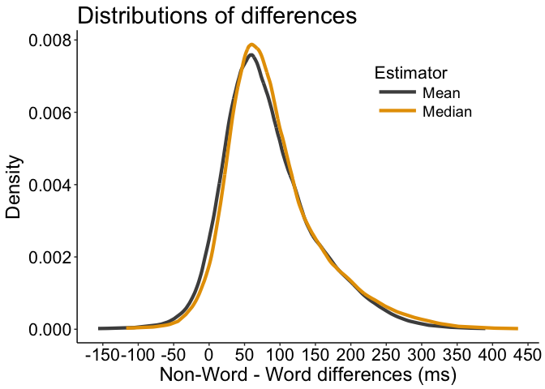
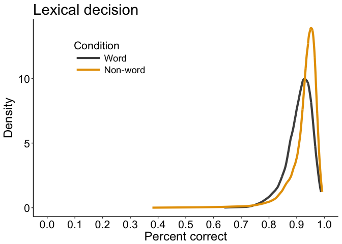

French lexicon project: illustrate dataset
================
Guillaume A. Rousselet

-   [Lexical decision dataset](#lexical-decision-dataset)
-   [Illustrate results for a few participants](#illustrate-results-for-a-few-participants)
-   [Illustrate results for all participants](#illustrate-results-for-all-participants)
    -   [Save KDE](#save-kde)
    -   [Make figure: WORD](#make-figure-word)
    -   [Make figure: NON-WORD](#make-figure-non-word)
-   [Summary results for all participants](#summary-results-for-all-participants)
    -   [Illustrate skewness](#illustrate-skewness)
    -   [Distribution of differences between mean and median RT](#distribution-of-differences-between-mean-and-median-rt)
    -   [Percent correct data](#percent-correct-data)

``` r
# dependencies
library(ggplot2)
library(cowplot)
library(tibble)
library(tidyr)
library(viridis)
library(HDInterval)
source("./functions/akerd.txt")
```

Lexical decision dataset
========================

Data from the [French Lexicon Project](https://sites.google.com/site/frenchlexicon/results). Click on "French Lexicon Project trial-level results with R scripts.zip".

The dataset used here is available as an RData file on github: <https://github.com/GRousselet/blog/tree/master/10000>

``` r
# get data - tibble = `flp`
load("./data/french_lexicon_project_rt_data.RData")
# columns =
#1 = participant
#2 = rt
#3 = acc = accuracy 0/1
#4 = condition = word/non-word
```

N = 959 participants.

Illustrate results for a few participants
=========================================

Word / non-word comparison:

``` r
# select participants
p.list <- unique(flp$participant)
# sp <- p.list[seq(1, length(unique(flp$participant)), 25)]
# sp <- c(121, 144, 326)
sp <- p.list[870]

for(iter in 1:length(sp)){
# make KDE
flp.w <- sort(flp$rt[flp$participant==sp[iter] & flp$condition=="word"])
flp.nw <- sort(flp$rt[flp$participant==sp[iter] & flp$condition=="non-word"])
a.flp.w <- akerd(flp.w, pyhat = TRUE, plotit = FALSE)
a.flp.nw <- akerd(flp.nw, pyhat = TRUE, plotit = FALSE)

# create data frame
df <- tibble(`x`=c(flp.w,flp.nw),
             `y`=c(a.flp.w,a.flp.nw),
             `Condition`=c(rep.int("Word",length(flp.w)),
                           rep.int("Non-word",length(flp.nw))))
# make plot
df$Condition <- as.character(df$Condition)
df$Condition <- factor(df$Condition, levels=unique(df$Condition))

# make plot
p <- ggplot(df, aes(x,y, group=Condition)) + theme_classic() +
  geom_line(aes(colour=Condition), size = 1.5) + # linetype=Condition, 
  # scale_size_manual(values=c(1,0.5)) +
  # scale_linetype_manual(values=c("solid","solid")) +
  scale_color_manual(values=c("grey30", "#E69F00")) + #, "#56B4E9","black")) +
  scale_x_continuous(limits=c(0,2000), breaks=seq(0,2000,500), minor_breaks = waiver()) +
  theme(plot.title = element_text(size=22),
        axis.title.x = element_text(size = 18),
        axis.text = element_text(size = 16, colour = "black"),
        axis.title.y = element_text(size = 18),
        legend.text = element_text(size = 16),
        legend.title = element_text(size = 18),
        legend.key.width = unit(1.5,"cm"),
        legend.position = c(0.75,0.8),
        strip.text.y = element_text(size = 18, face = "bold", angle = 0)) +
        # legend.position = c(0.25,0.9)) +
  labs(x = "Reaction times", y = "Density") +
  ggtitle(paste0("Lexical decision: P",sp[iter]))
p
# save figure
# ggsave(filename=paste0('./figures/figure_flp_p',sp[iter],'.pdf'),width=10,height=7) #path=pathname
}
```

Illustrate results for all participants
=======================================

Superimpose all KDE (kernel density estimates), separately for Word and Non-Word conditions.

Save KDE
--------

``` r
# select participants
p.list <- unique(flp$participant)
Np <- length(p.list)
x <- seq(0, 2000)
a.flp.w <- matrix(ncol=Np, nrow=length(x))
a.flp.nw <- matrix(ncol=Np, nrow=length(x))

for(P in 1:Np){
# make KDE
flp.w <- sort(flp$rt[flp$participant==p.list[P] & flp$condition=="word"])
flp.nw <- sort(flp$rt[flp$participant==p.list[P] & flp$condition=="non-word"])
a.flp.w[,P] <- akerd(flp.w, pyhat = TRUE, plotit = FALSE, pts = x)
a.flp.nw[,P] <- akerd(flp.nw, pyhat = TRUE, plotit = FALSE, pts = x)
}
save(x, Np, p.list,
     a.flp.w, 
     a.flp.nw,
     file = './data/flp_all_kde.RData')
```

Make figure: WORD
-----------------

Was planning to make figure in one go using `facet_grid` and all participants superimposed, but the call to `tibble` keeps crashing R. So plotting 100 random participants for one condition instead.

``` r
load('./data/flp_all_kde.RData')

# create data frame
# df <- tibble(kde = c(as.vector(a.flp.w), as.vector(a.flp.nw)),
#              x = rep(x, Np * 2),
#              participant = factor(c(rep(seq(1,Np), each = length(x)),
#                                     rep(seq(1,Np), each = length(x)))),
#              condition = factor(rep(c("Word", "Non-Word"), each = length(x) * Np))
#              )
set.seed(21)
Np <- 100
a.flp.w <- as.vector(a.flp.w[,runif(Np, min = 1, max = 959)])
df <- tibble(kde = a.flp.w,
             x = rep(x, Np)
             )
df$participant = factor(rep(seq(1,Np), each = length(x)))
# df$condition <- as.character(df$condition)
# df$condition <- factor(df$condition, levels=unique(df$condition))
df$participant <- as.character(df$participant)
df$participant <- factor(df$participant, levels=unique(df$participant))

# make plot
p <- ggplot(df, aes(x, kde)) + theme_classic() +
  geom_line(aes(colour=participant), size = 0.5) + # linetype=Condition, 
  scale_color_viridis(discrete = TRUE) + 
  scale_x_continuous(limits=c(0,2000), breaks=seq(0,2000,250), minor_breaks = waiver()) +
  theme(plot.title = element_text(size=22),
        axis.title.x = element_text(size = 18),
        axis.text = element_text(size = 16, colour = "black"),
        axis.title.y = element_text(size = 18),
        legend.text = element_text(size = 16),
        legend.title = element_text(size = 18),
        legend.key.width = unit(1.5,"cm"),
        legend.position = "none",#c(0.75,0.8),
        strip.text.y = element_text(size = 18, face = "bold", angle = 0)) +
        # legend.position = c(0.25,0.9)) +
  labs(x = "Reaction times", y = "Density") +
  ggtitle(paste0("Word: 100 participants")) 
  # facet_grid(. ~ condition)
p
```



``` r
# save figure
ggsave(filename=paste0('./figures/figure_flp_w_100_kde.pdf'),width=10,height=7) #path=pathname
```

Make figure: NON-WORD
---------------------

``` r
load('./data/flp_all_kde.RData')

# create data frame
# df <- tibble(kde = c(as.vector(a.flp.w), as.vector(a.flp.nw)),
#              x = rep(x, Np * 2),
#              participant = factor(c(rep(seq(1,Np), each = length(x)),
#                                     rep(seq(1,Np), each = length(x)))),
#              condition = factor(rep(c("Word", "Non-Word"), each = length(x) * Np))
#              )
set.seed(21)
Np <- 100
a.flp.nw <- as.vector(a.flp.nw[,runif(Np, min = 1, max = 959)])
df <- tibble(kde = a.flp.nw,
             x = rep(x, Np)
             )
df$participant = factor(rep(seq(1,Np), each = length(x)))
# df$condition <- as.character(df$condition)
# df$condition <- factor(df$condition, levels=unique(df$condition))
df$participant <- as.character(df$participant)
df$participant <- factor(df$participant, levels=unique(df$participant))

# make plot
p <- ggplot(df, aes(x, kde)) + theme_classic() +
  geom_line(aes(colour=participant), size = 0.5) + # linetype=Condition, 
  scale_color_viridis(discrete = TRUE) + 
  scale_x_continuous(limits=c(0,2000), breaks=seq(0,2000,250), minor_breaks = waiver()) +
  theme(plot.title = element_text(size=22),
        axis.title.x = element_text(size = 18),
        axis.text = element_text(size = 16, colour = "black"),
        axis.title.y = element_text(size = 18),
        legend.text = element_text(size = 16),
        legend.title = element_text(size = 18),
        legend.key.width = unit(1.5,"cm"),
        legend.position = "none",#c(0.75,0.8),
        strip.text.y = element_text(size = 18, face = "bold", angle = 0)) +
        # legend.position = c(0.25,0.9)) +
  labs(x = "Reaction times", y = "Density") +
  ggtitle(paste0("Non-Word: 100 participants")) 
  # facet_grid(. ~ condition)
p
```



``` r
# save figure
ggsave(filename=paste0('./figures/figure_flp_nw_100_kde.pdf'),width=10,height=7) #path=pathname
```

Summary results for all participants
====================================

``` r
# Number of trials
nres <- tapply(flp$rt, list(flp$participant, flp$condition), length)
summary(nres)
```

    ##       word           non-word   
    ##  Min.   : 996.0   Min.   : 997  
    ##  1st Qu.: 999.0   1st Qu.:1000  
    ##  Median : 999.0   Median :1001  
    ##  Mean   : 999.5   Mean   :1001  
    ##  3rd Qu.:1000.0   3rd Qu.:1001  
    ##  Max.   :1000.0   Max.   :1001

``` r
# get data: median RT for every participant
medres <- tapply(flp$rt, list(flp$participant, flp$condition), median)
summary(medres)
```

    ##       word           non-word     
    ##  Min.   : 453.0   Min.   : 507.0  
    ##  1st Qu.: 620.5   1st Qu.: 684.2  
    ##  Median : 678.5   Median : 762.0  
    ##  Mean   : 696.5   Mean   : 788.6  
    ##  3rd Qu.: 762.2   3rd Qu.: 870.5  
    ##  Max.   :1061.0   Max.   :1301.0

``` r
# get data: mean RT for every participant
meanres <- tapply(flp$rt, list(flp$participant, flp$condition), mean)
summary(meanres)
```

    ##       word           non-word     
    ##  Min.   : 459.4   Min.   : 522.1  
    ##  1st Qu.: 674.5   1st Qu.: 736.7  
    ##  Median : 747.7   Median : 827.5  
    ##  Mean   : 763.9   Mean   : 848.9  
    ##  3rd Qu.: 845.4   3rd Qu.: 946.6  
    ##  Max.   :1134.9   Max.   :1343.5

``` r
# get data: skewness for every participant
skewness <- function(x){
x=elimna(x)
m1<-mean(x)
m2<-var(x)
m3<-sum((x-m1)^3)/length(x)
sk<-m3/m2^1.5
sk
}
skewres <- tapply(flp$rt, list(flp$participant, flp$condition), skewness)
summary(skewres)
```

    ##       word           non-word      
    ##  Min.   :0.4247   Min.   :-0.1966  
    ##  1st Qu.:1.5171   1st Qu.: 1.2105  
    ##  Median :1.8733   Median : 1.6004  
    ##  Mean   :1.9123   Mean   : 1.6197  
    ##  3rd Qu.:2.2643   3rd Qu.: 1.9991  
    ##  Max.   :4.6905   Max.   : 4.0006

Illustrate skewness
-------------------

``` r
df <- tibble(`w` = skewres[,1],
             `nw` = skewres[,2])
ggplot(df, aes(x=w, y=nw)) + geom_point() + geom_abline(slope=1, intercept=0)
```



Proportion of participants with larger skewness in the Word condition:

``` r
sum((skewres[,1] - skewres[,2]) > 0) / length(skewres[,1])
```

    ## [1] 0.8008342

### Illustrate non-parametric skewness

``` r
df <- tibble(`w` = meanres[,1] - medres[,1],
             `nw` = meanres[,2] - medres[,2])
ggplot(df, aes(x=w, y=nw)) + geom_point() + geom_abline(slope=1, intercept=0)
```



Only one participant in the non-word condition has negative skewness: -0.94.

Proportion of participants with larger non-parametric skewness in the Word condition:

``` r
sum((meanres[,1] - medres[,1]) - (meanres[,2] - medres[,2]) > 0) / length(skewres[,1])
```

    ## [1] 0.6976017

### Illustrate results: the mean is larger than the median in most participants

``` r
diff.w <- sort(meanres[,1] - medres[,1])
diff.nw <- sort(meanres[,2] - medres[,2])
diff.wnw <- (meanres[,1]-meanres[,2]) - (medres[,1]-medres[,2])
# a.diff.w <- akerd(diff.w, pyhat = TRUE, plotit = FALSE)
# a.diff.nw <- akerd(diff.nw, pyhat = TRUE, plotit = FALSE)

# create data frame
df <- tibble(`x`=c(diff.w, diff.nw, diff.wnw),
             # `y`=c(a.diff.w,a.diff.nw),
             `Condition`=c(rep.int("Word",length(diff.w)),
                           rep.int("Non-word",length(diff.nw)),
                           rep.int("Difference",length(diff.wnw))))
# make plot
df$Condition <- as.character(df$Condition)
df$Condition <- factor(df$Condition, levels=unique(df$Condition))

# make plot
p <- ggplot(df, aes(x=Condition, y=x, group=Condition)) + theme_classic() +
  geom_hline(yintercept = 0) +
  # geom_line(aes(colour=Condition), size = 1.5) + # linetype=Condition, 
  geom_boxplot(aes(colour=Condition), size = 0.75) + # linetype=Condition, 
  # scale_size_manual(values=c(1,0.5)) +
  # scale_linetype_manual(values=c("solid","solid")) +
  scale_color_manual(values=c("grey30", "#E69F00", "#56B4E9")) + #, "#56B4E9","black")) + grey #999999
  # scale_x_continuous(limits=c(0,2000), breaks=seq(0,2000,500), minor_breaks = waiver()) +
  theme(plot.title = element_text(size=22),
        axis.title.x = element_text(size = 18),
        axis.text = element_text(size = 16, colour = "black"),
        axis.title.y = element_text(size = 18),
        legend.key.width = unit(1.5,"cm"),
        legend.position = "none", #c(0.75,0.8),
        strip.text.y = element_text(size = 18, face = "bold", angle = 0)) +
  labs(y = "RT: mean - median", x="") +
  ggtitle("Lexical decision")
p
```



``` r
# save figure
ggsave(filename='./figures/figure_flp_all_p_mean_median_diff.pdf',width=7,height=7) #path=pathname
```

### KDE of non-parametric skewness

``` r
# make KDE
kde.w <- akerd(meanres[,1] - medres[,1], pyhat = TRUE, plotit = FALSE)
kde.nw <- akerd(meanres[,2] - medres[,2], pyhat = TRUE, plotit = FALSE)
# get HDI
hdi.w <- hdi(meanres[,1] - medres[,1], credMass=0.50)
hdi.nw <- hdi(meanres[,2] - medres[,2], credMass=0.50)
```

``` r
# create data frame
df <- tibble(`x`=c(sort(meanres[,1] - medres[,1]), sort(meanres[,2] - medres[,2])),
             `y`=c(kde.w, kde.nw),
             `Condition`=c(rep.int("Word",length(kde.w)),
                           rep.int("Non-word",length(kde.nw))))
# make plot
df$Condition <- as.character(df$Condition)
df$Condition <- factor(df$Condition, levels=unique(df$Condition))

diff <- sort(meanres[,1] - medres[,1])
df.area1 <- tibble(x = diff[diff>hdi.w[1] & diff<hdi.w[2]],
                   y = kde.w[diff>hdi.w[1] & diff<hdi.w[2]])
diff <- sort(meanres[,2] - medres[,2])
df.area2 <- tibble(x = diff[diff>hdi.nw[1] & diff<hdi.nw[2]],
                   y = kde.nw[diff>hdi.nw[1] & diff<hdi.nw[2]])
# make plot
p <- ggplot(df, aes(x,y)) + theme_classic() +
  geom_line(aes(colour=Condition), size = 1.5) + # linetype=Condition, 
  scale_color_manual(values=c("grey30", "#E69F00")) + #, "#56B4E9","black")) +
# add HDI areas
geom_area(data=df.area1, aes(x=x, y=y), fill="grey30", alpha=0.3) +
  geom_area(data=df.area2, aes(x=x, y=y), fill="#E69F00", alpha=0.3) +
  scale_x_continuous(limits=c(-1,250), breaks=seq(0,250,25)) +
  scale_y_continuous(limits=c(0,0.02)) +
  theme(plot.title = element_text(size=22),
        axis.title.x = element_text(size = 18),
        axis.text = element_text(size = 16, colour = "black"),
        axis.title.y = element_text(size = 18),
        legend.text = element_text(size = 16),
        legend.title = element_text(size = 18),
        legend.key.width = unit(1.5,"cm"),
        legend.position = c(0.75,0.8),
        strip.text.y = element_text(size = 18, face = "bold", angle = 0)) +
        # legend.position = c(0.25,0.9)) +
  labs(x = "Skewness: mean - median", y = "Density")
  # ggtitle(paste0("Lexical decision: P",sp[iter]))
p
```



``` r
# save figure
# ggsave(filename=paste0('./figures/figure_flp_p',sp[iter],'.pdf'),width=10,height=7) #path=pathname
```

For words and non-words, across participants, the distributions of median RT are positively skewed.

``` r
# make KDE
flp.w <- sort(medres[,1])
flp.nw <- sort(medres[,2])
a.flp.w <- akerd(flp.w, pyhat = TRUE, plotit = FALSE)
a.flp.nw <- akerd(flp.nw, pyhat = TRUE, plotit = FALSE)

# create data frame
df <- tibble(`x`=c(flp.w,flp.nw),
             `y`=c(a.flp.w,a.flp.nw),
             `Condition`=c(rep.int("Word",length(flp.w)),
                           rep.int("Non-word",length(flp.nw))))
# make plot
df$Condition <- as.character(df$Condition)
df$Condition <- factor(df$Condition, levels=unique(df$Condition))

# make plot
p <- ggplot(df, aes(x,y, group=Condition)) + theme_classic() + 
  geom_line(aes(colour=Condition), size = 1.5) + # linetype=Condition, 
  # scale_size_manual(values=c(1,0.5)) +
  # scale_linetype_manual(values=c("solid","solid")) +
  scale_color_manual(values=c("grey30", "#E69F00")) + #, "#56B4E9","black")) + grey #999999
  scale_x_continuous(limits=c(0,1600), breaks=seq(0,1600,250), minor_breaks = waiver()) +
  theme(plot.title = element_text(size=22),
        axis.title.x = element_text(size = 18),
        axis.text = element_text(size = 16, colour = "black"),
        axis.title.y = element_text(size = 18),
        legend.key.width = unit(1.5,"cm"),
        legend.position = c(0.75,0.8),
        legend.title = element_text(size=16),
        legend.text = element_text(size = 14),
        strip.text.y = element_text(size = 18, face = "bold", angle = 0)) +
        # legend.position = c(0.25,0.9)) +
  labs(x = "Median reaction times", y = "Density") +
  ggtitle("Lexical decision")
p
```



``` r
# save figure
ggsave(filename='./figures/figure_flp_all_p_median.pdf',width=10,height=7) #path=pathname
```

For words and non-words, across participants, the distributions of mean RT are also positively skewed.

``` r
# make KDE
flp.w <- sort(meanres[,1])
flp.nw <- sort(meanres[,2])
a.flp.w <- akerd(flp.w, pyhat = TRUE, plotit = FALSE)
a.flp.nw <- akerd(flp.nw, pyhat = TRUE, plotit = FALSE)

# create data frame
df <- tibble(`x`=c(flp.w,flp.nw),
             `y`=c(a.flp.w,a.flp.nw),
             `Condition`=c(rep.int("Word",length(flp.w)),
                           rep.int("Non-word",length(flp.nw))))
# make plot
df$Condition <- as.character(df$Condition)
df$Condition <- factor(df$Condition, levels=unique(df$Condition))

# make plot
p <- ggplot(df, aes(x,y, group=Condition)) + theme_classic() + 
  geom_line(aes(colour=Condition), size = 1.5) + # linetype=Condition, 
  # scale_size_manual(values=c(1,0.5)) +
  # scale_linetype_manual(values=c("solid","solid")) +
  scale_color_manual(values=c("grey30", "#E69F00")) + #, "#56B4E9","black")) + grey #999999
  scale_x_continuous(limits=c(0,1600), breaks=seq(0,1600,250), minor_breaks = waiver()) +
  theme(plot.title = element_text(size=22),
        axis.title.x = element_text(size = 18),
        axis.text = element_text(size = 16, colour = "black"),
        axis.title.y = element_text(size = 18),
        legend.key.width = unit(1.5,"cm"),
        legend.position = c(0.75,0.8),
        legend.title = element_text(size=16),
        legend.text = element_text(size = 14),
        strip.text.y = element_text(size = 18, face = "bold", angle = 0)) +
        # legend.position = c(0.25,0.9)) +
  labs(x = "Mean reaction times", y = "Density") +
  ggtitle("Lexical decision")
p
```



``` r
# save figure
ggsave(filename='./figures/figure_flp_all_p_mean.pdf',width=10,height=7) #path=pathname
```

Distribution of differences between mean and median RT
------------------------------------------------------

The distribution of mean and median differences are also positively skewed.

``` r
# make KDE
diff.m <- sort(meanres[,2] - meanres[,1])
a.diff.m <- akerd(diff.m, pyhat = TRUE, plotit = FALSE)
diff.md <- sort(medres[,2] - medres[,1])
a.diff.md <- akerd(diff.md, pyhat = TRUE, plotit = FALSE)

# create data frame
df <- tibble(`x`=c(diff.m,diff.md),
             `y`=c(a.diff.m,a.diff.md),
             `Estimator`=c(rep.int("Mean",length(flp.w)),
                           rep.int("Median",length(flp.nw))))

# make plot
p <- ggplot(df, aes(x,y)) + theme_classic() + 
    geom_line(aes(colour=Estimator), size = 1.5) + 
  scale_color_manual(values=c("grey30", "#E69F00")) + #, "#56B4E9","black")) + grey #999999
  scale_x_continuous(breaks=seq(-200,500,50)) +
  theme(plot.title = element_text(size=22),
        axis.title.x = element_text(size = 18),
        axis.text = element_text(size = 16, colour = "black"),
        axis.title.y = element_text(size = 18),
        legend.key.width = unit(1.5,"cm"),
        legend.position = c(0.75,0.8),
        legend.title = element_text(size=16),
        legend.text = element_text(size = 14),
        strip.text.y = element_text(size = 18, face = "bold", angle = 0)) +
        # legend.position = c(0.25,0.9)) +
  labs(x = "Non-Word - Word differences (ms)", y = "Density") +
  ggtitle("Distributions of differences")
p
```



``` r
# save figure
ggsave(filename='./figures/figure_flp_all_p_diff.pdf',width=10,height=7) #path=pathname
```

The two distributions seem to have similar spread:

IQR of mean RT = 78
IQR of median RT = 79

MAD of mean RT = 57
MAD of median RT = 54

VAR of mean RT = 4507
VAR of median RT = 4785

Percent correct data
--------------------

Percent correct data are negatively skewed because of a ceiling effect, with most participants performing above 90% correct.

``` r
# get accuracy data
flp.acc <- tapply(flp$acc, list(flp$participant, flp$condition), mean)
summary(flp.acc)
```

    ##       word           non-word     
    ##  Min.   :0.6390   Min.   :0.3796  
    ##  1st Qu.:0.8849   1st Qu.:0.9116  
    ##  Median :0.9179   Median :0.9391  
    ##  Mean   :0.9088   Mean   :0.9245  
    ##  3rd Qu.:0.9429   3rd Qu.:0.9580  
    ##  Max.   :0.9880   Max.   :0.9920

``` r
# make KDE
flp.w <- sort(flp.acc[,1])
flp.nw <- sort(flp.acc[,2])
a.flp.w <- akerd(flp.w, pyhat = TRUE, plotit = FALSE)
a.flp.nw <- akerd(flp.nw, pyhat = TRUE, plotit = FALSE)

# create data frame
df <- tibble(`x`=c(flp.w,flp.nw),
             `y`=c(a.flp.w,a.flp.nw),
             `Condition`=c(rep.int("Word",length(flp.w)),
                           rep.int("Non-word",length(flp.nw))))
# make plot
df$Condition <- as.character(df$Condition)
df$Condition <- factor(df$Condition, levels=unique(df$Condition))

# make plot
p <- ggplot(df, aes(x,y, group=Condition)) + theme_classic() + 
  geom_line(aes(colour=Condition), size = 1.5) + # linetype=Condition, 
  # scale_size_manual(values=c(1,0.5)) +
  # scale_linetype_manual(values=c("solid","solid")) +
  scale_color_manual(values=c("grey30", "#E69F00")) + #, "#56B4E9","black")) + grey #999999
  scale_x_continuous(limits=c(0,1), breaks=seq(0,1,0.1), minor_breaks = waiver()) +
  theme(plot.title = element_text(size=22),
        axis.title.x = element_text(size = 18),
        axis.text = element_text(size = 16, colour = "black"),
        axis.title.y = element_text(size = 18),
        legend.key.width = unit(1.5,"cm"),
        legend.position = c(0.25,0.8),
        legend.title = element_text(size=16),
        legend.text = element_text(size = 14),
        strip.text.y = element_text(size = 18, face = "bold", angle = 0)) +
        # legend.position = c(0.25,0.9)) +
  labs(x = "Percent correct", y = "Density") +
  ggtitle("Lexical decision")
p
```



``` r
# save figure
ggsave(filename='./figures/figure_flp_all_p_acc.pdf',width=10,height=7) #path=pathname
```
