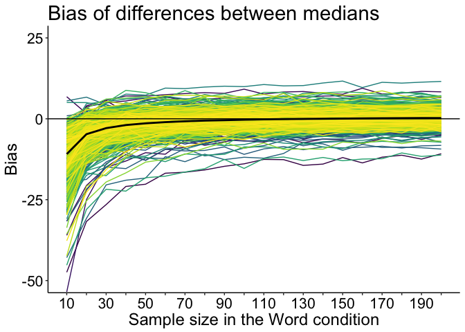
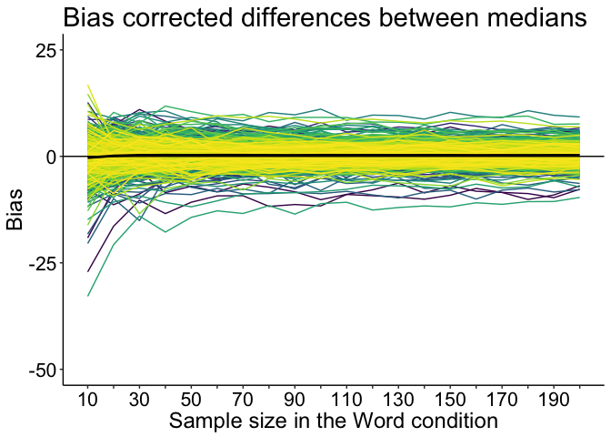
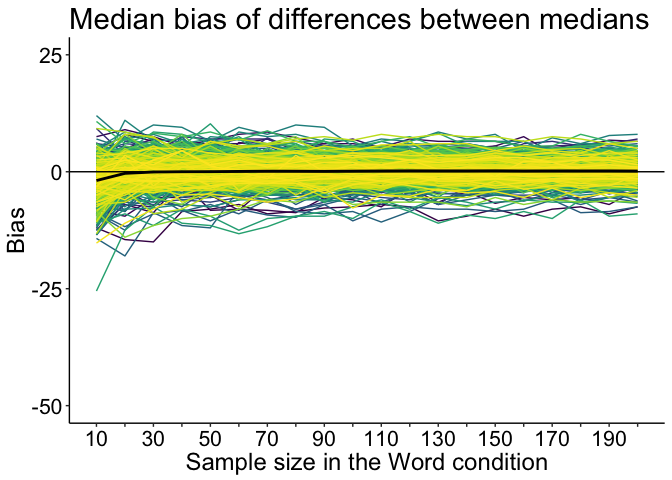
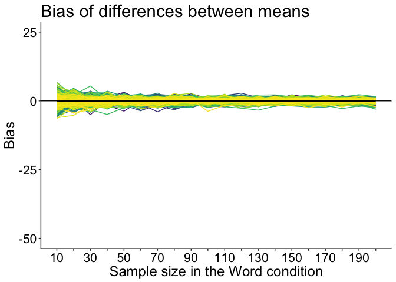
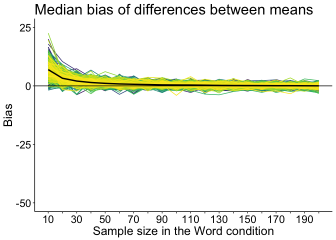

Median bias: application to the French lexicon project dataset
================
Guillaume A. Rousselet

-   [Simulation](#simulation)
-   [Illustrate bias](#illustrate-bias)
    -   [Median](#median)
    -   [Median with bias correction](#median-with-bias-correction)
    -   [Median: median bias](#median-median-bias)
    -   [Mean](#mean)
    -   [Mean: median bias](#mean-median-bias)

Quantify participant level sample bias due to differences in sample sizes.

``` r
rm(list=ls())
# dependencies
library(ggplot2)
library(tibble)
library(tidyr)
library(viridis)
source("./functions/Rallfun-v34.txt")
```

``` r
# get data - tibble = `flp`
load("./data/french_lexicon_project_rt_data.RData")
# columns =
#1 = participant
#2 = rt
#3 = acc = accuracy 0/1
#4 = condition = word/non-word
```

Simulation
==========

``` r
set.seed(21)
p.list <- unique(flp$participant)
nP <- length(p.list) # 959 participants

# parameters
nsim <- 2000 # estimate bias using nsim resamples
nboot <- 200 # correct bias using nboot resamples
nmax <- 200
nvec <- seq(10, nmax, 10)

# declare matrices of results ===============
# get population values to subtract from downsampled estimates, 
# so that, on average, bias of the difference should be zero
pop.md.w <- vector(mode="numeric", nP)
pop.md.nw <- vector(mode="numeric", nP)
pop.m.w <- vector(mode="numeric", nP)
pop.m.nw <- vector(mode="numeric", nP)
sim.md.diff <- matrix(NA, nrow=nP, ncol=length(nvec))
sim.m.diff <- matrix(NA, nrow=nP, ncol=length(nvec))
sim.md.diff.md <- matrix(NA, nrow=nP, ncol=length(nvec))
sim.m.diff.md <- matrix(NA, nrow=nP, ncol=length(nvec))
bc.md.diff <- matrix(NA, nrow=nP, ncol=length(nvec))

for(P in 1:nP){
  if(P %% 100 ==0){
  print(paste0("Participant ",P," out of ",nP,"..."))
  }
  
  # get data from one participant
  flp.w <- sort(flp$rt[flp$participant==p.list[P] & flp$condition=="word"])
  flp.nw <- sort(flp$rt[flp$participant==p.list[P] & flp$condition=="non-word"])
  
  # define population values -----------------
  pop.m.w[P] <- mean(flp.w)
  pop.m.nw[P] <- mean(flp.nw)
  # pop.m.diff[P] <- pop.m.nw[P] - pop.m.w[P]
  
  pop.md.w[P] <- sort(flp.w)[round(length(flp.w)*0.5)] # median(flp.w)
  pop.md.nw[P] <- sort(flp.nw)[round(length(flp.nw)*0.5)] # median(flp.nw)
  # pop.md.diff[P] <- pop.md.nw[P] - pop.md.w[P]
  
  # Non-word condition has nmax trials (least skewed)
  mc.nw <- matrix(sample(flp.nw, size=nmax*nsim, replace = TRUE), nrow=nsim)
  # centred distributions of measures of central tendency
  md.mc.nw <- apply(mc.nw, 1, median) - pop.md.nw[P]
  m.mc.nw <- apply(mc.nw, 1, mean) - pop.m.nw[P]
  
  # Bias correct non-word here
  tmp.bc.md.nw <- vector(mode="numeric", length=nsim)
  for(iter in 1:nsim){
    boot.md <- apply(matrix(sample(mc.nw[iter,], nmax*nboot, replace=TRUE),nrow=nboot),1,median)
    tmp.bc.md.nw[iter] <- 2*median(mc.nw[iter,]) - mean(boot.md) # BC
  }
  tmp.bc.md.nw <- tmp.bc.md.nw - pop.md.nw[P]
  
  # =======================================================================
  for(iter.n in 1:length(nvec)){ # Word condition: different sample sizes
    # Word
    mc.w <- matrix(sample(flp.w, size=nvec[iter.n]*nsim, replace = TRUE), nrow=nsim)
    
    md.mc.w <- apply(mc.w, 1, median) - pop.md.w[P]
    m.mc.w <- apply(mc.w, 1, mean) - pop.m.w[P]
    
    # Differences
    sim.md.diff[P, iter.n] <- mean(md.mc.nw - md.mc.w) # mean bias
    sim.m.diff[P, iter.n] <- mean(m.mc.nw - m.mc.w)
    
    sim.md.diff.md[P, iter.n] <- median(md.mc.nw - md.mc.w) # median bias
    sim.m.diff.md[P, iter.n] <- median(m.mc.nw - m.mc.w)
    
    # ========================================
    # Bias correction
    # Word -------------
    tmp.bc.md.w <- vector(mode="numeric", length=nsim)
    for(iter in 1:nsim){
       boot.md <- apply(matrix(sample(mc.w[iter,], nvec[iter.n]*nboot, replace=TRUE),nrow=nboot),1,median)
     tmp.bc.md.w[iter] <- 2*median(mc.w[iter,]) - mean(boot.md) # BC
    }
    tmp.bc.md.w <- tmp.bc.md.w - pop.md.w[P]

    # Difference -------------
    bc.md.diff[P,iter.n] <- mean(tmp.bc.md.nw - tmp.bc.md.w) # mean of BC estimates
  } # sample sizes
} # participants
save(
  sim.m.diff,
  sim.md.diff,
  sim.m.diff.md,
  sim.md.diff.md,
  bc.md.diff,
  pop.md.w,
  pop.md.nw,
  pop.m.w,
  pop.m.nw,
  nvec,
  nboot,
  nsim,
  nP,
  file=('./data/sim_bias_size_participants.RData'))
```

Load results. No need to compute bias: each distribution was mean or median centred, so that the difference should on average be zero.

``` r
load('./data/sim_bias_size_participants.RData')
mmd <- apply(sim.md.diff, 2, mean)
bc.mmd <- apply(bc.md.diff, 2, mean)
mm <- apply(sim.m.diff, 2, mean)
# median bias
md.mmd <- apply(sim.md.diff.md, 2, mean)
md.mm <- apply(sim.m.diff.md, 2, mean)

# define x-ticks
n.seq <- seq(10, 200, 10)
n.seq2 <- c("10", "",  "30", "", "50", "", "70", "", "90", "", "110", "", "130", "",
            "150", "", "170", "", "190", "")
```

Illustrate bias
===============

Bias as a function of sample size: all participants superimposed + group mean. Difference = non-word - word.

Median
------

Because word is overestimated (positive bias) with small sample sizes, the difference has a negative bias, which means that the difference is underestimated. For the smallest sample size, the average bias across participants is -11 ms.

``` r
# Median
df <- tibble(`Participant` = factor(rep(seq(1:nP), length(nvec))),
             `Size` = rep(nvec, each=nP),
             `Bias` = as.vector(sim.md.diff))

df.sum <- tibble(`Size` = nvec,
                 `MMD`= mmd)

ggplot(data=df.sum, aes(x=Size)) + theme_classic() +
  geom_line(data=df, aes(x=Size, y=Bias, colour = Participant)) +
  coord_cartesian(ylim = c(-50, 25)) +
  geom_line(data = df.sum, aes(y=MMD), colour="black", size=1) +
  geom_hline(yintercept = 0, colour="black") +
  scale_color_viridis(discrete = TRUE) + 
    theme(plot.title = element_text(size=22),
        axis.title.x = element_text(size = 18),
        axis.text = element_text(size = 16, colour = "black"),
        axis.title.y = element_text(size = 18),
        legend.text = element_text(size = 16),
        legend.title = element_text(size = 18),
        legend.key.width = unit(1.5,"cm"),
        legend.position = "none",#c(0.75,0.8),
        strip.text.y = element_text(size = 18, face = "bold", angle = 0)) +
    scale_x_continuous(breaks = n.seq, labels = n.seq2) +
    labs(x = "Sample size in the Word condition", y = "Bias") +
  ggtitle(paste0("Bias of differences between medians")) 
```



``` r
# save figure
ggsave(filename=paste0('./figures/figure_flp_bias_diff_md.pdf'),width=10,height=7) #path=pathname
```

Median with bias correction
---------------------------

For the smallest sample size, the average bias across participants is 0 ms.

``` r
# Median with bias correction
df <- tibble(`Participant` = factor(rep(seq(1:nP), length(nvec))),
             `Size` = rep(nvec, each=nP),
             `Bias` = as.vector(bc.md.diff))

df.sum <- tibble(`Size` = nvec,
                 `MMD`= bc.mmd)

ggplot(data=df.sum, aes(x=Size)) + theme_classic() +
  geom_line(data=df, aes(x=Size, y=Bias, colour = Participant)) +
  coord_cartesian(ylim = c(-50, 25)) +
  geom_line(data = df.sum, aes(y=MMD), colour="black", size=1) +
  geom_hline(yintercept = 0, colour="black") +
    scale_color_viridis(discrete = TRUE) + 
    theme(plot.title = element_text(size=22),
        axis.title.x = element_text(size = 18),
        axis.text = element_text(size = 16, colour = "black"),
        axis.title.y = element_text(size = 18),
        legend.text = element_text(size = 16),
        legend.title = element_text(size = 18),
        legend.key.width = unit(1.5,"cm"),
        legend.position = "none",#c(0.75,0.8),
        strip.text.y = element_text(size = 18, face = "bold", angle = 0)) +
        scale_x_continuous(breaks = n.seq, labels = n.seq2) +
  labs(x = "Sample size in the Word condition", y = "Bias") +
  ggtitle(paste0("Bias corrected differences between medians")) 
```



``` r
# save figure
ggsave(filename=paste0('./figures/figure_flp_bias_diff_md_bc.pdf'),width=10,height=7) #path=pathname
```

Median: median bias
-------------------

For the smallest sample size, the average bias across participants is -2 ms.

``` r
# Median: median bias
df <- tibble(`Participant` = factor(rep(seq(1:nP), length(nvec))),
             `Size` = rep(nvec, each=nP),
             `Bias` = as.vector(sim.md.diff.md))

df.sum <- tibble(`Size` = nvec,
                 `MMD`= md.mmd)

ggplot(data=df.sum, aes(x=Size)) + theme_classic() +
  geom_line(data=df, aes(x=Size, y=Bias, colour = Participant)) +
  coord_cartesian(ylim = c(-50, 25)) +
  geom_line(data = df.sum, aes(y=MMD), colour="black", size=1) +
  geom_hline(yintercept = 0, colour="black") +
    scale_color_viridis(discrete = TRUE) + 
    theme(plot.title = element_text(size=22),
        axis.title.x = element_text(size = 18),
        axis.text = element_text(size = 16, colour = "black"),
        axis.title.y = element_text(size = 18),
        legend.text = element_text(size = 16),
        legend.title = element_text(size = 18),
        legend.key.width = unit(1.5,"cm"),
        legend.position = "none",#c(0.75,0.8),
        strip.text.y = element_text(size = 18, face = "bold", angle = 0)) +
    scale_x_continuous(breaks = n.seq, labels = n.seq2) +
    labs(x = "Sample size in the Word condition", y = "Bias") +
  ggtitle(paste0("Median bias of differences between medians")) 
```



``` r
# save figure
ggsave(filename=paste0('./figures/figure_flp_mdbias_diff_md.pdf'),width=10,height=7) #path=pathname
```

Mean
----

For the smallest sample size, the average bias across participants is 0 ms.

``` r
# Mean
df <- tibble(`Participant` = factor(rep(seq(1:nP), length(nvec))),
             `Size` = rep(nvec, each=nP),
             `Bias` = as.vector(sim.m.diff))

df.sum <- tibble(`Size` = nvec,
                 `MMD`= mm)

ggplot(data=df.sum, aes(x=Size)) + theme_classic() +
  geom_line(data=df, aes(x=Size, y=Bias, colour = Participant)) +
  coord_cartesian(ylim = c(-50, 25)) +
  geom_line(data = df.sum, aes(y=MMD), colour="black", size=1) +
  geom_hline(yintercept = 0, colour="black") +
    scale_color_viridis(discrete = TRUE) + 
    theme(plot.title = element_text(size=22),
        axis.title.x = element_text(size = 18),
        axis.text = element_text(size = 16, colour = "black"),
        axis.title.y = element_text(size = 18),
        legend.text = element_text(size = 16),
        legend.title = element_text(size = 18),
        legend.key.width = unit(1.5,"cm"),
        legend.position = "none",#c(0.75,0.8),
        strip.text.y = element_text(size = 18, face = "bold", angle = 0)) +
    scale_x_continuous(breaks = n.seq, labels = n.seq2) +
    labs(x = "Sample size in the Word condition", y = "Bias") +
  ggtitle(paste0("Bias of differences between means")) 
```



``` r
# save figure
ggsave(filename=paste0('./figures/figure_flp_bias_diff_m.pdf'),width=10,height=7) #path=pathname
```

Mean: median bias
-----------------

For the smallest sample size, the average bias across participants is 7 ms.

``` r
# Mean: median bias
df <- tibble(`Participant` = factor(rep(seq(1:nP), length(nvec))),
             `Size` = rep(nvec, each=nP),
             `Bias` = as.vector(sim.m.diff.md))

df.sum <- tibble(`Size` = nvec,
                 `MMD`= md.mm)

ggplot(data=df.sum, aes(x=Size)) + theme_classic() +
  geom_line(data=df, aes(x=Size, y=Bias, colour = Participant)) +
  coord_cartesian(ylim = c(-50, 25)) +
  geom_line(data = df.sum, aes(y=MMD), colour="black", size=1) +
  geom_hline(yintercept = 0, colour="black") +
    scale_color_viridis(discrete = TRUE) + 
    theme(plot.title = element_text(size=22),
        axis.title.x = element_text(size = 18),
        axis.text = element_text(size = 16, colour = "black"),
        axis.title.y = element_text(size = 18),
        legend.text = element_text(size = 16),
        legend.title = element_text(size = 18),
        legend.key.width = unit(1.5,"cm"),
        legend.position = "none",#c(0.75,0.8),
        strip.text.y = element_text(size = 18, face = "bold", angle = 0)) +
    scale_x_continuous(breaks = n.seq, labels = n.seq2) +
    labs(x = "Sample size in the Word condition", y = "Bias") +
  ggtitle(paste0("Median bias of differences between means")) 
```



``` r
# save figure
ggsave(filename=paste0('./figures/figure_flp_mdbias_diff_m.pdf'),width=10,height=7) #path=pathname
```
