Replicate simulations from Miller 1988
================
Guillaume A. Rousselet
February 5, 2018

-   [Define Miller's ex-Gaussian parameters](#define-millers-ex-gaussian-parameters)
-   [Estimate population parameters from large samples](#estimate-population-parameters-from-large-samples)
-   [Illustrate 12 distributions](#illustrate-12-distributions)
-   [Population parameters](#population-parameters)
-   [Simulation](#simulation)
-   [Compute bias](#compute-bias)
-   [Illustrate bias results](#illustrate-bias-results)
    -   [Mean](#mean)
    -   [Median](#median)
-   [Illustrate bias corrected results](#illustrate-bias-corrected-results)
-   [Summary figure](#summary-figure)
-   [Bias/SE &lt; 0.25?](#biasse-0.25)
    -   [Compute bias/SE](#compute-biasse)
    -   [Illustrate P(bias/SE &gt; 0.25)](#illustrate-pbiasse-0.25)
-   [Check bias correction](#check-bias-correction)
    -   [Illustrate results: neg over wrong](#illustrate-results-neg-over-wrong)
    -   [Illustrate results: pos under right](#illustrate-results-pos-under-right)

``` r
# dependencies
# suppressWarnings(suppressPackageStartupMessages(library(ggplot2)))
library(ggplot2)
library(tibble)
library(tidyr)
library(cowplot)
library(retimes)
library(viridis)
library(knitr)
source("./functions/Rallfun-v34.txt")
source("./functions/HDIofMCMC.txt")
```

We replicate and expand the simulations from:

> Miller, J. (1988). A warning about median reaction time. Journal of Experimental Psychology: Human Perception and Performance, 14(3), 539.

Define Miller's ex-Gaussian parameters
======================================

From Miller's Table 1. Save matrix with 3 parameters: - mean of the normal distribution - standard deviation of the normal distribution - mean of the exponential distribution

``` r
miller.param <- matrix(0, ncol=3, nrow=12)
miller.param[1,] <- c(300, 20, 300)
miller.param[2,] <- c(300, 50, 300)
miller.param[3,] <- c(350, 20, 250)
miller.param[4,] <- c(350, 50, 250)
miller.param[5,] <- c(400, 20, 200)
miller.param[6,] <- c(400, 50, 200)
miller.param[7,] <- c(450, 20, 150)
miller.param[8,] <- c(450, 50, 150)
miller.param[9,] <- c(500, 20, 100)
miller.param[10,] <- c(500, 50, 100)
miller.param[11,] <- c(550, 20, 50)
miller.param[12,] <- c(550, 50, 50)
```

Estimate population parameters from large samples
=================================================

Miller used 10,000 samples; we use 1,000,000.

``` r
set.seed(4)
pop.m <- vector(mode="numeric", length=12)
pop.md <- vector(mode="numeric", length=12)
pop.sk <- matrix(NA, nrow=12, ncol=2)
n <- 1000000
nP <- length(miller.param[,1])
for(P in 1:nP){
  mu <- miller.param[P,1]
  sigma <- miller.param[P,2]
  tau <- miller.param[P,3]
  pop <- rexgauss(n, mu = mu, sigma = sigma, tau = tau)
  pop.m[P] <- mean(pop)
  pop.md[P] <- sort(pop)[round(length(pop)*0.5)] # median(pop)
  tmp <- skew(pop)
  pop.sk[P,1] <- tmp$skew
  pop.sk[P,2] <- tmp$kurtosis
}
```

Illustrate 12 distributions
===========================

Plug Miller's parameters into ex-Gaussian density function.

``` r
x <- seq.int(0,1500,0.1)
mdist <- matrix(0, nrow=length(x), ncol=nP)
for(P in 1:nP){
  mu <- miller.param[P,1]
  sigma <- miller.param[P,2]
  tau <- miller.param[P,3]
  mdist[,P] <- dexgauss(x, mu = mu, sigma = sigma, tau = tau)
}
```

Combine all density functions into one data frame and make summary figure.

``` r
# make data frame
fm <- array(0, dim = c(length(x), nP+1)) # make full matrix
fm[,1] <- x
fm[,2:(nP+1)] <- mdist
colnames(fm) <- c("x",round(pop.m - pop.md))
df <- as_tibble(fm)
df <- tidyr::gather(df, Skewness, Density,2:(nP+1))
df[[2]] <- as.character(df[[2]])
df[[2]] <- factor(df[[2]], levels=unique(df[[2]]))

# make plot
p <- ggplot(df, aes(x, Density)) +
          geom_line(aes(colour = Skewness), size = 1) + 
          scale_color_viridis(discrete = TRUE) + 
          theme(axis.title.x = element_text(size = 18),
                axis.text = element_text(size = 16),
                axis.title.y = element_text(size = 18),
                legend.key.width = unit(1.5,"cm"),
                legend.text = element_text(size = 16),
                legend.title = element_text(size = 18),
                legend.position = c(0.05,0.6),
                panel.background = element_rect(fill="grey90")) +
          scale_x_continuous(limits = c(0, 1500), 
                             breaks = seq(0, 1500, 250)) +
  labs(x = "Reaction times", y = "Density") +
  guides(colour = guide_legend(override.aes = list(size=3))) # make thicker legend lines
p
```

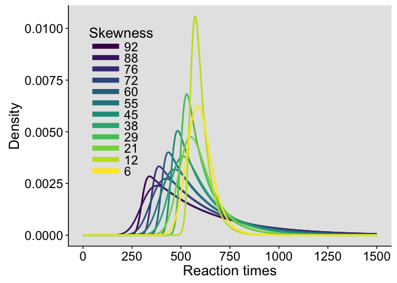

``` r
# save figure
ggsave(filename='figure_miller_distributions.pdf',width=7,height=5) #path=pathname
```

Population parameters
=====================

Summary table of population mean, median and non-parametric skewness for each of the 12 distributions. Non-parametric skewness is defined as mean - median.

``` r
tmp <- cbind(miller.param, round(pop.m), round(pop.md), round(pop.m - pop.md))
colnames(tmp) <- list("mu", "sigma", "tau", "mean", "median", "skewness")
kable(tmp, caption="Population parameters")
```

|   mu|  sigma|  tau|  mean|  median|  skewness|
|----:|------:|----:|-----:|-------:|---------:|
|  300|     20|  300|   600|     509|        92|
|  300|     50|  300|   600|     512|        88|
|  350|     20|  250|   600|     524|        76|
|  350|     50|  250|   600|     528|        72|
|  400|     20|  200|   600|     540|        60|
|  400|     50|  200|   600|     544|        55|
|  450|     20|  150|   600|     555|        45|
|  450|     50|  150|   600|     562|        38|
|  500|     20|  100|   600|     572|        29|
|  500|     50|  100|   600|     579|        21|
|  550|     20|   50|   600|     588|        12|
|  550|     50|   50|   600|     594|         6|

Table of parametric skewness & kurtosis. The relative differences between levels of parametric skewness and non-parametric skewness differ substantially. Kurtosis also varies non-linearly. Obviously, the shapes of Miller's distributions differ in several ways not captured by non-parametric skewness. But that's not important for the problem at hand, because the goal is to estimate bias from distributions with increasing differences between mean and median. No assumption is made about other aspects of the distributions.

``` r
tmp <- round(pop.sk,digits = 1)
colnames(tmp) <- list("Skewness", "Kurtosis")
kable(tmp, caption="Parametric skewness & kurtosis")
```

|  Skewness|  Kurtosis|
|---------:|---------:|
|       2.0|       8.9|
|       1.9|       8.6|
|       2.0|       8.9|
|       1.9|       8.6|
|       2.0|       8.9|
|       1.8|       8.3|
|       1.9|       8.7|
|       1.7|       7.9|
|       1.9|       8.5|
|       1.4|       6.9|
|       1.6|       7.5|
|       0.7|       4.5|

Simulation
==========

10,000 random samples of sizes 4, 6, 8, 10, 15, 20, 25, 35, 50 and 100, for each of the 12 distributions. We save all the sample means and medians to calculate bias (see below) and illustrate the distributions (in file `samp_dist`).

``` r
nvec <- c(4, 6, 8, 10, 15, 20, 25, 35, 50, 100)
nsim <- 10000 # simulation samples
nboot <- 200 # bootstrap bias correction

# declare matrices of results - save all iterations
sim.m <- array(NA, dim = c(nsim, nP, length(nvec))) # mean
sim.md <- array(NA, dim = c(nsim, nP, length(nvec))) # median
sim.md.bias <- array(NA, dim = c(nsim, nP, length(nvec))) # bias
sim.md.se <- array(NA, dim = c(nsim, nP, length(nvec))) # standard error
sim.md.bc <- array(NA, dim = c(nsim, nP, length(nvec))) # bias-correction median

set.seed(21)

for(iter.n in 1:length(nvec)){ # sample sizes
  print(paste0("sample size: ",nvec[iter.n],"..."))
  
  for(P in 1:nP){ # ex-Gaussian parameters
    print(paste0("parameters: ",P," out of ",nP,"..."))
    mu <- miller.param[P,1]
    sigma <- miller.param[P,2]
    tau <- miller.param[P,3]
    mc.data <- matrix(rexgauss(nvec[iter.n]*nsim, mu = mu, sigma = sigma, tau = tau), nrow=nsim)
    
    # compute estimates
    sim.m[,P,iter.n] <- apply(mc.data, 1, mean) # mean RTs
    sim.md[,P,iter.n] <- apply(mc.data, 1, median) # median RTs
    
    # compute bias corrected estimates using the same nboot bootstrap samples for all estimators
    bc.md <- vector(mode="numeric", length=nsim)
    for(iter in 1:nsim){
      boot.md <- apply(matrix(sample(mc.data[iter,], nvec[iter.n]*nboot, replace = TRUE), nrow=nboot), 1, median)
     sim.md.bc[iter,P,iter.n] <- 2 * sim.md[iter,P,iter.n] - mean(boot.md)
     sim.md.se[iter,P,iter.n] <- sd(boot.md) # bootstrap SE
     sim.md.bias[iter,P,iter.n] <- mean(boot.md) - sim.md[iter,P,iter.n] # estimated bias
    }
  }
}
save(
  sim.m,
  sim.md,
  sim.md.bc,
  sim.md.bias,
  sim.md.se,
  nvec,
  nsim,
  nboot,
  file=paste0('./data/sim_miller1988.RData'))
```

Compute bias
============

Bias = average of sample estimates minus population value.

``` r
load('./data/sim_miller1988.RData')
bias.m <- apply(sim.m, c(2,3), mean) - matrix(rep(pop.m, length(nvec)),nrow=nP)
bias.md <- apply(sim.md, c(2,3), mean) - matrix(rep(pop.md, length(nvec)),nrow=nP)
bias.md.bc <- apply(sim.md.bc, c(2,3), mean) - matrix(rep(pop.md, length(nvec)),nrow=nP)

# 50% HDI of mean bias
hdi.m <- array(NA, dim = c(2, nP, length(nvec))) 
for(iter.n in 1:length(nvec)){ 
  for(P in 1:nP){
      hdi.m[, P, iter.n] <- HDIofMCMC(sim.m[, P, iter.n]-pop.m[P], credMass=0.50)
  }
}
```

The 50% highest density intervals are computed using code from: &gt; Kruschke, J.K. (2013) Bayesian estimation supersedes the t test. J Exp Psychol Gen, 142, 573-603.

Table of bias results

``` r
tmp <- round(bias.md)
colnames(tmp) <- nvec
rownames(tmp) <- round(pop.m-pop.md)
 kable(tmp, caption = "Table of bias simulation results", booktabs = T)
```

|     |    4|    6|    8|   10|   15|   20|   25|   35|   50|  100|
|-----|----:|----:|----:|----:|----:|----:|----:|----:|----:|----:|
| 92  |   41|   26|   19|   18|    8|    8|    6|    4|    3|    1|
| 88  |   39|   27|   21|   16|   10|    7|    5|    5|    3|    2|
| 76  |   35|   23|   16|   12|    8|    7|    5|    4|    3|    1|
| 72  |   35|   24|   16|   14|    8|    6|    5|    4|    3|    2|
| 60  |   28|   18|   15|    9|    6|    6|    4|    3|    2|    1|
| 55  |   26|   18|   12|    9|    7|    5|    4|    3|    2|    1|
| 45  |   21|   14|   10|    9|    5|    4|    3|    2|    2|    1|
| 38  |   18|   11|    8|    7|    5|    3|    3|    1|    1|    1|
| 29  |   13|   10|    6|    5|    3|    2|    2|    1|    1|    0|
| 21  |    9|    6|    4|    4|    2|    2|    1|    1|    1|    0|
| 12  |    5|    4|    3|    2|    1|    1|    1|    1|    0|    0|
| 6   |    2|    2|    1|    0|    1|    0|    0|    0|    0|    0|

Columns = sample sizes

Rows = skewness

Our results are very close to Miller's:

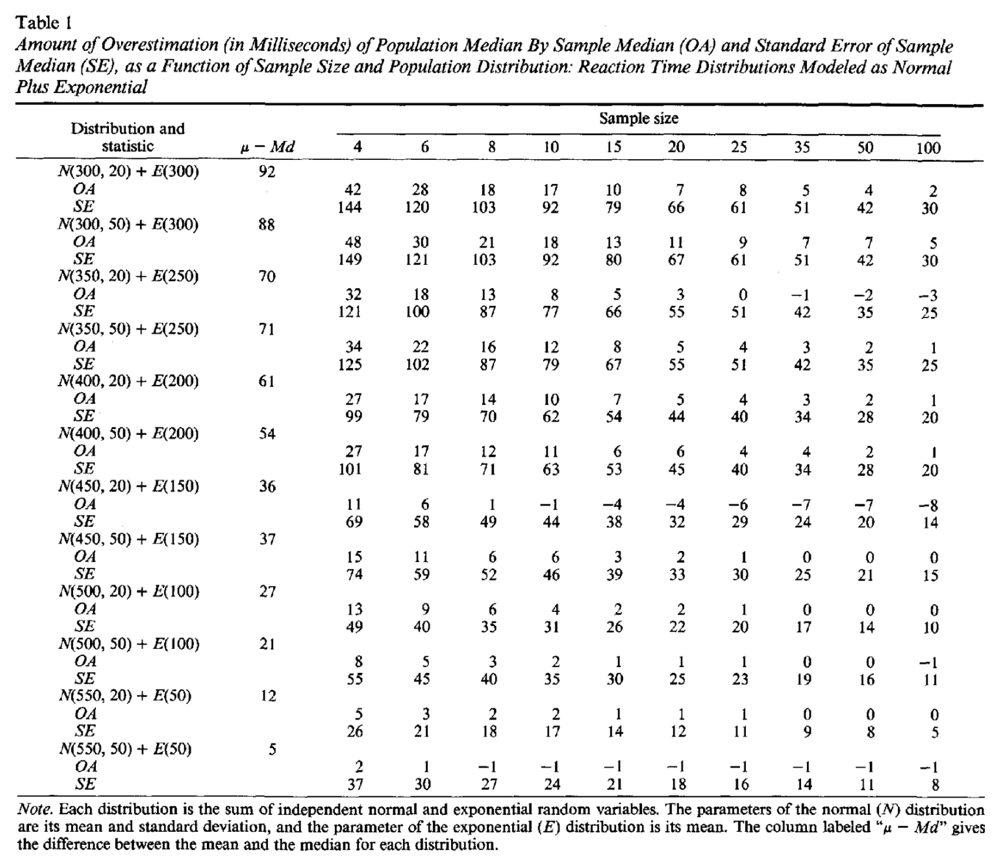

Illustrate bias results
=======================

Mean
----

``` r
df <- tibble(`Bias`=as.vector(bias.m),
             `Size`=rep(nvec,each=nP),
             `Skewness`=rep(round(pop.m - pop.md),length(nvec)))

df$Skewness <- as.character(df$Skewness)
df$Skewness <- factor(df$Skewness, levels=unique(df$Skewness))

# rect <- data.frame(xmin = -Inf, 
#                    xmax = Inf, 
#                    ymin = bias.m.hdi[1,12,10], 
#                    ymax = bias.m.hdi[2,12,10])
df.hdi <- tibble(Size = nvec,
                 ymin = hdi.m[1,12,],
                 ymax = hdi.m[2,12,]) # P=12=least skewness

# make plot
p <- ggplot(df.hdi) + theme_classic() +
  geom_ribbon(aes(x=Size, ymin=ymin, ymax=ymax), fill="grey90") +
  # geom_rect(data=rect, aes(xmin=xmin, xmax=xmax, ymin=ymin, ymax=ymax),
  #             colour="grey90", fill="grey90",
  #             inherit.aes = FALSE) +
  geom_line(data=df, aes(x=Size, y=Bias, colour = Skewness), size = 1) + 
  geom_abline(intercept=0, slope=0, colour="black") +
  scale_color_viridis(discrete = TRUE) +
  scale_x_continuous(breaks=nvec) + 
  scale_y_continuous(breaks=c(-5,seq(0,50,10))) +
  coord_cartesian(ylim=c(-6,50)) +
  theme(plot.title = element_text(size=22),
        axis.title.x = element_text(size = 18),
        axis.text.x = element_text(size = 14, colour="black"),
        axis.text.y = element_text(size = 16, colour="black"),
        axis.title.y = element_text(size = 18),
        legend.key.width = unit(1.5,"cm"),
        legend.position = c(0.85,0.70),
        legend.text=element_text(size=16),
        legend.title=element_text(size=18)) +
  labs(x = "Sample size", y = "Bias in ms") +
  guides(colour = guide_legend(override.aes = list(size=3))) + # make thicker legend lines
  ggtitle("Mean RT") 
p
```

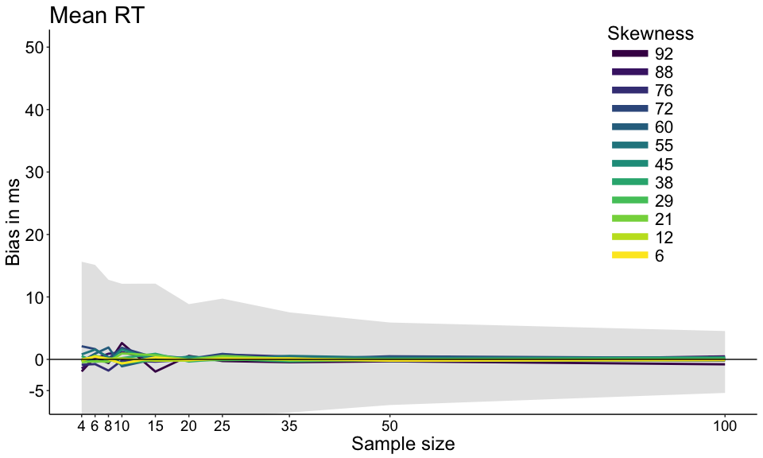

``` r
pm <- p
# save figure
ggsave(filename=paste0('figure_miller_bias_m.pdf'),width=10,height=6) #path=pathname
```

The grey area shows the 50% highest density interval (HDI) of the 10^{4} simulations, for the condition with the least skewness (6). For comparison, the same interval is shown in the illustrations of the median bias results. The HDIs also provide a useful reminder that bias is defined on average, in the long-run, but for a single experiment there is no guarantee whatsoever: the sample mean could be far from the population mean.

Median
------

``` r
df <- tibble(`Bias`=as.vector(bias.md),
             `Size`=rep(nvec,each=nP),
             `Skewness`=rep(round(pop.m - pop.md),length(nvec)))

df$Skewness <- as.character(df$Skewness)
df$Skewness <- factor(df$Skewness, levels=unique(df$Skewness))

# make plot
p <- ggplot(df.hdi) + theme_classic() +
  geom_ribbon(aes(x=Size, ymin=ymin, ymax=ymax), fill="grey90") +
  # geom_rect(data=rect, aes(xmin=xmin, xmax=xmax, ymin=ymin, ymax=ymax),
  #             colour="grey90", fill="grey90",
  #             inherit.aes = FALSE) +
  geom_line(data=df, aes(x=Size, y=Bias, colour = Skewness), size = 1) + 
  geom_abline(intercept=0, slope=0, colour="black") +
  scale_color_viridis(discrete = TRUE) +
  scale_x_continuous(breaks=nvec) + 
  scale_y_continuous(breaks=c(-5,seq(0,50,10))) +
  coord_cartesian(ylim=c(-6,50)) +
  theme(plot.title = element_text(size=22),
        axis.title.x = element_text(size = 18),
        axis.text.x = element_text(size = 14, colour="black"),
        axis.text.y = element_text(size = 16, colour="black"),
        axis.title.y = element_text(size = 18),
        legend.key.width = unit(1.5,"cm"),
        legend.position = "blank", #c(0.85,0.65),
        legend.text=element_text(size=16),
        legend.title=element_text(size=18)) +
  labs(x = "Sample size", y = "Bias in ms") +
  guides(colour = guide_legend(override.aes = list(size=3))) + # make thicker legend lines
  ggtitle("Median RT") 
p
```

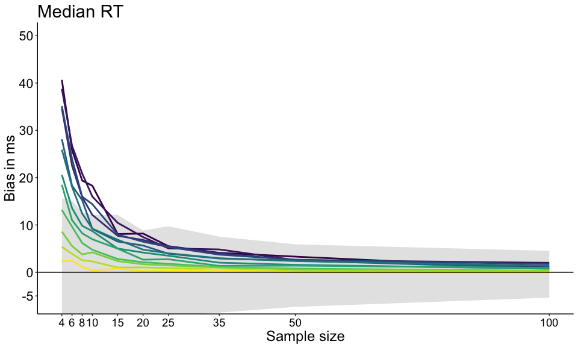

``` r
pmd <- p
# save figure
ggsave(filename=paste0('figure_miller_bias_md.pdf'),width=10,height=6) #path=pathname
```

Illustrate bias corrected results
=================================

``` r
df <- tibble(`Bias`=as.vector(bias.md.bc),
             `Size`=rep(nvec,each=nP),
             `Skewness`=rep(round(pop.m - pop.md),length(nvec)))

df$Skewness <- as.character(df$Skewness)
df$Skewness <- factor(df$Skewness, levels=unique(df$Skewness))

# make plot
p <- ggplot(df.hdi) + theme_classic() +
  geom_ribbon(aes(x=Size, ymin=ymin, ymax=ymax), fill="grey90") +
  # geom_rect(data=rect, aes(xmin=xmin, xmax=xmax, ymin=ymin, ymax=ymax),
  #             colour="grey90", fill="grey90",
  #             inherit.aes = FALSE) +
  geom_line(data=df, aes(x=Size, y=Bias, colour = Skewness), size = 1) + 
  geom_abline(intercept=0, slope=0, colour="black") +
  scale_color_viridis(discrete = TRUE) +
  scale_x_continuous(breaks=nvec) + 
  scale_y_continuous(breaks=c(-5,seq(0,50,10))) +
  coord_cartesian(ylim=c(-6,50)) +
  theme(plot.title = element_text(size=22),
        axis.title.x = element_text(size = 18),
        axis.text.x = element_text(size = 14, colour="black"),
        axis.text.y = element_text(size = 16, colour="black"),
        axis.title.y = element_text(size = 18),
        legend.key.width = unit(1.5,"cm"),
        legend.position = "blank",#c(0.85,0.65),
        legend.text=element_text(size=16),
        legend.title=element_text(size=18)) +
  labs(x = "Sample size", y = "Bias in ms") +
  guides(colour = guide_legend(override.aes = list(size=3))) + # make thicker legend lines
  ggtitle("Median RT with bias correction") 
p
```

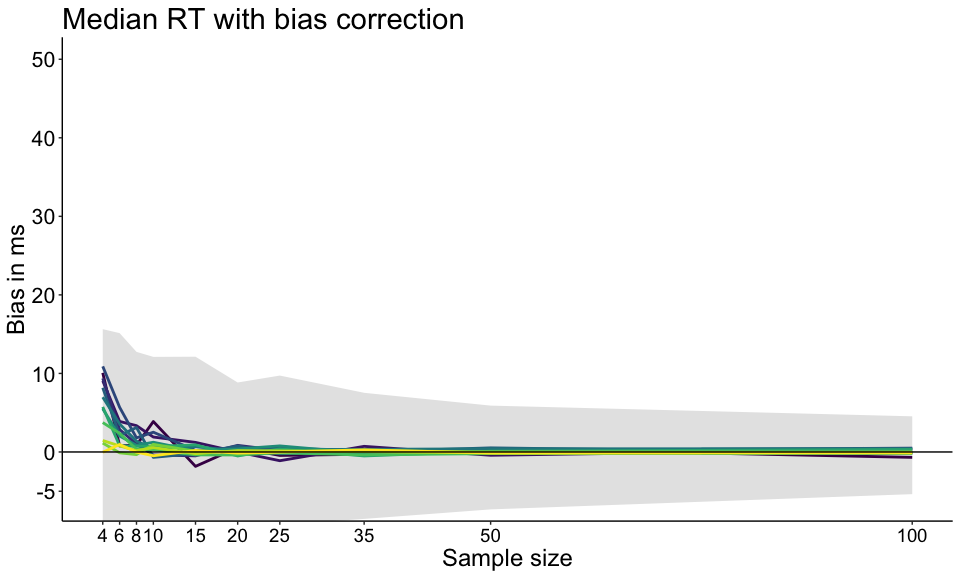

``` r
pmd.bc <- p
# save figure
ggsave(filename=paste0('figure_miller_bias_md_bc.pdf'),width=10,height=6) #path=pathname
```

Summary figure
==============

``` r
# combine panels into one figure
cowplot::plot_grid(pm, pmd, pmd.bc, 
                          labels = c("A", "B", "C"),
                          ncol = 1,
                          nrow = 3,
                          rel_widths = c(1, 1, 1), 
                          label_size = 20, 
                          hjust = -0.5, 
                          scale=.95,
                          align = "h")
# save figure
ggsave(filename=paste0('figure_miller_bias_summary.pdf'),width=10,height=15) #path=pathname
```

Bias/SE &lt; 0.25?
==================

Efron & Tibshirani (1993) suggest that as a rule of thumb, bias/SE &lt; 0.25 can be ignored.

Compute bias/SE
---------------

Compute proportion of simulations with bias/SE &gt; 0.25

``` r
load('./data/sim_miller1988.RData')
pbse <- apply(abs((sim.md.bias / sim.md.se)) > 0.25, c(2,3), mean)
```

Illustrate P(bias/SE &gt; 0.25)
-------------------------------

``` r
df <- tibble(`Bias`=as.vector(pbse),
             `Size`=rep(nvec,each=nP),
             `Skew`=rep(round(pop.m - pop.md),length(nvec)))

df$Skew <- as.character(df$Skew)
df$Skew <- factor(df$Skew, levels=unique(df$Skew))

# make plot
p <- ggplot(df, aes(x=Size, y=Bias), group=Skew) + theme_classic() +
  geom_line(aes(colour = Skew), size = 1) + 
  geom_abline(intercept=0, slope=0, colour="black") +
  scale_color_viridis(discrete = TRUE) +
  scale_x_continuous(breaks=nvec) + 
  scale_y_continuous(limits=c(0,1), breaks=seq(0,1,0.25)) +
  theme(plot.title = element_text(size=22),
    axis.title.x = element_text(size = 18),
    axis.text.x = element_text(size = 14, colour="black"),
    axis.text.y = element_text(size = 16, colour="black"),
    axis.title.y = element_text(size = 18),
    legend.key.width = unit(1.5,"cm"),
    legend.position = "blank",#c(0.85,0.65),
    legend.text=element_text(size=16),
    legend.title=element_text(size=18)) +
  labs(x = "Sample size", y = "P(bias/SE > 0.25)") +
  guides(colour = guide_legend(override.aes = list(size=3))) # make thicker legend lines
p
```

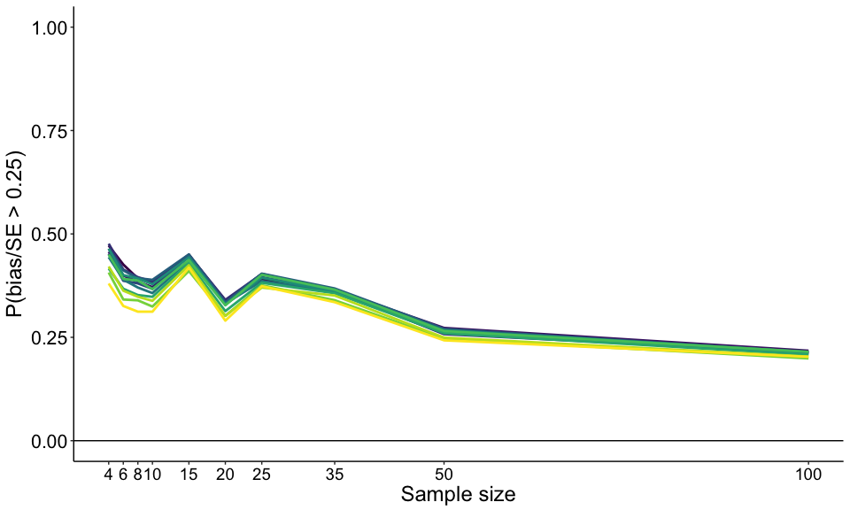 The proportion of experiments / simulations with bias/SE ratio larger than 0.25 is high overall, and decreases with sample size. So, following Efron & Tibshirani (1993)'s rule of thumb, median bias will tend to impact the accuracy of confidence intervals, especially with small sample sizes.

Check bias correction
=====================

Here we investigate how well bias correction works as a function of sample size and skewness. The smaller the sample size, the less the bootstrap can estimate the sampling distribution and its bias. Ideally, after bias correction, we would expect the sample medians to be centred around zero, with limited variability. This ideal situation could look something like that, considering the most skewed distribution with the smallest sample size.

``` r
# load('./data/sim_miller1988.RData')
P <- 1 # 1=most skewed distribution; 12=least
N <- 1 # 1=smallest sample size; 10=largest

set.seed(21)
df <- tibble(`ORI`=sim.md[,P,N]-pop.md[P],
             `BC`=runif(nsim, min=-50, max=50)*rnorm(nsim))

# for(N in 1:length(nvec)){
# make plot
p <- ggplot(df, aes(x=ORI, y=BC)) + theme_classic() +
  # geom_line(aes(colour = Skewness), size = 1) + 
  geom_point(colour="grey50", alpha=0.3) +
  geom_abline(intercept=0, slope=1, colour="black") +
  geom_vline(xintercept = 0, colour="black") +
  geom_hline(yintercept = 0, colour="black") +
  geom_vline(xintercept = mean(df$ORI), colour="red") + # bias
  geom_hline(yintercept = mean(df$BC), colour="green") + # bias after BBC
  # scale_color_viridis(discrete = TRUE) +
  scale_x_continuous(breaks=seq(-600,1000,200)) +
  scale_y_continuous(breaks=seq(-600,1000,200)) +
  coord_cartesian(xlim=c(-600,1000), ylim=c(-600,1000)) +
  theme(plot.title = element_text(size=22),
        axis.title.x = element_text(size = 18),
        axis.text.x = element_text(size = 14, colour="black"),
        axis.text.y = element_text(size = 16, colour="black"),
        axis.title.y = element_text(size = 18),
        legend.key.width = unit(1.5,"cm"),
        legend.position = "blank",#c(0.85,0.65),
        legend.text=element_text(size=16),
        legend.title=element_text(size=18)) +
  labs(x = "Median bias", y = "Ideal median bias after correction") +
  guides(colour = guide_legend(override.aes = list(size=3))) # make thicker legend lines
  # ggtitle("Bias correction: direction") 
p
```

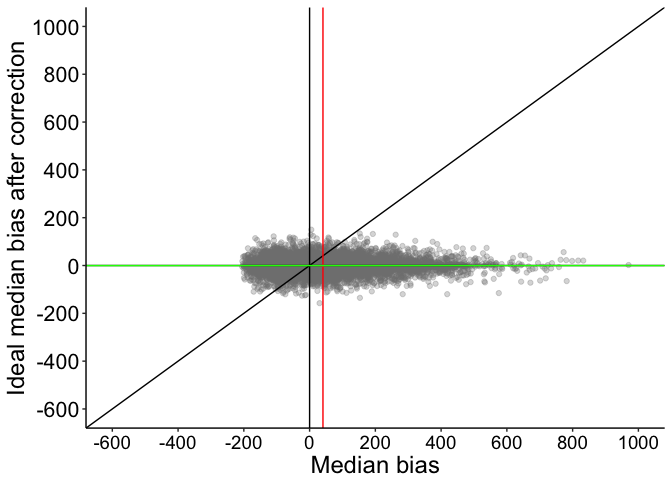

``` r
# p.bc.dir <- p
# save figure
ggsave(filename=paste0('figure_miller_bc_ideal_P',P,'_N',nvec[N],'.pdf'),width=10,height=7) 
# }
```

The reality is very different.

Figure without markup:

``` r
# load('./data/sim_miller1988.RData')
P <- 1 # 1=most skewed distribution; 12=least
N <- 1 # 1=smallest sample size; 10=largest

# for(N in 1:length(nvec)){
  # for(P in 1:nP){
    
    df <- tibble(`ORI`=sim.md[,P,N]-pop.md[P],
                 `BC`=sim.md.bc[,P,N]-pop.md[P])
    
    # make plot
    p <- ggplot(df, aes(x=ORI, y=BC)) + theme_classic() +
      geom_point(colour="grey50", alpha=0.3) +
      geom_abline(intercept=0, slope=1, colour="black") +
      geom_vline(xintercept = 0, colour="black") +
      geom_hline(yintercept = 0, colour="black") +
      geom_vline(xintercept = mean(df$ORI), colour="red") + # bias
      geom_hline(yintercept = mean(df$BC), colour="green") + # bias after BBC
      scale_x_continuous(breaks=seq(-600,1000,200)) +
      scale_y_continuous(breaks=seq(-600,1000,200)) +
      coord_cartesian(xlim=c(-600,1000), ylim=c(-600,1000)) +
      theme(plot.title = element_text(size=22),
        axis.title.x = element_text(size = 18),
        axis.text.x = element_text(size = 14, colour="black"),
        axis.text.y = element_text(size = 16, colour="black"),
        axis.title.y = element_text(size = 18),
        legend.key.width = unit(1.5,"cm"),
        legend.position = c(0.15,0.65),
        legend.text=element_text(size=18),
        legend.title=element_blank()) + #element_text(size=18)) +
      labs(x = "Median bias", y = "Median bias after correction") +
      guides(colour = guide_legend(override.aes = list(size=3))) # make thicker legend lines
    # ggtitle("Bias correction: direction") 
    p
```

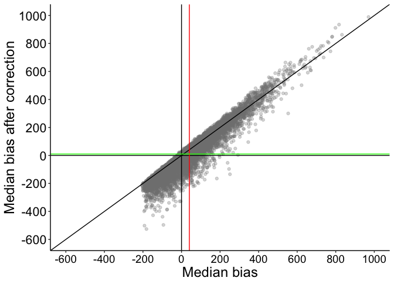

``` r
    # p.bc.dir <- p
    # save figure
    ggsave(filename=paste0('figure_miller_bc_check_P',P,'_N',nvec[N],'.pdf'),width=10,height=7)
  # }
# }
```

Figure with markup:

``` r
# load('./data/sim_miller1988.RData')
P <- 1 # 1=most skewed distribution; 12=least
N <- 1 # 1=smallest sample size; 10=largest

# define triangles
df.triangle <- tibble(x=c(-600,0,0, 0,0,500, 0,800,800, 0,0,1000, -200,0,0, -300,0,-300), 
                      y=c(-600,-600,0, -500,0,0, 0,0,800, 0,1000,1000, 0,0,200, 0,0,-300),
                      g=factor(c(rep("neg: over wrong",3),
                                 rep("pos: over right",3),
                                 rep("pos: under right",3),
                                 rep("pos: over wrong",3),
                                 rep("neg: over right",3),
                                 rep("neg: under right",3)))
                      )

# define colour palette
cbPalette <- c("#999999", "#E69F00", "#56B4E9", "#009E73", "#0072B2", "#D55E00")

# for(N in 1:length(nvec)){
  # for(P in 1:nP){
    
    df <- tibble(`ORI`=sim.md[,P,N]-pop.md[P],
                 `BC`=sim.md.bc[,P,N]-pop.md[P])
    
    # make plot
    # p <- ggplot(df, aes(x=ORI, y=BC)) + theme_classic() +
      p <- ggplot(df.triangle, aes(x=x, y=y)) + theme_classic() +
        geom_polygon(aes(group=g, fill=g), alpha=1) + 
        scale_fill_manual(values=cbPalette) +
      geom_point(data=df, aes(x=ORI, y=BC), colour="white", alpha=0.4) +
      geom_abline(intercept=0, slope=1, colour="black") +
      geom_vline(xintercept = 0, colour="black") +
      geom_hline(yintercept = 0, colour="black") +
      geom_vline(xintercept = mean(df$ORI), colour="red") + # bias
      geom_hline(yintercept = mean(df$BC), colour="green") + # bias after BBC
      scale_x_continuous(breaks=seq(-600,1000,200)) +
      scale_y_continuous(breaks=seq(-600,1000,200)) +
      coord_cartesian(xlim=c(-600,1000), ylim=c(-600,1000)) +
      theme(plot.title = element_text(size=22),
        axis.title.x = element_text(size = 18),
        axis.text.x = element_text(size = 14, colour="black"),
        axis.text.y = element_text(size = 16, colour="black"),
        axis.title.y = element_text(size = 18),
        legend.key.width = unit(1.5,"cm"),
        legend.position = c(0.15,0.65),
        legend.text=element_text(size=18),
        legend.title=element_blank()) + #element_text(size=18)) +
      labs(x = "Median bias", y = "Median bias after correction") +
      guides(colour = guide_legend(override.aes = list(size=3))) # make thicker legend lines
    # ggtitle("Bias correction: direction") 
    p
```

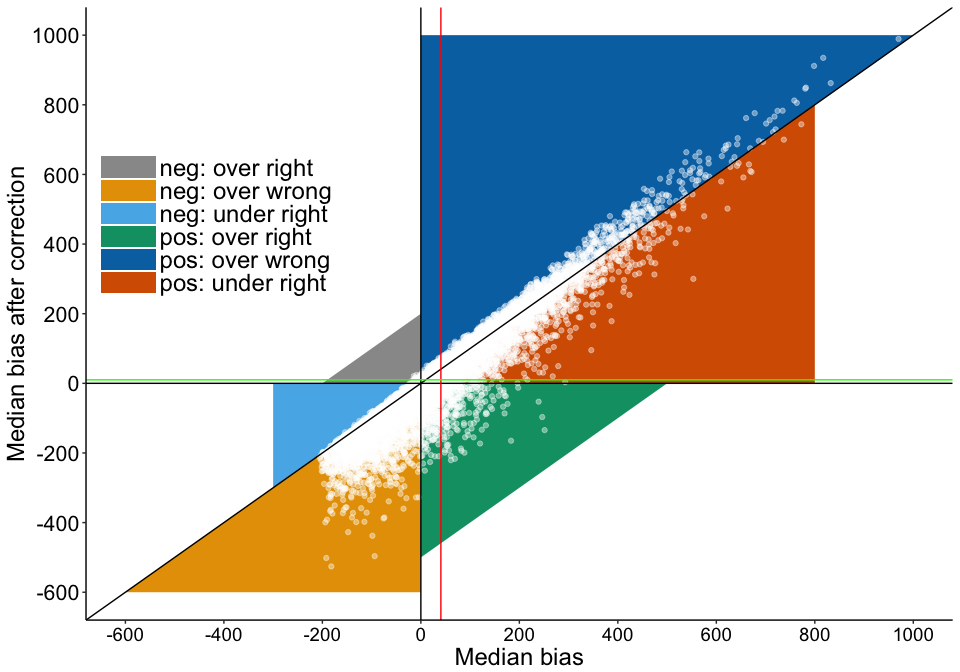

``` r
    # p.bc.dir <- p
    # save figure
    ggsave(filename=paste0('figure_miller_bc_check_P',P,'_N',nvec[N],'_markup.pdf'),width=10,height=7)
  # }
# }
```

If the original bias is negative, after correction, the median tends to be even more negative, so over corrected in the wrong direction (lower left triangle).

If the original bias is positive, after correction, the median is either:
- over corrected in the right direction (lower right triangle)
- under corrected in the right direction (middle right triangle)
- over corrected in the wrong direction (upper right triangle)

This pattern remains, although attenuated, if we consider the largest sample size:

``` r
# load('./data/sim_miller1988.RData')
P <- 1 # 1=most skewed distribution; 12=least
N <- 10 # 1=smallest sample size; 10=largest

df <- tibble(`ORI`=sim.md[,P,N]-pop.md[P],
             `BC`=sim.md.bc[,P,N]-pop.md[P])

# for(N in 1:length(nvec)){
# make plot
p <- ggplot(df, aes(x=ORI, y=BC)) + theme_classic() +
  # geom_line(aes(colour = Skewness), size = 1) + 
  geom_point(colour="grey50", alpha=0.3) +
  geom_abline(intercept=0, slope=1, colour="black") +
  geom_vline(xintercept = 0, colour="black") +
  geom_hline(yintercept = 0, colour="black") +
  geom_vline(xintercept = mean(df$ORI), colour="red") + # bias
  geom_hline(yintercept = mean(df$BC), colour="green") + # bias after BBC
  # scale_color_viridis(discrete = TRUE) +
  scale_x_continuous(breaks=seq(-200,200,50)) +
  scale_y_continuous(breaks=seq(-200,200,50)) +
  coord_cartesian(xlim=c(-200,200), ylim=c(-200,200)) +
  theme(plot.title = element_text(size=22),
        axis.title.x = element_text(size = 18),
        axis.text.x = element_text(size = 14, colour="black"),
        axis.text.y = element_text(size = 16, colour="black"),
        axis.title.y = element_text(size = 18),
        legend.key.width = unit(1.5,"cm"),
        legend.position = "blank",#c(0.85,0.65),
        legend.text=element_text(size=16),
        legend.title=element_text(size=18)) +
  labs(x = "Median bias", y = "Median bias after correction") +
  guides(colour = guide_legend(override.aes = list(size=3))) # make thicker legend lines
  # ggtitle("Bias correction: direction") 
p
```


``` r
# p.bc.dir <- p
# save figure
ggsave(filename=paste0('figure_miller_bc_check_P',P,'_N',nvec[N],'.pdf'),width=10,height=7)
# }
```

Or if we consider the least skewed distribution.

``` r
# load('./data/sim_miller1988.RData')
P <- 12 # 1=most skewed distribution; 12=least
N <- 1 # 1=smallest sample size; 10=largest

df <- tibble(`ORI`=sim.md[,P,N]-pop.md[P],
             `BC`=sim.md.bc[,P,N]-pop.md[P])

# for(N in 1:length(nvec)){
# make plot
p <- ggplot(df, aes(x=ORI, y=BC)) + theme_classic() +
  # geom_line(aes(colour = Skewness), size = 1) + 
  geom_point(colour="grey50", alpha=0.3) +
  geom_abline(intercept=0, slope=1, colour="black") +
  geom_vline(xintercept = 0, colour="black") +
  geom_hline(yintercept = 0, colour="black") +
  geom_vline(xintercept = mean(df$ORI), colour="red") + # bias
  geom_hline(yintercept = mean(df$BC), colour="green") + # bias after BBC
  # scale_color_viridis(discrete = TRUE) +
 scale_x_continuous(breaks=seq(-200,200,50)) +
  scale_y_continuous(breaks=seq(-200,200,50)) +
  coord_cartesian(xlim=c(-200,200), ylim=c(-200,200)) +
  theme(plot.title = element_text(size=22),
        axis.title.x = element_text(size = 18),
        axis.text.x = element_text(size = 14, colour="black"),
        axis.text.y = element_text(size = 16, colour="black"),
        axis.title.y = element_text(size = 18),
        legend.key.width = unit(1.5,"cm"),
        legend.position = "blank",#c(0.85,0.65),
        legend.text=element_text(size=16),
        legend.title=element_text(size=18)) +
  labs(x = "Median bias", y = "Median bias after correction") +
  guides(colour = guide_legend(override.aes = list(size=3))) # make thicker legend lines
  # ggtitle("Bias correction: direction") 
p
```

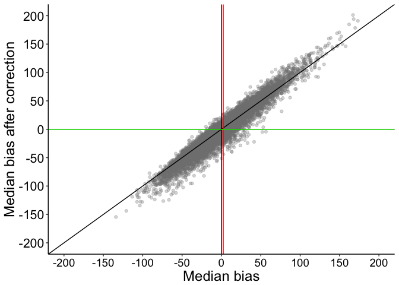

``` r
# p.bc.dir <- p
# save figure
ggsave(filename=paste0('figure_miller_bc_check_P',P,'_N',nvec[N],'.pdf'),width=10,height=7)
# }
```

We can look at the different patterns as a function of sample size and skewness.

Illustrate results: neg over wrong
----------------------------------

``` r
m <- matrix(rep(pop.md, length(nvec)), nrow=nP)
POP <- aperm(replicate(nsim, m, simplify = "array"), c(3,1,2)) # 3D array
BIAS <- sim.md - POP
bc.res <- apply((sign(BIAS) == -1) * (sim.md.bc < sim.md ), c(2,3), sum) / 
            apply((sign(BIAS) == -1), c(2,3), sum)

df <- tibble(`Bias`=as.vector(bc.res),
             `Size`=rep(nvec,each=nP),
             `Skewness`=rep(round(pop.m - pop.md),length(nvec)))

df$Skewness <- as.character(df$Skewness)
df$Skewness <- factor(df$Skewness, levels=unique(df$Skewness))

# compute expected proportion in ideal situation
set.seed(21)
BC=runif(nsim, min=-50, max=50)*rnorm(nsim)
N <- 1 # smallest n
P <- 1 # most skewed
BIAS=sim.md[,P,N]-pop.md[P]
REF= sum((sign(BIAS) == -1) * (BC < BIAS)) / 
            sum(sign(BIAS) == -1)
  
# make plot
p <- ggplot(df, aes(x=Size, y=Bias)) + theme_classic() +
  geom_line(aes(colour = Skewness), size = 1) + 
  geom_hline(yintercept=REF, colour="black") +
  scale_color_viridis(discrete = TRUE) +
  scale_x_continuous(breaks=nvec) + 
  scale_y_continuous(breaks=seq(0,1,.1)) +
  coord_cartesian(ylim=c(0.5,1)) +
  theme(plot.title = element_text(size=22),
        axis.title.x = element_text(size = 18),
        axis.text.x = element_text(size = 14, colour="black"),
        axis.text.y = element_text(size = 16, colour="black"),
        axis.title.y = element_text(size = 18),
        legend.key.width = unit(1.5,"cm"),
        legend.position = c(0.55,0.85),
        legend.direction = "horizontal",
        legend.text=element_text(size=16),
        legend.title=element_text(size=18)) +
  labs(x = "Sample size", y = "P(over + wrong | neg)") +
  guides(colour = guide_legend(override.aes = list(size=3))) + # make thicker legend lines
  ggtitle("Negative bias: P(over + wrong)") 
p
```

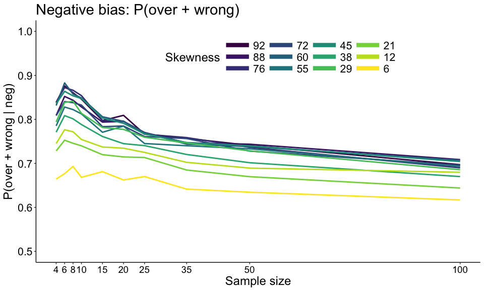

``` r
# p.bc.dir <- p
# save figure
ggsave(filename=paste0('figure_miller_bc_check_neg_over_wrong.pdf'),width=10,height=6)
```

In the ideal situation illustrated previously, the expected proportion of over correction in the wrong direction, given an original negative bias, is 6.7%. So here, we clearly have an overrepresentation of these cases. When the original bias is negative, in most cases the bootstrap is unable to correct in the right direction. The situation gets worse with increasing skewness and smaller sample sizes.

Illustrate results: pos under right
-----------------------------------

``` r
m <- matrix(rep(pop.md, length(nvec)), nrow=nP)
POP <- aperm(replicate(nsim, m, simplify = "array"), c(3,1,2)) # 3D array
BIAS <- sim.md - POP
bc.res <- apply((sign(BIAS) == 1) * (sim.md.bc < sim.md) * (sign(sim.md.bc) == 1), c(2,3), sum) / 
            apply((sign(BIAS) == 1), c(2,3), sum)

df <- tibble(`Bias`=as.vector(bc.res),
             `Size`=rep(nvec,each=nP),
             `Skewness`=rep(round(pop.m - pop.md),length(nvec)))

df$Skewness <- as.character(df$Skewness)
df$Skewness <- factor(df$Skewness, levels=unique(df$Skewness))

# compute expected proportion in ideal situation
set.seed(21)
BC=runif(nsim, min=-50, max=50)*rnorm(nsim)
N <- 1 # smallest n
P <- 1 # most skewed
BIAS=sim.md[,P,N]-pop.md[P]
REF= sum((sign(BIAS) == 1) * (BC < BIAS) * (sign(BC)==1)) / 
            sum(sign(BIAS) == 1)

# make plot
p <- ggplot(df, aes(x=Size, y=Bias)) + theme_classic() +
  geom_line(aes(colour = Skewness), size = 1) + 
  geom_hline(yintercept=REF, colour="black") +
  scale_color_viridis(discrete = TRUE) +
  scale_x_continuous(breaks=nvec) + 
  scale_y_continuous(breaks=seq(0,1,.1)) +
  coord_cartesian(ylim=c(0.3,0.8)) +
  theme(plot.title = element_text(size=22),
        axis.title.x = element_text(size = 18),
        axis.text.x = element_text(size = 14, colour="black"),
        axis.text.y = element_text(size = 16, colour="black"),
        axis.title.y = element_text(size = 18),
        legend.key.width = unit(1.5,"cm"),
        legend.position = c(0.55,0.85),
        legend.direction = "horizontal",
        legend.text=element_text(size=16),
        legend.title=element_text(size=18)) +
  labs(x = "Sample size", y = "P(under + right | pos)") +
  guides(colour = guide_legend(override.aes = list(size=3))) + # make thicker legend lines
  ggtitle("Positive bias: P(under + right)") 
p
```

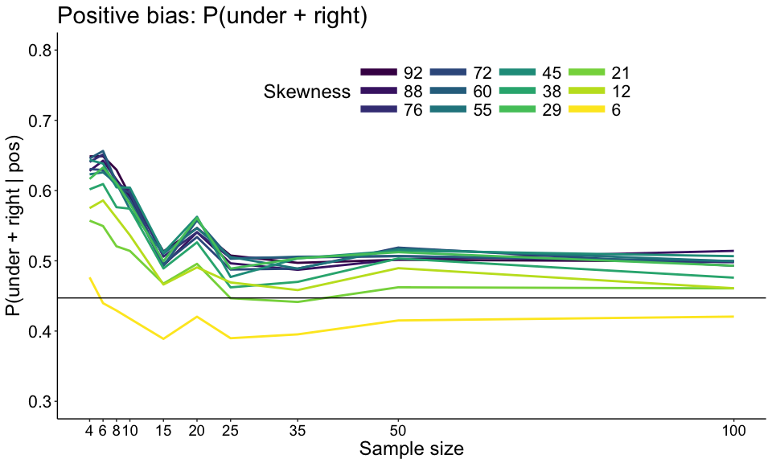

``` r
# p.bc.dir <- p
# save figure
ggsave(filename=paste0('figure_miller_bc_check_pos_under_right.pdf'),width=10,height=6)
```

In the ideal situation illustrated previously, the expected proportion of under correction in the right direction, given an original positive bias, is 44.7%. So here, we have an overrepresentation of these cases. When the original bias is positive, in too many cases the bootstrap corrects in the right direction, but it undercorrects. The situation gets worse with increasing skewness and smaller sample sizes.
