Miller 1988: extension to effect sizes
================
Guillaume A. Rousselet
April 4, 2018

-   [Define ex-Gaussian parameters from Table 1](#define-ex-gaussian-parameters-from-table-1)
-   [Estimate population parameters from large samples](#estimate-population-parameters-from-large-samples)
-   [Simulation: effect sizes using the mean and the median](#simulation-effect-sizes-using-the-mean-and-the-median)
-   [Compute effect sizes and biases](#compute-effect-sizes-and-biases)
-   [Results for Cohen's *d*](#results-for-cohens-d)
    -   [Illustrate: Mean effect size](#illustrate-mean-effect-size)
    -   [Illustrate: Bias of mean effect size](#illustrate-bias-of-mean-effect-size)
    -   [Illustrate: mean](#illustrate-mean)
    -   [Illustrate: mean effect size denominator](#illustrate-mean-effect-size-denominator)
    -   [Illustrate: Bias of mean effect size denominator](#illustrate-bias-of-mean-effect-size-denominator)
    -   [Illustrate: sampling distribution of SD](#illustrate-sampling-distribution-of-sd)
    -   [Illustrate: sampling distribution of mean effect size](#illustrate-sampling-distribution-of-mean-effect-size)
    -   [Illustrate: Bias of mean effect size after bias correction](#illustrate-bias-of-mean-effect-size-after-bias-correction)
    -   [Illustrate: Bias of mean effect size denominator after bias correction](#illustrate-bias-of-mean-effect-size-denominator-after-bias-correction)
    -   [Illustrate: mean effect size denominator after bias correction](#illustrate-mean-effect-size-denominator-after-bias-correction)
-   [Results for robust equivalent to Cohen's *d*](#results-for-robust-equivalent-to-cohens-d)
    -   [Illustrate: Median effect size](#illustrate-median-effect-size)
    -   [Illustrate: Median effect size - bias corrected](#illustrate-median-effect-size---bias-corrected)
    -   [Illustrate: Median](#illustrate-median)
    -   [Illustrate: Median - bias corrected](#illustrate-median---bias-corrected)
    -   [Illustrate: bias of the median](#illustrate-bias-of-the-median)
    -   [Illustrate: bias of the median after bias correction](#illustrate-bias-of-the-median-after-bias-correction)
    -   [Illustrate: Bias of median effect size](#illustrate-bias-of-median-effect-size)
    -   [Illustrate: Bias of median effect size after bias correction](#illustrate-bias-of-median-effect-size-after-bias-correction)
    -   [Illustrate: Bias of median effect size denominator](#illustrate-bias-of-median-effect-size-denominator)
    -   [Illustrate: Bias of median effect size denominator - bias corrected](#illustrate-bias-of-median-effect-size-denominator---bias-corrected)

``` r
# dependencies
library(ggplot2)
library(tibble)
library(tidyr)
library(cowplot)
library(retimes)
library(viridis)
source("./functions/Rallfun-v34.txt")
source("./functions/functions.txt")
source("./functions/HDIofMCMC.txt")
```

Define ex-Gaussian parameters from Table 1
==========================================

Save matrix with 3 parameters: - mean of the normal distribution - standard deviation of the normal distribution - mean of the exponential distribution

``` r
miller.param <- matrix(0, ncol=3, nrow=12)
miller.param[1,] <- c(300, 20, 300)
miller.param[2,] <- c(300, 50, 300)
miller.param[3,] <- c(350, 20, 250)
miller.param[4,] <- c(350, 50, 250)
miller.param[5,] <- c(400, 20, 200)
miller.param[6,] <- c(400, 50, 200)
miller.param[7,] <- c(450, 20, 150)
miller.param[8,] <- c(450, 50, 150)
miller.param[9,] <- c(500, 20, 100)
miller.param[10,] <- c(500, 50, 100)
miller.param[11,] <- c(550, 20, 50)
miller.param[12,] <- c(550, 50, 50)
```

Estimate population parameters from large samples
=================================================

Miller used 10,000 samples; we use 1,000,000. To compute effect sizes, for simplicity we consider a null value of zero. Cohen's *d* is implemented in `D.akp.effect`, from `Rallfun-v34`, by setting `tr=0`. It is computed as: `mean() / sd()`. The median normalised by the percentage bend midvariance is implemented in `med.effect.1gp`. It is computed as: `median() / pbvar()`, where `pbvar` is the percentage bend midvariance, a scale estimator that relies on the median.

``` r
set.seed(4)
pop.m <- vector(mode="numeric", length=12)
pop.m.den <- vector(mode="numeric", length=12)
pop.m.es <- vector(mode="numeric", length=12)
pop.md <- vector(mode="numeric", length=12)
pop.md.den <- vector(mode="numeric", length=12)
pop.md.es <- vector(mode="numeric", length=12)
n <- 1000000
nP <- length(miller.param[,1])
for(P in 1:nP){
  mu <- miller.param[P,1]
  sigma <- miller.param[P,2]
  tau <- miller.param[P,3]
  pop <- rexgauss(n, mu = mu, sigma = sigma, tau = tau)
  pop.m[P] <- mean(pop)
  pop.md[P] <- sort(pop)[round(length(pop)*0.5)] # median(pop)
  pop.m.den[P] <- sd(pop) # exact formula should divide by n, not n-1, but makes negligeable difference
  pop.md.den[P] <- sqrt(pbvar(pop)) # percentage bend midvariance
  pop.m.es[P] <- pop.m[P] / pop.m.den[P] # Cohen's d
  pop.md.es[P] <- pop.md[P] / pop.md.den[P] # robust equivalent of Cohen's d
}
round(pop.m)
```

    ##  [1] 600 600 600 600 600 600 600 600 600 600 600 600

``` r
round(pop.md)
```

    ##  [1] 509 512 524 528 540 544 555 562 572 579 588 594

``` r
round(pop.m - pop.md) # measure of skewness
```

    ##  [1] 92 88 76 72 60 55 45 38 29 21 12  6

``` r
round(pop.m.den)
```

    ##  [1] 301 304 251 255 201 206 151 158 102 112  54  71

``` r
round(pop.md.den)
```

    ##  [1] 216 224 180 190 145 157 110 126  76  95  44  68

``` r
round(pop.m.es, digits=1)
```

    ##  [1]  2.0  2.0  2.4  2.4  3.0  2.9  4.0  3.8  5.9  5.4 11.1  8.5

``` r
round(pop.md.es, digits=1)
```

    ##  [1]  2.4  2.3  2.9  2.8  3.7  3.5  5.0  4.5  7.5  6.1 13.3  8.8

Simulation: effect sizes using the mean and the median
======================================================

10000 random samples of sizes 2, 4, 6, 8, 10, 15, 20, 25, 35, 50 and 100.

``` r
nvec <- c(4, 6, 8, 10, 15, 20, 25, 35, 50, 100)
nsim <- 10000 # simulation samples
nboot <- 200 # bootstrap bias correction

# declare matrices
sim.m <- array(NA, dim = c(nsim, nP, length(nvec))) 
sim.m.den <- array(NA, dim = c(nsim, nP, length(nvec)))
sim.m.den.bc <- array(NA, dim = c(nsim, nP, length(nvec)))
sim.md <- array(NA, dim = c(nsim, nP, length(nvec))) 
sim.md.bc <- array(NA, dim = c(nsim, nP, length(nvec))) 
sim.md.den <- array(NA, dim = c(nsim, nP, length(nvec)))
sim.md.den.bc <- array(NA, dim = c(nsim, nP, length(nvec)))

set.seed(21)

for(iter.n in 1:length(nvec)){
  print(paste0("sample size: ",nvec[iter.n],"..."))
  
  for(P in 1:nP){
    # print(paste0("parameters: ",P," out of ",nP,"..."))
    mu <- miller.param[P,1]
    sigma <- miller.param[P,2]
    tau <- miller.param[P,3]
    mc.data <- matrix(rexgauss(nvec[iter.n]*nsim, mu = mu, sigma = sigma, tau = tau), nrow=nsim)
    
    # compute estimates
    sim.m[,P,iter.n] <- apply(mc.data, 1, mean) # mean of nsim median RTs
    sim.m.den[,P,iter.n] <- apply(mc.data, 1, sd) # mean of nsim median RTs
    sim.md[,P,iter.n] <- apply(mc.data, 1, median) # mean of nsim median RTs
    sim.md.den[,P,iter.n] <- sqrt(apply(mc.data, 1, pbvar)) # mean of nsim median RTs
    
    # compute bias corrected estimates using nboot bootstrap samples
    for(iter in 1:nsim){
      boot.md <- vector(mode="numeric", length=nboot)
      boot.md.den <- vector(mode="numeric", length=nboot)
      boot.m.den <- vector(mode="numeric", length=nboot)
      for(b in 1:nboot){
        bootsamp <- sample(mc.data[iter,], nvec[iter.n], replace = TRUE)
        boot.md[b] <- median(bootsamp)
        boot.md.den[b] <- sqrt(pbvar(bootsamp))
        boot.m.den[b] <- sd(bootsamp)
      }
      sim.md.bc[iter,P,iter.n] <- 2*sim.md[iter,P,iter.n] - mean(boot.md) # bias correction
      sim.md.den.bc[iter,P,iter.n] <- 2*sim.md.den[iter,P,iter.n] - mean(boot.md.den[is.finite(boot.md.den)]) # bias correction
      sim.m.den.bc[iter,P,iter.n] <- 2*sim.m.den[iter,P,iter.n] - mean(boot.m.den[is.finite(boot.m.den)]) # bias correction
    }
  }
}
save(
  sim.m,
  sim.m.den,
  sim.m.den.bc,
  sim.md,
  sim.md.bc,
  sim.md.den,
  sim.md.den.bc,
  nvec,
  nsim,
  nboot,
  file=paste0('./data/sim_miller1988_es.RData'))
```

Compute effect sizes and biases
===============================

To quantify the long run behaviour of our measures of effect sizes, we compute average values over the 10,000 simulation iterations. Bias is simply the difference between average values and true, population, values.

``` r
load('./data/sim_miller1988_es.RData')
m.es <- apply(sim.m / sim.m.den, c(2,3), mean)
m.num <- apply(sim.m, c(2,3), mean)
m.den <- apply(sim.m.den, c(2,3), mean)
bias.m.es <- apply(sim.m / sim.m.den, c(2,3), mean) - matrix(rep(pop.m.es, length(nvec)),nrow=nP)
bias.m.den <- apply(sim.m.den, c(2,3), mean) - matrix(rep(pop.m.den, length(nvec)),nrow=nP)
bias.m.den.bc <- apply(sim.m.den.bc, c(2,3), mean) - matrix(rep(pop.m.den, length(nvec)),nrow=nP)
bias.m.es.bc <- apply(sim.m / sim.m.den.bc, c(2,3), mean) - matrix(rep(pop.m.es, length(nvec)),nrow=nP)
md.es <- apply(sim.md / sim.md.den, c(2,3), mean)
md.num <- apply(sim.md, c(2,3), mean)
md.num.bc <- apply(sim.md.bc, c(2,3), mean)
md.den <- apply(sim.md.den, c(2,3), mean)
md.es.bc <- apply(sim.md.bc / sim.md.den.bc, c(2,3), mean)
bias.md <- apply(sim.md, c(2,3), mean) - matrix(rep(pop.md, length(nvec)),nrow=nP)
bias.md.bc <- apply(sim.md.bc, c(2,3), mean) - matrix(rep(pop.md, length(nvec)),nrow=nP)
bias.md.den <- apply(sim.md.den, c(2,3), mean) - matrix(rep(pop.md.den, length(nvec)),nrow=nP)
bias.md.den.bc <- apply(sim.md.den.bc, c(2,3), mean) - matrix(rep(pop.md.den, length(nvec)),nrow=nP)
bias.md.es <- apply(sim.md / sim.md.den, c(2,3), mean) - matrix(rep(pop.md.es, length(nvec)),nrow=nP)
bias.md.es.bc <- apply(sim.md.bc / sim.md.den.bc, c(2,3), mean) - matrix(rep(pop.md.es, length(nvec)),nrow=nP)
```

Results for Cohen's *d*
=======================

Illustrate: Mean effect size
----------------------------

``` r
df <- tibble(`ES`=as.vector(m.es),
             `Size`=rep(nvec,each=nP),
             `Skew`=rep(round(pop.m - pop.md),length(nvec)))

df$Skew <- as.character(df$Skew)
df$Skew <- factor(df$Skew, levels=unique(df$Skew))

# make plot
p <- ggplot(df, aes(x=Size, y=ES), group=Skew) + theme_classic() +
  geom_line(aes(colour = Skew), size = 1) + 
  geom_abline(intercept=0, slope=0, colour="black") +
  scale_color_viridis(discrete = TRUE) +
  scale_x_continuous(breaks=nvec) + 
  scale_y_continuous(limits=c(0,22), breaks=seq(0,22,5)) +
  theme(plot.title = element_text(size=22),
        axis.title.x = element_text(size = 18),
        axis.text.x = element_text(size = 14, colour="black"),
        axis.text.y = element_text(size = 16, colour="black"),
        axis.title.y = element_text(size = 18),
        legend.key.width = unit(1.5,"cm"),
        legend.position = c(0.5,0.85),
        legend.direction = "horizontal",
        legend.text=element_text(size=16),
        legend.title=element_text(size=18)) +
  labs(x = "Sample size", y = "Effect size") +
  guides(colour = guide_legend(override.aes = list(size=3))) + # make thicker legend lines
  ggtitle("Mean effect size") 
p
```

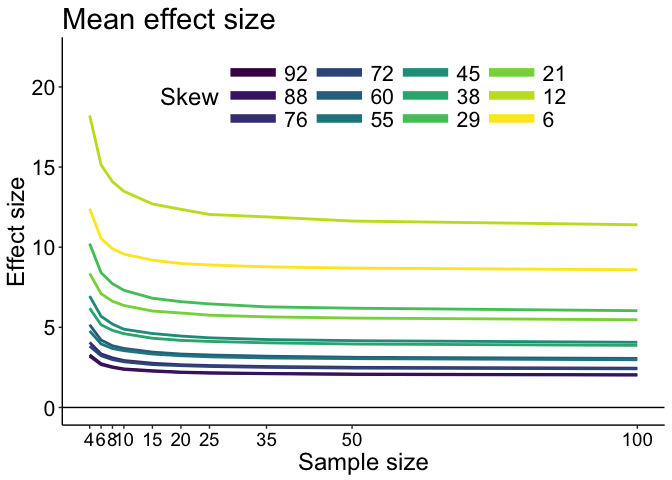

``` r
# save figure
ggsave(filename='figure_es_m_es.pdf',width=7,height=5) #path=pathname
```

Effect size tends to decrease with increasing skewness, because SD increases with skewness.
Effect size also increases with decreasing sample size. This bias is stronger for samples from the least skewed distributions. This is counterintuitive, because one would think estimation tends to get worse with increased skewness. Let's find out what's going on.

Illustrate: Bias of mean effect size
------------------------------------

``` r
df <- tibble(`ES`=as.vector(bias.m.es),
             `Size`=rep(nvec,each=nP),
             `Skew`=rep(round(pop.m - pop.md),length(nvec)))

df$Skew <- as.character(df$Skew)
df$Skew <- factor(df$Skew, levels=unique(df$Skew))

# make plot
p <- ggplot(df, aes(x=Size, y=ES), group=Skew) + theme_classic() +
  geom_line(aes(colour = Skew), size = 1) + 
  geom_abline(intercept=0, slope=0, colour="black") +
  scale_color_viridis(discrete = TRUE) +
  scale_x_continuous(breaks=nvec) + 
  scale_y_continuous(limits=c(-0.2,8), breaks=seq(0,8,2)) +
  theme(plot.title = element_text(size=22),
        axis.title.x = element_text(size = 18),
        axis.text.x = element_text(size = 14, colour="black"),
        axis.text.y = element_text(size = 16, colour="black"),
        axis.title.y = element_text(size = 18),
        legend.key.width = unit(1.5,"cm"),
        legend.position = c(0.85,0.65),
        legend.text=element_text(size=16),
        legend.title=element_text(size=18)) +
  labs(x = "Sample size", y = "Bias") +
  guides(colour = guide_legend(override.aes = list(size=3))) + # make thicker legend lines
  ggtitle("Mean effect size bias") 
p
```

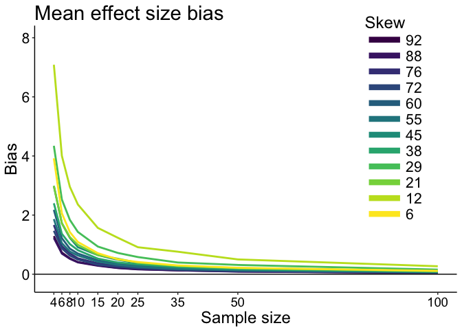

``` r
# save figure
ggsave(filename=paste0('figure_es_m_es_bias.pdf'),width=7,height=5)
```

Computing the bias normalises the effect sizes across skewness levels, revealing large bias differences as a function of skewness. Even with 100 observations, the bias (mean of 10,000 simulation iterations) is still slightly larger than zero for the least skewed distributions. This bias is not due to the mean.

Illustrate: mean
----------------

``` r
df <- tibble(`ES`=as.vector(m.num),
             `Size`=rep(nvec,each=nP),
             `Skew`=rep(round(pop.m - pop.md),length(nvec)))

df$Skew <- as.character(df$Skew)
df$Skew <- factor(df$Skew, levels=unique(df$Skew))

# make plot
p <- ggplot(df, aes(x=Size, y=ES), group=Skew) + theme_classic() +
  geom_line(aes(colour = Skew), size = 1) + 
  geom_abline(intercept=0, slope=0, colour="black") +
  scale_color_viridis(discrete = TRUE) +
  scale_x_continuous(breaks=nvec) + 
  scale_y_continuous(limits=c(550,650), breaks=seq(550,650,10)) +
  theme(plot.title = element_text(size=22),
        axis.title.x = element_text(size = 18),
        axis.text.x = element_text(size = 14, colour="black"),
        axis.text.y = element_text(size = 16, colour="black"),
        axis.title.y = element_text(size = 18),
        legend.key.width = unit(1.5,"cm"),
        legend.position = "blank",#c(0.85,0.65),
        legend.text=element_text(size=16),
        legend.title=element_text(size=18)) +
  labs(x = "Sample size", y = "Mean") +
  guides(colour = guide_legend(override.aes = list(size=3))) + # make thicker legend lines
  ggtitle("Mean effect size numerator") 
p
```

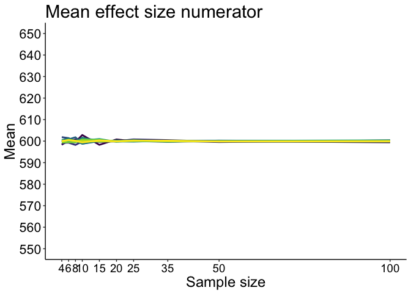

``` r
# save figure
ggsave(filename=paste0('figure_es_m_num.pdf'),width=7,height=5)
```

Always good to confirm, but as we know, the mean is not biased.

Illustrate: mean effect size denominator
----------------------------------------

``` r
df <- tibble(`ES`=as.vector(m.den),
             `Size`=rep(nvec,each=nP),
             `Skew`=rep(round(pop.m - pop.md),length(nvec)))

df$Skew <- as.character(df$Skew)
df$Skew <- factor(df$Skew, levels=unique(df$Skew))

# make plot
p <- ggplot(df, aes(x=Size, y=ES), group=Skew) + theme_classic() +
  geom_line(aes(colour = Skew), size = 1) + 
  geom_abline(intercept=0, slope=0, colour="black") +
  scale_color_viridis(discrete = TRUE) +
  scale_x_continuous(breaks=nvec) + 
  # scale_y_continuous(limits=c(-5,42), breaks=seq(0,42,10)) +
  theme(plot.title = element_text(size=22),
        axis.title.x = element_text(size = 18),
        axis.text.x = element_text(size = 14, colour="black"),
        axis.text.y = element_text(size = 16, colour="black"),
        axis.title.y = element_text(size = 18),
        legend.key.width = unit(1.5,"cm"),
        legend.position = "blank",#c(0.85,0.45),
        legend.text=element_text(size=16),
        legend.title=element_text(size=18)) +
  labs(x = "Sample size", y = "SD") +
  guides(colour = guide_legend(override.aes = list(size=3))) + # make thicker legend lines
  ggtitle("Mean effect size denominator") 
p
```

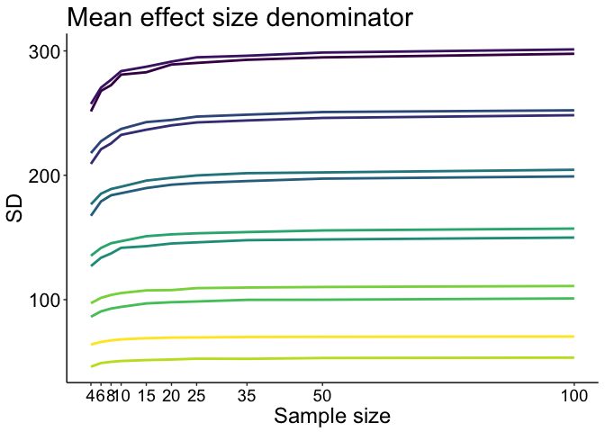

``` r
# save figure
ggsave(filename=paste0('figure_es_m_den.pdf'),width=7,height=5)
```

Unlike the mean, the denominator of Cohen's *d*, SD, is biased.
Let's look at bias directly.

Illustrate: Bias of mean effect size denominator
------------------------------------------------

``` r
df <- tibble(`ES`=as.vector(bias.m.den),
             `Size`=rep(nvec,each=nP),
             `Skew`=rep(round(pop.m - pop.md),length(nvec)))

df$Skew <- as.character(df$Skew)
df$Skew <- factor(df$Skew, levels=unique(df$Skew))

# make plot
p <- ggplot(df, aes(x=Size, y=ES), group=Skew) + theme_classic() +
  geom_line(aes(colour = Skew), size = 1) + 
  geom_abline(intercept=0, slope=0, colour="black") +
  scale_color_viridis(discrete = TRUE) +
  scale_x_continuous(breaks=nvec) + 
  # scale_y_continuous(limits=c(-5,42), breaks=seq(0,42,10)) +
  theme(plot.title = element_text(size=22),
        axis.title.x = element_text(size = 18),
        axis.text.x = element_text(size = 14, colour="black"),
        axis.text.y = element_text(size = 16, colour="black"),
        axis.title.y = element_text(size = 18),
        legend.key.width = unit(1.5,"cm"),
        legend.position = "blank",#c(0.85,0.45),
        legend.text=element_text(size=16),
        legend.title=element_text(size=18)) +
  labs(x = "Sample size", y = "Bias") +
  guides(colour = guide_legend(override.aes = list(size=3))) + # make thicker legend lines
  ggtitle("Mean effect size denominator") 
p
```

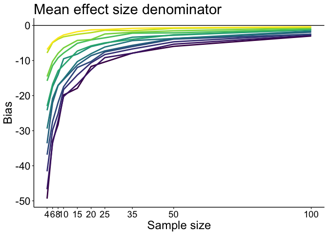

``` r
# save figure
ggsave(filename=paste0('figure_es_m_den_bias.pdf'),width=7,height=5)
```

SD is most strongly biased for small sample sizes and increases with skewness.
This is because the sampling distribution of SD is increasingly skewed with increasing skewness and decreasing sample sizes.

Illustrate: sampling distribution of SD
---------------------------------------

### Compute HDIs of bias distributions

``` r
# 80% HDI of mean bias
hdi.m.es <- array(NA, dim = c(2, nP, length(nvec))) 
hdi.m.den <- array(NA, dim = c(2, nP, length(nvec)))
sim.m.es <- sim.m / sim.m.den
for(iter.n in 1:length(nvec)){ 
  for(P in 1:nP){
      hdi.m.es[, P, iter.n] <- HDIofMCMC(sim.m.es[, P, iter.n]-pop.m.es[P], credMass=0.80)
      hdi.m.den[, P, iter.n] <- HDIofMCMC(sim.m.den[, P, iter.n]-pop.m.den[P], credMass=0.80)
  }
}
```

### HDI figure

``` r
#fig.width = 7, fig.height = 5
df1 <- tibble(`Bias`=as.vector(hdi.m.den[1,,]),
             `Size`=rep(nvec,each=nP),
             `Skewness`=rep(round(pop.m - pop.md),length(nvec)))
df2 <- tibble(`Bias`=as.vector(hdi.m.den[2,,]),
             `Size`=rep(nvec,each=nP),
             `Skewness`=rep(round(pop.m - pop.md),length(nvec)))

df1$Skewness <- as.character(df1$Skewness)
df1$Skewness <- factor(df1$Skewness, levels=unique(df1$Skewness))
df2$Skewness <- as.character(df2$Skewness)
df2$Skewness <- factor(df2$Skewness, levels=unique(df2$Skewness))

# make plot
p <- ggplot(df1, aes(x=Size, y=Bias)) + theme_classic() +
  geom_line(aes(colour = Skewness), size = 1) + #linetype = Side
  geom_line(data=df2, aes(colour = Skewness), size = 1) +
  geom_abline(intercept=0, slope=0, colour="black") +
  scale_color_viridis(discrete = TRUE) +
  scale_x_continuous(breaks=nvec) + 
 # scale_y_continuous(breaks=seq(-160,60,20)) +
  # coord_cartesian(ylim=c(-160,60)) +
  theme(plot.title = element_text(size=22),
        axis.title.x = element_text(size = 18),
        axis.text.x = element_text(size = 14, colour="black"),
        axis.text.y = element_text(size = 16, colour="black"),
        axis.title.y = element_text(size = 18),
        legend.key.width = unit(1.5,"cm"),
        legend.position = c(0.55,0.15),
        legend.direction = "horizontal",
        legend.text=element_text(size=16),
        legend.title=element_text(size=18)) +
  labs(x = "Sample size", y = "Bias") +
  guides(colour = guide_legend(override.aes = list(size=3))) + # make thicker legend lines
  ggtitle("SD 80% HDI") 
p
```

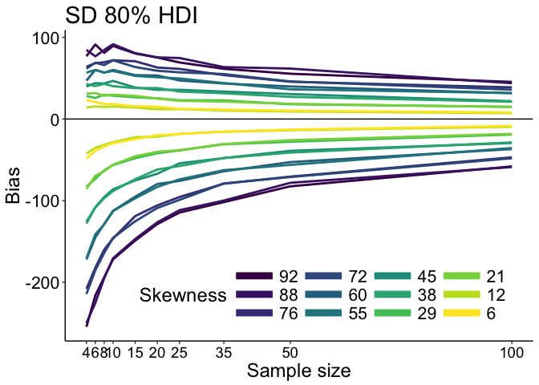

``` r
# save figure
ggsave(filename=paste0('figure_m_den_hdi80.pdf'),width=7,height=5)
```

The sampling distribution of SD is increasingly skewed with increasing skewness and decreasing sample sizes.

Illustrate: sampling distribution of mean effect size
-----------------------------------------------------

``` r
#fig.width = 7, fig.height = 5
df1 <- tibble(`Bias`=as.vector(hdi.m.es[1,,]),
             `Size`=rep(nvec,each=nP),
             `Skewness`=rep(round(pop.m - pop.md),length(nvec)))
df2 <- tibble(`Bias`=as.vector(hdi.m.es[2,,]),
             `Size`=rep(nvec,each=nP),
             `Skewness`=rep(round(pop.m - pop.md),length(nvec)))

df1$Skewness <- as.character(df1$Skewness)
df1$Skewness <- factor(df1$Skewness, levels=unique(df1$Skewness))
df2$Skewness <- as.character(df2$Skewness)
df2$Skewness <- factor(df2$Skewness, levels=unique(df2$Skewness))

# make plot
p <- ggplot(df1, aes(x=Size, y=Bias)) + theme_classic() +
  geom_line(aes(colour = Skewness), size = 1) + #linetype = Side
  geom_line(data=df2, aes(colour = Skewness), size = 1) +
  geom_abline(intercept=0, slope=0, colour="black") +
  scale_color_viridis(discrete = TRUE) +
  scale_x_continuous(breaks=nvec) + 
 # scale_y_continuous(breaks=seq(-160,60,20)) +
  coord_cartesian(ylim=c(-10,10)) +
  theme(plot.title = element_text(size=22),
        axis.title.x = element_text(size = 18),
        axis.text.x = element_text(size = 14, colour="black"),
        axis.text.y = element_text(size = 16, colour="black"),
        axis.title.y = element_text(size = 18),
        legend.key.width = unit(1.5,"cm"),
        legend.position = c(0.6,0.15),
        legend.direction = "horizontal",
        legend.text=element_text(size=16),
        legend.title=element_text(size=18)) +
  labs(x = "Sample size", y = "Bias") +
  guides(colour = guide_legend(override.aes = list(size=3))) + # make thicker legend lines
  ggtitle("Mean effect size 80% HDI") 
p
```

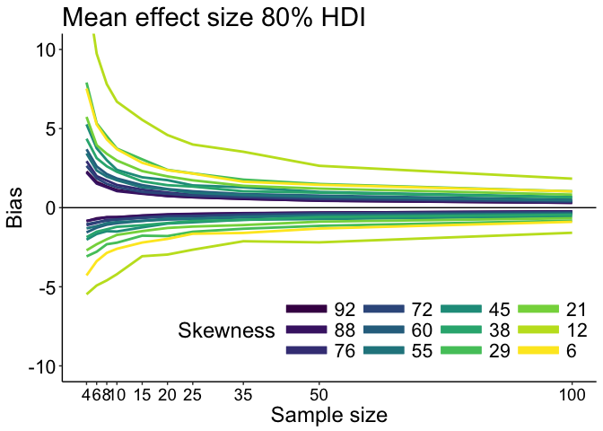

``` r
# save figure
ggsave(filename=paste0('figure_m_es_hdi80.pdf'),width=7,height=5)
```

As a result, the sampling distribution of Cohen's *d* is also skewed.
The bias is strongest in absolute term for the least skewed distributions because the sample SD is overall smaller for these distributions, resulting in overall larger effect sizes. The relative bias is overall larger for the most skewed distributions. This can be estimated by computing a normalised measure of bias, for instance by computing the difference between effect sizes for n=4 and n=100 divided by their sum:

``` r
# most skewed
(m.es[1,1] - m.es[1,10]) /  (m.es[1,1] + m.es[1,10])
```

    ## [1] 0.2333729

``` r
# least skewed
(m.es[12,1] - m.es[12,10]) /  (m.es[12,1] + m.es[12,10])
```

    ## [1] 0.1813615

Histograms to explore sampling distributions...

``` r
hist(sim.m.den[, 1, 1]) # most skewed, n=4
```

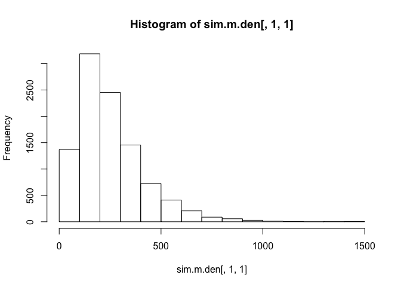

``` r
hist(sim.m.den[, 1, 10]) # most skewed, n=100
```

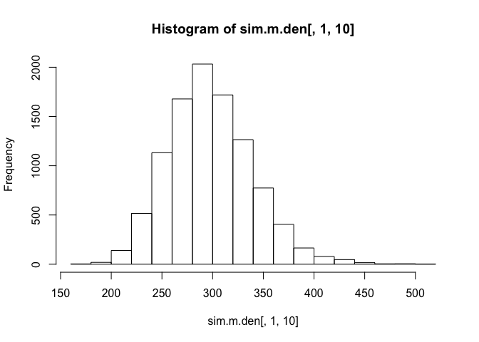

``` r
# most skewed, n = 4: ES
hist(sim.m[, 1, 1]/sim.m.den[, 1, 1], freq = 50)
```

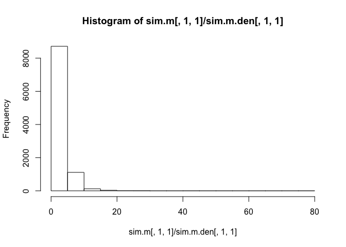

``` r
# most skewed, n = 100: ES
hist(sim.m[, 1, 10]/sim.m.den[, 1, 10], freq = 50)
```

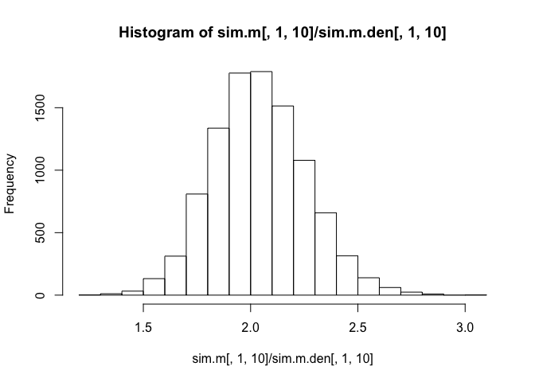

``` r
# least skewed, n = 4: ES
hist(sim.m[, 12, 1]/sim.m.den[, 12, 1], freq = 50)
```

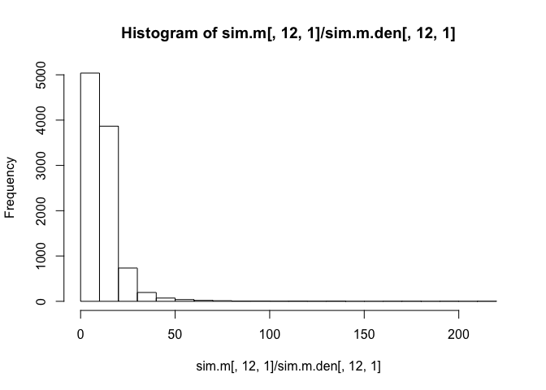

``` r
# least skewed, n = 100: ES
hist(sim.m[, 12, 10]/sim.m.den[, 12, 10], freq = 50)
```

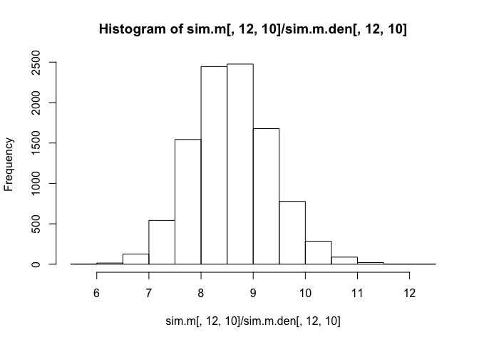

Illustrate: Bias of mean effect size after bias correction
----------------------------------------------------------

``` r
df <- tibble(`ES`=as.vector(bias.m.es.bc),
             `Size`=rep(nvec,each=nP),
             `Skew`=rep(round(pop.m - pop.md),length(nvec)))

df$Skew <- as.character(df$Skew)
df$Skew <- factor(df$Skew, levels=unique(df$Skew))

# make plot
p <- ggplot(df, aes(x=Size, y=ES), group=Skew) + theme_classic() +
  geom_line(aes(colour = Skew), size = 1) + 
  geom_abline(intercept=0, slope=0, colour="black") +
  scale_color_viridis(discrete = TRUE) +
  scale_x_continuous(breaks=nvec) + 
  scale_y_continuous(limits=c(-0.2,8), breaks=seq(0,8,2)) +
  theme(plot.title = element_text(size=22),
        axis.title.x = element_text(size = 18),
        axis.text.x = element_text(size = 14, colour="black"),
        axis.text.y = element_text(size = 16, colour="black"),
        axis.title.y = element_text(size = 18),
        legend.key.width = unit(1.5,"cm"),
        legend.position = c(0.55,0.75),
        legend.direction = "horizontal",
        legend.text=element_text(size=16),
        legend.title=element_text(size=18)) +
  labs(x = "Sample size", y = "Bias") +
  guides(colour = guide_legend(override.aes = list(size=3))) + # make thicker legend lines
  ggtitle("Mean effect size bias after bias correction") 
p
```

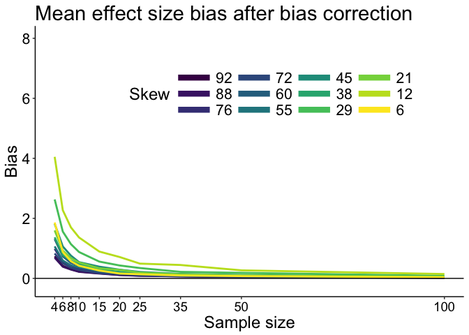

``` r
# save figure
ggsave(filename=paste0('figure_es_m_es_bias_after_bc.pdf'),width=7,height=5)
```

Bias correction does help reduce bias.

Illustrate: Bias of mean effect size denominator after bias correction
----------------------------------------------------------------------

``` r
df <- tibble(`ES`=as.vector(bias.m.den.bc),
             `Size`=rep(nvec,each=nP),
             `Skew`=rep(round(pop.m - pop.md),length(nvec)))

df$Skew <- as.character(df$Skew)
df$Skew <- factor(df$Skew, levels=unique(df$Skew))

# make plot
p <- ggplot(df, aes(x=Size, y=ES), group=Skew) + theme_classic() +
  geom_line(aes(colour = Skew), size = 1) + 
  geom_abline(intercept=0, slope=0, colour="black") +
  scale_color_viridis(discrete = TRUE) +
  scale_x_continuous(breaks=nvec) + 
  # scale_y_continuous(limits=c(-5,42), breaks=seq(0,42,10)) +
  theme(plot.title = element_text(size=22),
        axis.title.x = element_text(size = 18),
        axis.text.x = element_text(size = 14, colour="black"),
        axis.text.y = element_text(size = 16, colour="black"),
        axis.title.y = element_text(size = 18),
        legend.key.width = unit(1.5,"cm"),
        legend.position = "blank",#c(0.85,0.45),
        legend.text=element_text(size=16),
        legend.title=element_text(size=18)) +
  labs(x = "Sample size", y = "Bias") +
  guides(colour = guide_legend(override.aes = list(size=3))) + # make thicker legend lines
  ggtitle("Mean effect size denominator after bc") 
p
```

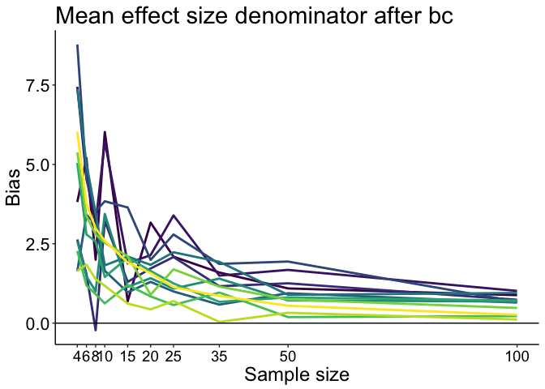

``` r
# save figure
ggsave(filename=paste0('figure_es_m_den_bias_after_bc.pdf'),width=7,height=5)
```

Illustrate: mean effect size denominator after bias correction
--------------------------------------------------------------

``` r
df <- tibble(`ES`=as.vector(apply(sim.m.den.bc,c(2,3),mean)),
             `Size`=rep(nvec,each=nP),
             `Skew`=rep(round(pop.m - pop.md),length(nvec)))

df$Skew <- as.character(df$Skew)
df$Skew <- factor(df$Skew, levels=unique(df$Skew))

# make plot
p <- ggplot(df, aes(x=Size, y=ES), group=Skew) + theme_classic() +
  geom_line(aes(colour = Skew), size = 1) + 
  geom_abline(intercept=0, slope=0, colour="black") +
  scale_color_viridis(discrete = TRUE) +
  scale_x_continuous(breaks=nvec) + 
  # scale_y_continuous(limits=c(-5,42), breaks=seq(0,42,10)) +
  theme(plot.title = element_text(size=22),
        axis.title.x = element_text(size = 18),
        axis.text.x = element_text(size = 14, colour="black"),
        axis.text.y = element_text(size = 16, colour="black"),
        axis.title.y = element_text(size = 18),
        legend.key.width = unit(1.5,"cm"),
        legend.position = "blank",#c(0.85,0.45),
        legend.text=element_text(size=16),
        legend.title=element_text(size=18)) +
  labs(x = "Sample size", y = "SD") +
  guides(colour = guide_legend(override.aes = list(size=3))) + # make thicker legend lines
  ggtitle("Mean effect size denominator after bc") 
p
```

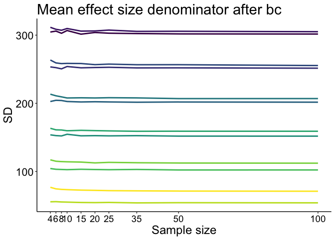

``` r
# save figure
ggsave(filename=paste0('figure_es_m_den_after_bc.pdf'),width=7,height=5)
```

Results for robust equivalent to Cohen's *d*
============================================

Illustrate: Median effect size
------------------------------

``` r
df <- tibble(`ES`=as.vector(md.es),
             `Size`=rep(nvec,each=nP),
             `Skew`=rep(round(pop.m - pop.md),length(nvec)))

df$Skew <- as.character(df$Skew)
df$Skew <- factor(df$Skew, levels=unique(df$Skew))

# make plot
p <- ggplot(df, aes(x=Size, y=ES), group=Skew) + theme_classic() +
  geom_line(aes(colour = Skew), size = 1) + 
  geom_abline(intercept=0, slope=0, colour="black") +
  scale_color_viridis(discrete = TRUE) +
  scale_x_continuous(breaks=nvec) + 
  scale_y_continuous(limits=c(0,22), breaks=seq(0,22,5)) +
  theme(plot.title = element_text(size=22),
        axis.title.x = element_text(size = 18),
        axis.text.x = element_text(size = 14, colour="black"),
        axis.text.y = element_text(size = 16, colour="black"),
        axis.title.y = element_text(size = 18),
        legend.key.width = unit(1.5,"cm"),
        legend.position = "blank",#c(0.85,0.65),
        legend.text=element_text(size=16),
        legend.title=element_text(size=18)) +
  labs(x = "Sample size", y = "Effect size") +
  guides(colour = guide_legend(override.aes = list(size=3))) + # make thicker legend lines
  ggtitle("Median effect size") 
p
```

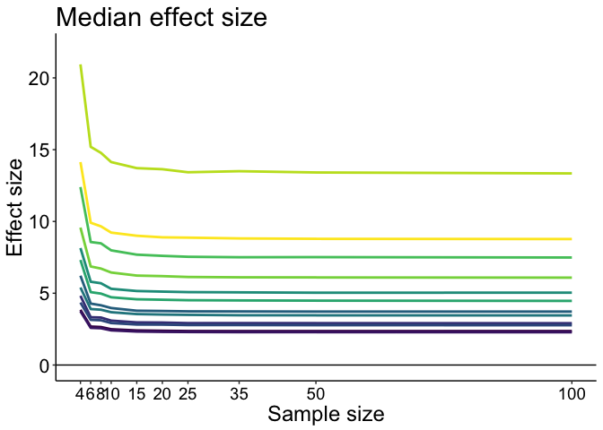

``` r
# save figure
ggsave(filename=paste0('figure_es_md_es.pdf'),width=7,height=5)
```

The median effect size shows a similar profile to the mean effect size. It is overall larger than the mean effect size because it uses a robust measure of spread, which is less sensitive to the long right tails of the skewed distributions we sample from.

Illustrate: Median effect size - bias corrected
-----------------------------------------------

``` r
df <- tibble(`ES`=as.vector(md.es.bc),
             `Size`=rep(nvec,each=nP),
             `Skew`=rep(round(pop.m - pop.md),length(nvec)))

df$Skew <- as.character(df$Skew)
df$Skew <- factor(df$Skew, levels=unique(df$Skew))

# make plot
p <- ggplot(df, aes(x=Size, y=ES), group=Skew) + theme_classic() +
  geom_line(aes(colour = Skew), size = 1) + 
  geom_abline(intercept=0, slope=0, colour="black") +
  scale_color_viridis(discrete = TRUE) +
  scale_x_continuous(breaks=nvec) + 
  # scale_y_continuous(limits=c(0,22), breaks=seq(0,22,5)) +
  theme(plot.title = element_text(size=22),
        axis.title.x = element_text(size = 18),
        axis.text.x = element_text(size = 14, colour="black"),
        axis.text.y = element_text(size = 16, colour="black"),
        axis.title.y = element_text(size = 18),
        legend.key.width = unit(1.5,"cm"),
        legend.position = "blank",#c(0.85,0.65),
        legend.text=element_text(size=16),
        legend.title=element_text(size=18)) +
  labs(x = "Sample size", y = "Effect size") +
  guides(colour = guide_legend(override.aes = list(size=3))) + # make thicker legend lines
  ggtitle("Median effect size with bias correction") 
p
```

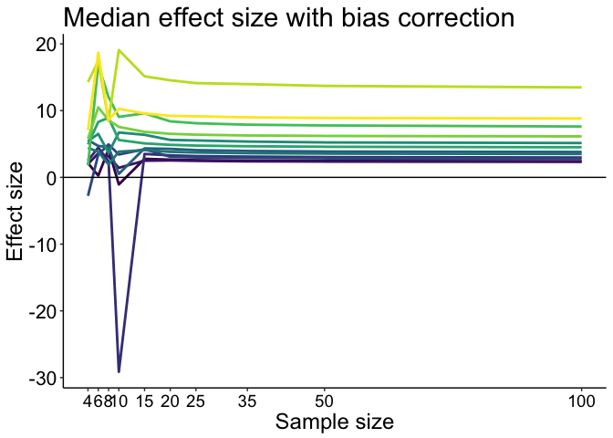

``` r
# save figure
ggsave(filename=paste0('figure_es_md_es_bc.pdf'),width=7,height=5)
```

Illustrate: Median
------------------

``` r
df <- tibble(`ES`=as.vector(md.num),
             `Size`=rep(nvec,each=nP),
             `Skew`=rep(round(pop.m - pop.md),length(nvec)))

df$Skew <- as.character(df$Skew)
df$Skew <- factor(df$Skew, levels=unique(df$Skew))

# make plot
p <- ggplot(df, aes(x=Size, y=ES), group=Skew) + theme_classic() +
  geom_line(aes(colour = Skew), size = 1) + 
  geom_abline(intercept=0, slope=0, colour="black") +
  scale_color_viridis(discrete = TRUE) +
  scale_x_continuous(breaks=nvec) + 
  # scale_y_continuous(limits=c(0,22), breaks=seq(0,22,5)) +
  theme(plot.title = element_text(size=22),
        axis.title.x = element_text(size = 18),
        axis.text.x = element_text(size = 14, colour="black"),
        axis.text.y = element_text(size = 16, colour="black"),
        axis.title.y = element_text(size = 18),
        legend.key.width = unit(1.5,"cm"),
        legend.position = "blank",#c(0.85,0.65),
        legend.text=element_text(size=16),
        legend.title=element_text(size=18)) +
  labs(x = "Sample size", y = "Median") +
  guides(colour = guide_legend(override.aes = list(size=3))) + # make thicker legend lines
  ggtitle("Median") 
p
```

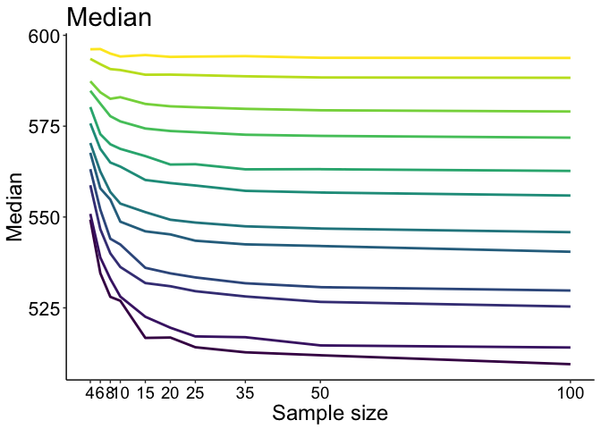

``` r
# save figure
ggsave(filename=paste0('figure_es_md_num.pdf'),width=7,height=5)
```

Illustrate: Median - bias corrected
-----------------------------------

``` r
df <- tibble(`ES`=as.vector(md.num.bc),
             `Size`=rep(nvec,each=nP),
             `Skew`=rep(round(pop.m - pop.md),length(nvec)))

df$Skew <- as.character(df$Skew)
df$Skew <- factor(df$Skew, levels=unique(df$Skew))

# make plot
p <- ggplot(df, aes(x=Size, y=ES), group=Skew) + theme_classic() +
  geom_line(aes(colour = Skew), size = 1) + 
  geom_abline(intercept=0, slope=0, colour="black") +
  scale_color_viridis(discrete = TRUE) +
  scale_x_continuous(breaks=nvec) + 
  # scale_y_continuous(limits=c(0,22), breaks=seq(0,22,5)) +
  theme(plot.title = element_text(size=22),
        axis.title.x = element_text(size = 18),
        axis.text.x = element_text(size = 14, colour="black"),
        axis.text.y = element_text(size = 16, colour="black"),
        axis.title.y = element_text(size = 18),
        legend.key.width = unit(1.5,"cm"),
        legend.position = "blank",#c(0.85,0.65),
        legend.text=element_text(size=16),
        legend.title=element_text(size=18)) +
  labs(x = "Sample size", y = "Median") +
  guides(colour = guide_legend(override.aes = list(size=3))) + # make thicker legend lines
  ggtitle("Median with bias correction") 
p
```


``` r
# save figure
ggsave(filename=paste0('figure_es_md_num_bc.pdf'),width=7,height=5)
```

Illustrate: bias of the median
------------------------------

``` r
df <- tibble(`ES`=as.vector(bias.md),
             `Size`=rep(nvec,each=nP),
             `Skew`=rep(round(pop.m - pop.md),length(nvec)))

df$Skew <- as.character(df$Skew)
df$Skew <- factor(df$Skew, levels=unique(df$Skew))

# make plot
p <- ggplot(df, aes(x=Size, y=ES), group=Skew) + theme_classic() +
  geom_line(aes(colour = Skew), size = 1) + 
  geom_abline(intercept=0, slope=0, colour="black") +
  scale_color_viridis(discrete = TRUE) +
  scale_x_continuous(breaks=nvec) + 
  # scale_y_continuous(limits=c(0,22), breaks=seq(0,22,5)) +
  theme(plot.title = element_text(size=22),
        axis.title.x = element_text(size = 18),
        axis.text.x = element_text(size = 14, colour="black"),
        axis.text.y = element_text(size = 16, colour="black"),
        axis.title.y = element_text(size = 18),
        legend.key.width = unit(1.5,"cm"),
        legend.position = "blank",#c(0.85,0.65),
        legend.text=element_text(size=16),
        legend.title=element_text(size=18)) +
  labs(x = "Sample size", y = "Bias") +
  guides(colour = guide_legend(override.aes = list(size=3))) + # make thicker legend lines
  ggtitle("Bias of the median") 
p
```

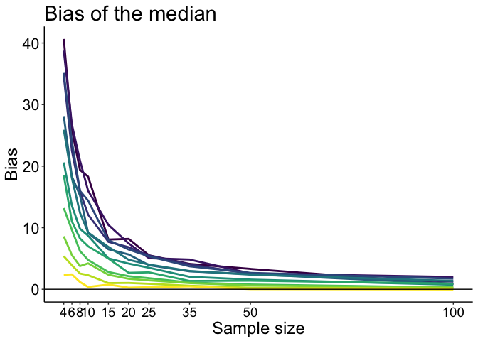

``` r
# save figure
ggsave(filename=paste0('figure_es_md_num.pdf'),width=7,height=5)
```

Illustrate: bias of the median after bias correction
----------------------------------------------------

``` r
df <- tibble(`ES`=as.vector(bias.md),
             `Size`=rep(nvec,each=nP),
             `Skew`=rep(round(pop.m - pop.md),length(nvec)))

df$Skew <- as.character(df$Skew)
df$Skew <- factor(df$Skew, levels=unique(df$Skew))

# make plot
p <- ggplot(df, aes(x=Size, y=ES), group=Skew) + theme_classic() +
  geom_line(aes(colour = Skew), size = 1) + 
  geom_abline(intercept=0, slope=0, colour="black") +
  scale_color_viridis(discrete = TRUE) +
  scale_x_continuous(breaks=nvec) + 
  # scale_y_continuous(limits=c(0,22), breaks=seq(0,22,5)) +
  theme(plot.title = element_text(size=22),
        axis.title.x = element_text(size = 18),
        axis.text.x = element_text(size = 14, colour="black"),
        axis.text.y = element_text(size = 16, colour="black"),
        axis.title.y = element_text(size = 18),
        legend.key.width = unit(1.5,"cm"),
        legend.position = "blank",#c(0.85,0.65),
        legend.text=element_text(size=16),
        legend.title=element_text(size=18)) +
  labs(x = "Sample size", y = "Bias") +
  guides(colour = guide_legend(override.aes = list(size=3))) + # make thicker legend lines
  ggtitle("Bias of the median after bc") 
p
```

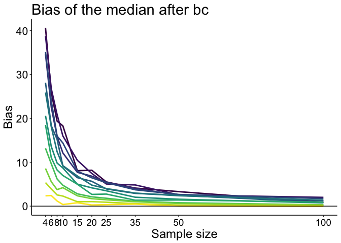

``` r
# save figure
ggsave(filename=paste0('figure_es_md_num_bc.pdf'),width=7,height=5)
```

Illustrate: Bias of median effect size
--------------------------------------

``` r
df <- tibble(`ES`=as.vector(bias.md.es),
             `Size`=rep(nvec,each=nP),
             `Skew`=rep(round(pop.m - pop.md),length(nvec)))

df$Skew <- as.character(df$Skew)
df$Skew <- factor(df$Skew, levels=unique(df$Skew))

# make plot
p <- ggplot(df, aes(x=Size, y=ES), group=Skew) + theme_classic() +
  geom_line(aes(colour = Skew), size = 1) + 
  geom_abline(intercept=0, slope=0, colour="black") +
  scale_color_viridis(discrete = TRUE) +
  scale_x_continuous(breaks=nvec) + 
  scale_y_continuous(limits=c(-0.2,8), breaks=seq(0,8,2)) +
  theme(plot.title = element_text(size=22),
        axis.title.x = element_text(size = 18),
        axis.text.x = element_text(size = 14, colour="black"),
        axis.text.y = element_text(size = 16, colour="black"),
        axis.title.y = element_text(size = 18),
        legend.key.width = unit(1.5,"cm"),
        legend.position = "blank",#c(0.85,0.65),
        legend.text=element_text(size=16),
        legend.title=element_text(size=18)) +
  labs(x = "Sample size", y = "Bias") +
  guides(colour = guide_legend(override.aes = list(size=3))) + # make thicker legend lines
  ggtitle("Median effect size without bias correction") 
p
```

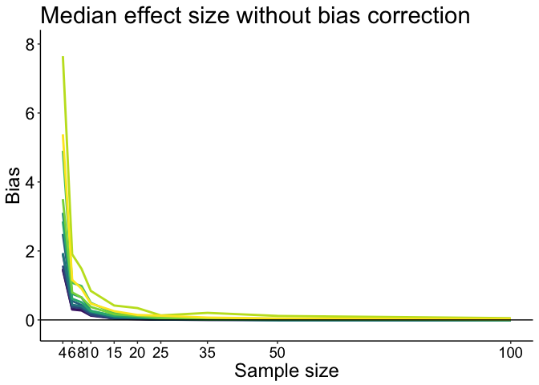

``` r
# save figure
ggsave(filename=paste0('figure_es_md_bias.pdf'),width=7,height=5)
```

The bias disappears quickly with increasing sample sizes, and quicker than for the mean effect size.

Illustrate: Bias of median effect size after bias correction
------------------------------------------------------------

``` r
df <- tibble(`ES`=as.vector(bias.md.es.bc),
             `Size`=rep(nvec,each=nP),
             `Skew`=rep(round(pop.m - pop.md),length(nvec)))

df$Skew <- as.character(df$Skew)
df$Skew <- factor(df$Skew, levels=unique(df$Skew))

# make plot
p <- ggplot(df, aes(x=Size, y=ES), group=Skew) + theme_classic() +
  geom_line(aes(colour = Skew), size = 1) + 
  geom_abline(intercept=0, slope=0, colour="black") +
  scale_color_viridis(discrete = TRUE) +
  scale_x_continuous(breaks=nvec) + 
  # scale_y_continuous(limits=c(0,170), breaks=seq(0,170,20)) +
  theme(plot.title = element_text(size=22),
        axis.title.x = element_text(size = 18),
        axis.text.x = element_text(size = 14, colour="black"),
        axis.text.y = element_text(size = 16, colour="black"),
        axis.title.y = element_text(size = 18),
        legend.key.width = unit(1.5,"cm"),
        legend.position = "blank",#c(0.85,0.65),
        legend.text=element_text(size=16),
        legend.title=element_text(size=18)) +
  labs(x = "Sample size", y = "Bias") +
  guides(colour = guide_legend(override.aes = list(size=3))) + # make thicker legend lines
  ggtitle("Median effect size with bias correction") 
p
```

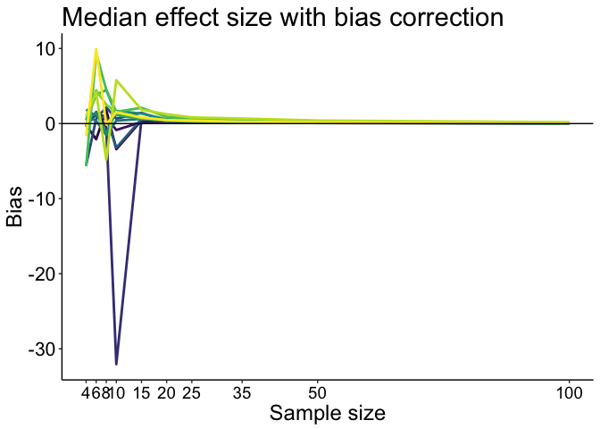

``` r
# save figure
ggsave(filename=paste0('figure_es_md_bias_after_bc.pdf'),width=7,height=5)
```

The bias correction does not work for small samples, because the repetition of the same observations in some bootstrap samples leads to very large values of the denominator. It's ok for n&gt;=15, for which bias is relatively small anyway, so at least based on these simulations, I wouldn't use bias correction for this robust effect size.

Illustrate: Bias of median effect size denominator
--------------------------------------------------

``` r
df <- tibble(`ES`=as.vector(bias.md.den),
             `Size`=rep(nvec,each=nP),
             `Skew`=rep(round(pop.m - pop.md),length(nvec)))

df$Skew <- as.character(df$Skew)
df$Skew <- factor(df$Skew, levels=unique(df$Skew))

# make plot
p <- ggplot(df, aes(x=Size, y=ES), group=Skew) + theme_classic() +
  geom_line(aes(colour = Skew), size = 1) + 
  geom_abline(intercept=0, slope=0, colour="black") +
  scale_color_viridis(discrete = TRUE) +
  scale_x_continuous(breaks=nvec) + 
  scale_y_continuous(limits=c(-5,42), breaks=seq(0,42,10)) +
  theme(plot.title = element_text(size=22),
        axis.title.x = element_text(size = 18),
        axis.text.x = element_text(size = 14, colour="black"),
        axis.text.y = element_text(size = 16, colour="black"),
        axis.title.y = element_text(size = 18),
        legend.key.width = unit(1.5,"cm"),
        legend.position = "blank",#c(0.85,0.65),
        legend.text=element_text(size=16),
        legend.title=element_text(size=18)) +
  labs(x = "Sample size", y = "Bias") +
  guides(colour = guide_legend(override.aes = list(size=3))) + # make thicker legend lines
  ggtitle("Denominator of median effect size") 
p
```

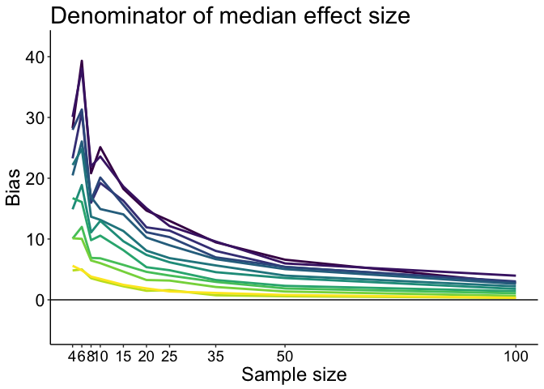

Illustrate: Bias of median effect size denominator - bias corrected
-------------------------------------------------------------------

``` r
df <- tibble(`ES`=as.vector(bias.md.den.bc),
             `Size`=rep(nvec,each=nP),
             `Skew`=rep(round(pop.m - pop.md),length(nvec)))

df$Skew <- as.character(df$Skew)
df$Skew <- factor(df$Skew, levels=unique(df$Skew))

# make plot
p <- ggplot(df, aes(x=Size, y=ES), group=Skew) + theme_classic() +
  geom_line(aes(colour = Skew), size = 1) + 
  geom_abline(intercept=0, slope=0, colour="black") +
  scale_color_viridis(discrete = TRUE) +
  scale_x_continuous(breaks=nvec) + 
  # scale_y_continuous(limits=c(-5,42), breaks=seq(0,42,10)) +
  theme(plot.title = element_text(size=22),
        axis.title.x = element_text(size = 18),
        axis.text.x = element_text(size = 14, colour="black"),
        axis.text.y = element_text(size = 16, colour="black"),
        axis.title.y = element_text(size = 18),
        legend.key.width = unit(1.5,"cm"),
        legend.position = "blank",#c(0.85,0.65),
        legend.text=element_text(size=16),
        legend.title=element_text(size=18)) +
  labs(x = "Sample size", y = "Bias") +
  guides(colour = guide_legend(override.aes = list(size=3))) + # make thicker legend lines
  ggtitle("Denominator of median effect size - BC") 
p
```

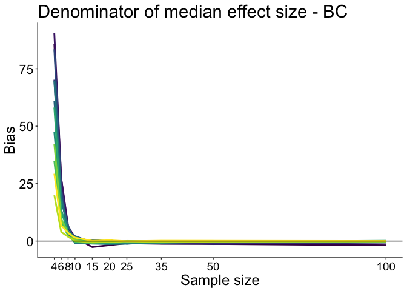
