Median bias: sampling distributions
================
Guillaume A. Rousselet

-   [Define ex-Gaussian parameters from Miller's Table 1](#define-ex-gaussian-parameters-from-millers-table-1)
-   [Estimate population parameters from large samples](#estimate-population-parameters-from-large-samples)
-   [Save KDE](#save-kde)
-   [Sampling distribution of the mean](#sampling-distribution-of-the-mean)
    -   [Least skewed distribution](#least-skewed-distribution)
    -   [Most skewed distribution](#most-skewed-distribution)
    -   [n=10 - illustrate skewness effect](#n10---illustrate-skewness-effect)
    -   [n=35 - illustrate skewness effect](#n35---illustrate-skewness-effect)
    -   [All mean HDI](#all-mean-hdi)
-   [Sampling distribution of the median](#sampling-distribution-of-the-median)
    -   [Least skewed distribution](#least-skewed-distribution-1)
    -   [Most skewed distribution](#most-skewed-distribution-1)
    -   [Compare mean to median for n=4](#compare-mean-to-median-for-n4)
    -   [Median sampling distribution is more skewed and kurtotic than the mean's](#median-sampling-distribution-is-more-skewed-and-kurtotic-than-the-means)
    -   [Summary figure: effect of sample size at skewness 6 and 92](#summary-figure-effect-of-sample-size-at-skewness-6-and-92)
    -   [n=10 - illustrate skewness effect](#n10---illustrate-skewness-effect-1)
    -   [n=35 - illustrate skewness effect](#n35---illustrate-skewness-effect-1)
    -   [All median HDI](#all-median-hdi)
-   [Standard error results](#standard-error-results)
    -   [Compute SE](#compute-se)
    -   [Illustrate SE results](#illustrate-se-results)
-   [P(MC > pop) results](#pmc-pop-results)
    -   [Compute P(MC > pop)](#compute-pmc-pop)
    -   [Illustrate P(sample > population) results](#illustrate-psample-population-results)

Bias is defined as the distance between the mean of the sampling distribution (here estimated using a Monte-Carlo simulation) and the population value. In this notebook, we look in more detail at the shape of the sampling distribution, which was ignored by Miller (1988) and consider other aspects of the distribution:

-   median: typical sample value;

-   standard deviation (SD): measure of spread and estimate of standard error (SE);

-   50% highest density interval (HDI): spread and location of the bulk of the observations;

-   P(sample < population): another measure of bias, sensitive to the asymmetry of the sampling distribution.

``` r
# dependencies
library(ggplot2)
library(tibble)
library(tidyr)
library(cowplot)
library(retimes)
library(viridis)
source("./functions/Rallfun-v34.txt")
source("./functions/functions.txt")
source("./functions/HDIofMCMC.txt")
```

> Miller, J. (1988). A warning about median reaction time. Journal of Experimental Psychology: Human Perception and Performance, 14(3), 539.

Define ex-Gaussian parameters from Miller's Table 1
===================================================

Save matrix with 3 parameters: - mean of the normal distribution - standard deviation of the normal distribution - mean of the exponential distribution

``` r
miller.param <- matrix(0, ncol=3, nrow=12)
miller.param[1,] <- c(300, 20, 300)
miller.param[2,] <- c(300, 50, 300)
miller.param[3,] <- c(350, 20, 250)
miller.param[4,] <- c(350, 50, 250)
miller.param[5,] <- c(400, 20, 200)
miller.param[6,] <- c(400, 50, 200)
miller.param[7,] <- c(450, 20, 150)
miller.param[8,] <- c(450, 50, 150)
miller.param[9,] <- c(500, 20, 100)
miller.param[10,] <- c(500, 50, 100)
miller.param[11,] <- c(550, 20, 50)
miller.param[12,] <- c(550, 50, 50)
```

Estimate population parameters from large samples
=================================================

Miller used 10,000 samples; we use 1,000,000.

``` r
set.seed(4)
pop.m <- vector(mode="numeric", length=12)
pop.md <- vector(mode="numeric", length=12)
pop.sk <- matrix(NA, nrow=12, ncol=2)
n <- 1000000
nP <- length(miller.param[,1])
for(P in 1:nP){
  mu <- miller.param[P,1]
  sigma <- miller.param[P,2]
  tau <- miller.param[P,3]
  pop <- rexgauss(n, mu = mu, sigma = sigma, tau = tau)
  pop.m[P] <- mean(pop)
  pop.md[P] <- sort(pop)[round(length(pop)*0.5)] # median(pop)
  tmp <- skew(pop)
  pop.sk[P,1] <- tmp$skew
  pop.sk[P,2] <- tmp$kurtosis
}
```

Save KDE
========

Save kernel density estimates of the sampling distributions of the mean and the median for each of the 12 distributions and each sample size.

``` r
load('./data/sim_miller1988.RData')

# save kernel density estimates
x <- seq(300, 900, 1)
kde.m <- array(NA, dim = c(length(x), nP, length(nvec)))
kde.md <- array(NA, dim = c(length(x), nP, length(nvec)))
for(S in 1:length(nvec)){
  for(P in 1:nP){
    kde.m[,P,S] <- akerd(sim.m[,P,S], pts = x, pyhat = TRUE, plotit = FALSE)
    kde.md[,P,S] <- akerd(sim.md[,P,S], pts = x, pyhat = TRUE, plotit = FALSE)
  }
}

save(
  kde.m,
  kde.md,
  nvec,
  nsim,
  x,
  file='./data/sim_miller1988_kde.RData')
```

Sampling distribution of the mean
=================================

Least skewed distribution
-------------------------

``` r
load('./data/sim_miller1988.RData')
load('./data/sim_miller1988_kde.RData')
P <- 12 # least skewed distribution
df <- tibble(sd = rep(x, length(nvec)),
             kde = as.vector(kde.m[,P,]),
             `Sample size` = factor(rep(nvec, each = length(x))))

# make plot
p <- ggplot(df, aes(x=sd, y=kde)) + theme_classic() +
  geom_vline(xintercept=pop.m[P], linetype=1, colour = "red", size = 1.5) +
          geom_line(aes(colour = `Sample size`), size=1) + 
       scale_color_viridis(discrete = TRUE, direction=1) + 
          theme(plot.title = element_text(size=22),
                axis.title.x = element_text(size = 18),
                axis.text.x = element_text(size = 14, colour="black"),
                axis.text.y = element_text(size = 16, colour="black"),
                axis.title.y = element_text(size = 18),
                legend.key.width = unit(1.5,"cm"),
                legend.position = c(0.2,0.6),
                legend.text=element_text(size=16),
                legend.title=element_text(size=18),
                 panel.background = element_rect(fill="white")) +
  scale_x_continuous(breaks = seq(300, 900, 50)) +
  coord_cartesian(xlim = c(300, 900)) +
  labs(x = "Mean estimates", y = "Density") +
  guides(colour = guide_legend(override.aes = list(size=3))) +
  geom_label(data=tibble(sd=pop.m[P]+125, kde=0.055),
             label = "Population mean", angle = 90, colour="red", size=5) +
  ggtitle(paste0("Mean: skewness = ",round(pop.m[P] - pop.md[P])))
  # annotate("text", x = pop.sd-10, y = 0.006, label = "Population SD", angle=90, size=5, colour="red")
p
```

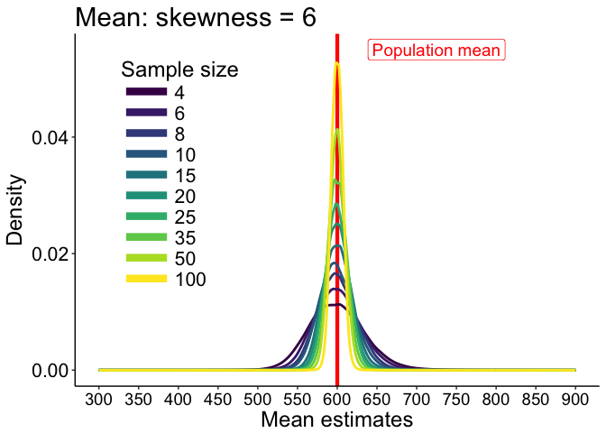

``` r
p.m.P12 <- p
```

Most skewed distribution
------------------------

``` r
P <- 1 # most skewed distribution
df <- tibble(sd = rep(x, length(nvec)),
             kde = as.vector(kde.m[,P,]),
             `Sample size` = factor(rep(nvec, each = length(x))))

# make plot
p <- ggplot(df, aes(x=sd, y=kde)) + theme_classic() +
      geom_vline(xintercept=pop.m[P], linetype=1, colour = "red", size = 1.5) +
      geom_line(aes(colour = `Sample size`), size=1) + 
       scale_color_viridis(discrete = TRUE, direction=1) + 
          theme(plot.title = element_text(size=22),
                axis.title.x = element_text(size = 18),
                axis.text.x = element_text(size = 14, colour="black"),
                axis.text.y = element_text(size = 16, colour="black"),
                axis.title.y = element_text(size = 18),
                legend.key.width = unit(1.5,"cm"),
                legend.position = "none", #c(0.2,0.55),
                legend.text=element_text(size=16),
                legend.title=element_text(size=18),
                 panel.background = element_rect(fill="white")) + #grey90
  scale_x_continuous(breaks = seq(100, 1000, 50)) +
  coord_cartesian(xlim = c(300, 900)) +
  labs(x = "Mean estimates", y = "Density") +
  guides(colour = guide_legend(override.aes = list(size=3))) +
  geom_label(data=tibble(sd=pop.m[P]+130, kde=0.013),
             label = "Population mean", angle = 90, colour="red", size=5) +
  ggtitle(paste0("Mean: skewness = ",round(pop.m[P] - pop.md[P])))
  # annotate("text", x = pop.sd-10, y = 0.006, label = "Population SD", angle=90, size=5, colour="red")
p
```

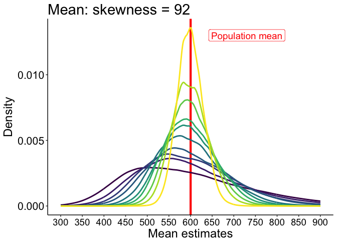

``` r
p.m.P1 <- p
```

### Highest density intervals

We use HDI to represent the location of the bulk of the sample means and medians. HDI are computed using a function from John K. Kruschke’s Doing bayesian data analysis [book](https://sites.google.com/site/doingbayesiandataanalysis/). The function is also available in the supplementary information of this [article](http://www.indiana.edu/~kruschke/BEST/).

#### Compute highest density intervals

``` r
hdi.res <- matrix(0, nrow=length(nvec), ncol=2)
for(N in 1:length(nvec)){
hdi.res[N,] <- HDIofMCMC(sim.m[,P,N], credMass=0.50)
}
hdi.res <- round(hdi.res, digits = 1)
# m.dist <- hdi.res[,2]-hdi.res[,1]
# 181.5 152.3 136.8 125.0 100.1  87.0  81.1  67.1  55.6  39.7
# md.dist <- hdi.res[,2]-hdi.res[,1]
# 166.8 141.8 124.6 116.9  98.8  85.8  77.4  65.6  55.4  39.9
dist.md <- apply(sim.m[,P,], 2, median) # median of sampling distribution
```

#### Illustrate results

``` r
df <- tibble(x = as.vector(hdi.res),
             y = rep(seq(1,length(nvec)),2),
             label = as.character(as.vector(hdi.res)))
df.seg <- tibble(x = hdi.res[,1],
                 y = seq(1,length(nvec)),
                 xend = hdi.res[,2],
                 yend = seq(1,length(nvec)))
df.label1 <- tibble(x = hdi.res[,1],
             y = seq(1,length(nvec)),
             label = as.character(hdi.res[,1]))
df.label1a <- tibble(x = hdi.res[1:5,1],
             y = seq(1,5),
             label = as.character(hdi.res[1:5,1]))
df.label1b <- tibble(x = hdi.res[6:10,1],
             y = seq(6,10),
             label = as.character(hdi.res[6:10,1]))
df.label2 <- tibble(x = hdi.res[,2],
             y = seq(1,length(nvec)),
             label = as.character(hdi.res[,2]))
df.md <- tibble(x = dist.md,
                y = seq(1,length(nvec)))

p <- ggplot(df, aes(x=x, y=y)) + theme_classic() +
  geom_vline(xintercept = pop.m[P], colour="red", size=1) +
  geom_point(size=3, aes(colour=y)) +
  geom_segment(data=df.seg, size=1, aes(x=x, xend=xend, y=y, yend=yend, colour=y)) +
  scale_color_viridis(discrete = FALSE, direction=1) +
  scale_y_continuous(breaks = seq(1,length(nvec)), labels = as.character(nvec)) +
  geom_point(data=df.md, shape=124, size=7, aes(colour=y)) +
  # geom_label(data=df.label1, aes(label=label), hjust = "inward", nudge_x = -3) +
  geom_label(data=df.label1a, aes(label=label), hjust = "outward", nudge_x = -4) +
  geom_label(data=df.label1b, aes(label=label), hjust = "inward", nudge_x = -4) +
  geom_label(data=df.label2, aes(label=label), hjust = "outward", nudge_x = 4) +
  scale_x_continuous(breaks = seq(400, 650, 25)) +
  coord_cartesian(xlim=c(400, 660)) +
  theme(plot.title = element_text(size=22),
        axis.title.x = element_text(size = 18),
        axis.text.x = element_text(size = 14, colour="black"),
        axis.text.y = element_text(size = 16, colour="black"),
        axis.title.y = element_text(size = 18),
        legend.key.width = unit(1.5,"cm"),
        legend.position = "none",
        legend.text=element_text(size=16),
        legend.title=element_text(size=18)) +
  labs(x = "Mean estimates", y = "Sample sizes") +
  ggtitle(paste0("Mean HDI: skewness = ",round(pop.m[P] - pop.md[P])))
p
```

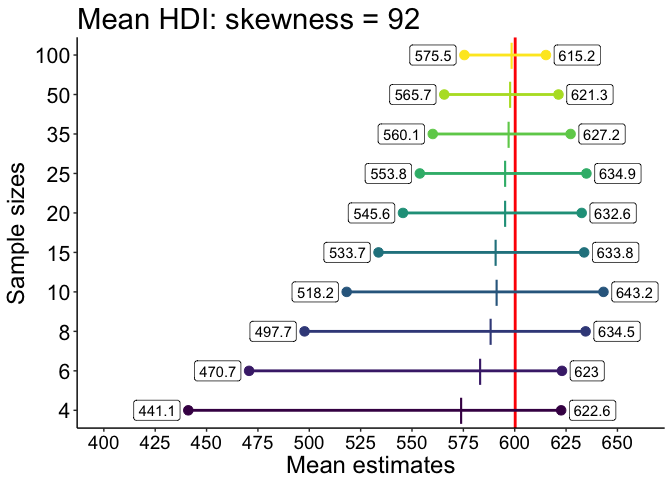

``` r
p.m.P1.hdi <- p
# save figure
# ggsave(filename = 'figure_m_diff_size_hdi.jpg',width=10,height=6) #path=pathname
```

For small sample sizes, the 50% HDI is offset to the left of the population mean, and so is the median of the sampling distribution. This means that the typical sample mean tends to under-estimate the population mean - that is to say, the mean sampling distribution is median biased. This offset reduces with increasing sample size, but is still present even for n=100.

n=10 - illustrate skewness effect
---------------------------------

``` r
N <- 4 # n=10
df <- tibble(sd = rep(x, nP),
             kde = as.vector(kde.m[,,N]),
             `Skewness` = factor(rep(round(pop.m-pop.md), each = length(x))))

# make plot
p <- ggplot(df, aes(x=sd, y=kde)) + theme_classic() +
  geom_vline(xintercept=pop.m[P], linetype=1, colour = "red", size = 1.5) +
          geom_line(aes(colour = `Skewness`), size=1) + 
       scale_color_viridis(discrete = TRUE, direction=-1) + 
          theme(plot.title = element_text(size = 22),
                axis.title.x = element_text(size = 18),
                axis.text = element_text(size = 16, colour = "black"),
                axis.title.y = element_text(size = 18),
                legend.key.width = unit(1.5,"cm"),
                legend.position = c(0.15,0.55),
                legend.text=element_text(size=16),
                legend.title=element_text(size=18),
                 panel.background = element_rect(fill="white")) +
  scale_x_continuous(breaks = seq(100, 1000, 50)) +
  coord_cartesian(xlim = c(300, 900)) +
  labs(x = "Mean estimates", y = "Density") +
  guides(colour = guide_legend(override.aes = list(size=3))) +
  geom_label(data=tibble(sd=pop.m[P]+90, kde=0.028), # same mean for all distributions
             label = "Population mean", angle = 90, colour="red", size=5) +
  ggtitle(paste0("Mean sampling distribution: n = ",nvec[N]))
  # annotate("text", x = pop.sd-10, y = 0.006, label = "Population SD", angle=90, size=5, colour="red")
p
```

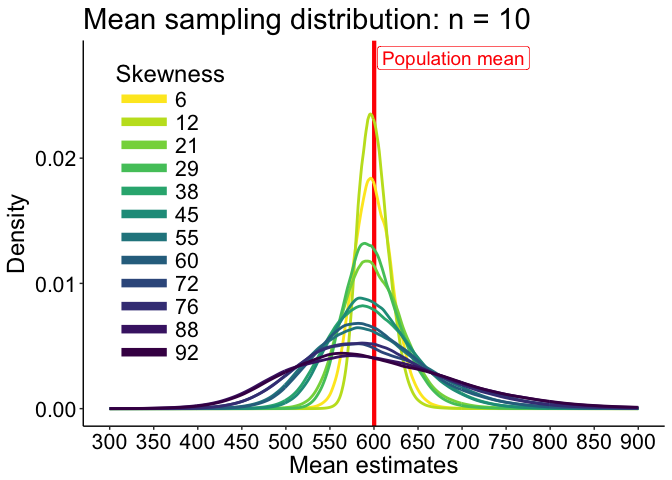

``` r
p.m.N10 <- p
```

### Highest density intervals

#### Compute highest density intervals

``` r
hdi.res <- matrix(0, nrow=nP, ncol=2)
for(P in 1:nP){
hdi.res[P,] <- HDIofMCMC(sim.m[,P,N], credMass=0.50)
}
hdi.res <- round(hdi.res, digits = 1)
dist.md <- apply(sim.m[,,N], 2, median) # median of sampling distribution
```

#### Illustrate results

``` r
df <- tibble(x = as.vector(hdi.res),
             y = rep(seq(1,nP),2),
             label = as.character(as.vector(hdi.res)))
df.seg <- tibble(x = hdi.res[,1],
                 y = seq(1,nP),
                 xend = hdi.res[,2],
                 yend = seq(1,nP))
df.label1 <- tibble(x = hdi.res[,1],
             y = seq(1,nP),
             label = as.character(hdi.res[,1]))
df.label1a <- tibble(x = hdi.res[1:10,1],
             y = seq(1,10),
             label = as.character(hdi.res[1:10,1]))
df.label1b <- tibble(x = hdi.res[11:12,1],
             y = seq(11,12),
             label = as.character(hdi.res[11:12,1]))
df.label2 <- tibble(x = hdi.res[,2],
             y = seq(1,nP),
             label = as.character(hdi.res[,2]))
df.md <- tibble(x = dist.md,
                y = seq(1,nP))

p <- ggplot(df, aes(x=x, y=y)) + theme_classic() +
  geom_vline(xintercept = pop.m[P], colour="red", size=1) +
  geom_point(size=3, aes(colour=y)) +
  geom_segment(data=df.seg, size=1, aes(x=x, xend=xend, y=y, yend=yend, colour=y)) +
  scale_color_viridis(discrete = FALSE, direction=1) +
  scale_y_continuous(breaks = seq(1,nP), labels = as.character(round(pop.m-pop.md, digits=0))) +
  geom_point(data=df.md, shape=124, size=7, aes(colour=y)) +
  # geom_label(data=df.label1, aes(label=label), hjust = "outward", nudge_x = -3) +
  geom_label(data=df.label1a, aes(label=label), hjust = "outward", nudge_x = -3) +
  geom_label(data=df.label1b, aes(label=label), hjust = "inward", nudge_x = -3) +
  geom_label(data=df.label2, aes(label=label), hjust = "outward", nudge_x = 3) +
  scale_x_continuous(breaks = seq(400, 650, 25)) +
  coord_cartesian(xlim=c(475, 675)) +
  theme(plot.title = element_text(size=22),
        axis.title.x = element_text(size = 18),
        axis.text.x = element_text(size = 14, colour="black"),
        axis.text.y = element_text(size = 16, colour="black"),
        axis.title.y = element_text(size = 18),
        legend.key.width = unit(1.5,"cm"),
        legend.position = "none",
        legend.text=element_text(size=16),
        legend.title=element_text(size=18)) +
  labs(x = "Mean estimates", y = "Skewness") +
  ggtitle(paste0("Mean HDI: n = ",nvec[N]))
p
```

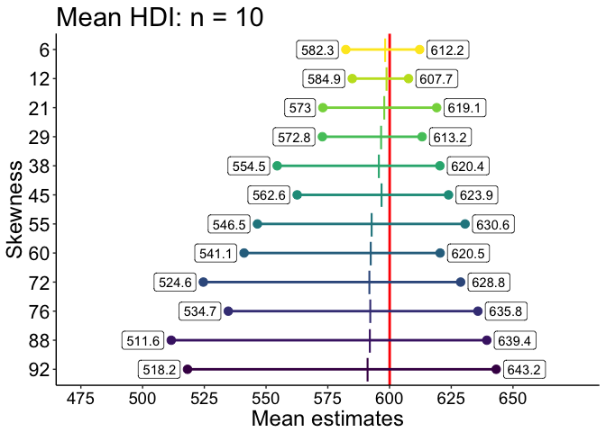

``` r
p.m.N10.hdi <- p
# save figure
# ggsave(filename = 'figure_m_diff_size_hdi.jpg',width=10,height=6) #path=pathname
```

n=35 - illustrate skewness effect
---------------------------------

``` r
N <- 8 # n=35
df <- tibble(sd = rep(x, nP),
             kde = as.vector(kde.m[,,N]),
             `Skewness` = factor(rep(round(pop.m-pop.md), each = length(x))))

# make plot
p <- ggplot(df, aes(x=sd, y=kde)) + theme_classic() +
  geom_vline(xintercept=pop.m[P], linetype=1, colour = "red", size = 1.5) +
          geom_line(aes(colour = `Skewness`), size=1) + 
       scale_color_viridis(discrete = TRUE, direction=-1) + 
          theme(plot.title = element_text(size = 22),
                axis.title.x = element_text(size = 18),
                axis.text = element_text(size = 16, colour = "black"),
                axis.title.y = element_text(size = 18),
                legend.key.width = unit(1.5,"cm"),
                legend.position = c(0.15,0.55),
                legend.text=element_text(size=16),
                legend.title=element_text(size=18),
                 panel.background = element_rect(fill="white")) +
  scale_x_continuous(breaks = seq(100, 1000, 50)) +
  coord_cartesian(xlim = c(300, 900)) +
  labs(x = "Mean estimates", y = "Density") +
  guides(colour = guide_legend(override.aes = list(size=3))) +
  geom_label(data=tibble(sd=pop.m[P]+90, kde=0.042),
             label = "Population mean", angle = 90, colour="red", size=5) +
  ggtitle(paste0("Mean sampling distribution: n = ",nvec[N]))
  # annotate("text", x = pop.sd-10, y = 0.006, label = "Population SD", angle=90, size=5, colour="red")
p
```

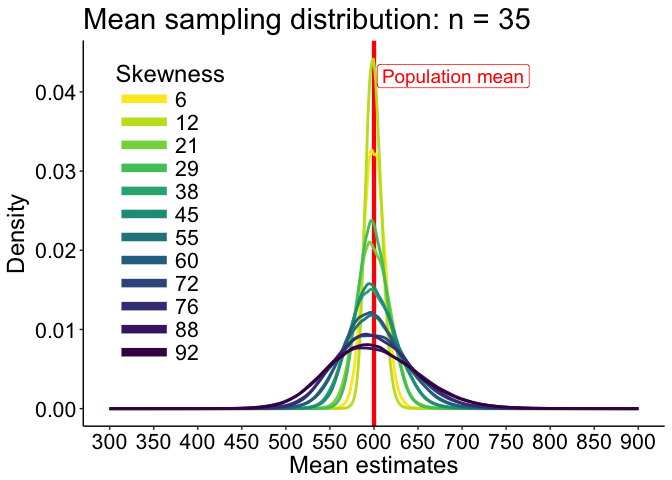

``` r
p.m.N35 <- p
```

All mean HDI
------------

Illustrate the HDIs for all skewness levels.

``` r
# 50% HDI of mean bias
hdi.m <- array(NA, dim = c(2, nP, length(nvec))) 
for(iter.n in 1:length(nvec)){ 
  for(P in 1:nP){
      hdi.m[, P, iter.n] <- HDIofMCMC(sim.m[, P, iter.n]-pop.m[P], credMass=0.50)
  }
}
```

``` r
# df <- tibble(`Bias`=c(as.vector(hdi.m[1,,]),as.vector(hdi.m[2,,])),
#              `Size`=rep(rep(nvec,each=nP),2),
#              `Skewness`=rep(rep(round(pop.m - pop.md),length(nvec)),2),
#              `Side`=c(rep("lower",length(nvec)*nP), rep("upper",length(nvec)*nP)))
df1 <- tibble(`Bias`=as.vector(hdi.m[1,,]),
             `Size`=rep(nvec,each=nP),
             `Skewness`=rep(round(pop.m - pop.md),length(nvec)))
df2 <- tibble(`Bias`=as.vector(hdi.m[2,,]),
             `Size`=rep(nvec,each=nP),
             `Skewness`=rep(round(pop.m - pop.md),length(nvec)))

df1$Skewness <- as.character(df1$Skewness)
df1$Skewness <- factor(df1$Skewness, levels=unique(df1$Skewness))
df2$Skewness <- as.character(df2$Skewness)
df2$Skewness <- factor(df2$Skewness, levels=unique(df2$Skewness))

# make plot
p <- ggplot(df1, aes(x=Size, y=Bias)) + theme_classic() +
  geom_line(aes(colour = Skewness), size = 1) + #linetype = Side
  geom_line(data=df2, aes(colour = Skewness), size = 1) +
  geom_abline(intercept=0, slope=0, colour="black") +
  scale_color_viridis(discrete = TRUE) +
  scale_x_continuous(breaks=nvec) + 
 scale_y_continuous(breaks=seq(-160,60,20)) +
  coord_cartesian(ylim=c(-160,60)) +
  theme(plot.title = element_text(size=22),
        axis.title.x = element_text(size = 18),
        axis.text.x = element_text(size = 14, colour="black"),
        axis.text.y = element_text(size = 16, colour="black"),
        axis.title.y = element_text(size = 18),
        legend.key.width = unit(1.5,"cm"),
        legend.position = c(0.5,0.15),
        legend.direction = "horizontal",
        legend.text=element_text(size=16),
        legend.title=element_text(size=18)) +
  labs(x = "Sample size", y = "Bias in ms") +
  guides(colour = guide_legend(override.aes = list(size=3))) + # make thicker legend lines
  ggtitle("Mean RT: 50% HDI") 
p
```

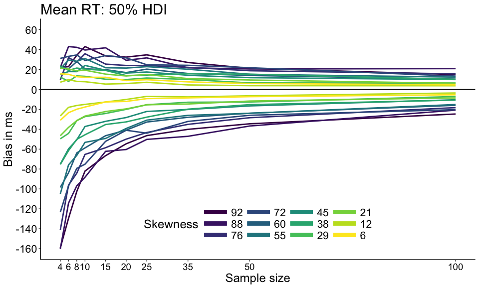

``` r
p.m.hdi <- p
# save figure
ggsave(filename=paste0('figure_miller_bias_m_hdi.pdf'),width=10,height=6)
```

Sampling distribution of the median
===================================

Least skewed distribution
-------------------------

``` r
# load('./data/sim_miller1988_sampdist.RData')
P <- 12 # least skewed distribution
df <- tibble(sd = rep(x, length(nvec)),
             kde = as.vector(kde.md[,P,]),
             `Sample size` = factor(rep(nvec, each = length(x))))

# make plot
p <- ggplot(df, aes(x=sd, y=kde)) + theme_classic() +
  geom_vline(xintercept=pop.md[P], linetype=1, colour = "red", size = 1.5) +
          geom_line(aes(colour = `Sample size`), size=1) + 
       scale_color_viridis(discrete = TRUE, direction=1) + 
          theme(plot.title = element_text(size=22),
                axis.title.x = element_text(size = 18),
                axis.text.x = element_text(size = 14, colour="black"),
                axis.text.y = element_text(size = 16, colour="black"),
                axis.title.y = element_text(size = 18),
                legend.key.width = unit(1.5,"cm"),
                legend.position = "none",#c(0.15,0.6),
                legend.text=element_text(size=16),
                legend.title=element_text(size=18),
                 panel.background = element_rect(fill="white")) +
  scale_x_continuous(breaks = seq(300, 900, 50)) +
  coord_cartesian(xlim = c(300, 900)) +
  labs(x = "Median estimates", y = "Density") +
  guides(colour = guide_legend(override.aes = list(size=3))) +
  geom_label(data=tibble(sd=pop.md[P]+130, kde=0.055),
             label = "Population median", angle = 90, colour="red", size=5) +
  ggtitle(paste0("Median: skewness = ",round(pop.m[P] - pop.md[P])))
  # annotate("text", x = pop.sd-10, y = 0.006, label = "Population SD", angle=90, size=5, colour="red")
p
```

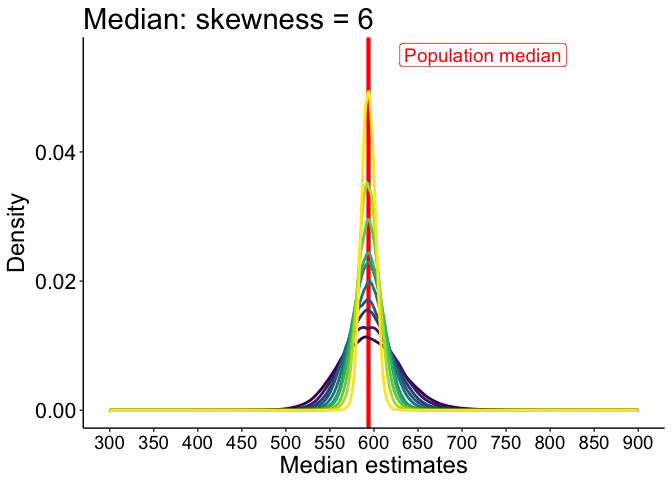

``` r
p.md.P12 <- p
```

Most skewed distribution
------------------------

``` r
P <- 1 # most skewed distribution
df <- tibble(sd = rep(x, length(nvec)),
             kde = as.vector(kde.md[,P,]),
             `Sample size` = factor(rep(nvec, each = length(x))))

# make plot
p <- ggplot(df, aes(x=sd, y=kde)) + theme_classic() +
      geom_vline(xintercept=pop.md[P], linetype=1, colour = "red", size = 1.5) +
      geom_line(aes(colour = `Sample size`), size=1) + 
       scale_color_viridis(discrete = TRUE, direction=1) + 
          theme(plot.title = element_text(size=22),
                axis.title.x = element_text(size = 18),
                axis.text.x = element_text(size = 14, colour="black"),
                axis.text.y = element_text(size = 16, colour="black"),
                axis.title.y = element_text(size = 18),
                legend.key.width = unit(1.5,"cm"),
                legend.position = "none", #c(0.2,0.55),
                legend.text=element_text(size=16),
                legend.title=element_text(size=18),
                 panel.background = element_rect(fill="white")) + #grey90
  scale_x_continuous(breaks = seq(100, 1000, 50)) +
  coord_cartesian(xlim = c(300, 900)) +
  labs(x = "Median estimates", y = "Density") +
  guides(colour = guide_legend(override.aes = list(size=3))) +
  geom_label(data=tibble(sd=pop.md[P]+140, kde=0.013),
             label = "Population median", angle = 90, colour="red", size=5) +
  ggtitle(paste0("Median: skewness = ",round(pop.m[P] - pop.md[P])))
  # annotate("text", x = pop.sd-10, y = 0.006, label = "Population SD", angle=90, size=5, colour="red")
p
```

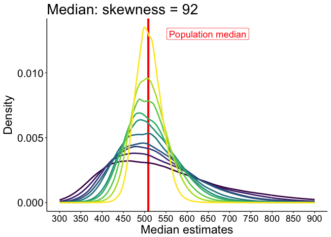

``` r
p.md.P1 <- p
```

### Highest density intervals

#### Compute highest density intervals

``` r
hdi.res <- matrix(0, nrow=length(nvec), ncol=2)
for(N in 1:length(nvec)){
hdi.res[N,] <- HDIofMCMC(sim.md[,P,N], credMass=0.50)
}
hdi.res <- round(hdi.res, digits = 1)
# md.dist <- hdi.res[,2]-hdi.res[,1]
# 166.8 141.8 124.6 116.9  98.8  85.8  77.4  65.6  55.4  39.9
dist.md <- apply(sim.md[,P,], 2, median) # median of sampling distribution
```

#### Illustrate results

``` r
df <- tibble(x = as.vector(hdi.res),
             y = rep(seq(1,length(nvec)),2),
             label = as.character(as.vector(hdi.res)))
df.seg <- tibble(x = hdi.res[,1],
                 y = seq(1,length(nvec)),
                 xend = hdi.res[,2],
                 yend = seq(1,length(nvec)))
df.label1 <- tibble(x = hdi.res[,1],
             y = seq(1,length(nvec)),
             label = as.character(hdi.res[,1]))
df.label1a <- tibble(x = hdi.res[1:4,1],
             y = seq(1,4),
             label = as.character(hdi.res[1:4,1]))
df.label1b <- tibble(x = hdi.res[5:10,1],
             y = seq(5,10),
             label = as.character(hdi.res[5:10,1]))
df.label2 <- tibble(x = hdi.res[,2],
             y = seq(1,length(nvec)),
             label = as.character(hdi.res[,2]))
df.md <- tibble(x = dist.md,
                y = seq(1,length(nvec)))

p <- ggplot(df, aes(x=x, y=y)) + theme_classic() +
  geom_vline(xintercept = pop.md[P], colour="red", size=1) +
  geom_point(size=3, aes(colour=y)) +
  geom_segment(data=df.seg, size=1, aes(x=x, xend=xend, y=y, yend=yend, colour=y)) +
  scale_color_viridis(discrete = FALSE, direction=1) +
  scale_y_continuous(breaks = seq(1,length(nvec)), labels = as.character(nvec)) +
  geom_point(data=df.md, shape=124, size=7, aes(colour=y)) +
  geom_label(data=df.label1, aes(label=label), hjust = "outward", nudge_x = -4) +
  # geom_label(data=df.label1a, aes(label=label), hjust = "outward", nudge_x = -3) +
  # geom_label(data=df.label1b, aes(label=label), hjust = "inward", nudge_x = -3) +
  geom_label(data=df.label2, aes(label=label), hjust = "outward", nudge_x = 4) +
  scale_x_continuous(breaks = seq(400, 650, 25)) +
  coord_cartesian(xlim=c(375, 600)) +
  theme(plot.title = element_text(size=22),
        axis.title.x = element_text(size = 18),
        axis.text.x = element_text(size = 14, colour="black"),
        axis.text.y = element_text(size = 16, colour="black"),
        axis.title.y = element_text(size = 18),
        legend.key.width = unit(1.5,"cm"),
        legend.position = "none",
        legend.text=element_text(size=16),
        legend.title=element_text(size=18)) +
  labs(x = "Median estimates", y = "Sample sizes") +
  ggtitle(paste0("Median HDI: skewness = ",round(pop.m[P] - pop.md[P])))
p
```

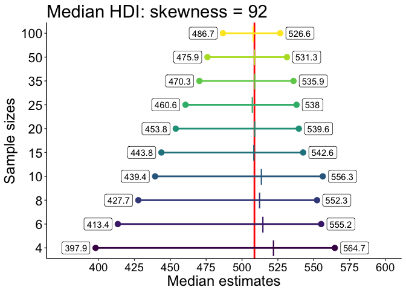

``` r
p.md.P1.hdi <- p
# save figure
# ggsave(filename = 'figure_m_diff_size_hdi.jpg',width=10,height=6) #path=pathname
```

With small sample sizes, there is a discrepancy between the 50% HDI, which is shifted to the left of the population median, and the median of the sampling distribution, which is shifted to the right of the population median. This contrasts with the results for the mean, and can be explained by differences in the shapes of the sampling distributions, in particular the larger skewness and kurtosis of the median sampling distribution compared to that of the mean (see next figure). The offset between 50% HDI and the population reduces quickly with increasing sample size. For n=10, the median bias is already very small. From n=15, the median sample distribution is not median bias, which means that the typical sample median is not biased.

Compare mean to median for n=4
------------------------------

``` r
P <- 1 # most skewed distribution
S <- 1 # n=4
# save kernel density estimates
x <- seq(0, 1200, 1)
kde.m1 <- akerd(sim.m[,P,S], pts = x, pyhat = TRUE, plotit = FALSE)
kde.md1 <- akerd(sim.md[,P,S], pts = x, pyhat = TRUE, plotit = FALSE)

df <- tibble(sd = rep(x, 2),
             kde = c(kde.md1, kde.m1),
             MCT = c(rep("Median",length(x)), rep("Mean",length(x))))

# make plot
p <- ggplot(df, aes(x=sd, y=kde)) + theme_classic() +
      geom_vline(xintercept=pop.md[P], linetype=1, colour = "#E69F00", size = 1.5) +
      geom_vline(xintercept=pop.m[P], linetype=1, colour = "#56B4E9", size = 1.5) +
      geom_vline(xintercept=median(sim.md[,P,S]), linetype=1, colour = "#E69F00", size = 0.5) +
      geom_vline(xintercept=median(sim.m[,P,S]), linetype=1, colour = "#56B4E9", size = 0.5) +
      geom_line(aes(colour = `MCT`), size=1.5) + 
      scale_color_manual(values=c("#56B4E9", "#E69F00")) +
                theme(plot.title = element_text(size=22),
                axis.title.x = element_text(size = 18),
                axis.text.x = element_text(size = 14, colour="black"),
                axis.text.y = element_text(size = 16, colour="black"),
                axis.title.y = element_text(size = 18),
                legend.key.width = unit(1.5,"cm"),
                legend.position = c(0.15,0.55),
                legend.text=element_text(size=16),
                legend.title=element_text(size=18),
                panel.background = element_rect(fill="white")) + #grey90
  scale_x_continuous(breaks = seq(0, 1200, 100)) +
  coord_cartesian(xlim = c(0, 1200)) +
  labs(x = "Samples", y = "Density") +
  guides(colour = guide_legend(override.aes = list(size=3))) 
  # geom_label(data=tibble(sd=pop.md[P]+140, kde=0.013),
  #            label = "Population median", angle = 90, colour="red", size=5) +
  # ggtitle(paste0("Median: skewness = ",round(pop.m[P] - pop.md[P])))
  # annotate("text", x = pop.sd-10, y = 0.006, label = "Population SD", angle=90, size=5, colour="red")
p
```

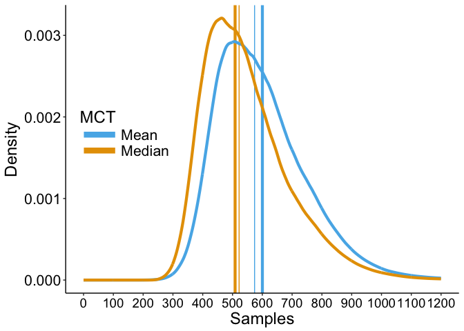

Thick lines show the population values.
Thin lines show the medians of the sampling distributions.

Median sampling distribution is more skewed and kurtotic than the mean's
------------------------------------------------------------------------

``` r
skew(sim.md[,P,S])
```

    ## $skew
    ## [1] 1.143462
    ## 
    ## $kurtosis
    ## [1] 4.86612

``` r
skew(sim.m[,P,S])
```

    ## $skew
    ## [1] 0.9473542
    ## 
    ## $kurtosis
    ## [1] 4.191706

Summary figure: effect of sample size at skewness 6 and 92
----------------------------------------------------------

``` r
# combine panels into one figure
cowplot::plot_grid(p.m.P12, p.md.P12,
                   p.m.P1, p.md.P1,
                   p.m.P1.hdi, p.md.P1.hdi,
                          labels = c("", "", "","", "", ""),
                          ncol = 2,
                          nrow = 3,
                          rel_widths = c(1, 1, 1, 1, 1, 1), 
                          label_size = 20, 
                          hjust = -0.5, 
                          scale=.95,
                          align = "h")
# save figure
ggsave(filename=paste0('figure_samp_dist_summary.pdf'),width=12,height=15) #path=pathname
```

n=10 - illustrate skewness effect
---------------------------------

``` r
load('./data/sim_miller1988.RData')
load('./data/sim_miller1988_kde.RData')
N <- 4 # n=10
df <- tibble(sd = rep(x, nP),
             kde = as.vector(kde.md[,,N]),
             `Skewness` = factor(rep(round(pop.m-pop.md), each = length(x))))
df.pop <- tibble(pop = pop.md,
                 Skewness = factor(round(pop.m-pop.md)))

# make plot
p <- ggplot(df, aes(x=sd, y=kde)) + theme_classic() +
  geom_vline(data=df.pop, aes(xintercept=pop, colour = `Skewness`), linetype=1, size = 0.5) +
          geom_line(aes(colour = `Skewness`), size=1) + 
       scale_color_viridis(discrete = TRUE, direction=-1) + 
          theme(plot.title = element_text(size = 22),
                axis.title.x = element_text(size = 18),
                axis.text = element_text(size = 16, colour = "black"),
                axis.title.y = element_text(size = 18),
                legend.key.width = unit(1.5,"cm"),
                legend.position = "none",#c(0.15,0.55),
                legend.text=element_text(size=16),
                legend.title=element_text(size=18),
                 panel.background = element_rect(fill="white")) +
  scale_x_continuous(breaks = seq(100, 1000, 50)) +
  coord_cartesian(xlim = c(300, 900)) +
  labs(x = "Median estimates", y = "Density") +
  guides(colour = guide_legend(override.aes = list(size=3))) +
  # geom_label(data=tibble(sd=pop.md+90, kde=0.028),
  #            label = "Population median", angle = 90, colour="red", size=5) +
  ggtitle(paste0("Median sampling distribution: n = ",nvec[N]))
  # annotate("text", x = pop.sd-10, y = 0.006, label = "Population SD", angle=90, size=5, colour="red")
p
```

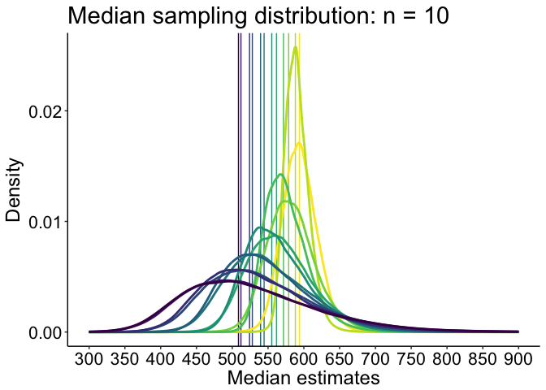

``` r
p.md.N10 <- p
```

### Highest density intervals

#### Compute highest density intervals

``` r
hdi.res <- matrix(0, nrow=nP, ncol=2)
for(P in 1:nP){
hdi.res[P,] <- HDIofMCMC(sim.md[,P,N], credMass=0.50)
}
hdi.res <- round(hdi.res, digits = 1)
dist.md <- apply(sim.md[,,N], 2, median) # median of sampling distribution
```

#### Illustrate results

``` r
df <- tibble(x = as.vector(hdi.res),
             y = rep(seq(1,nP),2),
             label = as.character(as.vector(hdi.res)))
df.seg <- tibble(x = hdi.res[,1],
                 y = seq(1,nP),
                 xend = hdi.res[,2],
                 yend = seq(1,nP))
df.label1 <- tibble(x = hdi.res[,1],
             y = seq(1,nP),
             label = as.character(hdi.res[,1]))
df.label1a <- tibble(x = hdi.res[1:8,1],
             y = seq(1,8),
             label = as.character(hdi.res[1:8,1]))
df.label1b <- tibble(x = hdi.res[9:12,1],
             y = seq(9,12),
             label = as.character(hdi.res[9:12,1]))
df.label2 <- tibble(x = hdi.res[,2],
             y = seq(1,nP),
             label = as.character(hdi.res[,2]))
df.md <- tibble(x = dist.md,
                y = seq(1,nP))
df.pop <- tibble(x = pop.md,
                 y = seq(1,nP))

p <- ggplot(df, aes(x=x, y=y)) + theme_classic() +
  # geom_vline(xintercept = pop.m, colour="red", size=1) +
  geom_point(data=df.pop, shape=124, size=5, colour="black") +
  geom_point(size=3, aes(colour=y)) +
  geom_segment(data=df.seg, size=1, aes(x=x, xend=xend, y=y, yend=yend, colour=y)) +
  scale_color_viridis(discrete = FALSE, direction=1) +
  scale_y_continuous(breaks = seq(1,nP), labels = as.character(round(pop.m-pop.md, digits=0))) +
  geom_point(data=df.md, shape=124, size=7, aes(colour=y)) +
  # geom_label(data=df.label1, aes(label=label), hjust = "outward", nudge_x = -3) +
  geom_label(data=df.label1a, aes(label=label), hjust = "outward", nudge_x = -3) +
  geom_label(data=df.label1b, aes(label=label), hjust = "inward", nudge_x = -3) +
  geom_label(data=df.label2, aes(label=label), hjust = "outward", nudge_x = 3) +
  scale_x_continuous(breaks = seq(400, 650, 25)) +
  coord_cartesian(xlim=c(400, 650)) +
  theme(plot.title = element_text(size=22),
        axis.title.x = element_text(size = 18),
        axis.text.x = element_text(size = 14, colour="black"),
        axis.text.y = element_text(size = 16, colour="black"),
        axis.title.y = element_text(size = 18),
        legend.key.width = unit(1.5,"cm"),
        legend.position = "none",
        legend.text=element_text(size=16),
        legend.title=element_text(size=18)) +
  labs(x = "Median estimates", y = "Skewness") +
  ggtitle(paste0("Median HDI: n = ",nvec[N]))
p
```

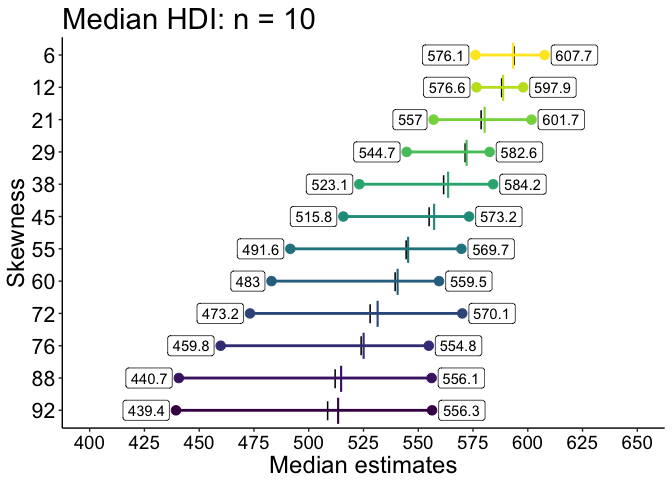

``` r
p.md.N10.hdi <- p
# save figure
# ggsave(filename = 'figure_m_diff_size_hdi.jpg',width=10,height=6) #path=pathname
```

n=35 - illustrate skewness effect
---------------------------------

``` r
N <- 8 # n=35
df <- tibble(sd = rep(x, nP),
             kde = as.vector(kde.md[,,N]),
             `Skewness` = factor(rep(round(pop.m-pop.md), each = length(x))))

df.pop <- tibble(pop = pop.md,
                 Skewness = factor(round(pop.m-pop.md)))

# make plot
p <- ggplot(df, aes(x=sd, y=kde)) + theme_classic() +
  # geom_vline(xintercept=pop.m, linetype=1, colour = "red", size = 1.5) +
  geom_vline(data=df.pop, aes(xintercept=pop, colour = `Skewness`), linetype=1, size = 0.5) +
          geom_line(aes(colour = `Skewness`), size=1) + 
       scale_color_viridis(discrete = TRUE, direction=-1) + 
          theme(plot.title = element_text(size = 22),
                axis.title.x = element_text(size = 18),
                axis.text = element_text(size = 16, colour = "black"),
                axis.title.y = element_text(size = 18),
                legend.key.width = unit(1.5,"cm"),
                legend.position = "none",#c(0.15,0.55),
                legend.text=element_text(size=16),
                legend.title=element_text(size=18),
                 panel.background = element_rect(fill="white")) +
  scale_x_continuous(breaks = seq(100, 1000, 50)) +
  coord_cartesian(xlim = c(300, 900)) +
  labs(x = "Median estimates", y = "Density") +
  guides(colour = guide_legend(override.aes = list(size=3))) +
  geom_label(data=tibble(sd=pop.m+90, kde=0.042),
             label = "Population median", angle = 90, colour="red", size=5) +
  ggtitle(paste0("Median sampling distribution: n = ",nvec[N]))
  # annotate("text", x = pop.sd-10, y = 0.006, label = "Population SD", angle=90, size=5, colour="red")
p
```

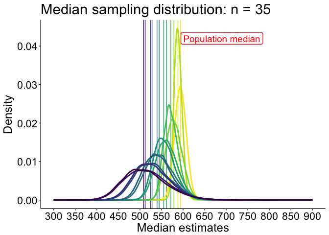

``` r
p.md.N35 <- p
```

All median HDI
--------------

Illustrate the HDIs for all skewness levels.

``` r
# 50% HDI of mean bias
hdi.md <- array(NA, dim = c(2, nP, length(nvec))) 
for(iter.n in 1:length(nvec)){ 
  for(P in 1:nP){
      hdi.md[, P, iter.n] <- HDIofMCMC(sim.md[, P, iter.n]-pop.md[P], credMass=0.50)
  }
}
```

``` r
df1 <- tibble(`Bias`=as.vector(hdi.md[1,,]),
             `Size`=rep(nvec,each=nP),
             `Skewness`=rep(round(pop.m - pop.md),length(nvec)))
df2 <- tibble(`Bias`=as.vector(hdi.md[2,,]),
             `Size`=rep(nvec,each=nP),
             `Skewness`=rep(round(pop.m - pop.md),length(nvec)))

df1$Skewness <- as.character(df1$Skewness)
df1$Skewness <- factor(df1$Skewness, levels=unique(df1$Skewness))
df2$Skewness <- as.character(df2$Skewness)
df2$Skewness <- factor(df2$Skewness, levels=unique(df2$Skewness))

# make plot
p <- ggplot(df1, aes(x=Size, y=Bias)) + theme_classic() +
  geom_line(aes(colour = Skewness), size = 1) + #linetype = Side
  geom_line(data=df2, aes(colour = Skewness), size = 1) +
  geom_abline(intercept=0, slope=0, colour="black") +
  scale_color_viridis(discrete = TRUE) +
  scale_x_continuous(breaks=nvec) + 
  scale_y_continuous(breaks=seq(-160,60,20)) +
  coord_cartesian(ylim=c(-160,60)) +
  theme(plot.title = element_text(size=22),
        axis.title.x = element_text(size = 18),
        axis.text.x = element_text(size = 14, colour="black"),
        axis.text.y = element_text(size = 16, colour="black"),
        axis.title.y = element_text(size = 18),
        legend.key.width = unit(1.5,"cm"),
        legend.position = "none",#c(0.5,0.15),
        legend.direction = "horizontal",
        legend.text=element_text(size=16),
        legend.title=element_text(size=18)) +
  labs(x = "Sample size", y = "Bias in ms") +
  guides(colour = guide_legend(override.aes = list(size=3))) + # make thicker legend lines
  ggtitle("Median RT: 50% HDI") 
p
```

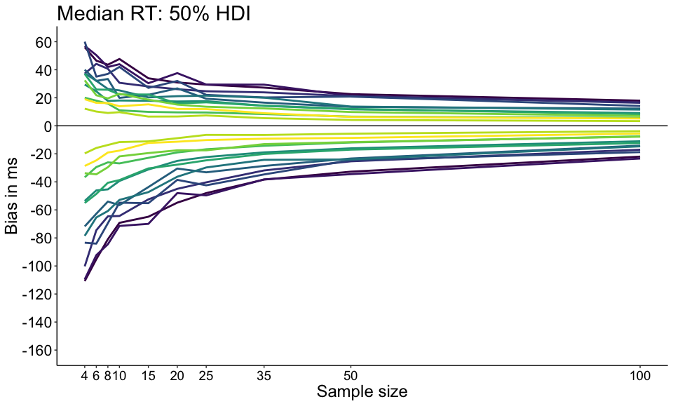

``` r
p.md.hdi <- p
# save figure
ggsave(filename=paste0('figure_miller_bias_md_hdi.pdf'),width=10,height=6)
```

### Summary figure: all HDI for mean and median

``` r
# combine panels into one figure
cowplot::plot_grid(p.m.hdi, p.md.hdi,
                          labels = c("A", "B"),
                          ncol = 2,
                          nrow = 1,
                          rel_widths = c(1, 1), 
                          label_size = 20, 
                          hjust = -1.5, 
                          scale=.95,
                          align = "h")
# save figure
ggsave(filename=paste0('figure_samp_dist_hdi_summary.pdf'),width=18,height=6) #path=pathname
```

Standard error results
======================

The standard errors of the mean and the median are estimated by computing the SD of the Monte-Carlo samples.

Compute SE
----------

``` r
se.m <- apply(sim.m, c(2,3), sd)
se.md <- apply(sim.md, c(2,3), sd)
```

Illustrate SE results
---------------------

We illustrate SE as a function of skewness and sample size.

MEAN:

``` r
df <- tibble(`Bias`=as.vector(se.m),
             `Size`=rep(nvec,each=nP),
             `Skew`=rep(round(pop.m - pop.md),length(nvec)))

df$Skew <- as.character(df$Skew)
df$Skew <- factor(df$Skew, levels=unique(df$Skew))

# make plot
p <- ggplot(df, aes(x=Size, y=Bias), group=Skew) + theme_classic() +
  geom_line(aes(colour = Skew), size = 1) + 
  geom_abline(intercept=0, slope=0, colour="black") +
  scale_color_viridis(discrete = TRUE) +
  scale_x_continuous(breaks=nvec) + 
  scale_y_continuous(limits=c(0,170), breaks=seq(0,170,20)) +
  theme(plot.title = element_text(size=22),
        axis.title.x = element_text(size = 18),
        axis.text.x = element_text(size = 14, colour="black"),
        axis.text.y = element_text(size = 16, colour="black"),
        axis.title.y = element_text(size = 18),
        legend.key.width = unit(1.5,"cm"),
        legend.position = "blank",#c(0.85,0.65),
        legend.text=element_text(size=16),
        legend.title=element_text(size=18)) +
  labs(x = "Sample size", y = "Standard error") +
  guides(colour = guide_legend(override.aes = list(size=3))) + # make thicker legend lines
  ggtitle("Mean") 
p
```

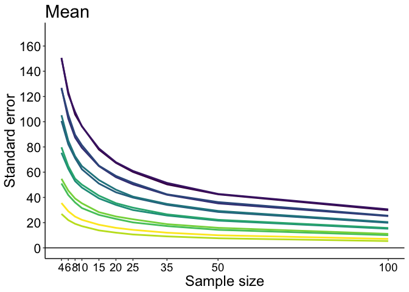

MEDIAN:

``` r
df <- tibble(`Bias`=as.vector(se.md),
             `Size`=rep(nvec,each=nP),
             `Skew`=rep(round(pop.m - pop.md),length(nvec)))

df$Skew <- as.character(df$Skew)
df$Skew <- factor(df$Skew, levels=unique(df$Skew))

# make plot
p <- ggplot(df, aes(x=Size, y=Bias), group=Skew) + theme_classic() +
  geom_line(aes(colour = Skew), size = 1) + 
  geom_abline(intercept=0, slope=0, colour="black") +
  scale_color_viridis(discrete = TRUE) +
  scale_x_continuous(breaks=nvec) + 
  scale_y_continuous(limits=c(0,170), breaks=seq(0,170,20)) +
  theme(plot.title = element_text(size=22),
        axis.title.x = element_text(size = 18),
        axis.text.x = element_text(size = 14, colour="black"),
        axis.text.y = element_text(size = 16, colour="black"),
        axis.title.y = element_text(size = 18),
        legend.key.width = unit(1.5,"cm"),
        legend.position = "blank",#c(0.85,0.65),
        legend.text=element_text(size=16),
        legend.title=element_text(size=18)) +
  labs(x = "Sample size", y = "Standard error") +
  guides(colour = guide_legend(override.aes = list(size=3))) + # make thicker legend lines
  ggtitle("Median") 
p
```


MEAN minus MEDIAN

``` r
df <- tibble(`Bias`=as.vector(se.m - se.md),
             `Size`=rep(nvec,each=nP),
             `Skew`=rep(round(pop.m - pop.md),length(nvec)))

df$Skew <- as.character(df$Skew)
df$Skew <- factor(df$Skew, levels=unique(df$Skew))

# make plot
p <- ggplot(df, aes(x=Size, y=Bias), group=Skew) + theme_classic() +
  geom_line(aes(colour = Skew), size = 1) + 
  geom_abline(intercept=0, slope=0, colour="black") +
  scale_color_viridis(discrete = TRUE) +
  scale_x_continuous(breaks=nvec) + 
  # scale_y_continuous(limits=c(0,170), breaks=seq(0,170,20)) +
  theme(plot.title = element_text(size=22),
        axis.title.x = element_text(size = 18),
        axis.text.x = element_text(size = 14, colour="black"),
        axis.text.y = element_text(size = 16, colour="black"),
        axis.title.y = element_text(size = 18),
        legend.key.width = unit(1.5,"cm"),
        legend.position = "blank",#c(0.85,0.65),
        legend.text=element_text(size=16),
        legend.title=element_text(size=18)) +
  labs(x = "Sample size", y = "Standard error") +
  guides(colour = guide_legend(override.aes = list(size=3))) + # make thicker legend lines
  ggtitle("Mean - median") 
p
```

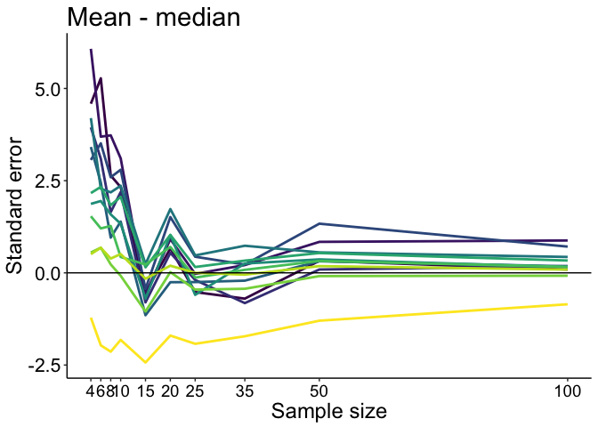

Mean SE tends to be larger than median SE across conditions, especially for small sample size. The notable exception is for the distribution with least skewness (yellow): as we get closer to a normal distribution, the median SE tends to over-estimate the mean SE, which reduces power of tests based on the median.

P(MC &gt; pop) results
======================

Probability that a Monte-Carlo estimates is inferior to the population value.

Compute P(MC &gt; pop)
----------------------

``` r
ppop.m <- matrix(0, nP, length(nvec))
ppop.md <- matrix(0, nP, length(nvec))
for(P in 1:nP){
ppop.m[P,] <- apply(sim.m[,P,] >= pop.m[P], 2, mean)
ppop.md[P,] <- apply(sim.md[,P,] >= pop.md[P], 2, mean)
}
```

Illustrate P(sample &gt; population) results
--------------------------------------------

We illustrate P(sample &gt; population), the probability that a sample mean or median is larger than the population value, as a function of skewness and sample size.

MEAN:

``` r
df <- tibble(`Bias`=as.vector(ppop.m),
             `Size`=rep(nvec,each=nP),
             `Skew`=rep(round(pop.m - pop.md),length(nvec)))

df$Skew <- as.character(df$Skew)
df$Skew <- factor(df$Skew, levels=unique(df$Skew))

# make plot
p <- ggplot(df, aes(x=Size, y=Bias), group=Skew) + theme_classic() +
  geom_line(aes(colour = Skew), size = 1) + 
  geom_abline(intercept=0.5, slope=0, colour="black") +
  scale_color_viridis(discrete = TRUE) +
  scale_x_continuous(breaks=nvec) + 
  scale_y_continuous(limits=c(0.4,0.6), breaks=seq(0.4,0.6,0.05)) +
  theme(plot.title = element_text(size=22),
        axis.title.x = element_text(size = 18),
        axis.text.x = element_text(size = 14, colour="black"),
        axis.text.y = element_text(size = 16, colour="black"),
        axis.title.y = element_text(size = 18),
        legend.key.width = unit(1.5,"cm"),
        legend.position = c(0.6,0.85),
        legend.direction = "horizontal",
        legend.text=element_text(size=16),
        legend.title=element_text(size=18)) +
  labs(x = "Sample size", y = "P(sample > population)") +
  guides(colour = guide_legend(override.aes = list(size=3))) + # make thicker legend lines
  ggtitle("Mean") 
p
```

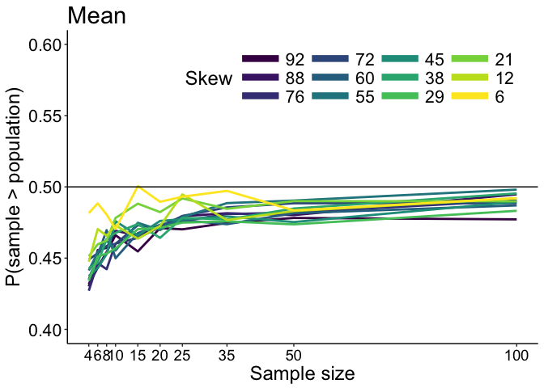

``` r
psp.m <- p
```

The distribution of probabilities is not centered at 0.50, as expected from the illustrations of the sampling distributions. The typical sample mean tends to under-estimate the population mean for all skewness levels and even with large sample sizes.

MEDIAN:

``` r
df <- tibble(`Bias`=as.vector(ppop.md),
             `Size`=rep(nvec,each=nP),
             `Skew`=rep(round(pop.m - pop.md),length(nvec)))

df$Skew <- as.character(df$Skew)
df$Skew <- factor(df$Skew, levels=unique(df$Skew))

# make plot
p <- ggplot(df, aes(x=Size, y=Bias), group=Skew) + theme_classic() +
  geom_line(aes(colour = Skew), size = 1) + 
  geom_abline(intercept=0.5, slope=0, colour="black") +
  scale_color_viridis(discrete = TRUE) +
  scale_x_continuous(breaks=nvec) + 
  scale_y_continuous(limits=c(0.4,0.6), breaks=seq(0.4,0.6,0.05)) +
  theme(plot.title = element_text(size=22),
        axis.title.x = element_text(size = 18),
        axis.text.x = element_text(size = 14, colour="black"),
        axis.text.y = element_text(size = 16, colour="black"),
        axis.title.y = element_text(size = 18),
        legend.key.width = unit(1.5,"cm"),
        legend.position = "blank",#c(0.85,0.65),
        legend.text=element_text(size=16),
        legend.title=element_text(size=18)) +
  labs(x = "Sample size", y = "P(sample > population)") +
  guides(colour = guide_legend(override.aes = list(size=3))) + # make thicker legend lines
  ggtitle("Median") 
p
```

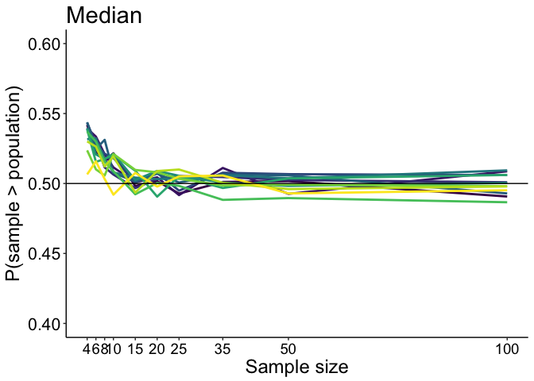

``` r
psp.md <- p
```

The sample median tends to over-estimate the population median for all skewness levels for small sample sizes. The offset reduces with increasing sample size, and faster than it does for the mean.

MEAN - MEDIAN

``` r
df <- tibble(`Bias`=as.vector(ppop.m - ppop.md),
             `Size`=rep(nvec,each=nP),
             `Skew`=rep(round(pop.m - pop.md),length(nvec)))

df$Skew <- as.character(df$Skew)
df$Skew <- factor(df$Skew, levels=unique(df$Skew))

# make plot
p <- ggplot(df, aes(x=Size, y=Bias), group=Skew) + theme_classic() +
  geom_line(aes(colour = Skew), size = 1) + 
  geom_abline(intercept=0, slope=0, colour="black") +
  scale_color_viridis(discrete = TRUE) +
  scale_x_continuous(breaks=nvec) + 
  # scale_y_continuous(limits=c(0,170), breaks=seq(0,170,20)) +
  theme(plot.title = element_text(size=22),
        axis.title.x = element_text(size = 18),
        axis.text.x = element_text(size = 14, colour="black"),
        axis.text.y = element_text(size = 16, colour="black"),
        axis.title.y = element_text(size = 18),
        legend.key.width = unit(1.5,"cm"),
        legend.position = "blank",#c(0.85,0.65),
        legend.text=element_text(size=16),
        legend.title=element_text(size=18)) +
  labs(x = "Sample size", y = "P(sample > population)") +
  guides(colour = guide_legend(override.aes = list(size=3))) + # make thicker legend lines
  ggtitle("Mean - median") 
p
```

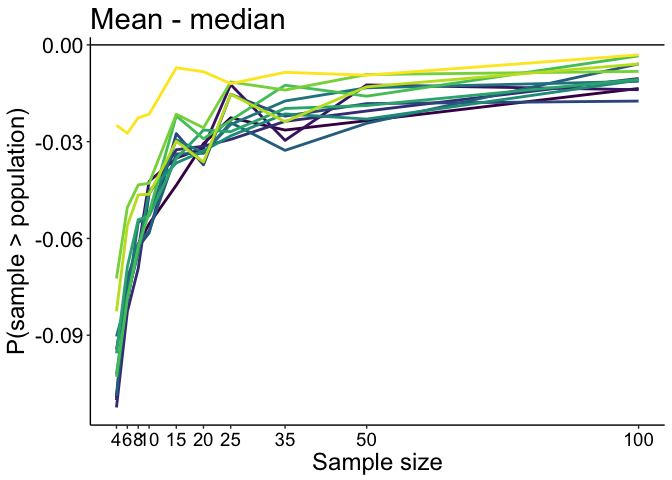
