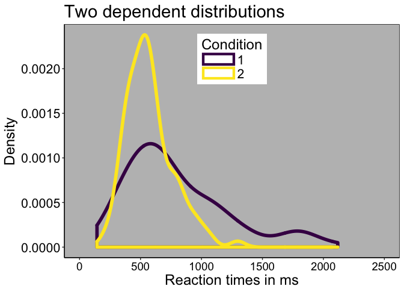
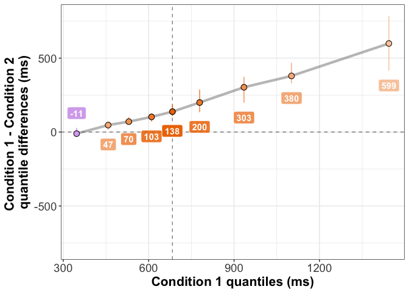
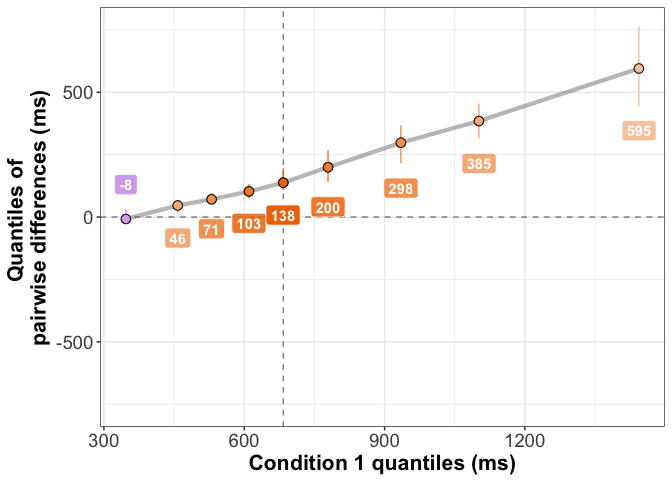
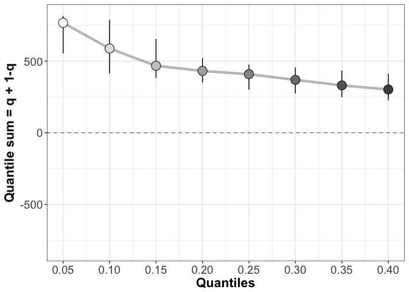
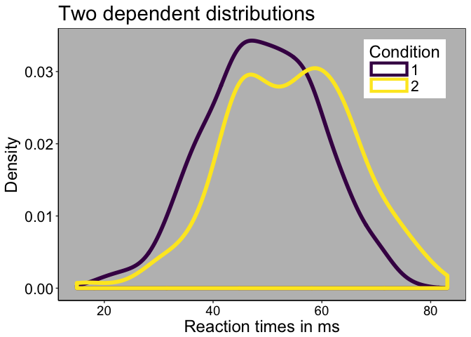
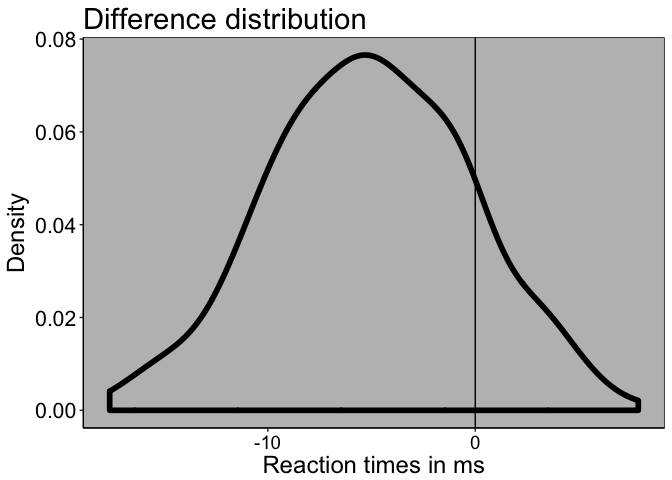
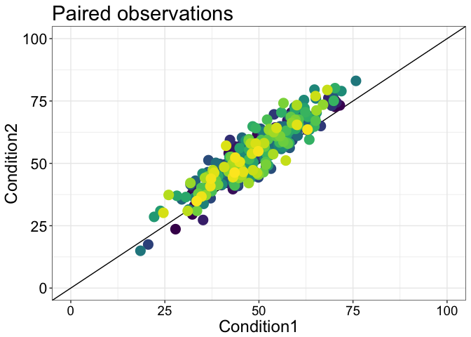
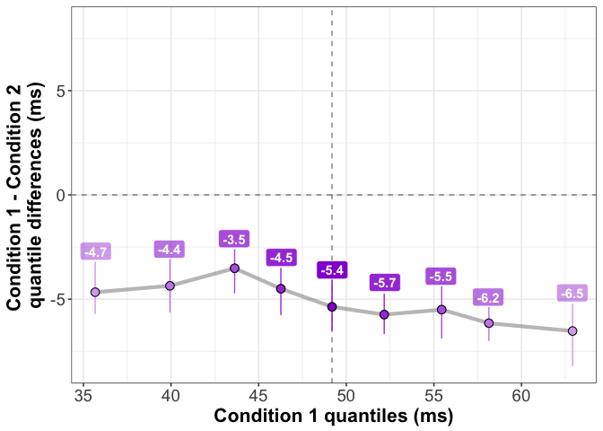
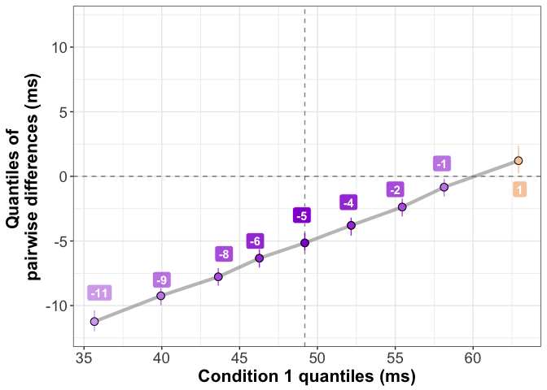
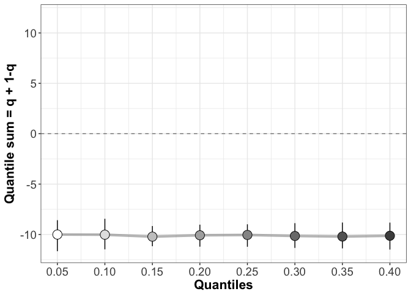

A new shift function for dependent groups?
================
Guillaume A. Rousselet
2018-04-30

-   [Dependencies](#dependencies)
-   [Example 1: dependent RT data](#example-1-dependent-rt-data)
    -   [Make data](#make-data)
    -   [Illustrate data](#illustrate-data)
    -   [Existing shift function](#existing-shift-function)
    -   [New shift function](#new-shift-function)
    -   [Difference asymmetry function](#difference-asymmetry-function)
-   [Example 2: uniform shift + normal noise](#example-2-uniform-shift-normal-noise)
    -   [Make data](#make-data-1)
    -   [Illustrate data](#illustrate-data-1)
    -   [Shift function for paired marginals](#shift-function-for-paired-marginals)
    -   [Shift function for pairwise differences](#shift-function-for-pairwise-differences)
    -   [Difference asymmetry function](#difference-asymmetry-function-1)

Dependencies
============

``` r
library(tibble)
library(viridis)
```

    ## Loading required package: viridisLite

``` r
library(brms)
```

    ## Loading required package: Rcpp

    ## Loading required package: ggplot2

    ## Loading 'brms' package (version 2.1.0). Useful instructions
    ## can be found by typing help('brms'). A more detailed introduction
    ## to the package is available through vignette('brms_overview').
    ## Run theme_set(theme_default()) to use the default bayesplot theme.

``` r
library(dplyr)
```

    ## 
    ## Attaching package: 'dplyr'

    ## The following objects are masked from 'package:stats':
    ## 
    ##     filter, lag

    ## The following objects are masked from 'package:base':
    ## 
    ##     intersect, setdiff, setequal, union

``` r
# install.packages("devtools")
# devtools::install_github("GRousselet/rogme")
library(rogme)
```

Example 1: dependent RT data
============================

Make data
---------

``` r
set.seed(77)
n <- 100
gp1 <- sort(rexgaussian(n, mu = 380, sigma = 120, beta = 400))
gp2 <- sort(rexgaussian(n, mu = 400, sigma = 100, beta = 200))

df <- tibble(Condition = factor(c(rep(1, length(gp1)),rep(2, length(gp2)))),
             RT = c(gp1, gp2))
summary(gp1)
```

    ##    Min. 1st Qu.  Median    Mean 3rd Qu.    Max. 
    ##   143.1   493.1   678.9   795.4  1033.6  2117.8

``` r
summary(gp2)
```

    ##    Min. 1st Qu.  Median    Mean 3rd Qu.    Max. 
    ##   205.2   431.7   548.5   572.9   655.3  1296.3

``` r
round(quantile(gp1, probs = seq(.1,.9,.1)))
```

    ##  10%  20%  30%  40%  50%  60%  70%  80%  90% 
    ##  334  458  525  607  679  774  915 1077 1350

``` r
round(quantile(gp2, probs = seq(.1,.9,.1)))
```

    ## 10% 20% 30% 40% 50% 60% 70% 80% 90% 
    ## 358 405 465 506 548 576 633 731 826

Illustrate data
---------------

### Kernel density estimates

``` r
p <- ggplot(df, aes(RT)) + theme_classic() +
  geom_density(aes(colour = Condition), size = 2) +
  # geom_abline(intercept=0, slope=0, colour="black") +
  scale_color_viridis(discrete = TRUE) +
  coord_cartesian(xlim = c(0, 2500)) +
  # scale_x_continuous(breaks=nvec) + 
  # scale_y_continuous(limits=c(0,22), breaks=seq(0,22,5)) +
  theme(plot.title = element_text(size=22),
        axis.title.x = element_text(size = 18),
        axis.text.x = element_text(size = 14, colour="black"),
        axis.text.y = element_text(size = 16, colour="black"),
        axis.title.y = element_text(size = 18),
        legend.key.width = unit(1.5,"cm"),
        legend.position = c(0.5,0.85),
        legend.direction = "vertical",
        legend.text=element_text(size=16),
        legend.title=element_text(size=18),
        panel.background = element_rect(fill = 'grey', colour = 'black')) +
  labs(x = "Reaction times in ms", y = "Density") +
  # guides(colour = guide_legend(override.aes = list(size=3))) + # make thicker legend lines
  ggtitle("Two dependent distributions") 
p
```



``` r
# save figure
ggsave(filename='./figures/figure_kde.png',width=7,height=5) 
```

### Scatterplot

``` r
df <- tibble(Condition1 = gp1,
             Condition2 = gp2,
             Participant = factor(seq(1,n)))

p <- ggplot(df, aes(x=Condition1, y=Condition2)) + 
  geom_abline(intercept = 0) +
  geom_point(size=4,stroke=1, aes(colour = Participant)) +
  scale_color_viridis(discrete = TRUE) +
  # coord_cartesian(xlim = c(0, 2000), ylim = c(0, 2000)) +
  theme_bw() +
  theme(plot.title = element_text(size=22),
        axis.title.x = element_text(size = 18),
        axis.text.x = element_text(size = 14, colour="black"),
        axis.text.y = element_text(size = 16, colour="black"),
        axis.title.y = element_text(size = 18),
        legend.position = "none") +
  labs(title="Paired observations") +
  coord_fixed(xlim = c(0, 2500), ylim = c(0, 2500))
p
```


``` r
# save figure
ggsave(filename='./figures/figure_scatter.png',width=7,height=5) #path=pathname
```

Existing shift function
-----------------------

``` r
df <- rogme::mkt2(gp1, gp2)
# compute shift function
sf <- rogme::shiftdhd_pbci(data = df, formula = obs ~ gr, nboot = 200)[,3:7]

# plot shift function
psf <- plot_sf(sf, plot_theme = 2, symb_size = 3)
```

    ## Scale for 'alpha' is already present. Adding another scale for 'alpha',
    ## which will replace the existing scale.

``` r
# change axis labels
psf <- psf +
  labs(x = "Condition 1 quantiles (ms)",
       y = "Condition 1 - Condition 2 \nquantile differences (ms)")

# add labels for deciles 1 & 9
psf <- add_sf_lab(psf, round(sf), y_lab_nudge = 100)
psf
```



``` r
# save figure
ggsave(filename='./figures/figure_sf_dhd.png',width=7,height=5) #path=pathname
```

New shift function
------------------

### New R code

``` r
shiftpdhd_pbci <- function(x = x, y = y, q = seq(0.1, 0.9, 0.1), nboot = 1000, alpha = 0.05){
    diff <- x - y # pairwise differences
    output <- matrix(0, nrow = length(q), ncol = 9) # define output matrix
    low <- round((alpha/2) * nboot) + 1 # low CI bound
    up <- nboot - low # high CI bound
    n <- length(x) # sample size
    for (i in 1:length(q)) { # quantile loop
        output[i, 1] = q[i] 
        output[i, 2] = n
        output[i, 3] = hd(x, q = q[i]) # condition 1 quantile
        output[i, 4] = hd(y, q = q[i]) # condition 2 quantile
        output[i, 5] = hd(diff, q = q[i]) # difference quantile
        bootsample <- matrix(sample(n, size = n * nboot, replace = TRUE), 
            nrow = nboot) # bootstrap samples
        diffmat <- matrix(diff[bootsample], nrow = nboot, ncol = n) # matrix of bootstrap differences
        bvec <- apply(diffmat, 1, hd, q = q[i]) # quantiles of bootstrap differences
        bvec <- sort(bvec) # sort in ascending order
        temp <- sum(bvec < 0)/nboot + sum(bvec == 0)/(2 * nboot) # p value
        output[i, 6] = bvec[low] # low CI bound
        output[i, 7] = bvec[up] # high CI bound
        output[i, 9] = 2 * (min(temp, 1 - temp)) # generalised p value
    }
    temp = order(output[, 9], decreasing = TRUE)
    zvec = alpha/c(1:length(q))
    output[temp, 8] = zvec
    out <- data.frame(output)
    names(out) <- c("q", "n", "c1", "c2", "difference", 
        "ci_lower", "ci_upper", "p_crit", "p_value")
    dplyr::mutate(out, sig = p_value <= p_crit)
    out
}
```

### Plot new shift function

``` r
# compute shift function
sf2 <- shiftpdhd_pbci(x = gp1, y = gp2, nboot = 200)[,3:7]

# plot shift function
psf <- plot_sf(sf2, plot_theme = 2, symb_size = 3)
```

    ## Scale for 'alpha' is already present. Adding another scale for 'alpha',
    ## which will replace the existing scale.

``` r
# change axis labels
psf <- psf +
  labs(x = "Condition 1 quantiles (ms)",
       y = "Quantiles of \npairwise differences (ms)")

# add labels for deciles 1 & 9
psf <- add_sf_lab(psf, round(sf2), y_lab_nudge = 100)
psf
```



``` r
# save figure
ggsave(filename='./figures/figure_sf_pdhd.png',width=7,height=5) #path=pathname
```

Difference asymmetry function
-----------------------------

``` r
# compute difference asymmetry function
daf <- rogme::asymdhd(gp1 - gp2)

# plot difference asymmetry function
psf <- plot_diff_asym(daf$output)
psf
```



``` r
# save figure
ggsave(filename='./figures/figure_daf.png',width=7,height=5) #path=pathname
```

Example 2: uniform shift + normal noise
=======================================

Make data
---------

``` r
set.seed(666)
n <- 300
m <- 50
sd <- 10
gp1 <- rnorm(n, mean = m, sd = sd)
# gp2 <- gp1 + rnorm(n, mean = 0, sd = 5)
gp2 <- gp1 + rnorm(n, mean = 5, sd = 5)
# sim.data <- rmul(n,p=2,cmat=diag(rep(1,p)),rho=0, mar.fun=ghdist,OP=TRUE,g=0,h=0) * sd + m
# gp1 <- sim.data[,1]
# gp2 <- sim.data[,2]

df <- tibble(Condition = factor(c(rep(1, length(gp1)),rep(2, length(gp2)))),
             RT = c(gp1, gp2))
summary(gp1)
```

    ##    Min. 1st Qu.  Median    Mean 3rd Qu.    Max. 
    ##   18.51   42.25   49.20   49.17   56.88   75.79

``` r
summary(gp2)
```

    ##    Min. 1st Qu.  Median    Mean 3rd Qu.    Max. 
    ##   14.96   45.76   54.70   54.25   62.95   83.07

``` r
round(quantile(gp1, probs = seq(.1,.9,.1)))
```

    ## 10% 20% 30% 40% 50% 60% 70% 80% 90% 
    ##  36  40  44  46  49  52  56  58  63

``` r
round(quantile(gp2, probs = seq(.1,.9,.1)))
```

    ## 10% 20% 30% 40% 50% 60% 70% 80% 90% 
    ##  41  44  47  51  55  58  61  64  69

Illustrate data
---------------

### Kernel density estimates

``` r
p <- ggplot(df, aes(RT)) + theme_classic() +
  geom_density(aes(colour = Condition), size = 2) +
  # geom_abline(intercept=0, slope=0, colour="black") +
  scale_color_viridis(discrete = TRUE) +
  # coord_cartesian(xlim = c(0, 2500)) +
  # scale_x_continuous(breaks=nvec) + 
  # scale_y_continuous(limits=c(0,22), breaks=seq(0,22,5)) +
  theme(plot.title = element_text(size=22),
        axis.title.x = element_text(size = 18),
        axis.text.x = element_text(size = 14, colour="black"),
        axis.text.y = element_text(size = 16, colour="black"),
        axis.title.y = element_text(size = 18),
        legend.key.width = unit(1.5,"cm"),
        legend.position = c(0.85,0.85),
        legend.direction = "vertical",
        legend.text=element_text(size=16),
        legend.title=element_text(size=18),
        panel.background = element_rect(fill = 'grey', colour = 'black')) +
  labs(x = "Reaction times in ms", y = "Density") +
  # guides(colour = guide_legend(override.aes = list(size=3))) + # make thicker legend lines
  ggtitle("Two dependent distributions") 
p
```



``` r
# save figure
ggsave(filename='./figures/figure_kde2.png',width=7,height=5)
```

### Pairwise differences

``` r
df <- tibble(Difference = gp1-gp2,
             Participant = factor(seq(1,n)))

p <- ggplot(df, aes(Difference)) + theme_classic() +
  geom_density(size = 2) +
  geom_vline(xintercept=0, colour="black") +
  # coord_cartesian(xlim = c(0, 2500)) +
  # scale_x_continuous(breaks=nvec) + 
  # scale_y_continuous(limits=c(0,22), breaks=seq(0,22,5)) +
  theme(plot.title = element_text(size=22),
        axis.title.x = element_text(size = 18),
        axis.text.x = element_text(size = 14, colour="black"),
        axis.text.y = element_text(size = 16, colour="black"),
        axis.title.y = element_text(size = 18),
        legend.key.width = unit(1.5,"cm"),
        legend.position = c(0.5,0.85),
        legend.direction = "vertical",
        legend.text=element_text(size=16),
        legend.title=element_text(size=18),
        panel.background = element_rect(fill = 'grey', colour = 'black')) +
  labs(x = "Reaction times in ms", y = "Density") +
  # guides(colour = guide_legend(override.aes = list(size=3))) + # make thicker legend lines
  ggtitle("Difference distribution") 
p
```



``` r
# save figure
ggsave(filename='./figures/figure_diff.png',width=7,height=5)
```

### Scatterplot

``` r
df <- tibble(Condition1 = gp1,
             Condition2 = gp2,
             Participant = factor(seq(1,n)))

p <- ggplot(df, aes(x=Condition1, y=Condition2)) + 
  geom_abline(intercept = 0) +
  geom_point(size=4,stroke=1, aes(colour = Participant)) +
  scale_color_viridis(discrete = TRUE) +
  coord_cartesian(xlim = c(0, 100), ylim = c(0, 100)) +
  theme_bw() +
  theme(plot.title = element_text(size=22),
        axis.title.x = element_text(size = 18),
        axis.text.x = element_text(size = 14, colour="black"),
        axis.text.y = element_text(size = 16, colour="black"),
        axis.title.y = element_text(size = 18),
        legend.position = "none") +
  labs(title="Paired observations") #+
  # coord_fixed(xlim = c(0, 2500), ylim = c(0, 2500))
p
```



``` r
# save figure
ggsave(filename='./figures/figure_scatter2_1.png',width=7,height=5) #path=pathname
```

### Scatterplot2

``` r
df <- tibble(Condition1 = gp1,
             Difference = gp1-gp2,
             Participant = factor(seq(1,n)))

p <- ggplot(df, aes(x=Condition1, y=Difference)) + 
  geom_hline(yintercept = 0) +
  geom_point(size=4,stroke=1, aes(colour = Participant)) +
  scale_color_viridis(discrete = TRUE) +
  coord_cartesian(xlim = c(0, 100), ylim = c(-50, 50)) +
  theme_bw() +
  theme(plot.title = element_text(size=22),
        axis.title.x = element_text(size = 18),
        axis.text.x = element_text(size = 14, colour="black"),
        axis.text.y = element_text(size = 16, colour="black"),
        axis.title.y = element_text(size = 18),
        legend.position = "none") +
  labs(title="Paired observations") #+
  # coord_fixed(xlim = c(0, 2500), ylim = c(0, 2500))
p
```


``` r
# save figure
ggsave(filename='./figures/figure_scatter2_2.png',width=7,height=5) #path=pathname
```

Shift function for paired marginals
-----------------------------------

``` r
df <- rogme::mkt2(gp1, gp2)
# compute shift function
sf <- rogme::shiftdhd_pbci(data = df, formula = obs ~ gr, nboot = 200)[,3:7]

# plot shift function
psf <- plot_sf(sf, plot_theme = 2, symb_size = 3)
```

    ## Scale for 'alpha' is already present. Adding another scale for 'alpha',
    ## which will replace the existing scale.

``` r
# change axis labels
psf <- psf +
  labs(x = "Condition 1 quantiles (ms)",
       y = "Condition 1 - Condition 2 \nquantile differences (ms)")

# add labels for deciles 1 & 9
psf <- add_sf_lab(psf, round(sf, digits = 1), y_lab_nudge = 0.5)
psf
```



``` r
# save figure
ggsave(filename='./figures/figure_sf_dhd2.png',width=7,height=5) #path=pathname
```

Shift function for pairwise differences
---------------------------------------

``` r
# compute shift function
sf2 <- shiftpdhd_pbci(x = gp1, y = gp2, nboot = 200)[,3:7]

# plot shift function
psf <- plot_sf(sf2, plot_theme = 2, symb_size = 3)
```

    ## Scale for 'alpha' is already present. Adding another scale for 'alpha',
    ## which will replace the existing scale.

``` r
# change axis labels
psf <- psf +
  labs(x = "Condition 1 quantiles (ms)",
       y = "Quantiles of \npairwise differences (ms)")

# add labels for deciles 1 & 9
psf <- add_sf_lab(psf, round(sf2), y_lab_nudge = 1)
psf
```



``` r
# save figure
ggsave(filename='./figures/figure_sf_pdhd2.png',width=7,height=5) #path=pathname
```

Difference asymmetry function
-----------------------------

``` r
# compute difference asymmetry function
daf <- rogme::asymdhd(gp1 - gp2)

# plot difference asymmetry function
psf <- plot_diff_asym(daf$output)
psf
```



``` r
# save figure
ggsave(filename='./figures/figure_daf2.png',width=7,height=5) #path=pathname
```
