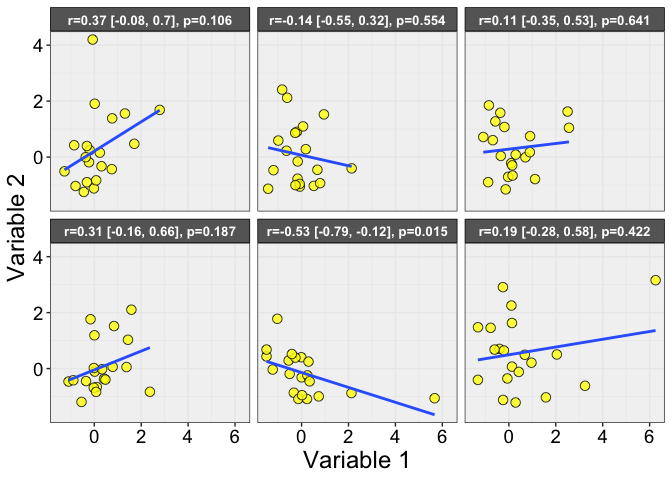
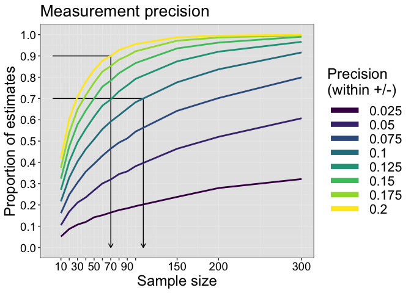
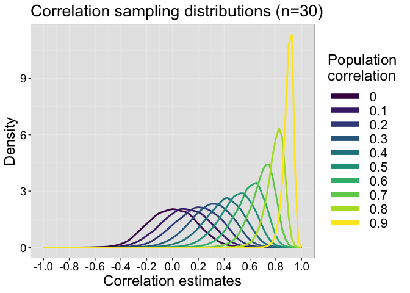
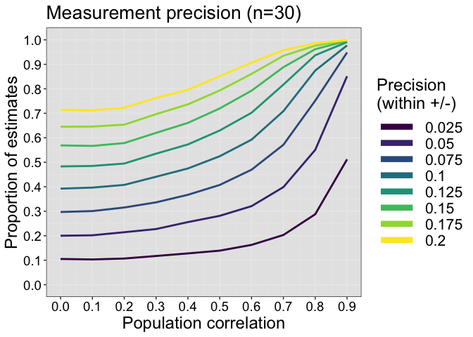
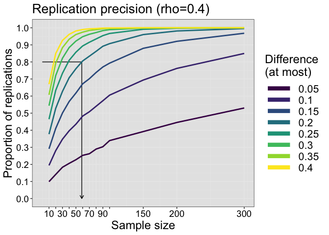

Correlation estimation
================
Guillaume A. Rousselet
2018-06-01

-   [Dependencies](#dependencies)
-   [Check `cor()` function](#check-cor-function)
    -   [n = 10](#n--10)
    -   [n = 100](#n--100)
-   [Correlations: samples from null
    population](#correlations-samples-from-null-population)
-   [Correlation estimates as a function of sample
    size](#correlation-estimates-as-a-function-of-sample-size)
    -   [Parameters](#parameters)
    -   [Generate data](#generate-data)
    -   [Plot kernel density estimates](#plot-kernel-density-estimates)
    -   [Precision](#precision)
-   [Probability to replicate an
    effect](#probability-to-replicate-an-effect)
    -   [Parameters](#parameters-1)
    -   [Generate data](#generate-data-1)
    -   [Illustrate results](#illustrate-results)
-   [Correlation estimates as a function of rho for fixed
    n](#correlation-estimates-as-a-function-of-rho-for-fixed-n)
    -   [Parameters](#parameters-2)
    -   [Generate data](#generate-data-2)
    -   [Plot kernel density
        estimates](#plot-kernel-density-estimates-1)
    -   [Precision](#precision-1)
-   [Correlation estimates as a function of sample size
    (rho=0.4)](#correlation-estimates-as-a-function-of-sample-size-rho04)
    -   [Parameters](#parameters-3)
    -   [Generate data](#generate-data-3)
    -   [Plot kernel density
        estimates](#plot-kernel-density-estimates-2)
    -   [Precision](#precision-2)
-   [Probability to replicate an effect
    (rho=0.4)](#probability-to-replicate-an-effect-rho04)
    -   [Parameters](#parameters-4)
    -   [Generate data](#generate-data-4)
    -   [Illustrate results](#illustrate-results-1)

# Dependencies

``` r
# Code to generate data from g-and-h distributions.
# g controls skewness
# h controls tail thickness
# g=0, h=0 -> normal distribution
# See details in:
# Wilcox, R.R. (2012) 
# Introduction to robust estimation and hypothesis testing. 
# Academic Press, San Diego, CA.
library(ggplot2)
library(tibble)
library(viridis)
```

    ## Loading required package: viridisLite

``` r
source('./functions/gh.txt')
source('./functions/akerd.txt')
source('./functions/theme_gar.txt')
source("./functions/gengh.txt") # John Ruscio's algorithm to generate multivariate non-normal data
```

# Check `cor()` function

## n = 10

``` r
set.seed(21)
n <- 10
g <- 0
h <- 0
p <- 1000 # 499500 correlations in one go
# generate data from g&h distributions with given correlation
data <- rmul(n,p=p,cmat=diag(rep(1,p)),rho=0,mar.fun=ghdist,OP=TRUE,g=g,h=h)
# compute all pairwise correlations
res <- cor(data, method = "pearson")
# get upper triangle of unique correlations
allcorr <- res[upper.tri(res, diag = FALSE)]
# plot histogram
hist(allcorr)
```

<!-- -->

## n = 100

``` r
set.seed(21)
n <- 100
g <- 0
h <- 0
p <- 1000 # 499500 correlations in one go!
data <- rmul(n,p=p,cmat=diag(rep(1,p)),rho=0,mar.fun=ghdist,OP=TRUE,g=g,h=h)
res <- cor(data, method = "pearson")
allcorr <- res[upper.tri(res, diag = FALSE)]
hist(allcorr, xlim = c(-1, 1))
```

<!-- -->

# Correlations: samples from null population

Generate 6 correlations to make 2 x 3 figure.

``` r
set.seed(21)
n <- 20 # sample size
rho <- 0
ncor <- 6
p <- 2

# parameters for bivariate g-and-h populations
# set parameter g to 0 to create an unrealistic normal population
npop <- 20000 # population size
g <- 0.5 # sample from skewed bivariate population
h <- 0
pop <- gengh(n.cases = npop, n.variables = 2, g = g, h = h, rho = rho, corr.type = "pearson")

res.raw <- array(data = NA, dim = c(n, 2, ncor))
res.cor <- matrix(data = NA, nrow = ncor, ncol = 4)

for(C in 1:ncor){
   # res.raw[,,C] <- rmul(n,p=p,cmat=diag(rep(1,p)),rho=rho,mar.fun=ghdist,OP=TRUE,g=g,h=h)
  # sample with replacement from population
  id <- sample(npop, size = n, replace = TRUE) 
  res.raw[,,C] <- pop[id,]
   tmp <- cor.test(res.raw[,1,C], res.raw[,2,C], method = "pearson")
   res.cor[C,1] <- tmp$estimate # correlation coefficient
   res.cor[C,2] <- tmp$conf.int[1] # CI lower bound
   res.cor[C,3] <- tmp$conf.int[2] # CI upper bound
   res.cor[C,4] <- tmp$p.value # p value
}

# make data frame
df <- tibble(x=as.vector(res.raw[,1,]), 
             y=as.vector(res.raw[,2,]),
             condition = factor(rep(c(1:ncor), each = n)))

# rename levels to make titles
levels(df$condition) <- c(paste0("r=",round(res.cor[1,1],digits=2)," [",round(res.cor[1,2],digits=2),", ",round(res.cor[1,3],digits=2),"], p=",round(res.cor[1,4],digits=3)), 
                          paste0("r=",round(res.cor[2,1],digits=2)," [",round(res.cor[2,2],digits=2),", ",round(res.cor[2,3],digits=2),"], p=",round(res.cor[2,4],digits=3)), 
                          paste0("r=",round(res.cor[3,1],digits=2)," [",round(res.cor[3,2],digits=2),", ",round(res.cor[3,3],digits=2),"], p=",round(res.cor[3,4],digits=3)), 
                          paste0("r=",round(res.cor[4,1],digits=2)," [",round(res.cor[4,2],digits=2),", ",round(res.cor[4,3],digits=2),"], p=",round(res.cor[4,4],digits=3)), 
                          paste0("r=",round(res.cor[5,1],digits=2)," [",round(res.cor[5,2],digits=2),", ",round(res.cor[5,3],digits=2),"], p=",round(res.cor[5,4],digits=3)), 
                          paste0("r=",round(res.cor[6,1],digits=2)," [",round(res.cor[6,2],digits=2),", ",round(res.cor[6,3],digits=2),"], p=",round(res.cor[6,4],digits=3)))

ggplot(data=df, aes(x=x, y=y)) + theme_gar +
  geom_point(shape=21, size=3, fill="yellow", alpha=0.8) +
  geom_smooth(method=lm, se = FALSE) +
  # coord_cartesian(xlim=c(-2.5, 2.5), ylim=c(-2.5, 2.5)) +
  theme(axis.title.x = element_text(size = 18),
        axis.text = element_text(size = 14, colour="black"),
        axis.title.y = element_text(size = 18),
        strip.text = element_text(size = 10),
        panel.background = element_rect(fill="grey95")) +
  labs(x = "Variable 1", y = "Variable 2") +
  facet_wrap(vars(condition))
```

    ## `geom_smooth()` using formula 'y ~ x'

<!-- -->

``` r
# save figure
# ggsave(filename='./figures/figure_random_correlation.png',width=7,height=5) 
```

# Correlation estimates as a function of sample size

## Parameters

``` r
nseq <- c(seq(10, 100, 10), 150, 200, 300) # sample sizes
Nn <- length(nseq)
pts <- seq(-1, 1, 0.025) # KDE points
Np <- length(pts)
preseq <- seq(0.025, 0.2, 0.025) # precision bounds
Npre <- length(preseq)
g <- 0
h <- 0
rho <- 0
p <- 200 # 19900 correlations - sum(upper.tri(matrix(0, p, p), diag = FALSE))
Nsim <- 10000
```

## Generate data

``` r
set.seed(21)
# declare result matrices
res.cor <- matrix(data = 0, nrow = Np, ncol = Nn) 
res.pre <- matrix(data = 0, nrow = Npre, ncol = Nn)

for(iter.n in 1:Nn){
  print(paste0("Sample size = ", nseq[iter.n]))
  
  ## original code
  # data <- rmul(nseq[iter.n],p=p,cmat=diag(rep(1,p)),rho=rho,mar.fun=ghdist,OP=TRUE,g=g,h=h)
  # res <- cor(data, method = "pearson")
  # allcorr <- res[upper.tri(res, diag = FALSE)]
  
  ## code suggested by Jan Vanhove:
  # https://twitter.com/janhove/status/1002659890589061120/photo/1
  allcorr <- replicate(Nsim, cor(MASS::mvrnorm(n = nseq[iter.n], mu = c(0,0), Sigma = matrix(c(1, rho, rho, 1), nrow = 2, byrow = TRUE)))[1,2])
  
  res.cor[,iter.n] <- akerd(allcorr, pyhat=TRUE, pts=pts, plotit=FALSE)
  
  # Probability of getting estimate within +/- x of population value
  for(iter.p in 1:Npre){
    res.pre[iter.p, iter.n] <- mean(allcorr <= preseq[iter.p] & allcorr >= (-1*preseq[iter.p]))
  }
  
}

save(res.cor, res.pre,
     file = "./data/samp_dist.RData")
```

## Plot kernel density estimates

``` r
# get data
load("./data/samp_dist.RData")

# make data frame
fm <- array(0, dim = c(Np, Nn+1)) # make full matrix
fm[,1] <- pts
fm[,2:(Nn+1)] <- res.cor
colnames(fm) <- c("x",nseq)
df <- as_tibble(fm)
df <- tidyr::gather(df, SS, Density,2:(Nn+1))
df[[2]] <- as.character(df[[2]])
df[[2]] <- factor(df[[2]], levels=unique(df[[2]]))

# make plot
p <- ggplot(df, aes(x, Density)) + theme_gar +
          geom_line(aes(colour = SS), size = 1)  + 
          scale_color_viridis(discrete = TRUE) + 
          theme(axis.title.x = element_text(size = 18),
                axis.text = element_text(size = 14, colour = "black"),
                axis.title.y = element_text(size = 18),
                legend.key.width = unit(1.5,"cm"),
                legend.text = element_text(size = 16),
                legend.title = element_text(size = 18),
                legend.position = "right",
                plot.title = element_text(size = 20, colour = "black"),
                panel.background = element_rect(fill="grey90")) +
          scale_x_continuous(limits = c(-1, 1), 
                             breaks = seq(-1, 1, 0.2)) +
  labs(x = "Correlation estimates", y = "Density") +
  ggtitle("Correlation sampling distributions") +
  guides(colour = guide_legend(override.aes = list(size=3), # make thicker legend lines
        title="Sample size")) # change legend title
p
```

<!-- -->

``` r
# save figure
# ggsave(filename='./figures/figure_sampling_distributions.png',width=9,height=5) 
```

## Precision

``` r
df <- tibble(`Proportion` = as.vector(res.pre),
             `Precision` = rep(preseq, Nn),
             `Size` = rep(nseq, each = Npre))

df$Precision <- as.character(df$Precision)
df$Precision <- factor(df$Precision, levels=unique(df$Precision))

# data frame to plot segments
tmp.pos <- approx(y=nseq,x=res.pre[4,],xout=0.70)$y
df.seg1 <- tibble(x=0, xend=tmp.pos,
                  y=0.7, yend=0.7)
df.seg2 <- tibble(x=tmp.pos, xend=tmp.pos,
                  y=0.7, yend=0)
tmp.pos <- approx(y=nseq,x=res.pre[8,],xout=0.90)$y
df.seg3 <- tibble(x=0, xend=tmp.pos,
                  y=0.9, yend=0.9)
df.seg4 <- tibble(x=tmp.pos, xend=tmp.pos,
                  y=0.9, yend=0)

# make plot
p <- ggplot(df, aes(x=Size, y=Proportion)) + theme_gar +
  # geom_abline(intercept=0.7, slope=0, colour="grey20") +
  geom_segment(data = df.seg1, aes(x=x, y=y, xend=xend, yend=yend)) +
  geom_segment(data = df.seg2, aes(x=x, y=y, xend=xend, yend=yend), 
               arrow = arrow(length = unit(0.2, "cm"))) +
  geom_segment(data = df.seg3, aes(x=x, y=y, xend=xend, yend=yend)) +
  geom_segment(data = df.seg4, aes(x=x, y=y, xend=xend, yend=yend), 
               arrow = arrow(length = unit(0.2, "cm"))) +
  geom_line(aes(colour = Precision), size = 1) + 
  scale_color_viridis(discrete = TRUE) +
  scale_x_continuous(breaks=nseq, 
            labels = c("10",  "",  "30", "", "50",  "", "70", "", "90", "", "150", "200", "300")) + 
  scale_y_continuous(breaks=seq(0, 1, 0.1)) +
  coord_cartesian(ylim=c(0, 1)) +
  theme(plot.title = element_text(size=20),
        axis.title.x = element_text(size = 18),
        axis.text = element_text(size = 14, colour="black"),
        axis.title.y = element_text(size = 18),
        legend.key.width = unit(1.5,"cm"),
        legend.position = "right",
        legend.text=element_text(size = 16),
        legend.title=element_text(size = 18),
        panel.background = element_rect(fill="grey90")) +
  labs(x = "Sample size", y = "Proportion of estimates") +
  guides(colour = guide_legend(override.aes = list(size=3), # make thicker legend lines
    title = "Precision \n(within +/-)")) + # change legend title
  ggtitle("Measurement precision") 
p
```

<!-- -->

``` r
# save figure
# ggsave(filename='./figures/figure_precision.png',width=9,height=5) 
```

For 70% of estimates to be within +/- 0.1 of the true correlation value
(between -0.1 and 0.1), we need at least 109 observations.

For 90% of estimates to be within +/- 0.2 of the true correlation value
(between -0.2 and 0.2), we need at least 70 observations.

# Probability to replicate an effect

For a given precision, what is the probability to observe similar
effects in two consecutive experiments? In other words, what is the
probability that two measurements differ by at most a certain amount?

## Parameters

``` r
nseq <- c(seq(10, 100, 10), 150, 200, 300) # sample sizes
Nn <- length(nseq)
preseq <- seq(0.025, 0.2, 0.025) # precision bounds
Npre <- length(preseq)
g <- 0
h <- 0
rho <- 0
p <- 500 # 124750 correlations - sum(upper.tri(matrix(0, p, p), diag = FALSE))
Nsim <- 10000
```

## Generate data

``` r
set.seed(21)
# declare result matrices
res.rep <- matrix(data = 0, nrow = Npre, ncol = Nn)

for(iter.n in 1:Nn){
  print(paste0("Sample size = ", nseq[iter.n]))
  
  ## original code
  # data <- rmul(nseq[iter.n],p=p,cmat=diag(rep(1,p)),rho=rho,mar.fun=ghdist,OP=TRUE,g=g,h=h)
  # res <- cor(data, method = "pearson")
  # allcorr1 <- res[upper.tri(res, diag = FALSE)]
  # data <- rmul(nseq[iter.n],p=p,cmat=diag(rep(1,p)),rho=rho,mar.fun=ghdist,OP=TRUE,g=g,h=h)
  # res <- cor(data, method = "pearson")
  # allcorr2 <- res[upper.tri(res, diag = FALSE)]
  
   ## code suggested by Jan Vanhove:
  # https://twitter.com/janhove/status/1002659890589061120/photo/1
  allcorr1 <- replicate(Nsim, cor(MASS::mvrnorm(n = nseq[iter.n], mu = c(0,0), Sigma = matrix(c(1, rho, rho, 1), nrow = 2, byrow = TRUE)))[1,2])
  
  allcorr2 <- replicate(Nsim, cor(MASS::mvrnorm(n = nseq[iter.n], mu = c(0,0), Sigma = matrix(c(1, rho, rho, 1), nrow = 2, byrow = TRUE)))[1,2])
  
  # Probability of getting estimates at most x units of each other
  for(iter.p in 1:Npre){
    res.rep[iter.p, iter.n] <- mean( abs(allcorr1-allcorr2) <= (preseq[iter.p]*2) )
  }
  
}

save(res.rep,
     file = "./data/replication.RData")
```

## Illustrate results

``` r
load("./data/replication.RData")
df <- tibble(`Proportion` = as.vector(res.rep),
             `Precision` = rep(preseq*2, Nn),
             `Size` = rep(nseq, each = Npre))

df$Precision <- as.character(df$Precision)
df$Precision <- factor(df$Precision, levels=unique(df$Precision))

# data frame to plot segments
tmp.pos <- approx(y=nseq,x=res.rep[4,],xout=0.8)$y
df.seg1 <- tibble(x=0, xend=tmp.pos,
                  y=0.8, yend=0.8)
df.seg2 <- tibble(x=tmp.pos, xend=tmp.pos,
                  y=0.8, yend=0)
# tmp.pos <- approx(y=nseq,x=res.pre[8,],xout=0.90)$y
# df.seg3 <- tibble(x=0, xend=tmp.pos,
#                   y=0.9, yend=0.9)
# df.seg4 <- tibble(x=tmp.pos, xend=tmp.pos,
#                   y=0.9, yend=0)

# make plot
p <- ggplot(df, aes(x=Size, y=Proportion)) + theme_gar +
  # geom_abline(intercept=0.7, slope=0, colour="grey20") +
  geom_segment(data = df.seg1, aes(x=x, y=y, xend=xend, yend=yend)) +
  geom_segment(data = df.seg2, aes(x=x, y=y, xend=xend, yend=yend),
               arrow = arrow(length = unit(0.2, "cm"))) +
  # geom_segment(data = df.seg3, aes(x=x, y=y, xend=xend, yend=yend)) +
  # geom_segment(data = df.seg4, aes(x=x, y=y, xend=xend, yend=yend), 
  #              arrow = arrow(length = unit(0.2, "cm"))) +
  geom_line(aes(colour = Precision), size = 1) + 
  scale_color_viridis(discrete = TRUE) +
  scale_x_continuous(breaks=nseq, 
            labels = c("10",  "",  "30", "", "50",  "", "70", "", "90", "", "150", "200", "300")) + 
  scale_y_continuous(breaks=seq(0, 1, 0.1)) +
  coord_cartesian(ylim=c(0, 1)) +
  theme(plot.title = element_text(size=20),
        axis.title.x = element_text(size = 18),
        axis.text = element_text(size = 14, colour="black"),
        axis.title.y = element_text(size = 18),
        legend.key.width = unit(1.5,"cm"),
        legend.position = "right",
        legend.text=element_text(size = 16),
        legend.title=element_text(size = 18),
        panel.background = element_rect(fill="grey90")) +
  labs(x = "Sample size", y = "Proportion of replications") +
  guides(colour = guide_legend(override.aes = list(size=3), # make thicker legend lines
    title = "Difference \n(at most)")) + # change legend title
  ggtitle("Replication precision") 
p
```

<!-- -->

``` r
# save figure
# ggsave(filename='./figures/figure_replication.png',width=9,height=5) 
```

For 80% of replications to be at most 0.2 apart, we need at least 83
observations.

What happens when there is an effect?

# Correlation estimates as a function of rho for fixed n

For a given sample size, estimate correlations for different Pearson’s
population (rho) correlations.

## Parameters

``` r
n <- 30 # sample size
rhoseq <- seq(0, 0.9, 0.1) # rho
Nrho <- length(rhoseq)
pts <- seq(-1, 1, 0.025) # KDE points
Np <- length(pts)
preseq <- seq(0.025, 0.2, 0.025) # precision bounds
Npre <- length(preseq)
g <- 0
h <- 0
# rho <- 0
p <- 200 # 19900 correlations - sum(upper.tri(matrix(0, p, p), diag = FALSE))
Nsim <- 10000
```

## Generate data

``` r
set.seed(666)
# declare result matrices
res.cor <- matrix(data = 0, nrow = Np, ncol = Nrho)
res.pre <- matrix(data = 0, nrow = Npre, ncol = Nrho)

for(iter.rho in 1:Nrho){
  print(paste0("rho = ", rhoseq[iter.rho]))
  
  ## original code:
  # data <- rmul(n,p=p,cmat=diag(rep(1,p)),rho=rhoseq[iter.rho],mar.fun=ghdist,OP=TRUE,g=g,h=h)
  # res <- cor(data, method = "pearson")
  # allcorr <- res[upper.tri(res, diag = FALSE)]
  
  ## code suggested by Jan Vanhove:
  # https://twitter.com/janhove/status/1002659890589061120/photo/1
  allcorr <- replicate(Nsim, cor(MASS::mvrnorm(n = n, mu = c(0,0), Sigma = matrix(c(1, rhoseq[iter.rho], rhoseq[iter.rho], 1), nrow = 2, byrow = TRUE)))[1,2])
  
  res.cor[,iter.rho] <- akerd(allcorr, pyhat=TRUE, pts=pts, plotit=FALSE)
  
  # Probability of getting estimate within +/- x of population value
  for(iter.p in 1:Npre){
    res.pre[iter.p, iter.rho] <- mean( (allcorr-rhoseq[iter.rho]) <= (preseq[iter.p]) & (allcorr-rhoseq[iter.rho]) >= (-1*preseq[iter.p]))
  }
  
}

save(res.cor, res.pre,
     file = "./data/samp_dist_rho.RData")
```

## Plot kernel density estimates

``` r
# get data
load("./data/samp_dist_rho.RData")

# make data frame
fm <- array(0, dim = c(Np, Nrho+1)) # make full matrix
fm[,1] <- pts
fm[,2:(Nrho+1)] <- res.cor
colnames(fm) <- c("x",rhoseq)
df <- as_tibble(fm)
df <- tidyr::gather(df, RHO, Density,2:(Nrho+1))
df[[2]] <- as.character(df[[2]])
df[[2]] <- factor(df[[2]], levels=unique(df[[2]]))

# make plot
p <- ggplot(df, aes(x, Density)) + theme_gar +
          geom_line(aes(colour = RHO), size = 1)  + 
          scale_color_viridis(discrete = TRUE) + 
          theme(axis.title.x = element_text(size = 18),
                axis.text = element_text(size = 14, colour = "black"),
                axis.title.y = element_text(size = 18),
                legend.key.width = unit(1.5,"cm"),
                legend.text = element_text(size = 16),
                legend.title = element_text(size = 18),
                legend.position = "right",
                plot.title = element_text(size = 20, colour = "black"),
                panel.background = element_rect(fill="grey90")) +
          scale_x_continuous(limits = c(-1, 1), 
                             breaks = seq(-1, 1, 0.2)) +
  labs(x = "Correlation estimates", y = "Density") +
  ggtitle("Correlation sampling distributions (n=30)") +
  guides(colour = guide_legend(override.aes = list(size=3), # make thicker legend lines
        title="Population \ncorrelation")) # change legend title
p
```

<!-- -->

``` r
# save figure
# ggsave(filename='./figures/figure_sampling_distributions_rho.png',width=9,height=5) 
```

## Precision

``` r
df <- tibble(`Proportion` = as.vector(res.pre),
             `Precision` = rep(preseq, Nrho),
             `Rho` = rep(rhoseq, each = Npre))

df$Precision <- as.character(df$Precision)
df$Precision <- factor(df$Precision, levels=unique(df$Precision))

# data frame to plot segments
# tmp.pos <- approx(y=nseq,x=res.pre[4,],xout=0.70)$y
# df.seg1 <- tibble(x=0, xend=tmp.pos,
#                   y=0.7, yend=0.7)
# df.seg2 <- tibble(x=tmp.pos, xend=tmp.pos,
#                   y=0.7, yend=0)
# tmp.pos <- approx(y=nseq,x=res.pre[8,],xout=0.90)$y
# df.seg3 <- tibble(x=0, xend=tmp.pos,
#                   y=0.9, yend=0.9)
# df.seg4 <- tibble(x=tmp.pos, xend=tmp.pos,
#                   y=0.9, yend=0)

# make plot
p <- ggplot(df, aes(x=Rho, y=Proportion)) + theme_gar +
  # geom_abline(intercept=0.7, slope=0, colour="grey20") +
  # geom_segment(data = df.seg1, aes(x=x, y=y, xend=xend, yend=yend)) +
  # geom_segment(data = df.seg2, aes(x=x, y=y, xend=xend, yend=yend), 
  #              arrow = arrow(length = unit(0.2, "cm"))) +
  # geom_segment(data = df.seg3, aes(x=x, y=y, xend=xend, yend=yend)) +
  # geom_segment(data = df.seg4, aes(x=x, y=y, xend=xend, yend=yend), 
  #              arrow = arrow(length = unit(0.2, "cm"))) +
  geom_line(aes(colour = Precision), size = 1) + 
  scale_color_viridis(discrete = TRUE) +
  scale_x_continuous(breaks=rhoseq) + 
  scale_y_continuous(breaks=seq(0, 1, 0.1)) +
  coord_cartesian(ylim=c(0, 1)) +
  theme(plot.title = element_text(size=20),
        axis.title.x = element_text(size = 18),
        axis.text = element_text(size = 14, colour="black"),
        axis.title.y = element_text(size = 18),
        legend.key.width = unit(1.5,"cm"),
        legend.position = "right",
        legend.text=element_text(size = 16),
        legend.title=element_text(size = 18),
        panel.background = element_rect(fill="grey90")) +
  labs(x = "Population correlation", y = "Proportion of estimates") +
  guides(colour = guide_legend(override.aes = list(size=3), # make thicker legend lines
    title = "Precision \n(within +/-)")) + # change legend title
  ggtitle("Measurement precision (n=30)") 
p
```

<!-- -->

``` r
# save figure
# ggsave(filename='./figures/figure_precision_rho.png',width=9,height=5) 
```

Let’s look in more detail at the sampling distributions for a generous
rho = 0.4.

# Correlation estimates as a function of sample size (rho=0.4)

## Parameters

``` r
nseq <- c(seq(10, 100, 10), 150, 200, 300) # sample sizes
Nn <- length(nseq)
pts <- seq(-1, 1, 0.025) # KDE points
Np <- length(pts)
preseq <- seq(0.025, 0.2, 0.025) # precision bounds
Npre <- length(preseq)
g <- 0
h <- 0
rho <- 0.4
p <- 200 # 19900 correlations - sum(upper.tri(matrix(0, p, p), diag = FALSE))
Nsim <- 10000
```

## Generate data

``` r
set.seed(21)
# declare result matrices
res.cor <- matrix(data = 0, nrow = Np, ncol = Nn) 
res.pre <- matrix(data = 0, nrow = Npre, ncol = Nn)

for(iter.n in 1:Nn){
  print(paste0("Sample size = ", nseq[iter.n]))
  
  ## original code
  # data <- rmul(nseq[iter.n],p=p,cmat=diag(rep(1,p)),rho=rho,mar.fun=ghdist,OP=TRUE,g=g,h=h)
  # res <- cor(data, method = "pearson")
  # allcorr <- res[upper.tri(res, diag = FALSE)]
  
   ## code suggested by Jan Vanhove:
  # https://twitter.com/janhove/status/1002659890589061120/photo/1
  allcorr <- replicate(Nsim, cor(MASS::mvrnorm(n = nseq[iter.n], mu = c(0,0), Sigma = matrix(c(1, rho, rho, 1), nrow = 2, byrow = TRUE)))[1,2])
  
  res.cor[,iter.n] <- akerd(allcorr, pyhat=TRUE, pts=pts, plotit=FALSE)
  
  # Probability of getting estimate within +/-x% of population value
  for(iter.p in 1:Npre){
    res.pre[iter.p, iter.n] <- mean((allcorr-rho) <= preseq[iter.p] & (allcorr-rho) >= (-1*preseq[iter.p]))
  }
  
}

save(res.cor, res.pre,
     file = "./data/samp_dist_rho04.RData")
```

## Plot kernel density estimates

``` r
# get data
load("./data/samp_dist_rho04.RData")

# make data frame
fm <- array(0, dim = c(Np, Nn+1)) # make full matrix
fm[,1] <- pts
fm[,2:(Nn+1)] <- res.cor
colnames(fm) <- c("x",nseq)
df <- as_tibble(fm)
df <- tidyr::gather(df, SS, Density,2:(Nn+1))
df[[2]] <- as.character(df[[2]])
df[[2]] <- factor(df[[2]], levels=unique(df[[2]]))

# make plot
p <- ggplot(df, aes(x, Density)) + theme_gar +
          geom_line(aes(colour = SS), size = 1)  + 
          scale_color_viridis(discrete = TRUE) + 
          theme(axis.title.x = element_text(size = 18),
                axis.text = element_text(size = 14, colour = "black"),
                axis.title.y = element_text(size = 18),
                legend.key.width = unit(1.5,"cm"),
                legend.text = element_text(size = 16),
                legend.title = element_text(size = 18),
                legend.position = "right",
                plot.title = element_text(size = 20, colour = "black"),
                panel.background = element_rect(fill="grey90")) +
          scale_x_continuous(limits = c(-1, 1), 
                             breaks = seq(-1, 1, 0.2)) +
  labs(x = "Correlation estimates", y = "Density") +
  ggtitle("Correlation sampling distributions (rho=0.4)") +
  guides(colour = guide_legend(override.aes = list(size=3), # make thicker legend lines
        title="Sample size")) # change legend title
p
```

<!-- -->

``` r
# save figure
# ggsave(filename='./figures/figure_sampling_distributions_rho04.png',width=9,height=5) 
```

## Precision

``` r
df <- tibble(`Proportion` = as.vector(res.pre),
             `Precision` = rep(preseq, Nn),
             `Size` = rep(nseq, each = Npre))

df$Precision <- as.character(df$Precision)
df$Precision <- factor(df$Precision, levels=unique(df$Precision))

# data frame to plot segments
tmp.pos <- approx(y=nseq,x=res.pre[4,],xout=0.70)$y
df.seg1 <- tibble(x=0, xend=tmp.pos,
                  y=0.7, yend=0.7)
df.seg2 <- tibble(x=tmp.pos, xend=tmp.pos,
                  y=0.7, yend=0)
tmp.pos <- approx(y=nseq,x=res.pre[8,],xout=0.90)$y
df.seg3 <- tibble(x=0, xend=tmp.pos,
                  y=0.9, yend=0.9)
df.seg4 <- tibble(x=tmp.pos, xend=tmp.pos,
                  y=0.9, yend=0)

# make plot
p <- ggplot(df, aes(x=Size, y=Proportion)) + theme_gar +
  # geom_abline(intercept=0.7, slope=0, colour="grey20") +
  geom_segment(data = df.seg1, aes(x=x, y=y, xend=xend, yend=yend)) +
  geom_segment(data = df.seg2, aes(x=x, y=y, xend=xend, yend=yend),
               arrow = arrow(length = unit(0.2, "cm"))) +
  geom_segment(data = df.seg3, aes(x=x, y=y, xend=xend, yend=yend)) +
  geom_segment(data = df.seg4, aes(x=x, y=y, xend=xend, yend=yend),
               arrow = arrow(length = unit(0.2, "cm"))) +
  geom_line(aes(colour = Precision), size = 1) + 
  scale_color_viridis(discrete = TRUE) +
  scale_x_continuous(breaks=nseq, 
            labels = c("10",  "",  "30", "", "50",  "", "70", "", "90", "", "150", "200", "300")) + 
  scale_y_continuous(breaks=seq(0, 1, 0.1)) +
  coord_cartesian(ylim=c(0, 1)) +
  theme(plot.title = element_text(size=20),
        axis.title.x = element_text(size = 18),
        axis.text = element_text(size = 14, colour="black"),
        axis.title.y = element_text(size = 18),
        legend.key.width = unit(1.5,"cm"),
        legend.position = "right",
        legend.text=element_text(size = 16),
        legend.title=element_text(size = 18),
        panel.background = element_rect(fill="grey90")) +
  labs(x = "Sample size", y = "Proportion of estimates") +
  guides(colour = guide_legend(override.aes = list(size=3), # make thicker legend lines
    title = "Precision \n(within +/-)")) + # change legend title
  ggtitle("Measurement precision (rho=0.4)") 
p
```

<!-- -->

``` r
# save figure
# ggsave(filename='./figures/figure_precision_rho04.png',width=9,height=5) 
```

For 70% of estimates to be within +/- 0.1 of the true correlation value
(between 0.3 and 0.5), we need at least 78 observations.

For 90% of estimates to be within +/- 0.2 of the true correlation value
(between 0.2 and 0.6), we need at least 50 observations.

# Probability to replicate an effect (rho=0.4)

For a given precision, what is the probability to observe similar
effects in two consecutive experiments? In other words, what is the
probability that two measurements differ by at most a certain amount?

## Parameters

``` r
nseq <- c(seq(10, 100, 10), 150, 200, 300) # sample sizes
Nn <- length(nseq)
preseq <- seq(0.025, 0.2, 0.025) # precision bounds
Npre <- length(preseq)
g <- 0
h <- 0
rho <- 0.4
p <- 500 # 124750 correlations - sum(upper.tri(matrix(0, p, p), diag = FALSE))
Nsim <- 10000
```

## Generate data

``` r
set.seed(21)
# declare result matrices
res.rep <- matrix(data = 0, nrow = Npre, ncol = Nn)

for(iter.n in 1:Nn){
  print(paste0("Sample size = ", nseq[iter.n]))
  
  ## original code
  # data <- rmul(nseq[iter.n],p=p,cmat=diag(rep(1,p)),rho=rho,mar.fun=ghdist,OP=TRUE,g=g,h=h)
  # res <- cor(data, method = "pearson")
  # allcorr1 <- res[upper.tri(res, diag = FALSE)]
  # data <- rmul(nseq[iter.n],p=p,cmat=diag(rep(1,p)),rho=rho,mar.fun=ghdist,OP=TRUE,g=g,h=h)
  # res <- cor(data, method = "pearson")
  # allcorr2 <- res[upper.tri(res, diag = FALSE)]
  
  ## code suggested by Jan Vanhove:
  # https://twitter.com/janhove/status/1002659890589061120/photo/1
  allcorr1 <- replicate(Nsim, cor(MASS::mvrnorm(n = nseq[iter.n], mu = c(0,0), Sigma = matrix(c(1, rho, rho, 1), nrow = 2, byrow = TRUE)))[1,2])
  
  allcorr2 <- replicate(Nsim, cor(MASS::mvrnorm(n = nseq[iter.n], mu = c(0,0), Sigma = matrix(c(1, rho, rho, 1), nrow = 2, byrow = TRUE)))[1,2])
  
  # Probability of getting estimates at most x units of each other
  for(iter.p in 1:Npre){
    res.rep[iter.p, iter.n] <- mean( abs(allcorr1-allcorr2) <= (preseq[iter.p]*2) )
  }
  
}

save(res.rep,
     file = "./data/replication_rho04.RData")
```

## Illustrate results

``` r
load("./data/replication_rho04.RData")
df <- tibble(`Proportion` = as.vector(res.rep),
             `Precision` = rep(preseq*2, Nn),
             `Size` = rep(nseq, each = Npre))

df$Precision <- as.character(df$Precision)
df$Precision <- factor(df$Precision, levels=unique(df$Precision))

# data frame to plot segments
tmp.pos <- approx(y=nseq,x=res.rep[4,],xout=0.8)$y
df.seg1 <- tibble(x=0, xend=tmp.pos,
                  y=0.8, yend=0.8)
df.seg2 <- tibble(x=tmp.pos, xend=tmp.pos,
                  y=0.8, yend=0)
# tmp.pos <- approx(y=nseq,x=res.pre[8,],xout=0.90)$y
# df.seg3 <- tibble(x=0, xend=tmp.pos,
#                   y=0.9, yend=0.9)
# df.seg4 <- tibble(x=tmp.pos, xend=tmp.pos,
#                   y=0.9, yend=0)

# make plot
p <- ggplot(df, aes(x=Size, y=Proportion)) + theme_gar +
  # geom_abline(intercept=0.7, slope=0, colour="grey20") +
  geom_segment(data = df.seg1, aes(x=x, y=y, xend=xend, yend=yend)) +
  geom_segment(data = df.seg2, aes(x=x, y=y, xend=xend, yend=yend),
               arrow = arrow(length = unit(0.2, "cm"))) +
  # geom_segment(data = df.seg3, aes(x=x, y=y, xend=xend, yend=yend)) +
  # geom_segment(data = df.seg4, aes(x=x, y=y, xend=xend, yend=yend), 
  #              arrow = arrow(length = unit(0.2, "cm"))) +
  geom_line(aes(colour = Precision), size = 1) + 
  scale_color_viridis(discrete = TRUE) +
  scale_x_continuous(breaks=nseq, 
            labels = c("10",  "",  "30", "", "50",  "", "70", "", "90", "", "150", "200", "300")) + 
  scale_y_continuous(breaks=seq(0, 1, 0.1)) +
  coord_cartesian(ylim=c(0, 1)) +
  theme(plot.title = element_text(size=20),
        axis.title.x = element_text(size = 18),
        axis.text = element_text(size = 14, colour="black"),
        axis.title.y = element_text(size = 18),
        legend.key.width = unit(1.5,"cm"),
        legend.position = "right",
        legend.text=element_text(size = 16),
        legend.title=element_text(size = 18),
        panel.background = element_rect(fill="grey90")) +
  labs(x = "Sample size", y = "Proportion of replications") +
  guides(colour = guide_legend(override.aes = list(size=3), # make thicker legend lines
    title = "Difference \n(at most)")) + # change legend title
  ggtitle("Replication precision (rho=0.4)") 
p
```

<!-- -->

``` r
# save figure
# ggsave(filename='./figures/figure_replication_rho04.png',width=9,height=5) 
```

For 80% of replications to be at most 0.2 apart, we need at least 59
observations.
