One-sample confidence interval: coverage, width, shift
================
Guillaume A. Rousselet
2019-07-10

# Dependencies

``` r
library(tibble)
library(ggplot2)
library(cowplot)
source("./functions/theme_gar.txt")
source("./functions/fun.txt")
```

``` r
sessionInfo()
```

    ## R version 3.5.2 (2018-12-20)
    ## Platform: x86_64-apple-darwin15.6.0 (64-bit)
    ## Running under: macOS Mojave 10.14.4
    ## 
    ## Matrix products: default
    ## BLAS: /Library/Frameworks/R.framework/Versions/3.5/Resources/lib/libRblas.0.dylib
    ## LAPACK: /Library/Frameworks/R.framework/Versions/3.5/Resources/lib/libRlapack.dylib
    ## 
    ## locale:
    ## [1] en_GB.UTF-8/en_GB.UTF-8/en_GB.UTF-8/C/en_GB.UTF-8/en_GB.UTF-8
    ## 
    ## attached base packages:
    ## [1] stats     graphics  grDevices utils     datasets  methods   base     
    ## 
    ## other attached packages:
    ## [1] cowplot_0.9.4 ggplot2_3.1.1 tibble_2.1.1 
    ## 
    ## loaded via a namespace (and not attached):
    ##  [1] Rcpp_1.0.1       knitr_1.23       magrittr_1.5     tidyselect_0.2.5
    ##  [5] munsell_0.5.0    colorspace_1.4-1 R6_2.4.0         rlang_0.3.4     
    ##  [9] stringr_1.4.0    plyr_1.8.4       dplyr_0.8.0.1    tools_3.5.2     
    ## [13] grid_3.5.2       gtable_0.3.0     xfun_0.8         withr_2.1.2     
    ## [17] htmltools_0.3.6  yaml_2.2.0       lazyeval_0.2.2   digest_0.6.18   
    ## [21] assertthat_0.2.1 crayon_1.3.4     purrr_0.3.2      glue_1.3.1      
    ## [25] evaluate_0.13    rmarkdown_1.13   stringi_1.4.3    compiler_3.5.2  
    ## [29] pillar_1.3.1     scales_1.0.0     pkgconfig_2.0.2

# When is a 95% confidence interval not a 95% confidence interval?

Seems like a weird question? Not if we consider the definition of a
confidence interval (CI). Let say we conduct an experiment to estimate
quantity *x* from a sample, where *x* could be the median or the mean
for instance. Then a 95% CI for the population value of *x* refers to a
procedure whose behaviour is defined in the long-run: the 95% CI should
contain the population value in 95% of exact replications of the
experiment. For a single experiment, the particular CI does or does not
contain the population value, there is no probability associated with
it. The CI can also be described as the interval compatible with the
data given our model — see definitions and common misinterpretations in
Greenland et al. (2016).

So 95% refers to the (long-term) coverage of the CI; the exact values of
the CI bounds vary across experiments. The CI procedure is associated
with a certain coverage probability, in the long-run, given the model.
Here the model refers to how we collected data, data cleaning procedures
(e.g. outlier removal), assumptions about data distribution, and the
methods used to compute the CI. Coverage can differ from the expected
one if model assumptions are violated or the model is just plain wrong.

Wrong models are extremely common, for instance when applying standard
t-test CI to percent correct data (Kruschke, 2014; Jaeger, 2008) or
likert scale data (Bürkner & Vuorre, 2019; Liddell & Kruschke, 2019).

For continuous data, CI coverage is not at the expected, nominal level,
for instance when the model expects symmetric distributions and we’re
actually sampling from skewed populations. Here we explore this issue
using *g & h* distributions, that let us manipulate asymmetry.

# Illustrate *g & h* distributions

The `ghdist()` function is used to generate random numbers from *g & h*
distributions. All such distributions have a median of zero. The
parameter `g` controls the asymmetry of the distribution, while the
parameter `h` controls the thickness of the tails (Hoaglin, 1985; Yan &
Genton, 2019).

## Examples in which we vary g from 0 to 1.

``` r
ng <- seq(0,1,0.1)
x <- seq(-4, 6, 0.05)
res.g <- array(0, dim = c(length(x), length(ng)))
for(G in 1:length(ng)){
  set.seed(7)
  res.g[,G] <- akerd(ghdist(10000, g = ng[G], h = 0), pts = x, pyhat = TRUE, plotit = FALSE)
}
save(ng, x, res.g, file = "./data/gdemo.RData")
```

### Combine all kernel density functions into one data frame and make summary figure

``` r
load(file = "./data/gdemo.RData")
# make data frame
fm <- array(0, dim = c(length(x), length(ng)+1)) # make full matrix
fm[,1] <- x
fm[,2:(length(ng)+1)] <- res.g
colnames(fm) <- c("x", "0", "0.1", "0.2", "0.3", "0.4", "0.5", "0.6", "0.7", "0.8", "0.9", "1")
df <- as_tibble(fm)
df <- tidyr::gather(df, g, Density,2:(length(ng)+1))
df[[2]] <- as.factor(df[[2]])

# make plot
p <- ggplot(df, aes(x, Density, group = g)) + theme_gar +
          geom_line(aes(colour = g), size=0.5) +
          scale_colour_viridis_d(end = 0.9) +
          theme(axis.title.x = element_text(size = 18),
                axis.text = element_text(size = 16),
                axis.title.y = element_text(size = 18)) +
          scale_y_continuous(breaks = seq(0, 1, 0.2)) +
  scale_x_continuous(limits = c(-4, 6),
                     breaks = seq(-4, 6, 1)) +
  labs(x = "x values", y = "Density") +
  guides(colour = guide_legend(override.aes = list(size=3)))
p
```

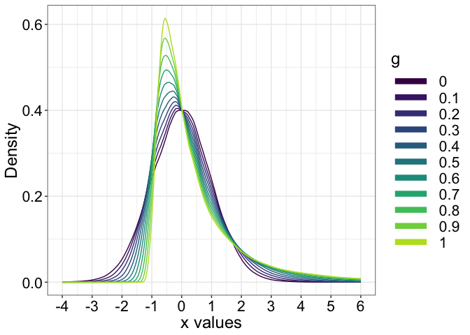<!-- -->

``` r
# save figure
# ggsave(filename='./figures/figure_g_distributions.pdf',width=7,height=5)
```

As `g` increases, the asymmetry of the distributions increases. Using
negative `g` values would produce distributions with negative skewness.

## Examples in which we vary h from 0 to 0.2.

``` r
nh <- seq(0,0.2,0.1)
x <- seq(-6, 6, 0.01)
res.h <- array(0, dim = c(length(x), length(nh)))
for(H in 1:length(nh)){
  set.seed(7)
  res.h[,H] <- akerd(ghdist(10000, g = 0, h = nh[H]), pts = x, pyhat = TRUE, plotit = FALSE)
}
save(nh, x, res.h, file = "./data/hdemo.RData")
```

### Combine all kernel density functions into one data frame and make summary figure

``` r
load(file = "./data/hdemo.RData")
# make data frame
fm <- array(0, dim = c(length(x), length(nh)+1)) # make full matrix
fm[,1] <- x
fm[,2:(length(nh)+1)] <- res.h
colnames(fm) <- c("x", "0", "0.1", "0.2")

df <- as_tibble(fm)
df <- tidyr::gather(df, h, Density,2:(length(nh)+1))
df[[2]] <- as.factor(df[[2]])

# make plot
p <- ggplot(df, aes(x, Density, group = h)) + theme_gar +
          geom_line(aes(colour = h), size=0.5) +
          scale_colour_viridis_d(end = 0.9) +
          theme(axis.title.x = element_text(size = 18),
                axis.text = element_text(size = 16),
                axis.title.y = element_text(size = 18)) +
          scale_y_continuous(breaks = seq(0, 0.5, 0.1)) +
  scale_x_continuous(limits = c(-6, 6),
                     breaks = seq(-6, 6, 1)) +
  labs(x = "x values", y = "Density") +
  guides(colour = guide_legend(override.aes = list(size=3)))
p
```

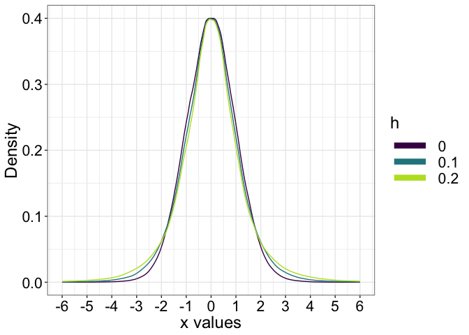<!-- -->

``` r
# save figure
# ggsave(filename='./figures/figure_h_distributions.pdf',width=7,height=5) 
```

As `h` increases, the tails are getting thicker, which means that
outliers are more likely.

# Test with normal (g=h=0) distribution

We sample with replacement from a normal population. Each sample has
size n=30. Confidence intervals are computed for the mean, the 10%
trimmed mean, the 20% trimmed mean and the median using parametric
methods. The trimmed mean and the median are robust measures of central
tendency. To compute a 10% trimmed mean, observations are sorted, the
10% lowest and 10% largest values are discarded (20% in total), and the
remaining values are averaged. In this context, the mean is a 0% trimmed
mean and the median is a 50% trimmed mean. Trimming the data attenuates
the influence of the tails of the distributions and thus the effects of
asymmetry and outliers on confidence intervals.

``` r
set.seed(666) # reproducible results
nsim <- 20000 # simulation iterations
nsamp <- 30 # sample size
pop <- ghdist(1000000, g=0, h=0) # define population
pop.m <- mean(pop) # population mean
pop.tm10 <- mean(pop, trim = 0.1) # population 10% trimmed mean
pop.tm20 <- mean(pop, trim = 0.2) # population 20% trimmed mean
pop.md <- median(pop) # population median
# declare matrices of results
ci.cov <- matrix(0, nrow = nsim, ncol = 4)
ci.all <- array(0, dim = c(nsim, 4, 2))
ci.wid <- matrix(0, nrow = nsim, ncol = 4)
ci.dis <- matrix(NA, nrow = nsim, ncol = 4)

for(S in 1:nsim){ # simulation loop
  samp <- sample(pop, nsamp, replace = TRUE) # random sample from population
  # Mean ===================================
  ci <- t.test(samp, mu = pop.m)$conf.int # standard t-test equation
  ci.all[S,1,] <- ci
  ci.cov[S,1] <- cover(ci, pop.m) # CI includes population value?
  ci.wid[S,1] <- ci[2] - ci[1]
  if(ci.cov[S,1] == 0){ # direction of discrepancy?
    if(pop.m > ci[2]){
      ci.dis[S,1] <- -1 # left shift
    }
    if(pop.m < ci[1]){
      ci.dis[S,1] <- 1 # right shift
    }
  }
  # 10% Trimmed mean =======================
  ci <- trimci.light(samp, tr = 0.1, alpha = 0.05)
  ci.all[S,2,] <- ci
  ci.cov[S,2] <- cover(ci, pop.tm10) # CI includes population value?
  ci.wid[S,2] <- ci[2] - ci[1]
  if(ci.cov[S,2] == 0){ # direction of discrepancy?
    if(pop.tm10 > ci[2]){
      ci.dis[S,2] <- -1 # left shift
    }
    if(pop.tm10 < ci[1]){
      ci.dis[S,2] <- 1 # right shift
    }
  }
  # 20% Trimmed mean =======================
  ci <- trimci.light(samp, tr = 0.2, alpha = 0.05)
  ci.all[S,3,] <- ci
  ci.cov[S,3] <- cover(ci, pop.tm20) # CI includes population value?
  ci.wid[S,3] <- ci[2] - ci[1]
  if(ci.cov[S,3] == 0){ # direction of discrepancy?
    if(pop.tm20 > ci[2]){
      ci.dis[S,3] <- -1 # left shift
    }
    if(pop.tm20 < ci[1]){
      ci.dis[S,3] <- 1 # right shift
    }
  }
  # Median =======================
  ci <- sint(samp, alpha = 0.05)
  ci.all[S,4,] <- ci
  ci.cov[S,4] <- cover(ci, pop.md) # CI includes population value?
  ci.wid[S,4] <- ci[2] - ci[1]
  if(ci.cov[S,4] == 0){ # direction of discrepancy?
    if(pop.md > ci[2]){
      ci.dis[S,4] <- -1 # left shift
    }
    if(pop.md < ci[1]){
      ci.dis[S,4] <- 1 # right shift
    }
  }
}

# save simulation results to load in next chunk
save(ci.cov, ci.wid, ci.dis, ci.all, 
     pop.m, pop.tm10, pop.tm20, pop.md,    
     file = "./data/cov_test_g0h0.RData")
```

## Check averages across simulations

``` r
load(file = "./data/cov_test_normal.RData")
# CI coverage
round(apply(ci.cov, 2, mean), digits = 3) 
```

    ## [1] 0.949 0.948 0.943 0.947

The coverage is close to nominal (95%) for every method.

``` r
# CI width
round(apply(ci.wid, 2, median), digits = 3) 
```

    ## [1] 0.737 0.761 0.793 0.889

But CIs tends to be larger for trimmed means and median, which implies
lower power under normality (Wilcox & Rousselet, 2018).

``` r
# CI average shift: 
# ~0 = balanced
# negative = left shift
# positive = right shift
round(apply(ci.dis, 2, mean, na.rm = TRUE), digits = 3)
```

    ## [1] 0.046 0.043 0.009 0.013

``` r
# apply(ci.dis==-1, 2, sum, na.rm = TRUE) 
# apply(ci.dis==1, 2, sum, na.rm = TRUE)
```

For CIs that did not include the population, the distribution is fairly
balanced between the left and the right of the population.

## Illustrate CI that did not include the population

### Mean

``` r
pop <- pop.m
cond <- 1 # mean
ci <- ci.all[ci.cov[,cond]==0, cond,]
df <- tibble(x1 = ci[,1],
             x2 = ci[,2],
             y = seq(1,length(x1)))

p <- ggplot(df, aes(x = x1, xend = x2, y = y, yend = y)) + theme_gar +
  geom_segment() +
  geom_vline(xintercept = pop) +
labs(x = "Bounds", y = "Confidence intervals") +
  coord_cartesian(xlim = c(-1.5, 1.5),
                  ylim = c(1, length(df$x1)), expand = TRUE) +
  scale_x_continuous(breaks = seq(-2, 2, 0.5)) +
  ggtitle("Mean")
p
```

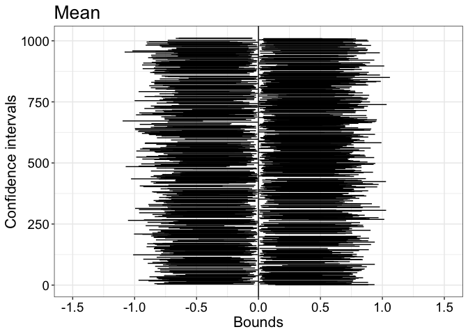<!-- -->

``` r
pA <- p
```

Out of 20,000 simulated experiments, about 1,000 CI (roughly 5%) did not
include the population value. About the same number of CIs were shifted
to the left and to the right of the population value. The same result
was observed for the other estimators.

``` r
apply(ci.dis==-1, 2, sum, na.rm = TRUE)
```

    ## [1] 482 502 568 524

``` r
apply(ci.dis==1, 2, sum, na.rm = TRUE)
```

    ## [1] 529 547 578 538

### 10% trimmed mean

``` r
pop <- pop.tm10
cond <- 2 # 10% trimmed mean
ci <- ci.all[ci.cov[,cond]==0, cond,]
df <- tibble(x1 = ci[,1],
             x2 = ci[,2],
             y = seq(1,length(x1)))

p <- ggplot(df, aes(x = x1, xend = x2, y = y, yend = y)) + theme_gar +
  geom_segment() +
  geom_vline(xintercept = pop) +
labs(x = "Bounds", y = "Confidence intervals") +
  coord_cartesian(xlim = c(-1.5, 1.5),
                  ylim = c(1, length(df$x1)), expand = TRUE) +
  scale_x_continuous(breaks = seq(-2, 2, 0.5)) +
  ggtitle("10% trimmed mean") 
p
```

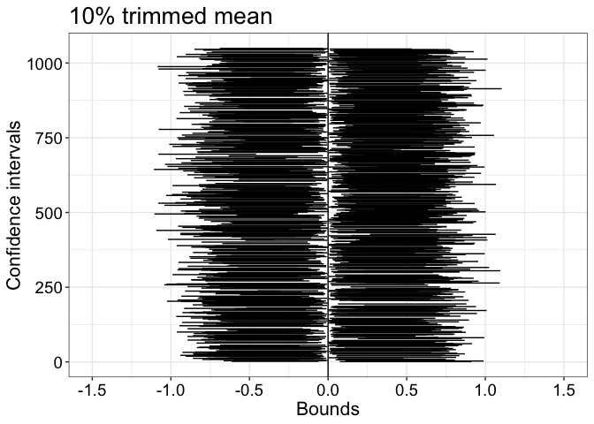<!-- -->

``` r
pB <- p
```

### 20% trimmed mean

``` r
pop <- pop.tm20
cond <- 3 # 20% trimmed mean
ci <- ci.all[ci.cov[,cond]==0, cond,]
df <- tibble(x1 = ci[,1],
             x2 = ci[,2],
             y = seq(1,length(x1)))

p <- ggplot(df, aes(x = x1, xend = x2, y = y, yend = y)) + theme_gar +
  geom_segment() +
  geom_vline(xintercept = pop) +
labs(x = "Bounds", y = "Confidence intervals") +
  coord_cartesian(xlim = c(-1.5, 1.5),
                  ylim = c(1, length(df$x1)), expand = TRUE) +
  scale_x_continuous(breaks = seq(-2, 2, 0.5)) +
  ggtitle("20% trimmed mean") 
p
```

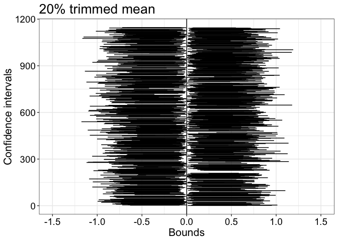<!-- -->

``` r
pC <- p
```

### Median

``` r
pop <- pop.md
cond <- 4 # median
ci <- ci.all[ci.cov[,cond]==0, cond,]
df <- tibble(x1 = ci[,1],
             x2 = ci[,2],
             y = seq(1,length(x1)))

p <- ggplot(df, aes(x = x1, xend = x2, y = y, yend = y)) + theme_gar +
  geom_segment() +
  geom_vline(xintercept = pop) +
labs(x = "Bounds", y = "Confidence intervals") +
  coord_cartesian(xlim = c(-1.5, 1.5),
                  ylim = c(1, length(df$x1)), expand = TRUE) +
  scale_x_continuous(breaks = seq(-2, 2, 0.5)) +
  ggtitle("Median") 
p
```

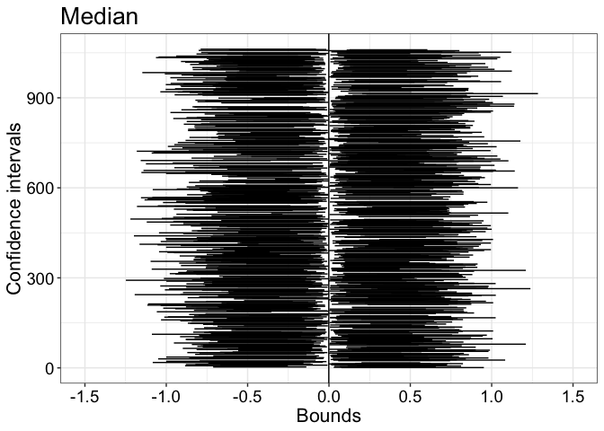<!-- -->

``` r
pD <- p
```

Across panels, the more we trim (10%, 20%, median) the larger the CIs
get.

## Summary figure

``` r
cowplot::plot_grid(pA, pB, pC, pD,
                   labels = c("A", "B", "C", "D"), 
                   nrow = 2)

# save figure
ggsave(filename=('./figures/figure_g0h0_ci.pdf'),width=15,height=10)
```

# Test with g=1 & h=0 distribution

What happens for a skewed population?

``` r
set.seed(666) # reproducible results
nsim <- 20000 # simulation iterations
nsamp <- 30 # sample size
pop <- ghdist(1000000, g=1, h=0) # define population
pop.m <- mean(pop) # population mean
pop.tm10 <- mean(pop, trim = 0.1) # population 10% trimmed mean
pop.tm20 <- mean(pop, trim = 0.2) # population 20% trimmed mean
pop.md <- median(pop) # population median
# declare matrices of results
ci.cov <- matrix(0, nrow = nsim, ncol = 4)
ci.all <- array(0, dim = c(nsim, 4, 2))
ci.wid <- matrix(0, nrow = nsim, ncol = 4)
ci.dis <- matrix(NA, nrow = nsim, ncol = 4)

for(S in 1:nsim){ # simulation loop
  samp <- sample(pop, nsamp, replace = TRUE) # random sample from population
  # Mean ===================================
  ci <- t.test(samp, mu = pop.m)$conf.int # standard t-test equation
  ci.all[S,1,] <- ci
  ci.cov[S,1] <- cover(ci, pop.m) # CI includes population value?
  ci.wid[S,1] <- ci[2] - ci[1]
  if(ci.cov[S,1] == 0){ # direction of discrepancy?
    if(pop.m > ci[2]){
      ci.dis[S,1] <- -1 # left shift
    }
    if(pop.m < ci[1]){
      ci.dis[S,1] <- 1 # right shift
    }
  }
  # 10% Trimmed mean =======================
  ci <- trimci.light(samp, tr = 0.1, alpha = 0.05)
  ci.all[S,2,] <- ci
  ci.cov[S,2] <- cover(ci, pop.tm10) # CI includes population value?
  ci.wid[S,2] <- ci[2] - ci[1]
  if(ci.cov[S,2] == 0){ # direction of discrepancy?
    if(pop.tm10 > ci[2]){
      ci.dis[S,2] <- -1 # left shift
    }
    if(pop.tm10 < ci[1]){
      ci.dis[S,2] <- 1 # right shift
    }
  }
  # 20% Trimmed mean =======================
  ci <- trimci.light(samp, tr = 0.2, alpha = 0.05)
  ci.all[S,3,] <- ci
  ci.cov[S,3] <- cover(ci, pop.tm20) # CI includes population value?
  ci.wid[S,3] <- ci[2] - ci[1]
  if(ci.cov[S,3] == 0){ # direction of discrepancy?
    if(pop.tm20 > ci[2]){
      ci.dis[S,3] <- -1 # left shift
    }
    if(pop.tm20 < ci[1]){
      ci.dis[S,3] <- 1 # right shift
    }
  }
  # Median =======================
  ci <- sint(samp, alpha = 0.05)
  ci.all[S,4,] <- ci
  ci.cov[S,4] <- cover(ci, pop.md) # CI includes population value?
  ci.wid[S,4] <- ci[2] - ci[1]
  if(ci.cov[S,4] == 0){ # direction of discrepancy?
    if(pop.md > ci[2]){
      ci.dis[S,4] <- -1 # left shift
    }
    if(pop.md < ci[1]){
      ci.dis[S,4] <- 1 # right shift
    }
  }
}

# save simulation results to load in next chunk
save(ci.cov, ci.wid, ci.dis, ci.all, 
     pop.m, pop.tm10, pop.tm20, pop.md,
     file = "./data/cov_test_g1h0.RData")
```

## Check averages across simulations

``` r
load(file = "./data/cov_test_g1h0.RData")
# CI coverage
round(apply(ci.cov, 2, mean), digits = 3) 
```

    ## [1] 0.880 0.936 0.935 0.947

``` r
# CI width
round(apply(ci.wid, 2, median), digits = 3)  
```

    ## [1] 1.253 0.956 0.879 0.918

``` r
# CI average shift: 
# ~0 = balanced
# negative = left shift
# positive = right shift
round(apply(ci.dis, 2, mean, na.rm = TRUE), digits = 3)  
```

    ## [1] -0.962 -0.708 -0.661  0.017

``` r
# Frequency of left shifts
apply(ci.dis==-1, 2, sum, na.rm = TRUE) 
```

    ## [1] 2350 1101 1084  521

``` r
# Frequency of right shifts
apply(ci.dis==1, 2, sum, na.rm = TRUE)
```

    ## [1]  45 188 221 539

Coverage is about 88% for the mean, 93.6% for the 10% trimmed mean,
93.5% for the 20% trimmed mean, and 94.7% for the median.

CIs are larger for the population mean than the other quantities, which
leads to lower statistical power when sampling from skewed distributions
(Wilcox & Rousselet, 2018).

CIs that did not include the population value were distributed evenly on
either side of the population only for the mean. For the other
quantities, most CIs were shifted to the left of the population value,
and much more so for the mean. This behaviour is explained by the sample
mean being median biased: when sampling from a skewed distribution, the
typical mean underestimates the population mean, which also contributes
to reduced power. Conversely, the sample median is median unbiased,
which leads to a symmetric distribution of CIs on either side of the
population median (Rousselet & Wilcox, 2019).

## Illustrate CIs that did not include the population

### Mean

``` r
pop <- pop.m
cond <- 1 # mean
ci <- ci.all[ci.cov[,cond]==0, cond,]
df <- tibble(x1 = ci[,1],
             x2 = ci[,2],
             y = seq(1,length(x1)))

p <- ggplot(df, aes(x = x1, xend = x2, y = y, yend = y)) + theme_gar +
  geom_segment() +
  geom_vline(xintercept = pop) +
labs(x = "Bounds", y = "Confidence intervals") +
  coord_cartesian(xlim = c(-1, 5.5),
                  ylim = c(1, length(df$x1)), expand = TRUE) +
  scale_x_continuous(breaks = seq(-2, 10, 0.5)) +
  ggtitle("Mean")
p
```

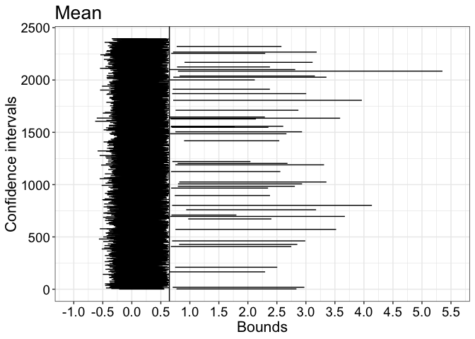<!-- -->

``` r
pA <- p
```

The figure illustrates the strong imbalance between left and right CI
shifts. Also, the right shifted CIs vary a lot in width and can be very
large.

As we trim, the imbalance is progressively resolved.

### 10% trimmed mean

``` r
pop <- pop.tm10
cond <- 2 # 10% trimmed mean
ci <- ci.all[ci.cov[,cond]==0, cond,]
df <- tibble(x1 = ci[,1],
             x2 = ci[,2],
             y = seq(1,length(x1)))

p <- ggplot(df, aes(x = x1, xend = x2, y = y, yend = y)) + theme_gar +
  geom_segment() +
  geom_vline(xintercept = pop) +
labs(x = "Bounds", y = "Confidence intervals") +
coord_cartesian(xlim = c(-1, 5.5),
                  ylim = c(1, length(df$x1)), expand = TRUE) +
  scale_x_continuous(breaks = seq(-2, 10, 0.5)) +
  ggtitle("10% trimmed mean") 
p
```

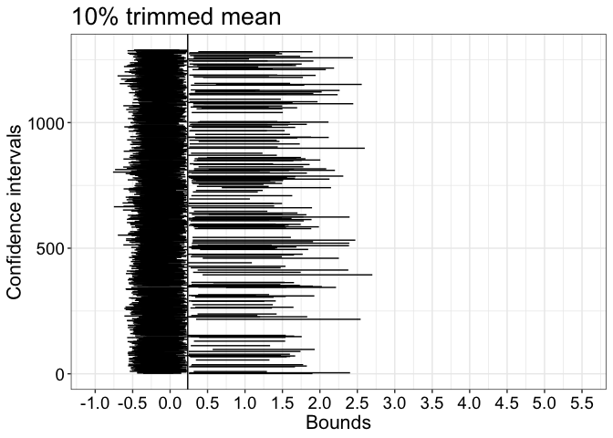<!-- -->

``` r
pB <- p
```

### 20% trimmed mean

``` r
pop <- pop.tm20
cond <- 3 # 20% trimmed mean
ci <- ci.all[ci.cov[,cond]==0, cond,]
df <- tibble(x1 = ci[,1],
             x2 = ci[,2],
             y = seq(1,length(x1)))

p <- ggplot(df, aes(x = x1, xend = x2, y = y, yend = y)) + theme_gar +
  geom_segment() +
  geom_vline(xintercept = pop) +
labs(x = "Bounds", y = "Confidence intervals") +
coord_cartesian(xlim = c(-1, 5.5),
                  ylim = c(1, length(df$x1)), expand = TRUE) +
  scale_x_continuous(breaks = seq(-2, 10, 0.5)) +
  ggtitle("20% trimmed mean") 
p
```

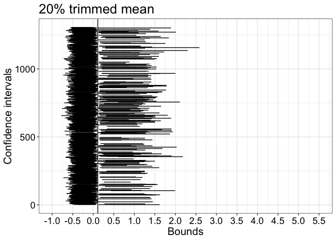<!-- -->

``` r
pC <- p
```

With 20% trimming, when CIs do not contain the population value, the
distribution of left and right shifts is more balanced, although with
still far more left shifts.

### Median

``` r
pop <- pop.md
cond <- 4 # median
ci <- ci.all[ci.cov[,cond]==0, cond,]
df <- tibble(x1 = ci[,1],
             x2 = ci[,2],
             y = seq(1,length(x1)))

p <- ggplot(df, aes(x = x1, xend = x2, y = y, yend = y)) + theme_gar +
  geom_segment() +
  geom_vline(xintercept = pop) +
labs(x = "Bounds", y = "Confidence intervals") +
coord_cartesian(xlim = c(-1, 5.5),
                  ylim = c(1, length(df$x1)), expand = TRUE) +
  scale_x_continuous(breaks = seq(-2, 10, 0.5)) +
  ggtitle("Median") 
p
```

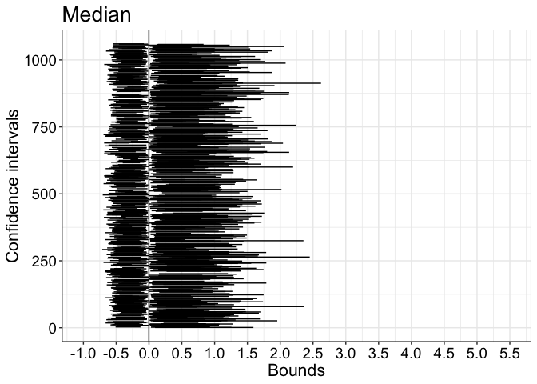<!-- -->

``` r
pD <- p
```

With the median we have roughly 50% left / 50% right shifts and CIs are
narrower than for the mean.

## Summary figure

``` r
cowplot::plot_grid(pA, pB, pC, pD,
                   labels = c("A", "B", "C", "D"), 
                   nrow = 2)

# save figure
ggsave(filename=('./figures/figure_g1h0_ci.pdf'),width=15,height=10)
```

# Test with g=1 & h=0.2 distribution

What happens if we sample from a skewed distribution (`g=1`) in which
outliers are likely(`h=0.2`)?

``` r
set.seed(666) # reproducible results
nsim <- 20000 # simulation iterations
nsamp <- 30 # sample size
pop <- ghdist(1000000, g=1, h=0.2) # define population
pop.m <- mean(pop) # population mean
pop.tm10 <- mean(pop, trim = 0.1) # population 10% trimmed mean
pop.tm20 <- mean(pop, trim = 0.2) # population 20% trimmed mean
pop.md <- median(pop) # population median
# declare matrices of results
ci.cov <- matrix(0, nrow = nsim, ncol = 4)
ci.all <- array(0, dim = c(nsim, 4, 2))
ci.wid <- matrix(0, nrow = nsim, ncol = 4)
ci.dis <- matrix(NA, nrow = nsim, ncol = 4)

for(S in 1:nsim){ # simulation loop
  samp <- sample(pop, nsamp, replace = TRUE) # random sample from population
  # Mean ===================================
  ci <- t.test(samp, mu = pop.m)$conf.int # standard t-test equation
  ci.all[S,1,] <- ci
  ci.cov[S,1] <- cover(ci, pop.m) # CI includes population value?
  ci.wid[S,1] <- ci[2] - ci[1]
  if(ci.cov[S,1] == 0){ # direction of discrepancy?
    if(pop.m > ci[2]){
      ci.dis[S,1] <- -1 # left shift
    }
    if(pop.m < ci[1]){
      ci.dis[S,1] <- 1 # right shift
    }
  }
  # 10% Trimmed mean =======================
  ci <- trimci.light(samp, tr = 0.1, alpha = 0.05)
  ci.all[S,2,] <- ci
  ci.cov[S,2] <- cover(ci, pop.tm10) # CI includes population value?
  ci.wid[S,2] <- ci[2] - ci[1]
  if(ci.cov[S,2] == 0){ # direction of discrepancy?
    if(pop.tm10 > ci[2]){
      ci.dis[S,2] <- -1 # left shift
    }
    if(pop.tm10 < ci[1]){
      ci.dis[S,2] <- 1 # right shift
    }
  }
  # 20% Trimmed mean =======================
  ci <- trimci.light(samp, tr = 0.2, alpha = 0.05)
  ci.all[S,3,] <- ci
  ci.cov[S,3] <- cover(ci, pop.tm20) # CI includes population value?
  ci.wid[S,3] <- ci[2] - ci[1]
  if(ci.cov[S,3] == 0){ # direction of discrepancy?
    if(pop.tm20 > ci[2]){
      ci.dis[S,3] <- -1 # left shift
    }
    if(pop.tm20 < ci[1]){
      ci.dis[S,3] <- 1 # right shift
    }
  }
  # Median =======================
  ci <- sint(samp, alpha = 0.05)
  ci.all[S,4,] <- ci
  ci.cov[S,4] <- cover(ci, pop.md) # CI includes population value?
  ci.wid[S,4] <- ci[2] - ci[1]
  if(ci.cov[S,4] == 0){ # direction of discrepancy?
    if(pop.md > ci[2]){
      ci.dis[S,4] <- -1 # left shift
    }
    if(pop.md < ci[1]){
      ci.dis[S,4] <- 1 # right shift
    }
  }
}

# save simulation results to load in next chunk
save(ci.cov, ci.wid, ci.dis, ci.all, 
     pop.m, pop.tm10, pop.tm20, pop.md,
     file = "./data/cov_test_g1h02.RData")
```

## Check averages across simulations

``` r
load(file = "./data/cov_test_g1h02.RData")
# CI coverage
round(apply(ci.cov, 2, mean), digits = 3) 
```

    ## [1] 0.801 0.934 0.936 0.947

``` r
# CI width
round(apply(ci.wid, 2, median), digits = 3)  
```

    ## [1] 1.729 1.080 0.934 0.944

``` r
# CI average shift: 
# ~0 = balanced
# negative = left shift
# positive = right shift
round(apply(ci.dis, 2, mean, na.rm = TRUE), digits = 3)  
```

    ## [1] -0.995 -0.797 -0.709  0.018

``` r
# Frequency of left shifts
apply(ci.dis==-1, 2, sum, na.rm = TRUE) 
```

    ## [1] 3967 1194 1086  521

``` r
# Frequency of right shifts
apply(ci.dis==1, 2, sum, na.rm = TRUE)
```

    ## [1]   9 135 185 540

The results are similar to those observed for `h=0`, only exacerbated.
Coverage for the mean is even lower, CIs are larger, and the shift
imbalance even more severe.

## Illustrate CI that did not include the population

### Mean

``` r
pop <- pop.m
cond <- 1 # mean
ci <- ci.all[ci.cov[,cond]==0, cond,]
df <- tibble(x1 = ci[,1],
             x2 = ci[,2],
             y = seq(1,length(x1)))

p <- ggplot(df, aes(x = x1, xend = x2, y = y, yend = y)) + theme_gar +
  geom_segment() +
  geom_vline(xintercept = pop) +
labs(x = "Bounds", y = "Confidence intervals") +
coord_cartesian(xlim = c(-1, 5),
                  ylim = c(1, length(df$x1)), expand = TRUE) +
  scale_x_continuous(breaks = seq(-2, 10, 0.5)) +
  ggtitle("Mean")
p
```

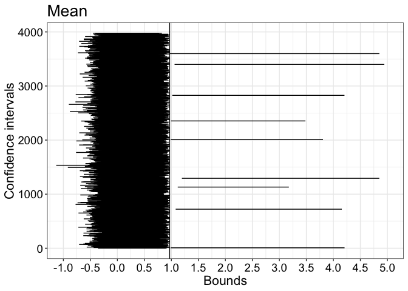<!-- -->

``` r
pA <- p
```

### 10% trimmed mean

``` r
pop <- pop.tm10
cond <- 2 # 10% trimmed mean
ci <- ci.all[ci.cov[,cond]==0, cond,]
df <- tibble(x1 = ci[,1],
             x2 = ci[,2],
             y = seq(1,length(x1)))

p <- ggplot(df, aes(x = x1, xend = x2, y = y, yend = y)) + theme_gar +
  geom_segment() +
  geom_vline(xintercept = pop) +
labs(x = "Bounds", y = "Confidence intervals") +
coord_cartesian(xlim = c(-1, 5),
                  ylim = c(1, length(df$x1)), expand = TRUE) +
  scale_x_continuous(breaks = seq(-2, 10, 0.5)) +
  ggtitle("10% trimmed mean") 
p
```

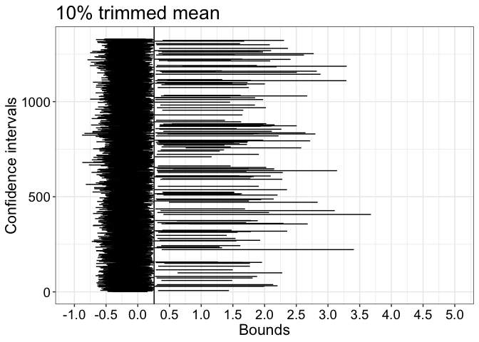<!-- -->

``` r
pB <- p
```

### 20% trimmed mean

``` r
pop <- pop.tm20
cond <- 3 # 20% trimmed mean
ci <- ci.all[ci.cov[,cond]==0, cond,]
df <- tibble(x1 = ci[,1],
             x2 = ci[,2],
             y = seq(1,length(x1)))

p <- ggplot(df, aes(x = x1, xend = x2, y = y, yend = y)) + theme_gar +
  geom_segment() +
  geom_vline(xintercept = pop) +
labs(x = "Bounds", y = "Confidence intervals") +
coord_cartesian(xlim = c(-1, 5),
                  ylim = c(1, length(df$x1)), expand = TRUE) +
  scale_x_continuous(breaks = seq(-2, 10, 0.5)) +
  ggtitle("20% trimmed mean") 
p
```

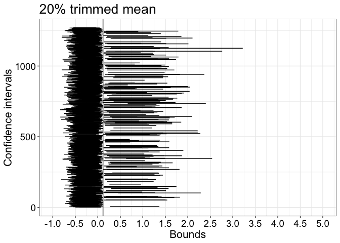<!-- -->

``` r
pC <- p
```

### Median

``` r
pop <- pop.md
cond <- 4 # median
ci <- ci.all[ci.cov[,cond]==0, cond,]
df <- tibble(x1 = ci[,1],
             x2 = ci[,2],
             y = seq(1,length(x1)))

p <- ggplot(df, aes(x = x1, xend = x2, y = y, yend = y)) + theme_gar +
  geom_segment() +
  geom_vline(xintercept = pop) +
labs(x = "Bounds", y = "Confidence intervals") +
coord_cartesian(xlim = c(-1, 5),
                  ylim = c(1, length(df$x1)), expand = TRUE) +
  scale_x_continuous(breaks = seq(-2, 10, 0.5)) +
  ggtitle("Median") 
p
```

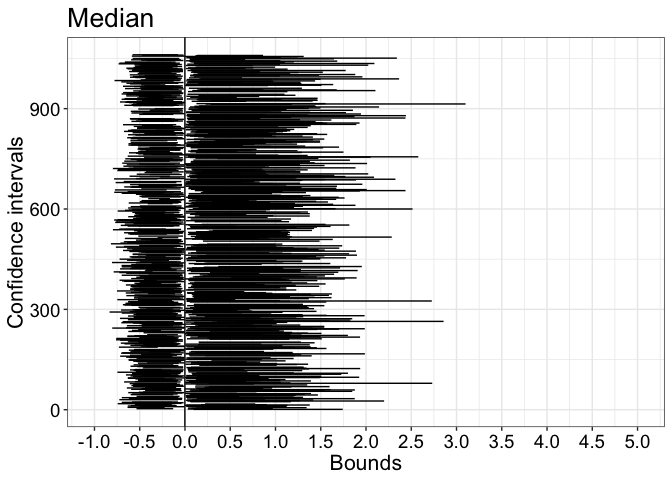<!-- -->

``` r
pD <- p
```

## Summary figure

``` r
cowplot::plot_grid(pA, pB, pC, pD,
                   labels = c("A", "B", "C", "D"), 
                   nrow = 2)

# save figure
ggsave(filename=('./figures/figure_g1h02_ci.pdf'),width=15,height=10)
```

# Vary g, h = 0

We now explore CI properties as a function of `g`, which we vary from 0
to 1, in steps of 0.1.

``` r
# Define parameters
nsim <- 20000 # number of simulations
gvec <- seq(0, 1, 0.1) # g values
ng <- length(gvec)
h <- 0
nsamp <- 30 # sample size

# declare vectors of population values
pop.m <- vector(mode= "numeric", length = ng) # population mean
pop.tm10 <- vector(mode= "numeric", length = ng) # population 10% trimmed mean
pop.tm20 <- vector(mode= "numeric", length = ng) # population 20% trimmed mean
pop.md <- vector(mode= "numeric", length = ng) # population median

# declare matrices of results
ci.cov <- array(0, dim = c(nsim, 4, ng))
ci.wid <- array(0, dim = c(nsim, 4, ng))
ci.dis <- array(NA, dim = c(nsim, 4, ng))

for(G in 1:ng){
  
  print(paste0("G = ",gvec[G],"..."))
  
  pop <- ghdist(1000000, g = gvec[G], h = h) # define population
  pop.m[G] <- mean(pop) # population mean
  pop.tm10[G] <- mean(pop, trim = 0.1) # population 10% trimmed mean
  pop.tm20[G] <- mean(pop, trim = 0.2) # population 20% trimmed mean
  pop.md[G] <- median(pop) # population median
  
  set.seed(45) # set random number generator inside G loop so that results are directly comparable among values of g
  
  for(S in 1:nsim){ # simulation loop
    
    samp <- sample(pop, nsamp, replace = TRUE) # random sample from population
    
    # Mean ===================================
    ci <- trimci.light(samp, tr = 0, alpha = 0.05) # standard t-test equation
    ci.cov[S,1,G] <- cover(ci, pop.m[G]) # CI includes population value?
    ci.wid[S,1,G] <- ci[2] - ci[1]
    if(ci.cov[S,1,G] == 0){ # direction of discrepancy?
      if(pop.m[G] > ci[2]){
        ci.dis[S,1,G] <- -1 # left shift
      }
      if(pop.m[G] < ci[1]){
        ci.dis[S,1,G] <- 1 # right shift
      }
    }
    # 10% Trimmed mean =======================
    ci <- trimci.light(samp, tr = 0.1, alpha = 0.05)
    ci.cov[S,2,G] <- cover(ci, pop.tm10[G]) # CI includes population value?
    ci.wid[S,2,G] <- ci[2] - ci[1]
    if(ci.cov[S,2,G] == 0){ # direction of discrepancy?
      if(pop.tm10[G] > ci[2]){
        ci.dis[S,2,G] <- -1 # left shift
      }
      if(pop.tm10[G] < ci[1]){
        ci.dis[S,2,G] <- 1 # right shift
      }
    }
    # 20% Trimmed mean =======================
    ci <- trimci.light(samp, tr = 0.2, alpha = 0.05)
    ci.cov[S,3,G] <- cover(ci, pop.tm20[G]) # CI includes population value?
    ci.wid[S,3,G] <- ci[2] - ci[1]
    if(ci.cov[S,3,G] == 0){ # direction of discrepancy?
      if(pop.tm20[G] > ci[2]){
        ci.dis[S,3,G] <- -1 # left shift
      }
      if(pop.tm20[G] < ci[1]){
        ci.dis[S,3,G] <- 1 # right shift
      }
    }
    # Median =======================
    ci <- sint(samp, alpha = 0.05)
    ci.cov[S,4,G] <- cover(ci, pop.md[G]) # CI includes population value?
    ci.wid[S,4,G] <- ci[2] - ci[1]
    if(ci.cov[S,4,G] == 0){ # direction of discrepancy?
      if(pop.md[G] > ci[2]){
        ci.dis[S,4,G] <- -1 # left shift
      }
      if(pop.md[G] < ci[1]){
        ci.dis[S,4,G] <- 1 # right shift
      }
    }
  }
}

# save simulation results to load in next chunk
save(ci.cov, ci.wid, ci.dis, 
     gvec, ng,
     file = "./data/cov_test_vg_h0.RData")
```

## Illustrate results: Coverage

``` r
load(file = "./data/cov_test_vg_h0.RData")

df <- tibble(y = as.vector(apply(ci.cov, c(2,3), mean)),
             estimator = factor(rep(c("m", "tm10", "tm20", "md"), ng)),
             g = factor(rep(gvec, each = 4)))
df$estimator <- keeporder(df$estimator)
df$g <- keeporder(df$g)

p <- ggplot(df, aes(x = g, y = y, colour = estimator, group = estimator)) + 
  theme_gar +
  geom_hline(yintercept = 0.95) +
  geom_point(size = 2) +
  geom_line(size = 1) +
  scale_colour_viridis_d(end = 0.9) +
  ylab("CI coverage") +
  coord_cartesian(ylim = c(0.78, 1)) +
  scale_y_continuous(breaks = seq(0, 1, 0.05))
p
```

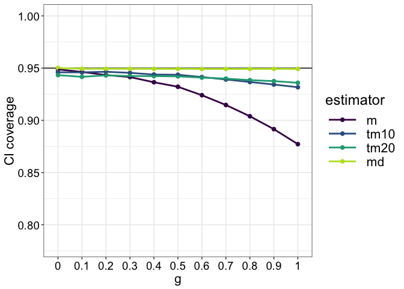<!-- -->

``` r
p1 <- p
```

For the median, coverage is unaffected by `g`. For the other estimators,
there is a monotonic decrease in coverage with increasing `g`. The
effect is much stronger for the mean than the trimmed means.

## Illustrate results: Width

``` r
df <- tibble(y = as.vector(apply(ci.wid, c(2,3), median)),
             estimator = factor(rep(c("m", "tm10", "tm20", "md"), ng)),
             g = factor(rep(gvec, each = 4)))
df$estimator <- keeporder(df$estimator)
df$g <- keeporder(df$g)

p <- ggplot(df, aes(x = g, y = y, colour = estimator, group = estimator)) + 
  theme_gar +
  geom_point(size = 2) +
  geom_line(size = 1) +
  scale_colour_viridis_d(end = 0.9) +
  ylab("CI width") +
  coord_cartesian(ylim = c(0.7, 1.7)) 
p
```

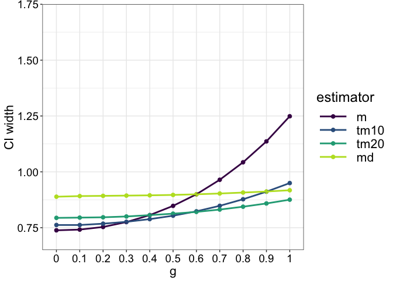<!-- -->

``` r
p2 <- p
```

For all estimators, increasing `g` leads to monotonic increases in CI
width. The effect is very subtle for the median and more pronunced the
less we trim. Under normality, `g=0`, CIs are the shortest for the mean,
explaining the larger power of mean based methods relative to trimmed
means in this unusual situation.

## Illustrate results: CI shift

Sign of discrepancy = CI shift

``` r
df <- tibble(y = as.vector(apply(ci.dis, c(2,3), mean, na.rm = TRUE)),
             estimator = factor(rep(c("m", "tm10", "tm20", "md"), ng)),
             g = factor(rep(gvec, each = 4)))
df$estimator <- keeporder(df$estimator)
df$g <- keeporder(df$g)

p <- ggplot(df, aes(x = g, y = y, colour = estimator, group = estimator)) + 
  theme_gar +
  geom_hline(yintercept = 0) +
  geom_point(size = 2) +
  geom_line(size = 1) +
  scale_colour_viridis_d(end = 0.9) +
  ylab("CI shift") +
  coord_cartesian(ylim = c(0.1, -1)) 
p
```

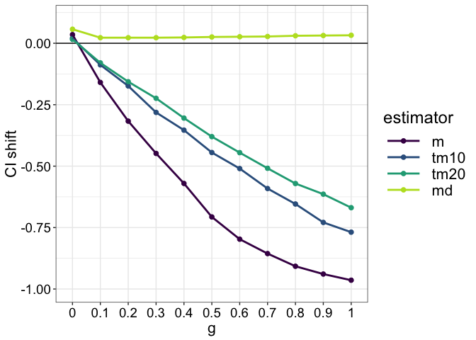<!-- -->

``` r
p3 <- p
```

In this figure, the zero line represents an equal proportions of left
and right shifted CIs relative to the population. The values are
consistently above zero for the median, indicating a slight inbalance,
with a few more right shifts than left shifts for all values of `g`. For
the other estimators, the preponderance of left shifts increases
markedly with `g`.

### Make panel A of summary figure

``` r
pA <- cowplot::plot_grid(p1 + theme(legend.position = c(0.2, 0.25)),
                         p2 + theme(legend.position = "none"),
                         p3 + theme(legend.position = "none"),
                         labels = NA, 
                         nrow = 3)
```

# Vary g, h = 0.2

``` r
# Define parameters
nsim <- 20000 # number of simulations
gvec <- seq(0, 1, 0.1) # g values
ng <- length(gvec)
h <- 0.2
nsamp <- 30 # sample size

# declare vectors of population values
pop.m <- vector(mode= "numeric", length = ng) # population mean
pop.tm10 <- vector(mode= "numeric", length = ng) # population 10% trimmed mean
pop.tm20 <- vector(mode= "numeric", length = ng) # population 20% trimmed mean
pop.md <- vector(mode= "numeric", length = ng) # population median

# declare matrices of results
ci.cov <- array(0, dim = c(nsim, 4, ng))
ci.wid <- array(0, dim = c(nsim, 4, ng))
ci.dis <- array(NA, dim = c(nsim, 4, ng))

for(G in 1:ng){
  
  print(paste0("G = ",gvec[G],"..."))
  
  pop <- ghdist(1000000, g = gvec[G], h = h) # define population
  pop.m[G] <- mean(pop) # population mean
  pop.tm10[G] <- mean(pop, trim = 0.1) # population 10% trimmed mean
  pop.tm20[G] <- mean(pop, trim = 0.2) # population 20% trimmed mean
  pop.md[G] <- median(pop) # population median
  
  set.seed(45) # set random number generator inside G loop so that results are directly comparable among values of g
  
  for(S in 1:nsim){ # simulation loop
    
    samp <- sample(pop, nsamp, replace = TRUE) # random sample from population
    
    # Mean ===================================
    ci <- trimci.light(samp, tr = 0, alpha = 0.05) # standard t-test equation
    ci.cov[S,1,G] <- cover(ci, pop.m[G]) # CI includes population value?
    ci.wid[S,1,G] <- ci[2] - ci[1]
    if(ci.cov[S,1,G] == 0){ # direction of discrepancy?
      if(pop.m[G] > ci[2]){
        ci.dis[S,1,G] <- -1 # left shift
      }
      if(pop.m[G] < ci[1]){
        ci.dis[S,1,G] <- 1 # right shift
      }
    }
    # 10% Trimmed mean =======================
    ci <- trimci.light(samp, tr = 0.1, alpha = 0.05)
    ci.cov[S,2,G] <- cover(ci, pop.tm10[G]) # CI includes population value?
    ci.wid[S,2,G] <- ci[2] - ci[1]
    if(ci.cov[S,2,G] == 0){ # direction of discrepancy?
      if(pop.tm10[G] > ci[2]){
        ci.dis[S,2,G] <- -1 # left shift
      }
      if(pop.tm10[G] < ci[1]){
        ci.dis[S,2,G] <- 1 # right shift
      }
    }
    # 20% Trimmed mean =======================
    ci <- trimci.light(samp, tr = 0.2, alpha = 0.05)
    ci.cov[S,3,G] <- cover(ci, pop.tm20[G]) # CI includes population value?
    ci.wid[S,3,G] <- ci[2] - ci[1]
    if(ci.cov[S,3,G] == 0){ # direction of discrepancy?
      if(pop.tm20[G] > ci[2]){
        ci.dis[S,3,G] <- -1 # left shift
      }
      if(pop.tm20[G] < ci[1]){
        ci.dis[S,3,G] <- 1 # right shift
      }
    }
    # Median =======================
    ci <- sint(samp, alpha = 0.05)
    ci.cov[S,4,G] <- cover(ci, pop.md[G]) # CI includes population value?
    ci.wid[S,4,G] <- ci[2] - ci[1]
    if(ci.cov[S,4,G] == 0){ # direction of discrepancy?
      if(pop.md[G] > ci[2]){
        ci.dis[S,4,G] <- -1 # left shift
      }
      if(pop.md[G] < ci[1]){
        ci.dis[S,4,G] <- 1 # right shift
      }
    }
  }
}

# save simulation results to load in next chunk
save(ci.cov, ci.wid, ci.dis, file = "./data/cov_test_vg_h02.RData")
```

## Illustrate results: Coverage

``` r
load(file = "./data/cov_test_vg_h02.RData")

df <- tibble(y = as.vector(apply(ci.cov, c(2,3), mean)),
             estimator = factor(rep(c("m", "tm10", "tm20", "md"), ng)),
             g = factor(rep(gvec, each = 4)))
df$estimator <- keeporder(df$estimator)
df$g <- keeporder(df$g)

p <- ggplot(df, aes(x = g, y = y, colour = estimator, group = estimator)) + 
  theme_gar +
  geom_hline(yintercept = 0.95) +
  geom_point(size = 2) +
  geom_line(size = 1) +
  scale_colour_viridis_d(end = 0.9) +
  ylab("CI coverage") +
  coord_cartesian(ylim = c(0.78, 1)) +
  scale_y_continuous(breaks = seq(0, 1, 0.05))
p
```

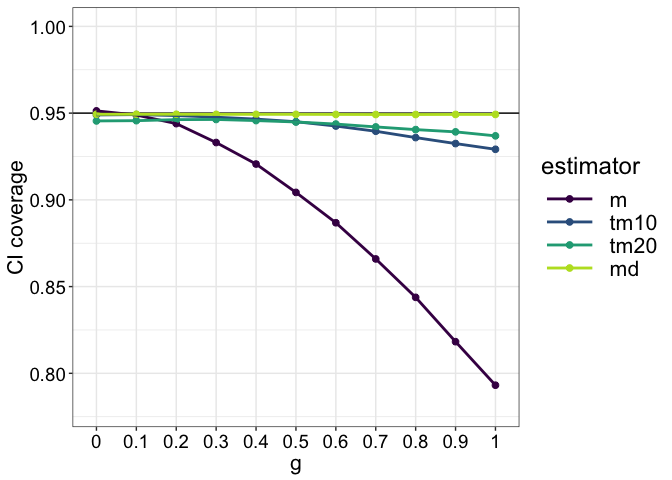<!-- -->

``` r
p1 <- p
```

When outliers are likely, coverage drops faster with `g` for the mean.
Other estimators are resistant to outliers.

## Illustrate results: Width

``` r
df <- tibble(y = as.vector(apply(ci.wid, c(2,3), median)),
             estimator = factor(rep(c("m", "tm10", "tm20", "md"), ng)),
             g = factor(rep(gvec, each = 4)))
df$estimator <- keeporder(df$estimator)
df$g <- keeporder(df$g)

p <- ggplot(df, aes(x = g, y = y, colour = estimator, group = estimator)) + 
  theme_gar +
  geom_point(size = 2) +
  geom_line(size = 1) +
  scale_colour_viridis_d(end = 0.9) +
  ylab("CI width") +
  coord_cartesian(ylim = c(0.7, 1.7)) 
p
```

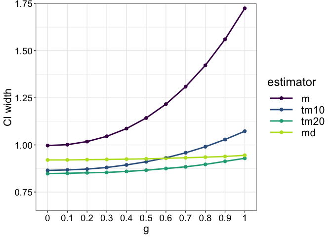<!-- -->

``` r
p2 <- p
```

When outliers are common, CIs for the population mean are larger than
for all other estimators, irrespective of `g`.

## Illustrate results: CI shift

Sign of discrepancy = CI shift

``` r
df <- tibble(y = as.vector(apply(ci.dis, c(2,3), mean, na.rm = TRUE)),
             estimator = factor(rep(c("m", "tm10", "tm20", "md"), ng)),
             g = factor(rep(gvec, each = 4)))
df$estimator <- keeporder(df$estimator)
df$g <- keeporder(df$g)

p <- ggplot(df, aes(x = g, y = y, colour = estimator, group = estimator)) + 
  theme_gar +
  geom_hline(yintercept = 0) +
  geom_point(size = 2) +
  geom_line(size = 1) +
  scale_colour_viridis_d(end = 0.9) +
  ylab("CI shift") +
  coord_cartesian(ylim = c(0.1, -1)) 
p
```

<!-- -->

``` r
p3 <- p
```

Again, there is a constant over-representation of right shifted CIS for
the median. For the other estimators, the left shifted CIs dominate more
and more with increasing `g`. The trend is more pronunced for the mean
relative to the `h=0` situation, with a sharper monotonic downward
trajectory.

### Make panel B of summary figure

``` r
pB <- cowplot::plot_grid(p1 + theme(legend.position = "none"), 
                         p2 + theme(legend.position = "none"),
                         p3 + theme(legend.position = "none"),
                         labels = NA, 
                         nrow = 3)
```

## Summary figure

``` r
cowplot::plot_grid(pA, pB,
                   labels = c("A", "B"), 
                   ncol = 2)

# save figure
ggsave(filename=('./figures/figure_vg.pdf'),width=12,height=15)
```

# References

Bürkner, Paul-Christian, and Matti Vuorre. ‘Ordinal Regression Models in
Psychology: A Tutorial’. Advances in Methods and Practices in
Psychological Science 2, no. 1 (1 March 2019): 77–101.
<https://doi.org/10.1177/2515245918823199>.

Greenland, Sander, Stephen J. Senn, Kenneth J. Rothman, John B. Carlin,
Charles Poole, Steven N. Goodman, and Douglas G. Altman. ‘Statistical
Tests, P Values, Confidence Intervals, and Power: A Guide to
Misinterpretations’. European Journal of Epidemiology 31, no. 4 (1 April
2016): 337–50. <https://doi.org/10.1007/s10654-016-0149-3>.

Hoaglin, David C. ‘Summarizing Shape Numerically: The g-and-h
Distributions’. In Exploring Data Tables, Trends, and Shapes, 461–513.
John Wiley & Sons, Ltd, 1985.
<https://doi.org/10.1002/9781118150702.ch11>.

Jaeger, T. Florian. ‘Categorical Data Analysis: Away from ANOVAs
(Transformation or Not) and towards Logit Mixed Models’. Journal of
Memory and Language 59, no. 4 (November 2008): 434–46.
<https://doi.org/10.1016/j.jml.2007.11.007>.

Kruschke, John K. Doing Bayesian Data Analysis. 2nd Edition. Academic
Press, 2014.

Liddell, Torrin M., and John K. Kruschke. ‘Analyzing Ordinal Data with
Metric Models: What Could Possibly Go Wrong?’ Journal of Experimental
Social Psychology 79 (1 November 2018): 328–48.
<https://doi.org/10.1016/j.jesp.2018.08.009>.

Rousselet, Guillaume A., and Rand R. Wilcox. ‘Reaction Times and Other
Skewed Distributions: Problems with the Mean and the Median’. Preprint.
PsyArXiv, 17 January 2019. <https://doi.org/10.31234/osf.io/3y54r>.

Wilcox, Rand R., and Guillaume A. Rousselet. ‘A Guide to Robust
Statistical Methods in Neuroscience’. Current Protocols in Neuroscience
82, no. 1 (2018): 8.42.1-8.42.30. <https://doi.org/10.1002/cpns.41>.

Yan, Yuan, and Marc G. Genton. ‘The Tukey G-and-h Distribution’.
Significance 16, no. 3 (2019): 12–13.
<https://doi.org/10.1111/j.1740-9713.2019.01273.x>.
