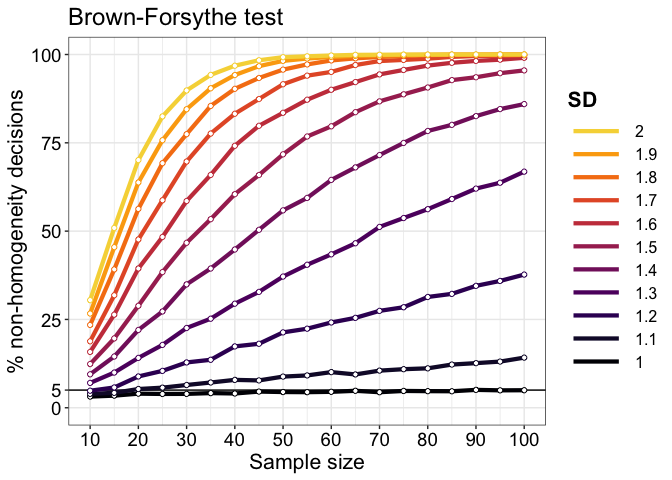
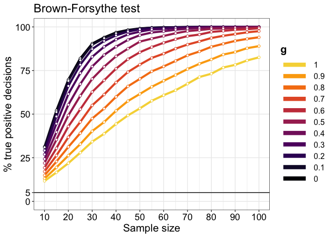

Variance homogeneity tests: false positives and power curves
================
Guillaume A. Rousselet
2023-05-26

- <a href="#dependencies" id="toc-dependencies">Dependencies</a>
- <a href="#parameters" id="toc-parameters">Parameters</a>
- <a
  href="#1-tests-of-variance-homogeneity-dependence-on-sample-size-under-normality"
  id="toc-1-tests-of-variance-homogeneity-dependence-on-sample-size-under-normality">[1]
  Tests of variance homogeneity: dependence on sample size under
  normality</a>
  - <a href="#illustrate-populations"
    id="toc-illustrate-populations">Illustrate populations</a>
  - <a href="#simulation" id="toc-simulation">Simulation</a>
  - <a href="#results" id="toc-results">Results</a>
- <a
  href="#2-tests-of-variance-homogeneity-dependence-on-sample-size-when-sampling-from-a-skewed-distribution"
  id="toc-2-tests-of-variance-homogeneity-dependence-on-sample-size-when-sampling-from-a-skewed-distribution">[2]
  Tests of variance homogeneity: dependence on sample size when sampling
  from a skewed distribution</a>
  - <a href="#illustrate-populations-1"
    id="toc-illustrate-populations-1">Illustrate populations</a>
  - <a href="#simulation-1" id="toc-simulation-1">Simulation</a>
  - <a href="#results-inhomogeneity-of-variance-detection"
    id="toc-results-inhomogeneity-of-variance-detection">Results:
    inhomogeneity of variance detection</a>
- <a
  href="#3-tests-of-variance-homogeneity-false-positives-and-dependence-on-sample-size-and-skewness"
  id="toc-3-tests-of-variance-homogeneity-false-positives-and-dependence-on-sample-size-and-skewness">[3]
  Tests of variance homogeneity: false positives and dependence on sample
  size and skewness</a>
  - <a href="#illustrate-populations-2"
    id="toc-illustrate-populations-2">Illustrate populations</a>
  - <a href="#simulation-3" id="toc-simulation-3">Simulation 3</a>
  - <a href="#results-inhomogeneity-of-variance-detection-1"
    id="toc-results-inhomogeneity-of-variance-detection-1">Results:
    inhomogeneity of variance detection</a>
- <a
  href="#4-tests-of-variance-homogeneity-true-positives-and-dependence-on-sample-size-and-skewness"
  id="toc-4-tests-of-variance-homogeneity-true-positives-and-dependence-on-sample-size-and-skewness">[4]
  Tests of variance homogeneity: true positives and dependence on sample
  size and skewness</a>
  - <a href="#illustrate-populations-3"
    id="toc-illustrate-populations-3">Illustrate populations</a>
  - <a href="#simulation-4" id="toc-simulation-4">Simulation 4</a>
  - <a href="#results-inhomogeneity-of-variance-detection-2"
    id="toc-results-inhomogeneity-of-variance-detection-2">Results:
    inhomogeneity of variance detection</a>
- <a href="#conclusions" id="toc-conclusions">Conclusions</a>
- <a href="#references" id="toc-references">References</a>

We consider these tests of variance homogeneity (homoscedasticity):  
- [Bartlett’s test](https://en.wikipedia.org/wiki/Bartlett%27s_test);  
- [Levene’s test](https://en.wikipedia.org/wiki/Levene%27s_test);  
- [Brown–Forsythe
test](https://en.wikipedia.org/wiki/Brown–Forsythe_test);  
- Fligner-Killeen test (see `help(fligner.test)` in R and Conover et
al. 1981).

The last 3 tests belong to a family of tests in which absolute or
squared distances between observations and a measure of central tendency
are compared using parametric (t-tests, ANOVAs) and rank-based methods
(Conover et al. 1981; 2018). Levene’s test uses the mean to centre the
distributions, whereas the Brown-Forsythe and Fligner-Killeen tests use
the median.

We also consider the `comvar2` bootstrap method described in Wilcox
(2017, chapter 5) and available
[here](http://dornsife.usc.edu/labs/rwilcox/software/). To speed up the
simulations, the bootstrapping is done using `Rcpp`.

# Dependencies

``` r
library(tibble)
library(ggplot2)
library(car)
library(beepr)
library(cowplot)
library(tukeyGH)
library(moments)
source("./code/various.R")
# source("./code/ghdist.R")
source("./code/comvar2.R")
source("./code/plot.R")
source("./code/theme_gar.R")
# Compile C++ functions:
library(Rcpp)
sourceCpp("./code/comvar2.cpp") # Rcpp version
```

# Parameters

``` r
nsim <- 10000 # iterations
inc.step <- 500 # console notification every inc.step iterations
nmax <- 100 # maximum sample size
nboot <- 1000 # number of bootstrap samples
nsdec <- seq(10,nmax,5) # vector of sample sizes
nn <- length(nsdec)  
sdvec <- seq(1,2,0.1) # SD differences to consider
nsd <- length(sdvec)
gvec <- seq(0, 1, 0.1) # g values to consider for the g-and-h distributions
ng <- length(gvec)
aat <- 0.05 # arbitrary alpha threshold
```

# \[1\] Tests of variance homogeneity: dependence on sample size under normality

## Illustrate populations

``` r
x <- seq(-7, 7, 0.01)
nx <- length(x) 
normpdf <- array(NA, dim = c(nx, nsd))  

for(V in 1:nsd){
  normpdf[,V] <- dnorm(x, mean = 0, sd = sdvec[V])
}

df <- tibble(density = as.vector(normpdf),
             x = rep(x, nsd),
             SD = factor(rep(sdvec, each = nx)))

ggplot(df, aes(x = x, y = density, colour = SD)) + theme_gar +
  geom_line(size = 1) +
  scale_colour_viridis_d(end = 0.9, option = "B") +
  scale_x_continuous(breaks = seq(-6, 6, 1)) +
  coord_cartesian(xlim = c(-6, 6)) +
  labs(x = "Observations",
       y = "Density") +
  theme(axis.title = element_text(size = 16),
        axis.text.x = element_text(size = 14),
        axis.text.y = element_blank(),
        axis.ticks.y = element_blank(),
        legend.position = c(.1, .55),
        legend.title = element_text(size = 16, face = "bold"),
        legend.text = element_text(size = 12)) +
  guides(colour = guide_legend(reverse=TRUE, override.aes = list(linewidth = 3)))
```

<!-- -->

``` r
ggsave('./figures/sim1_normdist_sd.png', width = 20, height = 12, units = "cm")
```

## Simulation

``` r
set.seed(44)

# Define arrays of results
vartest.bar <- array(NA, dim = c(nsim, nn, nsd)) # Bartlett
vartest.lev.m <- array(NA, dim = c(nsim, nn, nsd)) # Levene with mean as measure of centre
vartest.lev.md <- array(NA, dim = c(nsim, nn, nsd)) # Levene with median as measure of centre = Brown-Forsythe
vartest.fk <- array(NA, dim = c(nsim, nn, nsd)) # Fligner-Killeen test
vartest.pb <- array(NA, dim = c(nsim, nn, nsd)) # percentile bootstrap test

for(iter in 1:nsim){
  
  sim.counter(iter, nsim, inc = inc.step)
  
  for(N in 1:nn){
    n <- nsdec[N]
    group <- factor(rep(1:2, each = n))
    for(V in 1:nsd){
      x1 <- rnorm(n, mean = 0, sd = 1) # reference group
      x2 <- rnorm(n, mean = 0, sd = sdvec[V]) # group with larger variance
      x <- c(x1, x2)
      # variance homogeneity tests
      vartest.bar[iter,N,V] <- bartlett.test(x, group)$p.value < aat
      out <- leveneTest(x, group, center = mean)[[3]] < aat
      vartest.lev.m[iter,N,V] <- out[1]
      out <- leveneTest(x, group, center = median)[[3]] < aat
      vartest.lev.md[iter,N,V] <- out[1]
      vartest.fk[iter,N,V] <- fligner.test(x, group)$p.value < aat
      ci <- comvar2_wrap(x1,x2,n,nboot)
      vartest.pb[iter,N,V] <- ci[1] > 0 | ci[2] < 0
    }
  }
}
beep(8)
save(nsdec, nn, sdvec, nsd, vartest.lev.m, vartest.lev.md, vartest.bar, 
     vartest.fk, vartest.pb,
     file = "./data/res_vartest.RData")
```

## Results

### Bartlett’s test

``` r
load("./data/res_vartest.RData")
plot_title <- "Bartlett's test"
g <- plot_sim_sd(vartest.bar, plot_title)
g
```

<!-- -->

``` r
gB <- g
#ggsave('./figures/sim1_bart.png')
```

### Levene’s test

Look at the results with the centre estimated using the mean.

``` r
plot_title <- "Levene's test"
g <- plot_sim_sd(vartest.lev.m, plot_title)
g
```

<!-- -->

``` r
gL <- g
#ggsave('./figures/sim1_lev.png')
```

### Brown–Forsythe test

Then, we consider the results using the median to centre the
distributions.

``` r
plot_title <- "Brown-Forsythe test"
g <- plot_sim_sd(vartest.lev.md, plot_title)
g
```

<!-- -->

``` r
gBF <- g
#ggsave('./figures/sim1_bf.png')
```

### Fligner-Killeen test

``` r
plot_title <- "Fligner-Killeen test"
g <- plot_sim_sd(vartest.fk, plot_title)
g
```

<!-- -->

``` r
gFK <- g
#ggsave('./figures/sim1_fk.png')
```

### Percentile bootstrap test

``` r
plot_title <- "Percentile bootstrap test"
g <- plot_sim_sd(vartest.pb, plot_title)
g
```

<!-- -->

``` r
gPB <- g
#ggsave('./figures/sim1_pb.png')
```

### Summary figure

Make figure with 3 x 2 panels (5 tests + legend).

``` r
legend <- get_legend(gB)

p <- cowplot::plot_grid(gB + theme(legend.position='none'), 
                        gL + theme(legend.position='none'),
                        gBF + theme(legend.position='none'),
                        gFK + theme(legend.position='none'),
                        gPB + theme(legend.position='none'),
                        legend,
                        labels=c("A", "B", "C", "D", "E", ""), 
                        ncol = 2, 
                        nrow = 3,
                        # rel_heights = c(1, 1, 1, 1), 
                        label_size = 20, 
                        hjust = -0.5, 
                        scale = 0.95,
                        align = "h")

p

# save figure
ggsave(filename='./figures/sim1_summary.pdf',width=10,height=12) 
```

### Compare methods

#### SD 1

``` r
g <- plot_sim_sd_comp(vartest.bar, vartest.lev.m, vartest.lev.md, vartest.fk, vartest.pb, 
                      SD=1, plot_title = "Normal, SD=1") + coord_cartesian(ylim=c(0, 10)) + scale_y_continuous(breaks = seq(0,100,1))
g 
```

<!-- -->

``` r
ggsave('./figures/sim1_comp_sd1.png')
```

#### SD 2

``` r
g <- plot_sim_sd_comp(vartest.bar, vartest.lev.m, vartest.lev.md, vartest.fk, vartest.pb, 
                      SD=2, plot_title = "Normal, SD=2") + coord_cartesian(ylim=c(0, 100))
g 
```

<!-- -->

``` r
ggsave('./figures/sim1_comp_sd2.png')
```

# \[2\] Tests of variance homogeneity: dependence on sample size when sampling from a skewed distribution

Here we sample from a g-and-h distribution with `g=1`: the shape is
lognormal and the median zero. For details about this family of
distributions, see [Yan & Genton
(2019)](https://rss.onlinelibrary.wiley.com/doi/full/10.1111/j.1740-9713.2019.01273.x?af=R).

## Illustrate populations

We use large populations generated with the random number `tukeyGH::rgh`
function. These are the same populations used in the simulation.

``` r
g <- 1
h <- 0
npop <- 1000000
gpdf <- array(NA, dim = c(npop, nsd))  

set.seed(44)
pop <- tukeyGH::rgh(npop, g=g, h=h)
# pop <- ghdist(npop, g=g, h=h)
pop <- pop/sd(pop)

for(V in 1:nsd){
  gpdf[,V] <- sdvec[V] * pop
}

df <- tibble(density = as.vector(gpdf),
             SD = factor(rep(sdvec, each = npop)))

ggplot(df, aes(density, colour = SD)) + theme_gar +
  stat_density(geom="line", position="identity",
               trim = TRUE, bounds = c(-2, 7), size = 1) +
  scale_colour_viridis_d(end = 0.9, option = "B") +
  scale_x_continuous(breaks = seq(-6, 6, 1)) +
  coord_cartesian(xlim = c(-1, 6)) +
  labs(x = "Observations",
       y = "Density") +
  theme(axis.title = element_text(size = 16),
        axis.text.x = element_text(size = 14),
        axis.text.y = element_blank(),
        axis.ticks.y = element_blank(),
        legend.position = c(.8, .55),
        legend.title = element_text(size = 16, face = "bold"),
        legend.text = element_text(size = 12)) +
  guides(colour = guide_legend(reverse=TRUE, override.aes = list(linewidth = 3)))
```

<!-- -->

``` r
ggsave('./figures/sim2_gdist_sd.png', width = 20, height = 12, units = "cm")
```

The distributions above have the same median (0) and skewness, but
differ in mean and variance, which we check in the next chunk. Another
reminder that eye-balling the data can be misleading!

### Check skewness

``` r
print("mean:")
```

    ## [1] "mean:"

``` r
mean(gpdf[,1])
```

    ## [1] 0.3004194

``` r
mean(gpdf[,11])
```

    ## [1] 0.6008387

``` r
print("median:")
```

    ## [1] "median:"

``` r
median(gpdf[,1])
```

    ## [1] 4.650926e-05

``` r
median(gpdf[,11])
```

    ## [1] 9.301851e-05

``` r
print("variance:")
```

    ## [1] "variance:"

``` r
var(gpdf[,1])
```

    ## [1] 1

``` r
var(gpdf[,11])
```

    ## [1] 4

``` r
print("skewness:")
```

    ## [1] "skewness:"

``` r
skewness(gpdf[,1])
```

    ## [1] 6.081409

``` r
skewness(gpdf[,11])
```

    ## [1] 6.081409

## Simulation

``` r
set.seed(44)

g <- 1
h <- 0

# Define arrays of results
vartest.bar <- array(NA, dim = c(nsim, nn, nsd)) # Bartlett
vartest.lev.m <- array(NA, dim = c(nsim, nn, nsd)) # Levene with mean as measure of centre
vartest.lev.md <- array(NA, dim = c(nsim, nn, nsd)) # Levene with median as measure of centre
vartest.fk <- array(NA, dim = c(nsim, nn, nsd)) # Fligner-Killeen test
vartest.pb <- array(NA, dim = c(nsim, nn, nsd)) # percentile bootstrap test

# create reference population
npop <- 1000000
pop1 <- tukeyGH::rgh(npop, g=g, h=h)
pop1 <- pop1 / sd(pop1) # normalise standard deviation to one.

for(V in 1:nsd){
  
  print(paste("V =",V,"/",nsd))
  beep(2)
  
  # create test population 2
  pop2 <- sdvec[V] * pop1 # normalise standard deviation to sdvec[V]
  
  for(iter in 1:nsim){
    
    sim.counter(iter, nsim, inc = inc.step)
    
    for(N in 1:nn){
      n <- nsdec[N]
      group <- factor(rep(1:2, each = n))
      
      # sample random data from g & h distribution
      x1 <- sample(pop1, size = n, replace = TRUE)
      x2 <- sample(pop2, size = n, replace = TRUE)
      x <- c(x1, x2)
      # variance homogeneity tests
      vartest.bar[iter,N,V] <- bartlett.test(x, group)$p.value < aat
      out <- leveneTest(x, group, center = mean)[[3]] < aat
      vartest.lev.m[iter,N,V] <- out[1]
      out <- leveneTest(x, group, center = median)[[3]] < aat
      vartest.lev.md[iter,N,V] <- out[1]
      vartest.fk[iter,N,V] <- fligner.test(x, group)$p.value < aat
      ci <- comvar2_wrap(x1,x2,n,nboot)
      vartest.pb[iter,N,V] <- ci[1] > 0 | ci[2] < 0
    }
  }
}
beep(8)
save(nsdec, nn, sdvec, nsd, vartest.lev.m, vartest.lev.md, vartest.bar, 
     vartest.fk, vartest.pb,
     file = "./data/res_vartest_g1.RData")
```

## Results: inhomogeneity of variance detection

### Bartlett’s test

``` r
load("./data/res_vartest_g1.RData")
plot_title <- "Bartlett's test"
g <- plot_sim_sd(vartest.bar, plot_title)
g
```

<!-- -->

``` r
gB <- g
#ggsave('./figures/sim2_bart.png')
```

### Levene’s test

Look at the results with the centre estimated using the mean.

``` r
plot_title <- "Levene's test"
g <- plot_sim_sd(vartest.lev.m, plot_title)
g
```

<!-- -->

``` r
gL <- g
#ggsave('./figures/sim2_lev.png')
```

### Brown–Forsythe test

Then, we consider the results using the median to centre the
distributions.

``` r
plot_title <- "Brown-Forsythe test"
g <- plot_sim_sd(vartest.lev.md, plot_title)
g
```

<!-- -->

``` r
gBF <- g
#ggsave('./figures/sim2_bf.png')
```

### Fligner-Killeen test

``` r
plot_title <- "Fligner-Killeen test"
g <- plot_sim_sd(vartest.fk, plot_title)
g
```

<!-- -->

``` r
gFK <- g
#ggsave('./figures/sim2_fk.png')
```

### Percentile bootstrap test

``` r
plot_title <- "Percentile bootstrap test"
g <- plot_sim_sd(vartest.pb, plot_title)
g
```

<!-- -->

``` r
gPB <- g
#ggsave('./figures/sim2_pb.png')
```

### Summary figure

Make figure with 3 x 2 panels (5 tests + legend).

``` r
legend <- get_legend(gB)

p <- cowplot::plot_grid(gB + theme(legend.position='none'), 
                        gL + theme(legend.position='none'),
                        gBF + theme(legend.position='none'),
                        gFK + theme(legend.position='none'),
                        gPB + theme(legend.position='none'),
                        legend,
                        labels=c("A", "B", "C", "D", "E", ""), 
                        ncol = 2, 
                        nrow = 3,
                        # rel_heights = c(1, 1, 1, 1), 
                        label_size = 20, 
                        hjust = -0.5, 
                        scale = 0.95,
                        align = "h")

p

# save figure
ggsave(filename='./figures/sim2_summary.pdf',width=10,height=12) 
```

### Compare methods

#### SD 1

``` r
g <- plot_sim_sd_comp(vartest.bar, vartest.lev.m, vartest.lev.md, vartest.fk, vartest.pb, 
                      SD=1, plot_title = "Normal, SD=1") + coord_cartesian(ylim=c(0, 60)) + scale_y_continuous(breaks = seq(0,100,5))
g 
```

<!-- -->

``` r
ggsave('./figures/sim2_comp_sd1.png')
```

#### SD 2

``` r
g <- plot_sim_sd_comp(vartest.bar, vartest.lev.m, vartest.lev.md, vartest.fk, vartest.pb, 
                      SD=2, plot_title = "Normal, SD=2") + coord_cartesian(ylim=c(0, 100))
g 
```

<!-- -->

``` r
ggsave('./figures/sim2_comp_sd2.png')
```

# \[3\] Tests of variance homogeneity: false positives and dependence on sample size and skewness

Here we sample from g-and-h distributions that vary from `g=0` to
`g=1`.  
We consider false positives (no difference in variance).

## Illustrate populations

``` r
h <- 0
npop <- 1000000
gpdf <- array(NA, dim = c(npop, nsd))  

for(G in 1:ng){
  set.seed(44)
  pop <- tukeyGH::rgh(npop, g=gvec[G], h=h)
  gpdf[,G] <- pop / sd(pop) # normalise standard deviation to one.
}

df <- tibble(density = as.vector(gpdf),
             g = factor(rep(gvec, each = npop)))

ggplot(df, aes(density, colour = g)) + theme_gar +
  stat_density(geom="line", position="identity",
               trim = TRUE, bounds = c(-6, 6), size = 1) +
  scale_colour_viridis_d(end = 0.9, option = "B") +
  scale_x_continuous(breaks = seq(-6, 6, 1)) +
  coord_cartesian(xlim = c(-4, 5)) +
  labs(x = "Observations",
       y = "Density") +
  theme(axis.title = element_text(size = 16),
        axis.text.x = element_text(size = 14),
        axis.text.y = element_blank(),
        axis.ticks.y = element_blank(),
        legend.position = c(.8, .55),
        legend.title = element_text(size = 16, face = "bold"),
        legend.text = element_text(size = 12)) +
  guides(colour = guide_legend(reverse=TRUE, override.aes = list(linewidth = 3)))
```

<!-- -->

``` r
ggsave('./figures/sim3_gdist_vg_fp.png', width = 20, height = 12, units = "cm")
```

## Simulation 3

``` r
h <- 0

# Define arrays of results
vartest.bar <- array(NA, dim = c(nsim, nn, ng)) # Bartlett
vartest.lev.m <- array(NA, dim = c(nsim, nn, ng)) # Levene with mean as measure of centre
vartest.lev.md <- array(NA, dim = c(nsim, nn, ng)) # Levene with median as measure of centre
vartest.fk <- array(NA, dim = c(nsim, nn, ng)) # Fligner-Killeen test
vartest.pb <- array(NA, dim = c(nsim, nn, ng)) # percentile bootstrap test

npop <- 1000000

for(G in 1:ng){
  
  print(paste("G =",G,"/",ng))
  beep(2)

  # create population
  set.seed(44) # same seed so populations are directly comparable
  pop <- tukeyGH::rgh(npop, g=gvec[G], h=h)
  pop <- pop / sd(pop) # normalise standard deviation to one.

  for(iter in 1:nsim){

    for(N in 1:nn){
      n <- nsdec[N]
      group <- factor(rep(1:2, each = n))
      
      # sample random data from g & h population
      x1 <- sample(pop, size = n, replace = TRUE)
      x2 <- sample(pop, size = n, replace = TRUE)
      x <- c(x1, x2)
      # variance homogeneity tests
      vartest.bar[iter,N,G] <- bartlett.test(x, group)$p.value < aat
      out <- leveneTest(x, group, center = mean)[[3]] < aat
      vartest.lev.m[iter,N,G] <- out[1]
      out <- leveneTest(x, group, center = median)[[3]] < aat
      vartest.lev.md[iter,N,G] <- out[1]
      vartest.fk[iter,N,G] <- fligner.test(x, group)$p.value < aat
      ci <- comvar2_wrap(x1,x2,n,nboot)
      vartest.pb[iter,N,G] <- ci[1] > 0 | ci[2] < 0
    }
  }
}
beep(8)
save(nsdec, nn, sdvec, nsd, vartest.lev.m, vartest.lev.md, vartest.bar, 
     vartest.fk, vartest.pb,
     file = "./data/res_vartest_vg_fp.RData")
```

## Results: inhomogeneity of variance detection

### Bartlett’s test

``` r
load("./data/res_vartest_vg_fp.RData")
plot_title <- "Bartlett's test"
g <- plot_sim_g(vartest.bar, plot_title) + coord_cartesian(ylim=c(0, 60)) + labs(y = "% false positive decisions")
g
```

<!-- -->

``` r
gB <- g
#ggsave('./figures/sim3_bart.png')
```

### Levene’s test

``` r
plot_title <- "Levene's test"
g <- plot_sim_g(vartest.lev.m, plot_title) + coord_cartesian(ylim=c(0, 60)) + labs(y = "% false positive decisions")
g
```

<!-- -->

``` r
gL <- g
#ggsave('./figures/sim3_lev.png')
```

### Brown–Forsythe test

Then, we consider the results using the median to centre the
distributions.

``` r
plot_title <- "Brown-Forsythe test"
g <- plot_sim_g(vartest.lev.md, plot_title) + coord_cartesian(ylim=c(0, 60)) + labs(y = "% false positive decisions")
g
```

<!-- -->

``` r
gBF <- g
#ggsave('./figures/sim3_bf.png')
```

### Fligner-Killeen test

``` r
plot_title <- "Fligner-Killeen test"
g <- plot_sim_g(vartest.fk, plot_title) + coord_cartesian(ylim=c(0, 60)) + labs(y = "% false positive decisions")
g
```

<!-- -->

``` r
gFK <- g
#ggsave('./figures/sim3_fk.png')
```

### Percentile bootstrap test

``` r
plot_title <- "Percentile bootstrap test"
g <- plot_sim_g(vartest.pb, plot_title) + coord_cartesian(ylim=c(0, 60)) + labs(y = "% false positive decisions")
g
```

<!-- -->

``` r
gPB <- g
#ggsave('./figures/sim3_pb.png')
```

### Summary figure

Make figure with 3 x 2 panels (5 tests + legend).

``` r
legend <- get_legend(gB)

p <- cowplot::plot_grid(gB + theme(legend.position='none'), 
                        gL + theme(legend.position='none'),
                        gBF + theme(legend.position='none'),
                        gFK + theme(legend.position='none'),
                        gPB + theme(legend.position='none'),
                        legend,
                        labels=c("A", "B", "C", "D", "E", ""), 
                        ncol = 2, 
                        nrow = 3,
                        # rel_heights = c(1, 1, 1, 1), 
                        label_size = 20, 
                        hjust = -0.5, 
                        scale = 0.95,
                        align = "h")

p

# save figure
ggsave(filename='./figures/sim3_summary.pdf',width=10,height=12) 
```

### Compare methods

#### g = 1

``` r
g <- plot_sim_g_comp(vartest.bar, vartest.lev.m, vartest.lev.md, vartest.fk, vartest.pb, 
                      G=1, plot_title = "g=1, no difference") + labs(y = "% false positive decisions")
g 
```

<!-- -->

``` r
ggsave('./figures/sim3_comp_g1.png')
```

# \[4\] Tests of variance homogeneity: true positives and dependence on sample size and skewness

Here we sample from g-and-h distributions that vary from `g=0` to
`g=1`.  
We consider true positives, with a difference of 1 sd between
populations.

## Illustrate populations

``` r
h <- 0
npop <- 1000000
gpdf <- array(NA, dim = c(npop, nsd))  

for(G in 1:ng){
  set.seed(44)
  pop <- tukeyGH::rgh(npop, g=gvec[G], h=h)
  gpdf[,G] <- pop / sd(pop) # normalise standard deviation to one.
}

df <- tibble(density = c(as.vector(gpdf), as.vector(gpdf)*2),
             g = factor(rep(rep(gvec, each = npop),2)),
             SD = factor(rep(c("1","2"), each = npop*ng)))

ggplot(df, aes(density, linetype = SD)) + theme_gar +
  stat_density(geom="line", position="identity",
               trim = TRUE, bounds = c(-7, 7), size = 1) +
  scale_colour_viridis_d(end = 0.9, option = "B") +
  scale_x_continuous(breaks = seq(-6, 6, 1)) +
  coord_cartesian(xlim = c(-5, 5)) +
  labs(x = "Observations",
       y = "Density") +
  theme(axis.title = element_text(size = 16),
        axis.text.x = element_text(size = 14),
        axis.text.y = element_blank(),
        axis.ticks.y = element_blank(),
        legend.position = c(.85, .15),
        legend.title = element_text(size = 16, face = "bold"),
        legend.text = element_text(size = 12)) +
  guides(colour = guide_legend(reverse=TRUE, override.aes = list(linewidth = 2))) +
  facet_wrap(vars(g))
```

<!-- -->

``` r
ggsave('./figures/sim4_gdist_vg_tp.png', width = 20, height = 15, units = "cm")
```

## Simulation 4

``` r
h <- 0
es <- 1 # sd difference

# Define arrays of results
vartest.bar <- array(NA, dim = c(nsim, nn, ng)) # Bartlett
vartest.lev.m <- array(NA, dim = c(nsim, nn, ng)) # Levene with mean as measure of centre
vartest.lev.md <- array(NA, dim = c(nsim, nn, ng)) # Levene with median as measure of centre
vartest.fk <- array(NA, dim = c(nsim, nn, ng)) # Fligner-Killeen test
vartest.pb <- array(NA, dim = c(nsim, nn, ng)) # percentile bootstrap test

npop <- 1000000

for(G in 1:ng){
  
  print(paste("G =",G,"/",ng))
  beep(2)

  # create population 1
  set.seed(44) # make all populations directly comparable
  pop1 <- ghdist(npop, g=gvec[G], h=h)
  pop1 <- pop1 / sd(pop1) # normalise standard deviation to one.
  
  # create population 2
  pop2 <- (1 + es) * pop1 # normalise standard deviation to 1 + es difference.
  
  for(iter in 1:nsim){

    for(N in 1:nn){
      n <- nsdec[N]
      group <- factor(rep(1:2, each = n))
      
      # sample random data from g & h population
      x1 <- sample(pop1, size = n, replace = TRUE)
      x2 <- sample(pop2, size = n, replace = TRUE)
      x <- c(x1, x2)
      # variance homogeneity tests
      vartest.bar[iter,N,G] <- bartlett.test(x, group)$p.value < aat
      out <- leveneTest(x, group, center = mean)[[3]] < aat
      vartest.lev.m[iter,N,G] <- out[1]
      out <- leveneTest(x, group, center = median)[[3]] < aat
      vartest.lev.md[iter,N,G] <- out[1]
      vartest.fk[iter,N,G] <- fligner.test(x, group)$p.value < aat
      ci <- comvar2_wrap(x1,x2,n,nboot)
      vartest.pb[iter,N,G] <- ci[1] > 0 | ci[2] < 0
    }
  }
}
beep(8)
save(nsdec, nn, sdvec, nsd, vartest.lev.m, vartest.lev.md, vartest.bar, 
     vartest.fk, vartest.pb,
     file = "./data/res_vartest_vg_tp.RData")
```

## Results: inhomogeneity of variance detection

### Bartlett’s test

``` r
load("./data/res_vartest_vg_tp.RData")
plot_title <- "Bartlett's test"
g <- plot_sim_g(vartest.bar, plot_title) + coord_cartesian(ylim=c(0, 100)) + labs(y = "% true positive decisions")
g
```

<!-- -->

``` r
gB <- g
#ggsave('./figures/sim4_bart.png')
```

### Levene’s test

``` r
plot_title <- "Levene's test"
g <- plot_sim_g(vartest.lev.m, plot_title) + coord_cartesian(ylim=c(0, 100)) + labs(y = "% true positive decisions")
g
```

<!-- -->

``` r
gL <- g
#ggsave('./figures/sim4_lev.png')
```

### Brown–Forsythe test

Then, we consider the results using the median to centre the
distributions.

``` r
plot_title <- "Brown-Forsythe test"
g <- plot_sim_g(vartest.lev.md, plot_title) + coord_cartesian(ylim=c(0, 100)) + labs(y = "% true positive decisions")
g
```

<!-- -->

``` r
gBF <- g
#ggsave('./figures/sim4_bf.png')
```

### Fligner-Killeen test

``` r
plot_title <- "Fligner-Killeen test"
g <- plot_sim_g(vartest.fk, plot_title) + labs(y = "% true positive decisions")
g
```

<!-- -->

``` r
gFK <- g
#ggsave('./figures/sim3_fk.png')
```

### Percentile bootstrap test

``` r
plot_title <- "Percentile bootstrap test"
g <- plot_sim_g(vartest.pb, plot_title) + labs(y = "% true positive decisions")
g
```

<!-- -->

``` r
gPB <- g
#ggsave('./figures/sim4_pb.png')
```

### Summary figure

Make figure with 3 x 2 panels (5 tests + legend).

``` r
legend <- get_legend(gB)

p <- cowplot::plot_grid(gB + theme(legend.position='none'), 
                        gL + theme(legend.position='none'),
                        gBF + theme(legend.position='none'),
                        gFK + theme(legend.position='none'),
                        gPB + theme(legend.position='none'),
                        legend,
                        labels=c("A", "B", "C", "D", "E", ""), 
                        ncol = 2, 
                        nrow = 3,
                        # rel_heights = c(1, 1, 1, 1), 
                        label_size = 20, 
                        hjust = -0.5, 
                        scale = 0.95,
                        align = "h")

p

# save figure
ggsave(filename='./figures/sim4_summary.pdf',width=10,height=12) 
```

### Compare methods

#### g = 1

Same figure as the one generated for simulation 2, SD=2.

``` r
g <- plot_sim_g_comp(vartest.bar, vartest.lev.m, vartest.lev.md, vartest.fk, vartest.pb, 
                      G=1, plot_title = "g=1, 1 sd difference") + labs(y = "% true positive decisions")
g 
```

<!-- -->

``` r
#ggsave('./figures/sim4_comp_g1.png')
```

# Conclusions

None of the methods considered here were satisfactory. Only
Brown-Forsythe and Wilcox’s bootstrap methods controlled the type I
error rate under non-normality, but their power was strongly affected by
skewness. Conover et al. (2018) have proposed alternative methods to
maintain high power in the presence of skewness. They recommend methods
in which distributions are centred using the global mean or median
(across groups), a simple step that improves performance considerably
over the subtraction of the mean or median separately in each group.
They also considered the lognormal distribution, which corresponds to
the g-and-h distribution with `g=1` studied here. More recently, Patil &
Kulkarni (2022) have proposed a new method that promises high power in a
range of situations. In both articles, no code is provided though…

# References

Conover, W.J., Johnson, M.E., & Johnson, M.M. (1981) A Comparative Study
of Tests for Homogeneity of Variances, with Applications to the Outer
Continental Shelf Bidding Data. Technometrics, 23, 351–361.

Conover, W.J., Guerrero-Serrano, A.J., & Tercero-Gómez, V.G. (2018) An
update on ‘a comparative study of tests for homogeneity of variance.’
Journal of Statistical Computation and Simulation, 88, 1454–1469.

Patil, K.P. & Kulkarni, H.V. (2022) An uniformly superior exact
multi-sample test procedure for homogeneity of variances under
location-scale family of distributions. Journal of Statistical
Computation and Simulation, 92, 3931–3957.

Wilcox, R.R. (2017) Introduction to Robust Estimation and Hypothesis
Testing, 4th edition. edn. Academic Press.

Yan, Y. and Genton, M.G. (2019), The Tukey g-and-h distribution.
Significance, 16: 12-13.
<https://doi.org/10.1111/j.1740-9713.2019.01273.x>
